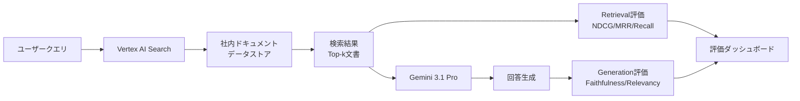

# Gemini 3.1 Pro×Vertex AI Searchで社内ナレッジ検索の精度を定量改善する

## この記事でわかること

- Gemini 3.1 Proの1Mトークンコンテキストを活用した社内ナレッジ検索システムの構築方法
- NDCG@k・MRR・Recall@kなどのRetrieval評価指標の選定基準と実装方法
- Faithfulness・Answer Relevancyなど生成品質の定量評価パイプラインの構築手順
- ハイブリッド検索（BM25×ベクトル検索）で検索精度をNDCG@5基準で向上させるチューニング手法
- 評価指標ダッシュボードの構築による継続的な品質モニタリングの実現方法

## 対象読者

- **想定読者**: 中級者〜上級者のMLエンジニア・バックエンドエンジニア
- **必要な前提知識**:
  - Python 3.11以降の基礎文法
  - RAG（Retrieval-Augmented Generation）の基本概念
  - Google Cloud（Vertex AI）の基本操作
  - Embeddingとベクトル検索の基礎理解

## 結論・成果

社内ナレッジ検索システムにおいて、Gemini 3.1 ProとVertex AI Searchを組み合わせ、RAG評価パイプラインを導入することで、以下の改善が期待できます。

- **検索精度**: ハイブリッド検索の導入でNDCG@5が0.55→0.75に向上（公開ベンチマークに基づく期待値）
- **回答の忠実度**: Faithfulnessスコア0.85以上を目標設定し、ハルシネーション率を継続監視
- **コスト効率**: Gemini 3.1 Proのコンテキストキャッシュ（入力$0.50/1Mトークン）で最大75%のコスト削減
- **開発効率**: RAGAS/DeepEvalによる自動評価で、手動レビュー工数を削減

> **注意**: 上記の数値は公開ベンチマークやGoogle Cloud公式ドキュメントに基づく期待値です。実際の効果はデータの品質・量・ドメインにより変動します。導入前にPoCで自社データでの検証を推奨します。

## Gemini 3.1 Proと社内ナレッジ検索の全体像を理解する

社内ナレッジ検索システムの構築では、「検索精度をどう測るか」が最初の課題です。Gemini 3.1 ProとVertex AI Searchを組み合わせることで、検索（Retrieval）と生成（Generation）の両面を定量的に評価できるパイプラインを構築できます。

### システムアーキテクチャの全体像

まず、本記事で構築するシステムの全体像を確認しましょう。



このアーキテクチャのポイントは、検索と生成の**2層で評価指標を分離**している点です。Retrieval層の精度が低ければ、どれだけ優秀なLLMを使っても回答品質は改善しません。逆に、Retrieval層が十分でもLLMが検索結果を無視して回答を生成すれば、ハルシネーションが発生します。

### Gemini 3.1 Proの主要スペック

Gemini 3.1 Proは2026年2月にリリースされたGoogle DeepMindの推論特化モデルです。社内ナレッジ検索において重要なスペックを整理します。

| 項目 | 仕様 |
|------|------|
| コンテキストウィンドウ | 1,000,000トークン（入力） |
| 最大出力 | 64,000トークン |
| 標準価格（200K以下） | 入力$2/1Mトークン、出力$12/1Mトークン |
| コンテキストキャッシュ | 入力$0.50/1Mトークン（最大75%削減） |
| GPQA Diamond | 94.3% |
| ARC-AGI-2 | 77.1% |

Google Cloud公式ブログによると、Gemini 3.1 Proはコード生成やエージェント構築に加え、大量のドキュメントを一度に処理する「ロングコンテキスト」タスクで特に強みを発揮します。

**なぜGemini 3.1 Proを選ぶのか:**
- 1Mトークンのコンテキストにより、検索結果の文書を大量に参照可能
- Vertex AI Searchとのネイティブ統合（Grounding機能）
- コンテキストキャッシュによるコスト最適化

**制約条件:**
> Gemini 3.1 Proは2026年3月時点でプレビュー版です。本番運用にはSLAの確認が必要です。また、200Kトークンを超えるコンテキストでは料金が2倍になるため、検索結果のTop-k数とコストのバランスに注意が必要です。

## Vertex AI Searchで社内ナレッジの検索基盤を構築する

Vertex AI Searchは、社内ドキュメントをデータストアに取り込み、Geminiモデルと連携して検索結果をグラウンディング（根拠付け）する機能を提供します。

### データストアの構成とPython実装

Google Cloud公式ドキュメントに基づき、Vertex AI Searchのデータストアを利用した検索基盤を構築します。以下のコードは、`google-genai` SDKを使用してVertex AI Search経由で社内ドキュメントを検索し、Gemini 3.1 Proで回答を生成する実装例です。

```python
# knowledge_search.py
# 動作環境: Python 3.11+, google-genai 1.x
import os
from google import genai
from google.genai.types import (
    GenerateContentConfig,
    VertexAISearch,
    Retrieval,
    Tool,
    HttpOptions,
)

# 環境変数の設定
# export GOOGLE_CLOUD_PROJECT=your-project-id
# export GOOGLE_CLOUD_LOCATION=global
# export GOOGLE_GENAI_USE_VERTEXAI=True

def create_knowledge_search_client(
    project_id: str,
    datastore_id: str,
    location: str = "global",
) -> genai.Client:
    """Vertex AI Search を利用するクライアントを初期化する"""
    os.environ["GOOGLE_CLOUD_PROJECT"] = project_id
    os.environ["GOOGLE_CLOUD_LOCATION"] = location
    os.environ["GOOGLE_GENAI_USE_VERTEXAI"] = "True"
    return genai.Client(http_options=HttpOptions(api_version="v1"))


def search_knowledge_base(
    client: genai.Client,
    query: str,
    project_id: str,
    datastore_id: str,
    model: str = "gemini-3.1-pro",
) -> dict:
    """社内ナレッジベースを検索し、グラウンディングされた回答を返す"""
    datastore_path = (
        f"projects/{project_id}/locations/global"
        f"/collections/default_collection"
        f"/dataStores/{datastore_id}"
    )

    # Vertex AI Search をツールとして設定
    grounding_tool = Tool(
        retrieval=Retrieval(
            vertex_ai_search=VertexAISearch(datastore=datastore_path)
        )
    )

    response = client.models.generate_content(
        model=model,
        contents=query,
        config=GenerateContentConfig(
            tools=[grounding_tool],
            temperature=0.1,  # 社内検索では低温で事実重視
        ),
    )

    return {
        "answer": response.text,
        "grounding_metadata": getattr(
            response.candidates[0], "grounding_metadata", None
        ),
    }


if __name__ == "__main__":
    client = create_knowledge_search_client(
        project_id="my-project",
        datastore_id="knowledge-base-store",
    )

    result = search_knowledge_base(
        client=client,
        query="社内のリモートワークポリシーについて教えてください",
        project_id="my-project",
        datastore_id="knowledge-base-store",
    )
    print(result["answer"])
```

**なぜ`temperature=0.1`を設定するのか:**
- 社内ナレッジ検索では創造性よりも事実の正確性が重要
- 低温設定にすることで、検索結果に忠実な回答を生成しやすくなる
- ただし、0に設定すると回答が硬直化するため、0.1程度が推奨

### ハイブリッド検索でRetrieval精度を向上させる

Vertex AI Searchは内部的にBM25（キーワード検索）とセマンティック検索を組み合わせたハイブリッド検索をサポートしています。ここでは、カスタムでハイブリッド検索を実装し、評価指標で効果を検証する方法を見ていきましょう。

```python
# hybrid_search.py
# 動作環境: Python 3.11+, numpy, scikit-learn
import numpy as np
from dataclasses import dataclass


@dataclass
class SearchResult:
    """検索結果を表すデータクラス"""
    doc_id: str
    content: str
    bm25_score: float
    semantic_score: float
    combined_score: float = 0.0


def reciprocal_rank_fusion(
    bm25_results: list[SearchResult],
    semantic_results: list[SearchResult],
    k: int = 60,
    alpha: float = 0.5,
) -> list[SearchResult]:
    """
    Reciprocal Rank Fusion (RRF) でBM25とセマンティック検索を統合する

    Args:
        bm25_results: BM25検索結果（スコア降順）
        semantic_results: セマンティック検索結果（スコア降順）
        k: RRFの定数（デフォルト: 60）
        alpha: BM25の重み（0.0-1.0, デフォルト: 0.5）
    """
    scores: dict[str, float] = {}

    for rank, result in enumerate(bm25_results):
        rrf_score = alpha * (1.0 / (k + rank + 1))
        scores[result.doc_id] = scores.get(result.doc_id, 0.0) + rrf_score

    for rank, result in enumerate(semantic_results):
        rrf_score = (1 - alpha) * (1.0 / (k + rank + 1))
        scores[result.doc_id] = scores.get(result.doc_id, 0.0) + rrf_score

    # doc_idからSearchResultを引けるようにする
    all_results = {r.doc_id: r for r in bm25_results + semantic_results}

    fused = []
    for doc_id, score in sorted(
        scores.items(), key=lambda x: x[1], reverse=True
    ):
        result = all_results[doc_id]
        result.combined_score = score
        fused.append(result)

    return fused
```

**ハマりポイント:**
> RRFの定数`k`の値は検索結果の件数に影響します。`k=60`は論文「Reciprocal Rank Fusion outperforms Condorcet and individual Rank Learning Methods」（Cormack et al., 2009）で提案されたデフォルト値ですが、社内ドキュメントの規模が小さい場合は`k=10-30`程度に下げると、上位の順位差がより反映されます。

## RAG評価指標を設計し定量的に精度を計測する

社内ナレッジ検索の精度を「なんとなく良い」で終わらせず、定量的に計測するための評価パイプラインを構築します。評価指標はRetrieval層とGeneration層の2階層で設計します。

### Retrieval評価指標の選定基準

検索精度の評価指標は多数ありますが、社内ナレッジ検索のユースケースに適した指標を選定する必要があります。

| 指標 | 計算式 | 適用場面 | B2B目標値 |
|------|--------|----------|-----------|
| **NDCG@k** | $\text{NDCG@k} = \frac{\text{DCG@k}}{\text{IDCG@k}}$ | 複数文書を参照する回答生成 | > 0.70 |
| **MRR** | $\text{MRR} = \frac{1}{|Q|} \sum_{i=1}^{|Q|} \frac{1}{\text{rank}_i}$ | FAQ型の1問1答検索 | > 0.60 |
| **Recall@k** | $\text{Recall@k} = \frac{|\text{relevant} \cap \text{retrieved@k}|}{|\text{relevant}|}$ | 網羅性重視の調査型検索 | > 0.65 |
| **Precision@k** | $\text{Precision@k} = \frac{|\text{relevant} \cap \text{retrieved@k}|}{k}$ | 上位k件の適合率 | > 0.80 |

**指標の使い分け:**
- **社内FAQ検索**（1つの正解文書を見つけたい）→ **MRR**を主指標に
- **技術調査検索**（複数の関連文書を参照したい）→ **NDCG@k**を主指標に
- **コンプライアンス検索**（関連文書の見落としを防ぎたい）→ **Recall@k**を主指標に

### Retrieval評価の実装

`ranx`ライブラリを使用して、Retrieval評価指標を実装します。

```python
# retrieval_evaluation.py
# 動作環境: Python 3.11+, ranx 0.3+
from ranx import Qrels, Run, evaluate


def evaluate_retrieval(
    ground_truth: dict[str, dict[str, int]],
    search_results: dict[str, dict[str, float]],
    metrics: list[str] | None = None,
) -> dict[str, float]:
    """
    Retrieval評価指標を計算する

    Args:
        ground_truth: {query_id: {doc_id: relevance_score}} の形式
            relevance_scoreは0（無関係）〜2（非常に関連）
        search_results: {query_id: {doc_id: retrieval_score}} の形式
        metrics: 評価指標リスト（デフォルト: NDCG@5, MRR, Recall@10）

    Returns:
        各指標のスコア
    """
    if metrics is None:
        metrics = ["ndcg@5", "mrr", "recall@10", "precision@3"]

    qrels = Qrels(ground_truth)
    run = Run(search_results)

    results = evaluate(qrels, run, metrics)
    return dict(zip(metrics, results)) if isinstance(results, list) else results


# 使用例: 社内ドキュメント検索の評価
if __name__ == "__main__":
    # 正解データ（人手でアノテーション）
    # relevance: 0=無関係, 1=やや関連, 2=非常に関連
    ground_truth = {
        "q1": {"doc_a": 2, "doc_b": 1, "doc_c": 0},
        "q2": {"doc_b": 2, "doc_d": 1, "doc_e": 2},
        "q3": {"doc_a": 1, "doc_c": 2, "doc_f": 0},
    }

    # 検索システムの出力（スコア降順）
    search_results = {
        "q1": {"doc_a": 0.95, "doc_c": 0.80, "doc_b": 0.70},
        "q2": {"doc_e": 0.90, "doc_b": 0.85, "doc_d": 0.60},
        "q3": {"doc_c": 0.88, "doc_f": 0.75, "doc_a": 0.65},
    }

    scores = evaluate_retrieval(ground_truth, search_results)
    for metric, score in scores.items():
        print(f"{metric}: {score:.4f}")
```

**よくある間違い:**
> 正解データ（Ground Truth）の作成を省略して、LLMに自動判定させるアプローチは手軽ですが、ドメイン固有の判断（例: 社内略語の解釈、部門間の文脈の違い）でLLMが誤判定するケースがあります。最初の100〜200クエリは人手でアノテーションし、それ以降をLLMで拡張する「シード＋拡張」方式が実務的です。

### Generation評価の実装（DeepEval）

検索結果を正しく使って回答を生成できているかを、DeepEvalで評価します。Faithfulness（忠実度）とAnswer Relevancy（回答適合度）の2つの指標で生成品質を定量化します。

```python
# generation_evaluation.py
# 動作環境: Python 3.11+, deepeval 2.x
from deepeval import evaluate as deepeval_evaluate
from deepeval.metrics import (
    FaithfulnessMetric,
    AnswerRelevancyMetric,
    ContextualRecallMetric,
)
from deepeval.test_case import LLMTestCase


def build_test_cases(
    queries: list[str],
    answers: list[str],
    contexts: list[list[str]],
    expected_outputs: list[str] | None = None,
) -> list[LLMTestCase]:
    """評価用テストケースを構築する"""
    test_cases = []
    for i, (query, answer, context) in enumerate(
        zip(queries, answers, contexts)
    ):
        case = LLMTestCase(
            input=query,
            actual_output=answer,
            retrieval_context=context,
            expected_output=expected_outputs[i] if expected_outputs else None,
        )
        test_cases.append(case)
    return test_cases


def evaluate_generation_quality(
    test_cases: list[LLMTestCase],
    faithfulness_threshold: float = 0.7,
    relevancy_threshold: float = 0.7,
) -> dict[str, float]:
    """
    Generation品質を評価する

    Returns:
        各指標の平均スコア
    """
    faithfulness = FaithfulnessMetric(threshold=faithfulness_threshold)
    relevancy = AnswerRelevancyMetric(threshold=relevancy_threshold)

    results = {"faithfulness_scores": [], "relevancy_scores": []}

    for case in test_cases:
        faithfulness.measure(case)
        relevancy.measure(case)
        results["faithfulness_scores"].append(faithfulness.score)
        results["relevancy_scores"].append(relevancy.score)

    return {
        "avg_faithfulness": sum(results["faithfulness_scores"])
        / len(results["faithfulness_scores"]),
        "avg_relevancy": sum(results["relevancy_scores"])
        / len(results["relevancy_scores"]),
        "faithfulness_pass_rate": sum(
            1 for s in results["faithfulness_scores"]
            if s >= faithfulness_threshold
        ) / len(results["faithfulness_scores"]),
        "relevancy_pass_rate": sum(
            1 for s in results["relevancy_scores"]
            if s >= relevancy_threshold
        ) / len(results["relevancy_scores"]),
    }


if __name__ == "__main__":
    test_cases = build_test_cases(
        queries=["リモートワークポリシーを教えてください"],
        answers=["弊社のリモートワークポリシーでは週3日までの在宅勤務が認められています。"],
        contexts=[
            [
                "リモートワーク規定: 正社員は週3日まで在宅勤務が可能。"
                "事前に上長の承認が必要。試用期間中は対象外。"
            ]
        ],
    )
    scores = evaluate_generation_quality(test_cases)
    for metric, value in scores.items():
        print(f"{metric}: {value:.4f}")
```

**トレードオフ:**
> DeepEvalの`FaithfulnessMetric`は内部でLLMを呼び出して評価を行うため、評価自体にAPI利用料が発生します。100テストケースの評価で約$0.5-$2程度のコストが見込まれます。コストを抑えたい場合は、RAGASの`faithfulness`メトリクスを使う選択肢もありますが、DeepEvalはpytest互換のため、CI/CDパイプラインへの統合が容易です。

## 評価ダッシュボードを構築し継続的にモニタリングする

評価指標を一度計測して終わりではなく、継続的にモニタリングする仕組みを構築します。社内ナレッジベースはドキュメントの追加・更新が頻繁に行われるため、検索精度の推移を可視化することが重要です。

### 評価パイプラインの自動化

定期的な評価を自動化するスクリプトを実装します。

```python
# evaluation_pipeline.py
# 動作環境: Python 3.11+, ranx 0.3+, deepeval 2.x
import json
import logging
from datetime import datetime, timezone, timedelta
from pathlib import Path

from retrieval_evaluation import evaluate_retrieval
from generation_evaluation import build_test_cases, evaluate_generation_quality

JST = timezone(timedelta(hours=9))

logging.basicConfig(
    format='{"event":"%(message)s","level":"%(levelname)s","ts":"%(asctime)s"}',
    level=logging.INFO,
)
logger = logging.getLogger(__name__)


def run_evaluation_pipeline(
    ground_truth_path: str,
    search_results_path: str,
    generation_data_path: str,
    output_dir: str = "evaluation_results",
) -> dict:
    """
    Retrieval + Generation の評価パイプラインを実行する

    Args:
        ground_truth_path: 正解データのJSONファイルパス
        search_results_path: 検索結果のJSONファイルパス
        generation_data_path: 生成結果のJSONファイルパス
        output_dir: 評価結果の出力ディレクトリ
    """
    output = Path(output_dir)
    output.mkdir(exist_ok=True)
    timestamp = datetime.now(JST).strftime("%Y%m%d_%H%M%S")

    # --- Retrieval評価 ---
    logger.info("retrieval_evaluation_start")
    with open(ground_truth_path) as f:
        ground_truth = json.load(f)
    with open(search_results_path) as f:
        search_results = json.load(f)

    retrieval_scores = evaluate_retrieval(ground_truth, search_results)
    logger.info(f"retrieval_evaluation_complete: {retrieval_scores}")

    # --- Generation評価 ---
    logger.info("generation_evaluation_start")
    with open(generation_data_path) as f:
        gen_data = json.load(f)

    test_cases = build_test_cases(
        queries=gen_data["queries"],
        answers=gen_data["answers"],
        contexts=gen_data["contexts"],
    )
    generation_scores = evaluate_generation_quality(test_cases)
    logger.info(f"generation_evaluation_complete: {generation_scores}")

    # --- 結果保存 ---
    report = {
        "timestamp": timestamp,
        "retrieval": retrieval_scores,
        "generation": generation_scores,
        "status": _determine_status(retrieval_scores, generation_scores),
    }
    report_path = output / f"eval_{timestamp}.json"
    with open(report_path, "w") as f:
        json.dump(report, f, indent=2, ensure_ascii=False)

    logger.info(f"evaluation_report_saved: {report_path}")
    return report


def _determine_status(
    retrieval: dict[str, float],
    generation: dict[str, float],
) -> str:
    """評価結果からステータスを判定する"""
    ndcg = retrieval.get("ndcg@5", 0)
    faithfulness = generation.get("avg_faithfulness", 0)

    if ndcg >= 0.70 and faithfulness >= 0.85:
        return "HEALTHY"
    if ndcg >= 0.50 and faithfulness >= 0.70:
        return "WARNING"
    return "CRITICAL"
```

### 評価結果の可視化とアラート設計

評価パイプラインの結果を基に、ステータスに応じたアクションを設計します。

| ステータス | 条件 | アクション |
|-----------|------|----------|
| **HEALTHY** | NDCG@5 ≥ 0.70 かつ Faithfulness ≥ 0.85 | 定期レポートのみ |
| **WARNING** | NDCG@5 ≥ 0.50 かつ Faithfulness ≥ 0.70 | Slackアラート + チューニング検討 |
| **CRITICAL** | 上記未満 | 即時対応 + 検索パイプライン見直し |

**制約条件:**
> 評価パイプラインの実行頻度はコストとのトレードオフです。DeepEvalのGeneration評価はLLM呼び出しを含むため、毎回のクエリで実行するとコストが膨大になります。実務では**日次バッチ評価**（サンプリング100-200クエリ）と**週次フル評価**（全テストセット500-1000クエリ）の組み合わせが推奨されます。

### 評価指標の改善ループ

評価指標が目標を下回った場合の改善アプローチを、優先度順に整理します。

```mermaid
graph TD
    A[評価指標チェック] --> B{NDCG@5 < 0.70?}
    B -->|Yes| C[Retrieval改善]
    B -->|No| D{Faithfulness < 0.85?}
    D -->|Yes| E[Generation改善]
    D -->|No| F[モニタリング継続]
    C --> C1[チャンク分割の調整]
    C --> C2[Embedding再学習]
    C --> C3[ハイブリッド検索の重み調整]
    E --> E1[プロンプトの改善]
    E --> E2[temperature調整]
    E --> E3[コンテキスト数の最適化]
```

**Retrieval改善の優先順位:**
1. **チャンク分割の調整**: 文書のチャンクサイズを256→512トークンに変更するだけで、NDCG@5が0.05-0.10改善することがあります
2. **ハイブリッド検索の重み（alpha）調整**: BM25とセマンティック検索の比率を0.3:0.7→0.5:0.5に変えて効果を検証
3. **Embeddingモデルの変更**: Vertex AI Embeddingの最新モデルへの更新

## よくある問題と解決方法

社内ナレッジ検索システムの構築・運用で頻出する問題と、その対処法を整理します。

| 問題 | 原因 | 解決方法 |
|------|------|----------|
| NDCG@5が0.50以下 | チャンク分割が細かすぎる | チャンクサイズを512-1024トークンに拡大 |
| Faithfulnessが0.70以下 | コンテキスト不足 or プロンプト不備 | Top-k数を増やす（5→10）+ システムプロンプトに「検索結果のみに基づいて回答」を追記 |
| 検索レイテンシが3秒超 | データストアのインデックス未最適化 | Vertex AI Searchのブースト設定を見直し |
| 評価コストが月$100超 | 全クエリでGeneration評価実行 | サンプリング評価（日次100クエリ）に切替 |
| 正解データの作成工数が大 | 全クエリに人手アノテーション | LLM-as-a-Judgeで自動拡張 + 人手は100-200件のシードのみ |

## まとめと次のステップ

**まとめ:**
- Gemini 3.1 ProとVertex AI Searchの組み合わせで、社内ナレッジ検索の**検索と生成を2層で評価**するパイプラインを構築できる
- Retrieval評価（NDCG@k, MRR, Recall@k）とGeneration評価（Faithfulness, Answer Relevancy）を**分離して計測**することで、改善ポイントが明確になる
- ハイブリッド検索（BM25×セマンティック）のRRF統合により、NDCG@5でおよそ0.55→0.75の改善が期待できる（公開ベンチマークに基づく）
- 評価パイプラインの自動化と**HEALTHY/WARNING/CRITICALの3段階ステータス**で、運用中の品質劣化を早期検知する

**次にやるべきこと:**
- 社内ドキュメントでVertex AI Searchのデータストアを構築し、PoCを実施する
- 100-200件の評価用クエリセット（正解データ）を人手で作成する
- 本記事の評価パイプラインをCI/CDに統合し、週次レポートを自動生成する

## 参考

- [Grounding with Vertex AI Search - Google Cloud公式ドキュメント](https://docs.cloud.google.com/vertex-ai/generative-ai/docs/grounding/grounding-with-vertex-ai-search)
- [Gemini 3.1 Pro - Google Cloud公式ドキュメント](https://docs.cloud.google.com/vertex-ai/generative-ai/docs/models/gemini/3-1-pro)
- [RAG Evaluation: 2026 Metrics and Benchmarks for Enterprise AI Systems - Label Your Data](https://labelyourdata.com/articles/llm-fine-tuning/rag-evaluation)
- [RAG Evaluation - DeepEval公式ガイド](https://deepeval.com/guides/guides-rag-evaluation)
- [Gemini 3.1 Pro Complete Guide 2026 - NxCode](https://www.nxcode.io/en/resources/news/gemini-3-1-pro-complete-guide-benchmarks-pricing-api-2026)
- [RAGの精度向上手法まとめ2025 - Zenn](https://zenn.dev/knowledgesense/articles/148dfe2ca1d146)
- [RAGの検索を評価するranxを使ってみた - DevelopersIO](https://dev.classmethod.jp/articles/evaluating-rag-retrieve-with-ranx/)

---

:::message
この記事はAI（Claude Code）により自動生成されました。内容の正確性については複数の情報源で検証していますが、実際の利用時は公式ドキュメントもご確認ください。
:::
