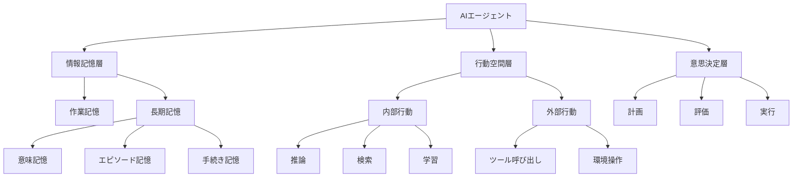
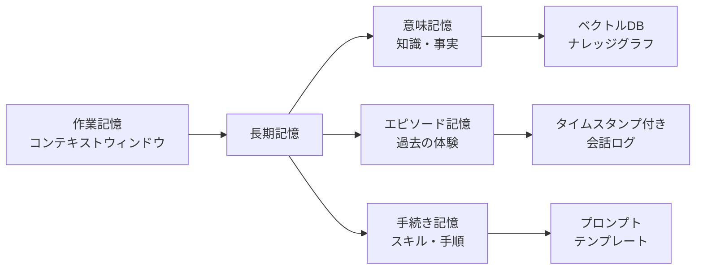
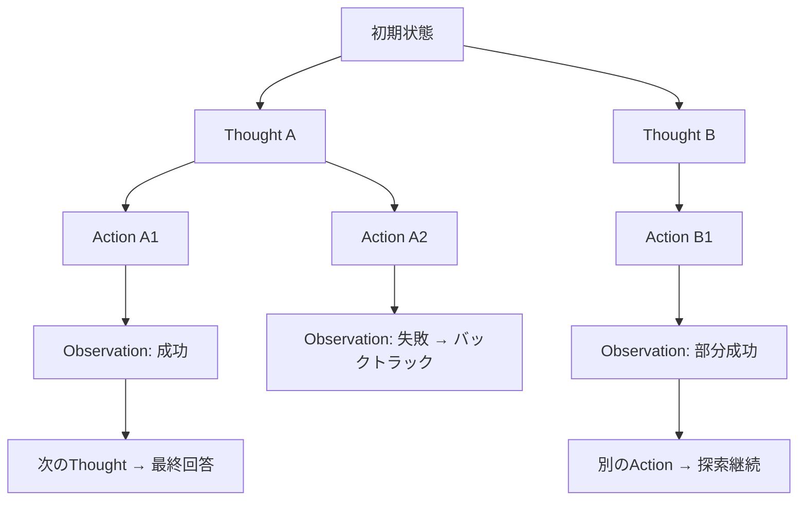
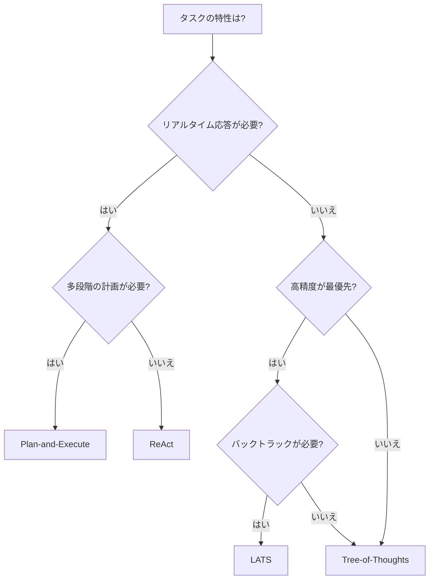
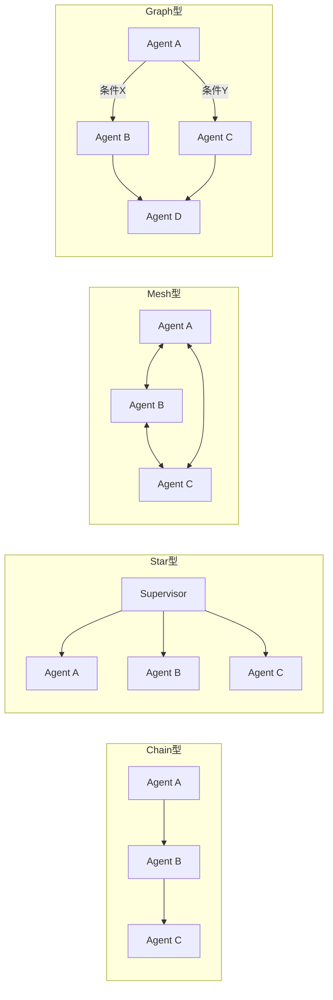

# AIエージェント内部アーキテクチャの最前線：認知・メモリ・推論の3層設計

## この記事でわかること

- CoALA（Cognitive Architectures for Language Agents）に基づくエージェント内部構造の全体像
- Pipeline-basedからModel-Nativeへのパラダイムシフトの技術的背景と実装への影響
- エピソード記憶・意味記憶・手続き記憶を統合するメモリ階層の設計パターン
- ReAct・Tree-of-Thoughts・LATSなど推論ループの使い分けと性能特性
- CLASSic（Cost, Latency, Accuracy, Security, Stability）評価フレームワークによるアーキテクチャ選定

## 対象読者

- **想定読者**: 中級〜上級のLLMアプリケーション開発者
- **必要な前提知識**:
  - Python 3.11+の非同期プログラミング基礎
  - LLMのAPI呼び出し（OpenAI API / Anthropic API）の基本
  - プロンプトエンジニアリングの基礎（Few-shot、Chain-of-Thought）

## 結論・成果

2026年のAIエージェントアーキテクチャは、**外部ロジックで計画・ツール使用・メモリを制御するPipeline-based型**から、**モデルパラメータ内にこれらの能力を内在化するModel-Native型**へと大きく移行しています。この移行により、たとえばLATS（Language Agent Tree Search）はHumanEvalでpass@1精度92.7%を達成し、従来のReActを上回る性能を報告しています（Zhou et al., ICML 2024）。一方で、階層的アーキテクチャではトークン消費が指数的に増加するトレードオフがあり、同期エージェントの成功率47%に対し非同期設定では11%に低下するという課題も指摘されています（Masterman et al., 2026）。

本記事では、エージェントの内部アーキテクチャを**認知構造・メモリ階層・推論ループ**の3層に分解し、それぞれの設計パターンと選定基準を体系的に整理します。

## エージェント認知アーキテクチャの全体像を理解する

AIエージェントの内部構造を理解するために、まずCoALA（Cognitive Architectures for Language Agents）フレームワークを見ていきましょう。2023年にSumers et al.が提案したこのフレームワークは、従来の認知アーキテクチャ（Soar、ACT-R）の知見をLLMエージェントに適用したものです。

### CoALAの3次元モデル

CoALAはエージェントを以下の3つの次元で整理します。



**情報記憶層**は、エージェントが「何を知っているか」を管理します。作業記憶（現在のコンテキスト）と長期記憶（永続化された知識・経験・スキル）で構成されます。

**行動空間層**は、エージェントが「何ができるか」を定義します。内部行動（推論・検索・学習）と外部行動（ツール呼び出し・環境操作）に分かれます。

**意思決定層**は、「何をすべきか」を決定するループです。候補行動の提案（計画）→ 評価 → 実行のサイクルを繰り返します。

### Pipeline-basedからModel-Nativeへのパラダイムシフト

2025年後半から2026年にかけて、エージェントアーキテクチャに大きなパラダイムシフトが起きています。「Beyond Pipelines」サーベイ（2025年10月）では、この変化を以下のように整理しています。

| 特性 | Pipeline-based | Model-Native |
|------|---------------|-------------|
| 計画（Planning） | 外部プランナー（PDDL）やCoTプロンプトで制御 | 強化学習でモデル内に内在化（o1, R1） |
| ツール使用 | 外部ロジックでAPI呼び出しを管理 | 推論プロセス内でツール呼び出しを学習（o3, K2） |
| メモリ | RAGやベクトルDBで外部管理 | コンテキスト管理自体をツールとして学習（MemAct） |
| 学習 | プロンプト改善やFine-tuning | 統一RLパイプライン（Base Model + RL + Task） |

**なぜこのシフトが重要か:**

Pipeline-based型では、計画・ツール使用・メモリそれぞれに専用の外部コンポーネントが必要でした。これは柔軟性と引き換えに、コンポーネント間の統合コストや障害点の増加を招きます。Model-Native型は統一的な学習パイプラインでこれらを内在化するため、コンポーネント間の整合性が向上します。

> **注意**: Model-Native型はまだ発展途上であり、2026年3月時点では多くの本番システムがPipeline-based型またはハイブリッド型です。特にエンタープライズ用途では、既存のRAGパイプラインやツール管理基盤を活かしたPipeline-based型が依然として主流です。

### 実装で見る2つのパラダイム

Pipeline-based型のエージェントは、外部ロジックでコンポーネントを組み立てます。

```python
# Pipeline-based型: 外部ロジックでツール呼び出しとメモリを制御
# Python 3.11+, openai>=1.60.0, chromadb>=0.5.0

from openai import OpenAI
import chromadb

client = OpenAI()
chroma = chromadb.Client()
collection = chroma.get_or_create_collection("knowledge")


def pipeline_agent(query: str) -> str:
    """Pipeline-based: 外部ロジックで各ステップを制御"""
    # Step 1: 外部メモリから検索（RAG）
    results = collection.query(query_texts=[query], n_results=3)
    context = "\n".join(results["documents"][0]) if results["documents"][0] else ""

    # Step 2: 外部ロジックでプロンプト構築
    messages = [
        {"role": "system", "content": f"参考情報:\n{context}"},
        {"role": "user", "content": query},
    ]

    # Step 3: ツール使用も外部定義
    tools = [
        {
            "type": "function",
            "function": {
                "name": "search_web",
                "description": "Web検索を実行",
                "parameters": {
                    "type": "object",
                    "properties": {"query": {"type": "string"}},
                },
            },
        }
    ]

    response = client.chat.completions.create(
        model="gpt-4o", messages=messages, tools=tools
    )
    return response.choices[0].message.content or ""
```

一方、Model-Native型に近い実装では、モデル自身が推論・ツール使用を統合的に処理します。

```python
# Model-Native寄りの実装: Responses APIでモデルがツール・検索を自律的に選択
# Python 3.11+, openai>=1.75.0

from openai import OpenAI

client = OpenAI()


def model_native_agent(query: str) -> str:
    """Model-Native寄り: モデルが推論内でツール選択を自律実行"""
    response = client.responses.create(
        model="o3",  # 推論モデルが計画・ツール使用を内在化
        input=query,
        tools=[
            {"type": "web_search_preview"},  # モデルが必要時に自律的に検索
            {"type": "code_interpreter"},  # コード実行も推論内で判断
        ],
    )
    return response.output_text
```

**この2つの実装の本質的な違い**は、「誰がオーケストレーションを担当するか」です。Pipeline-based型ではアプリケーションコードが制御フローを持ち、Model-Native型ではモデル自身が推論プロセスの一部としてツール選択や情報検索を行います。

## メモリ階層を設計する

エージェントのメモリ設計は、認知科学のEndel Tulving（1972年）による分類を基盤としています。2026年時点では、この分類をLLMエージェントに適用する具体的なパターンが確立されつつあります。

### 3種類の長期記憶とその実装パターン



| 記憶タイプ | 認知科学での定義 | LLMエージェントでの実装 | 代表的ツール |
|-----------|----------------|----------------------|------------|
| 意味記憶 | 世界に関する一般的知識 | ベクトルDB + ナレッジグラフ | Chroma, Pinecone, Neo4j |
| エピソード記憶 | 特定の体験の記録 | タイムスタンプ付き会話ログ | Letta (MemGPT), mem0 |
| 手続き記憶 | タスク遂行のスキル | プロンプトテンプレート、Fine-tuned重み | LangGraph Store, DSPy |

### Letta (MemGPT) のLLM-as-OSアーキテクチャ

Letta（旧MemGPT）は、**LLMをOSのプロセスに見立て、メモリ管理を仮想化する**アプローチを取っています。従来のOSがページングで物理メモリの制限を克服したように、LLMのコンテキストウィンドウの制限をメモリ階層で克服します。

```python
# Letta風のメモリ階層の概念的な実装
# Python 3.11+, pydantic>=2.0
from pydantic import BaseModel, Field
from datetime import datetime


class EpisodicMemory(BaseModel):
    """エピソード記憶: 過去の対話体験"""
    timestamp: datetime
    user_query: str
    agent_response: str
    outcome: str  # success / failure / partial
    lesson: str = ""


class SemanticMemory(BaseModel):
    """意味記憶: 蓄積された知識"""
    fact: str
    source: str
    confidence: float = Field(ge=0.0, le=1.0)


class MemoryManager:
    """OSのページングに相当するメモリ管理"""
    def __init__(self, context_limit: int = 128_000):
        self.context_limit = context_limit
        self.recent_messages: list[dict] = []
        self.episodic: list[EpisodicMemory] = []
        self.semantic: list[SemanticMemory] = []

    def should_evict(self, current_tokens: int) -> bool:
        """コンテキストウィンドウの80%を超えたらページアウト"""
        return current_tokens > self.context_limit * 0.8

    def evict_to_long_term(self) -> None:
        """作業記憶から長期記憶へ退避（ページアウト）"""
        if len(self.recent_messages) > 10:
            old = self.recent_messages[:5]
            self.recent_messages = self.recent_messages[5:]
            for msg in old:
                self.episodic.append(EpisodicMemory(
                    timestamp=datetime.now(),
                    user_query=msg.get("user", ""),
                    agent_response=msg.get("assistant", ""),
                    outcome="archived",
                ))
```

**なぜLLM-as-OSパラダイムが有効か:**
- コンテキストウィンドウが大きくなっても（Qwen-2.5-1Mなど128万トークン対応）、全情報を常にコンテキストに入れるとコスト・レイテンシが増大します
- ページング方式なら「必要な情報を必要な時に」ロードでき、トークンコストを制御できます

> **制約**: Lettaのメモリ管理はLLM自身の判断に依存するため、「何を忘れるべきか」の判断を誤ると重要な文脈が失われるリスクがあります。セキュリティ面では、長期メモリにPII（個人識別情報）が蓄積されるリスクも考慮が必要です。

### mem0の3レベルメモリアーキテクチャ

2026年1月時点で注目されているmem0は、**User/Session/Agent**の3つのスコープでメモリを管理します。

| スコープ | 永続性 | 用途 | 例 |
|---------|--------|------|-----|
| User | 永続 | ユーザー固有の嗜好・履歴 | 「このユーザーはPython派」 |
| Session | セッション単位 | 現在の会話コンテキスト | 「今はRAGの設計を議論中」 |
| Agent | 永続 | エージェント横断の共通知識 | 「社内のDB構成」 |

この3レベル設計により、パーソナライズされた応答（User）、文脈を保った対話（Session）、組織知識の活用（Agent）を同時に実現できます。

## 推論ループのアーキテクチャを選定する

推論ループ（Reasoning Loop）は、エージェントが「考えて、行動して、観察する」サイクルの設計パターンです。2026年時点で主要な4つのパターンを比較します。

### 4つの推論パターンの比較

| パターン | 探索方式 | レイテンシ | トークン消費 | 適用場面 |
|---------|---------|----------|------------|---------|
| ReAct | 線形（1パス） | 低 | 低 | 探索的タスク、対話型 |
| Plan-and-Execute | 2段階（計画→実行） | 中 | 中 | 明確な多段階タスク |
| Tree-of-Thoughts | 幅優先/深さ優先探索 | 高 | 高 | 創造的推論、複数解候補 |
| LATS | モンテカルロ木探索 | 高 | 高 | 複雑な多段階推論 |

### ReAct: 線形推論の基本パターン

ReAct（Reasoning + Acting）は、Thought → Action → Observationを1ステップずつ繰り返す直線的なパターンです。

```python
# ReActパターンの概念的な実装
# Python 3.11+, openai>=1.60.0
from openai import OpenAI

client = OpenAI()


def react_agent(query: str, tools: dict, max_steps: int = 5) -> str:
    """ReActエージェント: Thought→Action→Observationの線形ループ"""
    messages = [
        {"role": "system", "content": "Thought/Action/Observation形式で推論してください。"},
        {"role": "user", "content": query},
    ]
    for _ in range(max_steps):
        response = client.chat.completions.create(
            model="gpt-4o", messages=messages, temperature=0.0
        )
        content = response.choices[0].message.content or ""

        if "Final Answer:" in content:
            return content.split("Final Answer:")[-1].strip()

        # Action を解析して実行 → Observationとして追加
        if "Action:" in content:
            action = content.split("Action:")[-1].split("\n")[0].strip()
            if action in tools:
                observation = tools[action](query)
                messages.append({"role": "assistant", "content": content})
                messages.append({"role": "user", "content": f"Observation: {observation}"})

    return "最大ステップ数に達しました。"
```

**ReActの強み**: 実装がシンプルで、各ステップの推論過程が透明です。探索的なタスク（情報収集、対話型QA）に適しています。

**ReActの限界**: バックトラック（やり直し）ができません。最初のステップで誤った方向に進むと、そのまま誤った結論に到達するリスクがあります。

### LATS: 木探索による高精度推論

LATS（Language Agent Tree Search, ICML 2024）は、ReActの軌跡を状態ノードに分解し、モンテカルロ木探索（MCTS）で最適なパスを探索するパターンです。



```python
# LATSの核心: MCTSノードとUCB1によるSelection
# Python 3.11+
import math
from dataclasses import dataclass, field


@dataclass
class MCTSNode:
    """モンテカルロ木探索のノード"""

    state: str  # 現在の推論状態
    parent: "MCTSNode | None" = None
    children: list["MCTSNode"] = field(default_factory=list)
    visits: int = 0
    value: float = 0.0  # LLMによる自己評価スコア

    @property
    def ucb1(self) -> float:
        """Upper Confidence Bound: 探索と活用のバランス"""
        if self.visits == 0:
            return float("inf")
        parent_visits = self.parent.visits if self.parent else 1
        exploitation = self.value / self.visits
        exploration = math.sqrt(2 * math.log(parent_visits) / self.visits)
        return exploitation + exploration


# LATSのメインループ（概念）:
# 1. Selection: UCB1で最も有望なノードを選択
# 2. Expansion: LLMで候補アクションを生成（temperature=0.8で多様性確保）
# 3. Simulation: LLMで各候補を0-1で評価
# 4. Backpropagation: 評価スコアを親ノードに伝播
# → 十分高いスコア(>0.9)に達したら探索終了
```

**LATSの強み**: Zhou et al.（ICML 2024）の報告では、GPT-4を使用したHumanEvalでpass@1精度92.7%を達成しています。ReActと異なり、失敗したパスからバックトラックして別の解を探索できます。

**LATSのトレードオフ**: 木探索のために複数のLLM呼び出しが必要で、トークン消費量はReActの3〜10倍になる可能性があります。リアルタイム応答が求められるチャットボットには不向きです。

### 推論パターンの選定フローチャート

実際のプロジェクトでどのパターンを選ぶべきか、以下のフローチャートで判断できます。



## マルチエージェントトポロジーを設計する

2026年のマルチエージェントシステムでは、エージェント間の通信トポロジーが性能を大きく左右します。主要な4つのトポロジーを比較してみましょう。

### 4つの通信トポロジー



| トポロジー | 代表的実装 | 制御方式 | 強み | 弱み |
|-----------|-----------|---------|------|------|
| Chain | MetaGPT, ChatDev | 順次引き渡し | シンプル、デバッグしやすい | 並列化不可、ボトルネック |
| Star | AutoGen, OpenAI Swarm | 中央集権 | タスク分配が明確 | Supervisorが単一障害点 |
| Mesh | CAMEL, Generative Agents | 分散型 | 柔軟、創発的協調 | 通信コスト大、収束が困難 |
| Graph | LangGraph | 状態機械 | 条件分岐・ループ | 設計の複雑性 |

### 実装例: LangGraphのGraph型トポロジー

LangGraphは、エージェント間の通信を**有向グラフの状態遷移**として定義します。

```python
# LangGraphによるGraph型マルチエージェントの概念的な実装
# Python 3.11+, langgraph>=0.3.0

from typing import TypedDict, Literal
from langgraph.graph import StateGraph, END


class AgentState(TypedDict):
    """グラフ全体で共有される状態"""

    query: str
    research_result: str
    code_result: str
    review_result: str
    final_answer: str


def research_agent(state: AgentState) -> AgentState:
    """リサーチエージェント: 情報収集を担当"""
    # 実際にはLLM呼び出しで情報を収集
    state["research_result"] = f"リサーチ結果: {state['query']}に関する情報"
    return state


def coding_agent(state: AgentState) -> AgentState:
    """コーディングエージェント: 実装を担当"""
    state["code_result"] = f"実装結果: {state['research_result']}に基づくコード"
    return state


def review_agent(state: AgentState) -> AgentState:
    """レビューエージェント: 品質チェックを担当"""
    state["review_result"] = "PASS"  # or "NEEDS_REVISION"
    return state


def should_revise(state: AgentState) -> Literal["revise", "complete"]:
    """レビュー結果に基づいて分岐"""
    if state["review_result"] == "NEEDS_REVISION":
        return "revise"
    return "complete"


def build_multi_agent_graph() -> StateGraph:
    """Graph型マルチエージェントシステムの構築"""
    graph = StateGraph(AgentState)

    # ノード（エージェント）の追加
    graph.add_node("researcher", research_agent)
    graph.add_node("coder", coding_agent)
    graph.add_node("reviewer", review_agent)

    # エッジ（通信パス）の定義
    graph.set_entry_point("researcher")
    graph.add_edge("researcher", "coder")
    graph.add_edge("coder", "reviewer")

    # 条件分岐: レビュー結果で次のステップを決定
    graph.add_conditional_edges(
        "reviewer",
        should_revise,
        {"revise": "coder", "complete": END},  # ← 修正が必要ならcoderに戻る
    )

    return graph
```

**なぜGraph型が2026年に主流になっているか:**
- 条件分岐とループにより、エージェントの「やり直し」を自然に表現できます
- 各ノード（エージェント）が独立してテスト可能です
- 状態の永続化により、長時間実行タスクの中断・再開が容易です

**注意点:**
> Graph型はChain型やStar型より設計の初期コストが高くなります。3つ以上のエージェントが複雑に連携する場合に効果を発揮しますが、単純なタスクではChain型のほうが適切です。

### CLASSic評価フレームワークでアーキテクチャを評価する

2026年1月に提案されたCLASSicフレームワーク（Masterman et al.）は、エージェントアーキテクチャを5つの軸で評価します。

| 評価軸 | 定義 | 測定指標の例 |
|--------|------|------------|
| **C**ost | トークン消費とAPI呼び出し回数 | $/タスク、総トークン数 |
| **L**atency | 応答までの時間 | P50/P95レイテンシ |
| **A**ccuracy | タスク達成精度 | pass@1、成功率 |
| **S**ecurity | 安全性・プロンプトインジェクション耐性 | 攻撃成功率、権限逸脱率 |
| **S**tability | 出力の一貫性・障害モード | 分散、障害時の深刻度分布 |

**注目すべき知見**: Masterman et al.の報告では、同期エージェント（ステップ間で完了を待つ）の成功率が47%であるのに対し、非同期設定（並行実行）では11%に低下するとされています。これは、非同期実行での状態管理の難しさを示しています。

## よくある設計ミスとトラブルシューティング

エージェントアーキテクチャの設計で陥りやすい問題とその対処法を整理します。

| 問題 | 原因 | 解決方法 |
|------|------|----------|
| エージェントが無限ループする | 終了条件が不十分 / 自己評価が甘い | max_stepsの設定 + 状態のハッシュ比較でループ検出 |
| コンテキストウィンドウ溢れ | マルチエージェント間で中間結果が蓄積 | エージェント間で要約圧縮 + 選択的プルーニング |
| 非同期エージェントの成功率低下 | 状態の競合・整合性の崩れ | 共有状態の楽観的ロック + 最終的整合性の担保 |
| ハルシネーションによる不可逆な操作 | ツール呼び出しの検証不足 | サンドボックス実行 + 操作前の明示的確認ステップ |
| レイテンシが許容範囲を超える | 直列的なLLM呼び出しの連鎖 | 並列実行可能なステップの特定 + キャッシュ戦略 |

**よくある設計判断の失敗例**: 「すべてのエージェントにフルコンテキストを渡せば精度が上がる」と考えがちですが、実際にはコンテキストが膨張するとモデルの注意が分散し、精度がかえって低下します。「最小限の必要情報だけを渡す」設計のほうが、コスト・精度の両面で有利なケースが多いとされています。

## まとめと次のステップ

**まとめ:**

- **CoALAフレームワーク**により、エージェントの内部構造を情報記憶・行動空間・意思決定の3層で体系的に整理できます
- **Pipeline-based → Model-Native**のパラダイムシフトが進行中ですが、2026年3月時点の本番システムの多くはハイブリッド型です
- **メモリ階層**は認知科学の意味記憶・エピソード記憶・手続き記憶をベースに、Letta（MemGPT）やmem0で実装パターンが確立されつつあります
- **推論ループ**はReAct（低レイテンシ）からLATS（高精度）まで、タスク特性に応じた選択が重要です
- **CLASSicフレームワーク**のCost・Latency・Accuracy・Security・Stabilityの5軸で定量評価してからアーキテクチャを選定することを推奨します

**次にやるべきこと:**

- 自身のユースケースをCLASSicの5軸で要件定義し、適切な推論パターンを選定する
- 小規模なPoC（ReActから開始）を構築し、精度・レイテンシのベースラインを計測する
- メモリ階層の必要性を検証し、セッション記憶から段階的にエピソード記憶・意味記憶を追加する

## 参考

- [Cognitive Architectures for Language Agents (CoALA) — Sumers et al., 2023](https://arxiv.org/abs/2309.02427)
- [Beyond Pipelines: A Survey of the Paradigm Shift toward Model-Native Agentic AI — 2025](https://arxiv.org/html/2510.16720v1)
- [Agentic AI: Architectures, Taxonomies, and Evaluation — Masterman et al., 2026](https://arxiv.org/html/2601.12560v1)
- [Language Agent Tree Search (LATS) — Zhou et al., ICML 2024](https://arxiv.org/abs/2310.04406)
- [Letta (MemGPT) 公式ドキュメント](https://docs.letta.com/concepts/memgpt/)
- [AIエージェントのメモリ系プロジェクト比較（2026年1月）](https://zenn.dev/yasuhito/articles/ai-memory-projects-2026)
- [Agentic Design Patterns: The 2026 Guide — SitePoint](https://www.sitepoint.com/the-definitive-guide-to-agentic-design-patterns-in-2026/)
- [Microsoft AI Agent Orchestration Patterns — Azure Architecture Center](https://learn.microsoft.com/en-us/azure/architecture/ai-ml/guide/ai-agent-design-patterns)

---

## 関連する深掘り記事

この記事で紹介した技術について、さらに深掘りした記事を書きました：

- [論文解説: Reflexion — 言語エージェントのための言語的強化学習](https://0h-n0.github.io/posts/paper-reflexion-2303-17760/) - arxiv解説
- [論文解説: Working Memory for LLM Agents — 作業記憶の動的管理](https://0h-n0.github.io/posts/paper-working-memory-2402-18439/) - arxiv解説
- [論文解説: Agent Design Pattern Catalogue — 18アーキテクチャパターン](https://0h-n0.github.io/posts/paper-agent-design-patterns-2404-13712/) - arxiv解説
- [ACL 2024論文解説: When is Tree Search Useful for LLM Planning?](https://0h-n0.github.io/posts/conf-acl2024-tree-search-planning/) - conference解説
- [論文解説: Model-Native Agentic AI — パラダイムシフトの技術的分析](https://0h-n0.github.io/posts/paper-model-native-agentic-2503-04543/) - arxiv解説

:::message
これらの記事は修士学生レベルを想定した技術的詳細（数式・実装の深掘り）を含みます。
:::

---

:::message
この記事はAI（Claude Code）により自動生成されました。内容の正確性については複数の情報源で検証していますが、実際の利用時は公式ドキュメントもご確認ください。
:::
