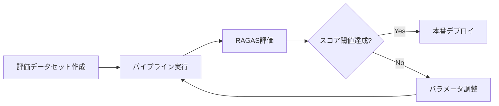

# Haystack 2.xで構築するQAパイプライン：抽出型・生成型・評価まで実装する

## この記事でわかること

- Haystack 2.25のパイプラインアーキテクチャと主要コンポーネントの役割
- 抽出型QA（ExtractiveReader）と生成型QA（RAG）の実装パターンと使い分け
- Qdrantを使った本番向けドキュメントストアの構築手順
- ハイブリッド検索（密ベクトル＋BM25）で検索精度を向上させる方法
- RAGAS連携による QAパイプラインの定量評価と改善サイクル

## 対象読者

- **想定読者**: 中級者のPythonエンジニアで、RAG/QAシステムを本番環境に導入したい方
- **必要な前提知識**:
  - Python 3.10以降の基本文法
  - LLM API（OpenAI / Azure OpenAI）の基本的な使い方
  - ベクトル検索の概念（Embeddingとは何か）の基本理解

## 結論・成果

Haystack 2.xのパイプラインアーキテクチャを活用することで、**抽出型QAでは質問に対する正確な箇所を信頼度スコア付きで特定**でき、**生成型QA（RAG）では検索結果を元に自然な回答を生成**できます。ハイブリッド検索（密ベクトル＋BM25のRRF統合）は、ベクトル検索単体と比較してRecall@10が向上することが複数のベンチマークで報告されています（改善幅はデータセットやドメインに依存します）。さらに、RAGAS評価パイプラインを組み込むことで、Faithfulness・Answer Relevancy・Context Precisionの3指標で品質を定量管理できます。

ただし、Haystackはパイプラインの柔軟性が高い分、コンポーネント間の接続設計に学習コストがかかります。LangChainやLlamaIndexと比べて「設定より明示」のアプローチを取るため、暗黙の動作が少ない反面、初期セットアップのコード量は多くなります。

## Haystack 2.xのアーキテクチャを理解する

Haystack 2.xは、deepset社が開発するオープンソースのAIオーケストレーションフレームワークです。2024年3月にv2.0が正式リリースされ、2026年2月時点でv2.25.1が最新版です。v1.xは2025年3月にEOL（End of Life）となり、現在はv2.x系のみがサポートされています。

### パイプラインの基本概念

Haystack 2.xのパイプラインは**有向マルチグラフ**として設計されています。これにより、単純な直列処理だけでなく、分岐・並列実行・ループといった複雑なフローを表現できます。

```python
# pipeline_basics.py
from haystack import Pipeline
from haystack.components.generators.chat import OpenAIChatGenerator
from haystack.components.builders import ChatPromptBuilder

# パイプラインの基本構造: add_component → connect → run
pipeline = Pipeline()
pipeline.add_component("prompt_builder", ChatPromptBuilder())
pipeline.add_component("llm", OpenAIChatGenerator(model="gpt-4o"))

# コンポーネント間を接続（出力名.入力名の形式）
pipeline.connect("prompt_builder.prompt", "llm.messages")
```

v1.xでは「Pipeline Node」と呼ばれていた概念がv2.xでは「Component」に統一され、すべてのComponentは入出力の型を明示的に定義します。この変更により、接続時の型チェックが厳密になり、実行前にミスマッチを検出できるようになりました。

**なぜこの設計か:**
- 型安全な接続により、実行前にパイプラインの不整合を検出できる
- コンポーネント単位でテスト・差し替えが容易
- YAML形式でシリアライズ可能なため、パイプライン定義をバージョン管理できる

### 主要コンポーネント一覧

Haystack 2.xのQAパイプラインで使用する主要コンポーネントを整理します。

| コンポーネント | 役割 | 主な実装クラス |
|---|---|---|
| Document Store | ドキュメントの永続化・検索 | `InMemoryDocumentStore`, `QdrantDocumentStore` |
| Embedder | テキスト→ベクトル変換 | `SentenceTransformersTextEmbedder`, `SentenceTransformersDocumentEmbedder` |
| Retriever | 関連ドキュメント検索 | `InMemoryEmbeddingRetriever`, `InMemoryBM25Retriever`, `QdrantEmbeddingRetriever` |
| Reader | テキスト中から回答を抽出 | `ExtractiveReader` |
| Prompt Builder | プロンプトテンプレート構築 | `ChatPromptBuilder`, `PromptBuilder` |
| Generator | LLMで回答生成 | `OpenAIChatGenerator`, `AzureOpenAIChatGenerator` |
| Writer | ドキュメントをストアに書き込み | `DocumentWriter` |
| Splitter | ドキュメントの分割 | `DocumentSplitter`, `MarkdownHeaderSplitter` |

**注意点:**
> v2.24以降では`MarkdownHeaderSplitter`が追加され、見出し単位でのドキュメント分割が可能になりました。Markdown形式の社内ドキュメントを扱う場合に有効ですが、見出し構造が不規則な文書では分割品質が低下する場合があります。

## 抽出型QAパイプラインを実装する

抽出型QAは、ドキュメント内から質問に対する回答箇所を**そのまま抜き出す**アプローチです。回答の根拠が明確なため、法務文書や技術仕様書など正確性が求められるユースケースに適しています。

### インデックスパイプラインの構築

まず、ドキュメントをベクトル化してストアに格納するインデックスパイプラインを構築します。

```python
# extractive_qa_indexing.py
from haystack import Document, Pipeline
from haystack.document_stores.in_memory import InMemoryDocumentStore
from haystack.components.embedders import SentenceTransformersDocumentEmbedder
from haystack.components.writers import DocumentWriter

# ドキュメントストアを初期化
document_store = InMemoryDocumentStore()

# インデックスパイプラインの構築
indexing_pipeline = Pipeline()
indexing_pipeline.add_component(
    "embedder",
    SentenceTransformersDocumentEmbedder(
        model="sentence-transformers/multi-qa-mpnet-base-dot-v1"
    ),
)
indexing_pipeline.add_component(
    "writer",
    DocumentWriter(document_store=document_store),
)
indexing_pipeline.connect("embedder.documents", "writer.documents")

# ドキュメントの投入
docs = [
    Document(
        content="Transformerは2017年にVaswaniらが提案した"
        "Attention機構に基づくニューラルネットワークアーキテクチャです。"
        "Self-Attentionにより、入力系列内の任意の位置間の依存関係を"
        "直接モデル化できます。"
    ),
    Document(
        content="BERTはGoogleが2018年に発表した事前学習言語モデルです。"
        "Masked Language ModelingとNext Sentence Predictionの"
        "2つのタスクで事前学習し、下流タスクにファインチューニングします。"
    ),
    Document(
        content="RAG（Retrieval-Augmented Generation）は、"
        "外部知識ベースから関連情報を検索し、LLMの生成に活用する手法です。"
        "2020年にMeta AI（当時Facebook AI Research）が提案しました。"
    ),
]

indexing_pipeline.run({"embedder": {"documents": docs}})
print(f"インデックス完了: {document_store.count_documents()}件")
```

**なぜ`multi-qa-mpnet-base-dot-v1`を選んだか:**
- QAタスクに最適化されたモデルで、質問-回答ペアの類似度計算に強い
- MS MARCO・Natural Questionsなどの大規模QAデータセットで学習済み
- 768次元の出力で、精度とストレージのバランスが取れている

### 抽出型QAクエリパイプラインの構築

次に、質問を受け取って回答を抽出するクエリパイプラインを構築します。

```python
# extractive_qa_query.py
from haystack import Pipeline
from haystack.components.embedders import SentenceTransformersTextEmbedder
from haystack.components.retrievers.in_memory import InMemoryEmbeddingRetriever
from haystack.components.readers import ExtractiveReader

# クエリパイプラインの構築
qa_pipeline = Pipeline()
qa_pipeline.add_component(
    "text_embedder",
    SentenceTransformersTextEmbedder(
        model="sentence-transformers/multi-qa-mpnet-base-dot-v1"
    ),
)
qa_pipeline.add_component(
    "retriever",
    InMemoryEmbeddingRetriever(document_store=document_store, top_k=3),
)
qa_pipeline.add_component(
    "reader",
    ExtractiveReader(model="deepset/roberta-base-squad2", top_k=3),
)

# 接続
qa_pipeline.connect("text_embedder.embedding", "retriever.query_embedding")
qa_pipeline.connect("retriever.documents", "reader.documents")

# 質問を実行
question = "RAGとは何ですか？"
result = qa_pipeline.run(
    {
        "text_embedder": {"text": question},
        "reader": {"query": question},
    }
)

# 結果の表示
for answer in result["reader"]["answers"]:
    print(f"回答: {answer.data}")
    print(f"信頼度: {answer.score:.3f}")
    print(f"出典: {answer.document.content[:80]}...")
    print("---")
```

`ExtractiveReader`は`ExtractedAnswer`オブジェクトを返します。各回答には`data`（抽出テキスト）、`score`（0-1の信頼度スコア）、`document`（出典ドキュメント）が含まれます。

**よくある間違い**: 最初はEmbedderとReaderに同じモデルを使おうと考えがちですが、Embedderはベクトル検索用（bi-encoder）、Readerは回答抽出用（cross-encoder系）で役割が異なります。`sentence-transformers`系のモデルをReaderに使っても、回答のスパン抽出はできません。

## 生成型QA（RAG）パイプラインを実装する

生成型QAは、検索結果をコンテキストとしてLLMに渡し、自然な文章で回答を生成します。抽出型と異なり、複数ドキュメントの情報を統合した回答や、要約的な回答が可能です。

### RAGパイプラインの構築

```python
# generative_qa_rag.py
from haystack import Pipeline
from haystack.components.embedders import SentenceTransformersTextEmbedder
from haystack.components.retrievers.in_memory import InMemoryEmbeddingRetriever
from haystack.components.builders import ChatPromptBuilder
from haystack.components.generators.chat import OpenAIChatGenerator
from haystack.dataclasses import ChatMessage

# プロンプトテンプレート定義
system_message = ChatMessage.from_system(
    "あなたは技術文書に基づいて質問に回答するアシスタントです。"
    "提供されたコンテキストの情報のみに基づいて回答してください。"
    "コンテキストに回答がない場合は「提供された情報では回答できません」と"
    "正直に伝えてください。"
)
user_message_template = ChatMessage.from_user(
    "コンテキスト:\n"
    "\n"
    "- {{ doc.content }}\n"
    "\n\n"
    "質問: {{ question }}\n"
    "回答:"
)

# RAGパイプラインの構築
rag_pipeline = Pipeline()
rag_pipeline.add_component(
    "text_embedder",
    SentenceTransformersTextEmbedder(
        model="sentence-transformers/multi-qa-mpnet-base-dot-v1"
    ),
)
rag_pipeline.add_component(
    "retriever",
    InMemoryEmbeddingRetriever(document_store=document_store, top_k=3),
)
rag_pipeline.add_component(
    "prompt_builder",
    ChatPromptBuilder(template=[system_message, user_message_template]),
)
rag_pipeline.add_component(
    "llm",
    OpenAIChatGenerator(model="gpt-4o"),
)

# 接続
rag_pipeline.connect("text_embedder.embedding", "retriever.query_embedding")
rag_pipeline.connect("retriever.documents", "prompt_builder.documents")
rag_pipeline.connect("prompt_builder.prompt", "llm.messages")

# 実行
question = "TransformerとBERTの関係を教えてください"
result = rag_pipeline.run(
    {
        "text_embedder": {"text": question},
        "prompt_builder": {"question": question},
    }
)

print(result["llm"]["replies"][0].text)
```

**なぜChatPromptBuilder + OpenAIChatGeneratorの組み合わせか:**
- `ChatPromptBuilder`はJinja2テンプレートを使い、動的にプロンプトを構築できる
- Chat形式のAPIに対応しており、system/user/assistantのロール分離が可能
- `PromptBuilder`（非Chat版）も存在するが、2026年時点ではChat APIが主流

### 抽出型と生成型の使い分け

| 観点 | 抽出型QA | 生成型QA（RAG） |
|------|----------|----------------|
| 回答形式 | ドキュメントからの引用 | 自然文の生成 |
| 根拠の明確性 | 高い（抽出箇所を特定） | 中（ハルシネーションリスクあり） |
| 複数情報の統合 | 不可 | 可能 |
| 外部API依存 | なし（ローカルモデル） | あり（LLM API） |
| レイテンシ | 低い（推論のみ） | 高い（API呼び出し） |
| コスト | 低い | トークン課金 |
| 適用シーン | FAQ、法務文書、技術仕様 | 社内ナレッジ検索、カスタマーサポート |

**トレードオフ**: 抽出型は正確だが「ドキュメントにそのまま書かれていない質問」には答えられません。生成型は柔軟だがハルシネーションのリスクがあり、Faithfulness評価が必要です。多くの本番システムでは、**抽出型で回答候補を特定 → 生成型で自然な文章に整形**するハイブリッドアプローチが採用されています。

## 本番向けドキュメントストアを構築する

`InMemoryDocumentStore`はプロトタイピングには便利ですが、本番環境ではスケーラビリティと永続性が求められます。ここではQdrantを使ったドキュメントストアの構築方法を紹介します。

### Qdrantとのインテグレーション

```python
# qdrant_document_store.py
from haystack_integrations.document_stores.qdrant import QdrantDocumentStore

# Qdrantドキュメントストア（ローカルモード）
document_store = QdrantDocumentStore(
    location=":memory:",  # テスト用。本番では url="http://localhost:6333"
    index="tech_documents",
    embedding_dim=768,  # multi-qa-mpnet-base-dot-v1の出力次元
    recreate_index=False,
    hnsw_config={"m": 16, "ef_construct": 100},  # 検索精度の調整
)
```

```bash
# Qdrantのインストール
pip install qdrant-haystack

# Docker でQdrantを起動（本番環境向け）
docker run -p 6333:6333 -v qdrant_data:/qdrant/storage qdrant/qdrant:latest
```

**なぜQdrantを選んだか:**
- Rust実装で高速、100万件規模のベクトル検索でも1桁msのレイテンシ
- Haystack公式インテグレーションとして密ベクトル・疎ベクトル・ハイブリッド検索をすべてサポート
- Docker / Qdrant Cloudの両方でデプロイ可能

**制約条件**: Qdrantはベクトル検索に特化しているため、全文検索（BM25）を併用する場合はElasticsearch/OpenSearchとの組み合わせか、Qdrantのスパースベクトル機能を使う必要があります。

### ハイブリッド検索の実装

密ベクトル検索とBM25スパース検索を組み合わせるハイブリッド検索は、検索精度の向上に有効です。Qdrantの`QdrantHybridRetriever`は、内部でReciprocal Rank Fusion（RRF）を使ってスコアを統合します。

```python
# hybrid_retrieval.py
from haystack import Pipeline
from haystack_integrations.components.retrievers.qdrant import (
    QdrantHybridRetriever,
)
from haystack.components.embedders import SentenceTransformersTextEmbedder
from haystack_integrations.components.embedders.fastembed import (
    FastembedSparseTextEmbedder,
)

# ハイブリッド検索パイプライン
hybrid_pipeline = Pipeline()

# 密ベクトル用Embedder
hybrid_pipeline.add_component(
    "dense_embedder",
    SentenceTransformersTextEmbedder(
        model="sentence-transformers/multi-qa-mpnet-base-dot-v1"
    ),
)

# 疎ベクトル用Embedder（BM25相当）
hybrid_pipeline.add_component(
    "sparse_embedder",
    FastembedSparseTextEmbedder(model_name="prithvida/Splade_PP_en_v1"),
)

# ハイブリッドRetriever（RRFで統合）
hybrid_pipeline.add_component(
    "retriever",
    QdrantHybridRetriever(document_store=document_store, top_k=5),
)

# 接続
hybrid_pipeline.connect(
    "dense_embedder.embedding", "retriever.query_embedding"
)
hybrid_pipeline.connect(
    "sparse_embedder.sparse_embedding", "retriever.query_sparse_embedding"
)
```

**ハイブリッド検索のメリット:**
- 密ベクトル: 意味的な類似度に強い（「犬」と「ペット」の関連を捉える）
- 疎ベクトル（BM25/SPLADE）: キーワードの完全一致に強い（固有名詞、型番）
- RRFで両者を統合することで、単体検索と比較してRecall@10が向上すると報告されている

**ハマりポイント**: ハイブリッド検索を使うには、インデックス時にもドキュメントに密ベクトルと疎ベクトルの両方を付与する必要があります。インデックスパイプラインにも`FastembedSparseDocumentEmbedder`を追加することを忘れないでください。

## QAパイプラインの品質を評価する

QAシステムの品質を「なんとなく良さそう」で終わらせると、本番で予期せぬ回答品質の低下に気づけません。RAGAS（Retrieval Augmented Generation Assessment）を使って定量評価を組み込みましょう。

### RAGAS評価パイプラインの構築

```python
# ragas_evaluation.py
from haystack import Pipeline
from haystack_integrations.components.evaluators.ragas import (
    RagasEvaluator,
    RagasMetric,
)

# 評価パイプラインの構築
eval_pipeline = Pipeline()

# Faithfulness: 生成された回答がコンテキストに基づいているか
eval_pipeline.add_component(
    "faithfulness_evaluator",
    RagasEvaluator(metric=RagasMetric.FAITHFULNESS),
)

# Answer Relevancy: 回答が質問に対して関連性があるか
eval_pipeline.add_component(
    "relevancy_evaluator",
    RagasEvaluator(metric=RagasMetric.ANSWER_RELEVANCY),
)

# Context Precision: 検索結果に正解の根拠が含まれているか
eval_pipeline.add_component(
    "precision_evaluator",
    RagasEvaluator(metric=RagasMetric.CONTEXT_PRECISION),
)

# 評価の実行例
eval_result = eval_pipeline.run(
    {
        "faithfulness_evaluator": {
            "questions": ["RAGとは何ですか？"],
            "contexts": [
                [
                    "RAG（Retrieval-Augmented Generation）は、"
                    "外部知識ベースから関連情報を検索し、"
                    "LLMの生成に活用する手法です。"
                ]
            ],
            "responses": [
                "RAGは外部知識ベースから情報を検索してLLMの生成に"
                "活用する手法です。"
            ],
        },
        "relevancy_evaluator": {
            "questions": ["RAGとは何ですか？"],
            "contexts": [
                [
                    "RAG（Retrieval-Augmented Generation）は、"
                    "外部知識ベースから関連情報を検索し、"
                    "LLMの生成に活用する手法です。"
                ]
            ],
            "responses": [
                "RAGは外部知識ベースから情報を検索してLLMの生成に"
                "活用する手法です。"
            ],
        },
        "precision_evaluator": {
            "questions": ["RAGとは何ですか？"],
            "contexts": [
                [
                    "RAG（Retrieval-Augmented Generation）は、"
                    "外部知識ベースから関連情報を検索し、"
                    "LLMの生成に活用する手法です。"
                ]
            ],
            "responses": [
                "RAGは外部知識ベースから情報を検索してLLMの生成に"
                "活用する手法です。"
            ],
        },
    }
)

# 結果の確認
for metric_name in [
    "faithfulness_evaluator",
    "relevancy_evaluator",
    "precision_evaluator",
]:
    scores = eval_result[metric_name]["results"]
    print(f"{metric_name}: {scores}")
```

```bash
# RAGAS統合パッケージのインストール
pip install ragas-haystack
```

### 評価指標の解釈

| 指標 | 評価対象 | 低スコア時の改善策 |
|------|----------|-------------------|
| Faithfulness | 回答がコンテキストに忠実か | プロンプトに「コンテキスト外の情報を使わない」制約を追加 |
| Answer Relevancy | 回答が質問に関連するか | Retrieverのtop_kを増やす、リランキングを追加 |
| Context Precision | 検索結果に正解根拠が含まれるか | Embeddingモデルの変更、チャンク戦略の見直し |

**制約条件**: RAGASの評価自体がLLM（GPT-4oなど）を使うため、評価にもAPIコストがかかります。大量の評価を回す場合はコスト管理が必要です。公式ドキュメントによると、100件の評価で約$0.5-1.0程度のコストが見込まれます。

### 評価駆動の改善サイクル

QAパイプラインの継続的な改善は、以下のサイクルで回します。



1. **評価データセットの作成**: 質問-回答-コンテキストの組を50-100件準備
2. **ベースライン計測**: 現在のパイプラインで各指標を計測
3. **パラメータ調整**: top_k、チャンクサイズ、Embeddingモデルを変更
4. **再評価**: 改善効果を定量的に確認
5. **閾値判定**: Faithfulness ≥ 0.8、Answer Relevancy ≥ 0.7を目安に本番デプロイ

## よくある問題と解決方法

| 問題 | 原因 | 解決方法 |
|------|------|----------|
| `ValueError: Component input types don't match` | Embedderの出力次元とDocument Storeの`embedding_dim`が不一致 | 両者で同じモデル・次元数を指定する |
| Retrieverの検索結果が的外れ | チャンクが大きすぎて関連箇所が埋もれている | `DocumentSplitter`のチャンクサイズを200-500トークンに調整 |
| ExtractiveReaderのスコアが低い | 質問の言語とモデルの学習データが不一致 | 日本語QAには`tobiascz/xlm-roberta-squad2-ja`等の多言語モデルを使用 |
| RAGの回答にハルシネーションが含まれる | プロンプトの制約が弱い | system messageに「コンテキスト外の情報は使用禁止」を明記 |
| パイプラインの実行が遅い | Embeddingの計算がボトルネック | `AsyncPipeline`を使って並列実行、またはGPUを利用 |
| Qdrant接続エラー | ネットワーク設定 or ポートの競合 | `docker ps`でコンテナ状態を確認、ポート6333の開放を確認 |

## まとめと次のステップ

**まとめ:**
- Haystack 2.25は**パイプラインベースのコンポーネント設計**で、QAシステムの各要素を明示的に組み合わせて構築できる
- **抽出型QA**は`ExtractiveReader`で回答箇所を特定し、根拠の明確性が求められるユースケースに適する
- **生成型QA（RAG）**は`ChatPromptBuilder` + `OpenAIChatGenerator`で自然な回答を生成し、複数ドキュメントの情報統合が可能
- **ハイブリッド検索**（密ベクトル＋BM25/SPLADE）で検索精度を向上できる
- **RAGAS評価パイプライン**でFaithfulness・Answer Relevancy・Context Precisionを定量管理し、改善サイクルを回せる

**次にやるべきこと:**
- [公式チュートリアル](https://haystack.deepset.ai/tutorials)で基本パイプラインを動かしてみる
- Qdrant Cloudの無料枠でドキュメントストアを構築し、本番に近い環境で検証する
- RAGAS評価データセットを自社のFAQデータから作成し、ベースラインを計測する

**関連記事**: [Haystack活用パターン完全ガイド：本番運用可能なRAG・AIエージェント構築](https://zenn.dev/0h_n0/articles/cdce83308fafd9) — Haystackの全体像と各種パターンの比較を解説

## 参考

- [Haystack公式ドキュメント: Creating Your First QA Pipeline](https://haystack.deepset.ai/tutorials/01_basic_qa_pipeline)
- [Haystack公式ドキュメント: Build an Extractive QA Pipeline](https://haystack.deepset.ai/tutorials/34_extractive_qa_pipeline)
- [Haystack公式ドキュメント: Evaluating RAG Pipelines](https://haystack.deepset.ai/tutorials/35_evaluating_rag_pipelines)
- [Haystack公式ドキュメント: Pipelines](https://docs.haystack.deepset.ai/docs/pipelines)
- [Qdrant-Haystack Integration](https://haystack.deepset.ai/integrations/qdrant-document-store)
- [RAGAS-Haystack Integration](https://haystack.deepset.ai/integrations/ragas)
- [Haystack GitHub リポジトリ](https://github.com/deepset-ai/haystack)
- [Haystack Release Notes](https://haystack.deepset.ai/release-notes)

---

:::message
この記事はAI（Claude Code）により自動生成されました。内容の正確性については複数の情報源で検証していますが、実際の利用時は公式ドキュメントもご確認ください。
:::
