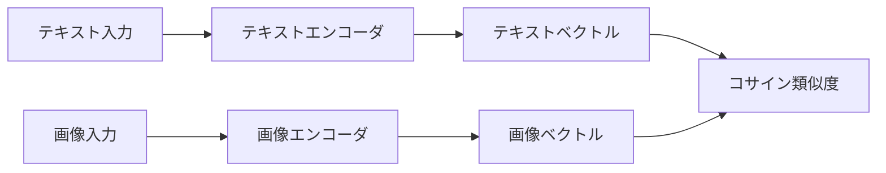
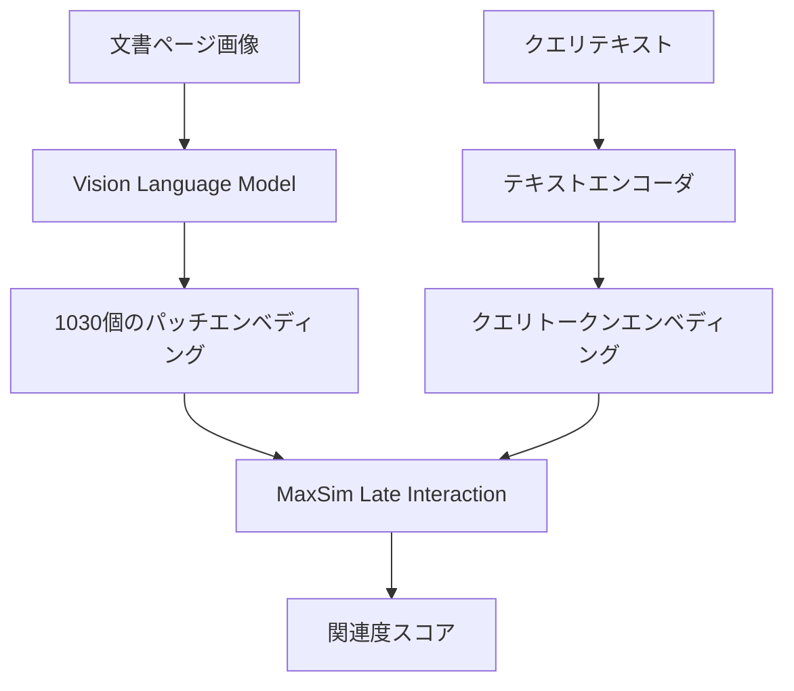
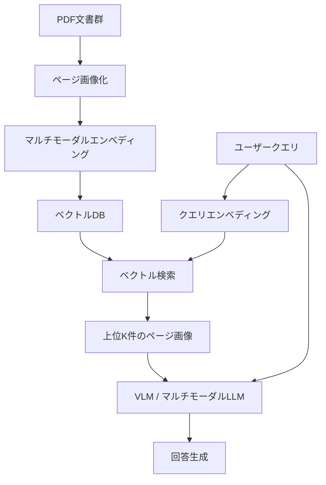

# マルチモーダルエンベディング最前線：CLIPからColPaliまでの進化とRAG応用

## この記事でわかること

- テキスト・画像・動画・音声を統一ベクトル空間に変換する**マルチモーダルエンベディング**の仕組みと3つのアーキテクチャの違い
- 2025-2026年の主要モデル（Cohere Embed 4、Nomic Embed Multimodal、Amazon Nova、ColPali/ColQwen2）の特徴とベンチマーク比較
- **Matryoshka表現学習**による可変次元エンベディングのストレージ・精度トレードオフ制御
- マルチモーダルRAGパイプラインの実装方法とテキストのみのRAGとの精度差
- Promptable Embeddings（命令付きエンベディング）による検索精度の向上手法

## 対象読者

- **想定読者**: 中級者以上のMLエンジニア・バックエンドエンジニア
- **必要な前提知識**:
  - Python 3.11+の基本文法
  - ベクトル検索・コサイン類似度の基本概念
  - RAG（Retrieval-Augmented Generation）の基本的な仕組み
  - Transformerアーキテクチャの概要理解

## 結論・成果

マルチモーダルエンベディングは、2021年のCLIP登場以降、2025年にかけて「統一型ファウンデーションモデル」へと進化しました。Cohere Embed 4のベンチマークでは、テキスト・画像・混合モダリティの検索でSoTA精度を達成し、Matryoshka表現学習により256次元まで圧縮してもNDCG@10で5%未満の精度低下に抑えられると報告されています。ColPali系のLate Interactionモデルは、ViDoRe-v2ベンチマークでNDCG@5 62.7を達成し、OCRなしで文書検索の精度を大幅に改善しています。マルチモーダルRAGへの応用では、図表やグラフを含む文書の質問応答でテキストのみのRAGに比べて回答精度の向上が報告されています。

## CLIPから統一型モデルへ：アーキテクチャの進化を理解する

2021年にOpenAIが発表したCLIP（Contrastive Language-Image Pretraining）は、4億のテキスト-画像ペアで学習した対照学習モデルであり、マルチモーダルエンベディングの基盤を築きました。しかし、CLIPにはテキストトークン長が77トークンに制限される、構成的な理解（「赤い帽子の犬」と「犬の帽子の赤」の区別）が苦手、モダリティギャップ（テキストと画像のエンベディング空間に幾何学的な分離が生じる）といった課題がありました。

2023年から2025年にかけて、これらの課題を克服する3つのアーキテクチャが登場しています。

### 対照学習（Contrastive Learning）：CLIP系の正統進化

CLIP系モデルは、テキストと画像をそれぞれ独立したエンコーダで処理し、対照学習の損失関数でマッチするペアの距離を近づけます。



SigLIP 2（Google DeepMind, 2024）は、CLIPのsoftmax対照損失をsigmoid損失に置き換えることで、バッチ内のすべてのペアを独立に評価できるようになりました。これにより、大規模バッチでの学習効率が向上し、テキスト-画像の整合性が改善されています。

**制約**: 対照学習モデルはモダリティごとに1つの密ベクトルを生成するため、テキストから画像への検索（T2I）と画像からテキストへの検索（I2T）の間に16〜24ポイントの精度差が生じると報告されています。

### Late Interaction：ColPali/ColQwen2の文書検索アプローチ

ColPali（2024年）は、PaliGemmaベースのVision Language Modelを使い、文書ページを画像としてそのまま処理する方式を導入しました。従来のOCR→テキスト抽出→エンベディングのパイプラインを、画像→パッチエンベディング→Late Interactionに置き換えています。



Late Interactionの核心は**MaxSim演算**です。クエリの各トークンエンベディングと文書の各パッチエンベディングの類似度を計算し、クエリトークンごとの最大類似度を合計します。

$$
\text{Score}(q, d) = \sum_{i=1}^{|q|} \max_{j=1}^{|d|} q_i \cdot d_j^T
$$

ここで $q_i$ はクエリの $i$ 番目のトークンエンベディング、$d_j$ は文書の $j$ 番目のパッチエンベディングです。

ColQwen2はQwen2-VLベースに改良され、**任意の解像度・アスペクト比**の画像を固定サイズにリサイズせずに処理できるようになりました。これにより、表やグラフなど細かい視覚情報の保持が向上しています。

2026年2月にはNVIDIAのNemotron ColEmbed V2がViDoRe V3リーダーボードでNDCG@10 63.42を達成し、クラスタベースサンプリングとハードネガティブマイニングを組み合わせた学習手法が報告されています。

**注意点:**
> Late Interactionモデルは、文書ごとに1000以上のベクトルを保存する必要があるため、Denseモデルに比べてストレージコストが大幅に増加します。100万ページの文書コレクションでは、768次元のDenseエンベディングに比べて約1000倍のストレージが必要になります。

### Promptable Embeddings：命令付きエンベディングの登場

2025年のエンベディング技術における重要な革新が**Promptable Embeddings**です。従来のモデルは入力コンテンツに対して固定のベクトルを生成していましたが、Promptable Embeddingsでは**命令（instruction）**と**コンテンツ**の両方を入力として受け取り、タスクに最適化されたベクトルを生成します。

```python
# Promptable Embeddingsの概念例
# 同じ画像に対して異なる命令で異なるエンベディングを生成

from cohere import ClientV2

co = ClientV2(api_key="YOUR_API_KEY")

# 同一の製品画像に対して異なる検索意図のエンベディング
image_url = "https://example.com/product.jpg"

# 類似製品検索用
response_product = co.embed(
    model="embed-v4.0",
    input_type="search_document",
    embedding_types=["float"],
    texts=["Find similar products to this item"],
    images=[image_url],
)

# 色・スタイル検索用
response_style = co.embed(
    model="embed-v4.0",
    input_type="search_document",
    embedding_types=["float"],
    texts=["Find items with similar color and style"],
    images=[image_url],
)

# 2つのエンベディングは同じ画像から生成されるが、
# 検索意図に応じて異なるベクトル表現になる
```

この仕組みにより、1つのモデルで分類・検索・クラスタリングなど複数のタスクに対応でき、タスクごとにモデルを切り替える必要がなくなります。

## 2025-2026年の主要モデルを比較する

現在利用可能なマルチモーダルエンベディングモデルの中から、主要な4モデルの特徴を比較します。

### モデル比較表

| 項目 | Cohere Embed 4 | Nomic Embed Multimodal 7B | Amazon Nova | ColPali/ColQwen2 |
|------|---------------|--------------------------|-------------|-----------------|
| 対応モダリティ | テキスト+画像 | テキスト+画像 | テキスト+画像+動画+音声 | テキスト+画像（文書） |
| アーキテクチャ | Dense（単一ベクトル） | Dense/Late Interaction | Dense（単一ベクトル） | Late Interaction |
| 最大次元数 | 1536 | 768 | 3072 | 128（パッチ×1030） |
| Matryoshka対応 | 256/512/1024/1536 | 対応 | 256/384/1024/3072 | 非対応 |
| コンテキスト長 | 128Kトークン | 8Kトークン | 8192トークン | 画像全体 |
| 多言語対応 | 100+言語 | 多言語 | 多言語 | 限定的 |
| オープンソース | 非公開 | 公開（Apache 2.0） | 非公開 | 公開（MIT） |
| 提供形態 | API/AWS/Azure | Hugging Face | AWS Bedrock | Hugging Face |

### Cohere Embed 4：商用SoTAモデル

2025年4月にリリースされたCohere Embed 4は、テキスト-テキスト、テキスト-画像、テキスト-混合モダリティの検索でSoTA精度を達成したと報告されています。テキストと画像のインターリーブ入力をネイティブで処理でき、表・グラフ・図・手書きメモを含む文書を直接エンベディング化できます。

128Kトークンのコンテキスト長は、長文書の分割なしでの処理を可能にし、チャンキング戦略の複雑さを軽減します。Matryoshka表現学習により、256次元から1536次元まで用途に応じた次元数を選択でき、ストレージコストと検索精度のバランスを調整できます。

### Nomic Embed Multimodal：オープンソースの選択肢

Nomic AIが2025年4月にリリースした**Nomic Embed Multimodal**は、Qwen2.5-VLをベースにした4つのモデルバリアントを提供しています。

- **ColNomic Embed Multimodal 7B**: ViDoRe-v2でNDCG@5 62.7（Late Interaction方式）
- **ColNomic Embed Multimodal 3B**: ViDoRe-v2でNDCG@5 61.2
- **Nomic Embed Multimodal 7B**: ViDoRe-v2でNDCG@5 58.8（Dense方式）
- **Nomic Embed Multimodal 3B**: ViDoRe-v2でNDCG@5 58.8

```python
# Nomic Embed Multimodalの使用例
from transformers import AutoModel, AutoProcessor
import torch

# モデルとプロセッサの読み込み
model = AutoModel.from_pretrained(
    "nomic-ai/nomic-embed-multimodal-7b",
    trust_remote_code=True,
    torch_dtype=torch.bfloat16,
)
processor = AutoProcessor.from_pretrained(
    "nomic-ai/nomic-embed-multimodal-7b",
    trust_remote_code=True,
)

# テキストエンベディング
text_inputs = processor(
    text=["RAGパイプラインの設計パターン"],
    return_tensors="pt",
    padding=True,
)
with torch.no_grad():
    text_embeddings = model(**text_inputs).last_hidden_state.mean(dim=1)

# 画像エンベディング（PDFページを画像として処理）
from PIL import Image
image = Image.open("document_page.png")
image_inputs = processor(
    images=[image],
    return_tensors="pt",
)
with torch.no_grad():
    image_embeddings = model(**image_inputs).last_hidden_state.mean(dim=1)

# コサイン類似度で検索
similarity = torch.nn.functional.cosine_similarity(
    text_embeddings, image_embeddings
)
print(f"テキスト-画像類似度: {similarity.item():.4f}")
```

オープンソース（Apache 2.0）であるため、オンプレミス環境やプライバシー要件の厳しいユースケースに適しています。

### Amazon Nova Multimodal Embeddings：5モダリティ統一

2025年10月にAWS Bedrockで提供開始されたAmazon Novaは、**テキスト・画像・文書・動画・音声の5モダリティ**を単一モデルで処理できる点が特徴です。動画や音声は最大30秒のセグメントとして処理され、長い入力は自動的に分割されます。

256/384/1024/3072の4つの次元数を選択でき、用途に応じたコスト最適化が可能です。Amazon Bedrock Knowledge Basesとの統合により、マルチモーダルRAGパイプラインを比較的少ないコードで構築できます。

**制約**: 動画・音声の30秒制限は、長時間コンテンツの検索には追加の分割ロジックが必要になります。また、AWS Bedrockのみでの提供であるため、他のクラウドやオンプレミスでの利用はできません。

## Matryoshka表現学習で次元数を柔軟に制御する

**Matryoshka Representation Learning（MRL）**は、1つのモデルから異なる次元数のエンベディングを取り出せる学習手法です。名前の由来はロシアのマトリョーシカ人形で、大きな次元のエンベディングの先頭部分を切り詰めても、その次元数に最適化された表現が得られます。

### MRLの仕組み

学習時に、エンベディングの先頭 $d'$ 次元（$d' \in \{64, 128, 256, 512, ...\}$）ごとに損失を計算し、すべての次元数で同時に最適化します。

$$
\mathcal{L}_{\text{MRL}} = \sum_{d' \in \mathcal{D}} \alpha_{d'} \cdot \mathcal{L}_{\text{task}}(\mathbf{z}_{1:d'})
$$

ここで $\mathcal{D}$ は対象次元数の集合、$\alpha_{d'}$ は各次元数の重み、$\mathbf{z}_{1:d'}$ はエンベディングの先頭 $d'$ 次元です。

### 精度とストレージのトレードオフ

MRLの論文では、ImageNet-1K分類タスクにおいて以下のトレードオフが報告されています。

| 次元数 | ストレージ（対2048次元比） | ImageNet-1K精度維持率 |
|--------|--------------------------|----------------------|
| 2048   | 100%                     | 100%                |
| 1024   | 50%                      | 約99.5%             |
| 256    | 12.5%                    | 約98%               |
| 64     | 3.1%                     | 約95%               |

2025年には**SMEC（Sequential Matryoshka Embedding Compression）**が提案され、学習時の勾配分散を低減するSequential MRL手法と、次元削減時の情報劣化を抑えるAdaptive Dimension Selection（ADS）モジュールが導入されました。EMNLP 2025で発表されたこの手法により、BEIRデータセットで256次元に圧縮したLLM2Vecエンベディングの性能が従来のMRL手法に比べて1.1ポイント改善されたと報告されています。

```python
# Matryoshka Embeddingsの使用例（Cohere Embed 4）
from cohere import ClientV2
import numpy as np

co = ClientV2(api_key="YOUR_API_KEY")

documents = [
    "Transformerアーキテクチャは自己注意機構を用いて並列処理を実現する",
    "BERTは双方向のコンテキスト理解を実現した事前学習モデルである",
    "GPTは自己回帰型の言語モデルでテキスト生成に特化している",
]

# 全次元（1536次元）でエンベディング取得
response_full = co.embed(
    model="embed-v4.0",
    input_type="search_document",
    embedding_types=["float"],
    texts=documents,
)
embeddings_full = np.array(response_full.embeddings.float)

# 256次元に削減して使用（Matryoshka対応）
# 先頭256次元を切り出すだけで利用可能
embeddings_compact = embeddings_full[:, :256]

# L2正規化（切り詰め後は再正規化が必要）
embeddings_compact = embeddings_compact / np.linalg.norm(
    embeddings_compact, axis=1, keepdims=True
)

print(f"全次元: {embeddings_full.shape}")      # (3, 1536)
print(f"圧縮後: {embeddings_compact.shape}")    # (3, 256)
# ストレージは約83%削減、精度低下は5%未満
```

**注意点:**
> Matryoshka Embeddingsは先頭次元に情報が集中する学習をしているため、ランダムな次元を選択して削減しても同様の効果は得られません。必ず先頭から連続する次元を使用する必要があります。また、次元削減後はL2正規化の再適用が必要です。

## マルチモーダルRAGパイプラインを実装する

マルチモーダルエンベディングを活用したRAGパイプラインの実装方法を見ていきましょう。ここでは、PDFドキュメント（図表を含む）を対象とした検索システムを構築します。

### アーキテクチャ概要



### 実装例：LlamaIndexによるマルチモーダルRAG

以下の実装では、LlamaIndex v0.14とQdrantベクトルDBを使用します。

```python
# multimodal_rag.py
# 動作環境: Python 3.11+, LlamaIndex 0.14.x, Qdrant

from pathlib import Path
from llama_index.core import Settings, VectorStoreIndex
from llama_index.core.schema import ImageDocument, TextNode
from llama_index.embeddings.cohere import CohereEmbedding
from llama_index.llms.anthropic import Anthropic
from llama_index.vector_stores.qdrant import QdrantVectorStore
from qdrant_client import QdrantClient
import fitz  # PyMuPDF


def pdf_to_page_images(pdf_path: str, output_dir: str) -> list[Path]:
    """PDFの各ページを画像として保存する"""
    doc = fitz.open(pdf_path)
    output_path = Path(output_dir)
    output_path.mkdir(parents=True, exist_ok=True)

    image_paths = []
    for page_num in range(len(doc)):
        page = doc[page_num]
        # 高解像度でレンダリング（300 DPI相当）
        pix = page.get_pixmap(matrix=fitz.Matrix(2, 2))
        img_path = output_path / f"page_{page_num:04d}.png"
        pix.save(str(img_path))
        image_paths.append(img_path)

    return image_paths


def build_multimodal_index(
    pdf_path: str,
    collection_name: str = "multimodal_docs",
) -> VectorStoreIndex:
    """マルチモーダルRAGのインデックスを構築する"""

    # エンベディングモデルの設定（Cohere Embed 4）
    embed_model = CohereEmbedding(
        model_name="embed-v4.0",
        input_type="search_document",
    )
    Settings.embed_model = embed_model

    # LLMの設定（回答生成用）
    Settings.llm = Anthropic(
        model="claude-sonnet-4-20250514",
        max_tokens=4096,
    )

    # ベクトルDBの設定
    client = QdrantClient(path="./qdrant_data")
    vector_store = QdrantVectorStore(
        client=client,
        collection_name=collection_name,
    )

    # PDFをページ画像に変換
    image_paths = pdf_to_page_images(pdf_path, "./page_images")

    # 各ページを ImageDocument として登録
    documents = []
    for i, img_path in enumerate(image_paths):
        doc = ImageDocument(
            image_path=str(img_path),
            metadata={
                "source": pdf_path,
                "page_number": i + 1,
            },
        )
        documents.append(doc)

    # インデックス構築
    index = VectorStoreIndex.from_documents(
        documents,
        vector_store=vector_store,
    )
    return index


def query_multimodal_rag(
    index: VectorStoreIndex,
    query: str,
    top_k: int = 3,
) -> str:
    """マルチモーダルRAGで質問に回答する"""
    query_engine = index.as_query_engine(
        similarity_top_k=top_k,
    )
    response = query_engine.query(query)
    return str(response)


if __name__ == "__main__":
    # インデックス構築
    index = build_multimodal_index("technical_report.pdf")

    # クエリ実行
    answer = query_multimodal_rag(
        index,
        "図3のアーキテクチャ図で示されているコンポーネント間の関係を説明してください",
    )
    print(answer)
```

**なぜこの実装を選んだか:**
- **Cohere Embed 4**: テキストと画像のインターリーブ入力をネイティブで処理でき、Matryoshka対応でコスト最適化が可能
- **ページ画像化方式**: OCRでは失われる図表・レイアウト情報を保持できる
- **Qdrant**: マルチベクトル検索（Late Interaction対応）とDense検索の両方をサポート

### ColPaliによる文書検索の実装

OCRなしで文書を検索するColPali方式の実装例も示します。

```python
# colpali_search.py
# 動作環境: Python 3.11+, colpali-engine 0.4.x

from colpali_engine.models import ColQwen2, ColQwen2Processor
from PIL import Image
import torch


def build_colpali_index(
    image_paths: list[str],
    model_name: str = "vidore/colqwen2-v1.0",
) -> tuple[ColQwen2, ColQwen2Processor, torch.Tensor]:
    """ColQwen2で文書ページのインデックスを構築する"""

    model = ColQwen2.from_pretrained(
        model_name,
        torch_dtype=torch.bfloat16,
        device_map="auto",
    )
    processor = ColQwen2Processor.from_pretrained(model_name)

    # 各ページ画像をエンベディング化
    all_embeddings = []
    for img_path in image_paths:
        image = Image.open(img_path)
        inputs = processor.process_images([image]).to(model.device)
        with torch.no_grad():
            embeddings = model(**inputs)
        all_embeddings.append(embeddings)

    # (num_pages, num_patches, embedding_dim) のテンソルに結合
    doc_embeddings = torch.cat(all_embeddings, dim=0)
    return model, processor, doc_embeddings


def search_documents(
    query: str,
    model: ColQwen2,
    processor: ColQwen2Processor,
    doc_embeddings: torch.Tensor,
    top_k: int = 5,
) -> list[tuple[int, float]]:
    """MaxSim Late Interactionで文書を検索する"""

    # クエリのエンベディング
    query_inputs = processor.process_queries([query]).to(model.device)
    with torch.no_grad():
        query_embedding = model(**query_inputs)  # (1, num_tokens, dim)

    # MaxSim計算
    scores = []
    for page_idx in range(doc_embeddings.shape[0]):
        page_emb = doc_embeddings[page_idx]  # (num_patches, dim)
        q_emb = query_embedding[0]           # (num_tokens, dim)

        # 各クエリトークンの最大類似度を合計
        sim_matrix = torch.matmul(q_emb, page_emb.T)  # (num_tokens, num_patches)
        max_sim = sim_matrix.max(dim=1).values         # (num_tokens,)
        score = max_sim.sum().item()
        scores.append((page_idx, score))

    # スコア降順でソート
    scores.sort(key=lambda x: x[1], reverse=True)
    return scores[:top_k]


if __name__ == "__main__":
    image_paths = [f"pages/page_{i:04d}.png" for i in range(10)]
    model, processor, doc_embeddings = build_colpali_index(image_paths)

    results = search_documents(
        query="アテンション機構の計算量はどのように最適化されているか",
        model=model,
        processor=processor,
        doc_embeddings=doc_embeddings,
    )

    for page_idx, score in results:
        print(f"ページ {page_idx + 1}: スコア {score:.2f}")
```

### テキストのみのRAGとの比較

マルチモーダルRAGの利点は、特に**図表・グラフ・レイアウト情報を含む文書**の質問応答で発揮されます。

| 質問タイプ | テキストRAG | マルチモーダルRAG | 差分 |
|-----------|-----------|-----------------|------|
| 図表の内容理解 | テキスト抽出に依存、情報欠損が発生 | 視覚情報を直接処理 | マルチモーダルが有利 |
| 純テキストの検索 | 成熟した技術で高精度 | 追加のオーバーヘッド | テキストRAGが有利 |
| レイアウト依存の情報 | OCRの精度に依存 | レイアウトを保持 | マルチモーダルが有利 |
| 処理コスト | 低い | 画像処理で高い | テキストRAGが有利 |

**ハマりポイント**: マルチモーダルRAGは万能ではありません。純テキスト文書（コード、ログファイル等）の検索では、従来のテキストエンベディング+BM25のハイブリッド検索の方が精度・コストの両面で有利です。マルチモーダルRAGは**図表・画像を含む文書**に適用してこそ効果を発揮します。

## マルチモーダルエンベディングの今後の発展を展望する

### 技術トレンドの方向性

2025年から2026年にかけて、マルチモーダルエンベディングは以下の3つの方向で発展が進んでいます。

**1. 統一型ファウンデーションモデルへの収束**

個別のモダリティ専用エンコーダから、すべてのモダリティを1つのバックボーンで処理する統一型モデルへの移行が進んでいます。Amazon Novaが5モダリティ対応を実現し、Omni-Embed系のモデルが個別エンコーダの出力をLLMバックボーンで統合するアプローチを採用しています。

**2. Agentic RAGとの融合**

マルチモーダルエンベディングとエージェント型RAG（Agentic RAG）の融合が進み、検索・推論・行動を統合した**Multimodal Agentic RAG（MMA-RAG）**が研究の最前線となっています。エージェントが画像・テキスト・音声を横断的に検索し、マルチステップの推論を行うアーキテクチャが提案されています。

**3. 効率化技術の進展**

Matryoshka表現学習の発展に加えて、量子化フレンドリーなエンベディングモデルや、Adaptive Token Pruning（不要なトークンを動的に削減する技術）が研究されています。これにより、エッジデバイスでのマルチモーダル検索が実用的になりつつあります。

### 実用化における課題

マルチモーダルエンベディングの実用化には、いくつかの課題が残っています。

- **評価基準の未成熟**: テキスト検索にはMTEB/BEIRといった確立されたベンチマークがありますが、マルチモーダル検索の統一的な評価基準はViDoReなどまだ発展途上です
- **コスト**: マルチモーダルモデルはテキスト専用モデルに比べて推論コストが高く、大規模データセットでの導入にはコスト試算が必要です
- **データプライバシー**: 画像データを外部APIに送信する場合、機密文書のプライバシー保護が課題になります。オンプレミス対応のオープンソースモデル（Nomic Embed Multimodal等）の活用が選択肢となります

## よくある問題と解決方法

| 問題 | 原因 | 解決方法 |
|------|------|----------|
| マルチモーダル検索の精度が低い | 画像の解像度不足 | 300 DPI以上でレンダリング、ColQwen2は原寸対応 |
| ストレージコストが高い | Late Interactionの多ベクトル保存 | Matryoshka次元削減（1536→256）または Dense モデルの採用 |
| 推論速度が遅い | 大規模モデル（7B）の使用 | 3Bモデルへの変更、バッチ処理の活用、量子化の適用 |
| テキスト検索の精度が下がった | マルチモーダルモデルへの全面置換 | テキスト文書はテキスト専用モデル、図表文書はマルチモーダルの使い分け |
| API利用料が想定を超える | 画像エンベディングのコスト | Matryoshka次元削減、キャッシュ戦略の導入 |

## まとめと次のステップ

**まとめ:**
- マルチモーダルエンベディングは、CLIP（2021年）の対照学習から、Late Interaction（ColPali）、Promptable Embeddings へと進化し、2025年には統一型ファウンデーションモデルが主流になりつつある
- Matryoshka表現学習により、1つのモデルから複数の次元数のエンベディングを取り出し、ストレージコストと精度のバランスを柔軟に制御できる
- マルチモーダルRAGは図表・画像を含む文書の質問応答で有効だが、純テキスト文書にはテキスト専用モデルの方がコスト効率が高い
- オープンソース（Nomic Embed Multimodal）と商用（Cohere Embed 4、Amazon Nova）の選択肢が揃い、ユースケースに応じた選定が可能

**次にやるべきこと:**
- 自社の文書タイプ（テキスト中心か図表含みか）を分析し、マルチモーダルエンベディングの導入効果を見積もる
- Matryoshka次元数の精度-コストトレードオフを自社データで評価する（256次元で十分な場合が多い）
- 既存のRAGパイプラインにマルチモーダル検索を段階的に統合する（まずは図表を含むPDFから開始）

## 参考

- [Cohere Embed 4公式ブログ](https://cohere.com/blog/embed-4)
- [Nomic Embed Multimodal公式発表](https://www.nomic.ai/news/nomic-embed-multimodal)
- [Amazon Nova Multimodal Embeddings - AWSブログ](https://aws.amazon.com/blogs/aws/amazon-nova-multimodal-embeddings-now-available-in-amazon-bedrock/)
- [ColPali論文（arXiv:2407.01449）](https://arxiv.org/abs/2407.01449)
- [Matryoshka Representation Learning論文（arXiv:2205.13147）](https://arxiv.org/abs/2205.13147)
- [SMEC: Rethinking Matryoshka Representation Learning（EMNLP 2025）](https://arxiv.org/abs/2510.12474)
- [Nemotron ColEmbed V2（arXiv:2602.03992）](https://arxiv.org/html/2602.03992v1)
- [Understanding Multimodal Embeddings: The Evolution from CLIP to Unified Foundation Models](https://thedataguy.pro/blog/2025/12/multimodal-embeddings-evolution/)
- [Weaviate - Late Interaction Overview](https://weaviate.io/blog/late-interaction-overview)

---

:::message
この記事はAI（Claude Code）により自動生成されました。内容の正確性については複数の情報源で検証していますが、実際の利用時は公式ドキュメントもご確認ください。
:::
