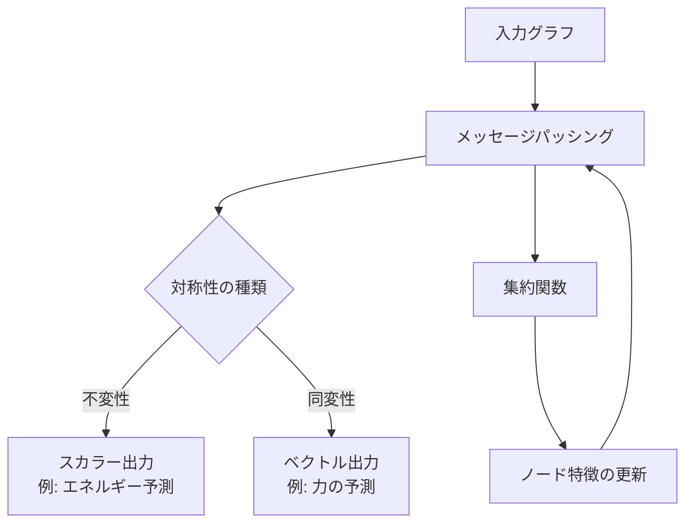
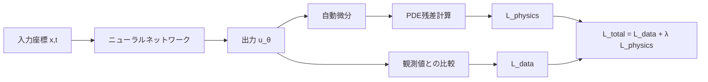
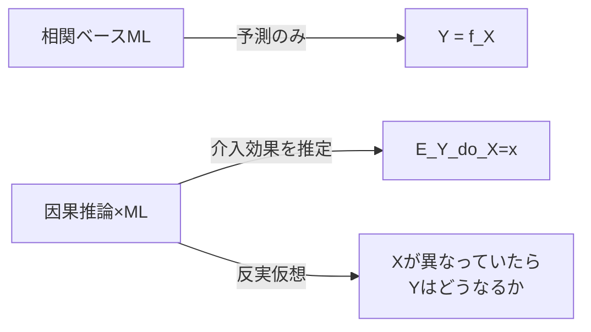

# 生成AI以外で注目すべき機械学習6大トレンド【2026年版】

## この記事でわかること

- 2025〜2026年に急成長している**生成AI以外**の機械学習6分野の最新動向
- 時系列基盤モデル（Chronos-2, TimesFM）のゼロショット予測の実力と制約
- 表形式データにおけるディープラーニングとXGBoostの最新ベンチマーク比較
- 物理法則を組み込んだPINNs（Physics-Informed Neural Networks）の産業応用
- エッジAI/TinyMLの量子化・蒸留技術とMLPerf Tiny 1.3ベンチマーク

## 対象読者

- **想定読者**: 中級者以上の機械学習エンジニア・データサイエンティスト
- **必要な前提知識**:
  - Python 3.10以降の基礎文法
  - scikit-learn / PyTorch / TensorFlowいずれかの基本的な使い方
  - ニューラルネットワークの基礎理論（損失関数、勾配降下法）
  - 教師あり学習・教師なし学習の基本概念

## 結論・成果

2026年現在、機械学習の進化は生成AIだけではありません。**時系列基盤モデル**はゼロショットで従来のARIMAやProphetに匹敵する精度を達成し、**表形式データ向け基盤モデル**（TabPFNv2）は最大10,000サンプルのデータセットでXGBoostと統計的に同等の性能を報告しています。**エッジAI**分野ではMLPerf Tiny 1.3ベンチマークで推論レイテンシが前世代比25%低減し、**科学的機械学習**ではPINNsが風力発電予測で$R^2 = 0.998$を達成したと報告されています。

本記事では、生成AIの影に隠れがちな6つの重要トレンドを、具体的なベンチマーク数値・コード例・適用限界とともに整理します。

## 時系列基盤モデルの台頭を把握する

2025年後半から2026年にかけて、時系列予測の分野で**基盤モデル（Foundation Model）** が急速に存在感を増しています。従来は個別のデータセットごとにモデルを学習する必要がありましたが、大量の時系列データで事前学習されたモデルが、ゼロショットまたは少数ショットで高い予測精度を発揮するようになりました。

### 主要な時系列基盤モデルを比較する

2026年時点で注目すべき主要モデルを整理します。

| モデル名 | 開発元 | アーキテクチャ | 特徴 |
|---------|--------|--------------|------|
| **Chronos-2** | Amazon | T5ベース | 単変量・多変量・共変量対応。2025年10月リリース |
| **MOIRAI-2** | Salesforce | Transformer | GIFT-Evalリーダーボードで高スコア。ゼロショット・分布内予測の両方に対応 |
| **TimesFM** | Google | パッチベースDecoder-only | 1000億の実データポイントで事前学習。最小限の設定でゼロショット予測 |
| **TabPFNv2** | Freiburg大学 | Transformer | 時系列以外にも対応する汎用表形式基盤モデル |

### Chronos-2でゼロショット予測を実装する

Chronos-2を使った時系列予測の基本的な実装例を見てみましょう。

```python
# chronos_forecast.py
# 必要なパッケージ: pip install chronos-forecasting torch
from chronos import ChronosPipeline
import torch
import numpy as np

def forecast_with_chronos(
    historical_data: np.ndarray,
    prediction_length: int = 24,
    model_id: str = "amazon/chronos-t5-small",
) -> np.ndarray:
    """Chronos-2によるゼロショット時系列予測"""
    pipeline = ChronosPipeline.from_pretrained(
        model_id,
        device_map="auto",
        torch_dtype=torch.float32,
    )
    # 入力は1次元テンソル
    context = torch.tensor(historical_data, dtype=torch.float32)
    # 予測の実行（quantilesで不確実性も取得可能）
    forecast = pipeline.predict(
        context,
        prediction_length=prediction_length,
        num_samples=20,  # サンプリング数
    )
    # 中央値を返す
    median_forecast = np.median(forecast.numpy(), axis=0)
    return median_forecast
```

**なぜ時系列基盤モデルが注目されるのか:**

- **ゼロショットで動作**: ドメイン固有の学習データが不要なため、導入コストが低い
- **汎用性**: 金融・気象・IoTなど、異なるドメインのデータに適用可能
- **不確実性の定量化**: サンプリングベースの予測により、予測区間を自然に出力できる

**注意点:**
> 時系列基盤モデルには重要な制約があります。TSFM-Benchの調査（arXiv:2410.11802）では、ベンチマークデータセットの重複による情報リーク、時空間的な評価の欠如、グローバルパターンの記憶による性能過大評価のリスクが指摘されています。本番環境では、自社データでのファインチューニング評価を必ず実施してください。

## 表形式データのディープラーニング最前線を理解する

「表形式データにはXGBoostが最適」というのが長年の通説でしたが、2025〜2026年にかけてこの状況に変化が生じています。表形式データに特化した基盤モデルや、最適化されたDNNアーキテクチャが、勾配ブースティングと統計的に同等の性能を示すケースが増えてきました。

### XGBoost vs ディープラーニングの最新ベンチマーク

直近の大規模比較研究（Journal of Applied Data Sciences, Vol. 7, No. 1, 2026）の結果を整理します。

| カテゴリ | 代表手法 | 強み | 弱み |
|---------|---------|------|------|
| **ツリー系** | XGBoost, LightGBM, CatBoost | 安定した性能、解釈性、少量データでも有効 | 特徴量間の複雑な相互作用を捉えにくい |
| **最適化DNN** | RealMLP, ModernNCA | ツリー系と同等〜上回る性能 | ハイパーパラメータ調整の手間が大きい |
| **トークンベースTransformer** | FT-Transformer, ExcelFormer | 安定した性能、カラム間の注意機構 | ツリー系との差は統計的に有意でない場合が多い |
| **基盤モデル** | TabPFNv2, TabICL | ゼロショット推論可能、学習不要 | TabPFNv2は10Kサンプル、TabICLは500Kサンプルまで |

### TabPFNv2のゼロショット分類を試す

TabPFNv2は学習なしで表形式データの分類・回帰タスクに対応できる基盤モデルです。

```python
# tabpfn_example.py
# 必要なパッケージ: pip install tabpfn scikit-learn
from tabpfn import TabPFNClassifier
from sklearn.datasets import load_iris
from sklearn.model_selection import train_test_split
from sklearn.metrics import accuracy_score

def tabpfn_zero_shot_classification() -> float:
    """TabPFNv2によるゼロショット分類の例"""
    X, y = load_iris(return_X_y=True)
    X_train, X_test, y_train, y_test = train_test_split(
        X, y, test_size=0.2, random_state=42
    )
    # TabPFNv2は内部に事前学習済みモデルを持つ
    # fitは学習ではなくコンテキストの設定
    clf = TabPFNClassifier(device="cpu")
    clf.fit(X_train, y_train)
    y_pred = clf.predict(X_test)
    return accuracy_score(y_test, y_pred)


if __name__ == "__main__":
    acc = tabpfn_zero_shot_classification()
    print(f"TabPFNv2 accuracy: {acc:.4f}")
```

**ハマりポイント:**
> TabPFNv2は10,000サンプルを超えるデータセットでは使用できません。大規模データの場合はサンプリングが必要ですが、サンプリングによる性能低下に注意が必要です。また、Wilcoxon–Holm検定による分析では、多くの手法が**統計的に区別不可能**であることが示されており、「どの手法が最適か」は依然としてデータセット依存です。

## グラフニューラルネットワークと幾何的深層学習の進展を追う

GNN（Graph Neural Network）は、グラフ構造を持つデータ（分子、ソーシャルネットワーク、交通ネットワークなど）に特化したニューラルネットワークです。2025〜2026年にかけて、特に**幾何的深層学習（Geometric Deep Learning）** との融合が進んでいます。

### E(n)-Equivariant GNNの基本概念

幾何的深層学習の核心は**対称性の保存**です。3次元空間のデータ（分子構造など）では、回転や並進に対して予測が不変（invariant）または同変（equivariant）であることが求められます。



E(n)-equivariant GNNでは、ユークリッド変換群$E(n)$（回転・並進・反転）に対する同変性を保証します。具体的には、入力座標$\mathbf{x}_i$に回転行列$R$と並進ベクトル$\mathbf{t}$を適用した場合、出力も同じ変換を受けます。

$$f(R\mathbf{x}_i + \mathbf{t}) = Rf(\mathbf{x}_i) + \mathbf{t}$$

### ICML 2025での注目研究

ICML 2025ではLiaoらが**曲率考慮グラフアテンション（Curvature-Aware Graph Attention）** を発表しました。これは曲面上の偏微分方程式を解くために、リーマン曲率テンソルをメッセージパッシングに組み込む手法です。

**GNNの主な応用分野（2026年時点）:**

| 応用分野 | 具体例 | 採用企業 |
|---------|--------|---------|
| 創薬 | 分子特性予測、タンパク質構造 | DeepMind, Recursion |
| 交通予測 | リアルタイム渋滞予測 | Uber, Google Maps |
| 推薦システム | ユーザー行動グラフ | Pinterest, Alibaba |
| 不正検知 | トランザクショングラフ | PayPal, Stripe |

**制約条件:**
> GNNのメッセージパッシングには**over-smoothing**問題があります。層を深くするとノード表現が均一化し、性能が低下します。近年の研究ではMPNNとGraph Transformerの関係が調査されており、仮想ノード付きMPNNがGraph Transformerをシミュレートできることが示されていますが、計算コストのトレードオフが存在します。

## 科学的機械学習（PINNs）の産業応用を知る

Physics-Informed Neural Networks（PINNs）は、物理法則（偏微分方程式）をニューラルネットワークの損失関数に直接組み込む手法です。2022年以降、研究論文数が爆発的に増加しており、2025〜2026年にかけて産業応用が本格化しています。

### PINNsのアーキテクチャを理解する

PINNsの損失関数は、データ適合項と物理法則項の2つから構成されます。

$$\mathcal{L}_{\text{total}} = \mathcal{L}_{\text{data}} + \lambda \mathcal{L}_{\text{physics}}$$

ここで:

- $\mathcal{L}_{\text{data}} = \frac{1}{N}\sum_{i=1}^{N} |u(\mathbf{x}_i) - u_i^{\text{obs}}|^2$ は観測データへの適合
- $\mathcal{L}_{\text{physics}} = \frac{1}{M}\sum_{j=1}^{M} |\mathcal{N}[u](\mathbf{x}_j)|^2$ は物理法則（PDE残差）の満足度
- $\lambda$ は物理項の重み（ハイパーパラメータ）



### PINNsで1次元熱方程式を解く

基本的なPINNsの実装例として、1次元熱方程式を解いてみましょう。

```python
# pinns_heat_equation.py
# 必要なパッケージ: pip install torch numpy
import torch
import torch.nn as nn
import numpy as np

class PINN(nn.Module):
    """1次元熱方程式を解くPINNs"""
    def __init__(self, hidden_dim: int = 64, num_layers: int = 4):
        super().__init__()
        layers = [nn.Linear(2, hidden_dim), nn.Tanh()]
        for _ in range(num_layers - 1):
            layers.extend([nn.Linear(hidden_dim, hidden_dim), nn.Tanh()])
        layers.append(nn.Linear(hidden_dim, 1))
        self.network = nn.Sequential(*layers)

    def forward(self, x: torch.Tensor, t: torch.Tensor) -> torch.Tensor:
        inputs = torch.cat([x, t], dim=1)
        return self.network(inputs)


def physics_loss(
    model: PINN,
    x: torch.Tensor,
    t: torch.Tensor,
    alpha: float = 0.01,
) -> torch.Tensor:
    """熱方程式 ∂u/∂t = α ∂²u/∂x² の残差を計算"""
    x.requires_grad_(True)
    t.requires_grad_(True)
    u = model(x, t)
    # 自動微分で偏導関数を計算
    u_t = torch.autograd.grad(
        u, t, grad_outputs=torch.ones_like(u), create_graph=True
    )[0]
    u_x = torch.autograd.grad(
        u, x, grad_outputs=torch.ones_like(u), create_graph=True
    )[0]
    u_xx = torch.autograd.grad(
        u_x, x, grad_outputs=torch.ones_like(u_x), create_graph=True
    )[0]
    # PDE残差: ∂u/∂t - α∂²u/∂x²
    residual = u_t - alpha * u_xx
    return torch.mean(residual**2)
```

**なぜPINNsが注目されるのか:**
- **データ効率**: 物理法則を制約として利用するため、少量のデータで精度の高い予測が可能
- **物理整合性**: 予測結果が物理法則に矛盾しないことを保証
- **逆問題への応用**: 観測データから未知のパラメータを推定可能

**注意点:**
> PINNsには**学習の不安定性**という課題があります。$\mathcal{L}_{\text{data}}$と$\mathcal{L}_{\text{physics}}$のスケールが大きく異なる場合、一方が支配的になり学習が収束しません。$\lambda$の適切な設定や、学習率スケジューリングの工夫が必要です。また、PI-GANOのようなNeural Operator手法は、新しい境界条件への汎化性能で優れていますが、学習コストがPINNsより高くなる傾向があります。

## エッジAIとTinyMLの最新動向を確認する

エッジAI/TinyMLは、マイクロコントローラやモバイルデバイス上で直接機械学習モデルを実行する技術です。クラウドへのデータ送信が不要になるため、レイテンシ削減・プライバシー保護・通信コスト削減が実現できます。

### モデル最適化技術の比較

エッジデバイスにモデルをデプロイするための主要な最適化技術を比較します。

| 技術 | 概要 | 精度への影響 | サイズ削減率 | 速度向上 |
|------|------|-------------|------------|---------|
| **INT8量子化** | 重みを32bit浮動小数点→8bit整数に変換 | 1-3%低下 | 約4倍 | 2-4倍 |
| **構造化枝刈り** | 不要なチャネル/フィルタを削除 | 設定依存 | 2-10倍 | 1.5-3倍 |
| **知識蒸留** | 大型モデルの知識を小型モデルに転移 | 元モデルの90-95%維持 | モデル依存 | モデル依存 |
| **量子化対応学習（QAT）** | 量子化を考慮して学習 | PTQ比で精度改善 | 約4倍 | 2-4倍 |

### PyTorchでINT8量子化を実装する

```python
# quantization_example.py
# 必要なパッケージ: pip install torch torchvision
import torch
import torch.quantization as quant
from torchvision.models import mobilenet_v2

def quantize_model(
    model: torch.nn.Module,
    calibration_data: torch.Tensor,
) -> torch.nn.Module:
    """Post-Training Static Quantizationの実装例"""
    model.eval()
    # 量子化設定
    model.qconfig = quant.get_default_qconfig("x86")
    # バッチ正規化の融合（Conv+BN+ReLU）
    model_fused = quant.fuse_modules(
        model.features,
        modules_to_fuse=[["0", "1", "2"]],  # Conv2d + BN + ReLU6
        inplace=False,
    )
    # 量子化の準備
    model_prepared = quant.prepare(model, inplace=False)
    # キャリブレーション（代表データで統計量を収集）
    with torch.no_grad():
        model_prepared(calibration_data)
    # 量子化の実行
    model_quantized = quant.convert(model_prepared, inplace=False)
    return model_quantized


# 使用例
model = mobilenet_v2(weights=None)
dummy_input = torch.randn(32, 3, 224, 224)
# 注: 実際の運用ではキャリブレーションデータに
# 本番データの代表サンプルを使用すること
```

### MLPerf Tiny 1.3ベンチマーク（2025年公開）

MLPerf Tinyは、マイクロコントローラ上のML推論性能を標準化して比較するためのベンチマークです。Version 1.3（2025年）では以下のタスクが評価されています。

- **Visual Wake Words**: 人物検知（COCO派生データセット）
- **Image Classification**: CIFAR-10分類
- **Keyword Spotting**: 音声コマンド認識
- **Anomaly Detection**: 産業機器の異常検知

Arm Cortex-M55 + Helium（MVE）搭載プロセッサでは、前世代比で推論レイテンシが25%低減し、メモリ使用量が35%削減されたとMLPerf Tinyの結果で報告されています。

**よくある間違い:**
> 「量子化すればどんなモデルもエッジにデプロイできる」と考えがちですが、INT8量子化ではモデルの精度が1-3%低下するのが一般的です。特に物体検出のような精度に敏感なタスクでは、QAT（Quantization-Aware Training）を使って量子化誤差を学習時に考慮する必要があります。また、TinyMLのデプロイにはモデル設計だけでなく、メモリレイアウトやオペレータ実装の最適化（TFLite Micro, Edge Impulse等）も不可欠です。

## 因果推論×機械学習と連合学習の動向を把握する

最後に、生成AIとは異なる方向で機械学習の信頼性・安全性を高める2つのトレンドを紹介します。

### 因果推論と機械学習の統合

従来の機械学習は**相関関係**に基づく予測が中心でしたが、因果推論を組み込むことで「**なぜそうなるのか**」を推定できるようになります。



2025〜2026年の主要な手法を整理します。

| 手法 | 概要 | 適用場面 |
|------|------|---------|
| **Double Machine Learning** | Neyman直交性を利用し、nuisanceパラメータを柔軟にモデリング | 処置効果の推定（A/Bテスト代替） |
| **TARNet / CFRNet** | 処置群・対照群で表現空間を共有するネットワーク | 個別処置効果（ITE）の推定 |
| **DragonNet** | 傾向スコアを同時学習するエンドツーエンドモデル | 観察データからの因果推論 |
| **時系列因果発見** | Granger因果性のDL拡張（RealTCD等） | 時系列データの因果関係特定 |

```python
# double_ml_example.py
# 必要なパッケージ: pip install doubleml scikit-learn lightgbm
from doubleml import DoubleMLPLR
from doubleml import DoubleMLData
from sklearn.datasets import make_regression
import numpy as np

def estimate_treatment_effect() -> None:
    """Double Machine Learningによる処置効果の推定例"""
    np.random.seed(42)
    n = 1000
    p = 10
    # 共変量
    X = np.random.normal(size=(n, p))
    # 処置変数（共変量に依存）
    d = (X[:, 0] + np.random.normal(size=n) > 0).astype(float)
    # 結果変数（真の処置効果 = 2.0）
    y = 2.0 * d + X[:, 0] + 0.5 * X[:, 1] + np.random.normal(size=n)

    dml_data = DoubleMLData.from_arrays(x=X, y=y, d=d)
    # LightGBMをnuisanceモデルとして使用
    from lightgbm import LGBMRegressor, LGBMClassifier
    dml_plr = DoubleMLPLR(
        dml_data,
        ml_l=LGBMRegressor(n_estimators=100, verbose=-1),
        ml_m=LGBMClassifier(n_estimators=100, verbose=-1),
        n_folds=5,
    )
    dml_plr.fit()
    print(f"推定された処置効果: {dml_plr.coef[0]:.3f}")
    print(f"95%信頼区間: [{dml_plr.confint().iloc[0, 0]:.3f}, "
          f"{dml_plr.confint().iloc[0, 1]:.3f}]")
    # 真の処置効果2.0に近い値が推定される
```

### 連合学習（Federated Learning）の成熟

連合学習は、データをデバイスやサーバーに分散させたまま、モデルのパラメータのみを集約して学習する手法です。GDPR等のデータプライバシー規制の強化により、市場規模は年間40%以上の成長率で拡大しています。

**連合学習の2025〜2026年の進展:**

- **パーソナライズドFL**: グローバルモデルとローカルモデルを組み合わせ、各クライアントに最適化
- **Non-IIDデータへの対応**: FedProx, SCAFFOLD等のアルゴリズムでデータの偏りに対処
- **差分プライバシーの統合**: ノイズ量30%までは精度低下が軽微と報告されている
- **規制対応**: 欧州データ保護監督機関がGDPRのprivacy-by-design準拠にFLを推奨

**制約条件:**
> 連合学習の実用化には課題も残っています。医療分野を対象とした研究のうち、実際の臨床デプロイに到達したのはわずか5.2%にとどまるとの調査結果があります。通信オーバーヘッド、システム異質性（デバイス間のハードウェア差異）、non-IIDデータへの対応が主なボトルネックです。

## まとめと次のステップ

**まとめ:**

- **時系列基盤モデル**（Chronos-2, TimesFM, MOIRAI-2）はゼロショット予測を可能にしたが、ベンチマークの情報リーク問題に注意が必要
- **表形式データのDL**（TabPFNv2, RealMLP）はXGBoostと統計的に同等の性能を達成し始めているが、データサイズの制約がある
- **GNN/幾何的DL**は曲率考慮やNeural Operator手法で発展中。創薬・交通・推薦への実装が進行
- **PINNs**は物理法則を損失関数に組み込み、データ効率の高い予測を実現。風力発電等で$R^2 > 0.99$を報告
- **エッジAI/TinyML**はMLPerf Tiny 1.3で標準化が進み、INT8量子化＋Cortex-M55で前世代比25%の高速化
- **因果推論×ML・連合学習**は、信頼性・プライバシーの観点でMLの社会実装を支える基盤技術

**次にやるべきこと:**

1. 自社データで時系列基盤モデル（Chronos-2 or TimesFM）のゼロショット性能を評価する
2. 表形式データのタスクがあれば、TabPFNv2 vs XGBoostの比較実験を実施する
3. エッジデプロイの要件がある場合、PyTorchのINT8量子化パイプラインを自社モデルに適用する

## 参考

- [Amazon Chronos Forecasting](https://github.com/amazon-science/chronos-forecasting) - 時系列基盤モデルChronos-2の公式リポジトリ
- [TSFM-Bench: 時系列基盤モデルのベンチマーク](https://arxiv.org/abs/2410.11802) - 時系列基盤モデルの包括的評価
- [TabPFNv2: Accurate Predictions on Small Data (Nature, 2024)](https://www.nature.com/articles/s41586-024-08328-6) - 表形式データ基盤モデルの論文
- [Graph & Geometric ML in 2024: Where We Are and What's Next](https://towardsdatascience.com/graph-geometric-ml-in-2024-where-we-are-and-whats-next-part-i-theory-architectures-3af5d38376e1/) - GNN/幾何的DLの動向レビュー
- [Scientific Machine Learning through PINNs: Where we are and What's next (arXiv:2201.05624)](https://arxiv.org/abs/2201.05624) - PINNsのサーベイ論文
- [MLPerf Tiny Benchmark](https://mlcommons.org/benchmarks/inference-tiny/) - エッジAIベンチマーク
- [DoubleML: Double Machine Learning in Python](https://docs.doubleml.org/) - Double MLの公式ドキュメント
- [Federated Learning: A Survey on Privacy-Preserving Collaborative Intelligence (arXiv:2504.17703)](https://arxiv.org/abs/2504.17703) - 連合学習の最新サーベイ
- [A Closer Look at Deep Learning Methods on Tabular Datasets](https://arxiv.org/html/2407.00956v4) - 表形式データDL比較研究
- [Deep RL for Robotics: A Survey of Real-World Successes (Annual Reviews, 2025)](https://www.annualreviews.org/content/journals/10.1146/annurev-control-030323-022510) - 強化学習ロボティクスのサーベイ

---

:::message
この記事はAI（Claude Code）により自動生成されました。内容の正確性については複数の情報源で検証していますが、実際の利用時は公式ドキュメントもご確認ください。
:::
