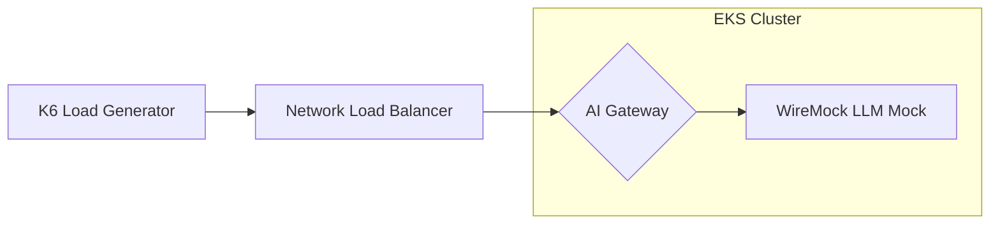
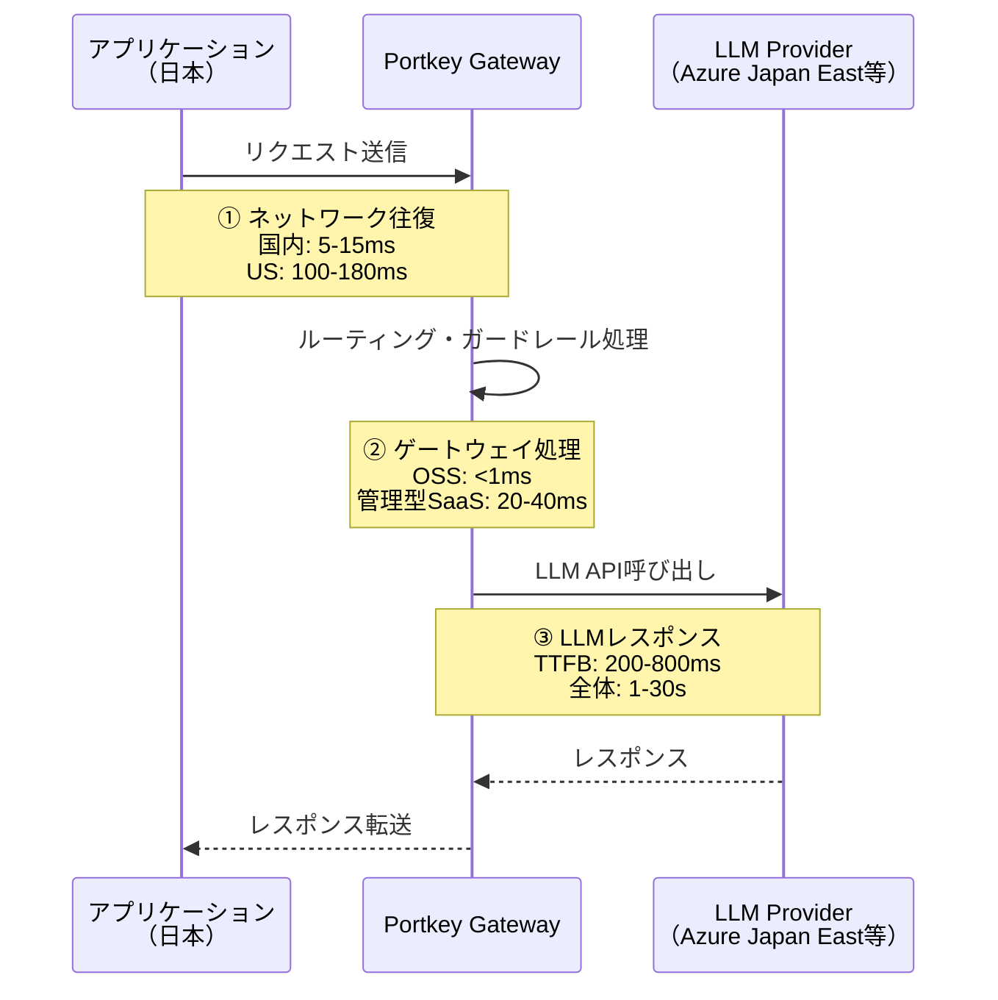
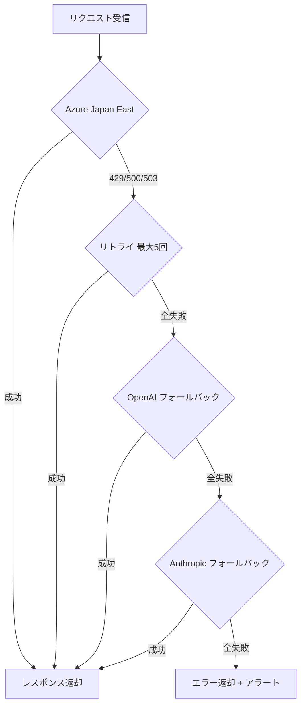

# Portkey AIゲートウェイ本番ベンチマーク：日本リージョンでの性能実測と運用設計

## この記事でわかること

- Portkey AIゲートウェイのスループット・レイテンシを第三者ベンチマークから読み解く方法
- 日本リージョン（Azure Japan East / AWS ap-northeast-1）でPortkeyを運用する際のレイテンシ構造
- 管理型SaaS・OSSセルフホストそれぞれのコストメリットとトレードオフ
- 同時接続数・リアルタイムストリーミング時の性能特性と設計パターン
- 本番運用で月間コストを20〜25%削減するためのキャッシュ・ルーティング戦略

## 対象読者

- **想定読者**: 中級〜上級のバックエンドエンジニア・MLOpsエンジニア
- **必要な前提知識**:
  - LLM API（OpenAI API / Azure OpenAI）の基本的な利用経験
  - Docker / Kubernetes の基礎知識
  - REST APIのレイテンシ・スループットの概念理解

## 結論・成果

Portkey AIゲートウェイは月間100億リクエスト以上を処理し、公称99.9999%のアップタイムを維持していると報告されています。一方で、Kong社が公開した第三者ベンチマーク（2025年）では、プロキシとしてのスループットはKong Gateway（約23,400 RPS）に対しPortkey OSS（約10,300 RPS）と約44%にとどまり、P95レイテンシもKong比で65%高いという結果が示されています。ただし、Portkeyの本質的な価値はLLMネイティブな機能群（セマンティックキャッシュ、フォールバック、コスト追跡）にあり、純粋なプロキシ性能だけでは評価できません。日本リージョンでの運用では、OSSセルフホスト構成にすることで管理型SaaSの20〜40msオーバーヘッドを1ms未満に抑えつつ、セマンティックキャッシュとプロバイダルーティングの組み合わせで**API支出を25%以上削減**した事例も報告されています。

## ベンチマークデータを正しく読み解く

本番導入を検討する上で、まず第三者ベンチマークの数値を正確に理解することが重要です。2025年にKong社が公開したベンチマークは、AI Gatewayの純粋なプロキシ性能を比較した数少ない定量データです。

### Kong社ベンチマークの概要

Kong社のベンチマークでは、AWS EKSクラスタ上で3つのAIゲートウェイを同一条件で比較しています。

| 項目 | Kong Gateway 3.10 | Portkey OSS 1.9.19 | LiteLLM 1.63.7 |
|------|-------------------|---------------------|-----------------|
| **スループット（RPS）** | 約23,400 | 約10,300 | 約2,700 |
| **P95レイテンシ比** | 基準 | +65% | +86% |
| **CPU割り当て** | 12 CPU | 12 CPU | 12 CPU |
| **ベースライン（WireMock直接）** | — | — | 29,005 RPS |

> **テスト環境の詳細**: AWS EKS 1.32、c5.4xlarge（16 vCPU / 32 GiB RAM）ノード、400仮想ユーザー（VU）、1,000プロンプトトークン/リクエスト、3分間のテスト実行。LLMはWireMockでモック化（Kong社公開のベンチマークリポジトリより）。



### ベンチマーク結果の解釈における注意点

このベンチマークを読む際には、以下の点に留意する必要があります。

**まず、テスト条件の制約です。** すべてのゲートウェイが「プロキシのみ」の役割で動作しており、キャッシュ・認証・レートリミットなどのポリシーは無効化されています。実際の本番環境ではこれらの機能を有効にするため、各ゲートウェイのオーバーヘッドは異なる傾向を示す可能性があります。

**次に、ベンチマーク主催者のバイアスです。** このベンチマークはKong社が公開しているため、自社製品に有利な条件設定の可能性を考慮する必要があります。ベンチマークのソースコードは[GitHub上で公開](https://github.com/Kong/kong_ai_gateway-portkey-litellm-benchmark)されているため、手法自体は検証可能です。

**そして、実運用との乖離です。** LLMのレスポンス時間（通常500ms〜数十秒）に対して、ゲートウェイのオーバーヘッド差（数十ms）は相対的に小さくなります。ゲートウェイ選定では、プロキシ性能よりもLLMネイティブ機能の充実度がROIに直結するケースが多いです。

## 日本リージョンでのレイテンシ構造を設計する

日本からPortkeyを利用する場合、レイテンシは複数のレイヤーで発生します。ここでは各レイヤーの特性と、レイテンシを最小化する設計パターンを解説します。

### レイテンシの構成要素

日本リージョンからLLM APIを利用する際のレイテンシは、以下の3層で構成されます。



| レイヤー | 管理型SaaS（US） | OSSセルフホスト（日本） |
|----------|------------------|------------------------|
| ① ネットワーク往復 | 100〜180ms | 5〜15ms |
| ② ゲートウェイ処理 | 20〜40ms | 1ms未満 |
| ③ LLMレスポンス（TTFB） | 200〜800ms | 200〜800ms |
| **合計オーバーヘッド（①+②）** | **120〜220ms** | **6〜16ms** |

> **注意**: 管理型SaaSのPortkeyはUS東部にデプロイされているため、日本からの利用ではネットワーク往復だけで100ms以上の追加レイテンシが発生します。レイテンシに敏感なリアルタイムアプリケーションでは、OSSセルフホスト構成の検討を推奨します。

### OSSセルフホストのデプロイ例

Portkey OSS版をAWS ap-northeast-1（東京リージョン）にデプロイする場合の構成例を示します。

```typescript
// portkey-config.ts
// Portkey Node.js SDK v1.x 系での設定例

import Portkey from "portkey-ai";

const portkey = new Portkey({
  // セルフホスト時は自前のエンドポイントを指定
  baseURL: "https://portkey-gw.ap-northeast-1.your-domain.com",
  apiKey: process.env.PORTKEY_API_KEY,
});

// Azure Japan East + OpenAI US のフォールバック構成
const config = {
  strategy: {
    mode: "fallback",
  },
  targets: [
    {
      // プライマリ: Azure Japan East（低レイテンシ）
      provider: "azure-openai",
      api_key: process.env.AZURE_JAPAN_EAST_KEY,
      resource_name: "your-aoai-japan-east",
      deployment_id: "gpt-4o",
      weight: 1,
      override_params: {
        max_tokens: 4096,
      },
    },
    {
      // フォールバック: OpenAI直接（Azure障害時）
      provider: "openai",
      api_key: process.env.OPENAI_API_KEY,
      override_params: {
        model: "gpt-4o",
        max_tokens: 4096,
      },
    },
  ],
};

// ストリーミングリクエスト
async function streamCompletion(prompt: string): Promise<void> {
  const stream = await portkey.chat.completions.create(
    {
      messages: [{ role: "user", content: prompt }],
      stream: true,
    },
    { config: JSON.stringify(config) }
  );

  for await (const chunk of stream) {
    const content = chunk.choices[0]?.delta?.content;
    if (content) {
      process.stdout.write(content);
    }
  }
}
```

**なぜこの構成を選んだか:**
- Azure Japan East をプライマリにすることで、LLMレスポンス自体のレイテンシを最小化
- OpenAI直接をフォールバックに置くことで、Azureリージョン障害時も継続稼働
- セルフホスト構成によりゲートウェイオーバーヘッドを1ms未満に抑制

**注意点:**
> セルフホスト構成ではPortkeyの管理コンソール（ダッシュボード）が使えないわけではありませんが、ログの送信先設定が別途必要です。Enterprise契約ではプライベートクラウド/VPCホスティングオプションも利用可能ですが、月額$2,000〜$10,000+のコストがかかります。

## 同時接続とリアルタイムストリーミングの性能を検証する

LLMアプリケーションの本番運用では、多数のユーザーが同時にストリーミングレスポンスを受け取るシナリオが一般的です。ここではPortkeyの同時接続特性とストリーミング設計パターンを解説します。

### ストリーミング処理の仕組み

Portkeyのストリーミング処理は、SSE（Server-Sent Events）のネイティブパススルー方式を採用しています。OpenAIのストリーミングフォーマットをそのまま中継するため、追加のパースやバッファリングによるレイテンシ増加がありません。

| 処理フェーズ | 挙動 |
|------------|------|
| 初回チャンク受信 | プロバイダから最初のチャンクを受信次第、即座にクライアントへ転送（TTFB最小化） |
| 中間チャンク | パススルー方式でそのまま転送。テレメトリは非同期で記録 |
| キャッシュヒット時 | プロバイダ呼び出しなしで即座にレスポンス返却。JSON→ストリーム変換を自動実行 |
| テレメトリ | レイテンシ内訳・トークン数・コストを非同期でログ送信 |

### 同時接続時の設計パターン

Portkey OSSは公称値で2 vCPUあたり1,000+ RPS を処理可能とされています。本番環境での同時接続を安定させるためには、以下の設計パターンが有効です。

```python
# load_balance_config.py
# Portkey Python SDK v1.x 系での重み付きロードバランシング設定

from portkey_ai import Portkey

client = Portkey(
    base_url="https://portkey-gw.ap-northeast-1.your-domain.com",
    api_key="your-portkey-api-key",
)

# 重み付きロードバランシング: 複数APIキーに分散
load_balance_config = {
    "strategy": {
        "mode": "loadbalance",
    },
    "targets": [
        {
            "provider": "azure-openai",
            "api_key": "azure-key-1",
            "resource_name": "aoai-japan-east-1",
            "deployment_id": "gpt-4o",
            "weight": 0.5,  # 50%のトラフィック
        },
        {
            "provider": "azure-openai",
            "api_key": "azure-key-2",
            "resource_name": "aoai-japan-east-2",
            "deployment_id": "gpt-4o",
            "weight": 0.3,  # 30%のトラフィック
        },
        {
            "provider": "openai",
            "api_key": "openai-key-1",
            "override_params": {"model": "gpt-4o"},
            "weight": 0.2,  # 20%のトラフィック（バースト吸収用）
        },
    ],
}

# サーキットブレーカー連携
# エラー率が閾値を超えたターゲットを自動除外
circuit_breaker_config = {
    "strategy": {
        "mode": "loadbalance",
        "on_status_codes": [429, 500, 502, 503],
    },
    "targets": [
        # ... 上記と同じターゲット設定
    ],
}
```

**なぜ複数APIキーに分散するか:**
- Azure OpenAIはデプロイメントごとにTPM（Tokens Per Minute）の上限がある
- 単一キーに集中するとレートリミットに到達し、リクエストが429エラーで失敗する
- 重み付き分散で各キーの使用率を均等に保ち、スパイク時のエラー率を抑える

### よくある間違い: ストリーミング時のタイムアウト設定

ストリーミングレスポンスでは、最初のチャンク受信後もレスポンス全体の完了まで数十秒かかることがあります。接続タイムアウトとレスポンスタイムアウトを混同すると、正常なストリーミング中に接続が切断される問題が発生します。

```python
# ❌ 間違い: 全体タイムアウトを短く設定
# client.timeout = 10  # 10秒でストリーミング中でも切断される

# ✅ 正しい: 接続タイムアウトとレスポンスタイムアウトを分離
import httpx

client = Portkey(
    base_url="https://portkey-gw.ap-northeast-1.your-domain.com",
    api_key="your-portkey-api-key",
    timeout=httpx.Timeout(
        connect=5.0,     # 接続確立: 5秒
        read=120.0,      # チャンク間の待機: 120秒
        write=10.0,      # リクエスト送信: 10秒
        pool=10.0,       # 接続プール取得: 10秒
    ),
)
```

## コスト最適化戦略を実装する

Portkeyを日本リージョンで運用する際のコスト構造を分析し、具体的な削減戦略を解説します。

### コスト構造の全体像

本番運用のコストは大きく3つの要素で構成されます。

| コスト要素 | 管理型SaaS | OSSセルフホスト |
|-----------|-----------|----------------|
| **LLMプロバイダAPI費用** | 同額 | 同額 |
| **ゲートウェイ利用料** | $49〜$10,000+/月 | $0（OSS） |
| **インフラ運用費** | $0 | $200〜$1,000/月（EKS/ECS） |
| **エンジニア工数** | 低 | 中〜高 |

> **注意**: Portkey管理型SaaSのProプランでは、100,000ログ/月を超過すると10万ログあたり$9の従量課金が発生します。ログ上限を超えたリクエストはルーティングされますが、オブザーバビリティダッシュボードに記録されない「盲点」が生じます。

### セマンティックキャッシュによるコスト削減

Portkeyのセマンティックキャッシュは、類似クエリに対してキャッシュされたレスポンスを返すことで、LLM API呼び出しを削減します。

Portkey社の公開データによると、Q&A/RAGユースケースでは約20%のキャッシュヒット率（99%精度）が報告されています。1日1,000万件のGPT-4リクエストを処理するケースで、月額約$2,700のコスト削減が報告されています。

```python
# semantic_cache_example.py
# セマンティックキャッシュの設定例

from portkey_ai import Portkey

client = Portkey(
    base_url="https://portkey-gw.ap-northeast-1.your-domain.com",
    api_key="your-portkey-api-key",
)

# セマンティックキャッシュを有効化したリクエスト
response = client.chat.completions.create(
    messages=[
        {"role": "user", "content": "Pythonでリストをソートする方法を教えて"}
    ],
    model="gpt-4o",
    # キャッシュ設定はPortkeyのヘッダーで制御
    extra_headers={
        "x-portkey-cache": "semantic",
        "x-portkey-cache-force-refresh": "false",
    },
)

# 類似クエリ → キャッシュヒット（LLM呼び出しなし）
# 「Pythonのリストのソート方法を教えてください」→ 上記のキャッシュが返される
```

**制約条件:**
- セマンティックキャッシュは8,191トークン以下、4メッセージ以下のリクエストでのみ動作する
- ベクトルデータベースが必要で、一部のEnterpriseプランでのみ利用可能
- RAG以外のユースケース（コード生成、創作文章など）ではヒット率が大幅に低下する

### プロバイダルーティングによるコスト最適化

タスクの複雑さに応じて異なるモデル・プロバイダを使い分けることで、品質を維持しながらコストを削減できます。

```python
# cost_routing_config.py
# タスク複雑度に応じたモデルルーティング

def get_routing_config(task_complexity: str) -> dict:
    """タスク複雑度に応じたルーティング設定を返す"""
    configs = {
        "simple": {
            # 単純なタスク（分類、抽出）→ 軽量モデル
            "strategy": {"mode": "single"},
            "targets": [
                {
                    "provider": "azure-openai",
                    "resource_name": "aoai-japan-east-1",
                    "deployment_id": "gpt-4o-mini",
                    "override_params": {"max_tokens": 1024},
                }
            ],
        },
        "complex": {
            # 複雑なタスク（推論、生成）→ 高性能モデル + フォールバック
            "strategy": {"mode": "fallback"},
            "targets": [
                {
                    "provider": "azure-openai",
                    "resource_name": "aoai-japan-east-1",
                    "deployment_id": "gpt-4o",
                    "override_params": {"max_tokens": 4096},
                },
                {
                    "provider": "anthropic",
                    "api_key": "anthropic-key",
                    "override_params": {
                        "model": "claude-sonnet-4-20250514",
                        "max_tokens": 4096,
                    },
                },
            ],
        },
    }
    return configs.get(task_complexity, configs["simple"])
```

**コスト削減効果の目安:**

| 戦略 | 削減率の目安 | 適用条件 |
|------|------------|----------|
| セマンティックキャッシュ | 約20% | Q&A/RAGワークロード |
| モデルルーティング（mini活用） | 30〜50% | タスク分類可能な場合 |
| プロバイダ間価格最適化 | 10〜15% | 複数プロバイダ契約時 |
| **組み合わせ** | **25〜40%** | 上記を併用 |

Portkey社の公開事例では、金融サービス企業がゲートウェイ導入によりAPI支出を25%以上削減しつつ、レスポンスの予測可能性を向上させたと報告されています。

## 本番運用の信頼性を設計する

Portkeyの信頼性機能を活用した本番運用設計のパターンを解説します。

### フォールバックとリトライの設計

Portkeyは失敗したリクエストを最大5回まで自動リトライし、指数バックオフ戦略で再試行間隔を調整します。フォールバックとリトライを組み合わせることで、単一プロバイダの障害時も継続稼働が可能です。



### サーキットブレーカーの設定

サーキットブレーカーは、エラー率が閾値を超えたプロバイダを自動的にルーティング対象から除外します。これにより、障害中のプロバイダへのリクエスト送信を防ぎ、正常なプロバイダにトラフィックを集中させます。

| パラメータ | 推奨値 | 理由 |
|-----------|--------|------|
| エラー閾値 | 5回 | LLMプロバイダの一時的エラーを許容 |
| 監視ウィンドウ | 60秒 | 短すぎると誤検知、長すぎると障害対応が遅延 |
| リカバリタイム | 300秒 | プロバイダの復旧を待つ適切な時間 |
| 対象ステータスコード | 429, 500, 502, 503 | レートリミット・サーバーエラー |

### バーチャルキーによるチーム管理

本番運用では複数チームが同一のLLMインフラを共有するケースが一般的です。Portkeyのバーチャルキー機能を使うことで、チームごとの予算上限・レートリミットを設定できます。

```python
# virtual_key_budget.py
# チームごとの予算・レートリミット設定の概念例

team_configs = {
    "product-team": {
        "daily_budget_usd": 100,      # 日次予算上限
        "rate_limit_rpm": 500,         # 分あたりリクエスト数上限
        "allowed_models": ["gpt-4o", "gpt-4o-mini"],
        "alert_threshold_percent": 80, # 予算80%消費でアラート
    },
    "research-team": {
        "daily_budget_usd": 500,
        "rate_limit_rpm": 200,
        "allowed_models": ["gpt-4o", "claude-sonnet-4-20250514"],
        "alert_threshold_percent": 70,
    },
    "batch-pipeline": {
        "daily_budget_usd": 1000,
        "rate_limit_rpm": 1000,
        "allowed_models": ["gpt-4o-mini"],
        "alert_threshold_percent": 90,
    },
}
# バーチャルキーはPortkeyダッシュボードまたはAPIで作成
# 各チームにはバーチャルキーを配布し、実際のAPIキーは秘匿
```

**トレードオフ:**
- バーチャルキー管理はPortkeyの管理型SaaSまたはEnterprise契約で利用可能
- OSSセルフホスト版ではバーチャルキー機能が制限されるため、予算管理は別途実装が必要
- 厳格な予算管理が必要な場合はハードキャップ（上限到達時にリクエスト拒否）を設定するが、プロダクション環境ではソフトキャップ（アラートのみ）の方が安全

## よくある問題と解決方法

| 問題 | 原因 | 解決方法 |
|------|------|----------|
| 日本からのレイテンシが200ms超 | 管理型SaaS（US）を経由 | OSSセルフホストをap-northeast-1にデプロイ |
| ストリーミング中に接続切断 | タイムアウト設定が短すぎる | 接続/読み取りタイムアウトを分離設定 |
| 429エラーが頻発 | 単一APIキーにリクエスト集中 | 重み付きロードバランシングで分散 |
| セマンティックキャッシュのヒット率が低い | コード生成等の非定型タスク | Q&A/RAGワークロードに限定適用 |
| ログ上限超過で監視に盲点 | Proプランの100Kログ上限 | Enterpriseプランまたは自前ログ収集を併用 |
| セルフホスト版のアップデート追従が困難 | OSSリリースサイクルが速い | Docker imageのバージョン固定 + 月次アップデート |

## まとめと次のステップ

**まとめ:**
- Portkeyのプロキシスループットは約10,300 RPSで、Kong比で約44%だが、LLMネイティブ機能（キャッシュ・フォールバック・コスト追跡）が差別化要因
- 日本リージョンではOSSセルフホスト構成により、管理型SaaSの120〜220msオーバーヘッドを6〜16msに削減可能
- セマンティックキャッシュ + モデルルーティングの組み合わせで、API支出を25〜40%削減する設計が可能
- サーキットブレーカーとフォールバックの組み合わせで、マルチプロバイダの高可用性を実現
- バーチャルキーによるチーム単位の予算・レート管理で、組織的なLLMコスト統制が可能

**次にやるべきこと:**
- [Portkey OSSリポジトリ](https://github.com/Portkey-AI/gateway)からDocker imageを取得し、開発環境で動作検証
- Azure Japan EastのOpenAIデプロイメントを作成し、フォールバック構成をテスト
- K6やLocustで自環境のスループット・レイテンシをベンチマーク測定

**関連記事:**
- [本番LLM Gateway比較：LiteLLM・Portkey・Kong・Bifrost・Heliconeの選び方](https://zenn.dev/0h_n0/articles/468ad83d55dc17)
- [Portkey AIゲートウェイ実装Deep Dive：条件付きルーティングとコスト最適化戦略](https://zenn.dev/0h_n0/articles/6c55b2409143b2)

## 参考

- [AI Gateway Benchmark: Kong AI Gateway, Portkey, and LiteLLM - Kong Inc.](https://konghq.com/blog/engineering/ai-gateway-benchmark-kong-ai-gateway-portkey-litellm)
- [The most reliable AI gateway for production systems - Portkey](https://portkey.ai/blog/the-most-reliable-ai-gateway-for-production-systems/)
- [Understanding Portkey AI Gateway Pricing For 2026 - TrueFoundry](https://www.truefoundry.com/blog/portkey-pricing-guide)
- [Reducing LLM costs and latency with semantic cache - Portkey](https://portkey.ai/blog/reducing-llm-costs-and-latency-semantic-cache/)
- [The real cost of building an LLM gateway - Portkey](https://portkey.ai/blog/the-cost-of-building-an-llm-gateway/)
- [Portkey AI Gateway GitHub リポジトリ](https://github.com/Portkey-AI/gateway)
- [Kong AI Gateway Benchmark リポジトリ](https://github.com/Kong/kong_ai_gateway-portkey-litellm-benchmark)

---

:::message
この記事はAI（Claude Code）により自動生成されました。内容の正確性については複数の情報源で検証していますが、実際の利用時は公式ドキュメントもご確認ください。
:::
