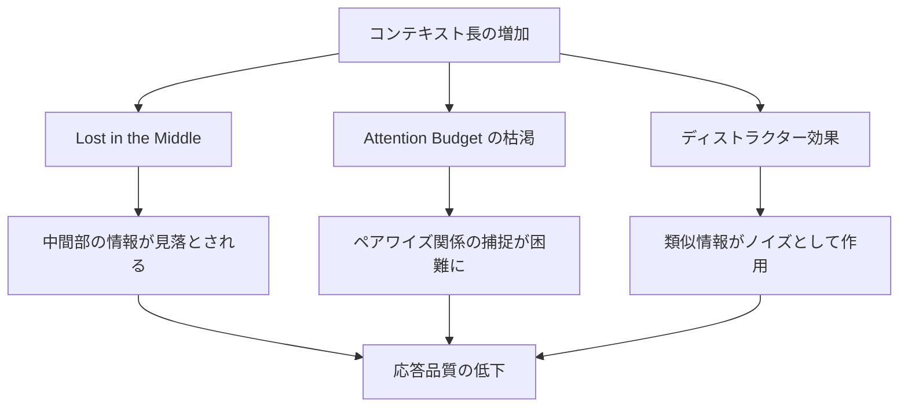
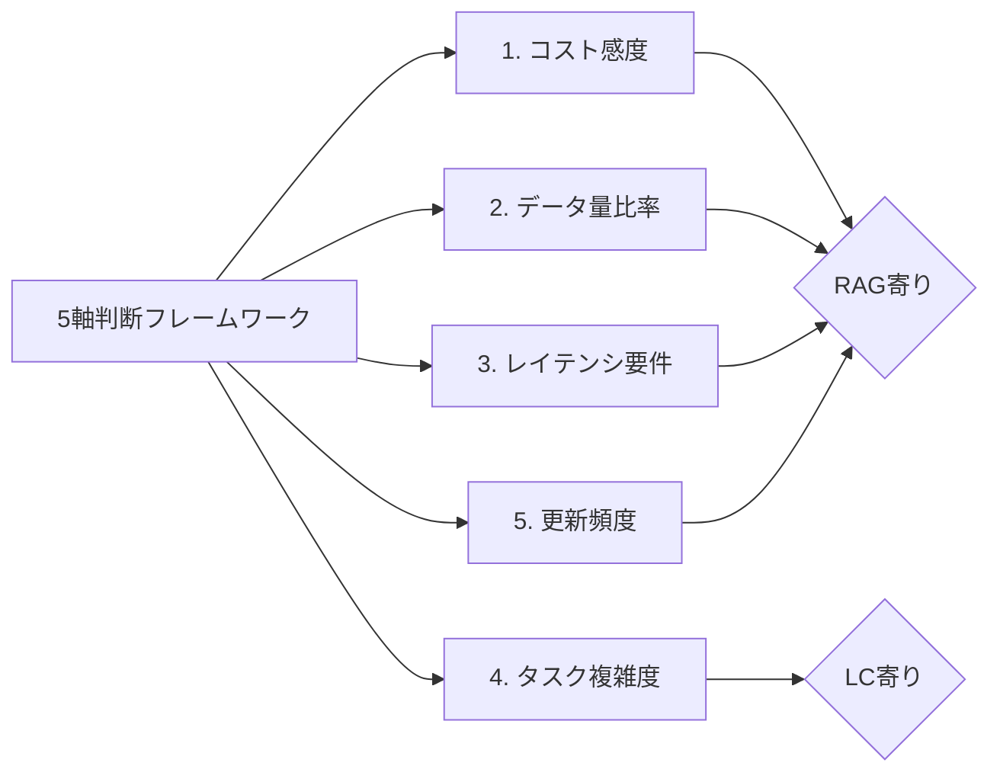
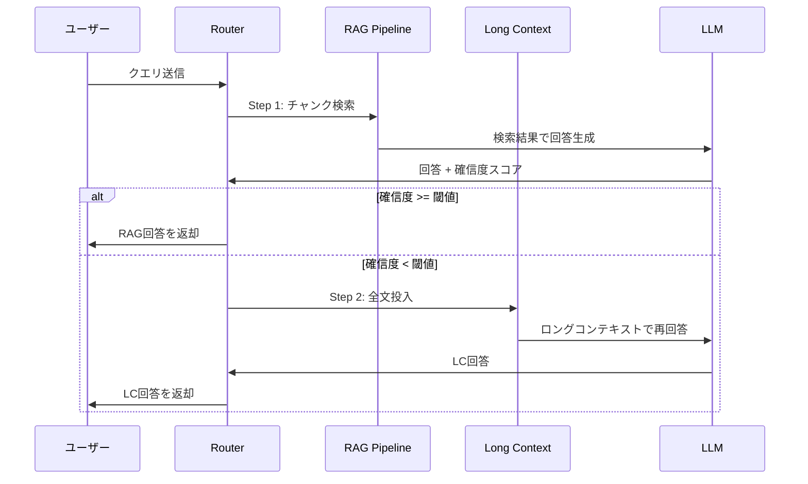

# RAG vs ロングコンテキスト：1Mトークン時代の最適な使い分けと判断フレームワーク

## この記事でわかること

- Gemini 2.5 Pro（1M）・GPT-4.1（1M）・Claude Opus 4.6（200K/1M beta）のコンテキスト性能差と実測ベンチマーク
- **LaRA論文（ICML 2025）** に基づくタスク別のRAG vs ロングコンテキスト（LC）精度比較
- **Context Rot**（コンテキスト腐敗）の発生メカニズムと回避策
- コスト1250倍差を踏まえた**5軸判断フレームワーク**で最適なアーキテクチャを選定する方法
- SELF-ROUTEハイブリッドアーキテクチャの実装パターン

## 対象読者

- **想定読者**: 中級〜上級のLLMアプリケーション開発者
- **必要な前提知識**:
  - Python 3.11+の基本操作
  - LLM API（OpenAI / Anthropic / Google）の利用経験
  - RAGパイプラインの基本概念（Embedding、ベクトルDB、Retriever）

## 結論・成果

RAGとロングコンテキストは「どちらが優れているか」ではなく、**タスク特性に応じた使い分け**が正解です。LaRA論文（ICML 2025）の2326テストケースによる検証では、比較タスクでLCが+15%、ハルシネーション検出でRAGが優位という結果が報告されています。コスト面ではRAGが1クエリあたり約$0.00008に対しLC方式は約$0.10と、**約1250倍の差**があります。本記事で紹介する5軸判断フレームワークを使えば、プロジェクトごとに最適なアーキテクチャを体系的に選定できます。

:::message
本記事は「長いコンテキストをどう活かすか」の**判断基準**に特化しています。個別の実装テクニック（XMLタグ構造化、ドキュメント配置戦略など）は関連記事「[ロングコンテキストLLM活用の最適解：200Kトークンを使いこなす実装パターン](https://zenn.dev/0h_n0/articles/a1bb0a9d6cb7f0)」をご参照ください。
:::

## 2026年のロングコンテキスト対応状況を整理する

まず2026年3月時点の主要モデルのコンテキストウィンドウと性能を整理しましょう。1年前には128Kが標準だったコンテキスト長が、現在は1Mトークンがフロンティアモデルの標準になりつつあります。

### 主要モデルのコンテキスト性能比較

| モデル | コンテキスト長 | Needle精度 | キャッシュ機能 | 入力単価（/1M tokens） |
|--------|--------------|-----------|--------------|----------------------|
| **Gemini 2.5 Pro** | 1M | 99%+（複数needleでやや劣化） | Context Caching | $1.25〜$2.50 |
| **GPT-4.1** | 1M | 100%（全位置で完全検索） | Prompt Caching | $2.00 |
| **Claude Opus 4.6** | 200K（1M beta） | 99%+（複数needleでも安定） | Prompt Caching | $15.00 |
| **GPT-4.1 Mini** | 1M | 99%+ | Prompt Caching | $0.40 |
| **Gemini 2.5 Flash** | 1M | 98%+ | Context Caching | $0.15〜$0.30 |

> 単純なNeedle-in-a-Haystack精度だけでモデルを選定するのは危険です。実際のユースケースでは「複数情報の同時検索」「推論を伴う比較」など、より複雑なタスクが求められます。

**注意点**: Claude Opus 4.6の1Mコンテキストはbeta機能で、`anthropic-beta: context-1m-2025-08-07`ヘッダーとTier 4以上のアカウントが必要です。また、コンテキスト長の公称値と実効値には差があり、Chroma社の研究によると**実効容量は公称値の60〜70%**とされています。

### コンテキスト長の拡大がもたらした変化

1Mトークンは日本語で約50万〜75万文字に相当し、書籍数冊分のテキストを一度に処理できます。この進化により「RAGパイプラインを構築しなくても、ドキュメントを丸ごと投入すれば十分では?」という議論が活発になっています。

しかし、Chroma社が18の最新モデルを対象に実施した**Context Rot**（コンテキスト腐敗）研究では、**すべてのモデルで入力長の増加に伴い性能が劣化する**ことが確認されています。つまり「コンテキストが大きい=常に有利」ではありません。

### Context Rotの発生メカニズム

Context Rotとは、LLMに投入するトークン数が増えるほど応答品質が低下する現象です。Chroma社の研究では、GPT-4.1、Claude 4、Gemini 2.5、Qwen3を含む18モデルで系統的に検証されています。

#### 3つの劣化パターン



**1. Lost in the Middle（中間情報の喪失）**

Stanford大学の研究に端を発するこの問題は、2026年の最新モデルでも完全には解消されていません。コンテキストの先頭と末尾の情報は85〜95%の精度で回収される一方、中間部は**76〜82%に低下する**と報告されています。

**2. Attention Budgetの枯渇**

LLMのAttentionメカニズムには「予算」があります。トークン数が増えるとペアワイズの関係性捕捉が薄まり、特に質問と回答の類似度が低い場合に性能劣化が顕著になります。

**3. ディストラクター効果**

関連性のある別の情報（ディストラクター）がコンテキストに含まれると、正答率がさらに低下します。Chroma社の検証では、ディストラクターが4つになると劣化が複合的に進行しました。Claude系モデルはハルシネーション率が約2.89%と低い一方、GPT系はディストラクター存在時のハルシネーション率が高い傾向が報告されています。

#### 意外な発見：シャッフルされたテキストのほうが高精度

Chroma社の研究で注目すべき発見は、**論理的に整序されたテキストよりもシャッフルされたテキストのほうがモデルの精度が高い**という結果です。整序されたテキストでは強い位置バイアス（recency bias）が発生し、末尾のパッセージに過度に注意が集中します。シャッフルによりこのバイアスが緩和され、入力全体への注意が均一化されるためと考えられています。

> この発見は実用上の示唆に富みます。RAGでチャンクを投入する際、元文書の順序を保持するよりも、**関連度順に並べ替えるほうが精度向上に寄与する**可能性があります。ただし、文脈の連続性が重要なタスク（要約など）ではこの戦略は逆効果になりえます。

## LaRA論文に基づくタスク別の精度比較を検証する

「RAGとロングコンテキストのどちらを使うべきか」を体系的に検証した研究として、Alibaba NLPらによる**LaRA（ICML 2025）** ベンチマークがあります。2326テストケース、4種類のQAタスク、3種類の長文テキストで構成された包括的なベンチマークです。

### タスク別の精度傾向

LaRA論文では、7つのオープンソースモデルと4つのプロプライエタリモデルを対象に、32Kおよび128Kのコンテキスト長でRAGとLCを比較しています。

| タスク | RAG vs LC（128K） | 優位な手法 | 理由 |
|--------|------------------|-----------|------|
| **情報特定（Location）** | RAG +5.25% | RAG | LCはコンテキスト長増加で位置依存の精度劣化 |
| **比較（Comparison）** | LC +14.30% | LC | 複数チャンクの正確な取得・比較が必要 |
| **推論（Reasoning）** | LC +8.98%（Claude） | LC | 補足情報が推論の助けになる |
| **ハルシネーション検出** | RAG優位 | RAG | LCはノイズ由来の誤回答が増加 |

この結果から見えてくるのは、**単一情報の検索にはRAG、複数情報の横断分析にはLC**という明確な傾向です。

### モデルサイズによる影響

LaRA論文のもう一つの重要な知見は、**モデルサイズが小さいほどRAGの恩恵が大きい**という点です。Mistral-Nemo-12BではRAGにより38.12%の精度向上が見られた一方、GPT-4oではRAGによる改善はごくわずかでした。

```python
# lara_routing_decision.py
# LaRA論文の知見に基づくルーティング判定ロジック

from dataclasses import dataclass
from enum import Enum


class RoutingDecision(Enum):
    RAG = "rag"
    LONG_CONTEXT = "long_context"
    HYBRID = "hybrid"


@dataclass
class QueryCharacteristics:
    task_type: str  # "location", "comparison", "reasoning", "hallucination_check"
    context_length_tokens: int
    model_parameter_size_b: float  # モデルのパラメータ数（十億単位）
    requires_source_attribution: bool
    data_update_frequency_days: int


def decide_routing(query: QueryCharacteristics) -> RoutingDecision:
    """LaRA論文の知見に基づくルーティング判定"""

    # ハルシネーション検出・情報特定 → RAG優位
    if query.task_type in ("hallucination_check", "location"):
        return RoutingDecision.RAG

    # 比較・推論 → LC優位（ただしモデルサイズ依存）
    if query.task_type in ("comparison", "reasoning"):
        # 小規模モデルはRAGの恩恵が大きい
        if query.model_parameter_size_b < 20:
            return RoutingDecision.RAG
        # コンテキスト長が128K超ならハイブリッド推奨
        if query.context_length_tokens > 128_000:
            return RoutingDecision.HYBRID
        return RoutingDecision.LONG_CONTEXT

    # 出典明示が必要 → RAG（チャンク単位で追跡可能）
    if query.requires_source_attribution:
        return RoutingDecision.RAG

    # データ更新頻度が高い → RAG（動的更新に対応）
    if query.data_update_frequency_days < 7:
        return RoutingDecision.RAG

    return RoutingDecision.HYBRID
```

**なぜこの実装を選んだか:**
- LaRA論文のタスク別精度データに基づいているため、恣意的な閾値設定を回避できる
- モデルサイズによる効果の違いを考慮し、小規模モデルではRAGを優先
- 出典追跡やデータ更新頻度といった実運用上の要件も判断基準に組み込んでいる

**注意点:**
> この判定ロジックはLaRA論文の結果を単純化したものです。実際にはクエリの複雑さ、ドメイン固有の特性、レイテンシ要件なども影響するため、**プロジェクト固有のベンチマークで検証することを推奨します**。

## 5軸判断フレームワークでアーキテクチャを選定する

リサーチ結果を統合し、プロジェクトごとに最適なアーキテクチャを選定するための**5軸判断フレームワーク**を提案します。各軸を1〜5のスコアで評価し、総合判定を行います。

### フレームワークの5軸



| 軸 | RAG向き（スコア1〜2） | LC向き（スコア4〜5） | 評価基準 |
|----|---------------------|---------------------|---------|
| **1. コスト感度** | 月1万クエリ超、コスト重視 | 少量クエリ、コスト許容 | 月間クエリ数 × トークン単価 |
| **2. データ量比率** | 全体の1〜5%を使用 | 全体の50%以上を使用 | 1クエリで参照するデータ / 全データ |
| **3. レイテンシ要件** | 2秒以内（対話型） | 30秒以上許容（バッチ） | エンドユーザーの待機許容時間 |
| **4. タスク複雑度** | 単一情報検索 | 複数文書の横断分析 | LaRAのタスク分類に対応 |
| **5. 更新頻度** | 日次〜週次更新 | 月次以下、静的データ | データソースの変更頻度 |

### スコアリングの実装

```python
# architecture_selector.py
from dataclasses import dataclass


@dataclass
class ProjectProfile:
    monthly_queries: int
    data_usage_ratio: float  # 1クエリで使うデータ割合（0.0〜1.0）
    max_latency_seconds: float
    task_complexity: str  # "single_retrieval", "multi_doc_analysis", "comparison"
    data_update_frequency_days: int


def calculate_architecture_score(profile: ProjectProfile) -> dict[str, float]:
    """5軸スコアリングでRAG/LC/Hybridの推奨度を算出する"""

    scores = {
        "cost_sensitivity": 0.0,
        "data_ratio": 0.0,
        "latency": 0.0,
        "task_complexity": 0.0,
        "update_frequency": 0.0,
    }

    # 軸1: コスト感度（クエリ数が多いほどRAG寄り）
    if profile.monthly_queries > 10000:
        scores["cost_sensitivity"] = 1.0  # 強くRAG
    elif profile.monthly_queries > 1000:
        scores["cost_sensitivity"] = 2.0
    elif profile.monthly_queries > 100:
        scores["cost_sensitivity"] = 3.0
    else:
        scores["cost_sensitivity"] = 5.0  # 強くLC

    # 軸2: データ量比率（使用割合が低いほどRAG寄り）
    if profile.data_usage_ratio < 0.05:
        scores["data_ratio"] = 1.0
    elif profile.data_usage_ratio < 0.2:
        scores["data_ratio"] = 2.0
    elif profile.data_usage_ratio < 0.5:
        scores["data_ratio"] = 3.0
    else:
        scores["data_ratio"] = 5.0

    # 軸3: レイテンシ要件（厳しいほどRAG寄り）
    if profile.max_latency_seconds < 2:
        scores["latency"] = 1.0
    elif profile.max_latency_seconds < 10:
        scores["latency"] = 3.0
    else:
        scores["latency"] = 5.0

    # 軸4: タスク複雑度（複雑なほどLC寄り）
    complexity_map = {
        "single_retrieval": 1.0,
        "multi_doc_analysis": 4.0,
        "comparison": 5.0,
    }
    scores["task_complexity"] = complexity_map.get(
        profile.task_complexity, 3.0
    )

    # 軸5: 更新頻度（高いほどRAG寄り）
    if profile.data_update_frequency_days < 7:
        scores["update_frequency"] = 1.0
    elif profile.data_update_frequency_days < 30:
        scores["update_frequency"] = 3.0
    else:
        scores["update_frequency"] = 5.0

    return scores


def recommend_architecture(
    profile: ProjectProfile,
) -> tuple[str, dict[str, float]]:
    """推奨アーキテクチャを判定する"""
    scores = calculate_architecture_score(profile)
    avg = sum(scores.values()) / len(scores)

    if avg <= 2.0:
        recommendation = "RAG"
    elif avg >= 4.0:
        recommendation = "Long Context"
    else:
        recommendation = "Hybrid（RAG + Long Context）"

    return recommendation, scores


# 使用例
if __name__ == "__main__":
    # ケース1: 社内FAQ検索（高頻度、単一検索）
    faq = ProjectProfile(
        monthly_queries=50000,
        data_usage_ratio=0.02,
        max_latency_seconds=1.5,
        task_complexity="single_retrieval",
        data_update_frequency_days=3,
    )
    rec, scores = recommend_architecture(faq)
    print(f"社内FAQ: {rec}")
    print(f"  スコア詳細: {scores}")
    # => 社内FAQ: RAG（平均スコア1.0）

    # ケース2: 法務レビュー（低頻度、複数文書比較）
    legal = ProjectProfile(
        monthly_queries=50,
        data_usage_ratio=0.7,
        max_latency_seconds=60,
        task_complexity="comparison",
        data_update_frequency_days=90,
    )
    rec, scores = recommend_architecture(legal)
    print(f"法務レビュー: {rec}")
    print(f"  スコア詳細: {scores}")
    # => 法務レビュー: Long Context（平均スコア5.0）

    # ケース3: カスタマーサポート（中頻度、一部複雑な質問）
    support = ProjectProfile(
        monthly_queries=5000,
        data_usage_ratio=0.1,
        max_latency_seconds=5,
        task_complexity="multi_doc_analysis",
        data_update_frequency_days=14,
    )
    rec, scores = recommend_architecture(support)
    print(f"カスタマーサポート: {rec}")
    print(f"  スコア詳細: {scores}")
    # => カスタマーサポート: Hybrid（平均スコア2.6）
```

### 典型的なユースケース別の推奨

| ユースケース | 推奨 | 理由 |
|------------|------|------|
| **社内FAQ検索** | RAG | 高頻度・単一検索・低コスト要件 |
| **契約書レビュー** | LC | 全文読解・比較が必須 |
| **カスタマーサポート** | Hybrid | 大半はRAGで対応、複雑な質問のみLC |
| **コードレビュー** | LC | ファイル間の依存関係を横断的に分析 |
| **ニュース要約** | RAG → LC | RAGで関連記事を取得 → LCで統合要約 |
| **論文サーベイ** | LC | 複数論文の関連性・差異を比較 |

## SELF-ROUTEハイブリッドアーキテクチャを実装する

LaRA論文でも言及されている**SELF-ROUTE**は、クエリの特性に応じてRAGとLCを動的に切り替えるアプローチです。実装のポイントは、**まずRAGで回答を試み、回答に自信がない場合にLCにフォールバックする**という2段構成です。

### アーキテクチャ概要



### 実装例

```python
# self_route_hybrid.py
import hashlib
import json
import time
from dataclasses import dataclass


@dataclass
class RouteResult:
    answer: str
    route_used: str  # "rag" or "long_context"
    confidence: float
    latency_ms: float
    estimated_cost_usd: float


class SelfRouteHybrid:
    """SELF-ROUTEパターンによるRAG/LCハイブリッド実装"""

    def __init__(
        self,
        confidence_threshold: float = 0.7,
        rag_retriever=None,
        llm_client=None,
    ):
        self.confidence_threshold = confidence_threshold
        self.rag_retriever = rag_retriever
        self.llm_client = llm_client
        self._cache: dict[str, RouteResult] = {}

    def _compute_cache_key(self, query: str) -> str:
        return hashlib.sha256(query.encode()).hexdigest()[:16]

    def query(self, user_query: str, documents: list[str]) -> RouteResult:
        """クエリを処理し、最適なルートで回答を生成する"""

        # セマンティックキャッシュの簡易実装
        cache_key = self._compute_cache_key(user_query)
        if cache_key in self._cache:
            cached = self._cache[cache_key]
            cached.latency_ms = 1.0  # キャッシュヒット
            return cached

        start = time.perf_counter()

        # Step 1: RAGで回答を試行
        rag_result = self._try_rag(user_query, documents)

        if rag_result.confidence >= self.confidence_threshold:
            rag_result.latency_ms = (time.perf_counter() - start) * 1000
            self._cache[cache_key] = rag_result
            return rag_result

        # Step 2: 確信度が低い場合、LCにフォールバック
        lc_result = self._try_long_context(user_query, documents)
        lc_result.latency_ms = (time.perf_counter() - start) * 1000
        self._cache[cache_key] = lc_result
        return lc_result

    def _try_rag(
        self, query: str, documents: list[str]
    ) -> RouteResult:
        """RAGパイプラインで回答を生成する"""

        # 実際の実装ではベクトル検索でチャンクを取得
        # ここでは概念的な実装を示す
        relevant_chunks = self._retrieve_chunks(query, documents, top_k=5)
        context = "\n\n---\n\n".join(relevant_chunks)

        prompt = f"""以下のコンテキストに基づいて質問に回答してください。
回答の確信度を0.0〜1.0で評価してください。
コンテキストに十分な情報がない場合は確信度を低くしてください。

コンテキスト:
{context}

質問: {query}

JSON形式で回答:
{{"answer": "回答文", "confidence": 0.0〜1.0}}"""

        # LLM呼び出し（実装ではself.llm_clientを使用）
        response = self._call_llm(prompt)
        parsed = json.loads(response)

        # RAGのコスト見積もり（入力トークン数 × 単価）
        input_tokens = len(context.split()) * 1.3  # 概算
        estimated_cost = input_tokens * 0.000002  # $2/1M tokens

        return RouteResult(
            answer=parsed["answer"],
            route_used="rag",
            confidence=parsed["confidence"],
            latency_ms=0,  # 後で設定
            estimated_cost_usd=estimated_cost,
        )

    def _try_long_context(
        self, query: str, documents: list[str]
    ) -> RouteResult:
        """ロングコンテキストで全文を投入して回答を生成する"""

        # 全ドキュメントを結合
        full_context = "\n\n".join(documents)

        prompt = f"""以下の全文書を読んで質問に回答してください。

文書:
{full_context}

質問: {query}"""

        response = self._call_llm(prompt)

        # LCのコスト見積もり
        input_tokens = len(full_context.split()) * 1.3
        estimated_cost = input_tokens * 0.000002

        return RouteResult(
            answer=response,
            route_used="long_context",
            confidence=0.9,  # LC使用時は高確信度と仮定
            latency_ms=0,
            estimated_cost_usd=estimated_cost,
        )

    def _retrieve_chunks(
        self, query: str, documents: list[str], top_k: int = 5
    ) -> list[str]:
        """チャンク検索（実際の実装ではベクトルDBを使用）"""
        # 簡易実装: 文書を分割して先頭top_kを返す
        chunks = []
        for doc in documents:
            # 512文字ごとにチャンク分割
            for i in range(0, len(doc), 512):
                chunks.append(doc[i : i + 512])
        return chunks[:top_k]

    def _call_llm(self, prompt: str) -> str:
        """LLM呼び出し（実際の実装ではAPI呼び出し）"""
        if self.llm_client:
            return self.llm_client.generate(prompt)
        # スタブ実装
        return '{"answer": "stub response", "confidence": 0.5}'
```

**なぜSELF-ROUTEを選んだか:**
- RAGの低コスト・低レイテンシを第一選択として活用しつつ、回答品質が不十分な場合のみLCにフォールバック
- LaRA論文の知見（タスク特性による精度差）を自動判定に組み込める
- セマンティックキャッシュとの併用で、繰り返しクエリのコストを大幅に削減可能

**注意点:**
> SELF-ROUTEの確信度閾値（`confidence_threshold`）はLLMの自己評価に依存します。LLMの自信過剰（overconfidence）問題があるため、**閾値は0.7〜0.8程度に設定し、定期的にキャリブレーション**することを推奨します。また、LCへのフォールバック時にはコストが大幅に増加するため、フォールバック率のモニタリングが重要です。

### コスト最適化の実践戦略

RAGとLCのコスト差は最大1250倍に達します。本番環境では、この差を意識したコスト最適化が不可欠です。

#### コスト構造の比較

| 項目 | RAG | Long Context |
|------|-----|-------------|
| **クエリ単価** | 約$0.00008 | 約$0.10 |
| **月1万クエリのコスト** | 約$0.80 | 約$1,000 |
| **インフラ追加コスト** | ベクトルDB運用費 | なし |
| **初期構築コスト** | 高い（パイプライン構築） | 低い（API呼び出しのみ） |
| **レイテンシ** | 約1秒 | 約30〜60秒 |

> 上記の数値はElasticsearch Labsの検証に基づく概算です。実際のコストはモデル選択、プロンプト設計、キャッシュ戦略によって大きく変動します。

#### 3つのコスト削減戦略

**1. セマンティックキャッシュ**

類似クエリの結果をキャッシュすることで、LLM API呼び出し自体を削減します。高繰り返しワークロードでは**最大73%のコスト削減**が報告されています。

**2. Context Caching / Prompt Caching**

Gemini（Context Caching）やClaude（Prompt Caching）の機能を活用し、共通のプレフィックス部分のトークンコストを削減します。Anthropicの公式情報によると、Prompt Cachingでキャッシュヒット時の入力コストを**最大90%削減**できます。

**3. モデルティアリング**

すべてのクエリに最上位モデルを使う必要はありません。GPT-4.1 Mini（$0.40/1M tokens）やGemini 2.5 Flash（$0.15〜$0.30/1M tokens）で十分なクエリを識別し、コストの高いモデルは複雑なタスクに限定します。

月間コスト試算の具体例を見てみましょう。GPT-4.1（入力$2.00/1M tokens）で月1万クエリ、平均コンテキスト200Kトークンの場合：

- **RAG方式**（5チャンク×512トークン）: 約$0.05/月
- **LC方式**（200Kトークン全投入）: 約$4,000/月
- **Hybrid方式**（RAG 80% + LC 20%、キャッシュヒット率30%）: 約$1,120/月

Hybrid方式にセマンティックキャッシュを組み合わせることで、LC比で**約72%のコスト削減**が見込めます。

## よくある問題と解決方法

| 問題 | 原因 | 解決方法 |
|------|------|----------|
| LC使用時に中間の情報が抜け落ちる | Lost in the Middle問題 | 重要情報をコンテキストの先頭・末尾に配置。XMLタグで構造化 |
| RAGの検索結果が的外れ | Embeddingの品質不足 | ドメイン特化のEmbeddingモデル導入、チャンクサイズ調整 |
| ハイブリッド方式でLCフォールバックが多すぎる | 確信度閾値が高すぎる | 閾値を0.6〜0.7に下げ、フォールバック率をモニタリング |
| コストが想定を大幅に超過 | キャッシュヒット率が低い | クエリのクラスタリング分析、キャッシュ戦略の見直し |
| 複数ドキュメント比較の精度が低い | チャンク分割で文脈が分断 | 比較タスクはLCにルーティング、またはチャンクオーバーラップ増加 |
| 1Mコンテキスト使用時のレイテンシが長い | トークン数に比例する処理時間 | Prompt Caching活用、不要なドキュメントの事前フィルタリング |

## まとめと次のステップ

**まとめ:**
- RAGとロングコンテキストは**競合ではなく補完関係**にある。LaRA論文（ICML 2025）の2326テストケースでの検証が示す通り、タスク特性によって最適解は異なる
- **情報特定・ハルシネーション検出にはRAG、比較・推論にはLC**が精度面で有利（128Kコンテキスト時、LCは比較タスクで+14.30%）
- Context Rotにより、**すべてのモデルでコンテキスト長の増加に伴い性能が劣化する**。コンテキストの実効容量は公称値の60〜70%と見積もるのが現実的
- コスト差は最大1250倍。**5軸判断フレームワーク**（コスト感度・データ量比率・レイテンシ・タスク複雑度・更新頻度）で体系的に選定する
- SELF-ROUTEハイブリッドアーキテクチャにより、**RAGの低コストとLCの高精度を両立**できる

**次にやるべきこと:**
- 自プロジェクトの5軸スコアを算出し、推奨アーキテクチャを確認する
- 既存のRAGパイプラインがある場合、比較・推論タスクのみLCにルーティングするハイブリッド化を検討する
- Prompt Caching / Context Cachingを有効にし、LCのコスト削減を実測する

## 参考

- [LaRA: Benchmarking RAG and Long-Context LLMs（ICML 2025）](https://arxiv.org/abs/2502.09977)
- [Context Rot: How Increasing Input Tokens Impacts LLM Performance（Chroma Research）](https://research.trychroma.com/context-rot)
- [RAG vs Large Context Window: Real Trade-offs for AI Apps（Redis Blog）](https://redis.io/blog/rag-vs-large-context-window-ai-apps/)
- [Context Length Comparison: Leading AI Models in 2026（elvex）](https://www.elvex.com/blog/context-length-comparison-ai-models-2026)
- [The LLM Context Problem in 2026（LogRocket Blog）](https://blog.logrocket.com/llm-context-problem/)
- [RAG vs Long-Context LLMs: A Comprehensive Comparison（Medium）](https://medium.com/@rosgluk/rag-vs-long-context-llms-a-comprehensive-comparison-9b30594c445e)

---

:::message
この記事はAI（Claude Code）により自動生成されました。内容の正確性については複数の情報源で検証していますが、実際の利用時は公式ドキュメントもご確認ください。
:::
