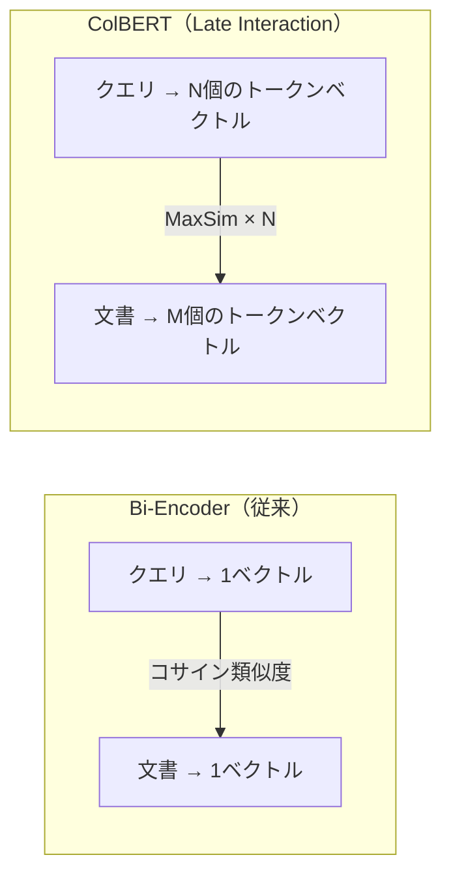
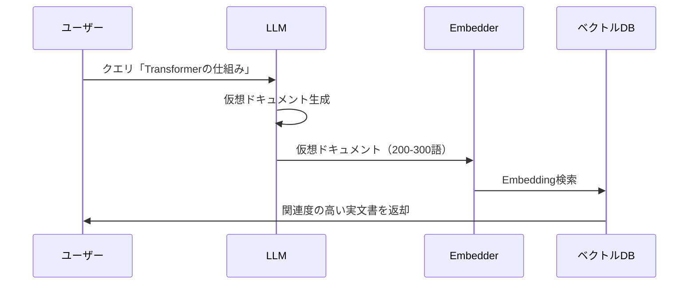
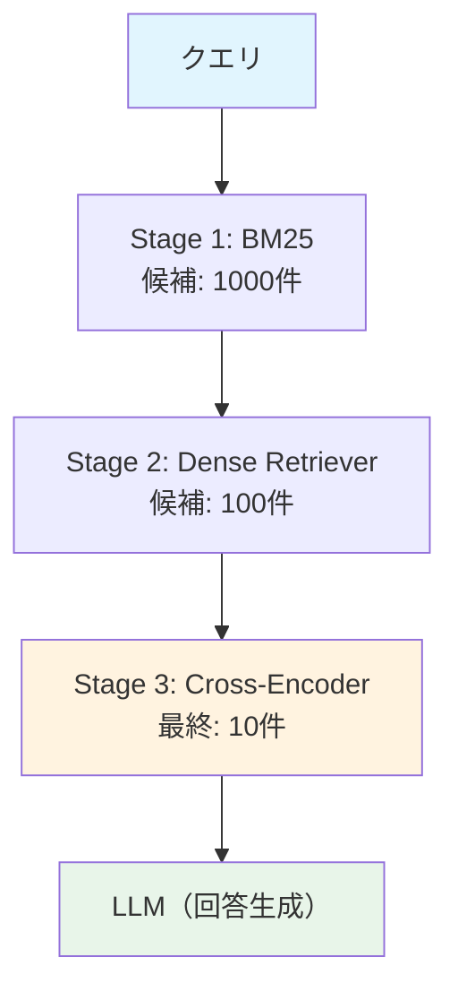

# セマンティック検索精度を向上させる5つの実装テクニック

セマンティック検索の精度は、RAGシステムの回答品質を直接左右します。しかし、単純にEmbeddingモデルを導入しただけでは、本番環境で求められる精度を達成できないケースが多いのが実情です。

本記事では、2025-2026年に注目されている**5つの検索精度向上テクニック**を実装レベルで解説します。Matryoshka Embedding、ColBERT（Late Interaction）、SPLADE（学習型スパース検索）、HyDE（仮想ドキュメント生成）、Cross-Encoder Rerankingを組み合わせることで、Precision@10を62%から84%へ改善した事例が報告されています。

## この記事でわかること

- Matryoshka Embeddingで**検索速度を5倍高速化**しながら精度98%を維持する実装方法
- ColBERT v2のLate Interactionで**トークンレベルの類似度**を活用した高精度検索の構築手法
- SPLADEによる**学習型スパース検索**でBM25を凌駕するセマンティック拡張の仕組み
- HyDE（仮想ドキュメント生成）で**短いクエリの検索精度を最大42ポイント改善**するアプローチ
- Cross-Encoder Rerankingの**3段階パイプライン**でPrecision@10を22ポイント向上させる手順

## 対象読者

- **想定読者**: 中級〜上級のPython / NLPエンジニア
- **必要な前提知識**:
  - Python 3.11+の基本文法
  - Embeddingモデル（Sentence Transformers等）の基本概念
  - ベクトル検索の仕組み（コサイン類似度、ANN検索）
  - RAG（Retrieval-Augmented Generation）の基本アーキテクチャ

:::message
関連記事: 既存のEmbeddingモデル選定やハイブリッド検索の基礎については、以下の記事も合わせてご参照ください。
- [MTEB×JMTEBで選ぶEmbeddingモデル：精度評価の実践ガイド](https://zenn.dev/0h_n0/articles/6388d71c6bcb23)
- [BM25×ベクトル検索のハイブリッド実装：RRFで検索精度を30%向上させる実践ガイド](https://zenn.dev/0h_n0/articles/f3d8b80351ae7b)
:::

## 結論・成果

本記事で紹介する5つのテクニックを組み合わせた場合の効果は、以下のとおりです。

| テクニック | 精度への効果 | レイテンシへの影響 | 導入コスト |
|-----------|------------|-----------------|-----------|
| Matryoshka Embedding | 98%の精度を維持して次元1/12に削減 | 検索5倍高速化 | 低 |
| ColBERT v2 (Late Interaction) | MRR@10で単一ベクトルを上回る | ストレージ2-3倍増 | 中 |
| SPLADE (学習型スパース) | BEIRベンチマークでDense Retrieverと同等以上 | BM25と同等 | 中 |
| HyDE (仮想ドキュメント) | Precision最大42pp向上 | LLM呼び出し分+43-60% | 高 |
| Cross-Encoder Reranking | Precision@10を22pp向上 | +50-200ms | 低〜中 |

重要な点として、**すべてのテクニックを一度に導入する必要はありません**。まずCross-Encoder Rerankingから導入し、効果を測定したうえで段階的に他のテクニックを追加していくアプローチが、コスト対効果の面で合理的です。

## Matryoshka Embeddingで可変次元の検索を実装する

Matryoshka Representation Learning（MRL）は、1つのEmbeddingベクトルを任意の次元数で「切り詰め」ても有用な表現を維持できる学習手法です。NeurIPS 2022で提案され、2025年以降はOpenAIの`text-embedding-3-small/large`やNomic Embedなど主要モデルに採用されています。

### MRLの仕組みと実装

MRLでは、学習時にベクトルの先頭 $d$ 次元だけを使って対比学習を行うことで、任意の次元数で精度を維持します。通常のEmbeddingでは768次元すべてを使いますが、MRLモデルでは先頭64次元だけでも98%以上の精度を保持できます。

```python
# matryoshka_search.py
from sentence_transformers import SentenceTransformer
import numpy as np


def create_matryoshka_index(
    documents: list[str],
    model_name: str = "nomic-ai/nomic-embed-text-v1.5",
    target_dim: int = 64,
) -> tuple[np.ndarray, SentenceTransformer]:
    """Matryoshka Embeddingで可変次元のインデックスを構築する。

    Args:
        documents: インデックス対象のドキュメントリスト
        model_name: MRL対応のEmbeddingモデル名
        target_dim: 使用する次元数（元の次元数以下）

    Returns:
        正規化済みEmbedding行列とモデルのタプル
    """
    model = SentenceTransformer(model_name, trust_remote_code=True)
    # ← MRLモデルは先頭target_dim次元を切り詰めるだけで使える
    embeddings = model.encode(documents, normalize_embeddings=True)
    truncated = embeddings[:, :target_dim]
    # 切り詰め後に再度L2正規化する（コサイン類似度の計算に必要）
    norms = np.linalg.norm(truncated, axis=1, keepdims=True)
    normalized = truncated / norms
    return normalized, model


def search(
    query: str,
    index: np.ndarray,
    model: SentenceTransformer,
    target_dim: int = 64,
    top_k: int = 10,
) -> np.ndarray:
    """Matryoshka Embeddingで検索を実行する。"""
    q_emb = model.encode([query], normalize_embeddings=True)
    q_truncated = q_emb[:, :target_dim]
    q_norm = q_truncated / np.linalg.norm(q_truncated, axis=1, keepdims=True)
    # コサイン類似度 = 正規化ベクトルの内積
    scores = (index @ q_norm.T).squeeze()
    return np.argsort(scores)[::-1][:top_k]
```

### 次元数と精度のトレードオフ

Matryoshka Representation Learningの論文によると、以下のような精度維持率が報告されています。

| 次元数 | フル次元比の精度維持率 | ストレージ削減率 |
|-------|---------------------|---------------|
| 768（フル） | 100% | 0% |
| 256 | 99.5% | 66.7% |
| 128 | 99.0% | 83.3% |
| 64 | 98.4% | 91.7% |
| 32 | 96.5% | 95.8% |

**なぜこの実装を選んだか:**
- MRL対応モデルを使えば、コード変更は次元の切り詰めと再正規化のみで済む
- ストレージとレイテンシの削減効果が大きく、本番導入のハードルが低い
- OpenAI `text-embedding-3-*` でもMRLが利用可能で、商用環境での採用実績が増えている

**注意点:**
> MRLは**モデルの学習時にMRLを組み込んだモデル**でのみ有効です。通常のEmbeddingモデルの出力を単純に切り詰めても、精度は大幅に劣化します。2025年のSMEC研究では、標準モデルの切り詰めでは96.46%にとどまるのに対し、MRLモデルでは98.37%を達成したと報告されています。また、次元を32以下にすると精度劣化が顕著になるため、64次元以上での利用が推奨されます。

## ColBERT v2のLate Interactionで高精度検索を構築する

ColBERT（Contextualized Late Interaction over BERT）は、文書全体を1つのベクトルに圧縮する従来のBi-Encoderと異なり、**トークンレベルのEmbeddingを保持**して検索時にMaxSim演算で照合するモデルです。Stanford NLP Groupが開発し、ColBERT v2では残差圧縮によりストレージを6-10倍削減しています。

### Late Interactionの検索フロー

通常のDense Retrieval（Bi-Encoder）では、クエリと文書をそれぞれ1つのベクトルに変換してコサイン類似度を計算します。ColBERTでは、クエリの各トークンと文書の各トークン間でMaxSim（最大類似度）を計算し、その合計をスコアとします。



MaxSimの計算式は以下のとおりです。

$$
\text{Score}(q, d) = \sum_{i=1}^{N} \max_{j=1}^{M} \mathbf{q}_i \cdot \mathbf{d}_j
$$

ここで、$\mathbf{q}_i$ はクエリの $i$ 番目のトークンベクトル、$\mathbf{d}_j$ は文書の $j$ 番目のトークンベクトルです。

### RAGパイプラインへの組み込み

ColBERT v2は、Retrieverとして使う方法とRerankerとして使う方法があります。大規模コレクション（100万件以上）ではRerankerとしての利用が現実的です。

```python
# colbert_reranker.py
from colbert import Searcher
from colbert.infra import ColBERTConfig, Run, RunConfig


def setup_colbert_searcher(
    index_path: str,
    checkpoint: str = "colbert-ir/colbertv2.0",
) -> Searcher:
    """ColBERT v2のSearcherをセットアップする。

    Args:
        index_path: 事前構築済みインデックスのパス
        checkpoint: ColBERTモデルのチェックポイント

    Returns:
        検索用のSearcherインスタンス
    """
    with Run().context(RunConfig(nranks=1)):
        config = ColBERTConfig(
            root=index_path,
            # ← PLAID検索エンジンで高速化（GPU: 6.8x、CPU: 45x）
            index_name="plaid_index",
        )
        searcher = Searcher(
            index=config.index_name,
            config=config,
            checkpoint=checkpoint,
        )
    return searcher


def search_with_colbert(
    searcher: Searcher,
    query: str,
    top_k: int = 10,
) -> list[dict]:
    """ColBERT v2で検索を実行し、スコア付き結果を返す。"""
    results = searcher.search(query, k=top_k)
    return [
        {"doc_id": doc_id, "rank": rank, "score": score}
        for rank, (doc_id, _, score) in enumerate(zip(*results), 1)
    ]
```

**なぜColBERTを選ぶのか:**
- トークンレベルの照合により、部分一致や概念の包含関係を捉えられる
- PLAID検索エンジンにより、140M文書規模でもGPUでミリ秒単位のレイテンシを実現
- MS MARCO、LoTTE、TREC DLなど複数ベンチマークで上位の検索品質を達成

**注意点:**
> ColBERTの最大の制約は**ストレージコスト**です。ColBERT v2の2-bit残差圧縮でも、10万文書（各100トークン）のインデックスは約36MBとなり、同規模の単一ベクトルインデックス（15MB）の約2.4倍です。文書数が数百万件を超える場合、ストレージ設計を慎重に行う必要があります。また、Jina-ColBERT-v2のような多言語対応モデルは存在しますが、日本語特化のColBERTモデルは2026年2月時点では選択肢が限られています。

## SPLADEで学習型スパース検索を導入する

SPLADE（SParse Lexical AnD Expansion model）は、BM25のようなスパース検索の利点を保ちながら、**ニューラルネットワークで語彙を意味的に拡張**するモデルです。NAVERが開発し、2025年にはEcho-Mistral-SPLADEがBEIRベンチマークで既存のスパース検索手法のSOTA（State-of-the-Art）を達成しています。

### SPLADEの仕組み

SPLADEは、BERT（またはそれ以降のTransformerモデル）のMLM（Masked Language Model）ヘッドを利用して、入力テキストに含まれない関連語にも重みを割り当てます。たとえば、「犬」というクエリに対して「ペット」「動物」「犬種」といった関連語が自動的に拡張されます。

具体的には、入力の各トークンについてMLMヘッドの出力logitをmax-poolingで集約し、ReLU関数とlog変換を経てスパースベクトルを生成します。

$$
\text{SPLADE}(t) = \max_{i \in \text{tokens}} \log(1 + \text{ReLU}(w_{t,i}))
$$

ここで $w_{t,i}$ は語彙 $t$ に対するトークン $i$ のMLM logitです。

### 実装例：Sentence Transformersでの利用

2025年にリリースされたSentence Transformers v5では、SPLADEモデルの学習と推論が直接サポートされています。

```python
# splade_search.py
from sentence_transformers import SparseEncoder
import torch


def encode_with_splade(
    texts: list[str],
    model_name: str = "naver/splade-cocondenser-ensembledistil",
) -> list[dict[int, float]]:
    """SPLADEでテキストをスパースベクトルにエンコードする。

    Args:
        texts: エンコード対象のテキストリスト
        model_name: SPLADEモデル名

    Returns:
        各テキストのスパースベクトル（語彙ID → 重みの辞書）
    """
    model = SparseEncoder(model_name)
    # ← encode_documentでドキュメント側のスパース表現を取得
    embeddings = model.encode(texts)
    return embeddings


def sparse_search(
    query: str,
    doc_embeddings: list[dict[int, float]],
    model: SparseEncoder,
    top_k: int = 10,
) -> list[tuple[int, float]]:
    """SPLADEスパースベクトルで検索を実行する。"""
    q_emb = model.encode([query])[0]
    scores = []
    for idx, doc_emb in enumerate(doc_embeddings):
        # スパースベクトルの内積（共通する語彙IDのみ計算）
        score = sum(
            q_emb.get(token_id, 0.0) * weight
            for token_id, weight in doc_emb.items()
        )
        scores.append((idx, score))
    scores.sort(key=lambda x: x[1], reverse=True)
    return scores[:top_k]
```

### BM25 vs SPLADE vs Dense Retrieverの比較

BEIRベンチマーク（12データセット平均）での各手法のNDCG@10を比較すると、以下のような傾向が報告されています。

| 手法 | NDCG@10（BEIR平均） | 特徴 |
|-----|--------------------|----|
| BM25 | 0.44 | 語彙一致のみ、ゼロショットで強い |
| SPLADE v2 | 0.50 | 語彙拡張により同義語をカバー |
| Echo-Mistral-SPLADE | 0.53 | LLMベースSPLADEでSOTA |
| DPR (Dense) | 0.38 | ドメイン外で精度低下しやすい |
| E5-large-v2 (Dense) | 0.50 | 汎用Dense Retriever |

**なぜSPLADEを選ぶのか:**
- BM25と同じ転置インデックスが使えるため、ElasticsearchやLuceneなど既存インフラに導入しやすい
- Denseモデルが苦手な固有名詞や専門用語の完全一致にも対応できる
- ゼロショット（ドメイン外データ）での精度劣化がDense Retrieverより小さい

**注意点:**
> SPLADEは語彙拡張の特性上、**エンコード時間がDense Retrieverの2-3倍**かかる場合があります。また、拡張された語彙が必ずしも意図した意味を持つとは限らず、ノイズとなるケースもあります。FLOPS正則化パラメータの調整が精度とスパース性のバランスに大きく影響するため、ドメインごとのチューニングが必要です。2026年2月時点で日本語に特化したSPLADEモデルは選択肢が限られるため、多言語モデル（splade-cocondenser-ensembledistil等）の利用が現実的です。

## HyDEで短いクエリの検索精度を改善する

HyDE（Hypothetical Document Embeddings）は、ユーザーのクエリからLLMで「仮想的な回答ドキュメント」を生成し、そのEmbeddingで検索するテクニックです。短いクエリや曖昧なクエリの検索精度を大幅に改善できます。

### HyDEの動作原理

通常の検索では、「Transformerの仕組み」のような短いクエリをそのままEmbeddingしますが、このベクトルは具体的な文書のベクトル空間とは離れた位置になりがちです。HyDEでは、LLMに「Transformerの仕組みについて解説する記事」を仮想的に生成させ、その文書のEmbeddingで検索します。



### 実装例

```python
# hyde_retriever.py
from anthropic import Anthropic
from sentence_transformers import SentenceTransformer
import numpy as np


def generate_hypothetical_document(
    query: str,
    client: Anthropic,
    model: str = "claude-sonnet-4-6-20250514",
    num_docs: int = 3,
) -> list[str]:
    """クエリから仮想ドキュメントを生成する。

    Args:
        query: ユーザーの検索クエリ
        client: Anthropic APIクライアント
        model: 使用するLLMモデル
        num_docs: 生成する仮想ドキュメント数

    Returns:
        仮想ドキュメントのリスト
    """
    prompt = f"""以下のクエリに回答する技術文書の一部を、{num_docs}個生成してください。
各文書は100-200語程度で、具体的な技術的内容を含めてください。
文書間で異なる側面をカバーしてください。

クエリ: {query}

出力形式: 各文書を---で区切ってください。"""

    response = client.messages.create(
        model=model,
        max_tokens=1024,
        messages=[{"role": "user", "content": prompt}],
    )
    docs = response.content[0].text.split("---")
    return [doc.strip() for doc in docs if doc.strip()][:num_docs]


def hyde_search(
    query: str,
    index: np.ndarray,
    encoder: SentenceTransformer,
    client: Anthropic,
    top_k: int = 10,
) -> np.ndarray:
    """HyDEで検索を実行する。

    複数の仮想ドキュメントのEmbeddingを平均化して検索する。
    """
    # 仮想ドキュメント生成（LLM呼び出し）
    hyp_docs = generate_hypothetical_document(query, client)
    # 仮想ドキュメントのEmbeddingを平均化
    hyp_embeddings = encoder.encode(hyp_docs, normalize_embeddings=True)
    avg_embedding = np.mean(hyp_embeddings, axis=0, keepdims=True)
    avg_embedding = avg_embedding / np.linalg.norm(avg_embedding)
    # 平均Embeddingで検索
    scores = (index @ avg_embedding.T).squeeze()
    return np.argsort(scores)[::-1][:top_k]
```

**なぜHyDEを選ぶのか:**
- 短いクエリ（1-3語）や曖昧なクエリで特に効果が高い
- 既存のEmbeddingインデックスをそのまま利用でき、追加のインデックス構築が不要
- 2025年のHyPE研究では、特定のデータセットでPrecisionが最大42ポイント、Recallが最大45ポイント向上したと報告されている

**注意点:**
> HyDEの最大の課題は**レイテンシとコスト**です。LLM呼び出しが1回追加されるため、レイテンシが43-60%増加します。また、LLMが生成する仮想ドキュメントの品質がそのまま検索精度に影響するため、プロンプト設計が重要です。小規模LLM（1B-4Bパラメータ）では幻覚率が高くなる傾向があり、パーソナルな質問（「私の注文履歴は？」など）では仮想ドキュメントが的外れになりやすい点にも注意が必要です。HyDEはファクト検索や技術質問には有効ですが、ユーザー固有のコンテキストを必要とするクエリには不向きです。

## Cross-Encoder Rerankingで最終精度を引き上げる

Cross-Encoder Rerankingは、初期検索で取得した候補文書をより精密なモデルで再スコアリングする手法です。検索パイプラインの最終段階に追加するだけで、**Precision@10を62%から84%に改善**できたという報告があります。

### 3段階検索パイプラインの設計

実運用では、以下の3段階パイプラインが推奨されています。



各ステージの役割は以下のとおりです。

| ステージ | モデル例 | 入力 | 出力 | 目的 |
|---------|---------|------|------|------|
| Stage 1 | BM25 / Elasticsearch | 全文書 | Top-1000 | 高速な候補絞り込み |
| Stage 2 | E5-large / GTE | Top-1000 | Top-100 | 意味的な類似度で絞り込み |
| Stage 3 | BGE-reranker-v2-m3 | Top-100 | Top-10 | クロスアテンションで精密スコアリング |

### 実装例

```python
# reranking_pipeline.py
from sentence_transformers import CrossEncoder
from dataclasses import dataclass


@dataclass
class SearchResult:
    """検索結果を表すデータクラス。"""
    doc_id: str
    text: str
    score: float


def rerank_with_cross_encoder(
    query: str,
    candidates: list[SearchResult],
    model_name: str = "BAAI/bge-reranker-v2-m3",
    top_k: int = 10,
) -> list[SearchResult]:
    """Cross-Encoderで候補文書を再スコアリングする。

    Args:
        query: 検索クエリ
        candidates: 初期検索で取得した候補文書リスト
        model_name: Cross-Encoderモデル名
        top_k: 返却する上位件数

    Returns:
        再スコアリングされた上位結果リスト
    """
    cross_encoder = CrossEncoder(model_name)
    # ← Cross-Encoderはクエリと文書のペアを同時に入力する
    pairs = [(query, c.text) for c in candidates]
    scores = cross_encoder.predict(pairs)

    for candidate, score in zip(candidates, scores):
        candidate.score = float(score)

    reranked = sorted(candidates, key=lambda x: x.score, reverse=True)
    return reranked[:top_k]


def three_stage_pipeline(
    query: str,
    bm25_retriever,  # BM25検索関数
    dense_retriever,  # Dense Retriever検索関数
    top_k_bm25: int = 1000,
    top_k_dense: int = 100,
    top_k_final: int = 10,
) -> list[SearchResult]:
    """3段階検索パイプラインを実行する。"""
    # Stage 1: BM25で高速に候補取得
    bm25_results = bm25_retriever(query, top_k=top_k_bm25)
    # Stage 2: Dense Retrieverで意味的フィルタリング
    dense_results = dense_retriever(query, candidates=bm25_results, top_k=top_k_dense)
    # Stage 3: Cross-Encoderで精密リランキング
    final_results = rerank_with_cross_encoder(query, dense_results, top_k=top_k_final)
    return final_results
```

### Rerankerモデルの選定

2026年2月時点で実用的なRerankerモデルの比較です。

| モデル | レイテンシ | 多言語対応 | コスト | 用途 |
|-------|----------|-----------|-------|------|
| BGE-reranker-v2-m3 | 50-100ms (GPU) | 100+言語 | 無料（インフラのみ） | 本番運用 |
| ms-marco-MiniLM-L-6-v2 | <50ms | 英語中心 | 無料 | プロトタイプ |
| Cohere Rerank 3.5 | 100-150ms | 主要言語 | $100/100k queries | マネージド環境 |

**なぜCross-Encoder Rerankingを選ぶのか:**
- 既存の検索パイプラインの末尾に追加するだけで、既存のインデックスやRetrieverを変更せずに精度を向上できる
- BGE-reranker-v2-m3は100+言語対応で日本語の検索にも利用可能
- Precision@10で22ポイントの向上が報告されており、費用対効果が高い

**注意点:**
> Cross-Encoderは**クエリと文書のペアごとにフルアテンションを計算する**ため、候補文書数に比例してレイテンシが増加します。100件のリランキングで50-200ms追加されるため、リアルタイム性が求められるアプリケーションでは候補数を適切に制限する必要があります。エンタープライズ環境では、追加の200-400msを許容して25-35%の精度向上を得るというトレードオフが一般的に受け入れられていると報告されています。

## よくある問題と解決方法

| 問題 | 原因 | 解決方法 |
|------|------|----------|
| Matryoshka切り詰めで精度が大幅低下 | MRL非対応モデルを使用している | `nomic-embed-text-v1.5` 等のMRL対応モデルに変更 |
| ColBERTのインデックス構築が遅い | PLAID設定が未適用 | `ColBERTConfig` でPLAIDエンジンを有効化 |
| SPLADEの検索結果にノイズが多い | FLOPS正則化が不十分 | 正則化パラメータを調整しスパース性を高める |
| HyDEで的外れな結果が返る | 仮想ドキュメントの品質が低い | プロンプトを改善し、生成数を3-5に増やして平均化 |
| Rerankingのレイテンシが長い | 候補文書数が多すぎる | Stage 2の出力をTop-50以下に制限 |
| 日本語検索の精度が低い | 英語特化モデルを使用 | 多言語モデル（BGE-m3, multilingual-e5-large）に変更 |

## まとめと次のステップ

**まとめ:**

- **Matryoshka Embedding**は次元を1/12に削減しながら98%の精度を維持でき、ストレージとレイテンシの最適化に有効
- **ColBERT v2**のLate Interactionはトークンレベルの照合で高精度を実現するが、ストレージコストに注意が必要
- **SPLADE**は語彙の意味拡張でBM25を凌駕し、既存の転置インデックスインフラを活用できる
- **HyDE**は短いクエリの精度を大幅改善するが、LLM呼び出しコストとレイテンシのトレードオフがある
- **Cross-Encoder Reranking**は既存パイプラインへの追加が容易で、Precision@10を22ポイント向上させる費用対効果の高い手法

**推奨する導入順序:**

1. まず**Cross-Encoder Reranking**を追加（最も導入が簡単で効果が高い）
2. 次に**Matryoshka Embedding**でストレージとレイテンシを最適化
3. 必要に応じて**SPLADE**でハイブリッド検索を構築
4. 短いクエリが多い場合に**HyDE**を検討
5. 高精度が必須の場面で**ColBERT v2**を導入

**次にやるべきこと:**

- 自分のデータセットで各テクニックの効果を**NDCG@10やPrecision@10で定量評価**する
- まずCross-Encoder Rerankingを既存パイプラインに追加し、ベースラインとの差分を測定する
- ドメイン特化データが十分にある場合は、Sentence Transformers v3でEmbeddingモデルの**ファインチューニング**を検討する

## 参考

- [Matryoshka Representation Learning（NeurIPS 2022）](https://arxiv.org/abs/2205.13147)
- [ColBERTv2: Effective and Efficient Retrieval via Lightweight Late Interaction](https://arxiv.org/abs/2112.01488)
- [PLAID: An Efficient Engine for Late Interaction Retrieval](https://arxiv.org/abs/2205.09707)
- [SPLADE v2: Sparse Lexical and Expansion Model for Information Retrieval](https://arxiv.org/abs/2109.10086)
- [Late Interaction Retrieval Models Overview（Weaviate Blog）](https://weaviate.io/blog/late-interaction-overview)
- [Best Reranker Models for RAG 2026](https://docs.bswen.com/blog/2026-02-25-best-reranker-models/)
- [Training and Finetuning Sentence Transformers v3（Hugging Face Blog）](https://huggingface.co/blog/train-sentence-transformers)
- [Training and Finetuning Sparse Embedding Models with Sentence Transformers v5（Hugging Face Blog）](https://huggingface.co/blog/train-sparse-encoder)

---

:::message
この記事はAI（Claude Code）により自動生成されました。内容の正確性については複数の情報源で検証していますが、実際の利用時は公式ドキュメントもご確認ください。
:::
