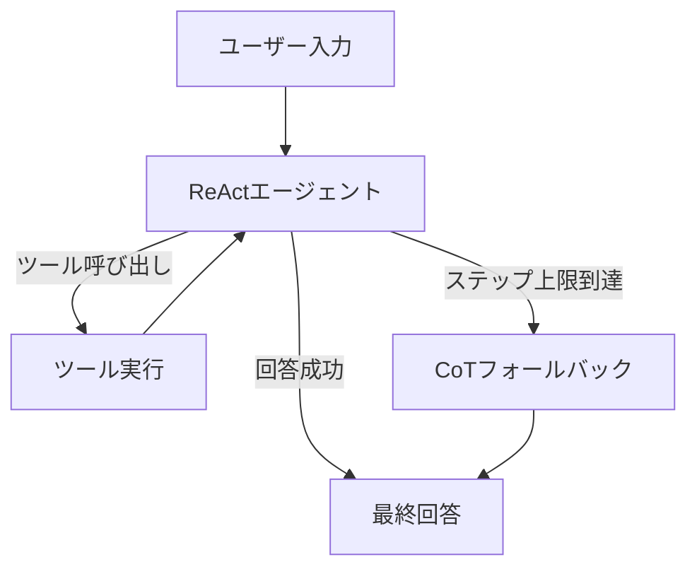
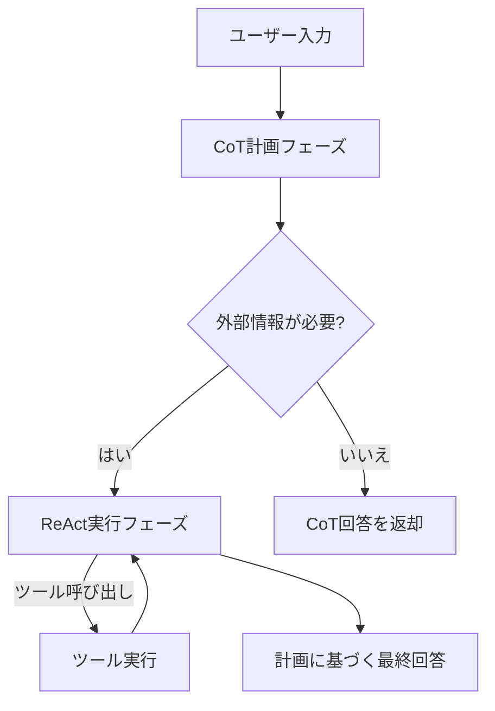
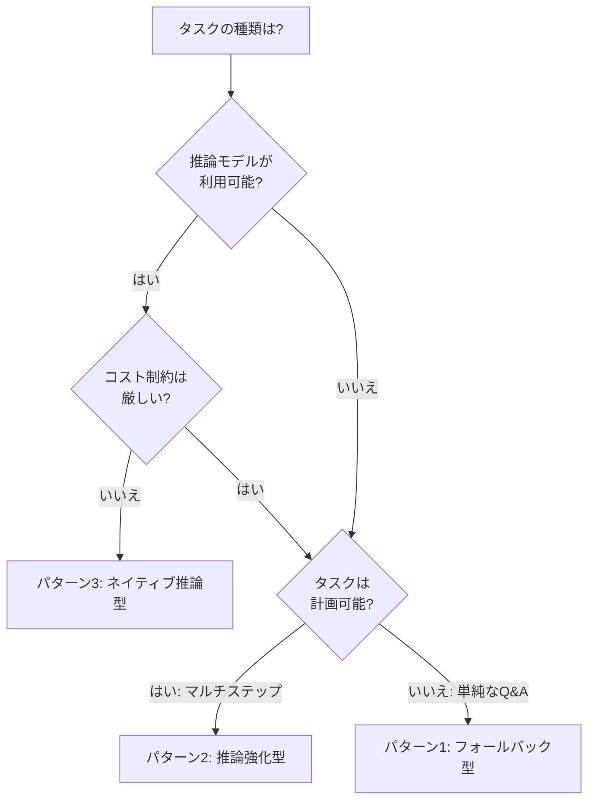

# ReAct+CoT推論を組み合わせたLLMエージェント実装3パターン

## この記事でわかること

- ReActとChain of Thought（CoT）を**組み合わせる**3つの実装パターンとその使い分け
- LangGraph v0.3を使った各パターンの動作するPythonコード
- 2026年2月時点の推論モデル（o3/o4-mini、Claude Sonnet 4.6）がReAct+CoTにもたらす変化
- パターン選択のための判断フローと、本番運用での注意点
- 各パターンの推論品質・レイテンシ・コストのトレードオフ

## 対象読者

- **想定読者**: LLMエージェント開発の中級者
- **必要な前提知識**:
  - Python 3.11以上の基礎文法
  - LangGraph v0.3の基本概念（StateGraph、ノード、エッジ）
  - ReActパターンの基本的な動作原理（Thought→Action→Observation ループ）
  - LLM APIの呼び出し経験（OpenAI/Anthropic）

:::message
ReActパターンの基礎を学びたい方は、先に[ReActパターン完全ガイド：LangGraphで実装する思考と行動の融合](https://zenn.dev/0h_n0/articles/467d219545ec5e)をご確認ください。
:::

## 結論・成果

ReActとCoTを組み合わせることで、**単体のReActエージェントでは解決できなかったタスクの成功率を向上**させられます。Yaoらの原論文（ICLR 2023）では、HotPotQAベンチマークにおいてReAct単体の成功率が27%だったのに対し、CoTとのハイブリッド（ReAct→CoT）で35%に改善したと報告されています。本記事では、2026年2月時点のフレームワークとモデルを前提に、3つの組み合わせパターンを実装コード付きで解説します。各パターンのレイテンシとコストの違いを整理し、タスク特性に応じた選択基準を提示します。

## ReActとCoTの関係を整理する

まず、ReActとCoTがどう違い、なぜ組み合わせが有効なのかを整理しましょう。

### 2つの手法の構造的な違い

| 特性 | Chain of Thought (CoT) | ReAct |
|------|----------------------|-------|
| **推論方式** | 内部知識による直線的な思考チェーン | 外部ツールとの対話を含む反復ループ |
| **外部情報** | なし（モデルの学習知識のみ） | ツール呼び出しで動的に取得 |
| **出力形式** | Thought → ... → Answer | Thought → Action → Observation → ... |
| **強み** | 数学・論理推論、内部知識で完結するタスク | 最新情報検索、API連携、マルチステップタスク |
| **弱み** | ハルシネーションのリスク、知識の鮮度限界 | 推論ステップ数に伴うコスト増、ツール依存 |

### なぜ組み合わせが有効か

ReAct単体では**内部知識だけで回答できるはずの質問にも無駄にツールを呼び出す**ことがあります。一方、CoT単体では**モデルの学習データに含まれない最新情報を参照できない**という限界があります。

Yaoらの原論文では、この相互補完の関係を活かした**フォールバック戦略**が提案されています。具体的には、ReActが規定ステップ内に回答できなかった場合にCoTへ切り替え、CoTの確信度が低い場合にReActへ切り替えるというアプローチです。

以降では、この考え方を発展させた3つの実装パターンを解説します。

## パターン1: フォールバック型（ReAct→CoTスイッチ）を実装する

最もシンプルな組み合わせパターンです。ReActエージェントを先に実行し、規定ステップ内に回答できなかった場合にCoT推論へフォールバックします。

### アーキテクチャ



### LangGraphでの実装

```python
# pattern1_fallback.py
from typing import Annotated, TypedDict
from langchain_core.messages import AIMessage, HumanMessage, SystemMessage
from langchain_openai import ChatOpenAI
from langgraph.graph import StateGraph, END
from langgraph.graph.message import add_messages
from langgraph.prebuilt import ToolNode

# ステート定義
class AgentState(TypedDict):
    messages: Annotated[list, add_messages]
    react_steps: int  # ReActのステップ数カウンター
    max_react_steps: int  # ReActの上限ステップ数
    fallback_triggered: bool  # CoTフォールバックが発動したか

# ツール定義（例: Web検索）
from langchain_core.tools import tool

@tool
def search_web(query: str) -> str:
    """Web検索を実行して最新情報を取得する"""
    # 実際にはTavily等のAPIを呼び出す
    return f"検索結果: {query}に関する最新情報..."

# モデル初期化
llm = ChatOpenAI(model="gpt-4o", temperature=0)
llm_with_tools = llm.bind_tools([search_web])

REACT_SYSTEM = """あなたはReActエージェントです。
質問に回答するために、以下のプロセスに従ってください:
1. Thought: 現在の状況を分析し、次のアクションを決定
2. Action: 必要であればツールを呼び出す
3. Observation: ツールの結果を観察し、次の思考に反映

ツールが不要な場合は、直接回答してください。"""

COT_SYSTEM = """あなたは論理的推論の専門家です。
以下の手順で段階的に考えてください:
1. 問題を分解する
2. 各部分について既知の情報を整理する
3. 論理的に推論を進める
4. 結論を導出する

必ずステップバイステップで思考過程を示してください。"""


def react_node(state: AgentState) -> AgentState:
    """ReActエージェントノード"""
    messages = [SystemMessage(content=REACT_SYSTEM)] + state["messages"]
    response = llm_with_tools.invoke(messages)
    return {
        "messages": [response],
        "react_steps": state["react_steps"] + 1,
    }


def cot_fallback_node(state: AgentState) -> AgentState:
    """CoTフォールバックノード"""
    # 元のユーザー質問を取得
    user_msg = next(
        m for m in state["messages"] if isinstance(m, HumanMessage)
    )
    cot_messages = [
        SystemMessage(content=COT_SYSTEM),
        HumanMessage(
            content=(
                f"以下の質問に、内部知識を使って段階的に回答してください。\n\n"
                f"質問: {user_msg.content}"
            )
        ),
    ]
    response = llm.invoke(cot_messages)  # ツールなしで推論
    return {
        "messages": [response],
        "fallback_triggered": True,
    }


def should_continue(state: AgentState) -> str:
    """ReAct継続判定: ツール呼び出し / 回答完了 / フォールバック"""
    last_message = state["messages"][-1]

    # ステップ上限チェック（← これが重要）
    if state["react_steps"] >= state["max_react_steps"]:
        return "cot_fallback"

    # ツール呼び出しがあれば継続
    if isinstance(last_message, AIMessage) and last_message.tool_calls:
        return "tools"

    # 回答完了
    return "end"


# グラフ構築
workflow = StateGraph(AgentState)
workflow.add_node("react", react_node)
workflow.add_node("tools", ToolNode([search_web]))
workflow.add_node("cot_fallback", cot_fallback_node)

workflow.set_entry_point("react")
workflow.add_conditional_edges(
    "react",
    should_continue,
    {"tools": "tools", "cot_fallback": "cot_fallback", "end": END},
)
workflow.add_edge("tools", "react")
workflow.add_edge("cot_fallback", END)

graph = workflow.compile()
```

### 実行例

```python
# 実行
result = graph.invoke({
    "messages": [HumanMessage(content="量子コンピュータの誤り訂正の原理を説明して")],
    "react_steps": 0,
    "max_react_steps": 3,  # 3ステップでフォールバック
    "fallback_triggered": False,
})

print(f"フォールバック発動: {result['fallback_triggered']}")
print(f"回答: {result['messages'][-1].content[:200]}...")
```

### なぜこのパターンを選ぶか

- **利点**: 実装がシンプルで、既存のReActエージェントに最小限の変更で追加できる
- **利点**: ReActの外部情報取得能力とCoTの論理推論能力を相互補完できる
- **制約**: フォールバック判定が「ステップ数の上限」という単純なヒューリスティクスに依存する

> **注意**: `max_react_steps`の値はタスクの複雑さに依存します。Yaoらの論文ではHotPotQAで7ステップ、FEVERで5ステップが使用されていますが、本番環境ではコストとレイテンシを考慮して3〜5ステップが現実的です。ステップ数を増やすとツール使用コストが線形に増加する点に注意してください。

## パターン2: 推論強化型（CoT→ReAct段階実行）を実装する

2つ目のパターンは、**まずCoTで計画を立て、その計画に基づいてReActエージェントを実行する**アプローチです。計画フェーズで推論の方向性を定めるため、ReActエージェントの無駄なツール呼び出しを削減できます。

### アーキテクチャ



### LangGraphでの実装

```python
# pattern2_plan_then_act.py
from typing import Annotated, TypedDict
from langchain_core.messages import AIMessage, HumanMessage, SystemMessage
from langchain_openai import ChatOpenAI
from langgraph.graph import StateGraph, END
from langgraph.graph.message import add_messages
from langgraph.prebuilt import ToolNode

class PlanActState(TypedDict):
    messages: Annotated[list, add_messages]
    plan: str  # CoTで生成された計画
    needs_tools: bool  # ツール呼び出しが必要か
    react_steps: int

PLAN_SYSTEM = """あなたは計画策定の専門家です。
ユーザーの質問に対して、以下を段階的に考えてください:

1. 質問の意図を分解する
2. 回答に必要な情報を列挙する
3. 各情報について、自分の知識で回答可能か、外部検索が必要かを判定する
4. 実行計画を箇条書きで出力する

出力形式:
## 分析
[質問の分解]

## 必要情報
- 情報1: [知識で対応可能 / 外部検索必要]
- 情報2: [知識で対応可能 / 外部検索必要]

## 判定
NEEDS_TOOLS: [true/false]

## 実行計画
1. [ステップ1]
2. [ステップ2]
"""

llm = ChatOpenAI(model="gpt-4o", temperature=0)
llm_with_tools = llm.bind_tools([search_web])


def plan_node(state: PlanActState) -> PlanActState:
    """CoT計画ノード: 質問を分析し、実行計画を策定"""
    messages = [
        SystemMessage(content=PLAN_SYSTEM),
        state["messages"][-1],  # ユーザーの質問
    ]
    response = llm.invoke(messages)
    plan_text = response.content

    # 計画からツール必要性を判定
    needs_tools = "NEEDS_TOOLS: true" in plan_text

    return {
        "messages": [response],
        "plan": plan_text,
        "needs_tools": needs_tools,
    }


REACT_WITH_PLAN = """あなたはReActエージェントです。
以下の計画に従って、ツールを使って情報を収集し、回答を構築してください。

## 事前計画
{plan}

計画に記載された「外部検索必要」な情報のみツールで取得してください。
不要なツール呼び出しは避け、計画に沿って効率的に進めてください。"""


def react_with_plan_node(state: PlanActState) -> PlanActState:
    """計画に基づくReActノード"""
    system = REACT_WITH_PLAN.format(plan=state["plan"])
    messages = [SystemMessage(content=system)] + [
        m for m in state["messages"] if isinstance(m, HumanMessage)
    ]
    response = llm_with_tools.invoke(messages)
    return {
        "messages": [response],
        "react_steps": state["react_steps"] + 1,
    }


def route_after_plan(state: PlanActState) -> str:
    """計画後のルーティング: ツール必要なら ReAct、不要なら終了"""
    if state["needs_tools"]:
        return "react_execute"
    return "end"


def should_continue_react(state: PlanActState) -> str:
    """ReAct継続判定"""
    last_message = state["messages"][-1]
    if state["react_steps"] >= 5:
        return "end"
    if isinstance(last_message, AIMessage) and last_message.tool_calls:
        return "tools"
    return "end"


# グラフ構築
workflow = StateGraph(PlanActState)
workflow.add_node("plan", plan_node)
workflow.add_node("react_execute", react_with_plan_node)
workflow.add_node("tools", ToolNode([search_web]))

workflow.set_entry_point("plan")
workflow.add_conditional_edges(
    "plan", route_after_plan, {"react_execute": "react_execute", "end": END}
)
workflow.add_conditional_edges(
    "react_execute",
    should_continue_react,
    {"tools": "tools", "end": END},
)
workflow.add_edge("tools", "react_execute")

graph = workflow.compile()
```

### なぜこのパターンを選ぶか

- **利点**: 計画フェーズで「ツールが本当に必要か」を事前判定するため、**不要なAPI呼び出しを削減**できる
- **利点**: 計画がReActの推論を方向付けるため、複雑なマルチステップタスクでの成功率が向上する
- **制約**: 計画フェーズ分のLLM呼び出しが追加されるため、**単純な質問ではオーバーヘッドになる**

> **ハマりポイント**: 計画フェーズで「外部検索が必要」と判定されたにもかかわらず、ReActフェーズでモデルがツールを呼ばずに回答してしまうケースがあります。これはシステムプロンプトで「計画の判定に従うこと」を明示的に指示することで緩和できますが、完全には防げません。モデルの確信度が高い場合にツール呼び出しをスキップするのは、コスト削減の観点では合理的な振る舞いでもあります。

## パターン3: ネイティブ推論型（推論モデル内蔵CoT）を実装する

3つ目のパターンは、2026年2月時点で利用可能な**推論モデルの内蔵CoT機能を活用する**アプローチです。o3/o4-miniはChain of Thought内でツール呼び出しをネイティブに実行し、推論トークンをツール呼び出し間で永続化します。Claude Sonnet 4.6はinterleaved thinkingでthinkingブロックとtool_useを交互に実行できます。

### 2026年2月時点の推論モデル対応状況

| モデル | 内蔵CoT | ツール呼び出しとの統合 | 推論トークン永続化 |
|--------|---------|----------------------|-------------------|
| **o3 / o4-mini** | ネイティブCoT | CoT内でfunction calling実行 | Responses APIで暗号化永続化 |
| **Claude Sonnet 4.6** | interleaved thinking | thinkingブロック + tool_use交互実行 | コンテキスト内で自動永続化 |
| **Claude Opus 4.6** | adaptive thinking | effort パラメータで深度制御 | コンテキスト内で自動永続化 |
| **Gemini 3 Pro Deep Think** | Deep Think モード | System 2推論 + ツール連携 | セッション内で永続化 |
| **GPT-5** | 統合推論 | 必要時に自動でCoT発動 | 統合済み |

### OpenAI o3での実装

```python
# pattern3_native_reasoning_openai.py
from openai import OpenAI
import json

client = OpenAI()

tools = [
    {
        "type": "function",
        "function": {
            "name": "search_web",
            "description": (
                "Web検索を実行する。"
                "モデルの学習データに含まれない最新情報が必要な場合に使用する。"
                "内部知識で回答可能な場合は呼び出さないこと。"
            ),
            "parameters": {
                "type": "object",
                "properties": {
                    "query": {
                        "type": "string",
                        "description": "検索クエリ",
                    }
                },
                "required": ["query"],
            },
        },
    }
]


def run_agent_with_native_reasoning(question: str) -> str:
    """o3のネイティブCoT+ツール呼び出しでエージェントを実行"""
    messages = [
        {
            "role": "system",
            "content": (
                "質問に正確に回答してください。\n"
                "回答に最新情報が必要な場合はsearch_webツールを使用してください。\n"
                "内部知識で十分な場合はツールを使わず直接回答してください。\n"
                "推論過程を段階的に考えてから回答してください。"
            ),
        },
        {"role": "user", "content": question},
    ]

    # o3はCoT内でツール呼び出しを自動実行
    response = client.responses.create(
        model="o3",
        input=messages,
        tools=tools,
        # 推論トークンの暗号化コンテンツを保持（← 重要）
        include=["reasoning.encrypted_content"],
    )

    # ツール呼び出し結果をフィードバック
    context = response.output
    while any(
        item.type == "function_call" for item in response.output
    ):
        for item in response.output:
            if item.type == "function_call":
                # ツール実行（実際にはAPI呼び出し）
                result = execute_tool(item.name, json.loads(item.arguments))
                context.append(
                    {
                        "type": "function_call_output",
                        "call_id": item.call_id,
                        "output": result,
                    }
                )

        # 推論トークンを永続化して次の呼び出し
        response = client.responses.create(
            model="o3",
            input=context,
            tools=tools,
            include=["reasoning.encrypted_content"],
        )
        context = response.output

    # 最終回答を抽出
    return next(
        item.text
        for item in response.output
        if item.type == "message"
    )


def execute_tool(name: str, arguments: dict) -> str:
    """ツール実行のディスパッチ"""
    if name == "search_web":
        # 実際にはTavily等のAPIを呼び出す
        return f"検索結果: {arguments['query']}に関する情報..."
    raise ValueError(f"Unknown tool: {name}")
```

### Claude Sonnet 4.6 interleaved thinkingでの実装

```python
# pattern3_native_reasoning_claude.py
import anthropic

client = anthropic.Anthropic()

tools = [
    {
        "name": "search_web",
        "description": (
            "Web検索を実行する。"
            "モデルの学習データに含まれない最新情報が必要な場合に使用する。"
        ),
        "input_schema": {
            "type": "object",
            "properties": {
                "query": {
                    "type": "string",
                    "description": "検索クエリ",
                }
            },
            "required": ["query"],
        },
    }
]


def run_agent_with_interleaved_thinking(question: str) -> str:
    """Claude Sonnet 4.6のinterleaved thinkingでエージェント実行"""
    messages = [{"role": "user", "content": question}]

    response = client.messages.create(
        model="claude-sonnet-4-6",
        max_tokens=16000,
        thinking={
            "type": "enabled",
            "budget_tokens": 10000,  # 推論トークンの予算
        },
        tools=tools,
        messages=messages,
    )

    # tool_useが含まれる場合はループ
    while response.stop_reason == "tool_use":
        # レスポンスからthinking + tool_useブロックを処理
        assistant_content = response.content
        tool_results = []

        for block in assistant_content:
            if block.type == "tool_use":
                # ツール実行
                result = execute_tool(block.name, block.input)
                tool_results.append(
                    {
                        "type": "tool_result",
                        "tool_use_id": block.id,
                        "content": result,
                    }
                )

        # thinkingブロックを含む全コンテンツを保持して再呼び出し
        messages.append({"role": "assistant", "content": assistant_content})
        messages.append({"role": "user", "content": tool_results})

        response = client.messages.create(
            model="claude-sonnet-4-6",
            max_tokens=16000,
            thinking={
                "type": "enabled",
                "budget_tokens": 10000,
            },
            tools=tools,
            messages=messages,
        )

    # 最終回答を抽出
    return next(
        block.text
        for block in response.content
        if block.type == "text"
    )
```

### なぜこのパターンを選ぶか

- **利点**: フレームワーク側でCoT/ReActの切り替えロジックを実装する必要がない。モデルが推論の中で**自律的にツール呼び出しの要否を判断**する
- **利点**: o3/o4-miniでは推論トークンがツール呼び出し間で永続化されるため、**推論の一貫性が高い**
- **制約**: 推論トークンのコストが追加で発生する。o3の場合、通常のGPT-4oと比較して**入力トークン単価が約2〜3倍**
- **制約**: 推論モデル（o3/o4-mini、Claude with extended thinking）を前提とするため、**モデルの選択肢が限定される**

> **注意**: OpenAIのo3/o4-miniでは、ツール定義の`description`フィールドに使用条件を明記することが推奨されています。公式ガイドによると、ツール説明の先頭に重要な制約を配置することで、ツール選択の精度が約6%向上したと報告されています。

## 3パターンの比較と選択基準

### パフォーマンス・コスト比較

| 項目 | パターン1: フォールバック型 | パターン2: 推論強化型 | パターン3: ネイティブ推論型 |
|------|--------------------------|---------------------|-------------------------|
| **LLM呼び出し回数** | 1〜N+1回（フォールバック時+1） | 2〜N+1回（計画+実行） | 1〜N回（推論モデル内で統合） |
| **推論品質** | 中（フォールバック時に文脈断絶） | 高（計画が推論を方向付け） | 高（推論トークン永続化で一貫） |
| **レイテンシ** | 低〜中 | 中〜高（計画フェーズ分） | 中〜高（推論トークン生成分） |
| **コスト** | 低〜中 | 中（計画の追加コスト） | 高（推論トークン課金） |
| **実装複雑度** | 低 | 中 | 低（APIに依存） |
| **モデル依存度** | 低（任意のLLM） | 低（任意のLLM） | 高（推論モデル限定） |

### 選択フロー

以下の判断基準でパターンを選択してください。



**具体的な使い分け例**:

- **パターン1（フォールバック型）**: FAQ応答、単純な情報検索エージェント。実装コストを抑えたい場合
- **パターン2（推論強化型）**: 調査レポート作成、マルチステップのデータ分析。計画的なツール使用が求められる場合
- **パターン3（ネイティブ推論型）**: 高精度な推論が必要なタスク、複雑な意思決定エージェント。コストよりも品質を優先する場合

## 本番運用での注意点を把握する

### コスト管理: 推論トークンの見積もり

推論モデルを使う場合、推論トークン（thinking tokens）が追加コストとなります。以下は2026年2月時点の概算です。

| モデル | 入力トークン単価 | 出力トークン単価 | 推論トークン扱い |
|--------|-----------------|-----------------|----------------|
| GPT-4o | $2.50/1M | $10.00/1M | なし |
| o3 | $2.00/1M（キャッシュ時$0.50） | $8.00/1M | 出力に含む |
| o4-mini | $1.10/1M（キャッシュ時$0.275） | $4.40/1M | 出力に含む |
| Claude Sonnet 4.6 | $3.00/1M | $15.00/1M | thinking budget内 |

> **よくある間違い**: 推論トークンの予算（budget_tokens）を大きく設定しすぎると、モデルが使い切らない場合でもレイテンシが増加します。Claudeの場合、budget_tokensは32k以上に設定してもほとんどの場合で効果が薄いと公式ドキュメントに記載されています。

### ツール数増加による性能劣化への対策

LangChain公式のベンチマーク調査では、**ReActエージェントに与えるツール数とドメイン数が増えるほど性能が劣化する**ことが報告されています。具体例として、GPT-4oはカレンダースケジューリングタスクで7ドメインの環境において、パス率が2%まで低下しました。一方、Claude 3.5 Sonnetは14ドメイン以上でも比較的安定した性能を維持しました。

**対策**:

1. **ツールのスコープを絞る**: 1つのエージェントに与えるツールは10個以下が推奨
2. **ツール説明の最適化**: 説明の先頭に「いつ使うか」を明記する
3. **ドメイン分割**: マルチエージェント構成で各エージェントの責務を分離する

### Reflexionパターンとの組み合わせ

ReAct+CoTにさらに**自己修正ループ**（Reflexion）を追加すると、エージェントが自身の出力を評価し修正できます。Shinnらの原論文（NeurIPS 2023）で提案されたこのアプローチは、同一モデルが行動・評価・反省をすべて担当するため**確証バイアスが生じやすい**点に注意が必要です。2025年のMAR（Multi-Agent Reflexion）では複数エージェントへの役割分担で緩和しています。

Reflexionループを追加すると、最悪ケースでLLM呼び出し回数が試行回数倍に増加するため、本番環境では最大2回が現実的な上限です。

## よくある問題と解決方法

| 問題 | 原因 | 解決方法 |
|------|------|----------|
| ReActが無限ループする | ツールの出力がモデルの期待と一致しない | `max_react_steps`で上限設定 + フォールバック実装 |
| CoTフォールバック後の回答品質が低い | フォールバック時にReActで得た情報が引き継がれない | ReActの中間結果をCoTのプロンプトに含める |
| 推論モデルのコストが想定を超える | thinking tokensの使用量が予測困難 | budget_tokensの設定 + 月次コスト上限アラート |
| ツール呼び出しの引数が不正 | ツール定義のdescriptionが曖昧 | strict modeの有効化 + few-shot例の追加 |
| 計画フェーズで「ツール不要」と誤判定 | モデルの確信度が高すぎる | 計画プロンプトに「迷ったらツール使用側に倒す」と明記 |

## まとめと次のステップ

**まとめ:**

- **パターン1（フォールバック型）**: ReAct → CoT切り替え。実装が最もシンプルで、既存エージェントへの追加が容易
- **パターン2（推論強化型）**: CoT計画 → ReAct実行。不要なツール呼び出しを削減し、マルチステップタスクに有効
- **パターン3（ネイティブ推論型）**: o3/Claude Sonnet 4.6の内蔵CoT活用。推論品質が高いが、モデル依存度とコストも高い
- 3パターンは**排他的ではなく組み合わせ可能**。パターン2の計画フェーズにパターン3の推論モデルを使う構成も有効
- 本番運用では**ツール数の制限**（10個以下推奨）と**ステップ数の上限設定**が性能維持の鍵

**次にやるべきこと:**

1. 自社のタスク特性（単純Q&A / マルチステップ / 高精度推論）に基づいてパターンを選択する
2. LangGraphの`create_agent`関数を使い、選択したパターンのプロトタイプを構築する
3. 実タスクでのベンチマーク（成功率・レイテンシ・コスト）を計測し、パターンの有効性を検証する

## 参考

- [ReAct: Synergizing Reasoning and Acting in Language Models（Yao et al., ICLR 2023）](https://arxiv.org/abs/2210.03629)
- [LangGraph Agents ドキュメント](https://docs.langchain.com/oss/python/langchain/agents)
- [o3/o4-mini Function Calling Guide（OpenAI Cookbook）](https://developers.openai.com/cookbook/examples/o-series/o3o4-mini_prompting_guide/)
- [Building with extended thinking（Claude API Docs）](https://platform.claude.com/docs/en/build-with-claude/extended-thinking)
- [Benchmarking Single Agent Performance（LangChain Blog）](https://blog.langchain.com/react-agent-benchmarking/)
- [Reflexion: Language Agents with Verbal Reinforcement Learning（Shinn et al., NeurIPS 2023）](https://arxiv.org/abs/2303.11366)
- [ReAct Prompting | Prompt Engineering Guide](https://www.promptingguide.ai/techniques/react)
- [Chain-of-Thought Prompting Elicits Reasoning in LLMs（Wei et al., NeurIPS 2022）](https://arxiv.org/abs/2201.11903)

---

:::message
この記事はAI（Claude Code）により自動生成されました。内容の正確性については複数の情報源で検証していますが、実際の利用時は公式ドキュメントもご確認ください。
:::
