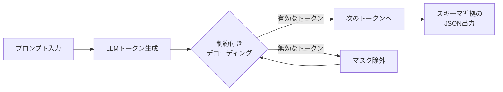
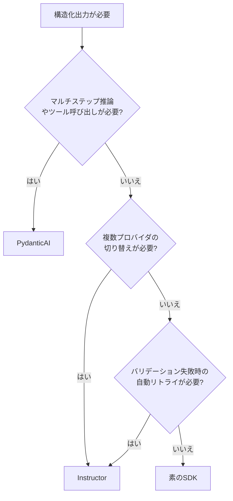
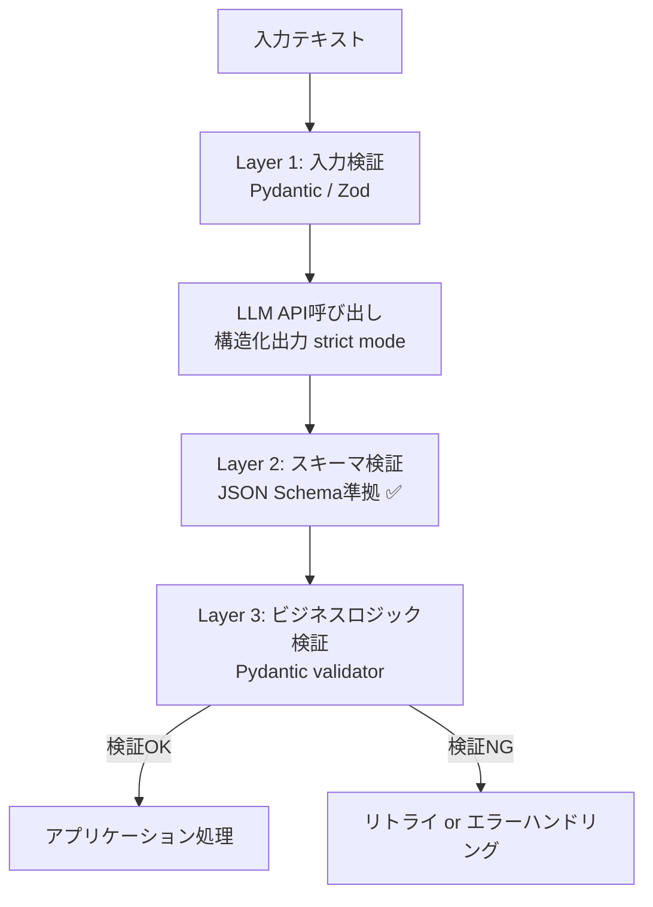

# LLM構造化出力の全手法比較2026：型安全なAI統合を実現する実践ガイド

## この記事でわかること

- OpenAI・Anthropic・Google Geminiが提供するネイティブ構造化出力APIの仕様差と使い分け
- Instructor・PydanticAI・素のSDKによる構造化出力実装の実践的な比較と選定基準
- 制約付きデコーディング（Constrained Decoding）の仕組みとパフォーマンス特性
- 本番運用で発生する5つの典型的な落とし穴とその対策パターン
- プロンプト工学から脱却し、スキーマ駆動でLLM出力の信頼性を100%にする方法

## 対象読者

- **想定読者**: 中級〜上級のPython/TypeScriptエンジニアでLLMをプロダクションに組み込んでいる方
- **必要な前提知識**:
  - Python 3.11+の基礎文法とPydantic v2の基本的な使い方
  - OpenAI API または Anthropic API の基本的なリクエスト/レスポンス構造
  - JSON Schemaの基本概念（`type`、`properties`、`required`）

## 結論・成果

2026年2月時点で、3大LLMプロバイダ（OpenAI・Anthropic・Google Gemini）は全てネイティブ構造化出力をGA（一般提供）しています。OpenAIの公式ドキュメントによると、プロンプト工学のみで構造化出力を得ようとした場合のスキーマ準拠率は約35.9%でしたが、**strict modeを有効にすることでスキーマ準拠率は100%**に到達したと報告されています。また、Instructorライブラリは月間300万ダウンロード、GitHub 11,000スター超を記録し、構造化出力の事実上の標準ライブラリとなっています。

本記事では、これらの手法を横断的に比較し、ユースケースに応じた最適な選択を支援します。

**関連記事**: 個別の手法をさらに深掘りしたい方は、以下の既存記事もあわせてご覧ください。
- [LLM出力検証の実践：Pydanticで95%精度を実現する3層戦略](https://zenn.dev/0h_n0/articles/0a8f4d0e7c71bf)
- [Function Calling×Structured Outputs実装入門：3社APIで型安全なツール連携を構築する](https://zenn.dev/0h_n0/articles/b2d1df91e5f5de)
- [Guidance言語でLLM出力を制御：構造化データ生成で30%コスト削減を実現する実践ガイド](https://zenn.dev/0h_n0/articles/69e37b35076338)

## 構造化出力の3層モデルを理解する

LLMから構造化データを取得する手法は、信頼性に応じて3つのレベルに分類できます。2026年の本番運用では**Level 3が標準**ですが、各レベルの特性を理解しておくことが、適切な技術選定とフォールバック設計に不可欠です。

### Level 1: プロンプト工学（信頼性80〜95%）

システムプロンプトで「JSONで出力してください」と指示する方法です。実装は手軽ですが、型保証がなく、不正なJSONが返る可能性があります。

```python
# Level 1: プロンプト工学のみ（非推奨）
# main.py
from openai import OpenAI

client = OpenAI()

response = client.chat.completions.create(
    model="gpt-4o",
    messages=[
        {
            "role": "system",
            "content": "必ず以下のJSON形式で回答してください: {\"name\": str, \"age\": int}"
        },
        {"role": "user", "content": "田中太郎は30歳のエンジニアです"}
    ]
)

# ⚠️ パースに失敗する可能性がある
import json
try:
    data = json.loads(response.choices[0].message.content)
except json.JSONDecodeError:
    # 本番で頻繁に発生するパターン
    print("JSONパース失敗: 再試行が必要")
```

**なぜこの方法が不十分か:**
- 理由1: モデルが自然言語テキストを混在させることがある（例: `"以下がJSONです: {...}"`）
- 理由2: フィールドの型が保証されない（`age`が`"30"`（文字列）で返る場合がある）

> **注意**: プロトタイプや社内ツールなど、失敗時に人間が介入できる環境でのみ許容されます。外部APIやパイプラインでは使用しないでください。

### Level 2: Function Calling / Tool Use（信頼性95〜99%）

JSON Schemaをツール定義としてモデルに渡す方法です。モデルはスキーマを「ヒント」として認識しますが、制約付きデコーディングなしでは100%のスキーマ準拠は保証されません。

### Level 3: ネイティブ構造化出力（信頼性100%）

**制約付きデコーディング**により、トークン生成の段階でスキーマに違反するトークンをマスク（除外）する方法です。文法的に不正なトークンは生成候補に含まれないため、出力は必ずスキーマに準拠します。



2026年時点で、OpenAI（GPT-4o / GPT-5系）、Anthropic（Claude Opus 4.6 / Sonnet 4.6 / Haiku 4.5）、Google（Gemini 2.5系）の主要モデルが全てこのLevel 3をサポートしています。

## 3大プロバイダのStructured Outputs APIを比較する

各プロバイダのネイティブ構造化出力APIには設計思想の違いがあります。ここでは同一のスキーマ（メール情報抽出）を各APIで実装し、仕様差を明らかにします。

### OpenAI: `response_format` + strict mode

OpenAIはJSON Schema仕様のサブセットをサポートし、`strict: true`でCFG（文脈自由文法）エンジンによる完全なスキーマ強制を行います。

```python
# openai_structured.py
from pydantic import BaseModel
from openai import OpenAI

class EmailInfo(BaseModel):
    name: str
    email: str
    plan_interest: str
    demo_requested: bool

client = OpenAI()

# Pydantic統合: parseメソッドでスキーマ変換〜検証を自動化
completion = client.chat.completions.parse(
    model="gpt-4o",
    messages=[
        {
            "role": "user",
            "content": "Extract: John Smith (john@example.com) wants Enterprise plan demo"
        }
    ],
    response_format=EmailInfo,  # ← Pydanticモデルを直接指定
)

# 型安全なアクセス（IDE補完も効く）
result = completion.choices[0].message.parsed
print(f"{result.name}: {result.email}")  # John Smith: john@example.com

# refusal（安全性拒否）のハンドリング
if completion.choices[0].message.refusal:
    print(f"拒否理由: {completion.choices[0].message.refusal}")
```

### Anthropic: `output_config.format` + constrained decoding

Anthropicは2025年11月にstructured outputsをGA化し、`output_config.format`パラメータでJSON Schema指定を行います。初回リクエスト時にスキーマをコンパイルし、24時間キャッシュする設計です。

```python
# anthropic_structured.py
from pydantic import BaseModel
from anthropic import Anthropic

class EmailInfo(BaseModel):
    name: str
    email: str
    plan_interest: str
    demo_requested: bool

client = Anthropic()

# parseメソッドでPydanticモデルを直接指定
response = client.messages.parse(
    model="claude-sonnet-4-6",
    max_tokens=1024,
    messages=[
        {
            "role": "user",
            "content": "Extract: John Smith (john@example.com) wants Enterprise plan demo"
        }
    ],
    output_format=EmailInfo,  # ← Pydanticモデル指定
)

# parsed_output属性で型安全にアクセス
result = response.parsed_output
print(f"{result.name}: {result.email}")

# stop_reasonで安全性拒否を検出
if response.stop_reason == "refusal":
    print("安全性拒否が発生しました")
```

### Google Gemini: `response_schema` + JSON mode

Gemini APIはJSON Schema仕様をサポートし、`anyOf`や`$ref`にも対応しています。Gemini 2.5系モデルではプロパティの順序保持もサポートされています。

```python
# gemini_structured.py
import google.generativeai as genai

# Gemini APIではJSON Schemaを直接指定
model = genai.GenerativeModel(
    "gemini-2.5-flash",
    generation_config={
        "response_mime_type": "application/json",
        "response_schema": {
            "type": "object",
            "properties": {
                "name": {"type": "string"},
                "email": {"type": "string"},
                "plan_interest": {"type": "string"},
                "demo_requested": {"type": "boolean"}
            },
            "required": ["name", "email", "plan_interest", "demo_requested"]
        }
    }
)

response = model.generate_content(
    "Extract: John Smith (john@example.com) wants Enterprise plan demo"
)

import json
result = json.loads(response.text)
print(f"{result['name']}: {result['email']}")
```

### 3社API仕様比較

以下の表は、各プロバイダの構造化出力APIの主要な仕様差をまとめたものです。

| 機能 | OpenAI | Anthropic | Google Gemini |
|------|--------|-----------|---------------|
| **パラメータ名** | `response_format` | `output_config.format` | `response_schema` |
| **strict mode** | `strict: true` | デフォルトで制約付き | `response_mime_type`指定 |
| **スキーマ準拠率** | 100%（strict時） | 100%（constrained decoding） | 100%（JSON mode時） |
| **Pydantic統合** | `.parse()`メソッド | `.parse()`メソッド | 手動変換 |
| **Zod統合** | `zodResponseFormat()` | `zodOutputFormat()` | 手動変換 |
| **refusalハンドリング** | `message.refusal`プロパティ | `stop_reason: "refusal"` | エラーレスポンス |
| **スキーマキャッシュ** | あり | 24時間キャッシュ | あり |
| **`anyOf`サポート** | あり | あり | あり |
| **`$ref`サポート** | あり | あり（外部$ref除く） | あり |
| **再帰スキーマ** | 非対応 | 非対応 | 非対応 |
| **strict toolsの上限** | 制限あり | 20個/リクエスト | 制限あり |

> **制約**: 3社とも**再帰スキーマは非対応**です。木構造やグラフ構造を表現する場合は、最大深度を決めてスキーマをフラット化する必要があります。

## Instructor・PydanticAI・素のSDKを選定する

構造化出力を実装する際、ライブラリ選定は重要な設計判断です。ここでは3つの主要アプローチを比較します。

### Instructor: スキーマ駆動の抽出に特化

Instructorは、Pydanticモデルを定義するだけでLLMから構造化データを抽出できるライブラリです。15以上のプロバイダに対応し、自動リトライ・ストリーミング・バリデーションを内蔵しています。

```python
# instructor_example.py
import instructor
from pydantic import BaseModel, Field
from typing import Optional

class ProductReview(BaseModel):
    """商品レビューの構造化データ"""
    product_name: str = Field(description="商品名")
    rating: int = Field(ge=1, le=5, description="1-5の評価スコア")
    pros: list[str] = Field(description="良い点のリスト")
    cons: list[str] = Field(description="改善点のリスト")
    summary: str = Field(max_length=200, description="レビュー要約")
    would_recommend: Optional[bool] = Field(description="推奨するか")

# from_provider で統一的にプロバイダを切り替え可能
client = instructor.from_provider("openai/gpt-4o")

review = client.create(
    response_model=ProductReview,
    messages=[
        {
            "role": "user",
            "content": """以下のレビューを構造化してください:
            MacBook Pro M4は処理速度が圧倒的に速く、
            バッテリーも1日持ちます。ただし価格が高く、
            ポートが少ないのが難点です。総合4点。おすすめします。"""
        }
    ],
    max_retries=3,  # バリデーション失敗時の自動リトライ
)

print(f"商品: {review.product_name}")
print(f"評価: {review.rating}/5")
print(f"推奨: {review.would_recommend}")
```

**なぜInstructorを選ぶか:**
- 理由1: `from_provider()`で15+プロバイダを**コード変更なし**で切り替え可能
- 理由2: Pydanticの`Field`制約（`ge`、`le`、`max_length`等）をそのまま活用できる
- 理由3: バリデーション失敗時にエラー内容をモデルにフィードバックして自動リトライ

### PydanticAI: エージェントワークフロー向け

PydanticAIは、Pydanticチームが開発したエージェントフレームワークです。構造化出力は基本機能として内蔵されており、マルチステップの推論やツール呼び出しを含むワークフローに適しています。

```python
# pydanticai_example.py
from pydantic import BaseModel
from pydantic_ai import Agent

class FlightSearch(BaseModel):
    origin: str
    destination: str
    departure_date: str
    passengers: int

# エージェント定義: 構造化出力 + ツール呼び出しを統合
agent = Agent(
    "openai:gpt-4o",
    output_type=FlightSearch,  # ← 構造化出力の型を指定
    system_prompt="ユーザーの旅行リクエストから検索条件を抽出してください"
)

result = agent.run_sync("来週の金曜に東京から大阪へ2人で行きたい")
print(f"出発地: {result.output.origin}")
print(f"目的地: {result.output.destination}")
print(f"人数: {result.output.passengers}")
```

### 素のSDK: 軽量・依存ゼロ

追加ライブラリなしで、各プロバイダのSDKのみで構造化出力を実装する方法です。依存を最小化したい場合や、SDKの最新機能をすぐに使いたい場合に適しています。

### ライブラリ選定フローチャート



| 観点 | Instructor | PydanticAI | 素のSDK |
|------|-----------|------------|---------|
| **主な用途** | データ抽出・変換 | エージェントワークフロー | 軽量統合 |
| **プロバイダ対応** | 15+プロバイダ | 主要3社 + Ollama | 各社SDKに依存 |
| **自動リトライ** | あり（エラーフィードバック付き） | あり | 自前実装 |
| **ストリーミング** | 部分的レスポンス対応 | 対応 | 各社SDKに依存 |
| **ツール呼び出し** | 基本的なサポート | ネイティブサポート | 各社SDKに依存 |
| **依存の少なさ** | Pydantic + httpx | Pydantic + 独自ランタイム | SDK本体のみ |
| **学習コスト** | 低い | 中程度 | SDK仕様の理解が必要 |

## 制約付きデコーディングの仕組みを理解する

構造化出力の信頼性100%を支える**制約付きデコーディング**の内部動作を理解しておくと、パフォーマンスチューニングやエラー対処に役立ちます。

### 有限状態マシンによるトークンマスキング

制約付きデコーディングは、JSON Schemaを**文脈自由文法（CFG）**に変換し、さらにそれを**プッシュダウンオートマトン（PDA）**としてコンパイルします。トークン生成の各ステップで、PDAの現在の状態から遷移可能なトークンのみを許可し、不正なトークンの生成確率を0に設定（マスク）します。

この方式の特徴は以下の通りです。

$$
P_{\text{constrained}}(t_i \mid t_1, \ldots, t_{i-1}) =
\begin{cases}
\frac{P(t_i \mid t_1, \ldots, t_{i-1})}{\sum_{t \in V_{\text{valid}}} P(t \mid t_1, \ldots, t_{i-1})} & \text{if } t_i \in V_{\text{valid}} \\
0 & \text{otherwise}
\end{cases}
$$

ここで $V_{\text{valid}}$ はPDAの現在の状態から遷移可能な有効トークンの集合です。無効なトークンの確率は0に設定され、有効トークン間で確率が再正規化されます。

### XGrammar / LLGuidance: OSSモデル向け高速エンジン

自前でLLMをホスティングする場合、vLLMやSGLangの制約付きデコーディングエンジンが重要です。

**XGrammar**（MLCリサーチチーム開発）は、PDAベースのバッチ処理により、XGrammar論文によると既存ソリューション比で最大**80倍の出力トークンレート**を達成したと報告されています。Pythonではなく**C実装**のpthreadで文法コンパイルを行い、vLLMのデフォルトバックエンドとして統合されています。

一方、**LLGuidance**（Microsoftリサーチ開発）は、SqueezeBitsのベンチマーク（2025年9月）によると、スキーマがリクエストごとに変わるユースケースではXGrammarのキャッシュ戦略が効きにくく、LLGuidanceの方が安定したスループットを示したと報告されています。

| エンジン | 強み | 弱み |
|----------|------|------|
| **XGrammar** | 同一スキーマ再利用時のキャッシュ効果が高い | スキーマが毎回異なる場合はキャッシュが効かない |
| **LLGuidance** | 多様なスキーマに対して安定した性能 | キャッシュ効果はXGrammarに劣る |

> **注意**: ベンチマーク結果はワークロード特性に強く依存します。自社のユースケースでの計測を推奨します。

### パフォーマンス特性と注意点

制約付きデコーディングには以下のオーバーヘッドがあります。

- **初回コンパイル**: スキーマをPDAに変換する処理に100〜300msかかります（Anthropic公式ドキュメントによる）
- **キャッシュ後**: 同一スキーマは24時間キャッシュされ、後続リクエストではコンパイルオーバーヘッドなし
- **スキーマ複雑度の影響**: ネストが深い・optionalフィールドが多いスキーマは文法サイズが指数的に増大する可能性があります

**最初は`rating`フィールドをoptionalにしていたところ、Anthropicのoptionalパラメータ上限（24個）に達してしまいました**。optionalを`required`に変更し、デフォルト値をモデルに明示的に生成させる設計に切り替えたことで、スキーマの複雑度を大幅に削減できました。

## 本番運用の5大落とし穴と対策を実装する

構造化出力を本番環境で運用する際によく遭遇する問題と、その対策パターンを紹介します。

### 落とし穴1: max_tokens切れによる不完全JSON

`max_tokens`の上限に達すると、JSON生成が途中で打ち切られ、不正な出力になります。OpenAI APIでは`finish_reason: "length"`、Anthropic APIでは`stop_reason: "max_tokens"`で検出できます。

```python
# truncation_guard.py
from pydantic import BaseModel
from anthropic import Anthropic

class LongReport(BaseModel):
    title: str
    sections: list[dict]
    summary: str

client = Anthropic()

response = client.messages.parse(
    model="claude-sonnet-4-6",
    max_tokens=4096,  # 複雑なスキーマには余裕を持たせる
    messages=[{"role": "user", "content": "Generate a detailed analysis report"}],
    output_format=LongReport,
)

# ← stop_reasonを必ずチェック
if response.stop_reason == "max_tokens":
    # max_tokensを増やしてリトライ
    print("出力が切り詰められました。max_tokensを増やして再試行します。")
elif response.stop_reason == "refusal":
    print("安全性拒否が発生しました。プロンプトを見直してください。")
else:
    report = response.parsed_output
    print(f"レポート生成完了: {report.title}")
```

### 落とし穴2: 空配列のハルシネーション

モデルは空の配列を返すべき場面でも、架空のデータを生成してしまう傾向があります。

```python
# empty_array_handling.py
from pydantic import BaseModel, Field

class SearchResult(BaseModel):
    """検索結果（該当なしの場合はitemsを空配列にする）"""
    query: str
    items: list[str] = Field(
        description="検索結果のリスト。該当なしの場合は空配列[]を返す"
    )
    total_count: int = Field(
        description="検索結果の総数。該当なしの場合は0を返す"
    )
```

**対策**: `Field(description=...)`でモデルに「空配列を返してよい」ことを明示的に伝えます。

### 落とし穴3: enumの曖昧さ

似た意味のenum値（例: `"critical"` vs `"urgent"`）があると、モデルの選択が不安定になります。

```python
# enum_design.py
from enum import Enum
from pydantic import BaseModel, Field

# ❌ 悪い例: 曖昧なenum値
class BadPriority(str, Enum):
    critical = "critical"
    urgent = "urgent"     # criticalとの違いが曖昧
    important = "important"  # urgentとの違いが曖昧

# ✅ 良い例: 明確に区別できるenum値
class Priority(str, Enum):
    p0_outage = "p0_outage"           # システム停止
    p1_degraded = "p1_degraded"       # 性能劣化
    p2_minor_bug = "p2_minor_bug"     # 軽微なバグ
    p3_improvement = "p3_improvement" # 改善要望

class Ticket(BaseModel):
    title: str
    priority: Priority = Field(
        description="P0: システム停止, P1: 性能劣化, P2: 軽微なバグ, P3: 改善要望"
    )
    description: str
```

### 落とし穴4: スキーマ変更によるキャッシュ無効化

スキーマを変更すると、プロバイダ側のコンパイルキャッシュが無効化され、初回コンパイルのレイテンシが再発生します。

**対策**: スキーマのバージョン管理を導入し、頻繁な変更を避けます。Pydanticの`alias`を活用すると、内部フィールド名の変更がスキーマに影響しません。

```python
# schema_versioning.py
from pydantic import BaseModel, Field

class UserProfileV2(BaseModel):
    """v2: display_nameを追加"""
    user_id: str = Field(alias="userId")  # alias: JSON上の名前を固定
    display_name: str = Field(alias="displayName")
    email: str

    model_config = {"populate_by_name": True}
```

### 落とし穴5: 複雑スキーマによるレイテンシ増大

ネストが深く、optionalフィールドが多いスキーマは、コンパイル時間とトークン消費を増大させます。DEV Communityの記事によると、複雑なネストスキーマでは約2,000トークンのオーバーヘッドが発生し、レスポンスレイテンシが3倍に増大するケースが報告されています。

**対策**: スキーマを分割して並列リクエストを行い、結果をマージします。

```python
# schema_splitting.py
import asyncio
from pydantic import BaseModel
from anthropic import AsyncAnthropic

# ❌ 悪い例: 1つの巨大スキーマ
# class FullAnalysis(BaseModel):  # フィールド数30+、ネスト3階層
#     ...

# ✅ 良い例: 小さなスキーマに分割して並列実行
class SentimentResult(BaseModel):
    sentiment: str
    confidence: float

class EntityResult(BaseModel):
    entities: list[dict]

class SummaryResult(BaseModel):
    summary: str
    key_points: list[str]

async def analyze_parallel(text: str) -> dict:
    client = AsyncAnthropic()

    # 3つの小さなスキーマを並列実行
    sentiment_task = client.messages.parse(
        model="claude-sonnet-4-6",
        max_tokens=256,
        messages=[{"role": "user", "content": f"Analyze sentiment: {text}"}],
        output_format=SentimentResult,
    )
    entity_task = client.messages.parse(
        model="claude-sonnet-4-6",
        max_tokens=512,
        messages=[{"role": "user", "content": f"Extract entities: {text}"}],
        output_format=EntityResult,
    )
    summary_task = client.messages.parse(
        model="claude-sonnet-4-6",
        max_tokens=512,
        messages=[{"role": "user", "content": f"Summarize: {text}"}],
        output_format=SummaryResult,
    )

    results = await asyncio.gather(sentiment_task, entity_task, summary_task)
    return {
        "sentiment": results[0].parsed_output,
        "entities": results[1].parsed_output,
        "summary": results[2].parsed_output,
    }
```

## Validation Sandwichパターンを実装する

スキーマ準拠率100%を達成しても、**ビジネスロジックレベルの検証**は別途必要です。「Validation Sandwich」パターンは、構造化出力の前後にバリデーション層を挟む設計です。



Layer 3で検証すべき項目の例:

```python
# validation_sandwich.py
from pydantic import BaseModel, Field, model_validator

class OrderExtraction(BaseModel):
    product_name: str
    quantity: int = Field(ge=1, le=1000)
    unit_price: float = Field(ge=0)
    total_price: float = Field(ge=0)

    @model_validator(mode="after")
    def validate_total_price(self) -> "OrderExtraction":
        """total_price = quantity * unit_priceの整合性を検証"""
        expected = round(self.quantity * self.unit_price, 2)
        if abs(self.total_price - expected) > 0.01:
            raise ValueError(
                f"total_price({self.total_price})が"
                f"quantity({self.quantity}) × unit_price({self.unit_price})"
                f" = {expected}と一致しません"
            )
        return self
```

**なぜこのパターンが必要か:**
- JSON Schemaでは「total_price = quantity × unit_price」のようなフィールド間の整合性を表現できない
- 構造化出力はスキーマ準拠を保証するが、**値の正しさ**は保証しない
- Pydanticの`model_validator`でビジネスルールを検証し、失敗時はInstructorの自動リトライに委ねる

> **注意**: Validation Sandwichパターンは、構造化出力が**不要になった**のではなく、**構造化出力の上に積み重ねる**パターンです。構造化出力なしでは、そもそもJSONのパースが失敗するリスクが残ります。

## よくある問題と解決方法

| 問題 | 原因 | 解決方法 |
|------|------|----------|
| `Schema is too complex for compilation` | optionalフィールドが多い、ネストが深い | optionalを減らす、スキーマ分割 |
| 初回リクエストが遅い（300ms+） | スキーマコンパイルのオーバーヘッド | スキーマを固定し、ウォームアップリクエスト送信 |
| `stop_reason: "max_tokens"` | 出力が`max_tokens`を超過 | `max_tokens`を増やす（16384推奨） |
| 空配列が返らない | モデルがデータを捏造 | Field descriptionに「空配列[]を返してよい」と明記 |
| enum選択の不安定 | 似た意味のenum値 | 明確に区別できるプレフィックス付き値に変更 |
| TypeScript側でPydantic使えない | 言語の違い | Zodスキーマを使用（`zodOutputFormat()`） |

## まとめと次のステップ

**まとめ:**
- 2026年時点で、OpenAI・Anthropic・Google Geminiの3社がネイティブ構造化出力をGA提供しており、制約付きデコーディングによりスキーマ準拠率100%が実現されている
- ライブラリ選定は「データ抽出 → Instructor」「エージェント → PydanticAI」「軽量統合 → 素のSDK」が基本指針
- 構造化出力はスキーマ準拠を保証するが、ビジネスロジックの検証は別途必要であり、Validation Sandwichパターンの併用が推奨される
- OSSモデルのセルフホスティングではXGrammar（vLLMデフォルト）またはLLGuidance（多様スキーマ向け）を選択

**次にやるべきこと:**
- 自社のLLM統合部分で、Level 1（プロンプト工学のみ）のコードをLevel 3（ネイティブ構造化出力）に移行する
- Pydanticモデルで出力スキーマを定義し、`model_validator`でビジネスロジック検証を追加する
- 本番環境で`stop_reason`/`finish_reason`のモニタリングを設定し、max_tokens切れや安全性拒否を検出する

## 参考

- [OpenAI Structured model outputs](https://developers.openai.com/api/docs/guides/structured-outputs/)
- [Anthropic Structured outputs](https://platform.claude.com/docs/en/build-with-claude/structured-outputs)
- [Google Gemini Structured outputs](https://ai.google.dev/gemini-api/docs/structured-output)
- [Instructor公式ドキュメント](https://python.useinstructor.com/)
- [LLM Structured Output in 2026: Stop Parsing JSON with Regex and Do It Right](https://dev.to/pockit_tools/llm-structured-output-in-2026-stop-parsing-json-with-regex-and-do-it-right-34pk)
- [XGrammar: Flexible and Efficient Structured Generation (arXiv:2411.15100)](https://arxiv.org/pdf/2411.15100)
- [Structured Decoding in vLLM: a gentle introduction](https://blog.vllm.ai/2025/01/14/struct-decode-intro.html)
- [Guided Decoding Performance on vLLM and SGLang (SqueezeBits)](https://blog.squeezebits.com/guided-decoding-performance-vllm-sglang)
- [Constrained Decoding: Grammar-Guided Generation for Structured LLM Output](https://mbrenndoerfer.com/writing/constrained-decoding-structured-llm-output)
- [The guide to structured outputs and function calling with LLMs (Agenta)](https://agenta.ai/blog/the-guide-to-structured-outputs-and-function-calling-with-llms)

---

:::message
この記事はAI（Claude Code）により自動生成されました。内容の正確性については複数の情報源で検証していますが、実際の利用時は公式ドキュメントもご確認ください。
:::
