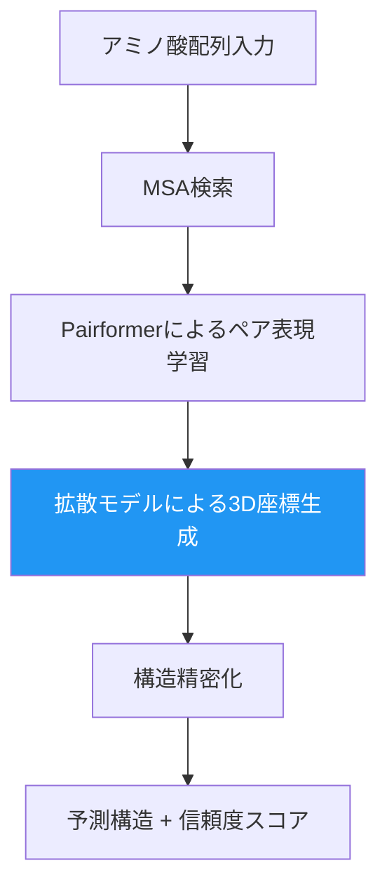

# 生成AIで創薬はどう変わるか：AlphaFold3からIsoDDEまで2026年最前線

## この記事でわかること

- 生成AIが創薬プロセスの各段階（標的同定・分子設計・臨床試験）をどう変えているか
- AlphaFold3の拡散モデルと後継IsoDDEの技術的な仕組みと精度向上の背景
- Insilico Medicine・Recursion・Isomorphic Labsなど主要プレイヤーの2025-2026年の進展
- RDKitとDeepChemを使った分子生成パイプラインの実装方法
- AI創薬が抱える「臨床試験の壁」「データ品質」「規制対応」の現実的な制約

## 対象読者

- **想定読者**: 中級者以上のML/AIエンジニアで創薬・ライフサイエンス分野に関心がある方
- **必要な前提知識**:
  - Python 3.10+の基本的な使い方
  - 深層学習（Transformer、拡散モデル）の基礎概念
  - SMILES表記やMolecular Graphの基本理解があると望ましい

## 結論・成果

AI創薬は2025年に「初のAI設計医薬品が第IIa相臨床試験を完了」という節目を迎えました。Insilico Medicine社のrentosertib（旧ISM001-055）は、標的同定から分子設計まで完全にAIが担当し、従来4年かかる初期発見フェーズを**18ヶ月に短縮**しています。2026年2月にはIsomorphic LabsがIsoDDEを発表し、AlphaFold3比で**タンパク質-リガンド構造予測精度を2倍以上に向上**させました。一方で、2025年12月時点で**FDA承認済みのAI創薬はゼロ**であり、臨床試験フェーズの短縮には至っていないという制約も明らかになっています。

## 創薬プロセスにおけるAIの適用領域を理解する

従来の創薬プロセスは、標的同定から上市まで平均**10〜15年**、開発コスト**20〜30億ドル**、成功率は約**10%**とされています。生成AIはこのプロセスの複数の段階に適用されています。

### 創薬プロセスとAI適用のマッピング


| 段階 | AIの適用 | 短縮効果 | 主要技術 |
|------|----------|----------|----------|
| 標的同定 | タンパク質構造予測、パスウェイ解析 | 30-50% | AlphaFold3, IsoDDE |
| ヒット化合物探索 | バーチャルスクリーニング、de novo分子生成 | 40-60% | 拡散モデル, GNN |
| リード最適化 | ADMET予測、結合親和性予測 | 20-40% | GNN, Transformer |
| 前臨床試験 | 毒性予測、薬物動態シミュレーション | 10-20% | ML回帰モデル |
| 臨床試験 | 患者選択、バイオマーカー探索 | 5-10% | 統計モデル |

**注意点:**
> AIによる時間短縮効果は主に初期発見フェーズ（標的同定〜リード最適化）に集中しています。Drug Target Review誌によると、AI創薬は初期発見を30-40%短縮するものの、臨床試験の期間・規制審査・製造スケールアップといった**真のボトルネック**は本質的に変わっていないと報告されています。

### なぜ生成AIが創薬で注目されるのか

従来の創薬では、化学者の経験と直感に基づいて候補分子を設計していました。しかし、薬になりうる化学空間は推定 $10^{60}$ 個の分子を含むとされ、人手による探索には限界があります。

生成AIは以下の点でこの制約を打破します。

- **化学空間の効率的探索**: VAE・拡散モデルで潜在空間を学習し、新規分子を生成
- **多目的最適化**: 結合親和性・溶解性・毒性などを同時に最適化
- **構造予測の統合**: AlphaFold3/IsoDDEでターゲットタンパク質の立体構造を予測し、それに合致する分子を設計

## 拡散モデルによる分子生成の技術的詳細を掘り下げる

2025-2026年の創薬AIで最も注目されている技術は、**拡散モデル（Diffusion Model）**と**フローマッチング（Flow Matching）**です。画像生成で実績のあるこれらの技術が、3D分子構造の生成に応用されています。

### 拡散モデルの分子生成への適用

分子生成における拡散モデルの基本的な考え方は、画像生成と類似しています。ノイズを段階的に除去して、化学的に妥当な3D分子構造を生成します。

数学的には、フォワードプロセス（ノイズ付加）は以下のように定式化されます。

$$q(\mathbf{x}_t | \mathbf{x}_{t-1}) = \mathcal{N}(\mathbf{x}_t; \sqrt{1-\beta_t}\mathbf{x}_{t-1}, \beta_t\mathbf{I})$$

ここで $\mathbf{x}_t$ は時刻 $t$ での原子座標、$\beta_t$ はノイズスケジュールです。分子生成では $\mathbf{x}$ が3D空間上の原子座標とその原子種を表します。

リバースプロセス（ノイズ除去=分子生成）では、ネットワーク $\epsilon_\theta$ がノイズを予測し、原子を化学的に妥当な配置へ導きます。

$$p_\theta(\mathbf{x}_{t-1} | \mathbf{x}_t) = \mathcal{N}(\mathbf{x}_{t-1}; \mu_\theta(\mathbf{x}_t, t), \sigma_t^2\mathbf{I})$$

**分子生成に特有の工夫**として、SE(3)-等変性（回転・並進に対する不変性）をネットワークに組み込む必要があります。分子は3D空間での向きに依存しないため、E(3)-equivariant GNNが広く使われています。

### フローマッチングの台頭

2025年以降、拡散モデルに代わり**フローマッチング**が主流になりつつあります。FlowDockやMegalodonといったモデルがこの手法を採用しています。

フローマッチングでは、ノイズ分布から目標分布への連続的なフロー $\phi_t$ を学習します。

$$\frac{d\mathbf{x}}{dt} = v_\theta(\mathbf{x}_t, t)$$

Megalodonの報告では、従来手法と比較して最大**49倍**多くの有効な分子を大規模生成できたとされています。

**なぜフローマッチングを選ぶのか:**
- 拡散モデルよりサンプリングステップが少なく高速
- 最適輸送に基づく理論的保証がある
- 分子の3D構造生成でより高品質なエネルギープロファイルを実現

**制約:**
> フローマッチングはまだ発展途上であり、2025年時点では合成可能性（Synthesizability）の保証が十分ではありません。生成された分子の多くが合成困難であるケースが報告されており、実用化には「生成→合成→評価」のループ全体を最適化する必要があります。

### RDKitとDeepChemによる分子生成パイプラインの実装例

以下は、RDKitとDeepChemを使った分子生成パイプラインの基本構成です。実際のプロジェクトで出発点となるコードを示します。

```python
# requirements: rdkit-pypi>=2024.03.1, deepchem>=2.8.0, torch>=2.0
from rdkit import Chem
from rdkit.Chem import AllChem, Descriptors, Draw
import deepchem as dc
import numpy as np


def smiles_to_fingerprint(smiles: str, radius: int = 2, n_bits: int = 2048) -> np.ndarray:
    """SMILES文字列からMorganフィンガープリントを生成する。

    Args:
        smiles: 分子のSMILES表記
        radius: Morganフィンガープリントの半径
        n_bits: ビットベクトルの長さ

    Returns:
        フィンガープリントのnumpy配列

    Raises:
        ValueError: 無効なSMILES文字列の場合
    """
    mol = Chem.MolFromSmiles(smiles)
    if mol is None:
        raise ValueError(f"Invalid SMILES: {smiles}")
    fp = AllChem.GetMorganFingerprintAsBitVect(mol, radius, nBits=n_bits)
    return np.array(fp)


def evaluate_drug_likeness(smiles: str) -> dict[str, float | bool]:
    """Lipinski's Rule of Fiveに基づく薬剤らしさを評価する。

    Args:
        smiles: 評価対象分子のSMILES表記

    Returns:
        各指標の値とRule of Five適合判定の辞書
    """
    mol = Chem.MolFromSmiles(smiles)
    if mol is None:
        raise ValueError(f"Invalid SMILES: {smiles}")

    mw = Descriptors.MolWt(mol)
    logp = Descriptors.MolLogP(mol)
    hbd = Descriptors.NumHDonors(mol)
    hba = Descriptors.NumHAcceptors(mol)

    passes_ro5 = (mw <= 500) and (logp <= 5) and (hbd <= 5) and (hba <= 10)

    return {
        "molecular_weight": mw,
        "logp": logp,
        "h_bond_donors": hbd,
        "h_bond_acceptors": hba,
        "passes_rule_of_five": passes_ro5,
    }


# 使用例: アスピリンの評価
aspirin_smiles = "CC(=O)Oc1ccccc1C(=O)O"
result = evaluate_drug_likeness(aspirin_smiles)
print(f"アスピリン薬剤らしさ評価: {result}")
# 出力例: {'molecular_weight': 180.16, 'logp': 1.31, 'h_bond_donors': 1,
#          'h_bond_acceptors': 4, 'passes_rule_of_five': True}
```

```python
# DeepChemによるバーチャルスクリーニングの最小例
import deepchem as dc
from deepchem.models import GraphConvModel


def build_virtual_screening_model(
    dataset_path: str,
    n_tasks: int = 1,
    batch_size: int = 128,
    n_epochs: int = 50,
) -> GraphConvModel:
    """Graph Convolutional Networkによるバーチャルスクリーニングモデルを構築する。

    Args:
        dataset_path: SMILESとラベルを含むCSVファイルパス
        n_tasks: 予測タスク数
        batch_size: バッチサイズ
        n_epochs: エポック数

    Returns:
        学習済みGraphConvModel
    """
    # 分子をグラフ表現に変換
    featurizer = dc.feat.MolGraphConvFeaturizer()
    loader = dc.data.CSVLoader(
        tasks=["activity"],
        feature_field="smiles",
        featurizer=featurizer,
    )
    dataset = loader.create_dataset(dataset_path)

    # データ分割（scaffold split: 化学構造の多様性を保つ分割法）
    splitter = dc.splits.ScaffoldSplitter()
    train_dataset, valid_dataset, test_dataset = splitter.train_valid_test_split(
        dataset
    )

    # Graph Convolutional Modelの構築と学習
    model = GraphConvModel(
        n_tasks=n_tasks,
        mode="classification",
        batch_size=batch_size,
    )
    model.fit(train_dataset, nb_epoch=n_epochs)

    # 評価
    metric = dc.metrics.Metric(dc.metrics.roc_auc_score)
    train_score = model.evaluate(train_dataset, [metric])
    valid_score = model.evaluate(valid_dataset, [metric])
    print(f"Train AUC: {train_score['roc_auc_score']:.3f}")
    print(f"Valid AUC: {valid_score['roc_auc_score']:.3f}")

    return model
```

**なぜGraphConvModelを選んだか:**
- SMILESの文字列ベースのモデルと比較して、分子のトポロジー情報を直接扱える
- DeepChem 2.8.0でScaffold Splitが標準サポートされており、化学的に意味のある評価が可能
- MoleculeNetベンチマークでの実績が豊富

## AlphaFold3からIsoDDEへの進化を追う

2024年のAlphaFold3発表から2026年2月のIsoDDE発表まで、構造予測AIは急速に進化しています。この進化が創薬にどのようなインパクトを与えるかを見ていきましょう。

### AlphaFold3の拡散モジュール

AlphaFold3は、前世代と比較して大きなアーキテクチャ変更を行いました。**Pairformer + 拡散モデル**という構成で、タンパク質だけでなくDNA、RNA、リガンド、イオン、修飾残基を含む複合体の構造を統一的に予測します。



拡散モジュールの導入により、AlphaFold3は「原子の雲（ランダム座標）」から出発し、段階的にノイズを除去して、学習済みの構造パターンに基づいた妥当な3D構造を生成します。

### IsoDDE: AlphaFold3を超える統合プラットフォーム

2026年2月にIsomorphic Labsが発表したIsoDDE（Isomorphic Labs Drug Design Engine）は、AlphaFold3の構造予測をさらに発展させた統合的な創薬設計エンジンです。

| 機能 | AlphaFold3 | IsoDDE | 改善率 |
|------|-----------|--------|--------|
| タンパク質-リガンド構造予測 | 基準 | 2倍以上の精度 | >100% |
| 抗体-抗原予測（DockQ > 0.8） | 基準 | 2.3倍 | 130% |
| 結合親和性予測 | 非対応 | 物理ベース手法を凌駕 | - |
| ポケット検出 | 非対応 | 配列のみから秒単位で検出 | - |

IsoDDEの技術的な進歩として注目すべき点は以下の通りです。

**構造予測の汎化能力**: Runs N' Posesベンチマークにおいて、訓練データとの類似度が0-20%の困難なケースでAlphaFold3の2倍以上の精度を達成しています。これはinduced fit（誘導適合）やcryptic pocket（隠れ結合部位）の開閉といった、従来予測困難だった構造変化をモデル化できることを意味します。

**結合親和性予測**: FEP+（Free Energy Perturbation）のような高精度だが計算コストの高い物理ベース手法を、コストと時間の面で凌駕しています。CASP16、FEP+4、OpenFEの3つの公開ベンチマークで全てのディープラーニング手法を上回りました。

**ポケット検出**: 既知のリガンドや構造テンプレートなしに、タンパク質の配列情報のみからリガンド結合可能な部位を同定できます。セレブロンでの検証では、既知の結合部位に加えて新規の隠れ結合部位も予測しています。

**ハマりポイント:**
> IsoDDEは2026年3月時点で一般公開されておらず、Isomorphic Labsの製薬パートナー企業との協業でのみ利用可能です。研究者がアクセスできるオープンソース代替としてはOpenFold3がありますが、IsoDDEと同等の精度は達成していません。

### OpenFold3: オープンソースの選択肢

AlphaFold3のオープンソース代替であるOpenFold3は、商用利用可能なコフォールディング機能を提供しています。タンパク質-リガンド複合体や抗体-抗原複合体の構造予測に対応しており、学術研究や中小企業の創薬プロジェクトで活用されています。

```python
# OpenFold3を使った構造予測の概念コード
# 注: 実際の実行にはGPU環境とモデルウェイトが必要
# openfold>=3.0, biopython>=1.82

from pathlib import Path


def predict_protein_ligand_complex(
    protein_fasta: str,
    ligand_smiles: str,
    output_dir: str = "./predictions",
) -> Path:
    """タンパク質-リガンド複合体の構造を予測する。

    Args:
        protein_fasta: タンパク質のFASTA配列
        ligand_smiles: リガンドのSMILES表記
        output_dir: 出力ディレクトリ

    Returns:
        予測構造のPDBファイルパス
    """
    # 1. 入力の準備
    output_path = Path(output_dir)
    output_path.mkdir(parents=True, exist_ok=True)

    # 2. MSA検索（ColabFold/MMseqs2）
    # openfold.data.msa_search(protein_fasta, db="uniref90")

    # 3. フォールディング実行
    # model = openfold.load_model("openfold3_weights")
    # prediction = model.predict(
    #     protein_sequence=protein_fasta,
    #     ligand_smiles=ligand_smiles,
    #     num_recycles=3,
    # )

    # 4. 結果の保存
    # pdb_path = output_path / "complex.pdb"
    # prediction.save_pdb(pdb_path)
    # return pdb_path

    # 概念コードのためダミー出力
    print(f"Predicting complex: protein length={len(protein_fasta)}")
    print(f"Ligand: {ligand_smiles}")
    dummy_path = output_path / "complex.pdb"
    dummy_path.touch()
    return dummy_path


# 使用例
fasta = "MKWVTFISLLFLFSSAYSRGVFRR..."  # タンパク質配列（省略）
ligand = "CC(=O)Oc1ccccc1C(=O)O"  # アスピリン
result_path = predict_protein_ligand_complex(fasta, ligand)
```

## AI創薬の主要プレイヤーと2025-2026年の動向を把握する

AI創薬のエコシステムは急速に変化しています。主要企業の動向と投資状況を整理します。

### 2025-2026年の主要な出来事

| 企業 | イベント | 時期 | 詳細 |
|------|---------|------|------|
| Insilico Medicine | rentosertib Phase IIa完了 | 2025年 | 初のAI設計医薬品がPhase IIa臨床試験完了。IPF治療薬 |
| Isomorphic Labs | IsoDDE発表、$600M調達 | 2026年2月 | AlphaFold3の2倍以上の精度。Thrive Capital主導 |
| Recursion | Exscientia買収完了 | 2024年11月 | $700M規模。表現型スクリーニング+精密化学の統合 |
| 第一三共 | AWS協業開始 | 2025年 | AIエージェント統合型創薬基盤、2026年運用目標 |
| 大鵬薬品 | SyntheticGestalt協業 | 2025年 | 100億件化合物学習済み基盤モデルSG4D10Bの検証 |

### 投資・市場動向

VCは2025年のQ1-Q3で合計**27億ドル**をAI創薬企業に投資しました。バイオテック全体の投資が減速する中でもAI創薬への資金流入は継続しています。

市場規模は以下のように推移しています。

- **2023年**: $1.8B
- **2025年**: $5-7B（推定）
- **2026年**: $8-10B（予測）
- **2030年**: $13.1B（予測、CAGR 18.8%）

**よくある間違い:**
最初はAI創薬の市場全体が順調に拡大していると考えがちですが、実際には**業界の統合（コンソリデーション）**が進んでいます。2025年には複数のAI創薬スタートアップが事業を停止し、20%以上の人員削減を行った企業もあります。AI創薬はPhase IIIの臨床結果が出揃う2026-2027年が本当の試金石となります。

### 日本企業の動向

日本の製薬大手もAI創薬への投資を加速させています。

**第一三共**: Amazon Web Servicesとの協業で「AIエージェント統合型創薬基盤」を構築中です。2026年の運用開始を目指しており、ターゲット探索から化合物最適化までの工程をAIエージェントが支援する仕組みを開発しています。

**大鵬薬品**: SyntheticGestalt社と協業し、100億件の化合物情報を学習した基盤AIモデル「SG4D10B」の活用に向けた技術検証を2025年6月に開始しました。システイノミクス（システイン残基の反応性に着目した創薬手法）への生成AI適用を目指しています。

**武田薬品**: 製造・供給部門でAI需要予測を本格運用し始め、MITとの協働によるAI活用や創薬パイプライン全体へのAI導入を推進しています。

## AI創薬の制約と課題を正しく認識する

生成AIの創薬への応用には大きな期待が寄せられていますが、冷静に制約を認識することが重要です。

### FDA承認の現実

2025年12月時点で、**AIのみで創出された医薬品がFDAの完全な承認を得た事例はゼロ**です。Insilico MedicineのrentosertibがPhase IIaを完了し最も進んでいますが、Phase IIIの結果が出るのは2026-2027年になる見込みです。

Drug Target Review誌は、Phase III結果が製薬業界の持続的な約90%の失敗率をAIが改善できるかどうかの最も重要な試金石になると指摘しています。

### データ品質の壁

MIT（マサチューセッツ工科大学）の2025年の調査によると、企業のAIパイロットプロジェクトの**95%近くが測定可能なビジネスインパクトを生み出せていない**と報告されています。主な原因は、システムが実際のワークフロー、データ基盤、組織的オーナーシップから切り離されていたことです。

技術幹部の**68%**がデータ品質とガバナンスをAI導入失敗の主要因として挙げています。創薬の文脈では、以下が特に問題となります。

- アッセイデータのアノテーション品質のばらつき
- 異なるソースのデータ統合の困難さ
- ネガティブデータ（不活性化合物）の系統的な欠如

### 規制環境の変化

| 規制 | 時期 | 影響 |
|------|------|------|
| FDAのAIガイダンス最終化 | 2026年（予定） | モデルアーキテクチャ・訓練データの文書化が義務化 |
| EU AI Act高リスク条項 | 2026年8月2日 | 創薬AIが「高リスク」に分類される可能性 |
| 日本AI安全性ガイドライン | 検討中 | PMDA（医薬品医療機器総合機構）による検討 |

**トレードオフ:**
規制整備はAI創薬の信頼性向上に不可欠ですが、コンプライアンス対応のコストが中小企業には重い負担となります。ロギング・リスク管理・トレーサビリティをアーキテクチャの初期段階から組み込む設計が求められています。

### 自律型実験室（Self-driving Lab）の限界

24時間稼働するロボティクス施設と連携した自律型実験室は急速に普及していますが、Drug Target Review誌によると「検証済みの薬剤候補を自律的に発見した実績はまだない」と報告されています。

現時点では、人間の研究者による戦略的判断—特に初期仮説が失敗した際の方向転換—が不可欠です。AI創薬は人間を置き換えるものではなく、人間の意思決定を加速・拡張するツールとして位置付けることが現実的です。

## よくある問題と解決方法

AI創薬プロジェクトを進める上でよく遭遇する問題と、その対処法をまとめます。

| 問題 | 原因 | 解決方法 |
|------|------|----------|
| 生成分子が合成不可能 | 合成可能性がモデルの最適化対象に含まれていない | SAスコア（Synthetic Accessibility Score）を目的関数に追加 |
| ADMET予測の精度が低い | 訓練データの偏り（活性化合物に偏重） | マルチタスク学習で複数エンドポイントを同時予測 |
| AlphaFold3予測構造でドッキングが失敗 | 予測構造の側鎖配向が不正確 | アンサンブルドッキングまたはMD（分子動力学）シミュレーション後にドッキング |
| 大規模スクリーニングの計算コスト | 数百万化合物のGPU計算が膨大 | 事前フィルタリング（Lipinski/PAINS除外）で候補を絞り込み |
| モデルの再現性が低い | ランダムシードや前処理の差異 | 実験管理ツール（MLflow/Weights & Biases）でハイパーパラメータを記録 |

## まとめと次のステップ

**まとめ:**

- 生成AIは創薬の初期発見フェーズ（標的同定〜リード最適化）を30-40%短縮するが、臨床試験の壁は残っている
- 拡散モデル・フローマッチングが分子生成の主流技術となり、AlphaFold3→IsoDDEで構造予測精度は2倍以上に向上
- 2025年にAI設計医薬品が初めてPhase IIaを完了したが、FDA承認済みの事例はまだない
- 市場は$5-7B（2025年）→$8-10B（2026年）と成長する一方、業界の統合も進行中
- データ品質・規制対応・合成可能性の保証が実用化の鍵

**次にやるべきこと:**

- RDKit + DeepChemで自社データを使った分子評価パイプラインを構築してみる
- OpenFold3を試して、対象タンパク質の構造予測を実施する
- FDAのAIガイダンス最終版と、EU AI Actの高リスク条項の動向を追跡する

## 参考

- [Isomorphic Labs Drug Design Engine (IsoDDE)](https://www.isomorphiclabs.com/articles/the-isomorphic-labs-drug-design-engine-unlocks-a-new-frontier)
- [AI in drug discovery: predictions for 2026 - Drug Target Review](https://www.drugtargetreview.com/article/192962/ai-in-drug-discovery-predictions-for-2026/)
- [AI in Biotech: Lessons from 2025 and the Trends Shaping Drug Discovery in 2026 - Ardigen](https://ardigen.com/ai-in-biotech-lessons-from-2025-and-the-trends-shaping-drug-discovery-in-2026/)
- [Recursion-Exscientia merger consolidates AI in drug discovery field](https://www.drugdiscoverytrends.com/recursion-and-exscientia-merge-in-688-m-deal-to-create-consolidated-ai-driven-drug-discovery-platform/)
- [2025's Top 5 Drug Discovery Highlights And How To Stay Ahead In 2026](https://www.drugdiscoveryonline.com/doc/2025s-top-drug-discovery-highlights-and-how-to-stay-ahead-in-2026-0001)
- [Google DeepMind and Isomorphic Labs introduce AlphaFold 3](https://blog.google/innovation-and-ai/products/google-deepmind-isomorphic-alphafold-3-ai-model/)
- [Diffusion Models in De Novo Drug Design - JCIM](https://pubs.acs.org/doi/10.1021/acs.jcim.4c01107)
- [DeepChem: Democratizing Deep-Learning for Drug Discovery](https://github.com/deepchem/deepchem)
- [大鵬薬品とSyntheticGestalt 生成AIを活用したシステイノミクス創薬の基盤拡充](https://www.taiho.co.jp/release/2025/20250604.html)
- [AI Drug Discovery Attracts Billions in Funding - US Tech Times](https://ustechtimes.com/openai-just-bet-130m-on-this-6-month-old-drug-company/)

---

:::message
この記事はAI（Claude Code）により自動生成されました。内容の正確性については複数の情報源で検証していますが、実際の利用時は公式ドキュメントもご確認ください。
:::
