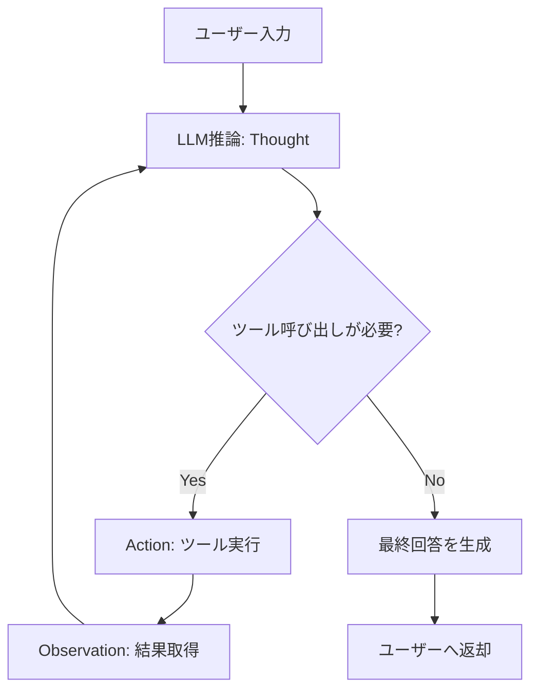
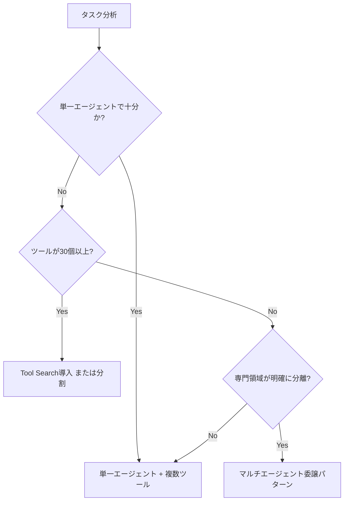

# Function Callingでマルチステップエージェントを構築する実践ガイド

## この記事でわかること

- Function Callingを使ったマルチステップAIエージェントの設計パターンと実装方法
- OpenAI・Claude・Gemini 3社のエージェントループの設計思想の違いと使い分け
- ReActパターンに基づくエージェントループのPython実装
- 並列ツール呼び出し・エラーハンドリング・コスト管理の本番向け実装テクニック

## 対象読者

- **想定読者**: LLMアプリケーション開発の初心者〜中級者で、エージェント構築に取り組みたい方
- **必要な前提知識**:
  - Python 3.11+の基礎文法（async/await、型ヒント）
  - REST APIの基本概念とJSON Schemaの理解
  - OpenAI API / Claude API / Gemini APIのいずれか1つの利用経験

:::message
Function Callingの基本的なAPI仕様や3社の比較については、関連記事「[Function Calling×Structured Outputs実装入門](https://zenn.dev/0h_n0/articles/b2d1df91e5f5de)」で詳しく解説しています。本記事ではエージェント構築の実践に焦点を当てます。
:::

## 結論・成果

Function Callingを活用したマルチステップエージェントを構築することで、**単一のAPIコール**では不可能なタスクの自動化が可能になります。Anthropicの技術ブログによると、Tool SearchとProgrammatic Tool Callingの組み合わせで、**トークン使用量を37%削減しつつ、複雑なタスクの完了精度を72%から90%に改善**できたと報告されています。

一方で、OpenAIの実践ガイドでは「まず単一エージェントの能力を最大化すべきで、マルチエージェント構成は必要になるまで避ける」ことが推奨されています。本記事ではこのバランスを踏まえた実践的な設計パターンを紹介します。

## エージェントループの基本設計を理解する

マルチステップエージェントの核心は**ループ構造**です。LLMがツールの呼び出しを判断し、結果を受け取り、次のアクションを決定するサイクルを繰り返します。

### 3社のエージェントループ比較

| 項目 | OpenAI Responses API | Claude Messages API | Gemini API |
|------|---------------------|---------------------|------------|
| ループ実行場所 | サーバーサイド（ビルトイン） | クライアントサイド | SDK内蔵（自動FC） |
| 終了判定 | 自動（ビルトインツール） | `stop_reason == "tool_use"` | `finish_reason` チェック |
| 並列ツール呼び出し | 対応 | 対応 | 対応 |
| MCP連携 | リモートMCPサーバー直接 | MCP Connector | SDK内蔵MCP対応 |
| スキーマ検証 | strict（デフォルト） | `strict: true` オプション | VALIDATEDモード |

OpenAIのResponses APIはビルトインツール（web_search、code_interpreterなど）をサーバーサイドで自動実行するループを持ちます。ClaudeのMessages APIでは`stop_reason`に基づいてクライアント側でループを構築します。GeminiはPython SDKで関数を直接渡すと自動的に実行ループが動作します。

> **注意**: OpenAI Responses APIのサーバーサイドループは**ビルトインツール限定**です。カスタム関数を使う場合は、Claude同様にクライアントサイドでループを構築する必要があります。

### ReActパターンの基本フロー

マルチステップエージェントの設計には、**ReActパターン**（Reasoning and Acting）が広く採用されています。2023年の論文「ReAct: Synergizing Reasoning and Acting in Language Models」で提案され、2026年現在もエージェント設計の主要パラダイムです。



1. **Thought（推論）**: LLMがユーザーの要求を分析し、次に必要なアクションを判断する
2. **Action（行動）**: 適切なツールを選択し、パラメータを生成して実行する
3. **Observation（観察）**: ツールの実行結果を受け取り、次のThoughtに活用する

**ハマりポイント**: ループの最大反復回数を設定しないと無限ループに陥る可能性があります。Anthropicの公式ドキュメントではサーバーサイドループのデフォルト上限が**10回**です。自前実装でも同様の上限を設けましょう。

## Pythonでエージェントループを実装する

ここからは実際にPythonでマルチステップエージェントを構築していきます。まずClaudeのMessages APIでの基本実装を示し、その後OpenAI・Geminiでの違いを見ていきます。

### Claudeでの基本エージェントループ

Claude Messages APIでのエージェントループは、`stop_reason`が`"tool_use"`である間、ツールを実行して結果を返すことを繰り返します。

```python
# agent_loop_claude.py
import anthropic
import json
from typing import Any

client = anthropic.Anthropic()

tools = [
    {
        "name": "search_products",
        "description": "商品名またはカテゴリで商品を検索する",
        "input_schema": {
            "type": "object",
            "properties": {
                "query": {"type": "string", "description": "検索キーワード"},
                "max_results": {"type": "integer", "description": "最大取得件数"},
            },
            "required": ["query"],
        },
    },
    {
        "name": "get_product_details",
        "description": "商品IDから詳細情報（価格、在庫、レビュー）を取得する",
        "input_schema": {
            "type": "object",
            "properties": {
                "product_id": {"type": "string", "description": "商品ID"}
            },
            "required": ["product_id"],
        },
    },
    {
        "name": "calculate_shipping",
        "description": "配送先と商品IDから送料を計算する",
        "input_schema": {
            "type": "object",
            "properties": {
                "product_id": {"type": "string"},
                "destination": {"type": "string", "description": "配送先の都道府県"},
            },
            "required": ["product_id", "destination"],
        },
    },
]


def execute_tool(name: str, input_data: dict[str, Any]) -> str:
    """ツール実行のディスパッチャー（実際にはDB検索やAPI呼び出し）"""
    if name == "search_products":
        return json.dumps({
            "results": [
                {"id": "PROD-001", "name": "ワイヤレスイヤホン Pro", "price": 15800},
                {"id": "PROD-002", "name": "ワイヤレスイヤホン Lite", "price": 8900},
            ]
        }, ensure_ascii=False)
    elif name == "get_product_details":
        return json.dumps({
            "id": input_data["product_id"], "name": "ワイヤレスイヤホン Pro",
            "price": 15800, "stock": 42, "rating": 4.5, "reviews_count": 328,
        }, ensure_ascii=False)
    elif name == "calculate_shipping":
        return json.dumps({"shipping_cost": 550, "estimated_days": 2})
    return json.dumps({"error": "Unknown tool"})


def run_agent(user_message: str, max_iterations: int = 10) -> str:
    """マルチステップエージェントループの実行"""
    messages = [{"role": "user", "content": user_message}]

    for i in range(max_iterations):
        response = client.messages.create(
            model="claude-sonnet-4-5-20250514",
            max_tokens=4096,
            tools=tools,
            messages=messages,
        )

        # ツール呼び出しが不要なら最終回答を返す
        if response.stop_reason != "tool_use":
            return "".join(
                block.text for block in response.content if block.type == "text"
            )

        # アシスタント応答をメッセージ履歴に追加
        messages.append({"role": "assistant", "content": response.content})

        # すべてのツール呼び出しを実行し結果を収集
        tool_results = []
        for block in response.content:
            if block.type == "tool_use":
                result = execute_tool(block.name, block.input)
                tool_results.append({
                    "type": "tool_result",
                    "tool_use_id": block.id,  # ← 必須: レスポンスのidと一致させる
                    "content": result,
                })

        messages.append({"role": "user", "content": tool_results})

    return "エージェントの最大反復回数に達しました。"
```

**このコードのポイント:**

- `max_iterations`で**無限ループ防止**を実装
- `stop_reason != "tool_use"`で**ループ終了を判定**
- 1回のレスポンスに複数の`tool_use`ブロックが含まれる**並列ツール呼び出し**に対応
- ツール結果は`tool_use_id`で対応するリクエストに紐づけ

**よくある間違い**: `tool_use_id`を省略するとAPIエラーになります。Claudeのレスポンスに含まれる`id`フィールドをそのまま指定してください。

### OpenAI Responses APIでの実装

OpenAIのResponses APIでは、インターフェースが異なりますがループ構造は同じです。

```python
# agent_loop_openai.py
from openai import OpenAI
import json

client = OpenAI()

tools = [{
    "type": "function",
    "name": "search_products",
    "description": "商品名またはカテゴリで商品を検索する",
    "parameters": {
        "type": "object",
        "properties": {
            "query": {"type": "string", "description": "検索キーワード"},
        },
        "required": ["query"],
    },
    "strict": True,
}]


def run_agent_openai(user_message: str, max_iterations: int = 10) -> str:
    """OpenAI Responses APIでのエージェントループ"""
    response = client.responses.create(
        model="gpt-4.1", input=user_message, tools=tools,
    )

    for i in range(max_iterations):
        function_calls = [
            item for item in response.output if item.type == "function_call"
        ]
        if not function_calls:
            return "".join(
                item.text for item in response.output if hasattr(item, "text")
            )

        tool_outputs = []
        for fc in function_calls:
            result = execute_tool(fc.name, json.loads(fc.arguments))
            tool_outputs.append({
                "type": "function_call_output",
                "call_id": fc.call_id,
                "output": result,
            })

        response = client.responses.create(
            model="gpt-4.1",
            input=response.output + tool_outputs,
            tools=tools,
        )

    return "エージェントの最大反復回数に達しました。"
```

**Claude APIとの主な違い:**

| 項目 | Claude Messages API | OpenAI Responses API |
|------|-------------------|---------------------|
| ツール定義キー | `input_schema` | `parameters` |
| ツール定義の型指定 | 不要 | `"type": "function"` が必要 |
| ツール呼び出し型 | `tool_use` ブロック | `function_call` アイテム |
| 引数フォーマット | dictオブジェクト | JSON文字列 |
| 結果の返し方 | `tool_result` | `function_call_output` |

### Gemini APIでの自動Function Calling

GeminiはPython SDKで**Automatic Function Calling**を提供しています。Python関数を直接渡すと、SDK内部でツールの実行と結果返送を自動処理します。

```python
# agent_loop_gemini.py
from google import genai
from google.genai import types


def search_products(query: str, max_results: int = 5) -> dict:
    """商品名またはカテゴリで商品を検索する

    Args:
        query: 検索キーワード
        max_results: 最大取得件数
    """
    return {
        "results": [
            {"id": "PROD-001", "name": "ワイヤレスイヤホン Pro", "price": 15800},
        ]
    }


client = genai.Client()
config = types.GenerateContentConfig(tools=[search_products])

# SDK内部でツール実行ループが自動で回る
response = client.models.generate_content(
    model="gemini-2.5-flash",
    contents="ワイヤレスイヤホンのおすすめを教えてください",
    config=config,
)
print(response.text)
```

**メリット**: docstringと型ヒントからツールスキーマを自動生成し、実行ループもSDK内部で処理されるため、コード量が少なくて済みます。

**制約**: 関数がローカルで同期実行されるため、非同期APIや重い処理には不向きです。`automatic_function_calling=False`で手動ループに切り替え可能です。

## 本番運用の実装パターンを適用する

基本のエージェントループを理解したら、**並列実行**、**エラーハンドリング**、**コスト管理**、**スケーリング**の仕組みを追加して本番品質に仕上げていきましょう。

### 並列ツール実行とエラーハンドリング

LLMが1回のレスポンスで複数の独立したツール呼び出しを返した場合、`asyncio.gather`で並列実行するとレイテンシを大幅に削減できます。例えば3つの独立なAPI呼び出し（各200ms）がある場合、逐次実行では600ms、並列実行では約200msに短縮できます。

```python
# parallel_with_error_handling.py
import asyncio
import json
from typing import Any


async def execute_tool_async(name: str, input_data: dict[str, Any]) -> str:
    """非同期ツール実行（リトライ付き）"""
    last_error = None
    for attempt in range(3):
        try:
            await asyncio.sleep(0.01)  # 実際はhttpxでAPI呼び出し
            return execute_tool(name, input_data)
        except (TimeoutError, ConnectionError) as e:
            last_error = str(e)
        except Exception as e:
            return json.dumps({"error": f"{type(e).__name__}: {e}"}, ensure_ascii=False)

    return json.dumps({"error": f"リトライ上限到達: {last_error}"}, ensure_ascii=False)


async def run_agent_production(user_message: str, max_iterations: int = 10) -> str:
    """並列実行+エラーハンドリング対応のエージェントループ"""
    messages = [{"role": "user", "content": user_message}]

    for i in range(max_iterations):
        response = client.messages.create(
            model="claude-sonnet-4-5-20250514",
            max_tokens=4096, tools=tools, messages=messages,
        )

        if response.stop_reason != "tool_use":
            return "".join(
                b.text for b in response.content if b.type == "text"
            )

        messages.append({"role": "assistant", "content": response.content})

        # 並列実行: すべてのツール呼び出しを同時に処理
        tool_blocks = [b for b in response.content if b.type == "tool_use"]
        results = await asyncio.gather(
            *[execute_tool_async(b.name, b.input) for b in tool_blocks],
            return_exceptions=True,
        )

        tool_results = []
        for block, result in zip(tool_blocks, results):
            if isinstance(result, Exception):
                tool_results.append({
                    "type": "tool_result", "tool_use_id": block.id,
                    "content": json.dumps({"error": str(result)}),
                    "is_error": True,
                })
            else:
                tool_results.append({
                    "type": "tool_result", "tool_use_id": block.id,
                    "content": result,
                })

        messages.append({"role": "user", "content": tool_results})

    return "最大反復回数に達しました。"
```

**なぜエラーをLLMに返すのか:** エージェントを停止するのではなく、エラー内容をLLMに返すことで、代替手段（別のクエリを試す、ユーザーに状況を説明する等）をLLMが判断できます。

> **制約条件**: エラーが連続するとコンテキストウィンドウを消費します。`max_iterations`による打ち切りと、コスト上限チェックを必ず設けてください。

### コスト管理のガードレール

マルチステップエージェントは各イテレーションで前回までの**会話履歴全体**を入力として送信します。10回のイテレーションでは入力トークンが累積的に増加するため、コスト管理が重要です。

```python
# cost_guard.py
from dataclasses import dataclass, field
from typing import Any
import time


@dataclass
class AgentState:
    """エージェント状態とコスト追跡"""
    messages: list[dict[str, Any]] = field(default_factory=list)
    total_input_tokens: int = 0
    total_output_tokens: int = 0

    @property
    def estimated_cost_usd(self) -> float:
        """Claude Sonnet 4.5の概算コスト（2026年2月時点）"""
        return (
            self.total_input_tokens * 3.0 / 1_000_000
            + self.total_output_tokens * 15.0 / 1_000_000
        )


def run_with_cost_guard(
    user_message: str, max_cost_usd: float = 0.50, max_iterations: int = 10
) -> str:
    """コスト上限付きエージェントループ"""
    state = AgentState()
    state.messages.append({"role": "user", "content": user_message})

    for i in range(max_iterations):
        if state.estimated_cost_usd > max_cost_usd:
            return f"コスト上限（${max_cost_usd}）到達で中断しました。"

        response = client.messages.create(
            model="claude-sonnet-4-5-20250514",
            max_tokens=4096, tools=tools, messages=state.messages,
        )
        state.total_input_tokens += response.usage.input_tokens
        state.total_output_tokens += response.usage.output_tokens

        if response.stop_reason != "tool_use":
            return "".join(
                b.text for b in response.content if b.type == "text"
            )

        state.messages.append({"role": "assistant", "content": response.content})
        # ... ツール実行（前述のパターンと同じ）
```

### ツール数のスケーリング

エージェントの機能が増えると、ツール定義のコンテキスト消費が問題になります。Geminiの公式ドキュメントではツール数を**10-20個**に保つことを推奨しています。

**ツール数が増えた場合の対策:**

Anthropicが提供する**Tool Search Tool**は、50以上のツールを動的に発見する仕組みです。全ツールをロードすると約72,000トークンを消費しますが、Tool Searchでは約500トークンで済み、**95%のコンテキスト節約**が実現できたと報告されています。

```python
# tool_search_example.py
response = client.messages.create(
    model="claude-sonnet-4-5-20250514",
    max_tokens=4096,
    tools=[
        {"type": "tool_search", "name": "tool_search",
         "description": "利用可能なツールを検索して発見する"},
        # 頻繁に使う3-5個のツールは常時ロード
        {"name": "search_products", "description": "商品を検索する",
         "input_schema": {"type": "object",
                          "properties": {"query": {"type": "string"}},
                          "required": ["query"]}},
    ],
    messages=[{"role": "user", "content": "在庫を確認して発注してください"}],
)
```

**MCP（Model Context Protocol）** は、ツール定義をプロバイダー非依存に標準化するプロトコルです。2026年2月時点でOpenAI・Claude・Geminiの3社すべてがサポートしています。複数プロバイダー間でツールを共有したい場合に有効ですが、MCPサーバーの運用コストとレイテンシ（通常数十ms）が追加されるため、小規模プロジェクトでは直接ツール定義を書く方が高速です。

### 単一エージェント vs マルチエージェントの判断基準

OpenAIの実践ガイドでは、**まず単一エージェントの能力を最大化する**ことが推奨されています。



**トレードオフ**: マルチエージェント構成はエージェント間の通信オーバーヘッドとコンテキスト共有の複雑さを伴います。ツール数が10-20個の範囲なら、単一エージェントで十分に対応可能です。

## よくある問題と解決方法

| 問題 | 原因 | 解決方法 |
|------|------|----------|
| 無限ループに陥る | ツール結果の解釈を繰り返す | `max_iterations`を設定（推奨: 10） |
| ツールの選択ミス | description が不十分 | 使用場面を具体的に記述する |
| 不要なツール呼び出し | LLMが情報不足と判断 | `tool_choice: "auto"` で判断を委ねる |
| コンテキスト超過 | 会話履歴の累積 | 古いツール結果を要約して圧縮する |
| 型バリデーションエラー | JSON Schema不一致 | `strict: true`を有効化 |
| レスポンス遅延 | 逐次ツール実行 | `asyncio.gather` で並列実行 |
| 高額なAPI料金 | イテレーション数増加 | `max_cost_usd` でコストキャップ |

## まとめと次のステップ

**まとめ:**

- エージェントループは **`stop_reason`（Claude）/ function_call出力（OpenAI）/ finish_reason（Gemini）** によるループ制御が核心
- 3社のAPIはインターフェースが異なるが、**ReActパターン（Thought → Action → Observation）** という共通の設計思想に基づいている
- 本番運用では **並列ツール実行**、**エラーのLLMへの委譲**、**コスト上限設定** が重要
- ツール数が10-20個を超える場合は **Tool Search** や **MCP** によるスケーリングを検討

**次にやるべきこと:**

- 上記コード例をベースに、自分のユースケースに合わせたツール定義を作成する
- `strict: true`（Claude）や`strict`モード（OpenAI）を有効にして型安全性を確保する
- LangGraphやClaude Agent SDKで、より複雑なワークフロー（条件分岐、人間の承認ステップ）を実装する

## 参考

- [Tool use with Claude - Anthropic公式ドキュメント](https://platform.claude.com/docs/en/agents-and-tools/tool-use/overview)
- [Function calling - OpenAI公式ドキュメント](https://platform.openai.com/docs/guides/function-calling)
- [Function calling with the Gemini API - Google AI for Developers](https://ai.google.dev/gemini-api/docs/function-calling)
- [Introducing advanced tool use - Anthropic Engineering Blog](https://www.anthropic.com/engineering/advanced-tool-use)
- [A practical guide to building agents - OpenAI](https://openai.com/business/guides-and-resources/a-practical-guide-to-building-ai-agents/)
- [Building agents with the Claude Agent SDK - Anthropic](https://www.anthropic.com/engineering/building-agents-with-the-claude-agent-sdk)
- [ReAct Prompting - Prompt Engineering Guide](https://www.promptingguide.ai/techniques/react)

---

:::message
この記事はAI（Claude Code）により自動生成されました。内容の正確性については複数の情報源で検証していますが、実際の利用時は公式ドキュメントもご確認ください。
:::
