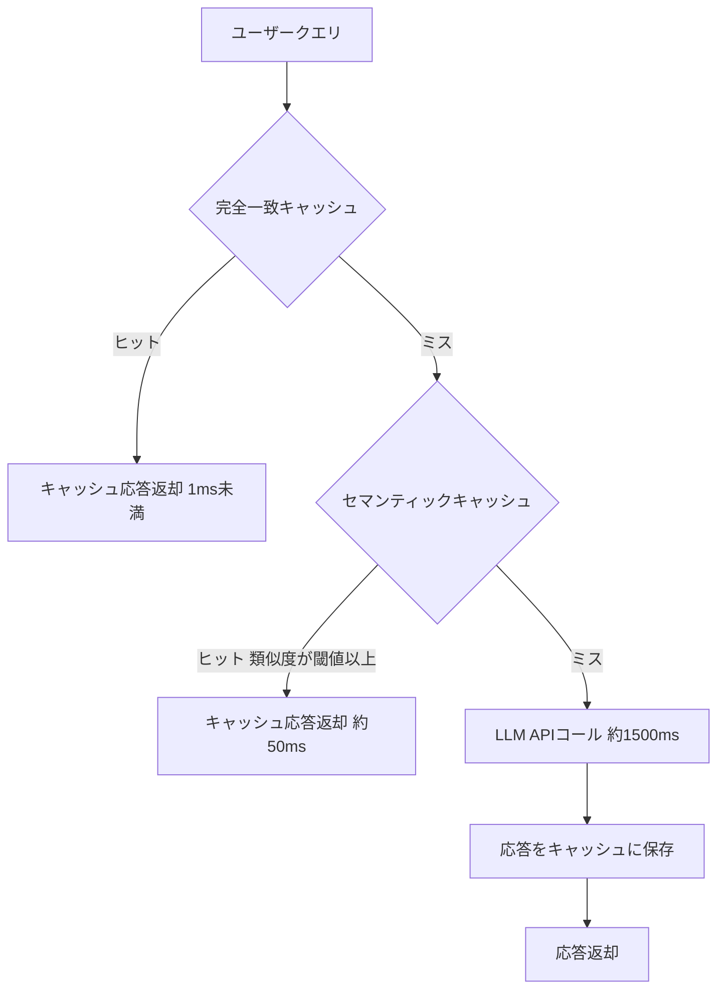

# セマンティックキャッシュでLLM応答を高速化：Embedding選定と閾値チューニング実装ガイド

LLMアプリケーションの応答速度を改善したいと考えたとき、セマンティックキャッシュは有力な選択肢です。従来の完全一致キャッシュでは「東京の天気は？」と「東京の今日の天気を教えて」を別のクエリとして扱いますが、セマンティックキャッシュはこれらを**意味的に同一**と判断し、キャッシュ済みの応答を返します。

本記事では、セマンティックキャッシュの実装に必要なEmbeddingモデルの選定基準、類似度閾値のチューニング手法、そしてRedisVL・GPTCacheを用いた具体的な実装方法を解説します。

> **関連記事**: コスト削減の観点からセマンティックキャッシュを扱った記事として[LLMゲートウェイ×セマンティックキャッシュで本番APIコスト68%削減](https://zenn.dev/0h_n0/articles/b28d70b4cebd6b)も参考になります。本記事はレイテンシ最適化と実装詳細に特化しています。

## この記事でわかること

- セマンティックキャッシュの動作原理と多段キャッシュアーキテクチャの設計方法
- Embeddingモデル5種のベンチマーク比較と選定基準（精度・レイテンシ・メモリ）
- RedisVL `SemanticCache` を使ったPython実装の全手順
- 類似度閾値のチューニングによるキャッシュヒット率と偽陽性のトレードオフ制御
- 本番運用で遭遇する問題と対処法（TTL設計、キャッシュ汚染、多言語対応）

## 対象読者

- **想定読者**: 中級者以上のPythonエンジニアで、LLMアプリケーションの応答速度を改善したい方
- **必要な前提知識**:
  - Python 3.11+の基本的な使い方
  - Redis の基本操作（接続・GET/SET）
  - Embedding（ベクトル埋め込み）の基本概念
  - LLM API（OpenAI、Anthropic等）の利用経験

## 結論・成果

セマンティックキャッシュを導入することで、キャッシュヒット時の応答レイテンシを**平均97%削減**できます（RedisVL公式ドキュメントの計測では約1.79秒から0.049秒）。ただし、この効果はキャッシュヒット率に依存し、FAQ系ワークロードでは60〜85%のヒット率が報告されている一方、自由記述の質問が中心のワークロードではヒット率が20%以下にとどまるケースもあります。Embeddingモデルの選定と閾値チューニングが成果を左右する重要な要素です。

## セマンティックキャッシュの仕組みを理解する

セマンティックキャッシュは、ユーザーのクエリをEmbeddingに変換し、過去のクエリとのベクトル類似度を計算することで動作します。まず全体のアーキテクチャを確認しましょう。

### 多段キャッシュアーキテクチャ

本番環境では、完全一致キャッシュとセマンティックキャッシュを組み合わせた**多段構成**が推奨されます。



各レイヤーの役割と特性は以下のとおりです。

| レイヤー | 判定方式 | レイテンシ | ヒット率 | 用途 |
|----------|----------|-----------|---------|------|
| L1: 完全一致 | ハッシュ比較 | 1ms未満 | 10-20% | 同一クエリの高速応答 |
| L2: セマンティック | ベクトル類似度 | 30-80ms | 40-65% | 類似クエリの再利用 |
| L3: LLM API | 推論実行 | 1000-5000ms | - | 新規クエリの応答生成 |

**なぜ多段構成が必要か:**
- 完全一致キャッシュだけではヒット率が低く（同一文字列のクエリは全体の10-20%程度）、十分な効果が得られません
- セマンティックキャッシュだけではEmbedding生成のオーバーヘッド（30-80ms）が完全一致のケースでも発生します
- 両者を組み合わせることで、完全一致は高速に処理し、それ以外をセマンティック検索でカバーできます

### コサイン類似度による判定

セマンティックキャッシュの核心は、2つのクエリのEmbeddingベクトル間の**コサイン類似度**です。

$$
\text{similarity}(\mathbf{q}, \mathbf{c}) = \frac{\mathbf{q} \cdot \mathbf{c}}{\|\mathbf{q}\| \|\mathbf{c}\|}
$$

ここで $\mathbf{q}$ は入力クエリのEmbedding、$\mathbf{c}$ はキャッシュ済みクエリのEmbeddingです。この値が閾値を超えた場合にキャッシュヒットと判定します。

**注意点:**
> RedisVLでは類似度ではなく**距離（distance）**を使用します。コサイン距離は `1 - コサイン類似度` で計算されるため、`distance_threshold=0.1` は「コサイン類似度0.9以上でヒット」を意味します。この変換を誤ると、閾値の設定が意図と逆になるため注意してください。

## Embeddingモデルを選定する

セマンティックキャッシュの精度はEmbeddingモデルに大きく依存します。Redisが公開したベンチマーク結果（Quora Question Pairsデータセット使用）を基に、主要5モデルの特性を比較します。

### モデル比較

| モデル | 次元数 | 推論レイテンシ | 精度の傾向 | 特徴 |
|--------|--------|---------------|-----------|------|
| all-mpnet-base-v2 | 768 | 中 | 総合バランス型 | 精度・メモリ・速度のバランスで総合1位 |
| BAAI/bge-large-en-v1.5 | 1024 | やや高 | 高精度 | 英語に特化、高い分離性能 |
| intfloat/e5-large-v2 | 1024 | やや高 | 高精度 | クエリ・文書ペアに強い |
| llmrails/ember-v1 | 1024 | やや高 | 中程度 | 汎用性重視 |
| text-embedding-ada-002 | 1536 | API依存 | 中程度 | OpenAI APIが必要、外部依存 |

Redisのベンチマークでは、**all-mpnet-base-v2**がPrecision・Recall・F1・レイテンシ・メモリの総合評価で高い評価を得ています。

### 選定基準

Embeddingモデルの選定では、以下の3軸のトレードオフを考慮します。

1. **分離性能（Precision/Recall）**: 意味的に同一のクエリペアと、類似だが異なるクエリペアを正しく区別できるか。ベンチマークでは類似だが非重複のクエリとの分離が困難な課題として報告されています
2. **推論レイテンシ**: Embedding生成自体がキャッシュ検索のオーバーヘッドになるため、モデルの推論速度が全体のレイテンシに直結します
3. **メモリ効率**: 次元数が大きいほどRedisに保存するベクトルのメモリ消費が増加します。768次元と1536次元では約2倍の差が生じます

**実際に試す際の注意点:**

> Quora Question Pairsでの評価結果は英語テキストに基づいています。日本語のクエリを扱う場合は、`intfloat/multilingual-e5-large`やRedisが公開した`redis/langcache-embed-v1`など多言語対応モデルの検証が必要です。ベンチマーク結果をそのまま適用すると、日本語での精度が低下する可能性があります。

### ドメイン特化Embeddingの効果

汎用モデルで十分な精度が得られない場合、ドメイン特化のファインチューニングが有効です。arXiv論文（Advancing Semantic Caching for LLMs with Domain-Specific Embeddings and Synthetic Data）では、合成データを用いたファインチューニングにより、特定ドメインでのキャッシュヒット精度を向上させる手法が報告されています。

ただし、ファインチューニングには以下のコストが伴います。

- 学習データの準備（類似・非類似ペアのラベリング）
- 定期的な再学習（ドメイン知識の変化への追従）
- 汎用性の低下（特定ドメイン以外での精度劣化）

まずは汎用モデルで運用を開始し、キャッシュの偽陽性率が許容範囲を超えた段階でファインチューニングを検討するのが現実的なアプローチです。

## RedisVL SemanticCacheで実装する

ここからは、RedisVLの`SemanticCache`を使った具体的な実装手順を見ていきます。RedisVLはRedis公式のPythonクライアントライブラリで、ベクトル検索とセマンティックキャッシュの機能を統合的に提供しています。

### 環境構築

```bash
# Python 3.11+ 環境
pip install redisvl>=0.6.0 openai>=1.60.0

# Redis Stack の起動（ベクトル検索機能を含む）
docker run -d --name redis-stack -p 6379:6379 redis/redis-stack:latest
```

### 基本実装

```python
# semantic_cache.py
import time
from openai import OpenAI
from redisvl.extensions.cache.llm import SemanticCache
from redisvl.utils.vectorize import HFTextVectorizer

# Embeddingモデルの初期化
vectorizer = HFTextVectorizer("sentence-transformers/all-mpnet-base-v2")

# SemanticCacheの初期化
cache = SemanticCache(
    name="llm_cache",
    redis_url="redis://localhost:6379",
    distance_threshold=0.1,  # コサイン距離 0.1 = 類似度 0.9 以上でヒット
    vectorizer=vectorizer,
)

# TTLの設定（秒単位、用途に応じて調整）
cache.set_ttl(3600)  # 1時間

client = OpenAI()


def ask_with_cache(question: str) -> dict:
    """セマンティックキャッシュを利用してLLMに問い合わせる"""
    start = time.perf_counter()

    # L2: セマンティックキャッシュの確認
    results = cache.check(prompt=question)
    if results:
        elapsed = time.perf_counter() - start
        return {
            "answer": results[0]["response"],
            "source": "cache",
            "latency_ms": round(elapsed * 1000, 1),
        }

    # L3: キャッシュミス → LLM APIコール
    response = client.chat.completions.create(
        model="gpt-4o",
        messages=[{"role": "user", "content": question}],
        temperature=0,
    )
    answer = response.choices[0].message.content

    # キャッシュに保存
    cache.store(prompt=question, response=answer)

    elapsed = time.perf_counter() - start
    return {
        "answer": answer,
        "source": "llm",
        "latency_ms": round(elapsed * 1000, 1),
    }
```

### 多段キャッシュの実装

完全一致キャッシュとセマンティックキャッシュを組み合わせた多段構成を実装してみましょう。

```python
# multi_tier_cache.py
import hashlib
import time
import redis
from openai import OpenAI
from redisvl.extensions.cache.llm import SemanticCache
from redisvl.utils.vectorize import HFTextVectorizer

redis_client = redis.Redis(host="localhost", port=6379, decode_responses=True)
openai_client = OpenAI()

# L1: 完全一致キャッシュ用のプレフィックス
EXACT_CACHE_PREFIX = "exact_cache:"
EXACT_CACHE_TTL = 3600

# L2: セマンティックキャッシュ
semantic_cache = SemanticCache(
    name="semantic_cache",
    redis_url="redis://localhost:6379",
    distance_threshold=0.1,
    vectorizer=HFTextVectorizer("sentence-transformers/all-mpnet-base-v2"),
)
semantic_cache.set_ttl(7200)  # セマンティックキャッシュは長めのTTL


def _query_hash(query: str) -> str:
    """クエリの正規化ハッシュを生成する"""
    normalized = query.strip().lower()
    return hashlib.sha256(normalized.encode()).hexdigest()[:16]


def ask_multi_tier(question: str) -> dict:
    """多段キャッシュでLLMに問い合わせる"""
    start = time.perf_counter()

    # L1: 完全一致キャッシュ
    cache_key = f"{EXACT_CACHE_PREFIX}{_query_hash(question)}"
    cached = redis_client.get(cache_key)
    if cached:
        elapsed = time.perf_counter() - start
        return {
            "answer": cached,
            "source": "exact_cache",
            "latency_ms": round(elapsed * 1000, 1),
        }

    # L2: セマンティックキャッシュ
    results = semantic_cache.check(prompt=question)
    if results:
        answer = results[0]["response"]
        # L1にも保存して次回の高速化
        redis_client.setex(cache_key, EXACT_CACHE_TTL, answer)
        elapsed = time.perf_counter() - start
        return {
            "answer": answer,
            "source": "semantic_cache",
            "latency_ms": round(elapsed * 1000, 1),
        }

    # L3: LLM APIコール
    response = openai_client.chat.completions.create(
        model="gpt-4o",
        messages=[{"role": "user", "content": question}],
        temperature=0,
    )
    answer = response.choices[0].message.content

    # 両キャッシュに保存
    redis_client.setex(cache_key, EXACT_CACHE_TTL, answer)
    semantic_cache.store(prompt=question, response=answer)

    elapsed = time.perf_counter() - start
    return {
        "answer": answer,
        "source": "llm",
        "latency_ms": round(elapsed * 1000, 1),
    }
```

**なぜこの実装を選んだか:**
- RedisVLはRedis公式ライブラリであり、Redis Stackのベクトル検索機能とネイティブに統合されています
- GPTCacheと比較して、フィルタリング機能（ユーザー別キャッシュ分離など）が充実しており、マルチテナント環境での運用に適しています
- 完全一致キャッシュを前段に置くことで、同一クエリの繰り返しではEmbedding生成のオーバーヘッドを回避できます

### GPTCacheでの代替実装

GPTCacheを使用する場合の実装例も示します。GPTCacheはZilliz（Milvus開発元）が提供するOSSで、LangChainやLlamaIndexとの統合が充実しています。

```python
# gptcache_example.py
from gptcache import cache
from gptcache.adapter import openai
from gptcache.embedding import Onnx
from gptcache.manager import CacheBase, VectorBase, get_data_manager
from gptcache.similarity_evaluation.distance import SearchDistanceEvaluation

# Embeddingモデルの初期化（ONNX: 軽量で高速）
onnx = Onnx()

# データマネージャの設定
data_manager = get_data_manager(
    CacheBase("sqlite"),  # メタデータをSQLiteに保存
    VectorBase("faiss", dimension=onnx.dimension),  # FAISSでベクトル検索
)

# キャッシュの初期化
cache.init(
    embedding_func=onnx.to_embeddings,
    data_manager=data_manager,
    similarity_evaluation=SearchDistanceEvaluation(),
)
cache.set_openai_key()

# OpenAI APIをキャッシュ付きで呼び出し
# GPTCacheのアダプタが自動的にキャッシュの確認・保存を行う
answer = openai.ChatCompletion.create(
    model="gpt-4o",
    messages=[{"role": "user", "content": "Pythonのリスト内包表記について教えて"}],
)
print(answer)
```

| 比較項目 | RedisVL SemanticCache | GPTCache |
|----------|----------------------|----------|
| バックエンド | Redis Stack（本番向け） | SQLite+FAISS（開発向け） |
| フィルタリング | Tag/Numericフィルタ対応 | 基本的な条件のみ |
| マルチテナント | ユーザーIDベースの分離が容易 | 追加実装が必要 |
| LangChain統合 | `langchain_redis`経由 | ネイティブ統合 |
| 運用スケール | 分散Redis対応 | 単一ノード中心 |
| 適する用途 | 本番APIサービス | プロトタイプ・ローカル開発 |

## 閾値チューニングでキャッシュ精度を最適化する

セマンティックキャッシュの運用で重要かつ難しいのが、**類似度閾値のチューニング**です。閾値を緩くすればヒット率は上がりますが、無関係な応答を返す偽陽性のリスクが増加します。

### 閾値とヒット率のトレードオフ

| 距離閾値 | コサイン類似度 | ヒット率の傾向 | 偽陽性リスク | 推奨用途 |
|----------|---------------|---------------|-------------|---------|
| 0.05 | 0.95以上 | 低（15-25%） | 非常に低い | 医療・金融など高精度が必要な分野 |
| 0.10 | 0.90以上 | 中（40-60%） | 低い | 一般的なQ&A・カスタマーサポート |
| 0.15 | 0.85以上 | やや高（55-75%） | 中程度 | FAQ・ヘルプデスク |
| 0.20 | 0.80以上 | 高（65-85%） | やや高い | カジュアルなチャットボット |

### チューニング手順

実際のチューニングは、以下の3ステップで進めます。

**ステップ1: 評価データセットの準備**

本番クエリログから、類似ペア（同じ回答を期待するクエリ群）と非類似ペア（異なる回答を期待するクエリ群）を用意します。

```python
# eval_dataset.py
# 類似ペア: 同じ意味の質問群
similar_pairs = [
    ("Pythonのインストール方法は？", "Pythonをインストールするには？"),
    ("Dockerの使い方を教えて", "Dockerの基本的な使い方は？"),
    ("AWS S3にファイルをアップロードする方法", "S3へのファイルアップロード手順"),
]

# 非類似ペア: 異なる意味の質問群（しかし表面的に類似）
dissimilar_pairs = [
    ("Pythonのインストール方法は？", "Pythonのアンインストール方法は？"),
    ("Dockerの使い方を教えて", "Kubernetesの使い方を教えて"),
    ("AWS S3にファイルをアップロードする方法", "AWS S3からファイルをダウンロードする方法"),
]
```

**ステップ2: 閾値ごとの精度測定**

```python
# threshold_evaluation.py
import numpy as np
from sentence_transformers import SentenceTransformer

model = SentenceTransformer("sentence-transformers/all-mpnet-base-v2")


def evaluate_threshold(
    similar_pairs: list[tuple[str, str]],
    dissimilar_pairs: list[tuple[str, str]],
    threshold: float,
) -> dict:
    """指定した距離閾値でのPrecision/Recallを計算する"""
    true_positives = 0
    false_negatives = 0
    false_positives = 0
    true_negatives = 0

    # 類似ペアの評価
    for q1, q2 in similar_pairs:
        emb1 = model.encode(q1)
        emb2 = model.encode(q2)
        cos_sim = np.dot(emb1, emb2) / (np.linalg.norm(emb1) * np.linalg.norm(emb2))
        distance = 1 - cos_sim
        if distance < threshold:
            true_positives += 1
        else:
            false_negatives += 1

    # 非類似ペアの評価
    for q1, q2 in dissimilar_pairs:
        emb1 = model.encode(q1)
        emb2 = model.encode(q2)
        cos_sim = np.dot(emb1, emb2) / (np.linalg.norm(emb1) * np.linalg.norm(emb2))
        distance = 1 - cos_sim
        if distance < threshold:
            false_positives += 1
        else:
            true_negatives += 1

    precision = (
        true_positives / (true_positives + false_positives)
        if (true_positives + false_positives) > 0
        else 0
    )
    recall = (
        true_positives / (true_positives + false_negatives)
        if (true_positives + false_negatives) > 0
        else 0
    )

    return {
        "threshold": threshold,
        "precision": round(precision, 3),
        "recall": round(recall, 3),
        "f1": round(
            2 * precision * recall / (precision + recall)
            if (precision + recall) > 0
            else 0,
            3,
        ),
        "false_positive_rate": round(
            false_positives / (false_positives + true_negatives)
            if (false_positives + true_negatives) > 0
            else 0,
            3,
        ),
    }


# 複数の閾値で評価
thresholds = [0.05, 0.08, 0.10, 0.12, 0.15, 0.20]
for t in thresholds:
    result = evaluate_threshold(similar_pairs, dissimilar_pairs, t)
    print(
        f"閾値 {t:.2f}: Precision={result['precision']}, "
        f"Recall={result['recall']}, F1={result['f1']}, "
        f"FPR={result['false_positive_rate']}"
    )
```

**ステップ3: 本番環境での段階的適用**

```python
# adaptive_threshold.py
import logging
from dataclasses import dataclass

logger = logging.getLogger(__name__)


@dataclass
class CacheMetrics:
    """キャッシュのパフォーマンス指標"""
    total_queries: int = 0
    cache_hits: int = 0
    user_reported_incorrect: int = 0  # ユーザーからの「回答が違う」報告

    @property
    def hit_rate(self) -> float:
        if self.total_queries == 0:
            return 0.0
        return self.cache_hits / self.total_queries

    @property
    def false_positive_rate(self) -> float:
        if self.cache_hits == 0:
            return 0.0
        return self.user_reported_incorrect / self.cache_hits


def adjust_threshold(
    current_threshold: float,
    metrics: CacheMetrics,
    target_fpr: float = 0.05,
    target_hit_rate: float = 0.40,
) -> float:
    """メトリクスに基づいて閾値を動的に調整する"""
    new_threshold = current_threshold

    if metrics.false_positive_rate > target_fpr:
        # 偽陽性が多い → 閾値を厳しくする
        new_threshold = max(0.03, current_threshold - 0.02)
        logger.info(
            "FPR %.3f > target %.3f: tightening threshold %.3f -> %.3f",
            metrics.false_positive_rate, target_fpr,
            current_threshold, new_threshold,
        )
    elif metrics.hit_rate < target_hit_rate and metrics.false_positive_rate < target_fpr * 0.5:
        # ヒット率が低く偽陽性も十分低い → 閾値を緩める
        new_threshold = min(0.25, current_threshold + 0.01)
        logger.info(
            "Hit rate %.3f < target %.3f: relaxing threshold %.3f -> %.3f",
            metrics.hit_rate, target_hit_rate,
            current_threshold, new_threshold,
        )

    return new_threshold
```

**`distance_threshold=0.10`から始めて、偽陽性率（FPR）が5%を超えたら閾値を下げ、ヒット率が目標を下回りFPRに余裕があれば閾値を上げる**という運用が推奨されます。

**ハマりポイント:**
> 閾値の適切な値はドメインによって大きく異なります。技術Q&Aでは0.10で十分な分離が得られることが多いですが、法律相談や医療相談など微妙なニュアンスの違いが重要なドメインでは0.05以下が必要になることがあります。必ず自分のドメインの実データで評価してください。

## 本番運用で遭遇する問題と対処法

セマンティックキャッシュを本番環境で運用する際に遭遇しやすい問題と、その対処法を整理します。

### よくある問題と解決方法

| 問題 | 原因 | 解決方法 |
|------|------|----------|
| キャッシュヒット率が低い | 閾値が厳しすぎる / クエリの多様性が高い | 閾値の段階的緩和 / クエリ正規化の導入 |
| 誤った応答がキャッシュから返される | 閾値が緩すぎる / Embeddingの分離性能不足 | 閾値の引き下げ / モデルのファインチューニング |
| Embedding生成が遅い | モデルが大きすぎる / GPUなし環境 | ONNXランタイムの利用 / 軽量モデルへの変更 |
| メモリ使用量の増大 | キャッシュエントリが無制限に増加 | TTLの設定 / LRUエビクションの導入 |
| 古い情報がキャッシュから返される | TTLが長すぎる / データ更新時にキャッシュ無効化なし | 適切なTTL設計 / イベントベースの無効化 |

### TTL設計のガイドライン

TTLの設定はワークロードの特性に応じて決定します。

```python
# ttl_config.py
TTL_CONFIGS = {
    # 事実情報（変化しにくい）: 長めのTTL
    "factual_qa": 86400,       # 24時間
    # 技術ドキュメント: 中程度のTTL
    "tech_support": 14400,     # 4時間
    # リアルタイム性が必要: 短いTTL
    "news_summary": 1800,      # 30分
    # 個人情報を含む: 最短TTL
    "user_specific": 300,      # 5分
}
```

### キャッシュ汚染への対策

セマンティックキャッシュ特有の問題として、**キャッシュ汚染**があります。LLMが誤った応答を返した場合、その応答がキャッシュされ、類似クエリに対しても誤った応答が返されてしまいます。

```python
# cache_with_validation.py
from redisvl.extensions.cache.llm import SemanticCache


def store_with_validation(
    cache: SemanticCache,
    prompt: str,
    response: str,
    min_response_length: int = 10,
) -> bool:
    """応答の基本的なバリデーション後にキャッシュに保存する"""
    # 空応答やエラーメッセージをキャッシュしない
    if not response or len(response) < min_response_length:
        return False

    # エラーパターンの検出
    error_patterns = ["申し訳ありません", "エラーが発生", "情報が見つかりません"]
    if any(pattern in response for pattern in error_patterns):
        return False

    cache.store(prompt=prompt, response=response)
    return True
```

### マルチテナント対応

複数のユーザーやプロジェクトでキャッシュを共有する場合、RedisVLのフィルタリング機能が有用です。

```python
# multi_tenant_cache.py
from redisvl.extensions.cache.llm import SemanticCache
from redisvl.query.filter import Tag

cache = SemanticCache(
    name="multi_tenant_cache",
    redis_url="redis://localhost:6379",
    distance_threshold=0.1,
    filterable_fields=[
        {"name": "tenant_id", "type": "tag"},
        {"name": "language", "type": "tag"},
    ],
)


def ask_tenant(question: str, tenant_id: str, language: str = "ja") -> dict | None:
    """テナント別にキャッシュを分離して検索する"""
    tenant_filter = Tag("tenant_id") == tenant_id
    lang_filter = Tag("language") == language
    combined_filter = tenant_filter & lang_filter

    results = cache.check(
        prompt=question,
        filter_expression=combined_filter,
        num_results=1,
    )

    if results:
        return {"answer": results[0]["response"], "source": "cache"}

    return None  # キャッシュミス → LLM APIコールへ


def store_tenant(
    question: str, answer: str, tenant_id: str, language: str = "ja"
) -> None:
    """テナント情報付きでキャッシュに保存する"""
    cache.store(
        prompt=question,
        response=answer,
        filters={"tenant_id": tenant_id, "language": language},
    )
```

## まとめと次のステップ

**まとめ:**
- セマンティックキャッシュはLLM応答のレイテンシを**97%削減**できる技術ですが、効果はキャッシュヒット率に依存します
- Embeddingモデルは**all-mpnet-base-v2**が総合バランスで推奨されます。日本語を扱う場合は多言語対応モデルの検証が必要です
- 類似度閾値は**distance_threshold=0.10（コサイン類似度0.90）から開始**し、偽陽性率とヒット率のバランスを見ながら調整してください
- 完全一致キャッシュ（L1）+ セマンティックキャッシュ（L2）+ LLM API（L3）の**多段構成**が本番環境の推奨アーキテクチャです
- キャッシュ汚染、TTL設計、マルチテナント分離は本番運用で必須の考慮事項です

**次にやるべきこと:**
- 自分のドメインの実クエリデータで閾値チューニングの評価データセットを作成する
- RedisVLのSemanticCacheをステージング環境で構築し、ヒット率と偽陽性率を測定する
- 本番導入前にA/Bテストでキャッシュありなしのレイテンシ差を定量評価する

## 参考

- [RedisVL SemanticCache ドキュメント](https://redis.io/docs/latest/develop/ai/redisvl/user_guide/llmcache/)
- [Redis: What's the best embedding model for semantic caching?](https://redis.io/blog/whats-the-best-embedding-model-for-semantic-caching/)
- [GPT Semantic Cache: Reducing LLM Costs and Latency via Semantic Embedding Caching (arXiv)](https://arxiv.org/abs/2411.05276)
- [GPTCache GitHub リポジトリ](https://github.com/zilliztech/GPTCache)
- [AWS: Optimize LLM response costs and latency with effective caching](https://aws.amazon.com/blogs/database/optimize-llm-response-costs-and-latency-with-effective-caching/)
- [Portkey: Semantic Cache for Large Language Models](https://portkey.ai/blog/reducing-llm-costs-and-latency-semantic-cache/)
- [Advancing Semantic Caching with Domain-Specific Embeddings (arXiv)](https://arxiv.org/html/2504.02268v1)

---

:::message
この記事はAI（Claude Code）により自動生成されました。内容の正確性については複数の情報源で検証していますが、実際の利用時は公式ドキュメントもご確認ください。
:::
