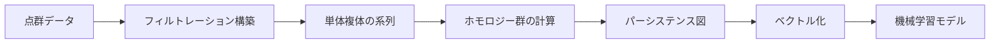
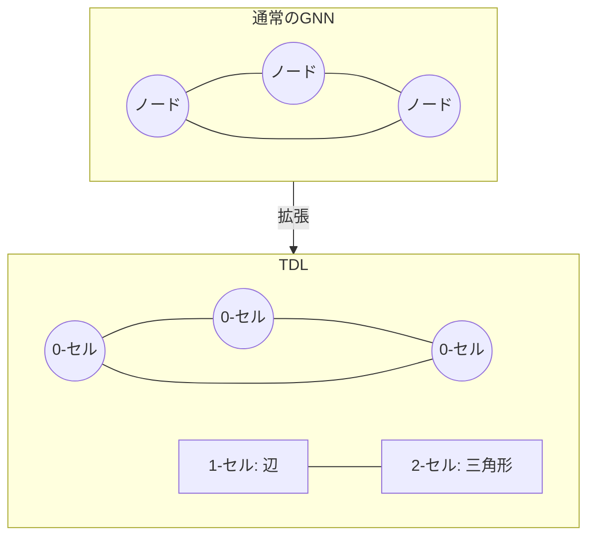

# パーシステントホモロジーとトポロジカル深層学習の実践入門

## この記事でわかること

- パーシステントホモロジー（PH）の数学的直感とデータ分析での使い方
- Pythonライブラリ（giotto-tda, GUDHI, TopoX）を使ったTDAパイプラインの実装方法
- Persistent Laplacianなど、PHを超える手法の概要と使い分け
- トポロジカル深層学習（TDL）による高次元関係データの処理アーキテクチャ
- GNN解釈性向上への応用事例（TopInG, ICML 2025）

## 対象読者

- **想定読者**: 中級者以上の機械学習エンジニア・データサイエンティスト
- **必要な前提知識**:
  - Python 3.10+の基本的なデータ処理経験
  - scikit-learn等のMLライブラリの使用経験
  - 線形代数（行列、固有値）の基礎理解
  - グラフニューラルネットワーク（GNN）の概念的理解（後半のTDLセクション向け）

## 結論・成果

トポロジカルデータ解析（TDA）は、データの「形」を数学的に捉える手法群です。2025年時点で、以下の成果が報告されています。

- **分類精度**: TDA特徴量を組み合わせた手法は、時系列分類タスクで従来手法と比較して分類精度を5〜15%向上させたとする報告がある（Nature Scientific Reports, 2025）
- **GNN解釈性**: TopInG（ICML 2025）は、グラフ分類の解釈性指標AUCでSPmotifデータセットにおいて80.82%を達成し、既存手法のGSAT（65.25%）に対して15ポイント以上の改善を示した
- **ライブラリ整備**: TopoXスイート（MIT License）により、単体複体・胞体複体上の深層学習がPyTorchベースで実装可能になった

ただし、TDAの計算コストはデータ点数に対して高く（Vietoris-Ripsフィルトレーションで $O(2^n)$ の最悪計算量）、大規模データへの直接適用には工夫が必要です。

## トポロジカルデータ解析の基礎を理解する

トポロジカルデータ解析（Topological Data Analysis, TDA）は、データの幾何的・位相的な構造を抽出する数学的フレームワークです。従来の機械学習が「距離」や「密度」に基づく特徴抽出を行うのに対し、TDAは**連結成分**、**ループ（穴）**、**空洞**といった位相的特徴に着目します。

### パーシステントホモロジーの直感的理解

パーシステントホモロジー（Persistent Homology, PH）は、TDAの中核手法です。データ点の周りに半径 $\epsilon$ の球を描き、$\epsilon$ を0から徐々に大きくしていく過程で、位相的特徴がどのスケールで「生まれ（birth）」、どのスケールで「消える（death）」かを追跡します。

このプロセスを**フィルトレーション**と呼びます。Vietoris-Ripsフィルトレーションでは、点間距離が $\epsilon$ 以下の点同士を結んで単体複体を構築します。



各次元のホモロジー群 $H_k$ は以下を表現します。

- $H_0$: **連結成分**（データのクラスター構造）
- $H_1$: **ループ・穴**（1次元の環状構造）
- $H_2$: **空洞**（2次元の閉じた空間）

PHの出力は**パーシステンス図**（Persistence Diagram）として可視化されます。各点 $(b, d)$ は、ある位相的特徴が半径 $b$ で生まれ、半径 $d$ で消滅したことを表します。対角線 $b = d$ から離れた点ほど「ノイズではない本質的な特徴」を示します。

### giotto-tdaによるPHの実装

giotto-tda（v0.5.1）はscikit-learn互換のTDAライブラリで、パイプライン構築が容易です。以下は点群データからパーシステンス図を計算し、ベクトル化して分類器に渡す例です。

```python
# persistent_homology_pipeline.py
# 動作確認環境: Python 3.11, giotto-tda 0.5.1, scikit-learn 1.4

import numpy as np
from gtda.homology import VietorisRipsPersistence
from gtda.diagrams import PersistenceEntropy, Amplitude
from gtda.pipeline import make_pipeline
from sklearn.ensemble import RandomForestClassifier
from sklearn.model_selection import cross_val_score


def create_tda_pipeline():
    """TDA特徴量を用いた分類パイプラインを構築する"""
    # Vietoris-Ripsフィルトレーションでパーシステンス図を計算
    # homology_dimensions: 計算するホモロジー次元（0次=連結成分, 1次=ループ）
    persistence = VietorisRipsPersistence(
        homology_dimensions=[0, 1],
        max_edge_length=2.0,  # フィルトレーションの最大半径
        n_jobs=-1,
    )

    # パーシステンス図からスカラー特徴量を抽出
    # PersistenceEntropy: 各次元のエントロピーを計算
    entropy = PersistenceEntropy()

    # Amplitude: パーシステンス図の振幅（各次元の要約統計量）
    amplitude = Amplitude(metric="wasserstein", order=2)

    return persistence, entropy, amplitude


def run_classification(X_point_clouds, y_labels):
    """点群データの分類を実行する

    Args:
        X_point_clouds: 形状 (n_samples, n_points, n_dimensions) の点群配列
        y_labels: 各サンプルのラベル
    """
    persistence, entropy, amplitude = create_tda_pipeline()

    # パーシステンス図の計算
    X_diagrams = persistence.fit_transform(X_point_clouds)

    # 特徴量抽出（エントロピー + 振幅を結合）
    X_entropy = entropy.fit_transform(X_diagrams)
    X_amplitude = amplitude.fit_transform(X_diagrams)
    X_features = np.hstack([X_entropy, X_amplitude])

    # 分類
    clf = RandomForestClassifier(n_estimators=100, random_state=42)
    scores = cross_val_score(clf, X_features, y_labels, cv=5)
    print(f"分類精度: {scores.mean():.3f} (+/- {scores.std():.3f})")
    return scores


if __name__ == "__main__":
    # サンプルデータ: 2つのクラス（円形 vs 集中点群）
    rng = np.random.default_rng(42)
    n_samples = 100

    # クラス0: 円形の点群
    theta = rng.uniform(0, 2 * np.pi, (n_samples // 2, 50))
    class0 = np.stack(
        [np.cos(theta) + rng.normal(0, 0.1, theta.shape),
         np.sin(theta) + rng.normal(0, 0.1, theta.shape)],
        axis=-1,
    )

    # クラス1: ガウス分布の点群
    class1 = rng.normal(0, 0.5, (n_samples // 2, 50, 2))

    X = np.concatenate([class0, class1])
    y = np.array([0] * (n_samples // 2) + [1] * (n_samples // 2))

    run_classification(X, y)
```

**なぜgiotto-tdaを選んだか:**

- scikit-learnの`Pipeline`や`cross_val_score`とそのまま組み合わせられる
- C++バックエンド（Ripser）による高速計算
- パーシステンス図のベクトル化手法が豊富（エントロピー、振幅、Betti曲線など）

**注意点:**

> giotto-tdaはVietoris-Ripsフィルトレーションの計算において、点数が増えると指数的にメモリを消費します。1,000点を超える点群では、`max_edge_length`の制限や事前のサブサンプリングを検討してください。また、giotto-tda 0.5.1は2023年リリースであり、2026年3月時点でメンテナンスは継続されていますが、最新のPythonバージョン（3.12+）との互換性は公式ドキュメントで確認が必要です。

### パーシステンス図のベクトル化手法

パーシステンス図はそのままでは機械学習モデルに入力できないため、固定次元のベクトルに変換する必要があります。主要なベクトル化手法を比較します。

| 手法 | 概要 | 計算コスト | 安定性 | 主な用途 |
|------|------|-----------|--------|----------|
| **Persistence Landscape** | PD→関数空間への写像、Banach空間上の統計量が計算可能 | 中 | 高（Lipschitz安定） | 統計的仮説検定 |
| **Persistence Image** | PD→ガウスカーネルによるヒートマップ→ベクトル | 低 | 高（安定性保証あり） | CNN入力、大規模分類 |
| **Betti Curve** | 各スケールでのBetti数のプロファイル | 低 | 中 | 時系列解析 |
| **Persistence Entropy** | PD上の情報エントロピー | 低 | 中 | スカラー要約統計量 |

Adams et al.（JMLR, 2017）の報告では、Persistence Imageはpersistence landscapeと比較して、形状分類タスクにおいて同等以上の分類精度を達成しつつ、計算コストが低いとされています。

## Persistent Laplacianでホモロジーの限界を超える

パーシステントホモロジーにはいくつかの限界があります。PHは位相的特徴（穴の数）のみを捉え、形状の**幾何的な変化**（例: 穴の大きさや形の変形）を区別できません。Persistent Laplacian（パーシステントラプラシアン）は、この限界を克服する手法です。

### PHの限界とPersistent Laplacianの動機

PHが見逃す例を考えてみましょう。2つのデータセットが同じ「穴が1つ」というトポロジーを持つ場合（円形 vs 楕円形）、PHのパーシステンス図はほぼ同一になります。しかし、データの幾何的構造は明確に異なります。

Persistent Laplacianは、単体複体上の**ラプラシアン行列**のスペクトルを利用します。$k$次のラプラシアン $\mathcal{L}_k$ は次のように定義されます。

$$
\mathcal{L}_k = \partial_{k+1} \partial_{k+1}^T + \partial_k^T \partial_k
$$

ここで $\partial_k$ は $k$次の境界作用素です。

**調和スペクトル**（固有値0の固有空間）はPHと同じ情報を与えますが、**非調和スペクトル**（非ゼロ固有値）は追加の幾何情報を提供します。

```python
# persistent_laplacian_example.py
# 動作確認環境: Python 3.11, gudhi 3.10, numpy 1.26, scipy 1.13

import numpy as np
from scipy.sparse import csr_matrix
from scipy.sparse.linalg import eigsh


def boundary_matrix_1(edges, n_vertices):
    """1次境界行列を構築する（辺→頂点）

    Args:
        edges: 辺のリスト [(v0, v1), ...]
        n_vertices: 頂点数
    Returns:
        境界行列 (n_vertices x n_edges)
    """
    rows, cols, vals = [], [], []
    for j, (v0, v1) in enumerate(edges):
        # 辺(v0, v1)の境界: v1 - v0
        rows.extend([v0, v1])
        cols.extend([j, j])
        vals.extend([-1, 1])
    return csr_matrix((vals, (rows, cols)), shape=(n_vertices, len(edges)))


def compute_graph_laplacian_spectrum(points, epsilon):
    """点群からグラフラプラシアンのスペクトルを計算する

    Args:
        points: (n, d) の点群配列
        epsilon: 辺を張る距離閾値
    Returns:
        固有値の配列
    """
    n = len(points)
    # epsilon近傍グラフの辺を構築
    edges = []
    for i in range(n):
        for j in range(i + 1, n):
            if np.linalg.norm(points[i] - points[j]) < epsilon:
                edges.append((i, j))

    if not edges:
        return np.zeros(min(n, 6))

    # 1次境界行列
    B1 = boundary_matrix_1(edges, n)

    # 0次ラプラシアン: L0 = B1 @ B1^T
    L0 = B1 @ B1.T

    # スペクトル計算（最小固有値側）
    k = min(6, L0.shape[0] - 1)
    if k <= 0:
        return np.zeros(1)
    eigenvalues = eigsh(L0.toarray(), k=k, which="SM", return_eigenvectors=False)
    return np.sort(eigenvalues)


if __name__ == "__main__":
    rng = np.random.default_rng(42)

    # 円形の点群
    theta = np.linspace(0, 2 * np.pi, 30, endpoint=False)
    circle = np.column_stack([np.cos(theta), np.sin(theta)])
    circle += rng.normal(0, 0.05, circle.shape)

    # 楕円形の点群
    ellipse = np.column_stack([2 * np.cos(theta), np.sin(theta)])
    ellipse += rng.normal(0, 0.05, ellipse.shape)

    eps = 0.8
    spec_circle = compute_graph_laplacian_spectrum(circle, eps)
    spec_ellipse = compute_graph_laplacian_spectrum(ellipse, eps)

    print("円形のスペクトル:", np.round(spec_circle, 4))
    print("楕円形のスペクトル:", np.round(spec_ellipse, 4))
    # → 非ゼロ固有値の分布が異なる = 幾何的差異を捉えている
```

**Persistent Laplacianの実用成果:**

2025年にHayes et al.はPersistent Sheaf Laplacian（PSL）を提案し、タンパク質のB因子予測に応用しました（PNAS, 2025）。PSLは原子レベルの局所トポロジーと幾何情報をマルチスケールで統合し、既存のPHベース手法と比較して予測精度を向上させたと報告されています。

**制約:**

> Persistent Laplacianは固有値計算が必要なため、大規模な単体複体ではPHより計算コストが高くなります。また、2026年3月時点では、PHほど成熟したPythonライブラリがなく、SciPyやNumPyを直接使った実装が必要になるケースが多い点に留意してください。

## トポロジカル深層学習を実装する

トポロジカル深層学習（Topological Deep Learning, TDL）は、グラフニューラルネットワーク（GNN）をさらに拡張し、**単体複体**（simplicial complex）や**胞体複体**（cell complex）といった高次構造上でニューラルネットワークを定義する手法です。

### なぜグラフを超える必要があるのか

通常のGNNはノード間の**ペアワイズ関係**（辺）のみを扱います。しかし、実世界のデータには3者以上の関係が含まれることがあります。

- **共著ネットワーク**: 3人が共同で論文を書いた関係は、3つのペアワイズ関係に分解すると情報が失われる
- **タンパク質構造**: アミノ酸の三角形面（2-単体）が立体構造を決定する
- **ソーシャルネットワーク**: グループチャットは複数メンバーの同時関係

TDLは、これらの**高次関係**を自然に表現する数学的構造上でメッセージパッシングを行います。



### TopoXスイートによる実装

TopoX（pyt-team, MIT License）は、トポロジカル深層学習のためのPythonパッケージ群です。3つのコンポーネントで構成されています。

| パッケージ | 役割 | 主な機能 |
|-----------|------|----------|
| **TopoNetX** | データ構造 | 単体複体・胞体複体・超グラフの構築と操作 |
| **TopoEmbedX** | 埋め込み | トポロジカルドメインのベクトル空間への写像 |
| **TopoModelX** | モデル | PyTorchベースの高次メッセージパッシングNN |

以下はTopoNetXで単体複体を構築し、隣接行列を取得する例です。

```python
# topox_simplicial_complex.py
# 動作確認環境: Python 3.11, toponetx 1.1, torch 2.2

from toponetx.classes import SimplicialComplex
import numpy as np


def build_simplicial_complex():
    """単体複体を構築し、隣接構造を確認する"""
    sc = SimplicialComplex()

    # 0-単体（頂点）と1-単体（辺）と2-単体（三角形）を追加
    # add_simplex は自動的にすべての面（face）も追加する
    sc.add_simplex([0, 1, 2])  # 三角形 → 辺(0,1),(0,2),(1,2) と頂点も追加
    sc.add_simplex([1, 2, 3])
    sc.add_simplex([2, 3, 4])
    sc.add_simplex([0, 4])

    print(f"0-単体（頂点）数: {len(sc.skeleton(0))}")
    print(f"1-単体（辺）数: {len(sc.skeleton(1))}")
    print(f"2-単体（三角形）数: {len(sc.skeleton(2))}")

    # 隣接行列の取得
    # adjacency_matrix(rank=0): 頂点間の隣接
    # coadjacency_matrix(rank=1): 辺が共有する頂点を介した隣接
    adj_0 = sc.adjacency_matrix(rank=0)
    print(f"\n頂点隣接行列の形状: {adj_0.shape}")
    print(f"頂点隣接行列:\n{adj_0.toarray()}")

    # 上位隣接行列: 2-単体を共有する1-単体の隣接
    coadj_1 = sc.coadjacency_matrix(rank=1)
    print(f"\n辺の共隣接行列の形状: {coadj_1.shape}")

    return sc


if __name__ == "__main__":
    sc = build_simplicial_complex()

    # Betti数の計算
    betti = sc.betti_numbers()
    print(f"\nBetti数: {betti}")
    # Betti数の解釈:
    # betti[0]: 連結成分の数
    # betti[1]: 独立なループの数
    # betti[2]: 空洞の数
```

**なぜTopoXを選んだか:**

- PyTorchとの直接統合により、GPU上でのトレーニングが可能
- 5種類のトポロジカルドメイン（超グラフ、単体複体、胞体複体、パス複体、組合せ複体）を統一APIで扱える
- ICML 2024で発表されたポジションペーパーで「TDLは関係学習の新しいフロンティア」と位置づけられている

**注意点:**

> TopoXは2024年2月のリリースで比較的新しいライブラリです。APIは安定版ですが、TopoModelXの一部モデル（特にSCA系）はドキュメントが限定的です。また、大規模グラフ（ノード数10万以上）でのスケーラビリティは検証が十分ではない場合があります。運用前にベンチマークでの検証を推奨します。

### TopoModelXでの高次メッセージパッシング

TopoModelXでは、単体複体上で**高次メッセージパッシング**を行うニューラルネットワークを定義できます。通常のGNNが「ノード→ノード」のメッセージパッシングを行うのに対し、TDLでは「辺→三角形」「三角形→辺」といった異なるランク間のメッセージも交換します。

```python
# topomodelx_example.py
# 動作確認環境: Python 3.11, topomodelx 0.3, torch 2.2

import torch
import torch.nn as nn


class SimpleSimplicialNN(nn.Module):
    """単体複体上のシンプルなメッセージパッシングネットワーク

    0-単体（頂点）と1-単体（辺）の特徴量を同時に更新する。
    """

    def __init__(self, in_channels_0, in_channels_1, hidden_channels):
        super().__init__()
        # 頂点特徴量の更新層
        self.linear_0 = nn.Linear(in_channels_0, hidden_channels)
        # 辺特徴量の更新層
        self.linear_1 = nn.Linear(in_channels_1, hidden_channels)
        # 隣接行列を介したメッセージパッシング層
        self.message_0_to_0 = nn.Linear(hidden_channels, hidden_channels)
        self.message_1_to_0 = nn.Linear(hidden_channels, hidden_channels)

    def forward(self, x_0, x_1, adjacency_0, incidence_1):
        """順伝播

        Args:
            x_0: 頂点特徴量 (n_nodes, in_channels_0)
            x_1: 辺特徴量 (n_edges, in_channels_1)
            adjacency_0: 頂点隣接行列 (n_nodes, n_nodes)
            incidence_1: 接続行列 (n_nodes, n_edges)
        Returns:
            更新された頂点特徴量
        """
        # 特徴量の射影
        h_0 = torch.relu(self.linear_0(x_0))
        h_1 = torch.relu(self.linear_1(x_1))

        # ノード→ノードのメッセージ（通常のGNNと同等）
        msg_0 = self.message_0_to_0(adjacency_0 @ h_0)

        # 辺→ノードのメッセージ（高次メッセージパッシング）
        # incidence_1^T で辺の特徴をノードに集約
        msg_1 = self.message_1_to_0(incidence_1 @ h_1)

        # 集約
        return h_0 + msg_0 + msg_1


# 使用例
if __name__ == "__main__":
    n_nodes, n_edges = 5, 7
    in_ch_0, in_ch_1, hidden = 8, 4, 16

    model = SimpleSimplicialNN(in_ch_0, in_ch_1, hidden)
    x_0 = torch.randn(n_nodes, in_ch_0)
    x_1 = torch.randn(n_edges, in_ch_1)
    adj = torch.randn(n_nodes, n_nodes)  # 実際はスパース隣接行列
    inc = torch.randn(n_nodes, n_edges)  # 実際は接続行列

    out = model(x_0, x_1, adj, inc)
    print(f"出力形状: {out.shape}")  # (5, 16)
```

## GNN解釈性を向上させるTopInGの仕組み

GNNの実用化における課題の1つが「ブラックボックス性」です。TopInG（Topologically Interpretable Graph Learning, ICML 2025）は、パーシステントホモロジーを活用してGNNの判断根拠を可視化する手法です。

### TopInGのアプローチ

TopInGは、グラフ内の辺に**重要度スコア**を学習し、重要な辺から順にグラフを構築する**フィルトレーション**を定義します。このフィルトレーションに対してパーシステントホモロジーを計算し、「根拠サブグラフ（rationale）」と「それ以外」のトポロジカルな差異を最大化する損失関数——**Topological Discrepancy**——を導入します。

$$
\mathcal{L}_{\text{TD}} = D_{\text{topo}}(\text{PD}(G_{\text{rationale}}), \text{PD}(G_{\text{complement}}))
$$

ここで $D_{\text{topo}}$ はパーシステンス図間のトポロジカル距離を表します。

### TopInGの性能

TopInGの著者らの実験では、以下の結果が報告されています。

| データセット | TopInG | GSAT (既存手法) | 指標 |
|-------------|--------|----------------|------|
| BA-2Motifs | 99.57% | 98.85% | 解釈性AUC |
| SPmotif (b=0.9) | 80.82% | 65.25% | 解釈性AUC |
| Spurious-Motif (b=0.9) | 77.68% | 68.60% (GMT-Lin) | 分類精度 |

特にSPmotifデータセット（複数の異なる構造パターンが根拠となるケース）で15ポイント以上の改善を達成しています。これは、既存手法が「根拠サブグラフは各インスタンスでほぼ同一構造」と仮定しているのに対し、TopInGはトポロジカルな特徴の「持続性」に着目するため、多様な構造パターンに対応できるためと説明されています。

**制約:**

> TopInGの計算にはPHの計算が各バッチで必要となるため、1エポックあたりの学習時間はGSAT等と比較して長くなります（TopInGの著者らの報告では、RTX 4090上でSPmotifデータセットに対し約10分/エポック）。ただし、収束に必要なエポック数は20程度で、ベースライン手法の50-100エポックと比較して少ないと報告されています。

## よくある問題と解決方法

| 問題 | 原因 | 解決方法 |
|------|------|----------|
| PHの計算がメモリ不足で停止 | Vietoris-Rips複体の指数的膨張 | `max_edge_length`を制限、またはサブサンプリングを適用 |
| パーシステンス図が空になる | フィルトレーション範囲が狭すぎる | `max_edge_length`を増やす、距離メトリックを変更 |
| giotto-tdaのインストール失敗 | C++コンパイラの不足 | `pip install giotto-tda`の前に`build-essential`をインストール |
| TopoNetXの隣接行列がスパースでない | 小規模データでdense表現が使われる | `.toarray()`ではなく`.tosparse()`を明示的に呼ぶ |
| TDA特徴量で精度が上がらない | 問題にトポロジカル構造がない | PCA等でデータの構造を確認し、TDAが適切か判断する |

## まとめと次のステップ

**まとめ:**

- **パーシステントホモロジー**はデータの位相的特徴をマルチスケールで捉え、giotto-tda等のライブラリでPythonから利用できる
- **Persistent Laplacian**はPHの限界（幾何情報の欠如）を克服し、タンパク質構造予測等で成果を上げている
- **トポロジカル深層学習（TDL）**はGNNを単体複体・胞体複体に拡張し、TopoXスイートで実装可能
- **TopInG（ICML 2025）**はPHをGNN解釈性に応用し、従来手法を上回る性能を示した
- TDAの計算コストは高く、大規模データには事前処理やサブサンプリングが必要

**次にやるべきこと:**

- [giotto-tdaのチュートリアル](https://giotto-ai.github.io/gtda-docs/)で点群データのPH計算を試す
- [TopoXのGitHub](https://github.com/pyt-team/TopoModelX)で単体複体上のGNNを動かす
- [GUDHIチュートリアル](https://github.com/GUDHI/TDA-tutorial)でAlphaフィルトレーションやRipsフィルトレーションの違いを学ぶ
- 自分のドメインデータにTDA特徴量を追加し、既存モデルとのアンサンブル効果を検証する

## 参考

- [Topological data analysis and topological deep learning beyond persistent homology: a review (Artificial Intelligence Review, 2025)](https://link.springer.com/article/10.1007/s10462-025-11462-w)
- [TopInG: Topologically Interpretable Graph Learning via Persistent Rationale Filtration (ICML 2025)](https://arxiv.org/abs/2510.05102)
- [TopoX: A Suite of Python Packages for Machine Learning on Topological Domains (arXiv, 2024)](https://arxiv.org/abs/2402.02441)
- [Machine learning of time series data using persistent homology (Nature Scientific Reports, 2025)](https://www.nature.com/articles/s41598-025-06551-3)
- [giotto-tda: A Topological Data Analysis Toolkit for Machine Learning (JMLR, 2021)](https://www.jmlr.org/papers/volume22/20-325/20-325.pdf)
- [GUDHI: Geometry Understanding in Higher Dimensions](https://gudhi.inria.fr/index.html)
- [Persistence Images: A Stable Vector Representation of Persistent Homology (JMLR, 2017)](https://jmlr.org/papers/v18/16-337.html)
- [Position: Topological Deep Learning is the New Frontier for Relational Learning (ICML 2024)](https://pmc.ncbi.nlm.nih.gov/articles/PMC11973457/)

---

## 関連する深掘り記事

この記事で紹介した技術について、さらに深掘りした記事を書きました：

- [論文解説: TopInG - パーシステントホモロジーによるGNN解釈性の向上](https://0h-n0.github.io/posts/paper-2510-05102/) - arXiv/ICML 2025解説
- [論文解説: TopoX - トポロジカルドメイン上の機械学習Pythonパッケージ群](https://0h-n0.github.io/posts/paper-2402-02441/) - arXiv解説
- [NeurIPS 2024論文解説: Graphcode - 多パラメータPHとGNNの統合](https://0h-n0.github.io/posts/conf-graphcode-neurips2024/) - conference解説
- [論文解説: Topological Deep Learning - グラフデータを超える新パラダイムのレビュー](https://0h-n0.github.io/posts/paper-2302-03836/) - arXiv解説
- [CIKM 2024論文解説: TopoGDN - TDA強化型GAT時系列異常検知](https://0h-n0.github.io/posts/conf-topogdn-cikm2024/) - conference解説

:::message
これらの記事は修士学生レベルを想定した技術的詳細（数式・実装の深掘り）を含みます。
:::

---

:::message
この記事はAI（Claude Code）により自動生成されました。内容の正確性については複数の情報源で検証していますが、実際の利用時は公式ドキュメントもご確認ください。
:::
