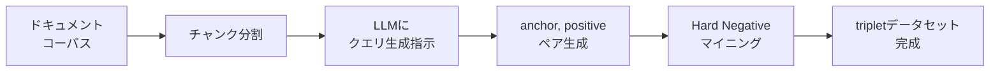

# Embedding Fine-tuning実践：合成データと評価ループでRAG検索精度を改善する

## この記事でわかること

- 公開ベンチマーク（MTEB/JMTEB）と自社データの精度ギャップが生じる原因と、Fine-tuningが有効なケースの判断基準
- LLMを活用した合成クエリ生成で、ラベル付きデータなしにFine-tuning用データセットを構築する方法
- sentence-transformers v3のTrainer APIを使い、MultipleNegativesRankingLoss×MatryoshkaLossでEmbeddingモデルをFine-tuningする手順
- GISTEmbedLossによるfalse negative軽減と、InformationRetrievalEvaluatorによる評価駆動型の改善ループ
- 128次元に圧縮しても768次元ベースラインを上回る、次元削減×精度維持のトレードオフ最適化

## 対象読者

- **想定読者**: 中級者〜上級者のMLエンジニア・バックエンドエンジニア
- **必要な前提知識**:
  - Python 3.11+の基本操作
  - sentence-transformers / Hugging Face Transformersの基礎
  - RAG（Retrieval-Augmented Generation）パイプラインの基本構成
  - NDCG@K・Recall@Kなどの検索評価指標の概念

## 結論・成果

Embedding Fine-tuningにより、NDCG@10で**7〜22%の精度向上**が報告されています。Philschmid氏の実験（2024年）では、BAAI/bge-base-en-v1.5をNVIDIAのSEC文書7,000ペアでFine-tuningした結果、768次元でNDCG@10が0.7684→0.8254（+7.4%）に改善しました。さらにMatryoshkaLossを併用すると、**128次元でもFine-tuning前の768次元ベースラインを6.5%上回る**結果となり、ベクトルDBのストレージコストを1/6に削減しつつ精度向上を両立できます。

ただし、Fine-tuningは万能ではありません。ドメインの語彙がベースモデルの学習データと大きく乖離していない場合、改善幅は限定的です。本記事では、**「Fine-tuningすべきか否か」の判断基準**から、合成データ生成→Fine-tuning→評価→改善の一連のワークフローを実装します。

関連記事:
- [MTEB×JMTEBで選ぶEmbeddingモデル：精度評価の実践ガイド](https://zenn.dev/0h_n0/articles/6388d71c6bcb23)（ベンチマークの読み方・評価指標の基礎）
- [自社データで実践するEmbeddingモデル精度評価パイプライン構築](https://zenn.dev/0h_n0/articles/db325cb1cb2e24)（自社データでの評価パイプライン）

## Fine-tuningが必要な場面を判断する

Embeddingモデルの性能をベンチマークだけで評価して選定すると、本番運用で期待どおりの精度が出ないケースがあります。ここでは、Fine-tuningに投資する価値があるかどうかを判断するフレームワークを紹介します。

### ベンチマークと実データの精度ギャップ

公開ベンチマーク（MTEBやJMTEB）は一般ドメインのテストセットで評価されています。しかし、自社の検索タスクでは以下の3つの要因でギャップが発生します。

| ギャップ要因 | 具体例 | Fine-tuningの効果 |
|------------|--------|------------------|
| **ドメイン語彙の乖離** | 医療用語、法律用語、社内略語 | 高い（語彙空間を再学習） |
| **文書構造の違い** | 長い技術マニュアル、FAQ形式 | 中程度（チャンク戦略で補完可能） |
| **クエリ特性の違い** | キーワード羅列、口語的な質問 | 高い（クエリ分布に適応） |

Databricksのレポートによると、ドメイン特化データでのFine-tuningによりRecall@10が5〜10%向上する事例が報告されています。BES4RAG（ACL 2025 CLiC-it）の分析でも、MTEBスコアの順位と実タスクでの順位が逆転するケースが確認されています。

### Fine-tuningの判断チャート

Fine-tuningに着手する前に、以下の判断基準で費用対効果を検討してみましょう。

```mermaid
graph TD
    A[自社データで評価を実行] --> B{NDCG@10 目標値を<br/>達成しているか？}
    B -- Yes --> C[Fine-tuning不要<br/>別のモデルを試す or<br/>リランキングで補完]
    B -- No --> D{ドメイン固有の<br/>語彙が多いか？}
    D -- Yes --> E[Fine-tuning推奨<br/>合成データ + 対照学習]
    D -- No --> F{クエリと文書の<br/>スタイルが異なるか？}
    F -- Yes --> G[Fine-tuning推奨<br/>クエリ生成で適応]
    F -- No --> H[チャンク戦略の<br/>見直しを優先]
```

> **よくある間違い**: 「ベンチマークスコアが高いモデルならFine-tuningは不要」と考えがちですが、Philschmid氏の実験ではMTEBでトップクラスのbge-base-en-v1.5でも、ドメイン特化データでのFine-tuningでNDCG@10が7.4%向上しています。ベースモデルの品質が高くても、ドメイン適応の余地は残ります。

### 2026年時点の主要Fine-tuning対象モデル

Fine-tuningのベースとして選択する主要モデルを整理します。

| モデル | パラメータ | 次元数 | ライセンス | 特徴 |
|--------|----------|--------|-----------|------|
| **nomic-ai/modernbert-embed-base** | 149M | 768 | Apache 2.0 | ModernBERT採用、8192トークン対応 |
| **BAAI/bge-base-en-v1.5** | 109M | 768 | MIT | RetroMAE事前学習、安定した性能 |
| **intfloat/multilingual-e5-large** | 560M | 1024 | MIT | 多言語対応、日本語にも有効 |
| **pfnet/plamo-embedding-1b** | 1B | 2048 | Apache 2.0 | 日本語JMTEB 76.10、LLM2Vec変換 |

**なぜFine-tuning対象としてこれらを選ぶか:**
- Apache 2.0 / MITライセンスのため、商用利用でモデル配布が可能
- sentence-transformersのTrainer APIで直接Fine-tuning可能
- 100M〜1Bパラメータの範囲で、GPU要件とのバランスが取れている

**制約条件**: APIのみで提供されるモデル（OpenAI text-embedding-3-large、Voyage 4等）は重みにアクセスできないため、ここで紹介するFine-tuning手法の適用対象外です。API経由のモデルを使う場合は、プロンプトチューニングやリランキングでの補完を検討してください。

## 合成データでFine-tuning用データセットを構築する

Embedding Fine-tuningで最大の障壁は「ラベル付きデータがない」ことです。しかし、LLMを使った合成クエリ生成により、手動アノテーションなしでデータセットを構築できます。

### 合成クエリ生成の仕組み

合成データ生成のアプローチは、ドキュメント（チャンク）を入力としてLLMに「このテキストに関連する検索クエリを生成せよ」と指示するシンプルな方法です。



LlamaIndexの合成データ生成ガイドやHugging Faceの手法によると、LLMでクエリを生成する際にはドキュメントのコンテキストを入力として渡し、そのドキュメントの内容について自然に問い合わせるクエリを生成させます。

### LLMによる合成クエリ生成の実装

以下は、自社ドキュメントからFine-tuning用のクエリ・ドキュメントペアを生成するコードです。

```python
# generate_synthetic_queries.py
import json
from anthropic import Anthropic

client = Anthropic()

QUERY_GEN_PROMPT = """以下のドキュメントチャンクを読み、このチャンクの内容に関して
ユーザーが検索エンジンに入力しそうなクエリを{num_queries}個生成してください。

条件:
- 実際のユーザーが入力する自然な検索クエリ形式（質問文やキーワード）
- チャンクの内容に対して関連性が高いこと
- 各クエリは異なる側面や表現を使うこと
- 日本語で生成すること

ドキュメント:
{chunk}

JSON形式で出力してください:
{{"queries": ["クエリ1", "クエリ2", ...]}}"""


def generate_queries(
    chunk: str,
    num_queries: int = 3,
    model: str = "claude-sonnet-4-6",
) -> list[str]:
    """ドキュメントチャンクから合成クエリを生成する"""
    response = client.messages.create(
        model=model,
        max_tokens=1024,
        messages=[
            {
                "role": "user",
                "content": QUERY_GEN_PROMPT.format(
                    chunk=chunk, num_queries=num_queries
                ),
            }
        ],
    )
    result = json.loads(response.content[0].text)
    return result["queries"]


def build_training_pairs(
    chunks: list[str],
    num_queries_per_chunk: int = 3,
) -> list[dict[str, str]]:
    """チャンク群からanchor-positiveペアを構築する"""
    pairs = []
    for chunk in chunks:
        queries = generate_queries(chunk, num_queries_per_chunk)
        for query in queries:
            pairs.append({"anchor": query, "positive": chunk})
    return pairs
```

**なぜClaude Sonnet 4.6を使うか:**
- JSON形式の構造化出力が安定している
- 日本語での自然なクエリ生成能力が高い
- コスト面でも、チャンク数×3クエリ程度であればAPI費用は数ドル以内に収まる

### Hard Negativeマイニングの追加

Fine-tuningの精度を高めるには、**Hard Negative**（意味的に似ているが正解ではないドキュメント）の追加が有効です。PLaMo-Embedding-1Bの開発でもHard Negativesの活用が性能向上に寄与したと報告されています。

```python
# hard_negative_mining.py
from sentence_transformers import SentenceTransformer
import numpy as np


def mine_hard_negatives(
    model: SentenceTransformer,
    anchors: list[str],
    positives: list[str],
    corpus: list[str],
    top_k: int = 5,
    exclude_top_n: int = 1,
) -> list[str]:
    """コサイン類似度ベースでHard Negativeを抽出する

    Args:
        model: Embeddingモデル（Fine-tuning前のベースモデル）
        anchors: クエリのリスト
        positives: 正解ドキュメントのリスト
        corpus: 全ドキュメントのリスト
        top_k: 候補として取得する上位件数
        exclude_top_n: 上位N件を除外（正解の可能性が高いため）

    Returns:
        Hard Negativeドキュメントのリスト
    """
    corpus_embeddings = model.encode(corpus, show_progress_bar=True)
    anchor_embeddings = model.encode(anchors)

    hard_negatives = []
    for i, anchor_emb in enumerate(anchor_embeddings):
        # コサイン類似度を計算
        similarities = np.dot(corpus_embeddings, anchor_emb) / (
            np.linalg.norm(corpus_embeddings, axis=1) * np.linalg.norm(anchor_emb)
        )
        # 正解ドキュメントを除外
        positive_idx = corpus.index(positives[i]) if positives[i] in corpus else -1
        similarities[positive_idx] = -1

        # 上位N件を除外し、その次に類似度が高いものをHard Negativeとする
        sorted_indices = np.argsort(similarities)[::-1]
        hard_neg_idx = sorted_indices[exclude_top_n]
        hard_negatives.append(corpus[hard_neg_idx])

    return hard_negatives
```

> **ハマりポイント**: Hard Negativeマイニング時に、正解ドキュメントとほぼ同一のチャンク（重複分割の結果生まれたもの）がnegativeに選ばれてしまうことがあります。これは **false negative** と呼ばれ、学習を不安定にします。チャンク分割時にオーバーラップを小さくするか、GISTEmbedLossを使ってfalse negativeの影響を軽減する対策が有効です。

### データセットの構造化

sentence-transformersのTrainer APIに渡すデータセット形式に変換します。

```python
# prepare_dataset.py
from datasets import Dataset


def create_triplet_dataset(
    anchors: list[str],
    positives: list[str],
    negatives: list[str],
) -> Dataset:
    """triplet形式のデータセットを作成する"""
    return Dataset.from_dict({
        "anchor": anchors,
        "positive": positives,
        "negative": negatives,
    })


# 使用例
# pairs = build_training_pairs(chunks, num_queries_per_chunk=3)
# anchors = [p["anchor"] for p in pairs]
# positives = [p["positive"] for p in pairs]
# negatives = mine_hard_negatives(base_model, anchors, positives, all_chunks)
# dataset = create_triplet_dataset(anchors, positives, negatives)
# dataset = dataset.train_test_split(test_size=0.1)
```

Philschmid氏の実験によると、**7,000ペア程度の合成データでも有意な精度向上**が得られており、大量のアノテーション済みデータは不要です。ただし、データ数が少なすぎる（100ペア以下）場合は過学習のリスクがあるため、最低500ペア以上を推奨します。

## MultipleNegativesRankingLoss×MatryoshkaLossでFine-tuningを実行する

データセットが準備できたら、sentence-transformers v3のTrainer APIを使ってFine-tuningを実行します。ここでは、精度向上と次元削減を同時に実現する損失関数の組み合わせを紹介します。

### 損失関数の選択

sentence-transformersは多数の損失関数を提供していますが、Retrieval用途のFine-tuningでは以下の3つが代表的です。

| 損失関数 | 入力形式 | 特徴 | 推奨ケース |
|---------|---------|------|----------|
| **MultipleNegativesRankingLoss** | (anchor, positive) | バッチ内negativeを活用、シンプル | 初回のFine-tuning |
| **GISTEmbedLoss** | (anchor, positive) | ガイドモデルでfalse negative軽減 | ノイズの多いデータ |
| **MatryoshkaLoss** | 任意のbase_loss | 複数次元で同時に学習、次元削減対応 | ストレージコスト重視 |

**MultipleNegativesRankingLoss**は、バッチ内の他のサンプルをnegativeとして利用する対照学習の損失関数です。追加のnegativeラベルが不要で、バッチサイズを大きくするほどnegativeの多様性が増し、学習が安定します。

**GISTEmbedLoss**は2024年に提案された手法で、ガイドモデル（学習済みの別のEmbeddingモデル）を使ってバッチ内のfalse negativeを検出・除外します。GISTEmbed論文（Solatorio, 2024）によると、MultipleNegativesRankingLossと比較してMTEBスコアが改善されると報告されています。ただし、ガイドモデルの推論コストが追加で発生するため、データ品質が高い場合はMultipleNegativesRankingLossで十分です。

**MatryoshkaLoss**は任意のbase_lossをラップし、複数の次元（768, 512, 256, 128, 64など）で同時に損失を計算します。これにより、推論時に低次元のEmbeddingを使ってもFine-tuningの恩恵を受けられます。

### Fine-tuningの実装

```python
# finetune_embedding.py
from sentence_transformers import (
    SentenceTransformer,
    SentenceTransformerTrainer,
    SentenceTransformerTrainingArguments,
)
from sentence_transformers.losses import (
    MatryoshkaLoss,
    MultipleNegativesRankingLoss,
)
from sentence_transformers.training_args import BatchSamplers
from sentence_transformers.evaluation import InformationRetrievalEvaluator
from datasets import load_dataset


def finetune_embedding(
    model_name: str = "BAAI/bge-base-en-v1.5",
    train_dataset_path: str = "my-org/domain-rag-triplets",
    output_dir: str = "models/domain-embedding-finetuned",
    matryoshka_dims: list[int] | None = None,
    num_epochs: int = 4,
    batch_size: int = 32,
    learning_rate: float = 2e-5,
) -> SentenceTransformer:
    """Embeddingモデルをドメインデータでfine-tuningする

    Args:
        model_name: ベースモデル名
        train_dataset_path: tripletデータセットのパス
        output_dir: Fine-tuning済みモデルの出力先
        matryoshka_dims: Matryoshka次元のリスト
        num_epochs: エポック数
        batch_size: バッチサイズ
        learning_rate: 学習率

    Returns:
        Fine-tuning済みのSentenceTransformerモデル
    """
    if matryoshka_dims is None:
        matryoshka_dims = [768, 512, 256, 128, 64]

    # 1. モデルのロード
    model = SentenceTransformer(model_name)

    # 2. データセットのロード
    dataset = load_dataset(train_dataset_path)
    train_data = dataset["train"]
    eval_data = dataset["test"]

    # 3. 損失関数の設定
    # MultipleNegativesRankingLossをMatryoshkaLossでラップ
    inner_loss = MultipleNegativesRankingLoss(model)
    train_loss = MatryoshkaLoss(
        model,
        inner_loss,
        matryoshka_dims=matryoshka_dims,
    )

    # 4. トレーニング引数
    args = SentenceTransformerTrainingArguments(
        output_dir=output_dir,
        num_train_epochs=num_epochs,
        per_device_train_batch_size=batch_size,
        per_device_eval_batch_size=batch_size,
        warmup_ratio=0.1,
        fp16=True,
        learning_rate=learning_rate,
        batch_sampler=BatchSamplers.NO_DUPLICATES,
        eval_strategy="steps",
        eval_steps=100,
        save_strategy="steps",
        save_steps=100,
        logging_steps=50,
    )

    # 5. トレーナーの作成と実行
    trainer = SentenceTransformerTrainer(
        model=model,
        args=args,
        train_dataset=train_data,
        eval_dataset=eval_data,
        loss=train_loss,
    )

    trainer.train()
    model.save_pretrained(f"{output_dir}/final")

    return model
```

**学習パラメータの選び方:**
- **バッチサイズ32**: MultipleNegativesRankingLossではバッチ内negativeを使うため、大きいほど有利です。GPUメモリに余裕があれば64〜128を試してください
- **学習率2e-5**: Transformerモデルのfine-tuningでの標準的な値です。1e-5〜5e-5の範囲で調整します
- **4エポック**: 小規模データ（1万件未満）では3〜5エポックが目安です。過学習は評価ロスの推移で監視します
- **warmup_ratio 0.1**: 学習初期の不安定化を防ぎます

> **制約条件**: Fine-tuningには最低でもGPU 16GB（A10G相当）が必要です。1Bパラメータのモデル（PLaMo-Embedding-1Bなど）をFine-tuningする場合は、LoRA（Low-Rank Adaptation）の適用を検討してください。Philschmid氏の実験では、bge-base-en-v1.5（109Mパラメータ）のFine-tuningがg5.2xlarge（A10G GPU）で約3分、コスト約$0.07で完了しています。

### GISTEmbedLossへの切り替え

データにノイズが多い（false negativeが混入しやすい）場合は、GISTEmbedLossへの切り替えを検討してみましょう。

```python
# gistembed_finetune.py
from sentence_transformers import SentenceTransformer
from sentence_transformers.losses import GISTEmbedLoss, MatryoshkaLoss


def create_gistembed_loss(
    model: SentenceTransformer,
    guide_model_name: str = "BAAI/bge-base-en-v1.5",
    matryoshka_dims: list[int] | None = None,
) -> MatryoshkaLoss:
    """GISTEmbedLoss + MatryoshkaLossの複合損失関数を作成する

    Args:
        model: 学習対象のモデル
        guide_model_name: false negative判定に使うガイドモデル
        matryoshka_dims: Matryoshka次元のリスト

    Returns:
        MatryoshkaLossでラップされたGISTEmbedLoss
    """
    if matryoshka_dims is None:
        matryoshka_dims = [768, 512, 256, 128, 64]

    guide_model = SentenceTransformer(guide_model_name)
    inner_loss = GISTEmbedLoss(model, guide=guide_model)

    return MatryoshkaLoss(
        model,
        inner_loss,
        matryoshka_dims=matryoshka_dims,
    )
```

**トレードオフ**: GISTEmbedLossはガイドモデルの推論を学習ステップごとに行うため、MultipleNegativesRankingLossと比較して**学習時間が約1.5〜2倍**になります。データ品質が高い（合成データをLLMで丁寧に生成した場合など）場合は、まずMultipleNegativesRankingLossで試し、精度が不十分な場合にGISTEmbedLossに切り替えるアプローチが推奨されます。

## 評価駆動型の改善ループを構築する

Fine-tuningの効果を客観的に測定し、改善を繰り返すには、体系的な評価パイプラインが必要です。ここでは、InformationRetrievalEvaluatorを使った評価と、次元別のトレードオフ分析を実装します。

### InformationRetrievalEvaluatorによるベースラインと比較

```python
# evaluate_embedding.py
from sentence_transformers import SentenceTransformer
from sentence_transformers.evaluation import InformationRetrievalEvaluator


def evaluate_retrieval(
    model: SentenceTransformer,
    queries: dict[str, str],
    corpus: dict[str, str],
    relevant_docs: dict[str, set[str]],
    name: str = "domain-eval",
    truncate_dim: int | None = None,
) -> dict[str, float]:
    """情報検索タスクでEmbeddingモデルを評価する

    Args:
        model: 評価対象のモデル
        queries: {query_id: query_text}
        corpus: {doc_id: doc_text}
        relevant_docs: {query_id: {relevant_doc_id, ...}}
        name: 評価名
        truncate_dim: Embeddingの次元を切り詰める場合の次元数

    Returns:
        評価指標の辞書
    """
    evaluator = InformationRetrievalEvaluator(
        queries=queries,
        corpus=corpus,
        relevant_docs=relevant_docs,
        name=name,
        truncate_dim=truncate_dim,
        score_functions={"cosine": "cos_sim"},
    )

    results = evaluator(model)
    return results


def compare_dimensions(
    model: SentenceTransformer,
    queries: dict[str, str],
    corpus: dict[str, str],
    relevant_docs: dict[str, set[str]],
    dimensions: list[int] | None = None,
) -> dict[int, float]:
    """複数次元でのNDCG@10を比較する

    Args:
        model: 評価対象のモデル（MatryoshkaLoss学習済み）
        queries, corpus, relevant_docs: 評価データ
        dimensions: 評価する次元のリスト

    Returns:
        {次元数: NDCG@10} の辞書
    """
    if dimensions is None:
        dimensions = [768, 512, 256, 128, 64]

    results = {}
    for dim in dimensions:
        eval_result = evaluate_retrieval(
            model, queries, corpus, relevant_docs,
            name=f"dim-{dim}",
            truncate_dim=dim,
        )
        ndcg_key = f"dim-{dim}_cosine_ndcg@10"
        results[dim] = eval_result.get(ndcg_key, 0.0)

    return results
```

### 次元別精度の比較結果

Philschmid氏の実験結果を参考に、Fine-tuning前後の次元別NDCG@10を示します。この結果はNVIDIA SEC文書7,000ペアでBAAI/bge-base-en-v1.5をFine-tuningした場合のものです。

| 次元 | Fine-tuning前 | Fine-tuning後 | 改善率 | ストレージ削減 |
|------|-------------|-------------|--------|-------------|
| 768 | 0.7684 | 0.8254 | +7.42% | 基準 |
| 512 | 0.7643 | 0.8275 | +8.27% | 33%削減 |
| 256 | 0.7546 | 0.8230 | +9.06% | 67%削減 |
| 128 | 0.7234 | 0.8184 | +13.13% | 83%削減 |
| 64 | 0.6440 | 0.7892 | +22.55% | 92%削減 |

この結果から分かるとおり、**MatryoshkaLossを使ったFine-tuning後は、128次元でもFine-tuning前の768次元（0.7684）を上回る0.8184**を記録しています。これは、ベクトルDBのストレージコストを83%削減しながら精度を向上できることを意味します。

> **トレードオフ**: 64次元まで圧縮すると絶対値としては0.7892に低下しますが、Fine-tuning前の768次元ベースラインは上回っています。ストレージコストとレイテンシを重視するユースケースでは検討に値します。ただし、64次元では細かい意味の違いを捉える能力が低下するため、同義語や類似表現の多いドメインでは256次元以上を推奨します。

### 改善ループの全体フロー

評価結果をもとに、データ拡充やハイパーパラメータ調整を繰り返す改善ループを構築します。

```mermaid
graph TD
    A[ベースモデルで<br/>ベースライン評価] --> B[合成データ生成<br/>+ Hard Negative]
    B --> C[Fine-tuning実行<br/>MNRLoss × MatryoshkaLoss]
    C --> D[次元別<br/>NDCG@10評価]
    D --> E{目標NDCG@10<br/>を達成？}
    E -- Yes --> F[本番デプロイ<br/>最適次元を選択]
    E -- No --> G{改善イテレーション<br/>< 3回？}
    G -- Yes --> H[データ拡充 or<br/>損失関数変更]
    H --> C
    G -- No --> I[リランキング追加<br/>or モデル変更]
```

**改善の優先順序:**
1. **データ拡充**: クエリのバリエーションを増やす（質問文・キーワード・口語表現の混在）
2. **損失関数変更**: MultipleNegativesRankingLoss → GISTEmbedLossに切り替え
3. **Hard Negative品質向上**: ベースモデルを更新してマイニング精度を改善
4. **リランキング追加**: Embeddingだけで解決できない場合、Cross-Encoderを追加

## よくある問題と解決方法

Fine-tuningの過程で遭遇しがちな問題と、その対処法をまとめます。

| 問題 | 原因 | 解決方法 |
|------|------|----------|
| Fine-tuning後に精度が下がった | 過学習、または合成データの品質が低い | エポック数を減らす（4→2）、学習率を下げる（2e-5→5e-6）、データの品質チェック |
| 特定のクエリタイプでのみ精度が悪い | 合成データのクエリバリエーション不足 | クエリ生成プロンプトに「キーワード型」「質問型」「口語型」を明示的に指定 |
| GPUメモリが不足する | バッチサイズが大きすぎる、またはモデルが大きい | gradient_accumulation_stepsを増やしてバッチサイズを下げる、またはpeftのLoRAを適用 |
| Hard Negativeが正解と酷似している | チャンクオーバーラップが大きい | チャンク分割戦略を見直す（オーバーラップ率を20%以下に）、GISTEmbedLossを使用 |
| MatryoshkaLoss学習後の低次元精度が悪い | matryoshka_dimsの設定が不適切 | 使用予定の次元を必ずmatryoshka_dimsに含める（例: 128次元で使うなら[768, 512, 256, 128]） |

## まとめと次のステップ

**まとめ:**
- Embeddingモデルは公開ベンチマークのスコアだけでは判断できず、**自社データでの評価とドメイン適応（Fine-tuning）が精度改善の鍵**となる
- LLMによる**合成クエリ生成**により、手動アノテーションなしでFine-tuning用データセットを構築でき、7,000ペア程度でNDCG@10が7〜22%向上する（Philschmid氏の実験）
- **MatryoshkaLossの併用**で次元を1/6（768→128）に削減しても、Fine-tuning前の768次元ベースラインを上回る精度を維持できる
- **GISTEmbedLoss**はfalse negativeの影響を軽減するが、学習時間が1.5〜2倍になるトレードオフがある
- 改善ループは「データ拡充→損失関数変更→Hard Negative品質向上→リランキング追加」の順で進めるのが効率的

**次にやるべきこと:**
- 自社のRAGコーパスから500〜1,000チャンクを選定し、合成クエリを生成してみましょう
- ベースライン評価（Fine-tuning前）→Fine-tuning→再評価の一連を実行し、NDCG@10の改善幅を確認してください
- 本番投入前に、次元別の精度×レイテンシ×ストレージコストのトレードオフを検証し、最適な次元数を決定してください

## 参考

- [Philschmid: Fine-tune Embedding models for RAG](https://www.philschmid.de/fine-tune-embedding-model-for-rag)
- [HuggingFace: Training and Finetuning Embedding Models with Sentence Transformers v3](https://huggingface.co/blog/train-sentence-transformers)
- [HuggingFace: Fine-tune ModernBERT for RAG with Synthetic Data](https://huggingface.co/blog/sdiazlor/fine-tune-modernbert-for-rag-with-synthetic-data)
- [GISTEmbed: Guided In-sample Selection of Training Negatives (arXiv:2402.16829)](https://arxiv.org/abs/2402.16829)
- [Matryoshka Representation Learning (arXiv:2205.13147)](https://arxiv.org/abs/2205.13147)
- [Databricks: Improving Retrieval and RAG with Embedding Model Finetuning](https://www.databricks.com/blog/improving-retrieval-and-rag-embedding-model-finetuning)
- [LlamaIndex: Fine-tuning Embeddings for RAG with Synthetic Data](https://www.llamaindex.ai/blog/fine-tuning-embeddings-for-rag-with-synthetic-data-e534409a3971)
- [Glean Enterprise RAG Fine-tuning Lessons](https://jxnl.co/writing/2025/03/06/fine-tuning-embedding-models-for-enterprise-rag-lessons-from-glean/)
- [PLaMo-Embedding-1B (PFN Tech Blog)](https://tech.preferred.jp/ja/blog/plamo-embedding-1b/)
- [sentence-transformers Losses Reference](https://sbert.net/docs/package_reference/sentence_transformer/losses.html)

## 関連する深掘り記事

本記事で取り上げた技術の1次情報（論文・企業ブログ）を詳しく解説した記事です。

- [論文解説: GISTEmbed — ガイドモデルによる学習負例選択でEmbedding Fine-tuningを改善](https://0h-n0.github.io/posts/paper-2402-16829/) (arXiv:2402.16829)
- [論文解説: Text Embeddings by Weakly-Supervised Contrastive Pre-training — LLMによる合成データで汎用埋め込みモデルを構築](https://0h-n0.github.io/posts/conf-acl2024-text-embeddings-llm/) (ACL 2024)
- [AWS公式ブログ解説: BGE埋め込みモデルの合成データFine-tuning with Amazon Bedrock](https://0h-n0.github.io/posts/techblog-aws-bge-synthetic-data-bedrock/)
- [論文解説: Matryoshka Representation Learning — 入れ子構造で柔軟な次元数の埋め込み表現を学習](https://0h-n0.github.io/posts/paper-2205-13147/) (NeurIPS 2022)
- [NVIDIA公式ブログ解説: NeMo Curatorによるデータキュレーションで埋め込みモデル精度改善](https://0h-n0.github.io/posts/techblog-nvidia-embedding-data-curation/)

---

:::message
この記事はAI（Claude Code）により自動生成されました。内容の正確性については複数の情報源で検証していますが、実際の利用時は公式ドキュメントもご確認ください。
:::
