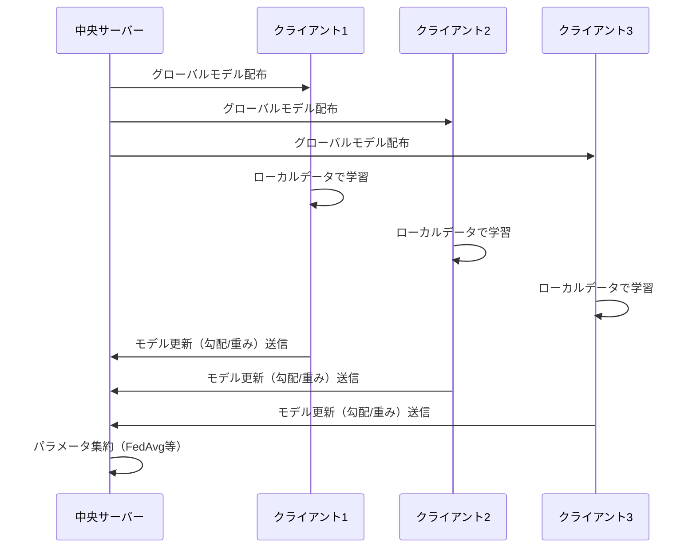

# 連合学習×LLM時代の到来：Federated Learningの実装と運用2026

## この記事でわかること

- 2025〜2026年の連合学習（Federated Learning）における**5つの主要トレンド**と技術的進展
- **FedLLM**（連合学習×大規模言語モデル）でLoRAを使ったプライバシー保護ファインチューニングの仕組み
- **Flower**フレームワークを用いた連合学習の実装手順と動作するコード例
- FedAvg・FedProx・SCAFFOLDの**アルゴリズム比較**と使い分けの判断基準
- 差分プライバシー（DP）とセキュアアグリゲーションによる**プライバシー保護の実践**

## 対象読者

- **想定読者**: 中級者〜上級者の機械学習エンジニア・データサイエンティスト
- **必要な前提知識**:
  - Python 3.10以降の基礎文法
  - PyTorchの基本的なモデル学習の流れ（`nn.Module`、`DataLoader`）
  - 機械学習における学習・評価の基本概念（損失関数、勾配降下法）
  - LoRA（Low-Rank Adaptation）の概要（知らなくても記事内で解説）

## 結論・成果

連合学習は2025〜2026年にかけて、LLMとの統合（FedLLM）により大きな転換期を迎えています。LoRAベースのパラメータ効率的ファインチューニング（Fed-PEFT）により、通信コストを**従来比で約97%削減**しながらプライバシーを保護した協調学習が可能になっています。Flowerフレームワーク（GitHub Stars 6,600+）とNVIDIA FLAREの統合により、プロトタイピングからプロダクション展開までのパスが整備されつつあります。一方で、医療分野での臨床デプロイ到達率はわずか**5.2%**にとどまっており、実用化にはまだ課題が残っています。

> **関連記事**: 連合学習を含むML全体のトレンドについては「[生成AI以外で注目すべき機械学習6大トレンド【2026年版】](https://zenn.dev/0h_n0/articles/0a6f42fd03cd77)」もあわせてご覧ください。

## 連合学習の基本アーキテクチャを理解する

連合学習（Federated Learning, FL）は、複数のクライアント（デバイスや組織）が自身のデータをローカルに保持したまま、モデルのパラメータのみを中央サーバーで集約して学習する分散学習パラダイムです。2017年にGoogleがモバイルキーボード予測で導入して以来、プライバシー規制（GDPR、HIPAA）の強化とともに急速に発展しています。

### 連合学習の処理フロー

連合学習の1ラウンドは以下の流れで進行します。



### Cross-SiloとCross-Deviceの違い

連合学習には2つの主要な設定があります。用途に応じて適切な設定を選ぶことが重要です。

| 特性 | Cross-Silo | Cross-Device |
|------|-----------|-------------|
| クライアント数 | 少数（2〜100組織） | 大量（数百万デバイス） |
| データ量/クライアント | 大（病院、銀行のDB） | 小（スマートフォン1台分） |
| 通信安定性 | 高（常時接続） | 低（断続的接続） |
| 代表的ユースケース | 医療画像解析、金融不正検知 | キーボード予測、音声認識 |
| 主要フレームワーク | NVIDIA FLARE | Flower, TFF |

**注意点:**
> Cross-Device設定ではクライアントの離脱・遅延が頻繁に発生するため、非同期集約やクライアント選択戦略が必要です。Cross-Silo設定でも、組織間のデータ分布の偏り（non-IID）が精度低下の原因になります。

## 2025〜2026年の5大トレンドを把握する

連合学習は近年、特に以下の5つの方向で急速に進展しています。

### トレンド1: FedLLM（連合学習×大規模言語モデル）

2025〜2026年における最大のトレンドは、連合学習と大規模言語モデル（LLM）の統合です。複数の組織が保有するプライベートデータでLLMをファインチューニングしたい場合、データを1か所に集約することはプライバシーの観点から困難です。FedLLMは、各クライアントがローカルデータでLLMを微調整し、更新パラメータのみをサーバーで集約することでこの問題を解決します。

arXiv:2503.12016のサーベイ（TMLR 2026採択）によると、FedLLMの中核はFed-PEFT（Federated Parameter-Efficient Fine-Tuning）です。特にLoRA（Low-Rank Adaptation）ベースの手法が主流で、全パラメータの1〜3%のみを更新することで通信コストを大幅に削減します。

**主なFed-LoRA手法の比較:**

| 手法名 | 特徴 | 対処する課題 |
|--------|------|-------------|
| FFA-LoRA | 凍結Aマトリクス、Bのみ集約 | 集約ノイズ低減 |
| LoRA-FAIR | 集約・初期化の改善（ICCV 2025） | 知識汚染の防止 |
| RoLoRA | 交互最適化でLoRAアダプタ調整 | ロバスト性向上 |
| FedSA-LoRA-DP | 選択的LoRA + 差分プライバシー | プライバシー保護 |

**よくある間違い**: LLMの全パラメータをFedAvgで集約しようとすると、70億パラメータモデルで1ラウンドあたり約28GBの通信が必要になります。LoRAを使えば更新パラメータは数MBに抑えられますが、LoRAのランク（$r$）の設定によって精度と通信量のトレードオフが生じます。一般的に $r = 8$ から $r = 64$ の範囲で選択し、データの異質性が高い場合はランクを高めに設定することが推奨されています。

### トレンド2: フレームワークの成熟と統合

連合学習のフレームワークは、研究用とプロダクション用の統合が進んでいます。

**Flower**（GitHub Stars 6,600+、コントリビューター170+）は、研究者にとって最も人気のあるFLフレームワークです。PyTorch、TensorFlow、HuggingFace、JAX、scikit-learn、XGBoostと統合可能で、2026年4月にはロンドンでFlower AI Summit 2026の開催が予定されています。最新のFlower Intelligenceでは、オンデバイスAIとConfidential Remote Computeをサポートしています。

**NVIDIA FLARE**はエンタープライズ向けのFLランタイムで、FedAvg、FedOpt、FedProxなどの集約アルゴリズムを標準搭載しています。American College of Radiology、Deloitte、Microsoft Azure、MGH（マサチューセッツ総合病院）などが採用しています。

2024年後半からFlowerとNVIDIA FLAREの統合が進み、FlowerのServerApp/ClientAppをFLARE上で直接実行できるようになっています。これにより、Flowerでのプロトタイピング→NVIDIA FLAREでのプロダクション展開というスムーズな移行パスが確立されつつあります。

**制約条件:** FlowerとNVIDIA FLAREの統合はまだ成熟段階にあり、すべてのFLAREの機能がFlower経由で利用できるわけではありません。特にカスタムのセキュリティプロビジョニングやSSL証明書管理はFLARE固有の設定が必要です。

### トレンド3: プライバシー保護技術の高度化

連合学習自体がプライバシー保護の仕組みですが、モデル更新からの情報漏洩リスク（勾配反転攻撃など）に対処するため、追加のプライバシー保護技術が不可欠です。2025〜2026年の主要な3つの手法を見ていきましょう。

**差分プライバシー（Differential Privacy, DP）:** モデル更新にキャリブレーションされたノイズを付加し、個々のデータポイントの影響を統計的に保証する手法です。プライバシーバジェット $\varepsilon$ を設定し、$\varepsilon$ が小さいほど強いプライバシー保護を提供しますが、モデル精度とのトレードオフがあります。

**セキュアアグリゲーション（Secure Aggregation, SA）:** 暗号技術を用いて、サーバーが個々のクライアント更新を見ることなく集約結果のみを得る手法です。Googleの研究では、1,000クライアント規模でもオーバーヘッドを10%以下に抑えた実装が報告されています。

**準同型暗号（Homomorphic Encryption, HE）:** 暗号化されたまま演算を行う手法で、最も強力なプライバシー保護を提供しますが、計算コストが通常の100〜10,000倍と高いことが課題です。

FedSA-LoRA-DPフレームワークの実験では、CIFAR-100、MNIST、SVHNデータセットにおいて、差分プライバシーを適用してもnon-IIDデータかつ部分参加条件下で非プライベート版と同等の精度を達成したと報告されています。

### トレンド4: 医療・金融での実用化進展

連合学習の応用分野として、医療と金融が最も活発です。

**医療分野**: Springer Nature（2025年）のシステマティックレビューによると、医療画像解析がFL研究全体の**41.7%**を占めています。複数病院間での脳腫瘍セグメンテーション、マンモグラフィーからのがん検出、胸部X線からの肺疾患分類などで、単一施設モデルよりも高い汎化性能が報告されています。

一方で、臨床デプロイに到達したFL研究はわずか**5.2%**にとどまっています。この「ラストマイルギャップ」の主因は、技術メトリクス重視のFL評価と、バリューベースドヘルスケアの優先事項とのミスアラインメントです。データハーモナイゼーション（異なるソースからのデータの互換性確保）が最大の技術課題とされています。

**金融分野**: 複数の金融機関が顧客取引データを共有せずに不正検知モデルを共同学習するユースケースが拡大しています。差分プライバシーと準同型暗号を組み合わせた信用リスクモデルの研究（Scientific Reports, 2025）では、Standard FL、DP-FL、HE-FLの3構成を比較評価しています。

**ハマりポイント**: 医療分野では、DICOMなどの標準フォーマットが存在するため画像データの連合学習は比較的実施しやすいですが、電子カルテ（EHR）データでは施設ごとのコーディング体系の違いが大きな障壁になります。事前のデータ標準化なしにFLを適用すると、モデルが特定施設のコーディングパターンに過学習するリスクがあります。

### トレンド5: ブロックチェーン・量子連合学習の萌芽

新しいパラダイムとして、ブロックチェーンベースの連合学習と量子連合学習が注目されています。

**ブロックチェーンFL**: 遺伝的アルゴリズムによるハイパーパラメータ最適化とブロックチェーンによる改ざん防止集約を統合したフレームワークが提案されています（Scientific Reports, 2025）。non-IID条件下での安定収束を実現しつつ、検証可能なモデル集約を提供します。

**量子連合学習**: Flowerフレームワークが2025年11月に量子連合学習のサポートを発表しました。各クライアントがハイブリッド量子-古典モデルをローカルで学習し、サーバーがFlowerのアグリゲーション戦略で更新を集約する構成です。

> これらの技術はまだ研究段階であり、プロダクション環境での実用例は限られています。特に量子連合学習は、現在のNISQ（Noisy Intermediate-Scale Quantum）デバイスの制約により、大規模な実問題への適用は困難な状況です。

## Flowerで連合学習を実装する

実際にFlowerフレームワークを使って連合学習を実装してみましょう。ここではPyTorchと組み合わせた画像分類タスクの例を示します。

### 環境構築

```bash
# Python 3.10以降を推奨
pip install flwr[simulation] torch torchvision
```

### サーバー側の実装

まず、集約戦略を定義するサーバーを実装します。

```python
# server.py
import flwr as fl
from flwr.server.strategy import FedAvg

def weighted_average(metrics):
    """クライアントから集めた評価指標の加重平均を計算"""
    accuracies = [num_examples * m["accuracy"] for num_examples, m in metrics]
    examples = [num_examples for num_examples, _ in metrics]
    return {"accuracy": sum(accuracies) / sum(examples)}

# FedAvg戦略の設定
strategy = FedAvg(
    fraction_fit=0.5,           # 各ラウンドで50%のクライアントを選択
    fraction_evaluate=0.5,      # 評価にも50%のクライアントを使用
    min_fit_clients=2,          # 最低2クライアントで学習
    min_evaluate_clients=2,     # 最低2クライアントで評価
    min_available_clients=3,    # 最低3クライアントが利用可能
    evaluate_metrics_aggregation_fn=weighted_average,
)

# サーバー起動
fl.server.start_server(
    server_address="0.0.0.0:8080",
    config=fl.server.ServerConfig(num_rounds=5),
    strategy=strategy,
)
```

### クライアント側の実装

次に、ローカルデータで学習するクライアントを実装します。

```python
# client.py
import flwr as fl
import torch
import torch.nn as nn
from torch.utils.data import DataLoader
from torchvision import datasets, transforms
from collections import OrderedDict

class SimpleCNN(nn.Module):
    """CIFAR-10用の簡易CNNモデル"""
    def __init__(self):
        super().__init__()
        self.conv1 = nn.Conv2d(3, 32, 3, padding=1)
        self.conv2 = nn.Conv2d(32, 64, 3, padding=1)
        self.pool = nn.MaxPool2d(2, 2)
        self.fc1 = nn.Linear(64 * 8 * 8, 128)
        self.fc2 = nn.Linear(128, 10)
        self.relu = nn.ReLU()

    def forward(self, x):
        x = self.pool(self.relu(self.conv1(x)))
        x = self.pool(self.relu(self.conv2(x)))
        x = x.view(-1, 64 * 8 * 8)
        x = self.relu(self.fc1(x))
        return self.fc2(x)


class FlowerClient(fl.client.NumPyClient):
    """Flowerクライアント: ローカルデータで学習・評価を実行"""
    def __init__(self, model, trainloader, testloader, device):
        self.model = model
        self.trainloader = trainloader
        self.testloader = testloader
        self.device = device

    def get_parameters(self, config):
        """モデルパラメータをNumPy配列のリストとして返す"""
        return [val.cpu().numpy() for _, val in self.model.state_dict().items()]

    def set_parameters(self, parameters):
        """サーバーから受信したパラメータでモデルを更新"""
        params_dict = zip(self.model.state_dict().keys(), parameters)
        state_dict = OrderedDict({k: torch.tensor(v) for k, v in params_dict})
        self.model.load_state_dict(state_dict, strict=True)

    def fit(self, parameters, config):
        """ローカルデータで学習を実行"""
        self.set_parameters(parameters)
        self.model.train()
        optimizer = torch.optim.SGD(self.model.parameters(), lr=0.01, momentum=0.9)
        criterion = nn.CrossEntropyLoss()

        for _ in range(1):  # ローカルエポック数=1
            for images, labels in self.trainloader:
                images, labels = images.to(self.device), labels.to(self.device)
                optimizer.zero_grad()
                loss = criterion(self.model(images), labels)
                loss.backward()
                optimizer.step()

        return self.get_parameters(config={}), len(self.trainloader.dataset), {}

    def evaluate(self, parameters, config):
        """テストデータで評価を実行"""
        self.set_parameters(parameters)
        self.model.eval()
        criterion = nn.CrossEntropyLoss()
        correct, total, loss = 0, 0, 0.0

        with torch.no_grad():
            for images, labels in self.testloader:
                images, labels = images.to(self.device), labels.to(self.device)
                outputs = self.model(images)
                loss += criterion(outputs, labels).item()
                _, predicted = outputs.max(1)
                total += labels.size(0)
                correct += predicted.eq(labels).sum().item()

        accuracy = correct / total
        return float(loss), total, {"accuracy": accuracy}
```

### シミュレーションでの実行

Flowerのシミュレーション機能を使えば、1台のマシンで複数クライアントをエミュレートできます。

```python
# simulation.py
import flwr as fl
from flwr.simulation import start_simulation
import torch
from torchvision import datasets, transforms
from torch.utils.data import DataLoader, random_split

def client_fn(cid: str):
    """クライアントID(cid)に応じたクライアントを生成"""
    device = torch.device("cuda" if torch.cuda.is_available() else "cpu")
    model = SimpleCNN().to(device)

    # CIFAR-10をクライアント数で分割（non-IIDシミュレーション）
    transform = transforms.Compose([
        transforms.ToTensor(),
        transforms.Normalize((0.5, 0.5, 0.5), (0.5, 0.5, 0.5)),
    ])
    dataset = datasets.CIFAR10(root="./data", train=True, download=True, transform=transform)
    testset = datasets.CIFAR10(root="./data", train=False, download=True, transform=transform)

    # 各クライアントにデータの一部を割り当て
    num_clients = 5
    partition_size = len(dataset) // num_clients
    lengths = [partition_size] * num_clients
    lengths[-1] += len(dataset) - sum(lengths)  # 端数処理
    partitions = random_split(dataset, lengths)

    trainloader = DataLoader(partitions[int(cid)], batch_size=32, shuffle=True)
    testloader = DataLoader(testset, batch_size=32)

    return FlowerClient(model, trainloader, testloader, device).to_client()

# シミュレーション実行
start_simulation(
    client_fn=client_fn,
    num_clients=5,
    config=fl.server.ServerConfig(num_rounds=10),
    strategy=FedAvg(
        fraction_fit=0.6,
        min_fit_clients=3,
        min_available_clients=5,
    ),
)
```

**なぜFlowerを選んだか:**
- **簡潔なAPI**: `NumPyClient`を継承するだけでクライアント実装が完了
- **シミュレーション機能**: `start_simulation`でGPU1台からスケールアウトまで対応
- **フレームワーク非依存**: PyTorch、TensorFlow、JAXいずれも利用可能

**注意点:**
> 上記のデータ分割は均等（IID）です。実際の連合学習ではクライアント間のデータ分布が異なる（non-IID）ため、Dirichlet分布（$\alpha = 0.5$程度）を用いた不均衡分割でテストすることを推奨します。non-IIDデータでは精度が10〜30%低下する場合があり、FedProxやSCAFFOLDなどの対策アルゴリズムが必要になります。

## 集約アルゴリズムを比較・選択する

連合学習の精度は集約アルゴリズムの選択に大きく依存します。主要な4つのアルゴリズムの特徴と使い分けを整理します。

### FedAvg: 通信効率重視の基本アルゴリズム

FedAvg（Federated Averaging）は、各クライアントでSGDを複数ステップ実行し、その結果得られたモデルパラメータをデータ量で加重平均する手法です。

集約の式は以下の通りです。

$$
w_{t+1} = \sum_{k=1}^{K} \frac{n_k}{n} w_{t+1}^k
$$

ここで $w_{t+1}^k$ はクライアント $k$ のローカル学習後のモデルパラメータ、$n_k$ はクライアント $k$ のデータ数、$n$ は全データ数です。

通信量は1ラウンドあたり約**8.5MB**（ResNetクラスのモデル）と最小で、リソース制約のあるデバイスに適しています。

### FedProx: non-IIDデータへの対応

FedProxは、ローカル学習時に「グローバルモデルから離れすぎない」ように近接項（proximal term）を追加します。

$$
\min_{w} F_k(w) + \frac{\mu}{2} \| w - w_t \|^2
$$

$\mu$ はペナルティ係数で、大きいほどグローバルモデルに近い更新を強制します。non-IIDデータ環境でFedAvgより安定した収束を示しますが、$\mu$ のチューニングが必要で、FedAvgより収束速度が遅くなる傾向があります。

### SCAFFOLD: クライアントドリフトの補正

SCAFFOLDは制御変量（control variates）を使ってクライアントドリフトを補正します。各クライアントが自身の勾配のバイアスを追跡し、サーバーで補正することで、FedAvgより高速な収束を実現します。

ただし、制御変量の通信が追加されるため、通信コストはFedAvgの約2倍になります。また、クラス不均衡が大きいnon-IIDデータでは精度の分散が大きくなる傾向が報告されています。

### アルゴリズム選択のガイドライン

| 条件 | 推奨アルゴリズム | 理由 |
|------|----------------|------|
| IIDデータ、通信制約大 | FedAvg | 通信量最小、十分な精度 |
| non-IIDデータ、安定性重視 | FedProx | 近接項でドリフト抑制 |
| non-IIDデータ、収束速度重視 | SCAFFOLD | 制御変量で高速収束 |
| LLMファインチューニング | FedAvg + LoRA | 通信量を大幅削減可能 |

**トレードオフ**: SCAFFOLDは収束速度では優位ですが、通信量が2倍になります。帯域幅が限られる環境では、FedProxの方が実用的な選択になる場合があります。

## 差分プライバシーを連合学習に組み込む

連合学習だけではモデル更新からのプライバシー漏洩を完全には防げません。差分プライバシー（DP）を組み込む実装例を示します。

### DPの基本概念

$(\varepsilon, \delta)$-差分プライバシーは、1つのデータポイントの有無が出力分布に与える影響を数学的に制限します。

$$
\Pr[\mathcal{M}(D) \in S] \leq e^{\varepsilon} \cdot \Pr[\mathcal{M}(D') \in S] + \delta
$$

ここで $\mathcal{M}$ はメカニズム（学習アルゴリズム）、$D$ と $D'$ は1つのデータポイントだけ異なるデータセット、$\varepsilon$ はプライバシーバジェット、$\delta$ は失敗確率です。

### Opacusを使ったDP-FL実装

PyTorchの差分プライバシーライブラリOpacusを使った実装例です。

```python
# dp_client.py
from opacus import PrivacyEngine

class DPFlowerClient(fl.client.NumPyClient):
    """差分プライバシー付きFlowerクライアント"""
    def __init__(self, model, trainloader, testloader, device,
                 target_epsilon=8.0, target_delta=1e-5, max_grad_norm=1.0):
        self.model = model
        self.trainloader = trainloader
        self.testloader = testloader
        self.device = device
        self.target_epsilon = target_epsilon
        self.target_delta = target_delta
        self.max_grad_norm = max_grad_norm

    def fit(self, parameters, config):
        self.set_parameters(parameters)
        self.model.train()

        optimizer = torch.optim.SGD(self.model.parameters(), lr=0.01)
        criterion = nn.CrossEntropyLoss()

        # Opacus PrivacyEngineの設定
        # 勾配クリッピング + ガウシアンノイズ付加
        privacy_engine = PrivacyEngine()
        model, optimizer, trainloader = privacy_engine.make_private_with_epsilon(
            module=self.model,
            optimizer=optimizer,
            data_loader=self.trainloader,
            epochs=1,
            target_epsilon=self.target_epsilon,
            target_delta=self.target_delta,
            max_grad_norm=self.max_grad_norm,  # ← 勾配のL2ノルムをクリップ
        )

        for images, labels in trainloader:
            images, labels = images.to(self.device), labels.to(self.device)
            optimizer.zero_grad()
            loss = criterion(model(images), labels)
            loss.backward()
            optimizer.step()

        # 消費したプライバシーバジェットを確認
        epsilon = privacy_engine.get_epsilon(delta=self.target_delta)
        print(f"消費プライバシーバジェット: ε = {epsilon:.2f}")

        return self.get_parameters(config={}), len(self.trainloader.dataset), {"epsilon": epsilon}
```

**なぜOpacusを選んだか:**
- PyTorchネイティブで、既存コードへの変更が最小限
- `make_private_with_epsilon`で目標 $\varepsilon$ から自動的にノイズ量を算出
- Renyi DPによるプライバシー会計を内蔵

**注意点:**
> `target_epsilon`を小さく設定しすぎると（例: $\varepsilon < 1$）、モデル精度が大幅に低下します。実用的には $\varepsilon = 4 \sim 10$ の範囲が一般的です。また、`max_grad_norm`（勾配クリッピング閾値）が小さすぎると学習が進まず、大きすぎるとプライバシー保護が弱まるため、データセットに応じたチューニングが必要です。

## よくある問題と解決方法

| 問題 | 原因 | 解決方法 |
|------|------|----------|
| non-IIDデータで精度が低い | クライアント間のデータ分布の偏り | FedProx（$\mu = 0.01$）やSCAFFOLDに切り替え |
| 通信コストが高すぎる | モデルサイズが大きい | LoRA、勾配圧縮、Top-K Sparsificationの適用 |
| クライアントの離脱で学習が停止 | Cross-Device設定での接続不安定 | 非同期集約、タイムアウト設定の調整 |
| DPノイズによる精度低下 | $\varepsilon$ の設定が厳しすぎる | $\varepsilon$ を緩和（4〜10推奨）または FedSA-LoRA-DPの採用 |
| 勾配反転攻撃によるデータ漏洩 | モデル更新からの推測 | セキュアアグリゲーション + DPの併用 |
| 収束が遅い | ローカルエポック数とラウンド数の不均衡 | ローカルエポック数を増やし（3〜5）、学習率を調整 |

## まとめと次のステップ

**まとめ:**

- **FedLLM**がFLの最大のトレンドであり、LoRAベースのFed-PEFTにより通信コスト約97%削減が可能
- **Flower + NVIDIA FLARE**の統合により、プロトタイプからプロダクションへの移行パスが整備されつつある
- **プライバシー保護**は差分プライバシー + セキュアアグリゲーションの組み合わせが標準的なアプローチに
- 医療分野ではFL研究の**41.7%**を占めるが、臨床デプロイは**5.2%**にとどまり「ラストマイルギャップ」が課題
- ブロックチェーンFL・量子FLなどの新パラダイムは研究段階だが、今後の発展に期待

**次にやるべきこと:**

- [Flower公式チュートリアル](https://flower.ai/docs/framework/tutorial-quickstart-pytorch.html)でPyTorch×FLの基本を手を動かして学ぶ
- non-IIDデータ分割（Dirichlet分布 $\alpha = 0.5$）でFedAvg vs FedProxの精度差を実験する
- 自社データでのFL適用可能性を評価する際は、まずデータ分布の偏りの度合いを定量化する

## 参考

- [A Survey on Federated Fine-tuning of Large Language Models (arXiv:2503.12016)](https://arxiv.org/abs/2503.12016) - FedLLMの包括的サーベイ（TMLR 2026採択）
- [Flower: A Friendly Federated AI Framework](https://flower.ai/) - Flowerフレームワーク公式サイト
- [NVIDIA FLARE](https://developer.nvidia.com/flare) - NVIDIA FLAREフレームワーク公式
- [Supercharging Federated Learning with Flower and NVIDIA FLARE (arXiv:2407.00031)](https://arxiv.org/abs/2407.00031) - Flower×FLARE統合論文
- [Advancements and challenges of federated learning in medical imaging (Springer, 2025)](https://link.springer.com/article/10.1007/s10462-025-11489-z) - 医療画像FLのシステマティックレビュー
- [Benchmarking FL Frameworks for Medical Imaging (arXiv:2511.00037)](https://arxiv.org/abs/2511.00037) - NVIDIA FLARE・Flower・Substraのベンチマーク比較
- [Deep federated learning: methods, applications, and challenges (Frontiers, 2025)](https://www.frontiersin.org/journals/computer-science/articles/10.3389/fcomp.2025.1617597/full) - FL手法の体系的レビュー
- [LoRA-FAIR: Federated LoRA Fine-Tuning (ICCV 2025)](https://arxiv.org/abs/2411.14961) - Fed-LoRAの集約・初期化改善手法
- [Flower AI Summit 2026](https://federated-learning.org/fl@fm-www-2026/) - 2026年4月ロンドン開催

---

:::message
この記事はAI（Claude Code）により自動生成されました。内容の正確性については複数の情報源で検証していますが、実際の利用時は公式ドキュメントもご確認ください。
:::
