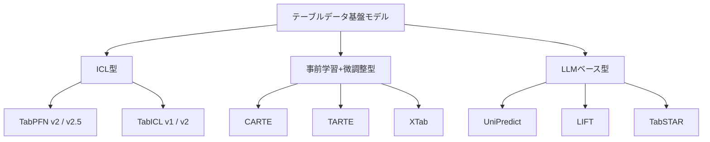
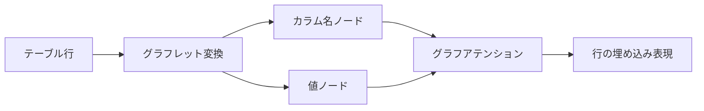
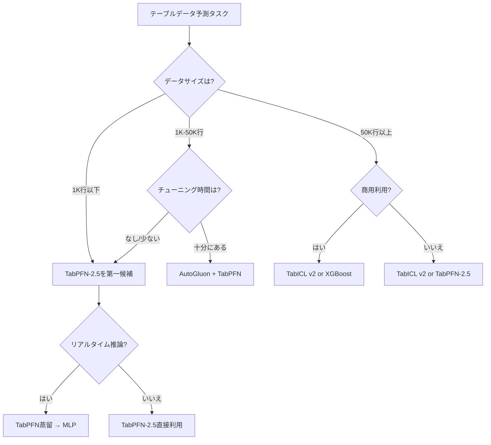

# テーブルデータ基盤モデル2026年最前線：TabPFN-2.5・TabICL v2・TabArenaで変わる構造化データ予測

## この記事でわかること

- テーブルデータ基盤モデル（Tabular Foundation Model: TFM）の全体像と2025-2026年の主要モデル比較
- TabPFN-2.5がXGBoostに対して100% win rateを達成した仕組みと適用条件
- TabICL v2のオープンソース戦略とTabPFN比10倍の高速化の背景
- TabArenaベンチマークが示す「勾配ブーストツリー vs 基盤モデル」の現在地
- 実務でTFMを導入する際の判断フレームワークと制約条件

## 対象読者

- **想定読者**: 中級〜上級のデータサイエンティスト・MLエンジニア
- **必要な前提知識**:
  - XGBoost / LightGBM / CatBoostの基本的な利用経験
  - Pythonでの機械学習パイプライン構築経験
  - Transformerアーキテクチャの基本概念

## 結論・成果

テーブルデータ基盤モデルは2025-2026年に大きく進展しました。TabPFN-2.5はTabArenaベンチマークにおいて、チューニング済みXGBoost・CatBoostを上回り、4時間チューニングされたAutoGluon 1.4と同等の精度を**1回のフォワードパス**で達成したと報告されています。一方、TabICL v2はオープンソース（MIT License）で提供され、大規模データセットにおいてTabPFN-2.5比で約10倍の推論速度を実現したとされています。

ただし、**10万サンプル以上の大規模データや高次元特徴量**ではGBDT（勾配ブースト決定木）が依然として有力な選択肢であり、TFMが万能というわけではありません。本記事では、各モデルの特性・ベンチマーク結果・制約条件を整理し、実務での使い分けを解説します。

## テーブルデータ基盤モデルの全体像を理解する

### なぜテーブルデータに基盤モデルが必要なのか

テーブルデータ（構造化データ）は、金融・医療・製造業など実務の大部分を占めるデータ形式です。しかし、NLPや画像認識の分野でTransformerベースの基盤モデルが成功を収めた一方、テーブルデータでは2024年まで**XGBoost・LightGBM等の勾配ブースト決定木（GBDT）が依然として主流**でした。

テーブルデータ固有の課題として、以下の3点が挙げられます。

- **スキーマの多様性**: データセットごとにカラム名・データ型・カラム数が異なるため、単一のモデルで汎化することが困難
- **数値表現の難しさ**: テキストトークンと異なり、連続値の大小関係・スケールをTransformerで適切にエンコードする方法が確立されていなかった
- **小〜中規模データの多さ**: 実務のテーブルデータは数百〜数万行が一般的であり、大規模事前学習のメリットを活かしにくい

これらの課題に対し、2022年のTabPFN v1を皮切りに、**In-Context Learning（ICL）** を活用したテーブルデータ基盤モデルが急速に発展しました。

### テーブルデータ基盤モデルの分類

2026年3月時点で、TFMは大きく3つのアプローチに分類できます。



| アプローチ | 代表モデル | 学習データ | 推論方法 | スケーラビリティ |
|-----------|-----------|-----------|---------|----------------|
| ICL型 | TabPFN-2.5, TabICL v2 | 合成データで事前学習 | コンテキスト内学習 | 〜50K行（TabPFN）、〜500K行（TabICL） |
| 事前学習+微調整型 | CARTE, TARTE, XTab | 実テーブルデータで事前学習 | 微調整が必要 | データセット依存 |
| LLMベース型 | UniPredict, LIFT | テキスト化したテーブルで学習 | プロンプトベース | LLMのコンテキスト長に依存 |

**ICL型**はファインチューニング不要で即座に予測を返せる点が強みです。一方、**事前学習+微調整型**はカラム間のセマンティクスを活用できる点、**LLMベース型**はテキスト情報との統合が容易な点がそれぞれの特徴です。

### 主要モデルの時系列

2022年のTabPFN v1から2026年のTabICL v2まで、主要モデルのリリースを時系列で整理します。

| 年月 | モデル | 主な進展 |
|------|--------|---------|
| 2022年6月 | TabPFN v1 | ICLでテーブル予測を実現（1K行制限） |
| 2023年7月 | XTab | クロステーブル事前学習（ICML 2023） |
| 2024年2月 | CARTE | グラフ表現によるテーブル転移学習 |
| 2025年1月 | TabPFN v2 | Nature掲載、10K行対応 |
| 2025年5月 | TARTE | セマンティック知識事前学習 |
| 2025年6月 | TabArena | 初のliving benchmark公開 |
| 2025年11月 | TabPFN-2.5 | 50K行・2K特徴量対応 |
| 2026年初頭 | TabICL v2 | 500K行対応、10倍高速化 |

次のセクションから、各主要モデルの技術的詳細とベンチマーク結果を見ていきます。

## TabPFN-2.5の技術とベンチマーク結果を検証する

### In-Context Learningの仕組み

TabPFN（Prior-Data Fitted Network）は、**合成データセットで事前学習したTransformer**がテスト時にファインチューニングなしで予測を行うモデルです。通常の機械学習では学習データでモデルを訓練しますが、TabPFNでは学習データをコンテキストとしてTransformerに入力し、1回のフォワードパスで予測を得ます。

この仕組みの数学的な背景は**ベイズ推論の近似**です。TabPFNは以下の事後予測分布を近似します。

$$
p(y_{\text{test}} | x_{\text{test}}, \mathcal{D}_{\text{train}}) = \int p(y_{\text{test}} | x_{\text{test}}, \theta) \, p(\theta | \mathcal{D}_{\text{train}}) \, d\theta
$$

ここで $\mathcal{D}_{\text{train}}$ は学習データ、$\theta$ はモデルパラメータです。従来のモデルが点推定（$\hat{\theta}$）を求めるのに対し、TabPFNはパラメータ空間全体を積分する**ベイズ的予測**をTransformerで近似しています。

### TabPFN-2.5の主な改善点

TabPFN-2.5は先行バージョン（v2）から以下の改善を行ったと報告されています。

| 項目 | TabPFN v2 | TabPFN-2.5 | 改善倍率 |
|------|-----------|------------|---------|
| 最大データポイント数 | 10,000 | 50,000 | 5倍 |
| 最大特徴量数 | 500 | 2,000 | 4倍 |
| 最大データセル数 | 500万 | 1億 | 20倍 |

加えて、**蒸留エンジン**が新たに搭載されました。これはTabPFN-2.5の予測をコンパクトなMLPやツリーアンサンブルに変換する機能で、本番デプロイ時のレイテンシを大幅に削減できるとされています。

### ベンチマーク結果の詳細

PriorLabsの技術レポートによると、TabArena-liteベンチマーク（分類タスク）での結果は以下のとおりです。

**小〜中規模データセット（10,000行以下、500特徴量以下）:**

- TabPFN-2.5 vs デフォルトXGBoost: **100% win rate**
- TabPFN-2.5 vs チューニング済みXGBoost: 大幅に優位

**大規模データセット（〜100K行、2K特徴量）:**

- TabPFN-2.5 vs デフォルトXGBoost: **87% win rate**（分類）、**85%**（回帰）
- TabPFN-2.5 vs AutoGluon 1.4（4時間チューニング）: 同等の精度

```python
# TabPFN-2.5の基本的な使用例
# pip install tabpfn
from tabpfn import TabPFNClassifier
from sklearn.model_selection import train_test_split
from sklearn.datasets import load_breast_cancer

# データ準備
X, y = load_breast_cancer(return_X_y=True)
X_train, X_test, y_train, y_test = train_test_split(
    X, y, test_size=0.2, random_state=42
)

# TabPFN-2.5で予測（ファインチューニング不要）
clf = TabPFNClassifier()
clf.fit(X_train, y_train)  # コンテキストとして保持
predictions = clf.predict(X_test)
probabilities = clf.predict_proba(X_test)

print(f"Accuracy: {(predictions == y_test).mean():.4f}")
```

**なぜこのアプローチが有効か:**

- ハイパーパラメータチューニングが不要（XGBoostでは`n_estimators`、`max_depth`、`learning_rate`等の調整が必要）
- 小〜中規模データでは、ベイズ的な不確実性推定によりオーバーフィットを抑制
- scikit-learn互換APIで既存パイプラインに統合しやすい

**注意点:**
> TabPFN-2.5の学習済み重みの一部（RealTabPFN）は**非商用ライセンス**で提供されています。商用利用を検討する場合はPriorLabsのライセンス条件を必ず確認してください。また、50,000行を超えるデータセットでは性能が低下する可能性があります。

## TabICL v2とCARTEの特徴を比較する

### TabICL v2: オープンソースの高速TFM

TabICL（Tabular In-Context Learning）は、TabPFNと同じくICL型のTFMですが、異なる設計思想で開発されています。フランスのINRIA（Soda チーム）が開発し、**MIT License**で完全オープンソースとして公開されています。

TabICL v2の主な特徴は以下のとおりです。

| 特性 | TabPFN-2.5 | TabICL v2 |
|------|-----------|-----------|
| 最大サンプル数 | 50,000 | 約500,000 |
| ライセンス | 一部非商用 | MIT License |
| 大規模データ速度 | 基準 | 約10倍高速 |
| メモリ管理 | GPU VRAM依存 | CPU/ディスクオフロード対応 |
| 事前学習データ | 合成データ | 合成データ（300〜48K行） |

TabICL v2が大規模データで高速な理由は、CPUとディスクへのオフロード機構です。GPU RAMに収まらないデータセットでも、100万サンプル規模をメモリオーバーフローなしで処理できるとされています。

```python
# TabICL v2の基本的な使用例
# pip install tabicl
from tabicl import TabICLClassifier
from sklearn.model_selection import train_test_split
from sklearn.datasets import make_classification

# 大規模データの生成（10万行）
X, y = make_classification(
    n_samples=100_000,
    n_features=50,
    n_informative=30,
    random_state=42,
)
X_train, X_test, y_train, y_test = train_test_split(
    X, y, test_size=0.2, random_state=42
)

# TabICL v2で予測
clf = TabICLClassifier()
clf.fit(X_train, y_train)
predictions = clf.predict(X_test)

print(f"Accuracy: {(predictions == y_test).mean():.4f}")
```

**ハマりポイント:**
> TabICL v2は300〜48K行の合成データで事前学習されているため、**48Kを大幅に超えるデータセット**では汎化性能にばらつきが出る可能性があります。著者らは600Kサンプルのデータセットでも良好な結果が得られるケースがあると報告していますが、保証はされていません。

### CARTE: グラフ表現によるテーブル転移学習

CARTE（Context Aware Representation of Table Entries）は、ICL型とは異なるアプローチを採用しています。テーブルの各行を**グラフ構造（グラフレット）** に変換し、カラム名と値のセマンティクスをグラフアテンションネットワークで学習します。



CARTEの特徴は、**スキーマの異なるテーブル間での転移学習**が可能な点です。カラム名の対応関係（スキーママッチング）が不要で、カラム名の文字列埋め込みによってオープンボキャブラリを実現しています。

**CARTEが有効なケース:**
- カラム名にドメイン知識が豊富に含まれるデータセット（例: 医療データの検査項目名）
- 異なるスキーマを持つ複数テーブル間での転移学習
- テキスト列と数値列が混在するデータセット

**CARTEの制約:**
- 大規模データセットではICL型（TabPFN, TabICL）より推論コストが高い
- グラフ構造への変換オーバーヘッドがある
- 事前学習済みモデルの再現性に関する検証が限定的

### LLMベースアプローチの現状

UniPredictやLIFTのようなLLMベースのTFMは、テーブルデータをテキストに変換してLLMに入力するアプローチです。カラム名と値を自然言語文として連結し、LLMのICL能力を利用して予測を行います。

しかし、2025年のIllusionOfGeneralization論文（arXiv:2602.04031）では、LLMベースのテーブル予測モデルの汎化能力に疑問が呈されています。ベンチマーク結果が学習データへの過適合を反映している可能性が指摘されており、**実務での採用は慎重な検証が必要**です。

| アプローチ | 精度（小データ） | 精度（大データ） | 推論速度 | 商用利用 |
|-----------|-----------------|-----------------|---------|---------|
| TabPFN-2.5 | 高い | 中〜高 | 中 | 一部制限あり |
| TabICL v2 | 中〜高 | 中〜高 | 高 | MIT License |
| CARTE | 中 | 中 | 低 | 要確認 |
| UniPredict（LLM型） | 低〜中 | 低 | 低 | LLM依存 |
| XGBoost（参考） | 中 | 高い | 高い | Apache 2.0 |

## TabArenaベンチマークで全体像を把握する

### TabArenaとは何か

TabArena（2025年6月公開）は、Amazon Science（AutoGluonチーム）が主導する**初のliving benchmark**です。従来のテーブルデータベンチマークは静的であり、一度作成されると更新されませんでした。TabArenaは以下の問題を解決しています。

- **データセットの陳腐化**: 新たにキュレーションされたデータセットを随時追加
- **モデルの再評価**: 新バージョンがリリースされた際に再ベンチマーク
- **再現性の担保**: すべてのコードとデータが公開

TabArenaの初期リリースでは**16のテーブルモデル**が含まれています。

- **GBDTモデル**: CatBoost, LightGBM, XGBoost
- **ニューラルモデル**: RealMLP, TabM, ModernNCA
- **基盤モデル**: TabPFN v2, TabICL

### TabArenaが示す現在の構図

TabArenaのベンチマーク結果から、2025-2026年時点での構図は以下のように整理できます。

**基盤モデルが強い領域:**
- 小規模データセット（数百〜数千行）
- ハイパーパラメータチューニングを行わない場合（デフォルト設定での比較）
- 分類タスク

**GBDTが強い領域:**
- 大規模データセット（10万行以上）
- 十分なチューニング時間が確保できる場合
- 特徴量エンジニアリングが施された状態での比較

**注目すべき知見:**

TabArenaの分析によると、**モデル横断のアンサンブル**がテーブルML全体のstate-of-the-artを更新しています。つまり、TFMとGBDTを組み合わせることで、いずれか単体よりも高い精度が達成可能です。AutoGluon 1.4がTabPFN v2を内部的に含むアンサンブルとして高い精度を達成していることが、この傾向を裏付けています。

```python
# AutoGluonでTabPFNを含むアンサンブルを構築する例
# pip install autogluon.tabular
from autogluon.tabular import TabularPredictor
import pandas as pd

# データ準備
train_data = pd.read_csv("train.csv")
test_data = pd.read_csv("test.csv")

# AutoGluonで自動的に最適なアンサンブルを構築
# TabPFN v2を含む複数モデルが自動選択される
predictor = TabularPredictor(
    label="target",
    eval_metric="accuracy",
).fit(
    train_data=train_data,
    time_limit=3600,  # 1時間のチューニング
    presets="best_quality",  # TabPFNを含むアンサンブル
)

# 予測とリーダーボード表示
predictions = predictor.predict(test_data)
leaderboard = predictor.leaderboard(test_data)
print(leaderboard)
```

### レイテンシと精度のトレードオフ

2025年の研究（QuantumZeitgeist報告）では、テーブル基盤モデルが**ツリーアンサンブルの約40,000倍のレイテンシ**を要しながら、精度改善は約0.8%に留まるケースがあると指摘されています。

この点は実務で重要です。リアルタイム推論が求められるアプリケーション（例: 広告CTR予測、不正検知）では、TabPFN-2.5の蒸留エンジンでMLPやツリーアンサンブルに変換するか、LightGBMを直接使用する方が現実的な場合があります。

| ユースケース | 推奨モデル | 理由 |
|------------|-----------|------|
| Kaggleコンペ | AutoGluon + TabPFN | 精度最優先、時間制約なし |
| 小データ探索分析 | TabPFN-2.5 | チューニング不要で高精度 |
| 大規模バッチ予測 | TabICL v2 or LightGBM | スループット重視 |
| リアルタイムAPI | TabPFN蒸留 → MLP or LightGBM | レイテンシ制約 |
| 商用プロダクト | TabICL v2 or XGBoost | ライセンス・安定性重視 |

## 実務でTFMを導入する判断フレームワークを設計する

### 導入判断のフローチャート

TFMの導入を検討する際は、以下のフローチャートに沿って判断することを推奨します。



### 導入時のチェックリスト

TFMを本番環境に導入する際に確認すべき項目を整理します。

- [ ] **データサイズ**: 50K行以下か（TabPFN-2.5の制約）
- [ ] **特徴量数**: 2,000以下か（TabPFN-2.5の制約）
- [ ] **ライセンス**: 商用利用可能なモデルか（TabICL v2はMIT、RealTabPFNは非商用）
- [ ] **レイテンシ要件**: リアルタイム推論が必要か（蒸留の検討）
- [ ] **再現性**: 同一入力で同一出力が保証されるか
- [ ] **GPU依存**: GPU環境が本番で確保可能か

### よくある問題と解決方法

| 問題 | 原因 | 解決方法 |
|------|------|----------|
| TabPFNでOOMエラー | データサイズがGPU VRAMを超過 | サンプリングで50K行以下に削減、またはTabICL v2に切り替え |
| 推論速度が遅い | Transformerの推論コスト | TabPFN蒸留エンジンでMLP/ツリーに変換 |
| 精度がXGBoostに劣る | 大規模データ・高次元特徴量 | AutoGluonでアンサンブル、またはGBDTに切り替え |
| 商用利用できない | RealTabPFNの非商用ライセンス | TabICL v2（MIT）またはXGBoost（Apache 2.0）を使用 |
| 結果の再現性がない | ランダムシードの不統一 | `random_state`を明示的に固定 |

### 実験的な比較の実装例

自分のデータセットでTFMとGBDTを比較する最小限のコードを示します。

```python
# compare_models.py
# TFMとGBDTの比較パイプライン
import numpy as np
from sklearn.model_selection import cross_val_score
from sklearn.datasets import fetch_openml

# データセット取得（例: credit-g）
data = fetch_openml("credit-g", version=1, as_frame=True)
X, y = data.data, data.target

# モデル定義
models = {}

# 1. XGBoost（ベースライン）
from xgboost import XGBClassifier
models["XGBoost (default)"] = XGBClassifier(
    random_state=42,
    eval_metric="logloss",
)

# 2. TabPFN-2.5
try:
    from tabpfn import TabPFNClassifier
    models["TabPFN-2.5"] = TabPFNClassifier()
except ImportError:
    print("TabPFN not installed: pip install tabpfn")

# 3. TabICL v2
try:
    from tabicl import TabICLClassifier
    models["TabICL v2"] = TabICLClassifier()
except ImportError:
    print("TabICL not installed: pip install tabicl")

# 5-fold CVで比較
for name, model in models.items():
    scores = cross_val_score(
        model, X, y,
        cv=5,
        scoring="accuracy",
    )
    print(f"{name}: {scores.mean():.4f} (+/- {scores.std():.4f})")
```

**最初はXGBoostをベースラインとして設定し、TFMが上回るか検証する**というアプローチが推奨されます。TFMの精度がGBDTと同等以上で、かつレイテンシ・ライセンス要件を満たす場合に採用を検討してください。

## 2026年以降の展望と注意すべきトレンド

### 商用化とライセンスの動向

TFM分野では商用化が進んでいます。PriorLabs（ドイツ）、NeuralkAI（フランス）、Layer6 AI（カナダ）、Lexsi Labs（米国）などのスタートアップが台頭し、Microsoft・AWS・SAPなどの大手企業も独自モデルの開発に着手していると報告されています。

一方、RealTabPFNの重みが非商用ライセンスで提供されるなど、**オープンソースからクローズドソースへの移行**が懸念されています。商用利用を前提とする場合、TabICL v2（MIT License）やXGBoost（Apache 2.0）を選択するのが現時点では安全です。

### スケーラビリティの拡張

TabFlex（2025年）は線形アテンションを採用し、数百万サンプル規模のデータセットへの対応を目指しています。また、TabPFN-Wideは5万以上の特徴量を持つバイオメディカルデータ（ゲノムデータ等）への適用を想定しています。

### 因果推論への応用

TabPFNの埋め込み表現には因果情報が含まれることが報告されており、従来の因果発見アルゴリズムよりも優れた性能を示すケースがあるとされています。テーブルデータの予測だけでなく、因果構造の推定への応用も今後の注目領域です。

## まとめと次のステップ

**まとめ:**

- テーブルデータ基盤モデル（TFM）は2025-2026年に大きく進展し、TabPFN-2.5は50K行対応でXGBoostを小〜中規模データで上回る精度を報告
- TabICL v2はMIT Licenseのオープンソースで、大規模データにおいて約10倍の高速推論を実現
- TabArenaベンチマークが標準化され、GBDTとTFMのアンサンブルがstate-of-the-artを更新
- 大規模データ（10万行以上）ではGBDTが依然有力であり、TFMは万能ではない
- 商用利用時はライセンス確認が必須（RealTabPFNは非商用制限あり）

**次にやるべきこと:**

- 自分のデータセットで上記の比較コードを実行し、TFMとGBDTの精度差を確認する
- TabArenaの[公開リーダーボード](https://huggingface.co/spaces/TabArena/leaderboard)で最新のモデル比較結果を確認する
- 商用利用を検討する場合、TabICL v2（MIT）またはAutoGluon経由でのTabPFN利用を検証する

## 参考

- [TabPFN-2.5: Advancing the State of the Art in Tabular Foundation Models (arXiv:2511.08667)](https://arxiv.org/abs/2511.08667)
- [Accurate predictions on small data with a tabular foundation model - Nature (2025)](https://www.nature.com/articles/s41586-024-08328-6)
- [TabICL v2 GitHub - soda-inria/tabicl](https://github.com/soda-inria/tabicl)
- [TabArena: A Living Benchmark for Machine Learning on Tabular Data (arXiv:2506.16791)](https://arxiv.org/abs/2506.16791)
- [Table Foundation Models: on knowledge pre-training for tabular learning (arXiv:2505.14415)](https://arxiv.org/abs/2505.14415)
- [CARTE: Pretraining and Transfer for Tabular Learning (arXiv:2402.16785)](https://arxiv.org/abs/2402.16785)
- [The state of Tabular Foundation Models (2026)](https://mindfulmodeler.substack.com/p/the-state-of-tabular-foundation-models)
- [TabPFN GitHub - PriorLabs/TabPFN](https://github.com/PriorLabs/TabPFN)
- [ICML 2025 Workshop on Foundation Models for Structured Data](https://icml-structured-fm-workshop.github.io/)
- [TabArena Leaderboard - Hugging Face](https://huggingface.co/spaces/TabArena/leaderboard)

---

:::message
この記事はAI（Claude Code）により自動生成されました。内容の正確性については複数の情報源で検証していますが、実際の利用時は公式ドキュメントもご確認ください。
:::
