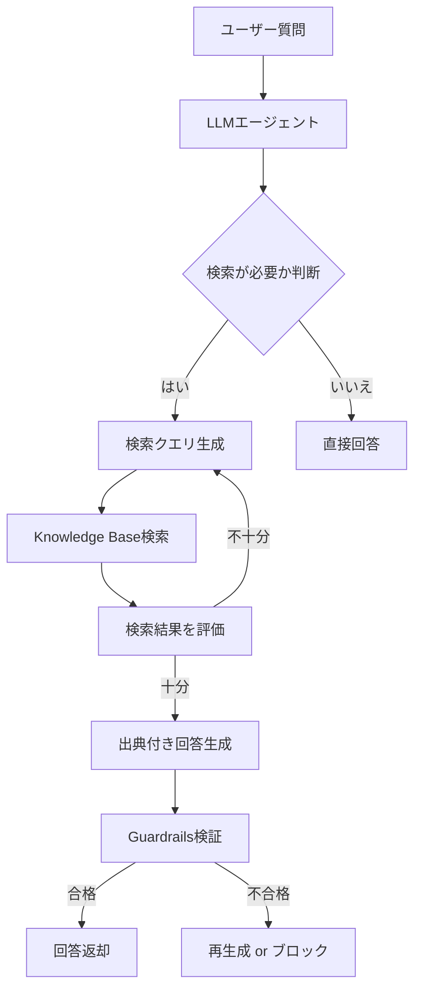
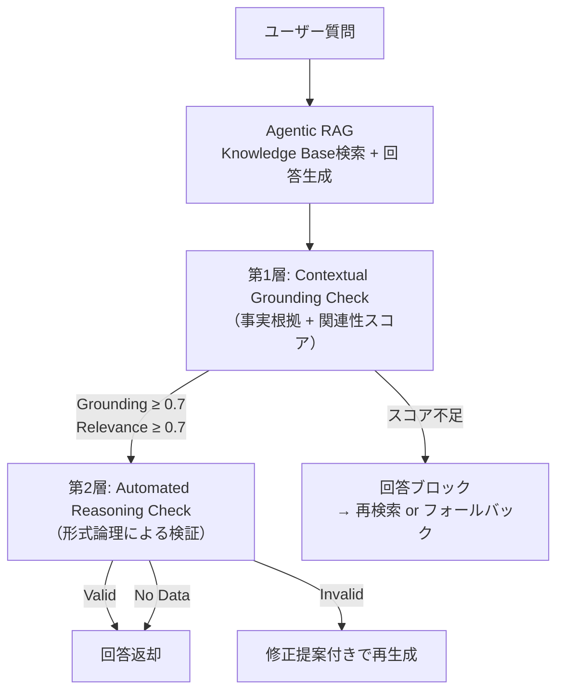

# Bedrock AgentCoreで社内文書Q&Aを構築し3層防御でハルシネーションを低減する

## この記事でわかること

- Amazon Bedrock AgentCoreとStrands Agentsを使ったAgentic RAGの構築方法
- Knowledge Bases + S3 Vectorsによる社内技術文書の検索パイプライン設計
- Guardrails Contextual Grounding Check・Automated Reasoning Checksを組み合わせた3層ハルシネーション防御アーキテクチャ
- 出典付き回答生成の実装パターンとboto3によるカスタムツール作成
- 本番運用で必要な閾値チューニングとモニタリングの実践手法

## 対象読者

- **想定読者**: 中級〜上級のAWSエンジニア、MLOpsエンジニア
- **必要な前提知識**:
  - AWS Bedrockの基本操作（コンソール・boto3）
  - Python 3.12以降の基礎文法
  - RAG（Retrieval-Augmented Generation）の基本概念
  - LLMのハルシネーション問題に関する基本理解

## 結論・成果

Bedrock AgentCoreのKnowledge Bases、Guardrails Contextual Grounding Check、Automated Reasoning Checksを3層で組み合わせることで、社内技術文書Q&Aシステムのハルシネーション検出を多層化できます。AWSの公式発表によると、Guardrailsは有害コンテンツの最大88%をブロックし、正確な回答を最大99%の精度で識別可能と報告されています（[AWS Bedrock Guardrails公式ページ](https://aws.amazon.com/bedrock/guardrails/)）。また、S3 Vectorsをバックエンドに使用した場合、ウォームクエリで100ミリ秒台のレイテンシが報告されており（[AWS Storage Blog](https://aws.amazon.com/blogs/storage/optimize-agent-tool-selection-using-s3-vectors-and-bedrock-knowledge-bases/)）、低コストかつ低遅延な検索基盤を実現できます。

ただし、Automated Reasoning Checksは2026年2月時点でGated Previewであり、Contextual Grounding Checkは会話型チャットボット用途では非対応という制約があります。本記事では、これらの制約を踏まえた実践的な設計パターンを解説します。

## Agentic RAGと従来型RAGの違いを理解する

社内技術文書Q&Aを構築する際、従来型RAGでは「検索→生成」の固定パイプラインで応答を返していました。しかし、ユーザーの質問が曖昧な場合や、複数文書にまたがる回答が必要な場合、固定パイプラインでは精度が低下します。

Agentic RAGは、LLMがエージェントとして**自律的に検索戦略を決定**するアプローチです。「knowledge base search」をツールとしてLLMに公開し、LLMが質問の意図を解釈してから適切な検索クエリを生成・実行します。



### 従来型RAGとの比較

| 項目 | 従来型RAG | Agentic RAG |
|------|-----------|-------------|
| 検索戦略 | 固定クエリ | LLMが動的に決定 |
| 複数回検索 | 非対応 | 自動リトライ可能 |
| 検索結果の評価 | なし | LLMが関連度を判断 |
| ハルシネーション対策 | 生成後チェックのみ | 検索・生成・検証の多層 |
| 適用シナリオ | 単純なFAQ | 複雑な技術質問 |

**注意点:**
> Agentic RAGはLLMの呼び出し回数が増えるため、単純なFAQには過剰設計です。質問の複雑度に応じて従来型RAGと使い分けてください。AgentCore Gatewayのセマンティックツール選択を使えば、質問の種類に応じた自動ルーティングも可能です。

## Knowledge Bases + S3 Vectorsで検索基盤を構築する

社内技術文書Q&Aの検索基盤として、Amazon Bedrock Knowledge BasesとS3 Vectorsを組み合わせます。S3 Vectorsは2025年にGAとなった比較的新しいベクトルストアで、OpenSearch ServerlessやPineconeと比較してAWSネイティブなコスト効率を持ちます。

### Knowledge Baseのセットアップ

1. S3バケットにPDF・Markdown等の技術文書をアップロード
2. Bedrock コンソールでKnowledge Baseを作成
3. データソースにS3バケットを指定
4. Embeddingモデルとして**Titan Text Embeddings v2**を選択
5. ベクトルストアに**Amazon S3 Vectors**を選択（自動セットアップ）
6. データソースを同期してベクトル化を実行

### Strands Agentsによるカスタム検索ツール

Strands Agentsの組み込み`retrieve`ツールはS3 Vectorsとの連携時に出典情報の取得に課題がありました（バージョン0.2.8未満でドキュメントIDが"Unknown"になる問題）。boto3を直接使用するカスタムツールを実装することで、出典管理を強化できます。

```python
# custom_kb_tool.py
import json
from typing import Optional

import boto3
from strands import tool

BEDROCK_AGENT_RUNTIME = boto3.client(
    "bedrock-agent-runtime",
    region_name="ap-northeast-1",
)

KNOWLEDGE_BASE_ID = "YOUR_KNOWLEDGE_BASE_ID"


@tool
def search_internal_docs(
    query: str,
    max_results: Optional[int] = None,
) -> str:
    """社内技術文書を検索し、関連するドキュメントを返します。

    Args:
        query: 検索クエリ（自然言語）
        max_results: 取得する最大ドキュメント数（デフォルト: 5）
    """
    response = BEDROCK_AGENT_RUNTIME.retrieve(
        knowledgeBaseId=KNOWLEDGE_BASE_ID,
        retrievalQuery={"text": query},
        retrievalConfiguration={
            "vectorSearchConfiguration": {
                "numberOfResults": max_results or 5,
                "overrideSearchType": "SEMANTIC",
            }
        },
    )

    results = []
    for i, result in enumerate(response.get("retrievalResults", []), 1):
        content = result.get("content", {}).get("text", "")
        location = result.get("location", {})
        s3_uri = location.get("s3Location", {}).get("uri", "不明")
        score = result.get("score", 0.0)

        results.append(
            {
                "rank": i,
                "content": content[:2000],  # トークン節約
                "source": s3_uri,
                "score": round(score, 4),
            }
        )

    return json.dumps(results, ensure_ascii=False, indent=2)
```

**なぜboto3直接利用を選んだか:**
- Strands Toolsの`retrieve`関数は0.2.8未満でS3 Vectorsの出典URIを正しく返さなかった（[DevelopersIO報告](https://dev.classmethod.jp/en/articles/amazon-bedrock-agentcore-s3-vectors-rag/)）
- boto3のレスポンスから`s3Location.uri`を直接抽出することで、出典の正確性を保証
- `score`フィールドを活用した関連度フィルタリングが可能

### エージェントの組み立て

```python
# agent.py
from strands import Agent
from strands.models.bedrock import BedrockModel

from custom_kb_tool import search_internal_docs

SYSTEM_PROMPT = """あなたは社内技術文書に基づいて質問に回答するアシスタントです。

## 回答ルール
1. search_internal_docsツールで検索した情報のみに基づいて回答してください
2. 検索結果に含まれない情報は「該当する情報が見つかりませんでした」と回答してください
3. 回答には必ず出典を[1], [2]の形式で付与してください
4. 回答の末尾に「## 参考文献」セクションを追加し、S3 URIを記載してください
5. 推測や一般知識での補完は行わないでください
"""

model = BedrockModel(
    model_id="anthropic.claude-sonnet-4-6-20250514",
    region_name="ap-northeast-1",
)

agent = Agent(
    model=model,
    system_prompt=SYSTEM_PROMPT,
    tools=[search_internal_docs],
)


def ask(question: str) -> str:
    """社内文書Q&Aに質問を投げる"""
    result = agent(question)
    return result.message
```

**ハマりポイント:**
> `system_prompt`で「検索結果にない情報は回答しない」と明示しないと、LLMは一般知識で補完してしまいます。これがハルシネーションの主要な原因の1つです。プロンプトによる制約は第1層の防御ですが、これだけでは不十分なため、後述のGuardrailsによる機械的な検証が必要になります。

## 3層ハルシネーション防御アーキテクチャを実装する

社内文書Q&Aでハルシネーションを防ぐには、単一の対策では不十分です。本セクションでは、3つの防御層を組み合わせたアーキテクチャを設計します。



### 第1層: Contextual Grounding Check

Contextual Grounding Checkは、LLMの回答が**検索結果（グラウンディングソース）に基づいているか**と、**ユーザーの質問に関連しているか**を数値スコアで評価します。

```python
# guardrails_grounding.py
import boto3

bedrock_client = boto3.client("bedrock-runtime", region_name="ap-northeast-1")

GUARDRAIL_ID = "YOUR_GUARDRAIL_ID"
GUARDRAIL_VERSION = "DRAFT"


def check_grounding(
    source_text: str,
    query: str,
    response_text: str,
) -> dict:
    """Contextual Grounding Checkを実行する

    Args:
        source_text: 検索結果（グラウンディングソース、最大10万文字）
        query: ユーザーの質問（最大1,000文字）
        response_text: LLMの回答（最大5,000文字）
    """
    result = bedrock_client.apply_guardrail(
        guardrailIdentifier=GUARDRAIL_ID,
        guardrailVersion=GUARDRAIL_VERSION,
        source="OUTPUT",
        content=[
            {
                "text": {
                    "text": source_text,
                    "qualifiers": ["grounding_source"],
                }
            },
            {
                "text": {
                    "text": query,
                    "qualifiers": ["query"],
                }
            },
            {
                "text": {
                    "text": response_text,
                }
            },
        ],
    )

    action = result.get("action", "NONE")
    assessments = result.get("assessments", [])

    grounding_score = None
    relevance_score = None

    for assessment in assessments:
        grounding_policy = assessment.get("contextualGroundingPolicy", {})
        for filter_result in grounding_policy.get("filters", []):
            if filter_result["type"] == "GROUNDING":
                grounding_score = filter_result.get("score", 0)
            elif filter_result["type"] == "RELEVANCE":
                relevance_score = filter_result.get("score", 0)

    return {
        "action": action,  # "GUARDRAIL_INTERVENED" or "NONE"
        "grounding_score": grounding_score,
        "relevance_score": relevance_score,
        "passed": action == "NONE",
    }
```

**Guardrailの作成（boto3）:**

```python
# create_guardrail.py
import boto3

bedrock_client = boto3.client("bedrock", region_name="ap-northeast-1")

response = bedrock_client.create_guardrail(
    name="internal-docs-qa-guardrail",
    description="社内技術文書Q&A用のハルシネーション検出ガードレール",
    contextualGroundingPolicyConfig={
        "filtersConfig": [
            {
                "type": "GROUNDING",
                "threshold": 0.7,
            },
            {
                "type": "RELEVANCE",
                "threshold": 0.7,
            },
        ]
    },
    blockedInputMessaging="入力が制限されています。",
    blockedOutputsMessaging="回答の正確性を検証できませんでした。別の質問をお試しください。",
)

guardrail_id = response["guardrailId"]
print(f"Guardrail作成完了: {guardrail_id}")
```

**閾値設定のトレードオフ:**

| 閾値 | ハルシネーションブロック率 | 正常回答のブロック率（偽陽性） | 適用シナリオ |
|------|--------------------------|------------------------------|-------------|
| 0.5 | 低 | 低 | 一般的なFAQ |
| 0.7 | 中 | 中 | 社内文書Q&A（推奨） |
| 0.9 | 高 | 高 | 法務・コンプライアンス文書 |

> 閾値は0〜0.99の範囲で設定可能です。1.0は無効な値として扱われます（[AWS公式ドキュメント](https://docs.aws.amazon.com/bedrock/latest/userguide/guardrails-contextual-grounding-check.html)）。社内技術文書Q&Aでは0.7を起点に、運用データに基づいて調整することを推奨します。

### 第2層: Automated Reasoning Checks

Automated Reasoning Checksは、**形式論理（Formal Logic）** を使ってLLMの回答を数学的に検証する機能です。Contextual Grounding Checkが「検索結果との類似度」で判定するのに対し、Automated Reasoning Checksは**ドメイン知識をルールとしてエンコード**し、回答がルールに矛盾しないかを検証します。

AWS公式ブログによると、これはGenerative AIのセーフガードとして形式論理を活用する業界初の機能です（[AWS Blog: Automated Reasoning Checks](https://aws.amazon.com/blogs/machine-learning/minimize-generative-ai-hallucinations-with-amazon-bedrock-automated-reasoning-checks/)）。

**検証結果の3分類:**

| 判定 | 意味 | アクション |
|------|------|-----------|
| Valid | ルールに合致 | 回答を返却 |
| Invalid | ルールに矛盾 | 修正提案付きで再生成 |
| No Data | 検証不可 | 回答を返却（ログ記録） |

**制約事項:**
> Automated Reasoning Checksは2026年2月時点で**Gated Preview**です。本番運用には承認申請が必要です。ドメイン知識のルール化に工数がかかるため、まずはContextual Grounding Checkの運用を安定させてから段階的に導入することを推奨します。

### 第3層: プロンプトによる自己検証

3つ目の防御層として、LLM自身に回答の根拠を検証させるプロンプトパターンを組み込みます。これはGuardrailsのようなAPI呼び出しではなく、エージェントのシステムプロンプトに組み込む軽量な対策です。

```python
VERIFICATION_PROMPT = """
回答を生成した後、以下の自己検証を実行してください:

1. 【出典確認】回答内の各主張に対応する検索結果の文番号を特定できますか？
   - 特定できない主張がある場合、その部分を削除してください
2. 【範囲確認】検索結果に含まれない情報を追加していませんか？
   - 一般知識で補完した部分がある場合、明示的に「※一般的な知識に基づく補足」と注記してください
3. 【数値確認】回答に含まれる数値・バージョン番号は検索結果と一致していますか？
   - 不一致がある場合、検索結果の値に修正してください

検証結果に基づいて回答を修正し、最終版のみを出力してください。
"""
```

**なぜプロンプト検証も必要か:**
- Guardrailsは回答**生成後**に検証するため、ブロックされた場合は再生成コストが発生
- プロンプトによる**生成前**の制約で、Guardrailsでブロックされる確率を下げられる
- 3層を組み合わせることで、単一障害点のない防御を実現

## 3層防御を統合したパイプラインを実装する

ここまでの3つの防御層を統合し、エンドツーエンドのQ&Aパイプラインを構築します。

```python
# pipeline.py
import json
import logging

from custom_kb_tool import search_internal_docs
from guardrails_grounding import check_grounding
from strands import Agent
from strands.models.bedrock import BedrockModel

logger = logging.getLogger(__name__)

SYSTEM_PROMPT = """あなたは社内技術文書に基づいて質問に回答するアシスタントです。

## 回答ルール
1. search_internal_docsツールで検索した情報のみに基づいて回答してください
2. 検索結果に含まれない情報は「該当する情報が見つかりませんでした」と回答してください
3. 回答には必ず出典を[1], [2]の形式で付与してください
4. 回答の末尾に「## 参考文献」セクションを追加し、S3 URIを記載してください
5. 推測や一般知識での補完は行わないでください

## 自己検証（回答生成後に必ず実行）
- 各主張に対応する検索結果があるか確認
- 検索結果にない情報を追加していないか確認
- 数値・バージョン番号が検索結果と一致するか確認
"""

model = BedrockModel(
    model_id="anthropic.claude-sonnet-4-6-20250514",
    region_name="ap-northeast-1",
)

agent = Agent(
    model=model,
    system_prompt=SYSTEM_PROMPT,
    tools=[search_internal_docs],
)


def answer_with_verification(
    question: str,
    max_retries: int = 2,
) -> dict:
    """3層防御付きでQ&Aを実行する

    Args:
        question: ユーザーの質問
        max_retries: Grounding Check失敗時の最大リトライ回数
    """
    for attempt in range(max_retries + 1):
        # Step 1: Agentic RAGで回答生成
        result = agent(question)
        answer = result.message

        # Step 2: 検索結果を取得（エージェントのツール呼び出し履歴から）
        search_results = _extract_search_results(result)

        if not search_results:
            logger.warning("検索結果なし: 直接回答を返却")
            return {
                "answer": answer,
                "grounding_check": None,
                "verified": False,
            }

        # Step 3: Contextual Grounding Check
        grounding_result = check_grounding(
            source_text=search_results,
            query=question,
            response_text=answer,
        )

        logger.info(
            "Grounding Check: attempt=%d, grounding=%.3f, relevance=%.3f, passed=%s",
            attempt,
            grounding_result.get("grounding_score", 0),
            grounding_result.get("relevance_score", 0),
            grounding_result["passed"],
        )

        if grounding_result["passed"]:
            return {
                "answer": answer,
                "grounding_check": grounding_result,
                "verified": True,
                "attempts": attempt + 1,
            }

        # Grounding失敗: 再生成を試行
        logger.warning(
            "Grounding Check失敗（attempt %d/%d）: 再生成します",
            attempt + 1,
            max_retries + 1,
        )

    # 全リトライ失敗
    return {
        "answer": "申し訳ございません。正確な回答を生成できませんでした。"
        "質問を具体的に言い換えてお試しください。",
        "grounding_check": grounding_result,
        "verified": False,
        "attempts": max_retries + 1,
    }


def _extract_search_results(agent_result) -> str:
    """エージェントのツール呼び出し結果から検索結果テキストを抽出する"""
    for message in agent_result.messages:
        if hasattr(message, "tool_results"):
            for tool_result in message.tool_results:
                if tool_result.get("name") == "search_internal_docs":
                    return tool_result.get("content", "")
    return ""
```

### AgentCoreへのデプロイ

作成したパイプラインをAgentCoreにデプロイすることで、サーバーレスでスケーラブルな運用が可能になります。

```python
# agentcore_app.py
from bedrock_agentcore import BedrockAgentCoreApp

from pipeline import answer_with_verification

app = BedrockAgentCoreApp()


@app.entrypoint
def invoke(payload: dict) -> dict:
    """AgentCoreエントリポイント"""
    question = payload.get("prompt", "")
    if not question:
        return {"error": "promptが指定されていません"}

    result = answer_with_verification(question)
    return {
        "answer": result["answer"],
        "verified": result.get("verified", False),
        "grounding_score": result.get("grounding_check", {}).get(
            "grounding_score"
        ),
    }
```

```bash
# デプロイ手順
pip install strands-agents bedrock-agentcore bedrock-agentcore-starter-toolkit

# AgentCore設定
agentcore configure --entrypoint agentcore_app.py
# IAMロール（BedrockFullAccess + S3ReadOnly）を指定

# 起動
agentcore launch \
  --env KNOWLEDGE_BASE_ID=YOUR_KB_ID \
  --env GUARDRAIL_ID=YOUR_GUARDRAIL_ID
```

**よくある間違い:**
> 最初はKnowledge Baseの検索結果をそのままGrounding Sourceとして渡していましたが、検索結果が10万文字を超えるとAPIエラーになります。検索結果の`content`フィールドを2,000文字に制限し、上位5件までに絞ることで解決しました。Contextual Grounding Checkのソース文字数制限は10万文字、クエリは1,000文字、レスポンスは5,000文字です。

## 本番運用のモニタリングと閾値チューニングを設計する

3層防御を導入しても、閾値が適切でなければ偽陽性（正しい回答のブロック）や偽陰性（ハルシネーションの見逃し）が発生します。本番運用では、CloudWatchとの統合によるモニタリングが不可欠です。

### モニタリング設計

AgentCoreはOpenTelemetryとCloudWatch統合を提供しています。以下のメトリクスを記録します。

```python
# monitoring.py
import json
import logging
import time

logger = logging.getLogger("qa_metrics")


def log_qa_metrics(
    question: str,
    result: dict,
    latency_ms: float,
) -> None:
    """Q&A実行メトリクスを構造化JSONで記録する"""
    logger.info(
        json.dumps(
            {
                "event": "qa_execution",
                "level": "INFO",
                "ts": time.time(),
                "question_length": len(question),
                "verified": result.get("verified", False),
                "grounding_score": result.get("grounding_check", {}).get(
                    "grounding_score"
                ),
                "relevance_score": result.get("grounding_check", {}).get(
                    "relevance_score"
                ),
                "attempts": result.get("attempts", 1),
                "duration_ms": latency_ms,
            },
            ensure_ascii=False,
        )
    )
```

### 閾値チューニングの手順

1. **ベースライン測定**: 閾値0.7で1週間運用し、ブロック率と正答率を記録
2. **偽陽性分析**: ブロックされた回答を人間がレビューし、正しい回答がブロックされた割合を算出
3. **偽陰性分析**: 通過した回答をサンプリングし、ハルシネーションが含まれる割合を算出
4. **閾値調整**: 偽陽性が高ければ閾値を下げ、偽陰性が高ければ閾値を上げる

| メトリクス | 目標値 | 調整方針 |
|-----------|--------|----------|
| ハルシネーション検出率 | 80%以上 | 閾値を上げる |
| 偽陽性率 | 10%以下 | 閾値を下げる |
| 平均レイテンシ | 3秒以下 | 検索結果数を削減 |
| リトライ率 | 20%以下 | プロンプト改善 |

**トレードオフ:**
> 閾値を厳しくするとハルシネーションは減りますが、正しい回答もブロックされやすくなります。社内技術文書Q&Aでは、「回答しない」よりも「不正確な回答をする」方がリスクが高いため、偽陽性を許容して閾値を高めに設定する運用が一般的です。ただし、偽陽性率が20%を超えるとユーザー体験が著しく低下するため、バランスが重要です。

### よくある問題と解決方法

| 問題 | 原因 | 解決方法 |
|------|------|----------|
| Grounding Scoreが常に低い | 検索結果と回答の粒度が異なる | 検索結果のチャンクサイズを調整（512-1024トークン推奨） |
| Relevance Scoreが低い | 質問の意図と回答がずれている | システムプロンプトに「質問に直接回答する」指示を追加 |
| レイテンシが5秒超 | 検索結果が多すぎる | `numberOfResults`を5→3に削減 |
| APIエラー `ValidationException` | ソーステキストが10万文字超 | 検索結果を上位5件、各2000文字に制限 |
| 閾値1.0でエラー | 1.0は無効値 | 0.99以下を指定 |

## まとめと次のステップ

**まとめ:**
- Bedrock AgentCoreとStrands Agentsを使い、**Agentic RAG**で社内技術文書Q&Aを構築した
- **3層ハルシネーション防御**（Contextual Grounding Check + Automated Reasoning Checks + プロンプト自己検証）を設計・実装した
- boto3カスタムツールで**出典付き回答**を実現し、S3 URIによるトレーサビリティを確保した
- 本番運用に向けた**閾値チューニング**とCloudWatchモニタリングの設計を行った
- Automated Reasoning ChecksはGated Preview、Contextual Grounding Checkは会話型チャットボット非対応という制約を確認した

**次にやるべきこと:**
- Knowledge Baseのチャンク戦略（固定長 vs セマンティック分割）の最適化を検討する
- AgentCore Memoryのエピソディック記憶を導入し、過去の質問・回答履歴を活用する
- Automated Reasoning ChecksのGA後に、ドメイン固有のルールセットを構築する

## 参考

- [Amazon Bedrock AgentCore 公式ページ](https://aws.amazon.com/bedrock/agentcore/)
- [Contextual Grounding Check ドキュメント](https://docs.aws.amazon.com/bedrock/latest/userguide/guardrails-contextual-grounding-check.html)
- [Automated Reasoning Checks でハルシネーションを最小化する（AWS Blog）](https://aws.amazon.com/blogs/machine-learning/minimize-generative-ai-hallucinations-with-amazon-bedrock-automated-reasoning-checks/)
- [S3 Vectors + Bedrock Knowledge Bases でコスト効率の高いRAGを構築する（AWS Blog）](https://aws.amazon.com/blogs/machine-learning/building-cost-effective-rag-applications-with-amazon-bedrock-knowledge-bases-and-amazon-s3-vectors/)
- [S3 Vectors + AgentCore による RAG 実装例（DevelopersIO）](https://dev.classmethod.jp/en/articles/amazon-bedrock-agentcore-s3-vectors-rag/)
- [Amazon Bedrock Guardrails 公式ページ](https://aws.amazon.com/bedrock/guardrails/)
- [Bedrock AgentCore Memory: コンテキストアウェアなエージェント構築（AWS Blog）](https://aws.amazon.com/blogs/machine-learning/amazon-bedrock-agentcore-memory-building-context-aware-agents/)

---

:::message
この記事はAI（Claude Code）により自動生成されました。内容の正確性については複数の情報源で検証していますが、実際の利用時は公式ドキュメントもご確認ください。
:::
