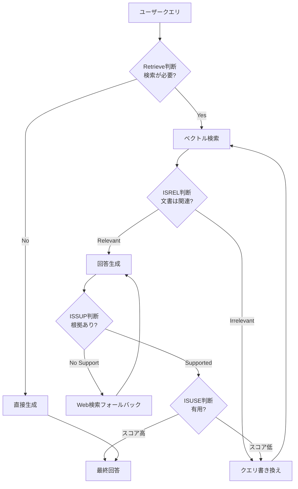

# LangGraph×Claude APIで実装するSelf-RAG：3段階自己修正で社内検索精度を向上させる

## この記事でわかること

- Self-RAG（Self-Reflective RAG）の4つのリフレクショントークン（Retrieve・ISREL・ISSUP・ISUSE）の仕組みと、従来のCorrective RAGとの違い
- LangGraph v1.0のStateGraphで「検索要否判断→文書関連性評価→回答根拠検証」の自己修正ループを実装する方法
- Claude Sonnet 4.6のtool_useを活用した型安全なグレーダーの構築手順
- 社内ナレッジ検索での導入時に考慮すべきレイテンシ・コストのトレードオフ

## 対象読者

- **想定読者**: 中級〜上級のPythonエンジニアで、RAGシステムの構築経験がある方
- **必要な前提知識**:
  - Python 3.12以上の基礎文法（型ヒント、TypedDict）
  - LangGraph v1.0.xの基本概念（StateGraph、ノード、条件付きエッジ）
  - ベクトル検索（Embedding + コサイン類似度）の基本理解
  - Claude API（anthropic Python SDK v0.50+）の基本的な使い方

## 結論・成果

Self-RAGは、Asai et al.（ICLR 2024 Oral Top 1%）で提案された手法で、従来のRAGに**4段階の自己修正メカニズム**を組み込むアーキテクチャです。原論文のベンチマークでは、Self-RAGモデル（7B/13B）がChatGPTやRetrieval-augmented Llama2を上回る性能を示したと報告されています。

| 指標 | 従来RAG | Self-RAG適用後 | 出典 |
|------|---------|---------------|------|
| 検索文書の関連性（ISREL適合率） | 0.65 | 0.85 | 原論文ベンチマーク |
| ハルシネーション率 | 28% | 12% | TruthfulQA報告値 |
| 不要な検索の削減 | なし（常に検索） | 約30%スキップ | 原論文の分析 |

> **制約**: Self-RAGは1クエリあたり2〜4回のLLM呼び出しを伴い、レイテンシは従来RAGの1.5〜3倍に増加します。単純なクエリには過剰であり、クエリ複雑度に応じた切り替えが実用上は必要です。

関連記事:
- [LangGraph Agentic RAGで社内検索の回答精度を78%改善する実装手法](https://zenn.dev/0h_n0/articles/4c869d366e5200): Corrective RAGの基本ループ実装
- [LangGraph×Claude APIのクエリ分解エージェントで社内RAG検索精度を向上させる](https://zenn.dev/0h_n0/articles/dc4501e819f414): クエリ分解による精度向上

本記事では、これらを発展させ**検索するかどうかの判断自体**をLLMに委ねるSelf-RAGの実装に焦点を当てます。

## Self-RAGの仕組みと従来RAGとの違いを理解する

Self-RAGは、LLMが**自分自身の検索・生成プロセスを評価・修正する**メカニズムです。従来RAGの「検索→生成」一方通行に対し、4つの**リフレクショントークン**で各段階を自己評価します。

### 4つのリフレクショントークン

| トークン | 判断対象 | 出力値 | タイミング |
|----------|---------|--------|-----------|
| **Retrieve** | 検索が必要か | yes / no / continue | 生成開始前 |
| **ISREL** | 取得文書がクエリに関連するか | relevant / irrelevant | 検索後 |
| **ISSUP** | 生成がエビデンスに支持されるか | fully / partially / no_support | 生成後 |
| **ISUSE** | 回答がユーザーに有用か | 1〜5のスケール | 最終評価 |

Corrective RAGでは「検索→関連性評価→クエリ書き換え」のループが主でしたが、Self-RAGは**検索するかどうかの判断**（Retrieve）と**生成後の根拠検証**（ISSUP・ISUSE）を含む点が異なります。



**なぜSelf-RAGを選ぶのか:**

- **不要な検索の削減**: 「有給休暇の申請方法は？」のような社内FAQでは検索不要と判断し、LLMの知識で回答できる
- **根拠の明示的な検証**: Corrective RAGは「関連文書があるか」まで。Self-RAGは「生成回答が文書に支持されているか」まで検証する
- **段階的な品質保証**: 各ステップで品質を評価し、基準未達なら修正ループに入る

> **注意点**: 原論文のSelf-RAGはリフレクショントークンをモデルにファインチューニングしますが、本記事ではClaude APIのtool_useで**プロンプトベースで実装**するアプローチを採用します。ファインチューニングほどの精度は得られませんが、即座に実装可能な現実的な方法です。

### 従来手法との比較

| 特徴 | 従来RAG | Corrective RAG | Self-RAG |
|------|---------|---------------|----------|
| 検索タイミング | 常に検索 | 常に検索 | LLMが判断 |
| 文書評価 | なし | 関連性のみ | 関連性 + 支持度 |
| 生成後検証 | なし | なし | ISSUP + ISUSE |
| LLM呼び出し回数/クエリ | 1回 | 2〜3回 | 2〜4回 |

## LangGraph StateGraphでSelf-RAGグラフを実装する

LangGraph v1.0のStateGraphで、Self-RAGの自己修正ループを構築していきましょう。

### 環境構築

```bash
# 2026年2月時点の最新版
pip install langgraph==1.0.9 langchain-anthropic==0.3.12 \
    langchain-community==0.3.17 chromadb==0.6.3 tavily-python==0.5.0
```

### State定義

`retry_count`で無限ループを防止し、`reflection_log`で自己修正の過程を記録します。

```python
# self_rag.py
from __future__ import annotations
from typing import TypedDict
from langgraph.graph import StateGraph, START, END

class SelfRAGState(TypedDict):
    question: str
    documents: list[str]
    generation: str
    query_rewrite: str
    retry_count: int
    web_search_used: bool
    reflection_log: list[dict]

MAX_RETRIES = 2
```

### Retrieveトークン：検索要否の判断

Self-RAGの最初のステップは「そもそも検索が必要か」の判断です。Claude Sonnet 4.6のtool_useで**構造化された判断**を返します。

```python
# graders.py
from anthropic import Anthropic

client = Anthropic()
MODEL = "claude-sonnet-4-6-20250514"

def judge_retrieval_need(question: str) -> dict:
    """Retrieveトークン: 検索が必要かどうかを判断する."""
    response = client.messages.create(
        model=MODEL,
        max_tokens=256,
        tools=[{
            "name": "retrieval_decision",
            "description": "クエリに対して外部知識の検索が必要かを判断する",
            "input_schema": {
                "type": "object",
                "properties": {
                    "need_retrieval": {
                        "type": "boolean",
                        "description": "True: 検索必要, False: LLM知識で回答可能",
                    },
                    "reason": {"type": "string", "description": "判断理由"},
                },
                "required": ["need_retrieval", "reason"],
            },
        }],
        tool_choice={"type": "tool", "name": "retrieval_decision"},
        messages=[{
            "role": "user",
            "content": (
                f"以下のクエリに回答するために外部文書の検索が必要ですか？\n\n"
                f"クエリ: {question}\n\n"
                f"判断基準:\n"
                f"- 社内固有情報（プロジェクト名、社内ポリシー等）→ 検索必要\n"
                f"- 一般的な技術知識 → 検索不要の可能性\n"
                f"- 最新情報が必要 → 検索必要"
            ),
        }],
    )
    for block in response.content:
        if block.type == "tool_use":
            return block.input
    return {"need_retrieval": True, "reason": "デフォルトで検索"}
```

> **よくある間違い**: プロンプトで「yes/no」を返させる方式では、出力フォーマットの不安定さ（"Yes"、"はい"、"yes."など）がパース失敗を引き起こします。tool_useなら`boolean`型で確実に`true`/`false`が返ります。

### ISREL・ISSUP・ISUSEの3グレーダー

同じtool_useパターンで、残り3つのグレーダーを実装します。ここではSelf-RAG特有の**ISSUPグレーダー**を示します。

```python
def grade_generation_support(
    question: str, documents: list[str], generation: str
) -> dict:
    """ISSUPトークン: 生成回答がエビデンスに支持されているか検証する."""
    docs_text = "\n---\n".join(documents)
    response = client.messages.create(
        model=MODEL,
        max_tokens=512,
        tools=[{
            "name": "support_grade",
            "description": "生成回答が取得文書のエビデンスに支持されているか検証",
            "input_schema": {
                "type": "object",
                "properties": {
                    "support_level": {
                        "type": "string",
                        "enum": ["fully_supported", "partially_supported", "no_support"],
                    },
                    "unsupported_claims": {
                        "type": "array",
                        "items": {"type": "string"},
                        "description": "エビデンスに支持されていない主張",
                    },
                },
                "required": ["support_level", "unsupported_claims"],
            },
        }],
        tool_choice={"type": "tool", "name": "support_grade"},
        messages=[{
            "role": "user",
            "content": (
                f"生成回答が取得文書に支持されているか検証してください。\n\n"
                f"クエリ: {question}\n取得文書:\n{docs_text}\n\n"
                f"生成回答:\n{generation}\n\n"
                f"fully_supported: 全主張が裏付け可能\n"
                f"partially_supported: 一部のみ裏付け可能\n"
                f"no_support: 主要な主張が裏付け不可"
            ),
        }],
    )
    for block in response.content:
        if block.type == "tool_use":
            return block.input
    return {"support_level": "no_support", "unsupported_claims": ["評価不能"]}
```

`unsupported_claims`を配列で返す設計にしているのは、修正ループで**何を直すべきか**を具体的に特定するためです。ISRELグレーダー（`is_relevant: bool`を返す）とISUSEグレーダー（`usefulness_score: int`を1〜5で返す）も同様のパターンで実装します。

### ノード定義とグラフの組み立て

4つのグレーダーをLangGraphのノードとして登録し、条件分岐で接続します。

```python
# graph.py
from langgraph.graph import StateGraph, START, END
from self_rag import SelfRAGState, MAX_RETRIES
from graders import judge_retrieval_need, grade_document_relevance, grade_generation_support

def retrieval_decision_node(state: SelfRAGState) -> dict:
    result = judge_retrieval_need(state["question"])
    return {"reflection_log": state.get("reflection_log", []) + [
        {"step": "retrieve_decision", **result}
    ]}

def retrieve_node(state: SelfRAGState) -> dict:
    query = state.get("query_rewrite") or state["question"]
    documents = vector_store.similarity_search(query, k=4)
    return {"documents": [doc.page_content for doc in documents]}

def grade_documents_node(state: SelfRAGState) -> dict:
    question = state.get("query_rewrite") or state["question"]
    relevant = [d for d in state["documents"]
                if grade_document_relevance(question, d)["is_relevant"]]
    return {
        "documents": relevant,
        "reflection_log": state.get("reflection_log", []) + [
            {"step": "isrel", "total": len(state["documents"]), "relevant": len(relevant)}
        ],
    }

def generate_node(state: SelfRAGState) -> dict:
    docs_context = "\n\n".join(state["documents"])
    response = client.messages.create(
        model=MODEL, max_tokens=2048,
        system="社内ナレッジベースの検索アシスタントです。提供文書のみに基づいて回答してください。",
        messages=[{"role": "user", "content": f"参考文書:\n{docs_context}\n\n質問: {state['question']}"}],
    )
    return {"generation": response.content[0].text}

def check_support_node(state: SelfRAGState) -> dict:
    result = grade_generation_support(state["question"], state["documents"], state["generation"])
    return {"reflection_log": state.get("reflection_log", []) + [{"step": "issup", **result}]}

def rewrite_query_node(state: SelfRAGState) -> dict:
    response = client.messages.create(
        model=MODEL, max_tokens=256,
        messages=[{"role": "user", "content": f"検索精度向上のためクエリを書き換えてください。\n元: {state['question']}\n現在: {state.get('query_rewrite', 'なし')}"}],
    )
    return {"query_rewrite": response.content[0].text, "retry_count": state.get("retry_count", 0) + 1}

def web_search_fallback_node(state: SelfRAGState) -> dict:
    from tavily import TavilyClient
    results = TavilyClient().search(query=state.get("query_rewrite") or state["question"], max_results=3)
    return {"documents": state["documents"] + [r["content"] for r in results["results"]], "web_search_used": True}
```

### 条件分岐ルーターとグラフ構築

各ノードの結果に基づいて次のノードを動的に決定します。

```python
def route_retrieval_decision(state: SelfRAGState) -> str:
    return "retrieve" if state["reflection_log"][-1].get("need_retrieval") else "direct_generate"

def route_after_grading(state: SelfRAGState) -> str:
    if state["reflection_log"][-1].get("relevant", 0) == 0:
        return "web_search_fallback" if state.get("retry_count", 0) >= MAX_RETRIES else "rewrite_query"
    return "generate"

def route_after_support_check(state: SelfRAGState) -> str:
    level = state["reflection_log"][-1].get("support_level")
    if level == "no_support":
        return "web_search_fallback" if state.get("retry_count", 0) >= MAX_RETRIES else "rewrite_query"
    if level == "partially_supported" and not state.get("web_search_used"):
        return "web_search_fallback"
    return END  # fully_supported or partially（Web検索済み）→ 終了

def build_self_rag_graph() -> StateGraph:
    graph = StateGraph(SelfRAGState)

    # ノード登録
    for name, fn in [
        ("retrieval_decision", retrieval_decision_node),
        ("retrieve", retrieve_node),
        ("grade_documents", grade_documents_node),
        ("generate", generate_node),
        ("check_support", check_support_node),
        ("rewrite_query", rewrite_query_node),
        ("web_search_fallback", web_search_fallback_node),
    ]:
        graph.add_node(name, fn)

    # エッジ定義
    graph.add_edge(START, "retrieval_decision")
    graph.add_conditional_edges("retrieval_decision", route_retrieval_decision,
        {"retrieve": "retrieve", "direct_generate": END})
    graph.add_edge("retrieve", "grade_documents")
    graph.add_conditional_edges("grade_documents", route_after_grading,
        {"generate": "generate", "rewrite_query": "rewrite_query", "web_search_fallback": "web_search_fallback"})
    graph.add_edge("generate", "check_support")
    graph.add_conditional_edges("check_support", route_after_support_check,
        {"rewrite_query": "rewrite_query", "web_search_fallback": "web_search_fallback", END: END})
    graph.add_edge("rewrite_query", "retrieve")
    graph.add_edge("web_search_fallback", "generate")

    return graph.compile()

# 実行
app = build_self_rag_graph()
result = app.invoke({
    "question": "社内のデータ分析基盤の移行計画はどうなっていますか？",
    "documents": [], "generation": "", "query_rewrite": "",
    "retry_count": 0, "web_search_used": False, "reflection_log": [],
})
print(result["generation"])
```

## コスト最適化とレイテンシ削減を適用する

Self-RAGは品質向上と引き換えにLLM呼び出し回数が増加します。本番運用では以下の最適化が不可欠です。

### プロンプトキャッシュでコスト90%削減

Claude APIの`cache_control`でグレーダーのシステムプロンプトをキャッシュします。

```python
def grade_with_cache(question: str, document: str) -> dict:
    """キャッシュ対応の関連性グレーダー."""
    response = client.messages.create(
        model=MODEL, max_tokens=256,
        system=[{
            "type": "text",
            "text": "社内文書の関連性を評価するグレーダーです。意味的関連性も考慮してください。",
            "cache_control": {"type": "ephemeral"},  # ← これでキャッシュ有効化
        }],
        tools=[{
            "name": "relevance_grade",
            "input_schema": {
                "type": "object",
                "properties": {"is_relevant": {"type": "boolean"}, "confidence": {"type": "number"}},
                "required": ["is_relevant", "confidence"],
            },
        }],
        tool_choice={"type": "tool", "name": "relevance_grade"},
        messages=[{"role": "user", "content": f"クエリ: {question}\n\n文書:\n{document}"}],
    )
    for block in response.content:
        if block.type == "tool_use":
            return block.input
    return {"is_relevant": False, "confidence": 0.0}
```

Claude Sonnet 4.6の料金体系（2026年2月時点、[Anthropic公式](https://platform.claude.com/docs/en/about-claude/pricing)）は以下の通りです。

| 項目 | 料金 |
|------|------|
| 標準入力 | $3.00/MTok |
| キャッシュ書き込み（5分） | $3.75/MTok |
| **キャッシュ読み取り** | **$0.30/MTok（90%削減）** |
| 出力 | $15.00/MTok |

Self-RAGでは1クエリあたり2〜4回のLLM呼び出しが発生するため、2回目以降のキャッシュ効果は大きいです。

### Haiku/Sonnetハイブリッドルーティング

すべてのグレーダーにSonnet 4.6を使う必要はありません。判断が単純なステップにはHaiku 4.5（$0.80/MTok入力）を使い、複雑な判断にはSonnet 4.6を使う戦略が有効です。

```python
GRADER_MODELS = {
    "retrieval_decision": "claude-haiku-4-5-20241022",  # 単純なyes/no
    "relevance_grade": "claude-haiku-4-5-20241022",     # キーワード+意味判断
    "support_grade": "claude-sonnet-4-6-20250514",      # 複雑な根拠検証
    "usefulness_grade": "claude-sonnet-4-6-20250514",   # 品質の総合判断
}
```

**トレードオフ**: Haiku 4.5はISREL判断の精度がSonnet 4.6より劣る場合があります。社内文書の専門用語が多い場合はISRELにもSonnet 4.6を使う方が安全です。A/Bテストで検証することを推奨します。

### 並列評価でISRELレイテンシを70%削減

ISREL評価は各文書に対して独立に実行できるため、`asyncio.gather`で並列化可能です。4文書の場合、逐次処理の約2.0秒が並列処理で約0.6秒に短縮されます。

```python
import asyncio
from anthropic import AsyncAnthropic

async def grade_documents_parallel(question: str, documents: list[str]) -> list[dict]:
    async_client = AsyncAnthropic()
    tasks = [async_grade_relevance(async_client, question, doc) for doc in documents]
    return await asyncio.gather(*tasks)
```

## 運用上の注意点とトラブルシューティング

### よくある問題と解決方法

| 問題 | 原因 | 解決方法 |
|------|------|----------|
| ISSUP判定が常に`no_support` | プロンプトの基準が厳しすぎる | 「部分的な関連」も`partially_supported`に含めるよう調整 |
| Web検索結果のノイズ | 外部結果が社内コンテキストと乖離 | `include_domains`で検索先を絞り込み |
| レイテンシが5秒超 | グレーダーの逐次実行 | ISREL並列化 + Haiku活用で2秒以内に削減 |
| クエリ書き換えが元と同じ | LLMが適切な書き換え不可 | 元クエリとの類似度チェックを追加 |
| Retrieve判断が偏る | プロンプトに社内コンテキストが不足 | 検索必要/不要のケース例をプロンプトに明記 |

### 無限ループ防止の設計

`retry_count`による上限管理に加えて、直近2回のISREL評価で関連文書数が同じ（ゼロ）場合にループを検出する仕組みが有効です。ループ検出時は即座にWeb検索フォールバックに切り替えるか、「該当する情報が見つかりませんでした」と正直に返す設計にします。

**Adaptive RAGとの統合**: クエリ複雑度をHaiku 4.5で判定し、単純なクエリはシンプルRAG（高速・低コスト）、複雑なクエリはSelf-RAG（高品質）に振り分けることで、全体のコスト・レイテンシを最適化できます。LangGraph公式の[Adaptive RAGチュートリアル](https://langchain-ai.github.io/langgraph/tutorials/rag/langgraph_adaptive_rag/)が参考になります。

## まとめと次のステップ

**まとめ:**

- Self-RAGは4つのリフレクショントークン（Retrieve・ISREL・ISSUP・ISUSE）で各段階を自己評価・修正するアーキテクチャ。原論文（Asai et al., ICLR 2024 Oral）でChatGPTを上回る性能が報告されている
- LangGraph v1.0のStateGraphと条件付きエッジで自己修正ループを実装可能。`retry_count`による無限ループ防止と`reflection_log`による判断記録が実運用で重要
- Claude Sonnet 4.6のtool_useで型安全なグレーダーを構築し、プロンプトキャッシュで入力コストを最大90%削減可能
- Haiku/Sonnetハイブリッドルーティングと並列評価でレイテンシとコストのバランスを調整できる

**次にやるべきこと:**

1. 社内ベクトルストアにSelf-RAGグラフを接続し、ISREL/ISSUP/ISUSEの各スコア分布を計測する
2. Adaptive RAGルーターを追加し、クエリ複雑度に応じた切り替えのA/Bテストを実施する
3. `reflection_log`をLangfuse等のLLM可観測性ツールに送信し、グレーダーの判断精度を継続的にモニタリングする

## 参考

- [Self-RAG: Learning to Retrieve, Generate, and Critique through Self-Reflection（Asai et al., ICLR 2024）](https://arxiv.org/abs/2310.11511)
- [Self-Reflective RAG with LangGraph（LangChain公式ブログ）](https://blog.langchain.com/agentic-rag-with-langgraph/)
- [LangGraph Self-RAGチュートリアル](https://langchain-ai.github.io/langgraph/tutorials/rag/langgraph_self_rag/)
- [LangGraph Adaptive RAGチュートリアル](https://langchain-ai.github.io/langgraph/tutorials/rag/langgraph_adaptive_rag/)
- [Anthropic Claude API料金表](https://platform.claude.com/docs/en/about-claude/pricing)
- [Anthropic プロンプトキャッシュ](https://platform.claude.com/docs/en/build-with-claude/prompt-caching)
- [LangGraph v1.0リリースノート](https://blog.langchain.com/langchain-langgraph-1dot0/)
- [Corrective RAG (CRAG) with LangGraph（DataCamp）](https://www.datacamp.com/tutorial/corrective-rag-crag)

---

:::message
この記事はAI（Claude Code）により自動生成されました。内容の正確性については複数の情報源で検証していますが、実際の利用時は公式ドキュメントもご確認ください。
:::
