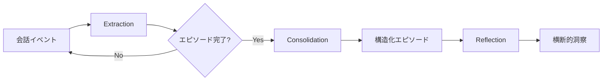

# Bedrock AgentCoreエピソード記憶で顧客サポートエージェントの応答一貫性を向上させる

## この記事でわかること

- **Bedrock AgentCore Memory**のエピソード記憶戦略（Extraction→Consolidation→Reflection）の動作原理と設計パターン
- エピソード記憶を活用した**顧客サポートエージェント**を`bedrock-agentcore` Python SDKで構築する手順
- 過去の対応エピソードをリフレクションとして蓄積し、**類似問い合わせへの応答一貫性**を担保する実装手法
- ネームスペース設計による**マルチテナント対応**と、エピソード・リフレクションの検索最適化
- 運用時のコスト構造と、エピソード肥大化を防ぐ**TTL・ネームスペース分離**の設計指針

## 対象読者

- **想定読者**: 中級〜上級のAWS・LLMアプリケーション開発者
- **必要な前提知識**:
  - AWS Bedrock（Converse API）の基本操作経験
  - Python 3.12+ / boto3 の基礎
  - AIエージェントの会話履歴管理の基本概念
  - 顧客サポートシステムの基本的なワークフロー理解

## 結論・成果

Bedrock AgentCoreのエピソード記憶を顧客サポートエージェントに導入することで、以下のような改善が見込まれます。

- **応答一貫性**: 過去のエピソードとリフレクションを参照することで、同種の問い合わせに対して矛盾のない回答を生成できるようになる（AWSの公式ドキュメントでは、エピソード記憶により「エージェントが過去の経験から学び、将来のインタラクションに適用できる」と説明されている）
- **対応時間の短縮**: 類似エピソードの検索により、過去の成功パターンを再利用でき、エージェントの意思決定プロセスが効率化される
- **運用コスト**: 短期メモリ $0.25/1,000イベント、長期メモリ $0.75/1,000レコード、検索 $0.50/1,000回というAWSの従量課金モデルで、小〜中規模のサポート業務では月額数十ドル程度から開始可能

> **注意**: 上記の改善効果はAWS公式ドキュメントの説明に基づく期待値であり、実際の効果はユースケースやデータ量に依存します。本番導入前には自社環境での評価が必要です。

**関連記事**: エピソード記憶以外のAgentCore Memory戦略（サマリー・ユーザー嗜好・セマンティック）については、[LangGraph×Bedrock AgentCore Memoryで社内検索エージェントのメモリを本番運用する](https://zenn.dev/0h_n0/articles/b622546d617231)も参考にしてください。

## エピソード記憶の仕組みを理解する

Bedrock AgentCoreのエピソード記憶は、他のメモリ戦略（サマリー・セマンティック・ユーザー嗜好）とは異なるアプローチを取ります。会話を「エピソード」という単位で構造化し、さらに複数のエピソードを横断して**リフレクション**（洞察）を自動生成する仕組みです。

### エピソード記憶の3フェーズ

エピソード記憶は以下の3段階で動作します。



1. **Extraction（抽出）**: 進行中の会話を分析し、エピソードの完了を自動検出します。各ターンに対してSituation・Intent・Action・Thought・Assessmentを抽出します
2. **Consolidation（統合）**: エピソードが完了すると、複数ターンの抽出結果を1つの構造化レコードに統合します
3. **Reflection（振り返り）**: 複数のエピソードを横断的に分析し、成功パターン・失敗パターン・ベストプラクティスなどの洞察を生成します

### 他のメモリ戦略との違い

| 戦略 | 格納内容 | 生成タイミング | 主な用途 |
|------|----------|---------------|----------|
| サマリー | 会話の要約 | 各イベント後に随時 | 会話履歴の圧縮 |
| セマンティック | 事実・知識 | 各イベント後に随時 | ファクトの蓄積 |
| ユーザー嗜好 | ユーザーの好み | 各イベント後に随時 | パーソナライゼーション |
| **エピソード** | **何が起き、なぜ成功/失敗したか** | **エピソード完了時のみ** | **経験学習・一貫性向上** |

エピソード記憶の特徴は、レコードが**エピソード完了を検出してから生成される**点です。他の戦略がイベントごとに随時メモリを生成するのに対し、エピソード記憶は会話の「まとまり」を待ってから処理します。このため、進行中の会話では長期メモリが生成されない点に注意が必要です。

### エピソードの構造化フォーマット

統合されたエピソードは、以下の5つの要素で構造化されます。

- **Situation**: 会話が発生した背景・文脈
- **Intent**: ユーザーの主要な目的
- **Assessment**: 目的が達成されたかどうかの評価（Yes/No）
- **Justification**: 評価の根拠
- **Reflection**: そのエピソードから得られた教訓

この構造により、エージェントは「何が起きたか」だけでなく「なぜそうなったか」「次回どうすべきか」まで記録できます。

## 顧客サポートエージェントを実装する

ここからは、Bedrock AgentCoreのエピソード記憶を使った顧客サポートエージェントを実装していきます。

### 環境構築

まず、必要なパッケージをインストールします。

```bash
pip install bedrock-agentcore strands-agents strands-agents-tools
```

動作確認環境: Python 3.12、bedrock-agentcore 1.2.0、us-west-2リージョン（2026年3月時点）

### メモリリソースの作成

エピソード記憶を使うには、まずAgentCore Memoryリソースを作成します。ここでは`episodicMemoryStrategy`を指定します。

```python
# create_memory.py
import boto3
import time

control_client = boto3.client("bedrock-agentcore-control", region_name="us-west-2")

response = control_client.create_memory(
    name="CustomerSupportEpisodicMemory",
    description="顧客サポートエージェント用エピソード記憶",
    memoryStrategies=[
        {
            "episodicMemoryStrategy": {
                "name": "SupportEpisodeTracker",
                "namespaces": [
                    # エピソード: セッション単位で格納
                    "/episodes/{actorId}/{sessionId}/",
                ],
            }
        },
        {
            "userPreferenceMemoryStrategy": {
                "name": "CustomerPreferences",
                "namespaces": [
                    "/preferences/{actorId}/",
                ],
            }
        },
    ],
)

memory_id = response["memory"]["id"]
print(f"Memory ID: {memory_id}")

# ACTIVE になるまで待機
while True:
    status_resp = control_client.get_memory(memoryId=memory_id)
    status = status_resp["memory"]["status"]
    if status == "ACTIVE":
        print("Memory is ACTIVE")
        break
    elif status == "FAILED":
        raise RuntimeError("Memory creation failed")
    print(f"Status: {status}, waiting...")
    time.sleep(10)
```

**なぜエピソード記憶とユーザー嗜好を併用するか:**

- エピソード記憶: 過去の対応事例（成功/失敗パターン）を蓄積
- ユーザー嗜好: 「配送はFedEx希望」「メール連絡を優先」などの個別の好みを蓄積
- 2つを組み合わせることで、過去の経験に基づく一貫した対応と、個人に最適化された対応の両方を実現

### ネームスペース設計のポイント

ネームスペースの設計は、検索効率と運用のしやすさに直結します。

```mermaid
flowchart TD
    A[Memory Resource] --> B[/episodes/]
    A --> C[/preferences/]
    B --> D[/{actorId}/]
    D --> E[/{sessionId}/]
    C --> F[/{actorId}/]
```

エピソード記憶では、リフレクションのネームスペースはエピソードよりも浅い階層に自動生成されます。例えば、エピソードが`/episodes/{actorId}/{sessionId}/`に格納される場合、リフレクションは`/episodes/{actorId}/`に生成されます。

これは意図的な設計で、リフレクションが**複数セッションを横断した洞察**であるため、セッションIDに紐づけずアクター単位で格納されます。

> **注意**: リフレクションはデフォルトで複数のアクター（顧客）を横断して生成される場合があります。顧客間のプライバシーを確保するには、リフレクションのネームスペースにも`{actorId}`を含めるか、ガードレールとの併用を検討してください。

### 会話イベントの記録

顧客との会話をAgentCore Memoryに記録する実装です。ツールの実行結果も含めることで、エピソード記憶の精度が向上します。

```python
# record_conversation.py
import boto3
import time

data_client = boto3.client("bedrock-agentcore", region_name="us-west-2")

MEMORY_ID = "your-memory-id"
ACTOR_ID = "customer-tanaka-001"
SESSION_ID = "support-session-20260306-001"


def record_support_conversation(messages: list[tuple[str, str]]) -> None:
    """会話イベントをAgentCore Memoryに記録する。

    Args:
        messages: (内容, ロール) のタプルリスト。
            ロールは "USER", "ASSISTANT", "TOOL" のいずれか。
    """
    payload = []
    for content, role in messages:
        payload.append(
            {
                "conversational": {
                    "role": role,
                    "content": {"text": content},
                }
            }
        )

    data_client.create_event(
        memoryId=MEMORY_ID,
        actorId=ACTOR_ID,
        sessionId=SESSION_ID,
        eventTimestamp=time.strftime("%Y-%m-%dT%H:%M:%SZ", time.gmtime()),
        payload=payload,
    )


# 顧客サポートの会話例
record_support_conversation(
    [
        ("注文番号ABC-789の配送状況を確認したいです", "USER"),
        ("注文番号ABC-789の状況を確認いたします。", "ASSISTANT"),
        ("lookup_order(order_id='ABC-789') -> status='配送中', carrier='yamato', eta='2026-03-08'", "TOOL"),
        ("ご注文はヤマト運輸で配送中です。到着予定日は3月8日です。", "ASSISTANT"),
        ("ありがとうございます。今後の注文は全て佐川急便でお願いできますか？", "USER"),
        ("承知しました。今後のご注文は佐川急便をデフォルトの配送業者として設定いたします。", "ASSISTANT"),
        ("update_shipping_preference(customer_id='tanaka-001', carrier='sagawa')", "TOOL"),
        ("設定が完了しました。今後のご注文は佐川急便で配送いたします。", "ASSISTANT"),
        ("助かりました。ありがとう。", "USER"),
    ]
)
print("会話イベントを記録しました")
```

**ハマりポイント**: `TOOL`ロールのメッセージを省略すると、エピソードの「Action」フィールドが空になり、リフレクションの質が低下します。AWSの公式ドキュメントでも「`TOOL`結果をCreateEventに含めると最適な結果が得られる」と記載されています。

### エピソードとリフレクションの検索

記録されたエピソードとリフレクションを検索し、新しい問い合わせへの対応に活用する実装です。

```python
# retrieve_episodes.py
import boto3
import json

data_client = boto3.client("bedrock-agentcore", region_name="us-west-2")

MEMORY_ID = "your-memory-id"
ACTOR_ID = "customer-tanaka-001"
SESSION_ID = "support-session-20260306-001"
STRATEGY_ID = "your-strategy-id"


def search_similar_episodes(query: str, top_k: int = 5) -> list[dict]:
    """過去の類似エピソードを検索する。

    エピソードは「intent」フィールドでインデックスされているため、
    ユーザーの意図に近いクエリで検索すると精度が上がる。
    """
    response = data_client.retrieve_memory_records(
        memoryId=MEMORY_ID,
        namespace=f"/episodes/{ACTOR_ID}/{SESSION_ID}/",
        searchCriteria={"searchQuery": query},
    )
    records = response.get("memoryRecordSummaries", [])
    return records[:top_k]


def search_reflections(query: str, top_k: int = 3) -> list[dict]:
    """横断的なリフレクション（洞察）を検索する。

    リフレクションは「use case」フィールドでインデックスされ、
    エピソードよりも浅いネームスペースに格納される。
    """
    response = data_client.retrieve_memory_records(
        memoryId=MEMORY_ID,
        # リフレクションはセッションIDなしの階層
        namespace=f"/episodes/{ACTOR_ID}/",
        searchCriteria={"searchQuery": query},
    )
    records = response.get("memoryRecordSummaries", [])
    return records[:top_k]


# 新しい問い合わせに対して過去の経験を検索
query = "配送に関する問い合わせへの対応方法"

print("=== 類似エピソード ===")
episodes = search_similar_episodes(query)
for ep in episodes:
    print(json.dumps(ep, indent=2, ensure_ascii=False))

print("\n=== リフレクション（横断的洞察） ===")
reflections = search_reflections(query)
for ref in reflections:
    print(json.dumps(ref, indent=2, ensure_ascii=False))
```

**なぜエピソードとリフレクションを分けて検索するか:**

- **エピソード検索**: 特定の顧客の過去対応を確認し、矛盾のない回答を生成するため
- **リフレクション検索**: 全顧客の対応から得られたベストプラクティスを適用するため

この2段階検索が、応答一貫性の向上に直結します。

## Strands Agentと統合して本番エージェントを構築する

ここまでの個別APIを、Strands Agentフレームワークと統合した本番向けの実装を見ていきましょう。

### エージェント統合の全体像

```python
# support_agent.py
import os

from bedrock_agentcore.memory.integrations.strands.config import (
    AgentCoreMemoryConfig,
    RetrievalConfig,
)
from bedrock_agentcore.memory.integrations.strands.session_manager import (
    AgentCoreMemorySessionManager,
)
from strands import Agent

os.environ["BYPASS_TOOL_CONSENT"] = "true"

MEMORY_ID = os.environ["AGENTCORE_MEMORY_ID"]
EPISODE_STRATEGY_ID = os.environ["EPISODE_STRATEGY_ID"]


def create_support_agent(
    customer_id: str,
    session_id: str,
) -> Agent:
    """エピソード記憶付きの顧客サポートエージェントを生成する。"""

    config = AgentCoreMemoryConfig(
        memory_id=MEMORY_ID,
        session_id=session_id,
        actor_id=customer_id,
        retrieval_config={
            # エピソード: セッション単位で検索
            f"/strategies/{EPISODE_STRATEGY_ID}/actors/{{actorId}}/sessions/{{sessionId}}": RetrievalConfig(
                top_k=5
            ),
            # リフレクション: アクター単位で検索
            f"/strategies/{EPISODE_STRATEGY_ID}/actors/{{actorId}}": RetrievalConfig(
                top_k=3
            ),
        },
    )

    session_manager = AgentCoreMemorySessionManager(
        agentcore_memory_config=config,
        region_name="us-west-2",
    )

    system_prompt = """あなたは顧客サポート担当のAIエージェントです。

## 行動指針

1. 過去のエピソード記憶を参照し、同じ顧客への対応に矛盾がないようにしてください
2. リフレクション（横断的洞察）から学んだベストプラクティスを適用してください
3. 顧客の好み（配送業者、連絡方法など）が記憶にある場合は尊重してください
4. 対応できない問い合わせは、正直にその旨を伝え、人間のオペレーターへのエスカレーションを案内してください

## エピソード記憶の活用方法

- 過去のエピソードに類似の問い合わせがあれば、同じ方針で対応してください
- リフレクションに「このアプローチは避けるべき」という洞察があれば、別の方法を選択してください
- 新しい状況では、最も関連性の高いエピソードを参考に判断してください
"""

    agent = Agent(
        model="us.anthropic.claude-sonnet-4-6-20250514-v1:0",
        system_prompt=system_prompt,
        session_manager=session_manager,
    )

    return agent


def main() -> None:
    customer_id = "customer-tanaka-001"
    session_id = "support-20260306-002"

    agent = create_support_agent(customer_id, session_id)

    print("=" * 60)
    print("顧客サポートエージェント（エピソード記憶付き）")
    print("=" * 60)

    while True:
        user_input = input("\n顧客> ").strip()
        if user_input.lower() in ("quit", "exit", "終了"):
            break

        response = agent(user_input)
        print(f"\nエージェント: {response.message}")


if __name__ == "__main__":
    main()
```

### 実装のポイント

**retrieval_configの2層構成が重要です。** エピソードの検索ではセッション単位（`sessions/{sessionId}`）のネームスペースを使い、リフレクションの検索ではアクター単位（`actors/{actorId}`）のネームスペースを使います。この2層構成により、AgentCoreMemorySessionManagerが会話開始時に自動でエピソードとリフレクションの両方を取得し、エージェントのコンテキストに注入します。

**モデル選択の理由**: Claude Sonnet 4.6を選択したのは、顧客サポートのような対話タスクでは、応答品質とレイテンシのバランスが重要だからです。Haiku 4.5はコスト面で有利ですが、過去のエピソードを参照しながら一貫した回答を生成するタスクでは、Sonnet以上の推論能力が求められます。ただし、問い合わせの分類やルーティングなど、単純なタスクにはHaiku 4.5を使い分けるとコスト効率が向上します。

## 応答一貫性を担保する設計パターンを実装する

エピソード記憶を導入するだけでは、応答一貫性は自動的には保証されません。以下の設計パターンを組み合わせることで、実用的な一貫性を実現します。

### パターン1: エピソード検索 → コンテキスト注入 → 回答生成

新しい問い合わせが来た際に、過去のエピソードとリフレクションを検索し、プロンプトに注入するパターンです。

```python
# consistency_pattern.py
from bedrock_agentcore.memory import MemoryClient

memory_client = MemoryClient(region_name="us-west-2")


def build_context_with_episodes(
    memory_id: str,
    strategy_id: str,
    actor_id: str,
    current_query: str,
) -> str:
    """過去のエピソードとリフレクションからコンテキストを構築する。"""

    # 1. 類似エピソードの検索
    episodes = memory_client.retrieve_memories(
        memory_id=memory_id,
        namespace=f"/strategies/{strategy_id}/actors/{actor_id}/",
        query=current_query,
        top_k=3,
    )

    # 2. リフレクション（横断的洞察）の検索
    reflections = memory_client.retrieve_memories(
        memory_id=memory_id,
        namespace=f"/strategies/{strategy_id}/",
        query=current_query,
        top_k=2,
    )

    # 3. コンテキストの構築
    context_parts = []

    if episodes:
        context_parts.append("## 過去の類似対応エピソード\n")
        for i, ep in enumerate(episodes, 1):
            content = ep.get("content", {}).get("text", "")
            context_parts.append(f"### エピソード {i}\n{content}\n")

    if reflections:
        context_parts.append("## リフレクション（ベストプラクティス）\n")
        for i, ref in enumerate(reflections, 1):
            content = ref.get("content", {}).get("text", "")
            context_parts.append(f"### 洞察 {i}\n{content}\n")

    if not context_parts:
        context_parts.append("（過去の関連エピソードはありません。初回対応として最善を尽くしてください。）")

    return "\n".join(context_parts)


# 使用例
context = build_context_with_episodes(
    memory_id="your-memory-id",
    strategy_id="your-strategy-id",
    actor_id="customer-tanaka-001",
    current_query="返品手続きについて知りたい",
)
print(context)
```

### パターン2: リフレクションを活用した対応方針の統一

リフレクションは、複数のエピソードから自動生成される横断的な洞察です。例えば、以下のようなリフレクションが生成されます。

```xml
<reflection>
  <title>配送トラブル対応のベストプラクティス</title>
  <use_cases>
    配送遅延、誤配送、破損などの配送関連の問い合わせ対応時。
    顧客が配送業者の変更を希望している場合。
  </use_cases>
  <hints>
    - 配送業者の変更希望があれば、即座にシステム設定を更新する
    - 過去に配送トラブルが3回以上あった顧客には、優先配送オプションを提案する
    - 配送状況の確認では、追跡番号と到着予定日の両方を必ず伝える
    - 「調査中」で放置せず、24時間以内にフォローアップする
  </hints>
  <confidence>0.8</confidence>
</reflection>
```

このリフレクションがエージェントのコンテキストに注入されることで、どのオペレーター（エージェントインスタンス）が対応しても同じ方針で回答できるようになります。

### パターン3: エピソード完了の検出と注意点

エピソード記憶では、エピソードの完了が自動検出されます。しかし、以下のケースでは意図通りに動作しない場合があります。

| ケース | 問題 | 対策 |
|--------|------|------|
| 顧客が突然離脱 | エピソード未完了のまま残る | セッションタイムアウト設定でフォールバック |
| 1セッションで複数の話題 | 話題の切り替えでエピソードが分割される | 各エピソードは独立して扱う設計にする |
| 長時間の会話 | エピソード検出が遅延する可能性 | 定期的にイベントを送信して検出を促進 |
| リフレクション生成の遅延 | バックグラウンド処理のため即時反映されない | 初回は60秒以上待機してから検索 |

**最初は「1セッションで複数の話題」に遭遇しがちです。** 例えば、顧客が「配送について聞きたい」から「ついでにパスワードも変えたい」と話題を変えた場合、AgentCoreはこれを2つの別エピソードとして検出・記録します。これは意図的な設計であり、エピソードの粒度が細かいほどリフレクションの質が向上します。

## 運用時のコスト最適化と監視を設計する

### コスト構造の理解

Bedrock AgentCore Memoryの料金は、AWSの公式料金ページによると以下の構成です。

| 操作 | 料金 |
|------|------|
| 短期メモリイベント（CreateEvent） | $0.25 / 1,000イベント |
| 長期メモリレコード（エピソード・リフレクション） | $0.75 / 1,000レコード |
| メモリ検索（RetrieveMemoryRecords） | $0.50 / 1,000回 |

### コスト試算例

月間10,000件の顧客サポート対応を想定した場合:

```
短期メモリ: 10,000 セッション × 平均5イベント = 50,000 イベント
  → $0.25 × 50 = $12.50

長期メモリ: 10,000 エピソード + 約500 リフレクション = 10,500 レコード
  → $0.75 × 10.5 = $7.88

メモリ検索: 10,000 セッション × 2回検索（エピソード + リフレクション） = 20,000 回
  → $0.50 × 20 = $10.00

合計: 約 $30.38/月
```

> これにBedrock LLMの推論コスト（モデルによる）が加算されますが、メモリ機能単体では月間1万件規模でも約30ドル程度で収まります。

### エピソード肥大化を防ぐ設計

長期運用では、エピソードとリフレクションが蓄積し続けます。以下の戦略で管理します。

```python
# cleanup_strategy.py
import boto3
from datetime import datetime, timedelta

data_client = boto3.client("bedrock-agentcore", region_name="us-west-2")


def cleanup_old_episodes(
    memory_id: str,
    namespace_prefix: str,
    retention_days: int = 90,
) -> int:
    """指定日数より古いエピソードを削除する。

    リフレクションは蓄積価値が高いため、エピソードのみ削除する方針。
    """
    cutoff = datetime.utcnow() - timedelta(days=retention_days)
    deleted_count = 0

    response = data_client.list_memory_records(
        memoryId=memory_id,
        namespace=namespace_prefix,
    )

    for record in response.get("memoryRecordSummaries", []):
        created_at = record.get("createdAt", "")
        if created_at and datetime.fromisoformat(created_at.replace("Z", "+00:00")) < cutoff.replace(
            tzinfo=None
        ):
            data_client.delete_memory_record(
                memoryId=memory_id,
                memoryRecordId=record["memoryRecordId"],
            )
            deleted_count += 1

    return deleted_count


# 90日以上前のエピソードをクリーンアップ
count = cleanup_old_episodes(
    memory_id="your-memory-id",
    namespace_prefix="/episodes/",
    retention_days=90,
)
print(f"削除したエピソード数: {count}")
```

**なぜリフレクションは残すのか:**

リフレクションは複数のエピソードから抽出された「知恵」です。個々のエピソードを削除しても、そこから学んだベストプラクティスはリフレクションとして残り続けます。これは人間のサポートチームで「対応マニュアルは残すが、個別の対応記録は一定期間で廃棄する」のと同じ発想です。

### 監視すべきメトリクス

エピソード記憶の運用では、以下のメトリクスを監視することを推奨します。

| メトリクス | 閾値の目安 | 対応 |
|-----------|----------|------|
| エピソード生成の遅延 | 5分以上 | 会話が長すぎないか確認 |
| リフレクションの confidence | 0.3未満 | エピソードの質を確認 |
| 検索のヒット率 | 50%未満 | クエリ設計の見直し |
| 月間レコード増加率 | 前月比150%以上 | クリーンアップ頻度の調整 |

## よくある問題と解決方法

| 問題 | 原因 | 解決方法 |
|------|------|----------|
| エピソードが生成されない | 会話が途中で終了し、エピソード完了が検出されない | セッション終了時に明示的にクロージングメッセージを含める |
| リフレクションの質が低い | TOOLロールのメッセージが不足している | CreateEventにツール実行結果を必ず含める |
| 検索で関連エピソードが見つからない | クエリがエピソードのintentフィールドと乖離 | ユーザーの「意図」に近い表現でクエリを構成する |
| リフレクションが他顧客の情報を含む | デフォルトではリフレクションが複数アクターを横断 | ネームスペースに`{actorId}`を含めて分離する |
| Memory作成がFAILED | IAM権限不足 | `bedrock-agentcore:CreateMemory`ポリシーを確認 |

## まとめと次のステップ

**まとめ:**

- Bedrock AgentCoreのエピソード記憶は、Extraction→Consolidation→Reflectionの3フェーズで会話を構造化し、エージェントに「経験からの学習」能力を付与する
- 顧客サポートでは、過去の対応エピソードとリフレクション（横断的洞察）の2層検索が応答一貫性の向上に有効
- ネームスペース設計でマルチテナント対応とプライバシー保護を実現でき、コストも月間1万件規模で約30ドル程度から開始可能
- エピソード完了の自動検出に依存するため、セッション管理とフォールバック設計が重要

**次にやるべきこと:**

- AWSアカウントでAgentCore Memoryリソースを作成し、小規模な顧客サポートシナリオでエピソード記憶の動作を検証する
- リフレクションのconfidenceスコアとヒット率を監視し、エピソードの質とクエリ設計を改善する
- 既存のサポートシステム（チケット管理、CRM）との統合ポイントを設計する

## 参考

- [Episodic memory strategy - Amazon Bedrock AgentCore](https://docs.aws.amazon.com/bedrock-agentcore/latest/devguide/episodic-memory-strategy.html)
- [Scenario: A customer support AI agent using AgentCore Memory](https://docs.aws.amazon.com/bedrock-agentcore/latest/devguide/memory-customer-scenario.html)
- [System prompts for episodic memory strategy](https://docs.aws.amazon.com/bedrock-agentcore/latest/devguide/memory-episodic-prompt.html)
- [Amazon Bedrock AgentCore Python SDK](https://github.com/aws/bedrock-agentcore-sdk-python)
- [Amazon Bedrock AgentCore Memory types](https://docs.aws.amazon.com/bedrock-agentcore/latest/devguide/memory-types.html)
- [Amazon Bedrock AgentCore Pricing](https://aws.amazon.com/bedrock/agentcore/pricing/)
- [DevelopersIO: Amazon Bedrock AgentCore Episodic Memory Strategy](https://dev.classmethod.jp/en/articles/amazon-bedrock-agentcore-episodic-memory-strategy/)

---

:::message
この記事はAI（Claude Code）により自動生成されました。内容の正確性については複数の情報源で検証していますが、実際の利用時は公式ドキュメントもご確認ください。
:::
