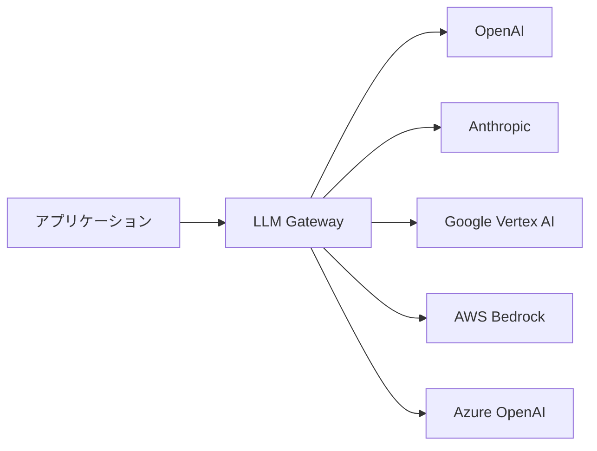
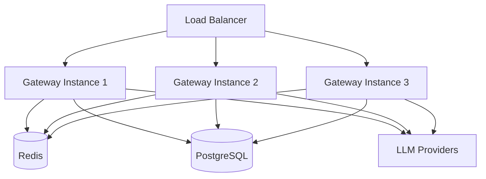
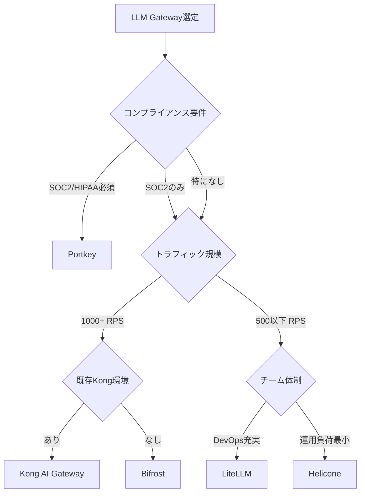

# 本番LLM Gateway比較：LiteLLM・Portkey・Kong・Bifrost・Heliconeの選び方

## この記事でわかること

- Enterprise環境で使えるLLM Gatewayの5製品を多角的に比較できる
- 各ツールのデプロイ方法（Docker / Kubernetes / マネージド）と運用コストを把握できる
- パフォーマンスベンチマーク（RPS・P95/P99レイテンシ）に基づく選定判断ができる
- コンプライアンス（SOC 2 / HIPAA / GDPR）要件に応じた選び方がわかる
- 自社のトラフィック規模・チーム体制に合ったGatewayを選定できる

## 対象読者

- **想定読者**: 中級〜上級のバックエンド・インフラエンジニア
- **必要な前提知識**:
  - OpenAI API（GPT-4o等）の基本的な利用経験
  - Docker / Kubernetesの基礎知識
  - REST APIの設計・運用経験

## 結論・成果

5つのLLM Gatewayを**パフォーマンス・コスト・コンプライアンス・運用負荷**の4軸で比較した結果、以下の選定指針が得られました。

- **高トラフィック（1,000 RPS超）**: BifrostまたはKong AI Gatewayが有力。Kongのベンチマークでは約23,600 RPSを達成し、LiteLLMの約8.6倍のスループットを記録しています
- **規制産業（金融・医療）**: PortkeyがSOC 2 / HIPAA / GDPR対応で、ガバナンス機能が充実
- **プロトタイピング・開発環境**: LiteLLMが100以上のプロバイダー対応で、セットアップの手軽さで優位
- **コスト重視の中規模チーム**: Heliconeが$20/月/10万リクエスト〜と手頃な価格帯

ただし、各ベンチマークはテスト条件が異なるため、自社環境での検証が不可欠です。

## LLM Gatewayとは何か

LLM Gateway（AIゲートウェイ）は、**アプリケーションとLLMプロバイダーの間に配置するプロキシ層**です。OpenAI・Anthropic・Google Vertex AIなど複数のプロバイダーへのリクエストを統一的に管理し、以下の機能を提供します。



LLM Gatewayが解決する課題は主に4つです。

1. **マルチプロバイダー管理**: 各プロバイダーのSDK差異を吸収し、統一APIで利用
2. **可用性向上**: フェイルオーバー・リトライ・ロードバランシングの自動化
3. **コスト管理**: リクエスト単位のコスト追跡、キャッシュによる重複リクエスト削減
4. **ガバナンス**: レート制限、PII検出、アクセス制御、監査ログ

単一プロバイダーのみ使う小規模プロジェクトでは不要ですが、**本番環境で複数モデルを使い分ける場合や、チーム横断でLLM利用を管理する場合**に必須のインフラとなります。

## 5つのLLM Gatewayを比較する

ここでは2026年3月時点で本番利用実績のある5つのGatewayを取り上げます。まず全体像を表で整理し、その後に各ツールの詳細を見ていきます。

### 全体比較表

| 項目 | LiteLLM | Portkey | Kong AI Gateway | Bifrost | Helicone |
|------|---------|---------|-----------------|---------|----------|
| **言語** | Python | Node.js | Lua/Go | Go | Rust |
| **ライセンス** | MIT (OSS) | OSS + 商用 | 商用 + OSS | MIT (OSS) | OSS + 商用 |
| **対応プロバイダー** | 100+ | 1,600+ | 主要5+ | 15+ | 主要プロバイダー |
| **RPS（実測）** | ~2,740 | ~10,400 | ~23,600 | 5,000+（公称） | ~10,000（公称） |
| **P95レイテンシ** | 170ms | 72ms | 25ms | 50ms未満（公称） | 1-5ms |
| **SOC 2** | - | ✅ | - | - | ✅ |
| **HIPAA** | - | ✅ | - | - | - |
| **セルフホスト** | ✅ | ✅ | ✅ | ✅ | ✅ |
| **マネージド** | AWS Marketplace | ✅ | Kong Konnect | - | ✅ |
| **最低コスト** | 無料（OSS） | 無料〜$49/月 | 要問合せ | 無料（OSS） | 無料〜$20/月 |

> **注意**: RPSとレイテンシの数値はKong社のベンチマーク（Kong Gateway 3.10, Portkey OSS 1.9.19, LiteLLM 1.63.7, AWS EKS c5.4xlarge, 400 VU, 3分間テスト）に基づきます。Bifrost・Heliconeは各社の公称値です。テスト条件が異なるため、直接比較には注意が必要です。

### LiteLLM：プロバイダーカバレッジで選ぶなら

LiteLLMはPythonベースのオープンソースLLM Gatewayで、**100以上のプロバイダー**に対応する業界屈指のカバレッジを持ちます。OpenAI互換APIを提供するため、既存のOpenAI SDK呼び出しをそのまま流用できます。

```yaml
# litellm_config.yaml
# LiteLLMの設定例
model_list:
  - model_name: "gpt-4o"
    litellm_params:
      model: "openai/gpt-4o"
      api_key: "os.environ/OPENAI_API_KEY"
  - model_name: "gpt-4o"
    litellm_params:
      model: "azure/gpt-4o"
      api_key: "os.environ/AZURE_API_KEY"
      api_base: "https://my-endpoint.openai.azure.com"
  - model_name: "claude-sonnet"
    litellm_params:
      model: "anthropic/claude-sonnet-4-20250514"
      api_key: "os.environ/ANTHROPIC_API_KEY"

router_settings:
  routing_strategy: "least-busy"
  num_retries: 3
  timeout: 30
```

```bash
# Docker でのデプロイ
docker run -d \
  --name litellm \
  -p 4000:4000 \
  -v $(pwd)/litellm_config.yaml:/app/config.yaml \
  -e OPENAI_API_KEY=$OPENAI_API_KEY \
  -e ANTHROPIC_API_KEY=$ANTHROPIC_API_KEY \
  ghcr.io/berriai/litellm:main-latest \
  --config /app/config.yaml
```

**デプロイ方法**: Docker / Kubernetes Helm Chart / AWS Marketplace

**なぜLiteLLMを選ぶか:**
- HuggingFace、Ollama、vLLM等のローカルモデルにも対応
- YAML設定のみでルーティング構成が可能
- コミュニティが活発で、ドキュメントが充実

**制約と注意点:**

> LiteLLMはPythonのGIL（Global Interpreter Lock）により、シングルプロセスでのスループットに上限があります。Kong社のベンチマークでは、400同時ユーザー時にP95レイテンシが170msに達しています。500 RPSを超える環境では、複数インスタンスのデプロイとロードバランサーの配置が必要です。

**コスト構造**:
- OSS版: ソフトウェア無料、インフラ費用のみ（本番構成で月$2,000〜$3,500程度と報告されている）
- Enterprise版: 年額$30,000〜（SSO、監査ログ、SLAサポート付き）

### Portkey：ガバナンスとコンプライアンスで選ぶなら

Portkeyは単なるプロキシではなく、**AI利用の統合コントロールプレーン**として設計されています。2026年2月にSeries Aで$15M調達し、Enterprise機能を急速に拡充しています。

```typescript
// Portkey SDK を使ったフェイルオーバー付きリクエスト
import Portkey from "portkey-ai";

const portkey = new Portkey({
  apiKey: process.env.PORTKEY_API_KEY,
});

// フェイルオーバー設定: OpenAI → Anthropic の順で試行
const response = await portkey.chat.completions.create({
  messages: [{ role: "user", content: "Hello" }],
  model: "gpt-4o",
  // Portkey固有のヘッダーでルーティング制御
}, {
  config: {
    strategy: {
      mode: "fallback",
      on_status_codes: [429, 500, 503],
    },
    targets: [
      { provider: "openai", override_params: { model: "gpt-4o" } },
      { provider: "anthropic", override_params: { model: "claude-sonnet-4-20250514" } },
    ],
  },
});
```

**デプロイ方法**: クラウドSaaS / セルフホスト / ハイブリッド / エアギャップ

**なぜPortkeyを選ぶか:**
- **コンプライアンス**: SOC 2、HIPAA、GDPR、ISO 27001対応。カスタムBAA（Business Associate Agreement）にも対応
- **オブザーバビリティ**: リクエスト単位でユーザー・モデル・コスト・レイテンシをトレース
- **ガードレール**: PII検出、コンテンツフィルタリング、プロンプトインジェクション検出を組み込み

**制約と注意点:**

> Portkeyの高度なオブザーバビリティ・ガードレール機能は、20〜40msのレイテンシオーバーヘッドを伴います。レイテンシがクリティカルなリアルタイム対話システムでは、この追加レイテンシの影響を事前に検証してください。また、小規模チームには機能が過剰となる可能性があります。

**コスト構造**:
- 無料枠: ゲートウェイ機能は無制限
- Pro: $49/月〜（高度なオブザーバビリティ）
- Enterprise: カスタム価格（プライベートクラウド、VPCホスティング、24/7サポート）

### Kong AI Gateway：既存API基盤と統合するなら

Kong AI GatewayはAPIゲートウェイの老舗であるKongが提供するAI拡張機能です。**既にKongを導入している組織**では、追加のインフラ無しにLLMプロキシ機能を利用できます。

```yaml
# kong.yml - Kong AI Gateway の宣言的構成例
_format_version: "3.0"

services:
  - name: openai-chat
    url: https://api.openai.com
    routes:
      - name: openai-route
        paths:
          - /ai/openai
    plugins:
      - name: ai-proxy
        config:
          route_type: llm/v1/chat
          auth:
            header_name: Authorization
            header_value: "Bearer ${OPENAI_API_KEY}"
          model:
            provider: openai
            name: gpt-4o
      - name: ai-rate-limiting-advanced
        config:
          limit:
            - 100
          window_size:
            - 60
          strategy: redis
```

**デプロイ方法**: Kong Konnect（マネージド）/ Kubernetes / Docker

**なぜKongを選ぶか:**
- 既存のKong APIゲートウェイにプラグインとして追加可能
- Kong社のベンチマークでは約23,600 RPSを達成（P95: 24.93ms）
- 認証、レート制限、PII除去（12言語対応）など既存プラグインの活用
- RAGパイプラインの組み込みサポート

**制約と注意点:**

> Kong AI Gatewayは**Kong Konnect**プラットフォームの一部として提供されるため、Kongを使っていない組織ではインフラ全体の導入が必要になります。学習コストが高く、AI Gateway単体で使い始めるのは難しいでしょう。また、対応プロバイダーはOpenAI、Anthropic、AWS Bedrock、Azure AI、Google Vertexの主要5社に限られます。

**コスト構造**:
- Kong Konnect: 月額固定 + リクエスト量ベース（要問い合わせ）
- セルフホスト（Kong Gateway OSS）: 無料だがAI機能は制限あり

### Bifrost：パフォーマンスを最優先するなら

BifrostはGo製のオープンソースLLM Gatewayで、**11μsのオーバーヘッド**を公称しています。Maxim AI社が開発し、レイテンシ性能に特化した設計が特徴です。

```bash
# NPX で30秒デプロイ（開発環境向け）
npx @maximhq/bifrost

# Docker で本番デプロイ
docker run -d \
  --name bifrost \
  -p 8080:8080 \
  -v $(pwd)/config:/app/data \
  maximhq/bifrost
```

```yaml
# bifrost-config.yaml の例
providers:
  - name: openai
    api_key: "${OPENAI_API_KEY}"
    models:
      - gpt-4o
      - gpt-4o-mini
  - name: anthropic
    api_key: "${ANTHROPIC_API_KEY}"
    models:
      - claude-sonnet-4-20250514

routing:
  strategy: adaptive  # パフォーマンスベースの動的ルーティング
  fallback: true

cluster:
  enabled: true       # マルチインスタンスクラスターモード
```

**デプロイ方法**: Docker / Kubernetes / NPXプリコンパイルバイナリ / Web UIによるゼロコンフィグ

**なぜBifrostを選ぶか:**
- Go製のため、Pythonベースのゲートウェイと比較してスループットが高い
- クラスターモードでマルチインスタンス展開が可能
- セマンティックキャッシュ、バジェットコントロールを内蔵
- Web UIで視覚的な設定・モニタリングが可能

**制約と注意点:**

> Bifrostは2025年にリリースされた比較的新しいツールで、対応プロバイダーは15社程度と、LiteLLMの100+と比較すると限定的です。また、11μsという数値はBifrost社自身の計測であり、Kong社ベンチマークのような第三者検証が公開されていない点には留意が必要です。Enterpriseサポートの実績も限られます。

**コスト構造**:
- OSS版: 完全無料
- Enterprise: サポート付き（要問い合わせ）

### Helicone：オブザーバビリティ重視なら

HeliconeはRust製のLLMオブザーバビリティプラットフォームで、**AI Gateway機能を2024年中期に追加**しています。YCombinator W23出身のスタートアップです。

```typescript
// Helicone の統合例（OpenAI SDK のベースURL変更のみ）
import OpenAI from "openai";

const openai = new OpenAI({
  apiKey: process.env.OPENAI_API_KEY,
  baseURL: "https://oai.helicone.ai/v1",
  defaultHeaders: {
    "Helicone-Auth": `Bearer ${process.env.HELICONE_API_KEY}`,
    // リクエスト単位のメタデータ
    "Helicone-User-Id": "user_123",
    "Helicone-Session-Id": "session_abc",
    // キャッシュ有効化
    "Helicone-Cache-Enabled": "true",
  },
});

const response = await openai.chat.completions.create({
  model: "gpt-4o",
  messages: [{ role: "user", content: "Hello" }],
});
```

**デプロイ方法**: クラウドSaaS / Docker（15MBバイナリ）/ Kubernetes Helm Chart / ハイブリッド

**なぜHeliconeを選ぶか:**
- ベースURLの変更だけで導入可能（コード変更が最小限）
- Rust製で15MBのシングルバイナリ、エッジデプロイにも対応
- セマンティックキャッシュにより本番環境で30〜50%のキャッシュヒット率（Helicone社の報告）
- SOC 2対応、GDPR準拠

**制約と注意点:**

> Heliconeは元々オブザーバビリティプラットフォームとして設計されており、ゲートウェイ機能は2024年中期の追加です。ルーティング戦略やガードレール機能はPortkeyやKongと比較すると発展途上です。Enterprise向けHelm Chartの入手には個別問い合わせが必要です。

**コスト構造**:
- 無料枠: 月10,000リクエスト
- Growth: $20/月/10万リクエスト
- Enterprise: カスタム価格（専用Helm Chart、SLA付き）

## デプロイアーキテクチャを設計する

本番環境へのLLM Gateway導入では、デプロイ形態の選択が運用コストに直結します。ここでは3つの典型的なパターンを紹介します。

### パターン1: セルフホスト（フルコントロール）



**対象ツール**: LiteLLM、Bifrost、Kong（OSS版）、Helicone

Kubernetesクラスター上に複数のGatewayインスタンスをデプロイし、ロードバランサーで分散させます。LiteLLMの場合、500 RPS超ではRedisによるレート制限の共有とPostgreSQLによる設定管理が必要です。

```yaml
# Kubernetes Deployment 例（LiteLLM）
apiVersion: apps/v1
kind: Deployment
metadata:
  name: litellm-proxy
spec:
  replicas: 3
  selector:
    matchLabels:
      app: litellm
  template:
    metadata:
      labels:
        app: litellm
    spec:
      containers:
        - name: litellm
          image: ghcr.io/berriai/litellm:main-latest
          ports:
            - containerPort: 4000
          args: ["--config", "/app/config.yaml"]
          env:
            - name: DATABASE_URL
              valueFrom:
                secretKeyRef:
                  name: litellm-secrets
                  key: database-url
            - name: REDIS_HOST
              value: "redis-service"
          resources:
            requests:
              cpu: "500m"
              memory: "512Mi"
            limits:
              cpu: "2000m"
              memory: "2Gi"
```

**月額コスト目安**（AWS EKS、3インスタンス構成）:
- コンピュート（c5.xlarge × 3）: 約$370
- RDS PostgreSQL: 約$150
- ElastiCache Redis: 約$100
- ロードバランサー: 約$30
- **合計: 約$650/月**（ソフトウェアライセンス除く）

### パターン2: マネージドSaaS（運用負荷最小）

**対象ツール**: Portkey（クラウド版）、Helicone（クラウド版）、Kong Konnect

インフラ管理が不要で、APIキーの設定だけで利用開始できます。小規模チームやPoC段階で有効です。

**月額コスト目安**（月100万リクエスト想定）:
- Portkey Pro: $49/月〜（ボリュームで変動）
- Helicone Growth: 約$200/月
- Kong Konnect: 要問い合わせ

### パターン3: ハイブリッド（データ主権 + 管理性）

**対象ツール**: Portkey（ハイブリッド構成）、Helicone（ハイブリッド構成）

Gateway自体はVPC内にデプロイし、管理コンソールはクラウド側のSaaSを利用する構成です。データ主権が必要だが、運用ダッシュボードのメンテナンスは避けたい場合に適しています。

## ユースケース別の選定ガイドを整理する

実際の選定では、チームの規模・スキルセット・規制要件によって最適解が異なります。以下の判断フローを参考にしてください。



### ユースケース別推奨

| ユースケース | 推奨Gateway | 理由 |
|-------------|-------------|------|
| **スタートアップのPoC** | LiteLLM | 無料、100+プロバイダー、YAMLのみで構成可能 |
| **金融・医療系SaaS** | Portkey | SOC 2/HIPAA/GDPR対応、監査ログ、PII検出 |
| **既存Kong APIインフラ** | Kong AI Gateway | プラグイン追加のみ、高スループット |
| **リアルタイムチャット** | Bifrost | μsレベルのオーバーヘッド、アダプティブルーティング |
| **コスト最適化重視** | Helicone | セマンティックキャッシュ、詳細コスト追跡 |
| **エアギャップ環境** | Portkey / LiteLLM | 完全セルフホスト対応 |
| **100+モデル対応必須** | LiteLLM | プロバイダーカバレッジが圧倒的 |

### よくある失敗パターン

実際の導入で報告されている、よくある判断ミスを紹介します。

| 失敗パターン | 原因 | 回避策 |
|-------------|------|--------|
| LiteLLMで大規模トラフィック | PythonのGIL制約を見落とし | 事前に負荷テスト。500 RPS超は複数インスタンス必須 |
| 小規模チームでPortkey Enterprise | 機能過剰でROIが合わない | 無料枠のゲートウェイ機能で十分か検証 |
| Kong AI Gateway単独導入 | Kongエコシステム全体の学習コスト | 既存Kong環境がなければ他を検討 |
| ベンチマーク数値だけで選定 | テスト条件の違いを見落とし | 自社ワークロードで再現テスト |

## パフォーマンスベンチマークを読み解く

各ツールのパフォーマンスデータは複数のソースから報告されていますが、**テスト条件が統一されていない**点を理解しておく必要があります。

### Kong社ベンチマーク（第三者比較として参照可能）

Kong社が公開したベンチマーク（2025年、AWS EKS c5.4xlarge 16vCPU/32GB、400 VU、3分間テスト）では以下の結果が報告されています。

| 指標 | Kong Gateway 3.10 | Portkey OSS 1.9.19 | LiteLLM 1.63.7 |
|------|-------------------|--------------------|-----------------|
| **RPS** | 23,600 | 10,400 | 2,740 |
| **P95 レイテンシ** | 24.93ms | 72.44ms | 170.31ms |
| **P99 レイテンシ** | 31.37ms | 92.70ms | 215.82ms |
| **ベースライン比** | 81.4% | 35.9% | 9.4% |

> **読み方の注意**: このベンチマークは「プロキシのみ（ポリシー無効）」の設定です。PortkeyのPII検出やコンテンツフィルタリングを有効にすると、レイテンシはさらに増加します。また、Kong社自身がテスト主体であるため、自社に有利なテスト条件となっている可能性があります。

### 各社公称値

| ツール | 公称パフォーマンス | 計測条件 | 第三者検証 |
|--------|-------------------|---------|-----------|
| **Bifrost** | 11μsオーバーヘッド / 5,000+ RPS | 自社テスト | なし |
| **Helicone** | 1-5ms P95 / 10,000 RPS | 自社テスト | なし |
| **LiteLLM** | 公式ベンチマーク非公開 | — | Kong社テストで2,740 RPS |

パフォーマンス数値は参考値として捉え、本番導入前には**自社環境での負荷テスト**を実施してください。

## 移行戦略を計画する

既存のシステムからLLM Gatewayを導入する際、または別のGatewayに乗り換える際のステップを整理します。

### ステップ1: 現状把握

まず自社のLLM利用状況を把握します。

```python
# 現状のLLM利用パターンを分析するスクリプト例
import json
from collections import Counter
from datetime import datetime, timedelta

def analyze_llm_usage(log_file: str) -> dict:
    """LLM APIログからGateway選定に必要な指標を抽出する"""
    providers: Counter = Counter()
    models: Counter = Counter()
    daily_requests: Counter = Counter()
    latencies: list[float] = []

    with open(log_file) as f:
        for line in f:
            entry = json.loads(line)
            providers[entry["provider"]] += 1
            models[entry["model"]] += 1
            daily_requests[entry["date"]] += 1
            latencies.append(entry["latency_ms"])

    latencies.sort()
    p95_idx = int(len(latencies) * 0.95)

    return {
        "total_requests": sum(daily_requests.values()),
        "avg_daily_rps": sum(daily_requests.values()) / len(daily_requests) / 86400,
        "peak_daily_requests": max(daily_requests.values()),
        "providers_used": len(providers),
        "top_models": models.most_common(5),
        "p95_latency_ms": latencies[p95_idx] if latencies else 0,
        "estimated_monthly_cost": sum(daily_requests.values()) / len(daily_requests) * 30,
    }
```

### ステップ2: 段階的導入

一度に全トラフィックをGateway経由にするのではなく、**カナリアリリース**方式で段階的に移行します。

1. **開発環境で検証**（1週間）: Gateway経由で全モデル呼び出しが正常動作するか
2. **本番の10%で試行**（2週間）: レイテンシの増加幅、エラー率を監視
3. **本番の50%に拡大**（2週間）: スケーリング挙動、コスト変動を確認
4. **全トラフィック切り替え**

### ステップ3: 評価基準の設定

導入後の効果測定では以下の指標を追跡します。

| 指標 | 導入前の基準 | 目標 |
|------|------------|------|
| LLM APIエラー率 | 現状値を計測 | 50%削減 |
| プロバイダー障害時の復旧時間 | 手動対応時間 | 自動フェイルオーバー（<1秒） |
| コスト可視性 | なし | リクエスト単位で追跡可能 |
| 月額LLMコスト | 現状値 | キャッシュにより10-30%削減 |

## まとめと次のステップ

**まとめ:**
- LLM Gatewayは本番環境でのマルチプロバイダー管理・可用性向上・コスト最適化に不可欠なインフラ
- **パフォーマンス重視**ならBifrostまたはKong、**コンプライアンス重視**ならPortkey、**手軽さ重視**ならLiteLLMまたはHelicone
- ベンチマーク数値はテスト条件に依存するため、自社環境での検証が不可欠
- 導入はカナリアリリース方式で段階的に進め、効果測定の指標を事前に定める
- 関連記事: [Portkey AIゲートウェイで本番LLMアプリの信頼性とコストを最適化する](https://zenn.dev/0h_n0/articles/52a2ca72092ee5)、[LLMルーター実践ガイド：RouteLLM×LiteLLMでAPIコスト60%削減を実現する](https://zenn.dev/0h_n0/articles/3e603a1b91e2e0)

**次にやるべきこと:**
- 自社のLLM利用ログを分析し、RPS・プロバイダー数・コンプライアンス要件を把握する
- 候補2〜3ツールを開発環境でPoCし、レイテンシ・スループットを実測する
- デプロイ形態（セルフホスト / マネージド / ハイブリッド）をチーム体制と合わせて決定する

## 参考

- [AI Gateway Benchmark: Kong AI Gateway, Portkey, and LiteLLM - Kong Engineering Blog](https://konghq.com/blog/engineering/ai-gateway-benchmark-kong-ai-gateway-portkey-litellm)
- [Top 5 LLM Gateways in 2026 - DEV Community](https://dev.to/varshithvhegde/top-5-llm-gateways-in-2026-a-deep-dive-comparison-for-production-teams-34d2)
- [6 Best LLM Gateways in 2026 - TrueFoundry](https://www.truefoundry.com/blog/best-llm-gateways)
- [Best Enterprise LLM Gateways in 2026 - Maxim AI](https://www.getmaxim.ai/articles/best-enterprise-llm-gateways-in-2026-a-comparative-guide/)
- [LiteLLM Documentation](https://docs.litellm.ai/)
- [Portkey Documentation](https://portkey.ai/docs)
- [Bifrost GitHub Repository](https://github.com/maximhq/bifrost)
- [Helicone Documentation](https://www.helicone.ai/)

---

:::message
この記事はAI（Claude Code）により自動生成されました。内容の正確性については複数の情報源で検証していますが、実際の利用時は公式ドキュメントもご確認ください。
:::
