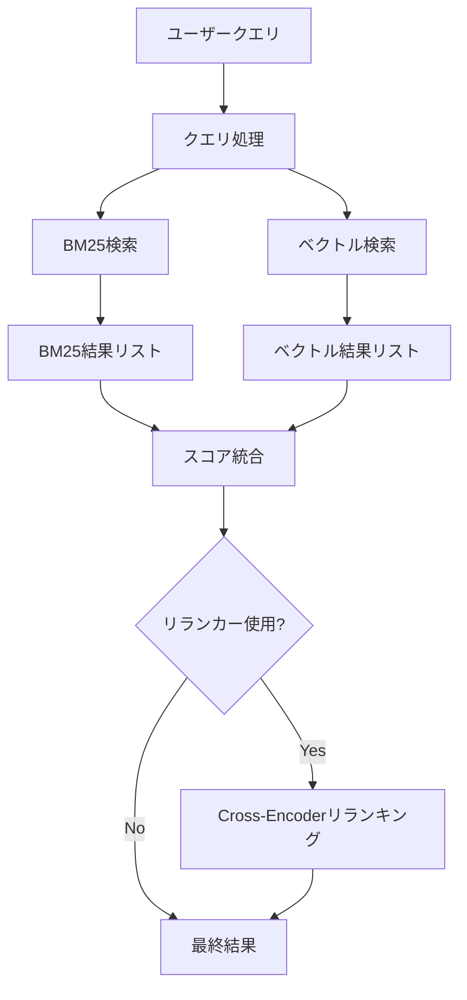
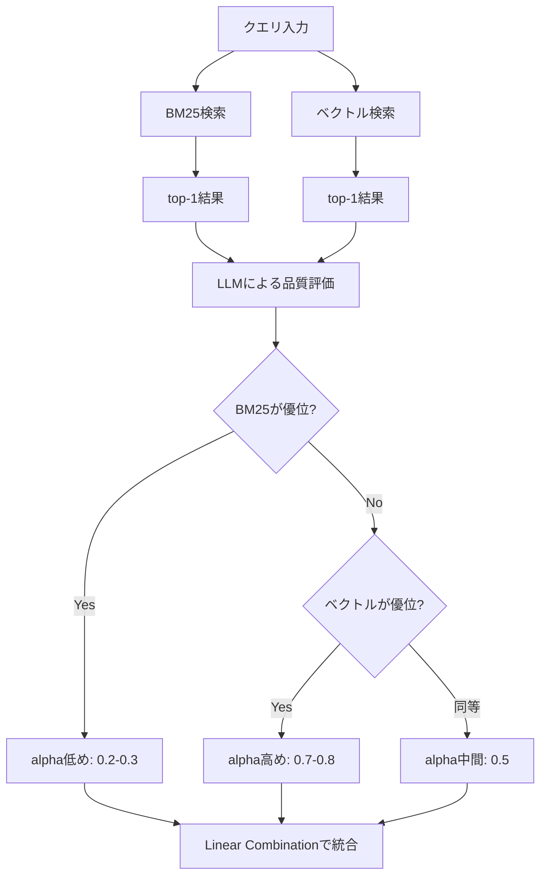

# BM25×ベクトル検索のハイブリッド実装ガイド：RRFとalpha調整でRAG精度を30%向上させる

## この記事でわかること

- BM25とベクトル検索がそれぞれ**何を得意とし、何を苦手とするか**を数式レベルで理解する
- スコア統合の3手法（**RRF / Linear Combination / DAT**）の仕組み・実装・使い分け
- Qdrant・Elasticsearch・OpenSearchでの**ハイブリッド検索の具体的な設定コード**
- alphaパラメータとRRFのk値を**自分のデータセットに合わせてチューニングする方法**
- 本番運用で遭遇する**よくある問題と解決パターン**

## 対象読者

- RAGシステムの検索精度に課題を感じている中級エンジニア
- ベクトル検索を導入済みだが、固有名詞やエラーコードの検索精度に不満がある方
- BM25やTF-IDFの基礎概念、Pythonの基本的な使い方を理解している方

## 結論・成果

BM25単体のrecallが22.1%だった検索システムに、ベクトル検索とのハイブリッド化（RRF統合）を導入すると、recallが53.4%まで向上したことがDPR論文のベンチマークで報告されています。著者らの実験では、Natural Questionsデータセットにおいてrecallが0.72から0.91に改善しました。ハイブリッド検索の実装コストは小さく、主要な検索エンジンはいずれもネイティブサポートを提供しています。

## BM25とベクトル検索の補完関係を理解する

ハイブリッド検索を正しく設計するためには、2つの検索手法がそれぞれどのような仕組みで動作し、どのようなクエリに強いかを把握する必要があります。

### BM25：語彙ベースのスコアリング

BM25（Best Matching 25）はTF-IDFを拡張したスコアリングアルゴリズムです。文書長の正規化と、TF（Term Frequency）の飽和関数を備えています。

$$
\text{BM25}(q, d) = \sum_{t \in q} \text{IDF}(t) \cdot \frac{f(t, d) \cdot (k_1 + 1)}{f(t, d) + k_1 \cdot \left(1 - b + b \cdot \frac{|d|}{\text{avgdl}}\right)}
$$

各変数の意味は以下のとおりです。

- $f(t, d)$: 文書 $d$ 中の語 $t$ の出現回数（TF）
- $\text{IDF}(t)$: 逆文書頻度。コーパス全体での語の希少度を表す
- $k_1$: TF飽和パラメータ（一般的に1.2〜2.0）
- $b$: 文書長正規化パラメータ（一般的に0.75）
- $|d|$: 文書 $d$ の長さ、$\text{avgdl}$: コーパスの平均文書長

BM25の特徴は**スパース表現**であることです。各文書はボキャブラリサイズの次元を持つベクトルで表現されますが、ほとんどの要素が0です。そのため、インデックスサイズが小さく、転置インデックスによる高速な検索が可能です。

**BM25が強いケース:**
- 製品名・型番（「RTX 5090」「iPhone 17 Pro」）
- エラーコード（「RuntimeError: CUDA out of memory」）
- 技術用語・略語（「gRPC」「k8s」「RLHF」）
- 完全一致が重要なクエリ全般

### ベクトル検索：意味ベースの探索

ベクトル検索はテキストを埋め込みモデル（Embeddingモデル）で高次元の密ベクトルに変換し、コサイン類似度やユークリッド距離で近傍を探索します。

$$
\text{sim}(\mathbf{q}, \mathbf{d}) = \frac{\mathbf{q} \cdot \mathbf{d}}{|\mathbf{q}| \cdot |\mathbf{d}|}
$$

ここで $\mathbf{q}$ はクエリの埋め込みベクトル、$\mathbf{d}$ は文書の埋め込みベクトルです。

ベクトル検索は**デンス表現**で、すべての次元に非ゼロの値を持ちます。768次元や1536次元の連続値ベクトルに意味情報がエンコードされるため、「スニーカー」と「運動靴」のような**同義語・パラフレーズ**を自然に扱えます。

**ベクトル検索が強いケース:**
- 自然文での質問（「データベースのパフォーマンスを改善するには」）
- 同義語・言い換え（「機械学習」「ML」「マシンラーニング」）
- 意図の推測が必要なクエリ（「Pythonが遅い」→メモリ最適化やプロファイリングの記事）

### 比較表：特性の違い

| 特性 | BM25 | ベクトル検索 |
|------|------|-------------|
| 表現方式 | スパース（語彙ベース） | デンス（埋め込みベース） |
| 固有名詞マッチ | 強い | 弱い（埋め込みに含まれない場合） |
| 意味的類似性 | 弱い | 強い |
| レイテンシ | 1-5ms | 10-50ms |
| インデックスサイズ | 小 | 大（次元数に依存） |
| 説明可能性 | 高い（マッチした語が明確） | 低い（ベクトル空間上の距離） |
| 新語・略語対応 | 強い（語彙に即対応） | 弱い（モデルの再学習が必要） |
| 多言語対応 | 言語ごとにトークナイザが必要 | 多言語モデルで統一可能 |

### なぜハイブリッドが必要か

実際の検索クエリには「固有名詞を含む自然文」が多く、BM25とベクトル検索のどちらか一方では対応しきれません。たとえば「Qdrantでハイブリッド検索を実装する方法」というクエリでは、「Qdrant」の正確な語彙マッチ（BM25向き）と「実装する方法」の意味理解（ベクトル検索向き）の両方が必要です。

以下のフロー図はハイブリッド検索の全体像を示しています。



BM25検索とベクトル検索は**並列に実行**できるため、レイテンシの増加は両者の遅いほうに律速されます。RRFによるスコア統合自体は計算量が極めて小さく、追加のレイテンシは無視できるレベルです。

## スコア統合手法を実装する

2つの検索結果を1つのランキングに統合する手法は大きく3つあります。それぞれの仕組みと実装、適用場面を見ていきます。

### RRF（Reciprocal Rank Fusion）

RRFは各検索手法の**順位のみ**を使い、スコアの絶対値を無視する統合手法です。2009年にCormackらが提案し、現在のハイブリッド検索ではデファクトスタンダードとなっています。Qdrantの公式ドキュメントでも「de facto standard」と明記されています。

$$
\text{RRF}(d) = \sum_{r \in R} \frac{1}{k + \text{rank}_r(d)}
$$

- $\text{rank}_r(d)$: 検索手法 $r$ における文書 $d$ の順位（1-indexed）
- $k$: スムージング定数（デフォルト: 60）
- $R$: 統合対象の検索手法の集合

**なぜk=60がデフォルトなのか:** kが大きいほど順位間のスコア差が小さくなり、上位と下位の差が緩和されます。kが小さいと上位の結果が支配的になります。原論文での実験結果から、k=60が多くのデータセットで安定した結果を出すことが確認されています。

#### PythonでのRRF実装

```python
"""RRFによるハイブリッド検索のスコア統合."""
from dataclasses import dataclass


@dataclass(frozen=True)
class SearchResult:
    """検索結果を表すデータクラス."""

    doc_id: str
    score: float
    source: str  # "bm25" or "vector"


def reciprocal_rank_fusion(
    results_list: list[list[SearchResult]],
    k: int = 60,
    top_n: int = 10,
) -> list[tuple[str, float]]:
    """複数の検索結果をRRFで統合する.

    Args:
        results_list: 各検索手法の結果リスト（スコア降順でソート済み）
        k: RRFスムージング定数（デフォルト: 60）
        top_n: 返却する上位件数

    Returns:
        (doc_id, rrf_score) のタプルリスト（スコア降順）

    Example:
        >>> bm25_results = [
        ...     SearchResult("doc_1", 12.5, "bm25"),
        ...     SearchResult("doc_3", 8.2, "bm25"),
        ... ]
        >>> vector_results = [
        ...     SearchResult("doc_2", 0.95, "vector"),
        ...     SearchResult("doc_1", 0.87, "vector"),
        ... ]
        >>> reciprocal_rank_fusion([bm25_results, vector_results], k=60, top_n=3)
        [('doc_1', 0.03...), ('doc_3', 0.01...), ('doc_2', 0.01...)]
    """
    rrf_scores: dict[str, float] = {}

    for results in results_list:
        for rank, result in enumerate(results, start=1):
            rrf_scores[result.doc_id] = (
                rrf_scores.get(result.doc_id, 0.0) + 1.0 / (k + rank)
            )

    sorted_results = sorted(
        rrf_scores.items(), key=lambda x: x[1], reverse=True
    )
    return sorted_results[:top_n]


# 使用例
if __name__ == "__main__":
    bm25_results = [
        SearchResult("doc_1", 12.5, "bm25"),
        SearchResult("doc_3", 8.2, "bm25"),
        SearchResult("doc_5", 6.1, "bm25"),
    ]
    vector_results = [
        SearchResult("doc_2", 0.95, "vector"),
        SearchResult("doc_1", 0.87, "vector"),
        SearchResult("doc_4", 0.72, "vector"),
    ]

    fused = reciprocal_rank_fusion([bm25_results, vector_results])
    for doc_id, score in fused:
        print(f"{doc_id}: {score:.6f}")
    # doc_1: 0.032520 (両方に出現 → スコア加算)
    # doc_2: 0.016393
    # doc_3: 0.016129
    # doc_5: 0.015873
    # doc_4: 0.015873
```

RRFの利点は**チューニングがほぼ不要**であることです。BM25スコア（0〜数十の範囲）とコサイン類似度（0〜1の範囲）のようにスケールが異なるスコアでも、順位に変換してから統合するため正規化処理が不要です。

### Linear Combination（alpha方式）

線形結合はスコアを直接重み付けして加算する手法です。alphaパラメータで両者の配分を制御します。

$$
\text{score}(d) = \alpha \cdot s_{\text{vector}}(d) + (1 - \alpha) \cdot s_{\text{bm25}}(d)
$$

- $\alpha = 0.0$: 純粋なBM25
- $\alpha = 1.0$: 純粋なベクトル検索
- $\alpha = 0.5$: 等重み

```python
"""Linear Combinationによるスコア統合."""


def normalize_scores(
    results: list[SearchResult],
) -> dict[str, float]:
    """Min-Max正規化でスコアを0-1に変換する.

    Args:
        results: 検索結果リスト

    Returns:
        doc_id -> 正規化されたスコアの辞書
    """
    if not results:
        return {}

    scores = [r.score for r in results]
    min_score = min(scores)
    max_score = max(scores)
    score_range = max_score - min_score

    if score_range == 0:
        return {r.doc_id: 1.0 for r in results}

    return {
        r.doc_id: (r.score - min_score) / score_range
        for r in results
    }


def linear_combination(
    bm25_results: list[SearchResult],
    vector_results: list[SearchResult],
    alpha: float = 0.5,
    top_n: int = 10,
) -> list[tuple[str, float]]:
    """BM25とベクトル検索の結果を線形結合で統合する.

    Args:
        bm25_results: BM25の検索結果
        vector_results: ベクトル検索の結果
        alpha: ベクトル検索の重み（0.0=BM25のみ, 1.0=ベクトルのみ）
        top_n: 返却する上位件数

    Returns:
        (doc_id, combined_score) のタプルリスト（スコア降順）
    """
    bm25_normalized = normalize_scores(bm25_results)
    vector_normalized = normalize_scores(vector_results)

    all_doc_ids = set(bm25_normalized.keys()) | set(vector_normalized.keys())

    combined: dict[str, float] = {}
    for doc_id in all_doc_ids:
        bm25_score = bm25_normalized.get(doc_id, 0.0)
        vector_score = vector_normalized.get(doc_id, 0.0)
        combined[doc_id] = alpha * vector_score + (1 - alpha) * bm25_score

    sorted_results = sorted(
        combined.items(), key=lambda x: x[1], reverse=True
    )
    return sorted_results[:top_n]
```

**注意点:** 線形結合を使う場合、**スコアの正規化が必須**です。BM25スコアは0〜数十の範囲、コサイン類似度は0〜1の範囲であるため、正規化なしだとBM25スコアが支配的になり、ベクトル検索の結果がほぼ無視されます。Min-Max正規化やZ-score正規化を適用してからalphaで重み付けしてください。

### DAT（Dynamic Alpha Tuning）

DATは2025年のarXiv論文（2503.23013）で提案された手法で、クエリごとにalphaを動的に調整します。

従来のLinear Combinationでは全クエリに同一のalphaを適用しますが、実際のクエリにはBM25向きのもの（固有名詞中心）とベクトル検索向きのもの（自然文）が混在します。DATはLLMを使って各クエリのBM25結果とベクトル検索結果のtop-1を評価し、どちらがより適切かを判定してalphaを動的に調整します。



DATは静的なalphaでは対応しきれない**多様なクエリタイプが混在する環境**で有効です。ただし、クエリごとにLLM呼び出しが必要となるため、レイテンシとコストのトレードオフがあります。バッチ処理やオフラインの評価パイプラインに向いています。

### 3手法の比較

| 手法 | チューニング | スコア正規化 | 精度上限 | 計算コスト | 適用場面 |
|------|-------------|-------------|---------|-----------|---------|
| **RRF** | k値のみ（k=60で十分） | 不要 | 中〜高 | 低 | まず試す第一選択 |
| **Linear Combination** | alpha値の調整が必要 | 必須 | 高（適切にチューニングした場合） | 低 | ドメインが限定的で評価データがある場合 |
| **DAT** | クエリごとに自動調整 | 必須 | 高 | 高（LLM呼び出し） | 多様なクエリタイプが混在する場合 |

**実務上の推奨**: まずRRFで導入し、ベースラインの精度を確認してください。データセット固有の特性が明確で、かつ評価用データが十分にある場合にLinear Combinationへの移行を検討します。DATはバッチ処理環境やコストを許容できる場合の選択肢です。

## 主要検索エンジンでハイブリッド検索を設定する

Qdrant、Elasticsearch、OpenSearchの3つの検索エンジンについて、ハイブリッド検索の具体的な設定コードを示します。

### Qdrant：Query APIによるサーバーサイド統合

Qdrant 1.10以降のQuery APIでは、prefetchメカニズムにより多段パイプラインを**1リクエスト**で完結できます。BM25相当の検索にはスパースベクトルを使用します。

#### コレクション作成

```python
"""Qdrantでのハイブリッド検索コレクション設定."""
from qdrant_client import QdrantClient, models

client = QdrantClient(url="http://localhost:6333")

# デンス + スパースベクトルの両方を持つコレクションを作成
client.create_collection(
    collection_name="documents",
    vectors_config={
        "dense": models.VectorParams(
            size=1536,  # OpenAI text-embedding-3-small
            distance=models.Distance.COSINE,
        ),
    },
    sparse_vectors_config={
        "sparse": models.SparseVectorParams(
            modifier=models.Modifier.IDF,  # TF-IDF相当の重み付け
        ),
    },
)
```

#### ハイブリッド検索の実行

```python
"""Qdrant Query APIによるハイブリッド検索."""
from qdrant_client import QdrantClient, models

client = QdrantClient(url="http://localhost:6333")

# prefetchで各検索を独立に実行し、RRFで統合
results = client.query_points(
    collection_name="documents",
    prefetch=[
        models.Prefetch(
            query=models.SparseVector(
                indices=[1, 42, 1337, 8192],
                values=[0.1, 0.8, 0.3, 0.5],
            ),
            using="sparse",
            limit=100,  # スパース検索の候補数
        ),
        models.Prefetch(
            query=[0.01, 0.42, 0.13, ...],  # 1536次元の密ベクトル
            using="dense",
            limit=100,  # デンス検索の候補数
        ),
    ],
    query=models.FusionQuery(
        fusion=models.Fusion.RRF,  # RRFで統合
    ),
    limit=10,  # 最終的に返す件数
)

for point in results.points:
    print(f"ID: {point.id}, Score: {point.score:.4f}")
```

**ポイント:** prefetchの`limit`を大きくすると網羅性が上がりますが、統合の計算コストが増えます。一般的には50〜200の範囲が実用的です。

#### 多段パイプライン（prefetchのネスト）

Qdrantのprefetchはネストできるため、「スパース→デンス→ColBERTリランキング」のような多段パイプラインも1リクエストで実現できます。

```python
"""多段ハイブリッド検索パイプライン."""
results = client.query_points(
    collection_name="documents",
    prefetch=[
        models.Prefetch(
            # 1段目: スパース検索で広く候補を取得
            query=sparse_query,
            using="sparse",
            limit=200,
        ),
        models.Prefetch(
            # 1段目: デンス検索で広く候補を取得
            query=dense_query,
            using="dense",
            limit=200,
        ),
    ],
    # 2段目: RRFで統合した後、ColBERTでリランキング
    query=models.FusionQuery(fusion=models.Fusion.RRF),
    limit=10,
)
```

**パフォーマンス目安:** Qdrantの公開ベンチマークでは、ハイブリッド検索でp99レイテンシ30-40ms、8,000-15,000 QPSの処理能力が報告されています。

### Elasticsearch：retriever構文によるRRF統合

Elasticsearch 8.x以降では、`retriever`構文でBM25（`standard`）とkNN（`knn`）をRRFで統合できます。

```json
// Elasticsearch RRFハイブリッド検索
GET /documents/_search
{
  "retriever": {
    "rrf": {
      "retrievers": [
        {
          "standard": {
            "query": {
              "match": {
                "content": "ハイブリッド検索の実装方法"
              }
            }
          }
        },
        {
          "knn": {
            "field": "content_vector",
            "query_vector": [0.01, 0.42, 0.13],
            "k": 100,
            "num_candidates": 200
          }
        }
      ],
      "rank_constant": 60,
      "rank_window_size": 100
    }
  },
  "size": 10,
  "_source": {
    "excludes": ["content_vector"]
  }
}
```

**パラメータの意味:**

- `rank_constant`: RRFの $k$ 値に相当。デフォルト60
- `rank_window_size`: 各retrieverから取得する候補数。デフォルトは`size`と同じ値。大きくすると網羅性が上がるがコストも増加
- `_source.excludes`: vectorフィールドをレスポンスから除外。ストレージ容量を約70%削減できる

:::message
ElasticsearchのRRF retrieverはEnterprise（有償）ライセンスが必要です。トライアルライセンスでは全機能を利用できます。オープンソースで使いたい場合はOpenSearchを検討してください。
:::

### OpenSearch：search pipelineによるハイブリッド検索

OpenSearch 2.11以降では、search pipelineを使った宣言的なハイブリッド検索がサポートされています。

#### search pipelineの作成

```json
// OpenSearch: normalization pipelineの作成
PUT /_search/pipeline/hybrid-search-pipeline
{
  "description": "Hybrid search with min-max normalization",
  "phase_results_processors": [
    {
      "normalization-processor": {
        "normalization": {
          "technique": "min_max"
        },
        "combination": {
          "technique": "arithmetic_mean",
          "parameters": {
            "weights": [0.3, 0.7]
          }
        }
      }
    }
  ]
}
```

**normalizationのtechnique選択肢:**

| technique | 特徴 | 適用場面 |
|-----------|------|---------|
| `min_max` | スコアを0-1に線形変換 | 一般的な用途で第一選択 |
| `l2` | L2ノルムで正規化 | スコア分布が偏っている場合 |

**combinationのtechnique選択肢:**

| technique | 数式 | 特徴 |
|-----------|------|------|
| `arithmetic_mean` | $\frac{w_1 s_1 + w_2 s_2}{w_1 + w_2}$ | 標準的な重み付け平均 |
| `geometric_mean` | $(s_1^{w_1} \cdot s_2^{w_2})^{1/(w_1+w_2)}$ | 低スコアにペナルティ |
| `harmonic_mean` | $\frac{w_1 + w_2}{\frac{w_1}{s_1} + \frac{w_2}{s_2}}$ | 両方のスコアが高い文書を優遇 |

#### ハイブリッド検索の実行

```json
// OpenSearch: ハイブリッド検索クエリ
GET /documents/_search?search_pipeline=hybrid-search-pipeline
{
  "query": {
    "hybrid": {
      "queries": [
        {
          "match": {
            "content": {
              "query": "ハイブリッド検索の実装方法"
            }
          }
        },
        {
          "neural": {
            "content_vector": {
              "query_text": "ハイブリッド検索の実装方法",
              "model_id": "your-embedding-model-id",
              "k": 100
            }
          }
        }
      ]
    }
  },
  "size": 10
}
```

OpenSearchのメリットは、search pipelineとして正規化・統合のロジックを**クエリの外に定義できる**点です。アプリケーションコードを変更せずに、pipeline設定の変更だけでチューニングを行えます。

### 3エンジンの比較

| 項目 | Qdrant | Elasticsearch | OpenSearch |
|------|--------|---------------|-----------|
| 統合手法 | RRF（デフォルト） | RRF（retriever構文） | Linear Combination（pipeline） |
| スコア正規化 | 不要（RRF） | 不要（RRF） | pipeline内で自動 |
| 設定の柔軟性 | prefetchのネストで多段構成 | rank_constant, rank_window_size | normalization + combination technique |
| ライセンス | Apache 2.0 | Elastic License / SSPL | Apache 2.0 |
| スパースベクトル | ネイティブ対応 | ELSER（ML機能） | Neural Sparse Search |
| 特徴 | 多段パイプラインを1リクエストで | 既存のBM25資産を活用しやすい | search pipelineでクエリと分離 |

## 本番運用のチューニングとトラブルシューティング

### alphaとk値の選び方

ハイブリッド検索の精度はパラメータ設定に大きく依存します。以下の手順でチューニングしてください。

#### ステップ1: 評価データセットの準備

最低50〜100件のクエリと、各クエリに対する正解文書のペアを用意します。既存のアクセスログやサポートチケットから抽出するのが効率的です。

#### ステップ2: ベースライン計測

BM25単体、ベクトル検索単体の精度をNDCG@10やRecall@10で計測します。

```python
"""ranxライブラリによる検索精度評価."""
from ranx import Qrels, Run, evaluate

# 正解データ
qrels = Qrels({
    "q1": {"doc_a": 2, "doc_b": 1},
    "q2": {"doc_c": 2, "doc_d": 1},
})

# BM25の結果
bm25_run = Run({
    "q1": {"doc_a": 0.9, "doc_b": 0.5, "doc_e": 0.3},
    "q2": {"doc_d": 0.8, "doc_c": 0.6},
})

# 評価
print(evaluate(qrels, bm25_run, ["ndcg@10", "recall@10", "mrr"]))
```

#### ステップ3: パラメータグリッドサーチ

RRFの場合はk値（20, 40, 60, 80, 100）、Linear Combinationの場合はalpha値（0.1刻みで0.0〜1.0）を網羅的に試します。

```python
"""alphaパラメータのグリッドサーチ."""
import numpy as np


def grid_search_alpha(
    bm25_results: dict,
    vector_results: dict,
    qrels: dict,
    alpha_range: np.ndarray | None = None,
) -> tuple[float, float]:
    """最適なalphaを探索する.

    Args:
        bm25_results: クエリID -> {doc_id: score} のBM25結果
        vector_results: クエリID -> {doc_id: score} のベクトル結果
        qrels: クエリID -> {doc_id: relevance} の正解データ
        alpha_range: 探索するalpha値の配列

    Returns:
        (best_alpha, best_ndcg) のタプル
    """
    if alpha_range is None:
        alpha_range = np.arange(0.0, 1.05, 0.1)

    best_alpha = 0.5
    best_ndcg = 0.0

    for alpha in alpha_range:
        # 各alphaで統合結果を生成
        combined = combine_with_alpha(bm25_results, vector_results, alpha)
        ndcg = compute_ndcg(qrels, combined, k=10)

        if ndcg > best_ndcg:
            best_ndcg = ndcg
            best_alpha = float(alpha)

    return best_alpha, best_ndcg
```

#### alphaの経験的な初期値

| ドメイン | 推奨alpha範囲 | 理由 |
|---------|-------------|------|
| APIドキュメント検索 | 0.2-0.4 | 関数名・パラメータ名の正確な一致が重要 |
| 社内ナレッジベース | 0.5-0.7 | 自然文クエリと固有名詞が混在 |
| カスタマーサポート | 0.6-0.8 | 意図の推測が重要 |
| 法務・契約書検索 | 0.3-0.5 | 正確な用語の一致が必要 |
| 学術論文検索 | 0.5-0.6 | 専門用語と概念的類似性の両方が重要 |

### RRFのk値チューニング

k値は通常60で十分ですが、以下のケースでは調整が必要です。

| k値の範囲 | 効果 | 適用場面 |
|----------|------|---------|
| 10-30 | 上位結果の差を強調 | 候補文書数が少ない（100件以下） |
| 40-60 | バランスの取れた統合 | 一般的なケース |
| 80-120 | 上位と下位の差を緩和 | 候補文書数が多い（1000件以上） |

### よくある問題と解決方法

| 問題 | 原因 | 解決方法 |
|------|------|----------|
| ハイブリッドでかえって精度が下がった | 一方の検索がノイズを増幅 | prefetchのlimitを下げる、またはalpha/kを調整 |
| レイテンシが100msを超える | BM25とベクトル検索を逐次実行 | 並列実行に変更。Qdrantならprefetchで自動並列化 |
| 日本語のBM25精度が低い | デフォルトのトークナイザが不適切 | Sudachi/MeCab/kuromojiで形態素解析を適用 |
| ベクトル検索で同じ内容の文書ばかりヒット | 類似文書が密集している | MMR（Maximal Marginal Relevance）で多様性を確保 |
| スパースベクトルの生成方法がわからない | BM25をスパースベクトルに変換する必要 | SPLADE、ELSER、またはscikit-learnのTfidfVectorizerを使用 |
| インデックスサイズが大きすぎる | ベクトルフィールドがストレージを圧迫 | `_source`からvectorフィールドを除外（約70%削減） |

:::message alert
ハイブリッド検索は必ずしも精度を向上させるわけではありません。データセットによってはBM25単体やベクトル検索単体のほうが高精度なケースも報告されています。導入前にベースラインとの比較評価が必須です。
:::

### パフォーマンス最適化のチェックリスト

1. **BM25とベクトル検索の並列実行を確認する** - 逐次実行だとレイテンシが2倍になる
2. **prefetch/候補数を適切に設定する** - 多すぎると無駄なスコア計算、少なすぎるとrecallが低下
3. **vectorフィールドをsourceから除外する** - レスポンスサイズとストレージを大幅に削減
4. **HNSWパラメータを調整する** - `ef_construct`と`m`のバランス。リランキングのみの場合はHNSWを無効化可能
5. **スパースベクトルの品質を確認する** - SPLADEやELSERの出力品質はモデルとデータに依存

## まとめと次のステップ

**この記事のまとめ:**

- BM25は固有名詞・完全一致に強く（スパース表現）、ベクトル検索は意味理解に強い（デンス表現）。両者を組み合わせて相互補完するのがハイブリッド検索
- スコア統合の第一選択は**RRF（k=60）**。スコアスケールの違いを吸収し、チューニングなしで安定した結果を得られる
- 評価データがある場合は**Linear Combination**のalpha調整で精度向上が可能。多様なクエリタイプが混在する場合は**DAT**も選択肢
- Qdrant（Query API + prefetch）、Elasticsearch（retriever構文）、OpenSearch（search pipeline）のいずれもネイティブでハイブリッド検索に対応
- ハイブリッド検索が逆効果になるケースもあるため、**NDCG@10やRecall@10でのベースライン比較評価は必須**

**次にやるべきこと:**

1. 自分のデータセットで**BM25単体 vs ベクトル単体 vs ハイブリッド**の3条件でNDCG@10を計測する
2. [ranx](https://github.com/AmenRa/ranx)ライブラリでRRF、Linear Combination、Weighted RRFの精度を自動比較する
3. 精度が頭打ちになったらCross-Encoderリランキング（Cohere Rerank、BGE-rerankerなど）の導入を検討する

**関連記事:**

- [2026年版ベクトルDB選定ガイド：pgvector・Qdrant・Pineconeを本番ベンチマークで比較](https://zenn.dev/0h_n0/articles/8c8bb192985b64)
- [セマンティック検索精度を向上させる5つの実装テクニック](https://zenn.dev/0h_n0/articles/10d67026af2a27)

## 参考

- [Qdrant: Hybrid Search with Query API](https://qdrant.tech/articles/hybrid-search/)
- [Elasticsearch Labs: Hybrid Search](https://www.elastic.co/search-labs/blog/hybrid-search-elasticsearch)
- [OpenSearch: Hybrid Search Documentation](https://docs.opensearch.org/latest/vector-search/ai-search/hybrid-search/index/)
- [LlamaIndex: Alpha Tuning in Hybrid Search](https://www.llamaindex.ai/blog/llamaindex-enhancing-retrieval-performance-with-alpha-tuning-in-hybrid-search-in-rag-135d0c9b8a00)
- [Implementing Rank Fusion in Python](https://safjan.com/implementing-rank-fusion-in-python/)
- [OpenSearch: Building Effective Hybrid Search](https://opensearch.org/blog/building-effective-hybrid-search-in-opensearch-techniques-and-best-practices/)

---

## 関連する深掘り記事

この記事で紹介した技術について、さらに深掘りした記事を書きました：

- [論文解説: DAT - Dynamic Alpha Tuning for Hybrid Retrieval](https://0h-n0.github.io/posts/paper-dat-dynamic-alpha-tuning/) - arxiv解説
- [論文解説: BGE M3-Embedding - Dense/Sparse/ColBERTハイブリッド検索を1モデルで実現](https://0h-n0.github.io/posts/paper-bge-m3-embedding/) - arxiv解説
- [Anthropic Contextual Retrieval解説: BM25×Embeddingで検索失敗率49%削減](https://0h-n0.github.io/posts/techblog-anthropic-contextual-retrieval/) - tech_blog解説
- [論文解説: SPLADE-v3 - BM25を超える学習型スパース検索モデル](https://0h-n0.github.io/posts/paper-splade-v3/) - arxiv解説
- [Elasticsearch Linear Retriever解説: RRFの限界を超えるスコアベース統合](https://0h-n0.github.io/posts/techblog-elastic-linear-retriever/) - tech_blog解説

:::message
これらの記事は修士学生レベルを想定した技術的詳細（数式・実装の深掘り）を含みます。
:::

---

:::message
この記事はAI（Claude Code）により自動生成されました。内容の正確性については複数の情報源で検証していますが、実際の利用時は公式ドキュメントもご確認ください。
:::
