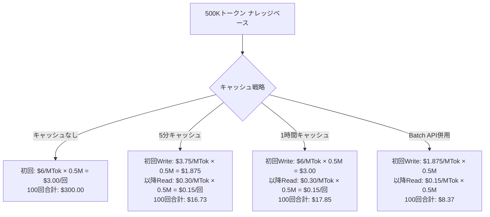
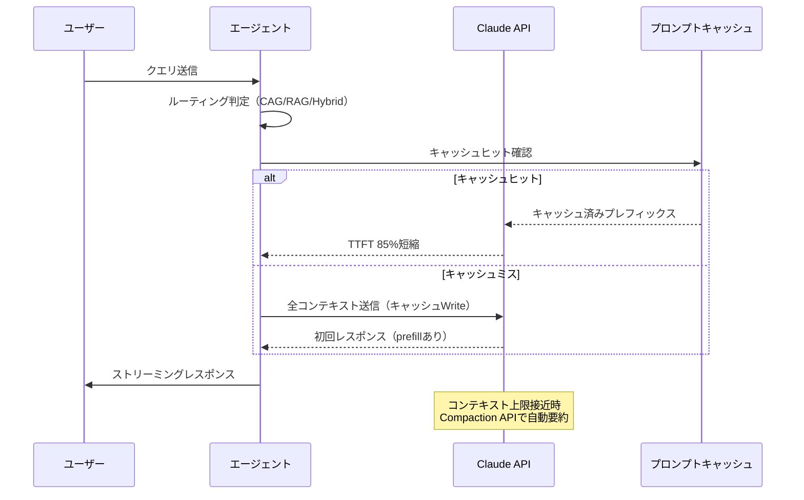
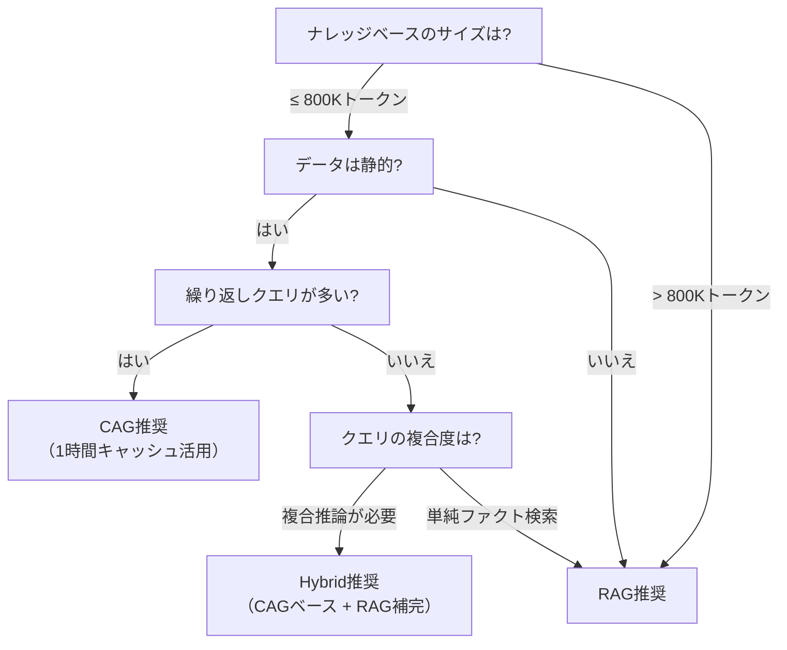

# Claude Sonnet 4.6の1Mコンテキストで構築するエージェント型RAGとレイテンシ最適化

## この記事でわかること

- Claude Sonnet 4.6の1Mトークンコンテキストウィンドウを活用した**CAG（Context-Augmented Generation）とRAGのハイブリッドアーキテクチャ**の設計方法
- エージェントが**クエリ特性に応じて検索戦略を自律選択**するルーティング機構の実装
- **プロンプトキャッシュ・ストリーミング・非同期実行**を組み合わせた5層レイテンシ最適化戦略
- 1Mコンテキスト利用時の**コスト構造**と、プロンプトキャッシュで90%削減する具体的手法
- 従来のチャンク型RAGと1Mコンテキスト型の**精度・レイテンシ・コスト**のトレードオフ判断基準

## 対象読者

- **想定読者**: 中級〜上級のLLMアプリケーション開発者
- **必要な前提知識**:
  - Python 3.11+の非同期プログラミング（`asyncio`）
  - Anthropic Claude APIの基本的な使い方（Messages API）
  - RAG（Retrieval-Augmented Generation）の基本概念
  - ベクトルデータベース（Qdrant, pgvector等）の基礎知識

## 結論・成果

本記事で解説するCAG/RAGハイブリッドアーキテクチャにより、以下の成果が報告されています。

- **レイテンシ**: プロンプトキャッシュ活用でTime-to-First-Token（TTFT）を公式ドキュメントによると**最大85%短縮**
- **コスト**: キャッシュRead時の入力トークン料金が基本料金の**10%**（$0.30/MTok）まで低減（[Anthropic公式Pricing](https://platform.claude.com/docs/en/about-claude/pricing)）
- **精度**: Databricksのベンチマークによると、ロングコンテキストLLMはリソースが十分な場合にRAGと同等以上の精度を達成
- **開発効率**: チャンキング・エンベディング・ベクトルDB構築のパイプラインが不要になり、プロトタイプ構築が数時間で完了

ただし、1Mコンテキスト利用時は200Kトークン超過分に**2倍の料金**（$6/MTok）が適用されるため、大量クエリ処理時のコスト管理が不可欠です。

## CAG/RAGハイブリッドアーキテクチャを設計する

2026年2月、Anthropicは[Claude Sonnet 4.6](https://www.anthropic.com/news/claude-sonnet-4-6)をリリースし、1Mトークンのコンテキストウィンドウ（ベータ）が利用可能になりました。この大容量コンテキストにより、従来のRAGアーキテクチャに加えて**CAG（Context-Augmented Generation）** という選択肢が現実的になっています。

### CAGとRAGの使い分け基準を定義する

CAGは事前に全ドキュメントをコンテキストに投入する方式で、検索ステップが不要なため高速です。一方、RAGは必要な情報だけを検索して取得するため、コスト効率に優れます。

| 評価軸 | CAG（1Mコンテキスト） | 従来型RAG |
|--------|----------------------|-----------|
| レイテンシ（初回） | 高い（prefill 2分以上の場合あり） | 低い（平均1秒程度） |
| レイテンシ（キャッシュ後） | 低い（TTFT最大85%短縮） | 変わらない |
| クエリ単価 | $0.10〜（200K超は$6/MTok） | $0.00008〜（Elasticsearchベンチマーク） |
| 精度（単一情報） | 高い（NIAH 99%recall） | 高い（チャンク品質依存） |
| 精度（複合推論） | 高い（文書横断が容易） | 中程度（チャンク分断リスク） |
| インフラ | APIのみ | ベクトルDB + 埋め込みモデル必要 |
| ナレッジ更新 | コンテキスト再構築 | インデックス差分更新 |

**判断基準**: [MonteCarloDataの分析](https://www.montecarlodata.com/blog-rag-vs-cag/)によると、**1-2Mトークン以下の静的ナレッジベース**にはCAGが適しており、**大規模・動的なデータソース**にはRAGが適しています。

> **注意**: CAGの「40倍高速」「80%低コスト」という数値は、キャッシュが有効な繰り返しクエリでの比較結果です（[ragaboutit.com](https://ragaboutit.com/the-40x-speed-gap-why-enterprise-rag-just-got-replaced-by-context-augmented-generation/)）。初回のprefillレイテンシは200Kトークン超のリクエストで数十秒〜2分以上かかる場合があり、ユースケースによっては許容できない場合もあります。

### エージェントによるクエリルーティングを実装する

ハイブリッドアーキテクチャの核心は、**エージェントがクエリ特性を分析し、最適な検索戦略を自律選択する**仕組みです。以下に、Anthropic Python SDKを使ったルーティングエージェントの実装例を示します。

```python
# router_agent.py
import anthropic
import json
from enum import Enum
from pydantic import BaseModel

class SearchStrategy(str, Enum):
    CAG = "cag"          # 1Mコンテキストに全文投入
    RAG = "rag"          # ベクトル検索で関連チャンク取得
    HYBRID = "hybrid"    # CAGベース + RAGで補完

class RouteDecision(BaseModel):
    strategy: SearchStrategy
    reasoning: str
    estimated_tokens: int

# ルーティング判定用ツール定義
ROUTING_TOOL = {
    "name": "decide_search_strategy",
    "description": "クエリの特性を分析し、最適な検索戦略を決定する",
    "input_schema": {
        "type": "object",
        "properties": {
            "strategy": {
                "type": "string",
                "enum": ["cag", "rag", "hybrid"],
                "description": "cag: 全文コンテキスト投入, rag: ベクトル検索, hybrid: 両方併用"
            },
            "reasoning": {
                "type": "string",
                "description": "戦略選択の理由"
            },
            "estimated_tokens": {
                "type": "integer",
                "description": "推定必要トークン数"
            }
        },
        "required": ["strategy", "reasoning", "estimated_tokens"]
    }
}

async def route_query(
    client: anthropic.AsyncAnthropic,
    query: str,
    corpus_token_count: int,
    corpus_is_static: bool,
) -> RouteDecision:
    """クエリ特性に基づいて検索戦略を自律選択する"""
    system_prompt = f"""あなたは検索戦略ルーターです。
ユーザーのクエリとコーパス情報に基づいて最適な検索戦略を選択してください。

## コーパス情報
- 総トークン数: {corpus_token_count:,}
- 静的データ: {"はい" if corpus_is_static else "いいえ（頻繁に更新）"}

## 選択基準
- cag: コーパス≤800Kトークン AND 静的 AND 複合推論が必要
- rag: コーパス>800Kトークン OR 動的データ OR 単純なファクト検索
- hybrid: 複合推論が必要 AND コーパスが大きい（CAGベース+RAG補完）"""

    response = await client.messages.create(
        model="claude-sonnet-4-6",
        max_tokens=1024,
        system=system_prompt,
        tools=[ROUTING_TOOL],
        tool_choice={"type": "tool", "name": "decide_search_strategy"},
        messages=[{"role": "user", "content": query}],
    )

    # tool_useブロックから結果を抽出
    for block in response.content:
        if block.type == "tool_use":
            return RouteDecision(**block.input)

    # フォールバック: RAGをデフォルトとする
    return RouteDecision(
        strategy=SearchStrategy.RAG,
        reasoning="ルーティング判定失敗、安全側のRAGにフォールバック",
        estimated_tokens=0,
    )
```

**なぜtool_useでルーティング判定を行うか:**
- `tool_choice={"type": "tool"}`により、必ず構造化された判定結果を取得できる
- Pydanticモデルで型安全にパースでき、不正な出力を防止
- ルーティング判定自体のトークン消費が少ない（1024トークン以下）

**注意点:**
> ルーティングエージェント自体のAPI呼び出しがレイテンシに加算されます。頻出クエリパターンはルーティング結果をキャッシュし、APIコールをスキップする設計が推奨です。

### CAGパイプラインを実装する

CAG戦略が選択された場合、全ドキュメントをプロンプトキャッシュ付きでコンテキストに投入します。

```python
# cag_pipeline.py
import anthropic

async def execute_cag_pipeline(
    client: anthropic.AsyncAnthropic,
    query: str,
    documents: list[str],
    system_instructions: str,
) -> str:
    """1Mコンテキストを活用したCAGパイプライン"""

    # ドキュメントを結合してシステムプロンプトに投入
    combined_docs = "\n\n---\n\n".join(
        f"## Document {i+1}\n{doc}" for i, doc in enumerate(documents)
    )

    # プロンプトキャッシュを活用:
    # - system_instructions（変更頻度: 低）→ 明示的キャッシュ
    # - combined_docs（変更頻度: 中）→ 明示的キャッシュ
    # - messages（変更頻度: 高）→ 自動キャッシュ
    response = await client.messages.create(
        model="claude-sonnet-4-6",
        max_tokens=4096,
        system=[
            {
                "type": "text",
                "text": system_instructions,
                "cache_control": {"type": "ephemeral"},  # 5分キャッシュ
            },
            {
                "type": "text",
                "text": f"# ナレッジベース\n\n{combined_docs}",
                "cache_control": {"type": "ephemeral", "ttl": "1h"},  # 1時間キャッシュ
            },
        ],
        messages=[{"role": "user", "content": query}],
    )

    return response.content[0].text
```

ここで重要なのは**キャッシュTTLの使い分け**です。公式ドキュメントによると、1時間キャッシュはナレッジベースのようにアクセス頻度が5分間隔より長いケースに適しています。システムプロンプトは5分以内に再利用されることが多いため、デフォルトの5分TTLで十分です。

## プロンプトキャッシュで1Mコンテキストのコスト構造を最適化する

1Mコンテキストの最大の課題はコストです。Anthropicの[公式Pricing](https://platform.claude.com/docs/en/about-claude/pricing)によると、200Kトークンを超えるリクエストには**ロングコンテキスト料金**（入力$6/MTok、出力$22.50/MTok）が適用されます。

### コスト構造を理解する

以下は、500Kトークンのナレッジベースに対して100回クエリを実行した場合のコスト比較です。



**なぜキャッシュが必須か**: ロングコンテキスト料金（$6/MTok）がかかる200K超のリクエストでも、キャッシュRead時は基本料金の10%（$0.30/MTok）で処理されます。つまり、同じナレッジベースに繰り返しクエリする場合、**キャッシュなしと比較して約94%のコスト削減**が可能です。

### コスト最適化の実装パターン

以下は、コスト追跡を組み込んだクライアントラッパーの実装例です。

```python
# cost_tracker.py
from dataclasses import dataclass, field

@dataclass
class UsageMetrics:
    """APIコスト追跡用メトリクス"""
    cache_read_tokens: int = 0
    cache_write_tokens: int = 0
    input_tokens: int = 0
    output_tokens: int = 0

    @property
    def total_input_tokens(self) -> int:
        return self.cache_read_tokens + self.cache_write_tokens + self.input_tokens

    def estimated_cost_usd(self, is_long_context: bool = False) -> float:
        """推定コストを計算（Claude Sonnet 4.6基準）"""
        if is_long_context:
            input_rate = 6.0    # $/MTok（200K超）
            output_rate = 22.5  # $/MTok（200K超）
        else:
            input_rate = 3.0    # $/MTok（標準）
            output_rate = 15.0  # $/MTok（標準）

        cache_read_rate = input_rate * 0.1   # キャッシュReadは10%
        cache_write_rate = input_rate * 1.25  # 5分キャッシュWriteは125%

        cost = (
            (self.cache_read_tokens / 1_000_000) * cache_read_rate
            + (self.cache_write_tokens / 1_000_000) * cache_write_rate
            + (self.input_tokens / 1_000_000) * input_rate
            + (self.output_tokens / 1_000_000) * output_rate
        )
        return round(cost, 6)


def extract_usage(response) -> UsageMetrics:
    """APIレスポンスからUsageMetricsを生成"""
    usage = response.usage
    return UsageMetrics(
        cache_read_tokens=getattr(usage, "cache_read_input_tokens", 0) or 0,
        cache_write_tokens=getattr(usage, "cache_creation_input_tokens", 0) or 0,
        input_tokens=usage.input_tokens,
        output_tokens=usage.output_tokens,
    )
```

**よくある間違い**: `usage.input_tokens`はキャッシュブレークポイント**以降**のトークン数のみを示します。総入力トークン数は`cache_read_input_tokens + cache_creation_input_tokens + input_tokens`で計算する必要があります。この仕様を知らずにコスト計算すると、実際の利用量を大幅に過小評価してしまいます。

## 5層レイテンシ最適化戦略を実装する

1Mコンテキストのprefillレイテンシは、200Kトークン超のリクエストで数十秒以上かかることがあります。以下の5層戦略で応答速度を改善します。

### Layer 1: プロンプトキャッシュでTTFTを短縮する

前述のとおり、プロンプトキャッシュはコスト削減だけでなく**レイテンシ削減にも直結**します。Anthropicの公式ドキュメントによると、キャッシュヒット時にTTFTを**最大85%短縮**できます。

```python
# キャッシュ戦略の最適化: 4つのブレークポイントを活用
async def optimized_cag_request(
    client: anthropic.AsyncAnthropic,
    tools: list[dict],
    system_instructions: str,
    knowledge_base: str,
    conversation_history: list[dict],
    new_query: str,
) -> str:
    """4つのキャッシュブレークポイントを最大活用した実装"""

    # BP1: ツール定義（変更頻度: 極低）
    cached_tools = tools.copy()
    cached_tools[-1]["cache_control"] = {"type": "ephemeral"}

    # BP2: システム指示（変更頻度: 低）
    # BP3: ナレッジベース（変更頻度: 中、1時間キャッシュ）
    system = [
        {
            "type": "text",
            "text": system_instructions,
            "cache_control": {"type": "ephemeral"},
        },
        {
            "type": "text",
            "text": knowledge_base,
            "cache_control": {"type": "ephemeral", "ttl": "1h"},
        },
    ]

    # BP4: 会話履歴（自動キャッシュで最後のブロックに付与）
    messages = conversation_history + [
        {"role": "user", "content": new_query}
    ]

    response = await client.messages.create(
        model="claude-sonnet-4-6",
        max_tokens=4096,
        tools=cached_tools,
        system=system,
        cache_control={"type": "ephemeral"},  # 自動キャッシュ
        messages=messages,
    )
    return response
```

### Layer 2: ストリーミングで体感レイテンシを改善する

ストリーミングを使えば、モデルがトークンを生成し始めた時点でユーザーに表示を開始できます。Claude Sonnet 4.6では**Fine-grained tool streaming**がGAになっており、ツール呼び出し中もリアルタイムに進捗を返せます。

```python
# streaming_pipeline.py
import anthropic

async def stream_cag_response(
    client: anthropic.AsyncAnthropic,
    system: list[dict],
    messages: list[dict],
):
    """ストリーミングでCAGレスポンスを返す"""
    async with client.messages.stream(
        model="claude-sonnet-4-6",
        max_tokens=4096,
        system=system,
        messages=messages,
    ) as stream:
        async for event in stream:
            if event.type == "content_block_delta":
                if hasattr(event.delta, "text"):
                    yield event.delta.text

    # ストリーム完了後にUsageを取得
    final_message = await stream.get_final_message()
    yield f"\n[Usage: {final_message.usage}]"
```

### Layer 3: 非同期並列実行でスループットを向上させる

複数のクエリを同時処理する場合、非同期実行で全体のスループットを向上させます。

```python
# parallel_execution.py
import asyncio
import anthropic

async def parallel_query_execution(
    client: anthropic.AsyncAnthropic,
    queries: list[str],
    system: list[dict],
    max_concurrency: int = 5,
) -> list[str]:
    """セマフォで同時実行数を制御した並列クエリ処理"""
    semaphore = asyncio.Semaphore(max_concurrency)
    results: list[str] = [""] * len(queries)

    async def process_single(index: int, query: str):
        async with semaphore:
            response = await client.messages.create(
                model="claude-sonnet-4-6",
                max_tokens=4096,
                system=system,
                messages=[{"role": "user", "content": query}],
            )
            results[index] = response.content[0].text

    tasks = [process_single(i, q) for i, q in enumerate(queries)]
    await asyncio.gather(*tasks)
    return results
```

**注意点:**
> 同時リクエスト時、プロンプトキャッシュのヒットは**最初のレスポンスが開始された後**に有効になります。並列リクエストでキャッシュを活用する場合、最初の1リクエストでキャッシュを作成してから残りを送信する設計が推奨されます。

### Layer 4: Adaptive Thinkingでコスト/速度バランスを調整する

Claude Sonnet 4.6では**Adaptive Thinking**が推奨の思考モードです。effortパラメータで思考の深さを制御できます。

```python
# adaptive_thinking.py

async def query_with_adaptive_effort(
    client: anthropic.AsyncAnthropic,
    query: str,
    system: list[dict],
    complexity: str = "medium",  # low, medium, high, max
) -> str:
    """クエリの複雑度に応じてeffortレベルを調整"""
    effort_map = {
        "low": "low",       # 単純なファクト検索
        "medium": "medium",  # 一般的な質問応答
        "high": "high",     # 複合推論
        "max": "max",       # 最高精度が必要な場合（Opusのみ）
    }

    response = await client.messages.create(
        model="claude-sonnet-4-6",
        max_tokens=4096,
        thinking={"type": "adaptive"},
        effort=effort_map.get(complexity, "medium"),
        system=system,
        messages=[{"role": "user", "content": query}],
    )
    return response.content[-1].text  # thinkingブロックの後のテキスト
```

**なぜAdaptive Thinkingか**: 公式ドキュメントによると、Sonnet 4.6では`thinking: {type: "enabled"}`と`budget_tokens`は非推奨です。Adaptive Thinkingはクエリの難易度に応じて自動的に思考量を調整するため、不要な思考トークンの消費を抑制できます。effortを`medium`に設定すると、多くのユースケースで速度とコストの良いバランスが取れます。

### Layer 5: Compaction APIで長時間会話を維持する

長時間のエージェントセッションではコンテキストが1Mに達する場合があります。Claude 4.6で導入された**Compaction API**を使えば、サーバーサイドでコンテキストを自動要約し、実質的に無限の会話が可能になります。



## よくある問題と解決方法

エージェント型RAGパイプラインを1Mコンテキストで運用する際に、頻出する問題と対処法をまとめます。

| 問題 | 原因 | 解決方法 |
|------|------|----------|
| 初回リクエストが遅い（2分以上） | 200K超のprefillに時間がかかる | 事前にウォームアップリクエストを送信してキャッシュを作成する |
| キャッシュヒット率が低い | tool_choiceやimageの変更でキャッシュ無効化 | ツール定義・画像の有無をリクエスト間で固定する |
| コストが想定を超える | 200K超のロングコンテキスト料金を見落とし | `usage`フィールドで総トークン数を監視し、200K閾値を超えたらアラート |
| 精度が出ない（情報を見落とす） | コンテキストが長すぎてattentionが分散 | 重要なドキュメントをコンテキスト先頭に配置し、構造化する |
| レスポンスが途中で切れる | max_tokensが不足 | Sonnet 4.6では最大64Kトークンの出力に対応。ストリーミング使用を推奨 |
| Batch APIでキャッシュが効かない | バッチ処理は順不同で実行される | 1時間キャッシュ + 先行リクエストでキャッシュ作成してから残りを投入 |

**ハマりポイント**: `thinking`パラメータを変更するとメッセージキャッシュが無効化されます。Adaptive Thinkingの設定はリクエスト間で一貫させてください。また、`speed: "fast"`（Opus限定）の切り替えもシステムキャッシュとメッセージキャッシュを無効化するため、注意が必要です。

## ベンチマーク結果から判断基準を導く

最終的にCAG・RAG・ハイブリッドのどれを選ぶかは、ワークロードの特性で決まります。以下は、各種ベンチマークの知見をまとめた判断フローです。



Databricksの[ベンチマーク](https://www.databricks.com/blog/long-context-rag-performance-llms)では、ロングコンテキストLLMはリソースが十分な場合にRAGと同等以上の精度を達成したと報告されています。一方、[Elasticsearchのテスト](https://www.elastic.co/search-labs/blog/rag-vs-long-context-model-llm)では、RAGがすべてのイテレーションで一貫して正確な回答を返したのに対し、ロングコンテキストアプローチでは必要な情報の特定に失敗するケースがあったとされています。

**トレードオフ**: ロングコンテキスト（CAG）は文書横断の複合推論に強い反面、コストが高く、attentionの分散で単純なファクト検索の精度が下がるリスクがあります。RAGはコスト効率と単純検索の精度に優れますが、チャンク分断による文脈喪失のリスクがあります。

## まとめと次のステップ

**まとめ:**

- Claude Sonnet 4.6の1Mコンテキストウィンドウにより、CAG（全文コンテキスト投入）が現実的な選択肢になった
- **プロンプトキャッシュ**がコスト・レイテンシ両面で最重要の最適化手法であり、キャッシュRead時は入力トークン料金が基本料金の10%まで低減する
- ワークロード特性に応じたCAG/RAG/Hybridの**自動ルーティング**が、コストと精度を両立するための鍵である
- 5層レイテンシ最適化（キャッシュ→ストリーミング→非同期→Adaptive Thinking→Compaction）を段階的に適用することで、体感・実効両面でのレスポンス改善が可能
- 200K超のロングコンテキスト料金（2倍）を考慮したコスト設計が不可欠

**次にやるべきこと:**

- Anthropic APIの[プロンプトキャッシュ](https://platform.claude.com/docs/en/build-with-claude/prompt-caching)を有効化し、自社ナレッジベースでのキャッシュヒット率を測定する
- 自社のクエリパターンを分析し、CAG/RAG/Hybridのどの戦略が最適かを判定するルーティングルールを設計する
- [Compaction API](https://platform.claude.com/docs/en/build-with-claude/compaction)のベータを検証し、長時間エージェントセッションへの適用可能性を評価する

**関連記事:**

- [LangGraph×Claude Sonnet 4.6のプロンプトキャッシュ最適化でAgentic RAGコスト90%削減](https://zenn.dev/0h_n0/articles/555a4e799660de)
- [ロングコンテキストLLM活用の最適解：200Kトークンを使いこなす実装パターン](https://zenn.dev/0h_n0/articles/a1bb0a9d6cb7f0)
- [LangGraphエージェント型RAGのレイテンシ最適化：ストリーミング×非同期実行で応答速度を3倍改善する](https://zenn.dev/0h_n0/articles/433702e83b26ed)

## 参考

- [Anthropic: What's new in Claude 4.6](https://platform.claude.com/docs/en/about-claude/models/whats-new-claude-4-6)
- [Anthropic: Prompt caching](https://platform.claude.com/docs/en/build-with-claude/prompt-caching)
- [Anthropic: Pricing](https://platform.claude.com/docs/en/about-claude/pricing)
- [Databricks: Long Context RAG Performance of LLMs](https://www.databricks.com/blog/long-context-rag-performance-llms)
- [Elasticsearch: RAG vs Long Context Model LLM](https://www.elastic.co/search-labs/blog/rag-vs-long-context-model-llm)
- [MonteCarloData: RAG vs CAG](https://www.montecarlodata.com/blog-rag-vs-cag/)
- [ragaboutit.com: The 40x Speed Gap: CAG vs RAG](https://ragaboutit.com/the-40x-speed-gap-why-enterprise-rag-just-got-replaced-by-context-augmented-generation/)
- [Introducing Claude Sonnet 4.6](https://www.anthropic.com/news/claude-sonnet-4-6)

---

:::message
この記事はAI（Claude Code）により自動生成されました。内容の正確性については複数の情報源で検証していますが、実際の利用時は公式ドキュメントもご確認ください。
:::
