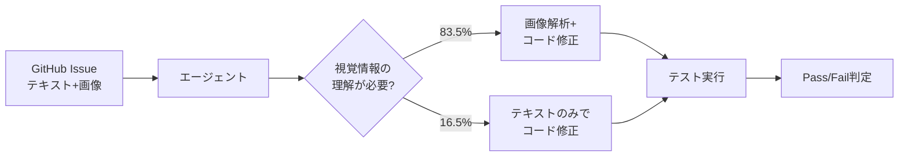
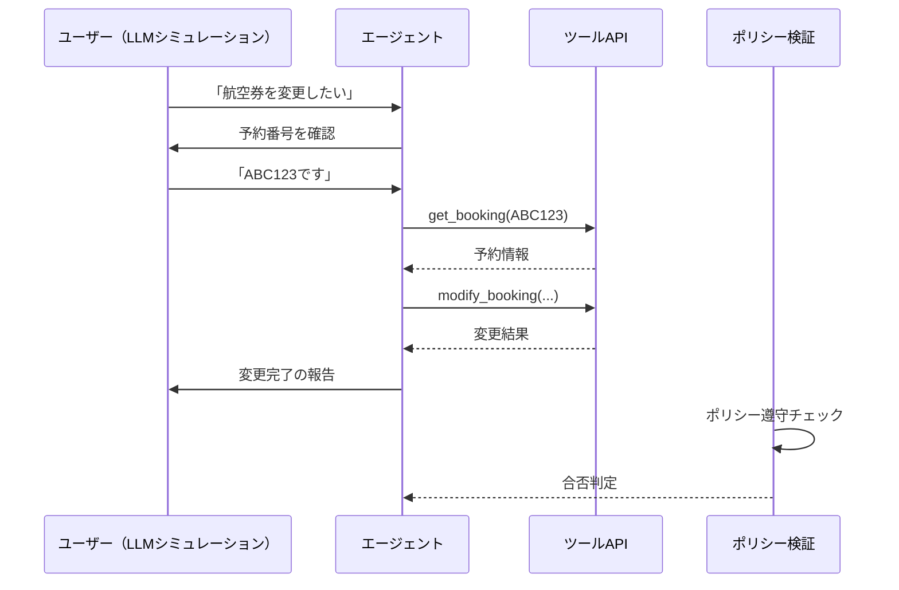
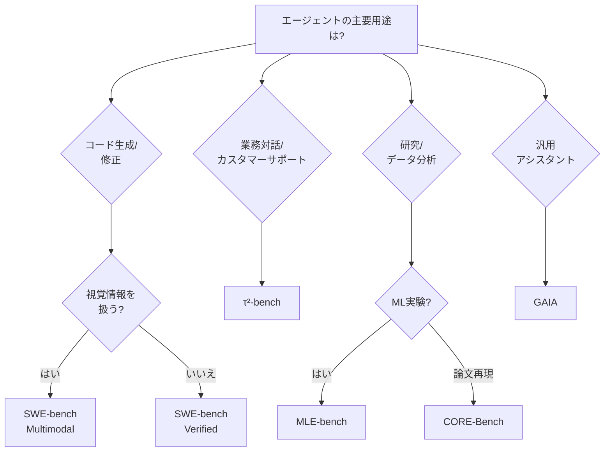
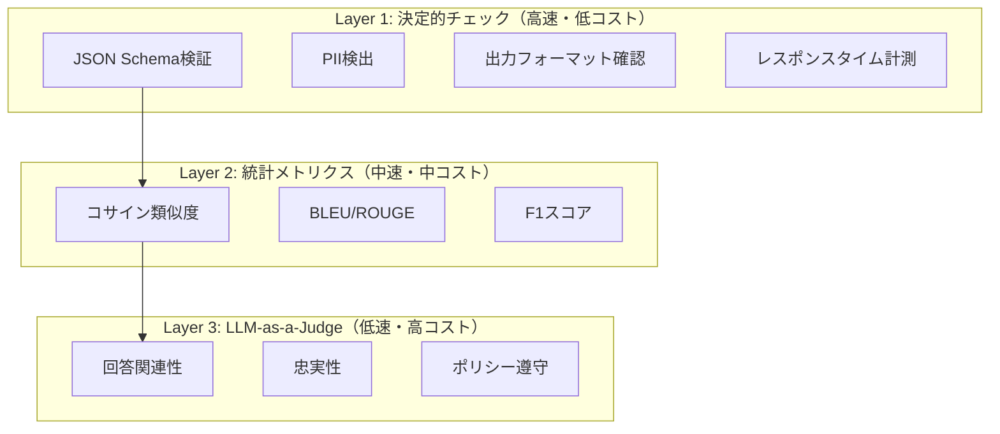

# LLMエージェント評価ベンチマーク2026年版：7種比較と自動評価パイプライン構築

## この記事でわかること

- 2026年時点の主要エージェント評価ベンチマーク7種の特徴と使い分け
- SWE-bench Multimodal・τ²-bench・CORE-Benchなど新世代ベンチマークの設計思想と評価結果
- ベンチマーク選定のための意思決定フレームワーク
- CI/CDパイプラインにエージェント評価を統合する実装パターン
- Braintrust・DeepEval・LangSmithを用いた自動評価の具体的な設定方法

## 対象読者

- **想定読者**: 中級〜上級のLLMアプリケーション開発者・MLエンジニア
- **必要な前提知識**:
  - Python 3.11以上の基本的な使い方
  - LLMエージェント（ReAct、Tool Use等）の基本概念
  - GitHub Actions等のCI/CDの基礎知識
  - pytest等のテストフレームワークの基本理解

## 結論・成果

2026年のLLMエージェント評価ベンチマークは、従来の「知識量テスト」から**「推論してタスクを完遂する力」を測る設計**へ明確にシフトしています。SWE-bench Verifiedではトップモデルが解決率80%超に到達した一方、視覚理解を要求するSWE-bench Multimodalでは12.2%にとどまり、テキスト偏重の評価では見えない課題が浮き彫りになっています。

本記事では、7つの主要ベンチマークの横断比較と、CI/CDに組み込む自動評価パイプラインの構築方法を示します。公式ドキュメントとリーダーボード、論文のベンチマーク結果を基に、ユースケース別の選定指針を提供します。

> **関連記事**: 各ベンチマークの基本概念と入門的な選び方については、[LLMエージェント評価ベンチマーク完全ガイド：SWE-bench・GAIA・τ-benchの選び方と実践](https://zenn.dev/0h_n0/articles/cdb9712312bdbf) も参照してください。

## 2026年のベンチマーク全体像を把握する

LLMエージェントの能力が急速に向上する中、ベンチマークも進化を続けています。2026年3月時点で注目すべき変化は3つあります。

### ベンチマーク飽和と新世代への移行

従来のベンチマークでトップモデルのスコアが収束し始めたことで、**より困難な評価軸**への移行が進んでいます。SWE-bench VerifiedではClaude Opus 4.6が80.8%、Gemini 3.1 Proが80.6%と拮抗しており、テキストベースのコード修正タスクでは差がつきにくくなっています。

一方で、SWE-bench Multimodalでは視覚要素を含むイシューの解決率がトップでも12.2%にとどまり、**マルチモーダル理解**が次の差別化軸として浮上しています。

### 評価対象のドメイン拡大

エージェント評価の対象が「コード生成」から「業務タスク全般」へ広がっています。τ²-benchは小売・航空・通信の3ドメインで**ポリシー遵守+ツール利用+ユーザー対話**を一括評価し、CORE-Benchは**科学論文の計算再現性**という新しい軸を導入しています。

### CI/CDへの評価統合の標準化

評価を「1回きりのテスト」から「継続的な品質ゲート」として運用する流れが定着しつつあります。Braintrust、LangSmith、DeepEvalといったツールがGitHub Actions連携を標準提供し、PRごとの自動評価が実用段階に入っています。

## 主要ベンチマーク7種を比較する

以下の表で、2026年時点の主要ベンチマーク7種の特徴を横断比較します。

| ベンチマーク | 評価対象 | タスク数 | 入力形式 | 難易度指標（トップモデル） | 開発元 |
|---|---|---|---|---|---|
| **SWE-bench Verified** | コード修正（Python） | 500 | テキスト | 80.8%（Claude Opus 4.6） | Princeton/OpenAI |
| **SWE-bench Multimodal** | コード修正（JS、視覚含む） | 617 | テキスト+画像 | 12.2% | Princeton |
| **MLE-bench** | ML実験（Kaggle） | 75 | テキスト+データ | 16.9%（pass@1） | OpenAI |
| **CORE-Bench** | 論文計算再現性 | 270 | テキスト+コード+画像 | 21%（Hard） | Princeton |
| **τ²-bench** | 業務対話（Tool+User） | 3ドメイン | マルチターン対話 | <50%（GPT-4o） | Sierra AI |
| **GAIA** | 汎用AIアシスタント | 466 | テキスト+ファイル | ~60%（トップモデル） | Meta/HuggingFace |
| **AgentBench** | 多ドメインエージェント | 8環境 | テキスト | モデル依存 | Tsinghua |

**注意点**: 各ベンチマークの数値は評価条件（スキャフォールド、試行回数、モデルバージョン）で大きく変動します。上記は各公式リーダーボードの2026年2〜3月時点の値です。

### SWE-bench Multimodal：視覚理解の壁

SWE-bench Multimodalは、17のJavaScriptライブラリ（UIフレームワーク、データ可視化、マッピングなど）から収集した617のイシューで構成されています。各タスクには問題文またはテストケースに最低1つの画像が含まれ、**83.5%のイシューで視覚入力が解決に必須**と人間のアノテーターが判定しています。



SWE-bench Verifiedで80%超を達成しているモデルが、Multimodalでは12.2%にとどまる要因は主に2つあります。

1. **UIレンダリング結果の解釈**: スクリーンショットからCSS/レイアウトの問題を特定する必要がある
2. **図表の数値読み取り**: チャートやグラフの描画バグを画像から認識し、データ処理ロジックを修正する必要がある

**制約条件**: SWE-bench MultimodalはJavaScriptリポジトリに限定されており、Python/Rustなど他言語のマルチモーダルタスクはカバーしていません。また、テスト分割のリーダーボード提出にはsb-cliの使用が必須です。

### τ²-bench：マルチターン業務対話の評価

τ²-bench（tau-squared-bench）は、Sierra AIが開発した**Tool-Agent-User対話ベンチマーク**の第2版です。元のτ-benchの小売（retail）・航空（airline）に加え、通信（telecom）ドメインが追加されました。

このベンチマークの特徴は、**部分観測可能マルコフ決定過程（POMDP）として定式化**されている点です。エージェントはユーザーの意図を対話で推定しながら、APIツールを呼び出してタスクを完了する必要があります。



τ²-benchのリーダーボードでは、2026年3月時点でもGPT-4oクラスのモデルが**小売ドメインで50%未満**（pass@8で25%未満）にとどまっています。この低い成功率の主因は以下です。

- **ポリシー遵守の厳密さ**: 返品ポリシーや料金規約への違反が即失敗になる
- **マルチステップ推論**: 複数のAPI呼び出しを正しい順序で実行する必要がある
- **ユーザー意図の曖昧さ**: シミュレートされたユーザーが曖昧な指示を出す場合がある

**τ²-benchの制約**: 現在は3ドメインのみで、医療・金融など高リスクドメインはカバーしていません。また、ユーザーシミュレーションにLLMを使用しているため、実際の人間の対話パターンとは異なる可能性があります。

### CORE-Bench：科学計算再現性という新しい軸

CORE-Bench（Computational Reproducibility Agent Benchmark）は、**90本の科学論文から270のタスク**を構成し、計算機科学・社会科学・医学の3分野をカバーしています。NeurIPS 2024で発表され、Transactions on Machine Learning Researchに2025年1月に採録されています。

3段階の難易度設定が特徴的です。

| 難易度 | 提供情報 | トップ精度 |
|--------|----------|-----------|
| **Easy** | コード出力済み（実行不要） | 約60% |
| **Medium** | Dockerfile提供（実行必要） | 約35% |
| **Hard** | READMEのみ（環境構築から） | 21% |

Hard難易度で21%という結果は、**エージェントが「環境構築→コード理解→実行→結果検証」の一連のワークフローを自律的に完遂する能力がまだ限定的**であることを示しています。

**なぜCORE-Benchが注目されるか:**
- **実世界の再現性問題**: 科学論文の計算再現性は研究の信頼性に直結する課題であり、エージェントによる自動化の需要が高い
- **複合スキルの評価**: 環境構築、依存関係解決、コード理解、デバッグという複数のスキルを組み合わせて評価できる

**制約**: 論文ベースのため、タスクの多様性が学術領域に偏っています。産業向けソフトウェアの再現性タスクはカバーしていません。

## ベンチマーク選定の意思決定フレームワークを構築する

ベンチマークは「全部試す」のではなく、**自身のユースケースに合ったものを選定**することが重要です。以下のフローチャートで判断してみましょう。



### ユースケース別の推奨組み合わせ

単一ベンチマークでは評価が偏りがちです。以下の組み合わせを推奨します。

**コーディングエージェント開発:**
- 必須: SWE-bench Verified（基本能力の確認）
- 推奨: SWE-bench Multimodal（マルチモーダル対応の確認）
- 補助: MLE-bench（ML特化タスクのカバー）

**カスタマーサポートエージェント:**
- 必須: τ²-bench（ポリシー遵守+ツール利用の評価）
- 推奨: GAIA（汎用推論能力の確認）

**研究支援エージェント:**
- 必須: CORE-Bench（再現性タスクの評価）
- 推奨: GAIA（情報収集+推論の総合評価）

## CI/CDパイプラインに自動評価を組み込む

ベンチマークによる1回きりの評価ではなく、**開発サイクルに組み込んだ継続的評価**が実運用には不可欠です。ここでは、3つの主要ツールの特徴と実装パターンを紹介します。

### 評価ツール比較

| ツール | 特徴 | 最適なチーム | CI/CD連携 |
|--------|------|-------------|-----------|
| **Braintrust** | 統合プラットフォーム、PR自動評価 | フルスタック開発チーム | GitHub Actions標準提供 |
| **DeepEval** | pytest統合、50+メトリクス | Pythonエンジニアリングチーム | pytest連携 |
| **LangSmith** | LangChain/LangGraph向け、トレーシング | LangChainユーザー | 独自CI/CDパイプライン |

### DeepEvalによるpytest統合の実装例

DeepEvalはpytestのプラグインとして動作するため、既存のテストワークフローにエージェント評価を追加しやすい点が特徴です。

```python
# tests/test_agent_eval.py
import pytest
from deepeval import assert_test
from deepeval.metrics import (
    AnswerRelevancyMetric,
    FaithfulnessMetric,
    ToolCorrectnessMetric,
)
from deepeval.test_case import LLMTestCase


@pytest.fixture
def relevancy_metric():
    """回答の関連性を0.7以上で判定するメトリクス"""
    return AnswerRelevancyMetric(threshold=0.7, model="gpt-4o")


@pytest.fixture
def faithfulness_metric():
    """ハルシネーション検出用メトリクス"""
    return FaithfulnessMetric(threshold=0.8, model="gpt-4o")


def test_agent_response_relevancy(relevancy_metric):
    """エージェントの回答が質問に対して関連性を持つか検証"""
    test_case = LLMTestCase(
        input="Pythonでファイルを非同期に読み込む方法は？",
        actual_output="aiofilesライブラリを使用します。async with aiofiles.open('file.txt', 'r') as f: ...",
        retrieval_context=[
            "aiofiles 24.1.0: async file I/O for Python",
            "Python asyncio公式ドキュメント",
        ],
    )
    assert_test(test_case, [relevancy_metric])


def test_agent_tool_selection():
    """エージェントが適切なツールを選択するか検証"""
    metric = ToolCorrectnessMetric()
    test_case = LLMTestCase(
        input="東京の明日の天気を教えて",
        actual_output="東京の明日の天気は晴れです",
        expected_tools=["weather_api"],
        tools_called=["weather_api"],
    )
    assert_test(test_case, [metric])
```

**実行方法:**

```bash
# DeepEvalのインストール
pip install deepeval

# テスト実行（通常のpytestと同じ）
pytest tests/test_agent_eval.py -v

# 詳細レポート付き実行
deepeval test run tests/test_agent_eval.py
```

### GitHub Actionsでの自動評価ワークフロー

PRごとにエージェント評価を自動実行し、品質ゲートとして機能させる設定例です。

```yaml
# .github/workflows/agent-eval.yml
name: Agent Evaluation
on:
  pull_request:
    paths:
      - "prompts/**"
      - "agents/**"
      - "tools/**"

jobs:
  evaluate:
    runs-on: ubuntu-latest
    steps:
      - uses: actions/checkout@v4

      - name: Set up Python
        uses: actions/setup-python@v5
        with:
          python-version: "3.12"

      - name: Install dependencies
        run: pip install deepeval pytest

      - name: Run agent evaluations
        env:
          OPENAI_API_KEY: ${{ secrets.OPENAI_API_KEY }}
        run: |
          pytest tests/test_agent_eval.py \
            --tb=short \
            -v \
            --junitxml=eval-results.xml

      - name: Upload evaluation results
        if: always()
        uses: actions/upload-artifact@v4
        with:
          name: eval-results
          path: eval-results.xml

      - name: Post evaluation summary to PR
        if: always()
        uses: EnricoMi/publish-unit-test-result-action@v2
        with:
          files: eval-results.xml
          comment_title: "Agent Evaluation Results"
```

### 評価メトリクスの3層構造を設計する

実運用では、以下の3層を組み合わせた評価が推奨されています。



**Layer 1（決定的チェック）** はすべてのPRで実行します。コストがほぼゼロで、構造的な問題を即座に検出できます。

**Layer 2（統計メトリクス）** は回帰テストとして、ベースラインとの比較に使用します。

**Layer 3（LLM-as-a-Judge）** はコストが高いため、マージ前の最終チェックやリリース候補の評価に限定します。

```python
# evaluators/layered_eval.py
from dataclasses import dataclass


@dataclass
class EvalResult:
    layer: str
    metric_name: str
    score: float
    passed: bool
    detail: str


def layer1_deterministic_checks(response: dict) -> list[EvalResult]:
    """Layer 1: 決定的チェック（全PRで実行）"""
    results = []

    # JSON Schema検証
    required_keys = {"answer", "sources", "confidence"}
    has_keys = required_keys.issubset(response.keys())
    results.append(
        EvalResult(
            layer="L1",
            metric_name="schema_validation",
            score=1.0 if has_keys else 0.0,
            passed=has_keys,
            detail=f"Missing keys: {required_keys - response.keys()}" if not has_keys else "OK",
        )
    )

    # PII検出（簡易版）
    import re
    pii_patterns = [
        r"\b\d{3}-\d{4}-\d{4}\b",  # 電話番号
        r"\b[A-Za-z0-9._%+-]+@[A-Za-z0-9.-]+\.[A-Z|a-z]{2,}\b",  # メール
    ]
    answer_text = response.get("answer", "")
    pii_found = any(re.search(p, answer_text) for p in pii_patterns)
    results.append(
        EvalResult(
            layer="L1",
            metric_name="pii_detection",
            score=0.0 if pii_found else 1.0,
            passed=not pii_found,
            detail="PII detected in response" if pii_found else "OK",
        )
    )

    return results


def layer2_statistical_metrics(
    response: str, reference: str
) -> list[EvalResult]:
    """Layer 2: 統計メトリクス（回帰テスト用）"""
    results = []

    # 簡易コサイン類似度（実運用ではsentence-transformers等を使用）
    response_words = set(response.lower().split())
    reference_words = set(reference.lower().split())
    if response_words or reference_words:
        jaccard = len(response_words & reference_words) / len(
            response_words | reference_words
        )
    else:
        jaccard = 0.0

    results.append(
        EvalResult(
            layer="L2",
            metric_name="jaccard_similarity",
            score=jaccard,
            passed=jaccard >= 0.3,
            detail=f"Similarity: {jaccard:.3f}",
        )
    )

    return results
```

**ハマりポイント**: LLM-as-a-Judgeを全テストケースに適用すると、100件のテストケースで$10〜$50のAPI費用が発生する場合があります。Layer 1で明確な失敗をフィルタリングしてからLayer 3を実行するのが費用対効果の高い運用です。

## よくある問題と解決方法

エージェント評価の導入でよく遭遇する問題と対処法をまとめます。

| 問題 | 原因 | 解決方法 |
|------|------|----------|
| ベンチマークスコアと本番性能が乖離する | 評価タスクと実業務の分布が異なる | カスタム評価セットを本番ログから構築する |
| CI/CDで評価が不安定（Flaky） | LLM-as-a-Judgeの非決定性 | Layer 1の決定的チェックを優先し、Layer 3は複数回実行の多数決にする |
| 評価コストが高すぎる | 全テストでLLM-as-a-Judgeを使用 | 3層構造で段階的にフィルタリング |
| 新モデルへの切り替え判断が難しい | 単一ベンチマークに依存 | 複数ベンチマークの加重平均スコアで比較 |
| テストケースの陳腐化 | 固定データセットの長期使用 | 本番ログから定期的にテストケースを更新（月1回推奨） |

### よくある間違い：ベンチマークスコアの過信

「SWE-bench Verifiedで80%超のモデルを導入すれば、自社のコード修正タスクも80%自動化できる」と考えがちですが、これは誤りです。SWE-bench Verifiedは**Pythonの特定OSS**に対するテストであり、自社コードベースの特性（独自フレームワーク、内部API、コーディング規約）は反映されていません。

ベンチマークは**モデル間の相対比較**として有用ですが、**自社タスクの絶対的な成功率**を予測するものではありません。本番導入前には、必ず自社データによるカスタム評価を実施してください。

## まとめと次のステップ

**まとめ:**

- 2026年のエージェント評価は**「タスク完遂力」を多角的に測る**方向に進化しており、SWE-bench Multimodal（視覚理解）、τ²-bench（業務対話）、CORE-Bench（計算再現性）が新たな評価軸を提供している
- SWE-bench Verifiedでトップモデルが80%超に到達する一方、Multimodalでは12.2%と大きな差があり、**テキスト偏重の評価だけでは不十分**であることが明らかになっている
- ベンチマーク選定は「全部試す」のではなく、**ユースケースに応じた組み合わせ**が有効
- CI/CDへの評価統合では**3層構造（決定的チェック→統計メトリクス→LLM-as-a-Judge）** が費用対効果の高い運用パターン
- ベンチマークスコアは相対比較には有効だが、自社タスクの絶対的成功率の予測には使えない

**次にやるべきこと:**

1. 自社エージェントのユースケースに合ったベンチマーク2〜3種を選定し、ベースラインを測定する
2. 本番ログから50〜100件のカスタム評価セットを構築し、DeepEvalまたはBraintrustでCI/CDに組み込む
3. Layer 1の決定的チェックから始めて、段階的にLayer 2・Layer 3を追加する

## 参考

- [SWE-bench公式サイト・リーダーボード](https://www.swebench.com/)
- [SWE-bench Multimodal](https://www.swebench.com/multimodal.html)
- [τ-bench: A Benchmark for Tool-Agent-User Interaction in Real-World Domains（arXiv:2406.12045）](https://arxiv.org/abs/2406.12045)
- [τ²-bench GitHub リポジトリ（Sierra Research）](https://github.com/sierra-research/tau2-bench)
- [CORE-Bench: Fostering the Credibility of Published Research Through a Computational Reproducibility Agent Benchmark（arXiv:2409.11363）](https://arxiv.org/abs/2409.11363)
- [MLE-bench: Evaluating Machine Learning Agents on Machine Learning Engineering（OpenAI）](https://openai.com/index/mle-bench/)
- [MLE-bench GitHub リポジトリ](https://github.com/openai/mle-bench)
- [GAIA Leaderboard（Hugging Face）](https://huggingface.co/spaces/gaia-benchmark/leaderboard)
- [Benchmarks evaluating LLM agents for software development（Symflower）](https://symflower.com/en/company/blog/2025/benchmarks-llm-agents/)
- [A Practical Guide to Integrating AI Evals into Your CI/CD Pipeline（DEV Community）](https://dev.to/kuldeep_paul/a-practical-guide-to-integrating-ai-evals-into-your-cicd-pipeline-3mlb)
- [Best AI evals tools for CI/CD in 2025（Braintrust）](https://www.braintrust.dev/articles/best-ai-evals-tools-cicd-2025)
- [DeepEval公式ドキュメント](https://docs.confident-ai.com/)

---

:::message
この記事はAI（Claude Code）により自動生成されました。内容の正確性については複数の情報源で検証していますが、実際の利用時は公式ドキュメントもご確認ください。
:::
