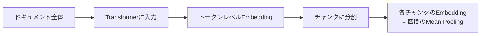
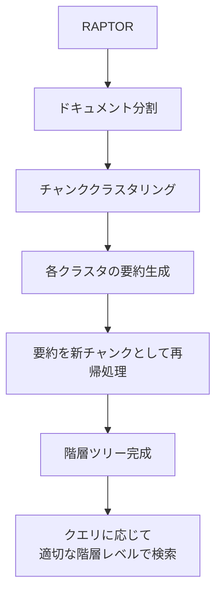
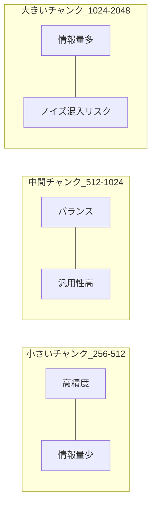

# RAGチャンキング戦略2026：7手法の精度比較とパラメータ最適化

## この記事でわかること

- 2026年時点で主要なチャンキング7手法の特徴と使い分け
- チャンクサイズ・オーバーラップの最適パラメータをベンチマーク根拠で選定する方法
- Late Chunking・Contextual Retrievalなど2025-2026年の新手法の実装方法
- ドメイン別（汎用/法務/金融/医療）の推奨パラメータ設定
- LangChain・LlamaIndexでのチャンキングパラメータチューニング実装

## 対象読者

- **想定読者**: 中級者のRAGシステム開発者・MLエンジニア
- **必要な前提知識**:
  - Python 3.11以降の基礎文法
  - RAG（Retrieval-Augmented Generation）の基本概念
  - Embeddingモデルの基礎知識（ベクトル類似度検索）
  - LangChain または LlamaIndex の基本的な使い方

## 結論・成果

チャンキング戦略の選択は、RAGシステムの検索精度に対してEmbeddingモデルの選択と**同等以上の影響**を与えることがChroma Researchの2025年7月の調査で報告されています。本記事では、2025-2026年のベンチマーク結果をもとに、以下の知見をまとめました。

- 再帰的分割（400-512トークン、10-20%オーバーラップ）が**汎用ベースラインとして82-90%のRecall**を達成（Firecrawl 2026年ベンチマーク）
- Contextual Retrieval + BM25 + リランキングの3層構成で**検索失敗率を67%削減**（Anthropic公式レポート）
- ドメイン特化のチャンキング（臨床領域）で**固定長比13%→87%に精度向上**（MDPI Bioengineering 2025年11月）

チャンキングの選択次第でRecallに最大9%の差が生じるため、「デフォルト設定のまま運用」は性能を大きく損なうリスクがあります。

## チャンキング7手法を比較する

2026年時点で実用されている主要なチャンキング手法を、ベンチマーク結果とともに整理します。まず全体像を把握してから、各手法の詳細を見ていきましょう。

### 7手法の性能比較表

以下は、Firecrawl・Chroma Research・NVIDIA等の2025-2026年ベンチマーク結果を統合した比較表です。

| 手法 | Recall | 推奨チャンクサイズ | 計算コスト | 適用シーン |
|------|--------|-------------------|-----------|-----------|
| 固定長分割 | 82% | 400トークン | 低 | プロトタイプ、均一コンテンツ |
| 再帰的分割 | 85-90% | 400-512トークン | 低 | 汎用（記事、ドキュメント） |
| 文ベース分割 | 85-88% | 文単位でグループ化 | 低 | Q&A、会話データ |
| セマンティック分割 | 91-92% | Embeddingベース | 中 | 研究論文、密な非構造テキスト |
| ページレベル分割 | 64.8% | 1ページ単位 | 低 | PDF、財務報告書 |
| Late Chunking | 85.2% | ドキュメント全体→分割 | 中 | 代名詞・相互参照が多い文書 |
| LLMベース分割 | 91.9% | LLM判断 | 高 | 高価値コンテンツ、複雑構造 |

> **注意**: Recallの数値は各ベンチマークのデータセットと評価条件により異なります。Vecta 2026ベンチマークでは再帰的分割512トークンが69%精度、セマンティック分割が54%と逆転するケースも報告されており、**データセット依存性が大きい**点に留意してください。

### 手法1: 固定長分割（Fixed-Size Chunking）

テキストを一定の文字数・トークン数で機械的に分割する手法です。実装が容易でプロトタイピングに向いていますが、文の途中で切断されるリスクがあります。

```python
# fixed_size_chunking.py
def fixed_size_chunk(text: str, chunk_size: int = 400, overlap: int = 80) -> list[str]:
    """固定長でテキストを分割する。

    Args:
        text: 分割対象のテキスト
        chunk_size: チャンクの最大文字数
        overlap: チャンク間の重複文字数
    Returns:
        分割されたチャンクのリスト
    """
    chunks: list[str] = []
    start = 0
    while start < len(text):
        end = start + chunk_size
        chunks.append(text[start:end])
        start += chunk_size - overlap
    return chunks
```

**制約条件**: 文の途中で切断されるため、検索時にコンテキストが失われやすく、Recallは他手法より低い傾向があります。dasroot.net 2026年2月のベンチマークでは、text-embedding-3-largeモデル使用時に約82%のRecallと報告されています。

### 手法2: 再帰的分割（Recursive Character Splitting）

段落→改行→文→単語の優先順位で区切りを探す手法です。LangChainの`RecursiveCharacterTextSplitter`がこの実装にあたります。

```python
# recursive_splitting.py
from langchain_text_splitters import RecursiveCharacterTextSplitter

# 2026年ベンチマークで推奨されるパラメータ
splitter = RecursiveCharacterTextSplitter(
    chunk_size=512,        # 400-512トークンが推奨範囲
    chunk_overlap=80,      # 10-20%のオーバーラップ（512の約15%）
    separators=["\n\n", "\n", "。", "、", " ", ""],  # 日本語対応
    length_function=len,
)

documents = splitter.create_documents([text])
print(f"生成チャンク数: {len(documents)}")
```

**なぜこの手法がベースラインとして推奨されるか**:
- Firecrawl 2026年ベンチマークで85-90%のRecallを達成
- セパレータ階層により文の途中での切断を回避
- 計算コストが低く、大規模ドキュメントにもスケール

**注意点**:
> セパレータの順序は**言語依存**です。日本語テキストでは `"。"` や `"、"` を追加しないと、段落区切りのみで分割され、チャンクが大きくなりすぎる場合があります。

### 手法3: セマンティック分割（Semantic Chunking）

Embedding類似度に基づき、意味的なまとまりで分割する手法です。連続する文のEmbedding類似度を計算し、閾値以下になった箇所で分割します。

```python
# semantic_chunking.py
from langchain_experimental.text_splitter import SemanticChunker
from langchain_openai import OpenAIEmbeddings

# text-embedding-3-small（2026年時点で利用可能）
embeddings = OpenAIEmbeddings(model="text-embedding-3-small")

semantic_splitter = SemanticChunker(
    embeddings=embeddings,
    breakpoint_threshold_type="percentile",  # "percentile" | "standard_deviation" | "interquartile"
    breakpoint_threshold_amount=75,          # パーセンタイル閾値
)

docs = semantic_splitter.create_documents([text])
```

**トレードオフ**: Chroma Researchのベンチマークではセマンティック分割が91-92%のRecallを示しましたが、NAACL 2025 Findings論文では「固定200語チャンクがセマンティック分割と同等以上の性能を示す場合がある」と報告されています。また、Vecta 2026ベンチマークではセマンティック分割が平均43トークンの断片を生成し、54%まで精度が低下したケースも確認されています。**Embeddingモデルの呼び出しコストが追加で発生**する点も考慮が必要です。

### 手法4: Late Chunking

2024年にJina AIが提案した手法で、ドキュメント全体をまずTransformerに通してトークンレベルのEmbeddingを取得し、その後にチャンクに分割する手法です。



**従来手法との違い**: 従来は「分割→各チャンクをEmbedding」の順序でしたが、Late Chunkingは「Embedding→分割」の順序です。これにより、各チャンクのEmbeddingがドキュメント全体の文脈を保持します。

arXiv論文（2409.04701）によると、代名詞参照を含むドキュメントでの検索精度が10-12%向上し、NFCorpusではnDCG@10が6.5ポイント改善したと報告されています。

```python
# late_chunking.py（概念的な実装）
from transformers import AutoModel, AutoTokenizer
import torch

model_name = "jinaai/jina-embeddings-v2-base-en"  # 8192トークン対応
tokenizer = AutoTokenizer.from_pretrained(model_name, trust_remote_code=True)
model = AutoModel.from_pretrained(model_name, trust_remote_code=True)

def late_chunking(
    text: str,
    chunk_boundaries: list[tuple[int, int]],
) -> list[torch.Tensor]:
    """ドキュメント全体をエンコード後、指定境界でチャンクEmbeddingを生成する。

    Args:
        text: ドキュメント全体のテキスト
        chunk_boundaries: 各チャンクの(開始トークン, 終了トークン)リスト
    Returns:
        各チャンクのEmbeddingベクトルリスト
    """
    inputs = tokenizer(text, return_tensors="pt", truncation=True, max_length=8192)

    with torch.no_grad():
        outputs = model(**inputs)

    # トークンレベルのhidden statesを取得
    token_embeddings = outputs.last_hidden_state[0]

    # 各チャンク境界でmean pooling
    chunk_embeddings = []
    for start, end in chunk_boundaries:
        chunk_emb = token_embeddings[start:end].mean(dim=0)
        chunk_embeddings.append(chunk_emb)

    return chunk_embeddings
```

**制約条件**: モデルの最大トークン数（jina-embeddings-v2で8,192トークン）を超えるドキュメントには適用できません。また、追加の学習は不要ですが、ドキュメント全体をモデルに通す必要があるため、大量ドキュメントの処理にはGPUリソースが必要です。

### 手法5: Contextual Retrieval

Anthropicが2024年に発表したContextual Retrievalは、チャンキングの根本的な課題――**チャンクが元のドキュメントの文脈を失う問題**――に対処する手法です。

各チャンクにEmbeddingを生成する前に、LLM（Claude）を使って50-100トークンのコンテキスト説明文を先頭に付与します。

**変換例**:
- **変換前**: 「同社の売上は前四半期比3%増加した。」
- **変換後**: 「[Acme Corp 2025年Q3決算報告書より] 同社の売上は前四半期比3%増加した。」

```python
# contextual_retrieval.py
import anthropic

client = anthropic.Anthropic()

CONTEXT_PROMPT = """以下はドキュメントの一部（チャンク）です。
このチャンクがドキュメント全体の中でどの文脈に位置するか、
50-100トークンの簡潔な説明を日本語で生成してください。

<document>
{document}
</document>

<chunk>
{chunk}
</chunk>

チャンクの文脈説明のみを出力してください。"""


def add_context(document: str, chunk: str) -> str:
    """チャンクにコンテキスト説明文を付与する。

    Args:
        document: 元のドキュメント全体
        chunk: コンテキストを追加するチャンク
    Returns:
        コンテキスト付きチャンク
    """
    response = client.messages.create(
        model="claude-sonnet-4-20250514",
        max_tokens=200,
        messages=[
            {"role": "user", "content": CONTEXT_PROMPT.format(
                document=document, chunk=chunk
            )}
        ],
    )
    context = response.content[0].text
    return f"[{context}] {chunk}"
```

#### 性能改善の実測値

Anthropic公式レポートで報告されている検索失敗率（Top-20チャンク）の改善です。

| 構成 | 検索失敗率 | 改善率 |
|------|-----------|--------|
| 従来のEmbedding | 5.7% | — |
| Contextual Embedding | 3.7% | 35%削減 |
| Contextual Embedding + BM25 | 2.9% | 49%削減 |
| Contextual Embedding + BM25 + リランキング | 1.9% | **67%削減** |

**コストに関する注意**: Claudeのプロンプトキャッシュ機能を利用すると、コンテキスト生成の一度のコストは**100万ドキュメントトークンあたり約$1.02**と報告されています。ただし、チャンク数が多い場合（1ドキュメントあたり数百チャンク等）はAPIコールの合計コストに注意が必要です。

### 手法6: RAPTOR（階層的ツリー検索）

同じく階層的なアプローチとして知られるRAPTOR（Recursive Abstractive Processing for Tree-Organized Retrieval）は、チャンクをクラスタリングし、各クラスタの要約を再帰的に作成してツリー構造を構築します。Stanford大学の研究で、QuALITYベンチマークにおいてGPT-4使用時に20%の性能改善が報告されています。



**RAPTORとContextual Retrievalの使い分け**:
- **RAPTOR**: 詳細と概要の両方を必要とする複雑なクエリ（例: 「この報告書の全体的な結論と根拠データは？」）
- **Contextual Retrieval**: 特定の事実やデータポイントの検索精度向上（例: 「Q3の売上成長率は？」）

## チャンクサイズとオーバーラップを最適化する

チャンキングのパラメータ選択は、手法の選択と同等に重要です。ここでは、2025-2026年のベンチマーク結果から導かれる最適パラメータの指針を示します。

### パラメータの基本3要素

チャンキングは主に以下の3つのパラメータで制御されます。

$$
\text{有効チャンク数} = \left\lceil \frac{L - O}{S - O} \right\rceil
$$

ここで、$L$ はドキュメントの総トークン数、$S$ はチャンクサイズ、$O$ はオーバーラップサイズです。

| パラメータ | 説明 | 推奨範囲 | 根拠 |
|-----------|------|---------|------|
| chunk_size | チャンクの最大トークン数 | 256-1,024 | Chroma Research・Firecrawl |
| chunk_overlap | チャンク間の重複トークン数 | チャンクサイズの10-20% | FinanceBench（15%が最適） |
| separators | 分割に使用する区切り文字リスト | 言語依存 | LangChain公式推奨 |

### チャンクサイズの選択基準

Chroma Researchの2025年7月の調査では、「コンテキストクリフ」という現象が報告されています。これは、約2,500トークンを超えるチャンクで応答品質が急激に低下する現象です。



**クエリタイプ別の推奨サイズ**:

| クエリタイプ | 推奨チャンクサイズ | 理由 |
|------------|-------------------|------|
| 事実検索（人名・日付） | 256-512トークン | 小さいチャンクで高精度検索 |
| 概念説明 | 512-1,024トークン | 十分なコンテキストが必要 |
| 比較・分析 | 1,024トークン | 複数要素の同時把握 |

### オーバーラップの最適値

FinanceBenchでのテスト結果（dasroot.net 2026年2月報告）では、1,024トークンチャンクに対して**15%オーバーラップ（約154トークン）が最適**と報告されています。10%・15%・20%を比較した結果、15%が22%高い回答精度を示しました。

```python
# overlap_optimization.py
from langchain_text_splitters import RecursiveCharacterTextSplitter


def create_splitter_with_optimal_overlap(
    chunk_size: int = 512,
    overlap_ratio: float = 0.15,
) -> RecursiveCharacterTextSplitter:
    """最適なオーバーラップ比率でテキストスプリッターを作成する。

    Args:
        chunk_size: チャンクの最大文字数
        overlap_ratio: オーバーラップ比率（0.10-0.20推奨）
    Returns:
        設定済みのRecursiveCharacterTextSplitter
    """
    overlap = int(chunk_size * overlap_ratio)
    return RecursiveCharacterTextSplitter(
        chunk_size=chunk_size,
        chunk_overlap=overlap,
        separators=["\n\n", "\n", "。", "、", " ", ""],
    )


# 使用例
splitter = create_splitter_with_optimal_overlap(chunk_size=512, overlap_ratio=0.15)
chunks = splitter.split_text(document_text)
print(f"チャンク数: {len(chunks)}, オーバーラップ: {int(512 * 0.15)}文字")
```

**よくある間違い**: Chroma Researchの調査では、「オーバーラップなし（0%）が最も高い精度を示す」場合もあったと報告されています。これはIoU（Intersection over Union）メトリクスでは冗長な情報取得がペナルティになるためです。**評価メトリクスの選択がオーバーラップの最適値に影響する**点に注意してください。

### ドメイン別の推奨パラメータ

2025-2026年のベンチマーク結果を統合した、ドメイン別の推奨パラメータです。

| ドメイン | チャンクサイズ | オーバーラップ | 推奨手法 | 根拠 |
|---------|-------------|-------------|---------|------|
| 汎用 | 400-512 | 10-20% | 再帰的分割 | Firecrawl 2026 |
| 法務 | 1,024 | 15% | セマンティック | dasroot.net 2026 |
| 金融 | 1,024 | 15% | 階層的分割 | FinanceBench |
| 医療 | トピック境界 | — | 適応的分割 | MDPI Bioengineering 2025 |
| コードベース | 関数・クラス単位 | 0% | 構造ベース | Chroma Research |

### パラメータチューニングを自動化する

手動でのパラメータ調整は非効率です。ここでは、チャンキングパラメータの自動最適化パイプラインの実装例を紹介します。

#### 評価メトリクスの定義

チャンキング戦略の評価には、以下のメトリクスを組み合わせて使います。

- **Recall@K**: 上位Kチャンクに正解チャンクが含まれる割合
- **Precision@K**: 上位Kチャンクのうち関連チャンクの割合
- **IoU（Intersection over Union）**: トークンレベルの一致度

```python
# chunking_evaluator.py
from dataclasses import dataclass


@dataclass
class ChunkingEvalResult:
    """チャンキング評価結果を格納するデータクラス。"""
    chunk_size: int
    overlap: int
    strategy: str
    recall_at_5: float
    precision_at_5: float
    avg_chunk_tokens: float
    total_chunks: int


def evaluate_chunking(
    chunks: list[str],
    queries: list[str],
    ground_truth: list[set[int]],
    retriever,
    k: int = 5,
) -> dict[str, float]:
    """チャンキング戦略をRecall@KとPrecision@Kで評価する。

    Args:
        chunks: 分割されたチャンクリスト
        queries: 評価用クエリリスト
        ground_truth: 各クエリの正解チャンクインデックスセット
        retriever: 検索を実行するリトリーバー
        k: 上位何件で評価するか
    Returns:
        recall_at_k と precision_at_k の辞書
    """
    total_recall = 0.0
    total_precision = 0.0

    for query, relevant_indices in zip(queries, ground_truth):
        retrieved = retriever.retrieve(query, top_k=k)
        retrieved_indices = {r.index for r in retrieved}

        hits = len(retrieved_indices & relevant_indices)
        total_recall += hits / len(relevant_indices) if relevant_indices else 0
        total_precision += hits / k

    n = len(queries)
    return {
        "recall_at_k": total_recall / n,
        "precision_at_k": total_precision / n,
    }
```

#### グリッドサーチによるパラメータ探索

```python
# grid_search_chunking.py
from itertools import product

from langchain_text_splitters import RecursiveCharacterTextSplitter


def grid_search_chunking_params(
    text: str,
    queries: list[str],
    ground_truth: list[set[int]],
    retriever_factory,
    chunk_sizes: list[int] | None = None,
    overlap_ratios: list[float] | None = None,
) -> list[ChunkingEvalResult]:
    """チャンクサイズとオーバーラップのグリッドサーチを実行する。

    Args:
        text: 対象テキスト
        queries: 評価クエリ
        ground_truth: 正解データ
        retriever_factory: リトリーバーを生成するファクトリ関数
        chunk_sizes: 探索するチャンクサイズのリスト
        overlap_ratios: 探索するオーバーラップ比率のリスト
    Returns:
        各パラメータ組み合わせの評価結果リスト
    """
    if chunk_sizes is None:
        chunk_sizes = [256, 512, 768, 1024]
    if overlap_ratios is None:
        overlap_ratios = [0.0, 0.10, 0.15, 0.20]

    results: list[ChunkingEvalResult] = []

    for size, ratio in product(chunk_sizes, overlap_ratios):
        overlap = int(size * ratio)
        splitter = RecursiveCharacterTextSplitter(
            chunk_size=size,
            chunk_overlap=overlap,
            separators=["\n\n", "\n", "。", "、", " ", ""],
        )
        chunks = splitter.split_text(text)

        retriever = retriever_factory(chunks)
        metrics = evaluate_chunking(chunks, queries, ground_truth, retriever)

        avg_tokens = sum(len(c) for c in chunks) / len(chunks) if chunks else 0

        results.append(ChunkingEvalResult(
            chunk_size=size,
            overlap=overlap,
            strategy="recursive",
            recall_at_5=metrics["recall_at_k"],
            precision_at_5=metrics["precision_at_k"],
            avg_chunk_tokens=avg_tokens,
            total_chunks=len(chunks),
        ))

    # Recall@5で降順ソート
    results.sort(key=lambda r: r.recall_at_5, reverse=True)
    return results
```

**ハマりポイント**: グリッドサーチの探索空間は $|\text{chunk\_sizes}| \times |\text{overlap\_ratios}|$ です。4×4=16パターンなら1回の実行で評価できますが、セマンティック分割など計算コストの高い手法を含める場合は**探索範囲を絞る**か、**ベイズ最適化**（Optuna等）の利用を検討してください。

## よくある問題と解決方法

| 問題 | 原因 | 解決方法 |
|------|------|----------|
| チャンクが小さすぎてコンテキスト不足 | セマンティック分割の閾値が低すぎる | `breakpoint_threshold_amount`を上げる（75→90） |
| 検索結果に関連性の低いチャンクが混入 | チャンクが大きすぎてノイズを含む | チャンクサイズを512以下に縮小 |
| 代名詞「それ」「この」で検索漏れ | チャンクが文脈を失っている | Late ChunkingまたはContextual Retrieval導入 |
| 日本語テキストで不自然な分割位置 | セパレータに日本語句読点がない | `separators`に`"。"`, `"、"`を追加 |
| Embeddingコストが想定超過 | セマンティック分割のAPI呼び出し過多 | 再帰的分割をベースラインに戻し段階的導入 |
| FinanceBenchで精度が出ない | 汎用パラメータを適用している | 1,024トークン+15%オーバーラップに変更 |

## まとめと次のステップ

**まとめ:**

- **汎用ベースライン**として再帰的分割（400-512トークン、10-20%オーバーラップ）からスタートし、Recall@5で82-90%を確保できます
- **精度重視**のケースではContextual Retrieval + BM25 + リランキングの3層構成で検索失敗率を67%削減できると報告されています
- **ドメイン特化**が必要な場合は、適応的分割やRAPTORの導入で大幅な精度向上が見込まれます（臨床領域で13%→87%の改善事例あり）
- パラメータの最適値はデータセットと評価メトリクスに依存するため、**必ず自データでのベンチマーク実行**が必要です
- 2026年時点で、チャンキング戦略の選択はEmbeddingモデルの選択と同等以上の影響をRAG精度に与えるとChroma Researchが報告しています

**次にやるべきこと:**

1. 自社データで再帰的分割（512トークン/15%オーバーラップ）のベースライン精度を測定する
2. Recall@5が目標に達しない場合、Contextual Retrievalの導入を検討する
3. ドメイン固有のデータがある場合、グリッドサーチまたはOptuna等でパラメータ最適化を実行する

## 参考

- [Best Chunking Strategies for RAG (and LLMs) in 2026 - Firecrawl](https://www.firecrawl.dev/blog/best-chunking-strategies-rag)
- [Evaluating Chunking Strategies for Retrieval - Chroma Research](https://research.trychroma.com/evaluating-chunking)
- [Contextual Retrieval - Anthropic](https://www.anthropic.com/news/contextual-retrieval)
- [Chunking Strategies: The Hidden Lever in RAG Performance - dasroot.net](https://dasroot.net/posts/2026/02/chunking-strategies-rag-performance/)
- [Late Chunking: Contextual Chunk Embeddings - arXiv:2409.04701](https://arxiv.org/abs/2409.04701)
- [RAPTOR: Recursive Abstractive Processing for Tree-Organized Retrieval - arXiv:2401.18059](https://arxiv.org/abs/2401.18059)
- [Comparative Evaluation of Advanced Chunking for RAG in Clinical Decision Support - PMC](https://pmc.ncbi.nlm.nih.gov/articles/PMC12649634/)
- [Reconstructing Context: Evaluating Advanced Chunking Strategies for RAG - arXiv:2504.19754](https://arxiv.org/abs/2504.19754)

---

:::message
この記事はAI（Claude Code）により自動生成されました。内容の正確性については複数の情報源で検証していますが、実際の利用時は公式ドキュメントもご確認ください。
:::
