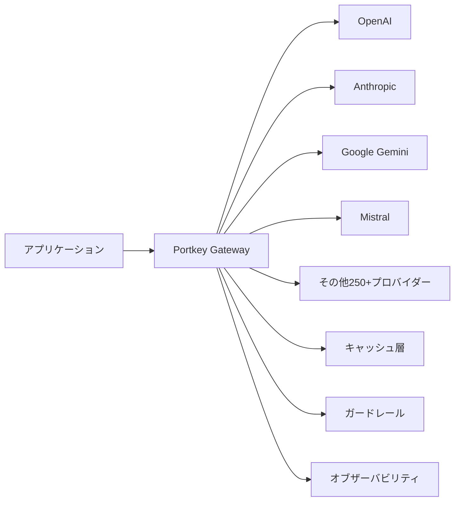
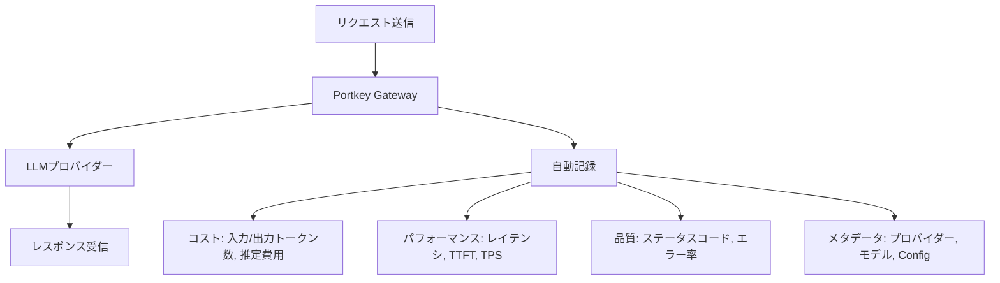

# Portkey AIゲートウェイで本番LLMアプリの信頼性とコストを最適化する

## この記事でわかること

- Portkey AIゲートウェイの導入手順と、既存のOpenAI SDKコードへの最小変更での統合方法
- フォールバック・ロードバランシング・リトライを組み合わせた高可用性ルーティングの実装
- セマンティックキャッシュとシンプルキャッシュによるAPIコスト削減の設計パターン
- ガードレール（PII検出・有害コンテンツフィルタ）を本番環境で運用する方法
- オブザーバビリティ機能を活用したLLMリクエストの監視・分析手法

## 対象読者

- **想定読者**: 中級者のPython開発者で、LLMアプリを本番運用している（または運用を予定している）方
- **必要な前提知識**:
  - Python 3.10以降の基礎文法
  - OpenAI SDK（`openai` パッケージ）の基本的な使い方
  - REST APIの基本概念（エンドポイント、ヘッダー、レスポンス）
  - LLM（大規模言語モデル）の基本的な理解

## 結論・成果

Portkey AIゲートウェイを導入することで、複数のLLMプロバイダー（OpenAI、Anthropic、Google等）を**単一のAPI**で統合管理できます。公式の発表によると、Portkeyは24,000以上の組織で利用され、1日あたり500億以上のLLMトークンを処理しています。本記事で紹介するフォールバック・キャッシュ・ガードレールの組み合わせにより、**API障害時の自動復旧**、**セマンティックキャッシュによるコスト削減**、**PII漏洩防止**を1つのゲートウェイ層で実現できます。

:::message
関連記事: LLMゲートウェイの一般的な設計パターンについては「[LLMゲートウェイ×セマンティックキャッシュで本番APIコスト68%削減](https://zenn.dev/0h_n0/articles/b28d70b4cebd6b)」もあわせてご覧ください。本記事ではPortkey固有の統合APIとガードレール機能に焦点を当てます。
:::

## Portkey AIゲートウェイの全体像を理解する

Portkey AIゲートウェイは、アプリケーションと複数のLLMプロバイダーの間に位置する**ミドルウェア層**です。2026年2月に$15MのSeries A資金調達を完了し（Elevation Capital主導、Lightspeed参加）、年間$180M以上のLLMスペンドを管理する規模に成長しています。

### アーキテクチャの概要

Portkeyの処理フローを以下に示します。



主要な機能は以下の6つです。

| 機能 | 説明 | 主なユースケース |
|------|------|------------------|
| **統合API** | OpenAI SDK互換で250+プロバイダーに接続 | プロバイダー切り替え時のコード変更不要 |
| **フォールバック** | プライマリ障害時に自動で別プロバイダーへ切替 | API障害時の可用性確保 |
| **ロードバランシング** | 重み付きでリクエストを分散 | コスト最適化・レート制限回避 |
| **キャッシュ** | Simple（完全一致）/ Semantic（意味一致） | 繰り返しリクエストのコスト削減 |
| **ガードレール** | PII検出・有害コンテンツフィルタ等60+種類 | コンプライアンス・安全性確保 |
| **オブザーバビリティ** | リクエスト単位で40+の指標を記録 | コスト分析・パフォーマンス監視 |

### 他のAIゲートウェイとの位置づけ

Portkey、LiteLLM、Kong AI Gatewayの3製品が主要な選択肢です。Kongが実施したベンチマークでは、Kongはレイテンシでは優位（Portkeyより65%低レイテンシ）ですが、Portkeyはオブザーバビリティ・ガードレール・プロンプト管理を統合した「コントロールプレーン」を提供する点で差別化されています。

| 比較項目 | Portkey | LiteLLM | Kong AI Gateway |
|----------|---------|---------|-----------------|
| **対応モデル数** | 1,600+ | 100+ | 主要プロバイダー |
| **ガードレール** | 60+種類内蔵 | 外部連携 | Kong Plugin |
| **オブザーバビリティ** | 40+指標ネイティブ | 基本ログ | Kong Manager |
| **ライセンス** | MIT（OSS版） | MIT | Apache 2.0 |
| **自己ホスティング** | 可能 | 可能 | 可能 |

> **注意**: ベンチマーク結果はKong社が公開したもので、テスト条件（12CPU、400仮想ユーザー、1,000プロンプトトークン）に依存します。実際のパフォーマンスはワークロードとインフラ構成で大きく変動するため、自社環境での検証を推奨します。

## SDKを導入してマルチプロバイダーAPIを統合する

PortkeyはOpenAI SDKと互換のインターフェースを提供しているため、既存のOpenAIコードを最小限の変更で移行できます。この互換性がPortkeyの導入障壁を大きく下げています。

### インストールとセットアップ

```bash
# Portkey Python SDKのインストール
pip install portkey-ai
```

Portkey Cloudを利用する場合は、[ダッシュボード](https://app.portkey.ai)でAPIキーを発行します。自己ホスティングの場合は以下でローカル起動できます。

```bash
# OSS版ゲートウェイのローカル起動
npx @portkey-ai/gateway
# → http://localhost:8787/v1 でリクエスト受付開始
```

### 基本的なリクエスト（Portkey SDK）

Portkey SDKでの最小限の呼び出し例です。`model` パラメータに `@プロバイダー名/モデル名` 形式を指定するのがポイントです。

```python
# portkey_basic.py
from portkey_ai import Portkey

# Portkey APIキーで初期化
client = Portkey(api_key="YOUR_PORTKEY_API_KEY")

# OpenAIのGPT-4oにリクエスト
response = client.chat.completions.create(
    model="@openai-prod/gpt-4o",  # @プロバイダー名/モデル名
    messages=[
        {"role": "system", "content": "簡潔に回答してください。"},
        {"role": "user", "content": "Pythonのデコレータを1文で説明してください"}
    ],
    max_tokens=200
)

print(response.choices[0].message.content)
```

### 既存のOpenAI SDKコードからの移行

既に `openai` パッケージを使っているプロジェクトでは、**2行の変更**だけでPortkeyを経由できます。

```python
# before_portkey.py（変更前）
from openai import OpenAI

client = OpenAI(api_key="sk-...")
response = client.chat.completions.create(
    model="gpt-4o",
    messages=[{"role": "user", "content": "Hello!"}]
)
```

```python
# after_portkey.py（変更後: 2行だけ変更）
from openai import OpenAI
from portkey_ai import PORTKEY_GATEWAY_URL  # 追加

client = OpenAI(
    api_key="YOUR_PORTKEY_API_KEY",  # ← Portkey APIキーに変更
    base_url=PORTKEY_GATEWAY_URL     # ← ベースURLを変更
)

response = client.chat.completions.create(
    model="@openai-prod/gpt-4o",  # @プロバイダー名を付与
    messages=[{"role": "user", "content": "Hello!"}]
)
```

**なぜこの設計か:**
- OpenAI SDKのインターフェースを変更しないため、既存のテストコードやラッパーがそのまま動作する
- `base_url` の差し替えだけで全リクエストがPortkey経由になり、オブザーバビリティが即座に有効化される
- プロバイダーの切り替えは `model` 文字列の変更だけで完了する

### プロバイダーを切り替える

同一のクライアントインスタンスから、`model` パラメータだけで異なるプロバイダーに切り替えられます。

```python
# multi_provider.py
from portkey_ai import Portkey

client = Portkey(api_key="YOUR_PORTKEY_API_KEY")

messages = [{"role": "user", "content": "量子コンピュータとは？"}]

# OpenAI GPT-4o
resp_openai = client.chat.completions.create(
    model="@openai-prod/gpt-4o",
    messages=messages,
    max_tokens=300
)

# Anthropic Claude Sonnet 4
resp_anthropic = client.chat.completions.create(
    model="@anthropic-prod/claude-sonnet-4-20250514",
    messages=messages,
    max_tokens=300
)

# Google Gemini 2.5 Pro
resp_gemini = client.chat.completions.create(
    model="@google-prod/gemini-2.5-pro",
    messages=messages,
    max_tokens=300
)
```

> **注意**: Anthropic SDKのネイティブインターフェース（`client.messages.create`）も対応していますが、統一的なインターフェースで扱う場合はOpenAI互換の `chat.completions.create` が管理しやすいです。

## フォールバック・ロードバランシング・キャッシュで高可用性を実現する

本番環境でのLLMアプリ運用では、プロバイダー障害やレート制限が避けられません。Portkeyのルーティング機能を使って、これらの問題に対処する方法を見ていきましょう。

### フォールバック設定

プライマリプロバイダーが障害を起こした場合に、自動的にバックアッププロバイダーに切り替わる設定です。

```python
# fallback_config.py
from portkey_ai import Portkey

# フォールバック設定をConfig Objectで定義
fallback_config = {
    "strategy": {
        "mode": "fallback",
        "on_status_codes": [429, 500, 503]  # レート制限・サーバーエラー時のみ
    },
    "targets": [
        {
            "override_params": {"model": "@openai-prod/gpt-4o"}
        },
        {
            "override_params": {"model": "@anthropic-prod/claude-sonnet-4-20250514"}
        },
        {
            "override_params": {"model": "@google-prod/gemini-2.5-pro"}
        }
    ]
}

client = Portkey(
    api_key="YOUR_PORTKEY_API_KEY",
    config=fallback_config
)

# リクエスト: OpenAI → 失敗時 Anthropic → 失敗時 Google
response = client.chat.completions.create(
    messages=[{"role": "user", "content": "Pythonのasync/awaitを説明して"}],
    max_tokens=500
)
```

`on_status_codes` を指定しない場合、すべての非2xxレスポンスでフォールバックが発火します。本番運用では **429（レート制限）と503（サービス利用不可）に絞る**のが一般的です。400（不正リクエスト）でフォールバックしても、リクエスト内容自体に問題があるため別プロバイダーでも失敗します。

### ロードバランシング設定

複数のAPIキーやプロバイダー間でリクエストを重み付き分散します。

```python
# loadbalance_config.py
loadbalance_config = {
    "strategy": {
        "mode": "loadbalance"
    },
    "targets": [
        {
            "weight": 0.7,  # 70%のリクエスト
            "override_params": {"model": "@openai-prod/gpt-4o"}
        },
        {
            "weight": 0.3,  # 30%のリクエスト
            "override_params": {"model": "@anthropic-prod/claude-sonnet-4-20250514"}
        }
    ]
}

client = Portkey(
    api_key="YOUR_PORTKEY_API_KEY",
    config=loadbalance_config
)
```

**よくある間違い**: weight値は「確率」であり「固定比率」ではありません。100リクエスト中に必ず70:30に分配されるわけではなく、個々のリクエストが70%の確率でOpenAI、30%の確率でAnthropicに振り分けられます。短期的には偏りが生じることがあります。

### フォールバック + ロードバランシングの組み合わせ

実運用ではフォールバックとロードバランシングを組み合わせることで、負荷分散と障害耐性を両立できます。

```python
# combined_routing.py
combined_config = {
    "strategy": {
        "mode": "fallback",
        "on_status_codes": [429, 500, 503]
    },
    "targets": [
        {
            # プライマリ: OpenAI 2キー間でロードバランス
            "strategy": {"mode": "loadbalance"},
            "targets": [
                {
                    "weight": 0.5,
                    "override_params": {"model": "@openai-key1/gpt-4o"}
                },
                {
                    "weight": 0.5,
                    "override_params": {"model": "@openai-key2/gpt-4o"}
                }
            ]
        },
        {
            # フォールバック: Anthropic
            "override_params": {
                "model": "@anthropic-prod/claude-sonnet-4-20250514"
            }
        }
    ]
}

client = Portkey(
    api_key="YOUR_PORTKEY_API_KEY",
    config=combined_config
)
```

この構成では、通常時はOpenAIの2つのAPIキーに50:50でリクエストを分散し、OpenAI側が429/500/503を返した場合にAnthropicへフォールバックします。

### リトライ設定

ネットワーク一時障害への対処として、指数バックオフ付きリトライが組み込まれています。

```python
# retry_config.py
retry_config = {
    "retry": {
        "attempts": 3,              # 最大3回リトライ
        "on_status_codes": [429, 500, 502, 503]
    },
    "strategy": {
        "mode": "fallback",
        "on_status_codes": [429, 503]
    },
    "targets": [
        {"override_params": {"model": "@openai-prod/gpt-4o"}},
        {"override_params": {"model": "@anthropic-prod/claude-sonnet-4-20250514"}}
    ]
}
```

リトライは各ターゲット内で実行されるため、OpenAIに3回リトライ → 全失敗 → Anthropicに3回リトライ、という流れになります。

> **制約条件**: Portkeyのデフォルトリトライは最大5回で、指数バックオフが適用されます。429（レート制限）の場合、リトライ間隔が十分でないとすべてのリトライが429を返す可能性があります。レート制限が頻発する場合は、リトライよりもロードバランシングによるキー分散が根本的な対策になります。

### キャッシュ設定

Portkeyは2種類のキャッシュを提供します。

```python
# cache_config.py

# 1. シンプルキャッシュ: プロンプトの完全一致でヒット
simple_cache_config = {
    "cache": {
        "mode": "simple",
        "max_age": 3600  # 1時間（秒単位、最小60秒・最大90日）
    },
    "override_params": {"model": "@openai-prod/gpt-4o"}
}

# 2. セマンティックキャッシュ: プロンプトの意味的類似でヒット
semantic_cache_config = {
    "cache": {
        "mode": "semantic",
        "max_age": 3600
    },
    "override_params": {"model": "@openai-prod/gpt-4o"}
}

client = Portkey(
    api_key="YOUR_PORTKEY_API_KEY",
    config=semantic_cache_config
)

# 1回目: LLMにリクエスト → レスポンスがキャッシュされる
resp1 = client.chat.completions.create(
    messages=[
        {"role": "system", "content": "技術用語を解説してください"},
        {"role": "user", "content": "Dockerとは何ですか？"}
    ],
    max_tokens=300
)

# 2回目: 意味的に類似 → キャッシュヒット（LLMへのリクエスト不要）
resp2 = client.chat.completions.create(
    messages=[
        {"role": "system", "content": "技術用語を解説してください"},
        {"role": "user", "content": "Dockerについて教えてください"}  # 表現が異なる
    ],
    max_tokens=300
)
```

**セマンティックキャッシュの制約**:
- **入力トークン上限**: 8,191トークン未満のリクエストのみ対応
- **メッセージ数**: 4メッセージ以下
- **類似度計算**: コサイン類似度で閾値を超えた場合にキャッシュヒット
- **システムメッセージ**: 類似度判定の対象外（ユーザーメッセージのみで判定）
- **対応エンドポイント**: `/chat/completions` と `/completions` のみ

**キャッシュが有効なユースケースとそうでないケース**:

| ユースケース | キャッシュ有効性 | 理由 |
|------------|-----------------|------|
| FAQ対応チャットボット | 高い | 同じ質問が繰り返される |
| ドキュメント要約 | 中程度 | 同一ドキュメントの再要約時 |
| コードレビュー | 低い | 入力が毎回異なる |
| リアルタイムデータ分析 | 低い | 鮮度の高い回答が必要 |

### キャッシュの強制リフレッシュ

キャッシュ済みの古い回答を更新したい場合は、リクエスト単位でキャッシュをバイパスできます。

```python
# キャッシュを無視して新しいレスポンスを取得
response = client.with_options(
    cache_force_refresh=True
).chat.completions.create(
    messages=[{"role": "user", "content": "最新のPython 3.13の新機能は？"}],
    model="@openai-prod/gpt-4o"
)
```

## ガードレールで入出力の安全性を確保する

本番LLMアプリでは、ユーザー入力に含まれる個人情報（PII）の漏洩や、モデル出力の有害コンテンツが大きなリスクです。Portkeyは60種類以上のガードレールを提供し、リクエスト/レスポンスの両方をリアルタイムで検査できます。

### PII（個人情報）自動検出・マスキング

Portkeyのガードレールは、メールアドレス・電話番号・クレジットカード番号等のPIIを自動検出し、LLMへ送信する前にマスキングします。

```python
# guardrails_pii.py
from portkey_ai import Portkey

# ガードレール付きのConfig（Portkeyダッシュボードで作成したConfig IDを使用）
client = Portkey(
    api_key="YOUR_PORTKEY_API_KEY",
    config="pc-guardrails-pii-config"  # ダッシュボードで作成したConfig ID
)

# PIIを含むリクエスト
response = client.chat.completions.create(
    model="@openai-prod/gpt-4o",
    messages=[{
        "role": "user",
        "content": "田中太郎さん（tanaka@example.com, 090-1234-5678）の注文状況を確認して"
    }],
    max_tokens=300
)
# → LLMには「{{NAME_1}}さん（{{EMAIL_ADDRESS_1}}, {{PHONE_NUMBER_1}}）の注文状況を確認して」
#   が送信される
```

検出されたPIIは標準化されたプレースホルダーに置換されます。

| PIIタイプ | 置換後のプレースホルダー |
|-----------|--------------------------|
| メールアドレス | `{{EMAIL_ADDRESS_1}}`, `{{EMAIL_ADDRESS_2}}` |
| 電話番号 | `{{PHONE_NUMBER_1}}`, `{{PHONE_NUMBER_2}}` |
| クレジットカード | `{{CREDIT_CARD_1}}` |
| 氏名 | `{{NAME_1}}`, `{{NAME_2}}` |

### カスタムガードレール（正規表現パターン）

業務固有のパターン（社員番号、内部プロジェクトコード等）を検出するカスタムガードレールも設定できます。

```python
# guardrails_custom.py

# ダッシュボードで以下のようなConfig JSONを作成
guardrail_config = {
    "output_guardrails": [
        {
            "type": "regex_match",
            "pattern": r"EMP-\d{6}",  # 社員番号パターン
            "action": "redact",        # 検出時にマスク
            "replacement": "{{EMPLOYEE_ID}}"
        },
        {
            "type": "word_filter",
            "words": ["社外秘", "Confidential"],
            "action": "block"  # 検出時にリクエストをブロック
        }
    ]
}
```

**ハマりポイント**: ガードレールの `action` には `block`（リクエスト/レスポンスを停止）と `redact`（マスキングして通過）の2種類があります。`block` を指定した場合、ガードレール違反時にAPIレスポンスがエラーになるため、アプリケーション側でエラーハンドリングが必要です。本番導入前にステージング環境でガードレールの誤検出率を検証しましょう。

### ガードレールのログ確認

Portkeyはガードレールの判定結果をリクエスト単位で記録します。どのチェックが通過し、どのチェックで失敗（ブロック/マスキング）したかをダッシュボードで確認できます。これにより、誤検出の調整やガードレールポリシーの改善が可能です。

## オブザーバビリティでLLMリクエストを可視化する

Portkeyは各リクエストに対して40以上の指標を自動記録します。2025年のGartner Cool Vendors（LLM Observability部門）にも選出されており、LLMアプリ運用の可視化に注力しています。

### 自動記録される主要指標

Portkeyを経由するだけで、追加のコードなしに以下の指標が記録されます。



| 指標カテゴリ | 主な項目 | 用途 |
|------------|---------|------|
| **コスト** | 入力/出力トークン数、推定費用（USD） | 月次コスト分析、予算管理 |
| **パフォーマンス** | レイテンシ（ms）、TTFT（最初のトークンまでの時間） | SLO監視、ボトルネック特定 |
| **信頼性** | ステータスコード、エラー率、リトライ回数 | 障害検知、SLI計測 |
| **ルーティング** | 使用プロバイダー、フォールバック発火回数 | ルーティング最適化 |
| **ガードレール** | 各チェックの合否、処理時間 | ポリシー改善 |

### メタデータによるリクエスト分類

リクエストにメタデータを付与することで、ユーザー別・機能別のコスト分析が可能になります。

```python
# observability_metadata.py
from portkey_ai import Portkey

client = Portkey(api_key="YOUR_PORTKEY_API_KEY")

response = client.with_options(
    metadata={
        "user_id": "user-12345",
        "feature": "document-summary",
        "environment": "production",
        "team": "ml-platform"
    }
).chat.completions.create(
    model="@openai-prod/gpt-4o",
    messages=[{"role": "user", "content": "この文書を要約してください"}],
    max_tokens=500
)
```

これにより、ダッシュボードで「どのチームが」「どの機能で」「いくらのLLMコストを消費しているか」をフィルタリングして分析できます。

### トレースIDによるリクエスト追跡

フォールバックが発火した場合、1つのユーザーリクエストが複数のLLMリクエストに分岐します。トレースIDを使うことで、一連の試行をまとめて追跡できます。

```python
# observability_trace.py
import uuid
from portkey_ai import Portkey

client = Portkey(api_key="YOUR_PORTKEY_API_KEY")

# リクエストごとに一意のトレースIDを生成
trace_id = str(uuid.uuid4())

response = client.with_options(
    trace_id=trace_id,
    metadata={"request_source": "api-endpoint-v2"}
).chat.completions.create(
    model="@openai-prod/gpt-4o",
    messages=[{"role": "user", "content": "Hello"}],
    max_tokens=100
)

# trace_idでダッシュボード検索 → OpenAI試行 → 失敗 → Anthropicフォールバック を一覧
print(f"Trace ID: {trace_id}")
```

## よくある問題と解決方法

本番運用でよく遭遇する問題とその対処法をまとめます。

| 問題 | 原因 | 解決方法 |
|------|------|----------|
| すべてのプロバイダーでタイムアウト | プロンプトが長すぎる / モデルの応答が遅い | `request_timeout` を設定し、タイムアウト閾値を調整 |
| セマンティックキャッシュがヒットしない | 入力が8,191トークン超 or メッセージ5個以上 | シンプルキャッシュに切り替え or プロンプトを短縮 |
| ガードレールで正常リクエストがブロックされる | 正規表現パターンが広すぎる | ステージング環境で誤検出率を計測し、パターンを調整 |
| フォールバック先でもエラー | 全プロバイダーが同時障害 or リクエスト内容自体が不正 | `on_status_codes` を見直し、400系はフォールバック対象外に |
| コストが想定より高い | キャッシュヒット率が低い | `cache_namespace` でユーザー別にキャッシュを分離し、ヒット率を確認 |
| レスポンスが遅い | ゲートウェイ層のオーバーヘッド | 自己ホスティング版をアプリと同一VPC/リージョンにデプロイ |

### キャッシュヒット率の確認と改善

キャッシュの効果を検証するには、Portkeyダッシュボードでキャッシュヒット率を定期的に確認しましょう。ヒット率が低い場合は以下を検討します。

1. **シンプルキャッシュに切り替え**: 同一プロンプトの繰り返しが多いユースケースでは、セマンティックキャッシュより確実にヒットする
2. **`cache_namespace` を活用**: ユーザー別やセッション別にキャッシュを分離し、ヒット精度を向上
3. **`max_age` を長く設定**: データの鮮度が重要でないユースケースでは、TTLを長く（例: 24時間 = 86,400秒）

## まとめと次のステップ

**まとめ:**

- Portkeyは**OpenAI SDK互換**のインターフェースで250+プロバイダー・1,600+モデルを統合管理でき、既存コードへの移行は `base_url` と `api_key` の2行変更で完了する
- **フォールバック + ロードバランシング + リトライ**の3層構成で、プロバイダー障害時も自動復旧する高可用性ルーティングを実装できる
- **セマンティックキャッシュ**は意味的に類似したリクエストのコスト削減に有効だが、8,191トークン未満・4メッセージ以下の制約がある
- **ガードレール**（PII検出・有害コンテンツフィルタ）でコンプライアンスリスクを低減できるが、誤検出率のチューニングが運用上の鍵
- **オブザーバビリティ**はコード追加不要で40+指標を自動記録し、メタデータ付与でチーム別・機能別のコスト分析が可能

**次にやるべきこと:**

1. [Portkey公式ドキュメント](https://portkey.ai/docs/guides/getting-started/getting-started-with-ai-gateway)でプロバイダー設定を完了し、ステージング環境で基本的なリクエストを検証する
2. フォールバック設定を追加し、プライマリプロバイダーを意図的に止めてフォールバック動作を確認する
3. ガードレールをステージング環境で有効化し、誤検出率を計測してからプロダクションに適用する

## 参考

- [Portkey公式ドキュメント - Getting Started with AI Gateway](https://portkey.ai/docs/guides/getting-started/getting-started-with-ai-gateway)
- [Portkey AI Gateway GitHub（MIT License、10.8kスター）](https://github.com/Portkey-AI/gateway)
- [Portkey Python SDK GitHub](https://github.com/Portkey-AI/portkey-python-sdk)
- [Portkey Fallback設定ドキュメント](https://portkey.ai/docs/product/ai-gateway/fallbacks)
- [Portkey Cache設定ドキュメント（Simple & Semantic）](https://portkey.ai/docs/product/ai-gateway/cache-simple-and-semantic)
- [Kong AI Gateway Benchmark: Kong vs Portkey vs LiteLLM](https://konghq.com/blog/engineering/ai-gateway-benchmark-kong-ai-gateway-portkey-litellm)
- [Portkey $15M Series A発表（2026年2月）](https://www.globenewswire.com/news-release/2026/02/19/3241385/0/en/Portkey-Raises-15M-Series-A-to-Scale-the-Unified-Control-Plane-for-Production-AI.html)

---

:::message
この記事はAI（Claude Code）により自動生成されました。内容の正確性については複数の情報源で検証していますが、実際の利用時は公式ドキュメントもご確認ください。
:::
