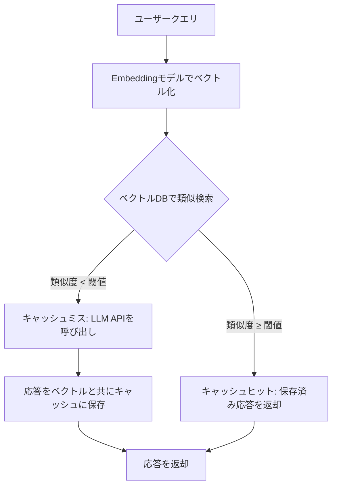
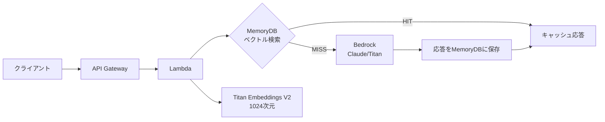

# セマンティックキャッシュ実装ガイド：LLM APIコスト73%削減と応答97%高速化

## この記事でわかること

- セマンティックキャッシュの仕組みと、完全一致キャッシュ・プロンプトキャッシュとの使い分け
- RedisVL `SemanticCache` と LangChain `RedisSemanticCache` による実装手法
- 類似度閾値のチューニング戦略と偽陽性を3%以下に抑える方法
- AWS MemoryDB / Redis LangCache を使った本番アーキテクチャの設計
- TTL戦略・キャッシュ無効化・マルチテナント対応の運用ノウハウ

## 対象読者

- **想定読者**: LLMアプリケーションを本番運用している中級者エンジニア
- **必要な前提知識**:
  - Python 3.10+ の基礎文法
  - OpenAI API / Anthropic Claude API の基本的な利用経験
  - Redis の基本概念（GET/SET、TTL）
  - ベクトル埋め込み（Embedding）の概念理解

## 結論・成果

セマンティックキャッシュを適切に導入することで、**LLM APIコストを50-80%削減し、応答時間を秒単位からミリ秒単位に短縮**できます。VentureBeatの報告によると、セマンティックキャッシュの導入で**コストを73%削減**した事例があります。AWS MemoryDBを用いた検証では**レスポンス時間の97.6%短縮**（5秒→120ms）が確認されています。

ただし、閾値設定を誤ると偽陽性（意味が異なるのにキャッシュヒットする）が発生し、ユーザー体験を損なうリスクがあります。本記事では、実装から閾値チューニング、本番運用までを段階的に解説します。

> **関連記事**: LLMキャッシング全般の3層戦略（完全一致・セマンティック・プロンプトキャッシング）については、[LLM出力キャッシング戦略](https://zenn.dev/0h_n0/articles/d32f933fec9176)を参照してください。本記事はセマンティックキャッシュの実装に特化した深掘り記事です。

## セマンティックキャッシュの仕組みを理解する

従来の完全一致キャッシュでは、`"Pythonのリスト操作"` と `"Pythonでリストを操作する方法"` は**別のクエリ**として扱われ、キャッシュヒットしません。セマンティックキャッシュは、クエリをベクトル埋め込みに変換し、**意味の類似度**でキャッシュの一致を判定します。

### キャッシュ処理フロー



### 3つのキャッシュ戦略の比較

セマンティックキャッシュは、キャッシュ戦略の中で**コストとヒット率のバランスに優れた選択肢**です。

| 戦略 | 仕組み | ヒット率 | レイテンシ削減 | 実装コスト |
|------|--------|---------|--------------|-----------|
| **完全一致** | 文字列ハッシュ一致 | 15-30% | 99%+ | 低 |
| **セマンティック** | ベクトル類似度検索 | 25-45% | 95-97% | 中 |
| **プロンプトキャッシング** | API側プレフィックス再利用 | 50-70% | 50-90% | 低（API依存） |

**なぜセマンティックキャッシュを選ぶか:**
- 完全一致キャッシュだけではヒット率が低すぎる（自然言語の表現揺れに対応できない）
- プロンプトキャッシングはAPI提供元に依存し、制御しきれない
- セマンティックキャッシュは**自前で制御可能**で、閾値やTTLを用途に応じて調整できる

**注意点:**
> セマンティックキャッシュはEmbedding計算のオーバーヘッドがあるため、**全クエリの平均レイテンシは完全一致キャッシュより5-20ms増加**します。キャッシュミス時のペナルティを考慮して導入判断してください。

## RedisVL SemanticCacheで実装する

RedisVLの`SemanticCache`は、セマンティックキャッシュの構築に必要な機能を統合的に提供するライブラリです。Redis Stack上でベクトルインデックスを自動作成し、類似度検索・TTL管理・フィルタリングをサポートします。

### 環境構築

```bash
# Redis Stackの起動（ベクトル検索モジュールを含む）
docker run -d --name redis-stack -p 6379:6379 redis/redis-stack:latest

# 必要なパッケージのインストール
pip install redisvl openai
```

### 基本実装

```python
# semantic_cache.py
from redisvl.extensions.cache.llm import SemanticCache
from redisvl.utils.vectorize import HFTextVectorizer

# セマンティックキャッシュの初期化
cache = SemanticCache(
    name="llm_cache",
    redis_url="redis://localhost:6379",
    distance_threshold=0.1,  # コサイン距離の閾値（低いほど厳密）
    vectorizer=HFTextVectorizer("redis/langcache-embed-v1"),
)


def ask_with_cache(prompt: str, llm_call) -> str:
    """キャッシュ付きLLM呼び出し"""
    # 1. キャッシュ検索
    results = cache.check(
        prompt=prompt,
        return_fields=["prompt", "response", "metadata"],
    )

    if results:
        print(f"[CACHE HIT] 類似クエリ: {results[0]['prompt']}")
        return results[0]["response"]

    # 2. キャッシュミス → LLM呼び出し
    print("[CACHE MISS] LLM APIを呼び出します")
    response = llm_call(prompt)

    # 3. 応答をキャッシュに保存
    cache.store(
        prompt=prompt,
        response=response,
        metadata={"source": "openai", "model": "gpt-4o"},
    )
    return response
```

`distance_threshold=0.1`はコサイン距離の閾値で、**値が小さいほど厳密なマッチング**になります。コサイン類似度に換算すると`1 - 0.1 = 0.9`（90%以上の類似度でヒット）に相当します。

### LangChain統合による実装

LangChainを使用している場合、`RedisSemanticCache`でグローバルキャッシュとして設定できます。

```python
# langchain_semantic_cache.py
from langchain_redis import RedisSemanticCache
from langchain_openai import ChatOpenAI, OpenAIEmbeddings
from langchain.globals import set_llm_cache

# セマンティックキャッシュの設定
set_llm_cache(
    RedisSemanticCache(
        redis_url="redis://localhost:6379",
        embeddings=OpenAIEmbeddings(model="text-embedding-3-small"),
        distance_threshold=0.1,
    )
)

# 通常通りLLMを呼び出す（キャッシュは自動適用）
llm = ChatOpenAI(model="gpt-4o", temperature=0)

# 1回目: キャッシュミス（LLM API呼び出し）
response1 = llm.invoke("Pythonでリストをソートする方法は？")

# 2回目: キャッシュヒット（意味的に類似 → ミリ秒で応答）
response2 = llm.invoke("Pythonのリストをソートするにはどうすればいいですか？")
```

**なぜLangChain統合を選ぶか:**
- 既存のLangChainアプリケーションに**コード変更最小限**で導入可能
- `set_llm_cache`の1行で全LLM呼び出しにキャッシュが適用される

**注意点:**
> LangChain統合ではキャッシュの粒度が「LLMモデル + プロンプト」単位になります。同じプロンプトでも`temperature`やシステムプロンプトが異なる場合にキャッシュヒットしてしまう可能性があるため、パラメータが固定されたユースケースでの利用を推奨します。

## 類似度閾値をチューニングする

セマンティックキャッシュの性能は**閾値設定**で決まります。閾値が緩すぎると偽陽性（間違ったキャッシュヒット）が増え、厳しすぎるとヒット率が低下します。

### 用途別の推奨閾値

InfoQの銀行業務でのケーススタディによると、クエリカテゴリごとに閾値を分けることで偽陽性率を大幅に改善できます。

| ユースケース | 推奨閾値（コサイン距離） | コサイン類似度換算 | 理由 |
|------------|----------------------|------------------|------|
| **FAQ・ヘルプデスク** | 0.10-0.15 | 0.85-0.90 | 表現揺れが大きく、寛容な設定が有効 |
| **ポリシー・規約** | 0.06-0.10 | 0.90-0.94 | 回答の正確性が重要 |
| **注文・トラッキング** | 0.02-0.05 | 0.95-0.98 | 固有ID・数値を含むため厳密に |
| **コード生成** | 0.05-0.08 | 0.92-0.95 | 文脈依存度が高い |

### 閾値チューニングの実装

```python
# threshold_tuner.py
from dataclasses import dataclass
from redisvl.extensions.cache.llm import SemanticCache
from redisvl.utils.vectorize import HFTextVectorizer


@dataclass
class ThresholdTestResult:
    threshold: float
    hit_rate: float
    false_positive_rate: float
    avg_latency_ms: float


def evaluate_threshold(
    cache: SemanticCache,
    test_pairs: list[tuple[str, str, bool]],
    threshold: float,
) -> ThresholdTestResult:
    """閾値を評価する

    Args:
        cache: SemanticCacheインスタンス
        test_pairs: (query, expected_match_query, should_hit) のリスト
        threshold: テスト対象の閾値
    """
    cache.set_threshold(threshold)
    hits = 0
    false_positives = 0
    total = len(test_pairs)

    for query, _, should_hit in test_pairs:
        results = cache.check(prompt=query)
        is_hit = len(results) > 0

        if is_hit:
            hits += 1
        if is_hit and not should_hit:
            false_positives += 1

    return ThresholdTestResult(
        threshold=threshold,
        hit_rate=hits / total,
        false_positive_rate=false_positives / total,
        avg_latency_ms=0.0,  # 別途計測
    )


# テストデータ例
test_pairs = [
    ("Pythonでリストをソートする方法", "Pythonのリストソート方法", True),
    ("Pythonの辞書をソートする方法", "Pythonのリストソート方法", False),
    ("AWSのS3バケットを作成する", "S3バケットの作り方", True),
    ("AWSのEC2インスタンスを起動する", "S3バケットの作り方", False),
]

# 複数の閾値で評価
cache = SemanticCache(
    name="threshold_test",
    redis_url="redis://localhost:6379",
    distance_threshold=0.1,
    vectorizer=HFTextVectorizer("redis/langcache-embed-v1"),
)

# まずテストデータのうち「正解」側をキャッシュに格納
for _, expected_query, _ in test_pairs:
    cache.store(prompt=expected_query, response=f"Response for: {expected_query}")

for threshold in [0.05, 0.10, 0.15, 0.20, 0.30]:
    result = evaluate_threshold(cache, test_pairs, threshold)
    print(
        f"閾値={result.threshold:.2f}: "
        f"ヒット率={result.hit_rate:.1%}, "
        f"偽陽性率={result.false_positive_rate:.1%}"
    )
```

### 偽陽性が3-5%を超えた場合の対策

閾値チューニングだけで偽陽性を抑えられない場合、以下のアーキテクチャ改善が有効です。

1. **ドメイン特化Embeddingモデル**: 汎用モデル（`text-embedding-3-small`）からドメインファインチューニングモデルに変更することで、類似度の精度が向上する
2. **クロスエンコーダによるリランキング**: キャッシュヒット候補に対してクロスエンコーダで再スコアリングし、閾値以下を除外する
3. **クエリ前処理**: タイポ修正・スラング正規化で入力クエリの品質を統一する

```python
# cross_encoder_reranking.py
from sentence_transformers import CrossEncoder

reranker = CrossEncoder("cross-encoder/ms-marco-MiniLM-L-6-v2")


def check_with_reranking(
    cache: SemanticCache,
    query: str,
    rerank_threshold: float = 0.7,
) -> list[dict] | None:
    """キャッシュヒット候補をクロスエンコーダで再検証"""
    candidates = cache.check(prompt=query, num_results=3)
    if not candidates:
        return None

    # クロスエンコーダで関連度を再スコアリング
    pairs = [(query, c["prompt"]) for c in candidates]
    scores = reranker.predict(pairs)

    # 閾値以上のみ採用
    valid = [
        c for c, score in zip(candidates, scores) if score >= rerank_threshold
    ]
    return valid if valid else None
```

## 本番アーキテクチャを設計する

セマンティックキャッシュの本番運用では、ベクトルDB・Embeddingモデル・TTL戦略・マルチテナント対応を組み合わせた設計が必要です。

### AWS MemoryDBを使ったアーキテクチャ

AWS環境では、MemoryDBのベクトル検索機能を活用したセマンティックキャッシュが構築できます。DevelopersIOの検証では、**レスポンス時間を97.6%短縮**（5,010ms→188ms）する結果が報告されています。



### TTL戦略の設計

キャッシュの鮮度を保つため、コンテンツの変化頻度に応じたTTL設計が重要です。

```python
# ttl_strategy.py
from enum import IntEnum


class CacheTTL(IntEnum):
    """コンテンツ種別ごとのTTL（秒）"""
    REALTIME = 300        # 5分: 価格・在庫・リアルタイムデータ
    FREQUENT = 3_600      # 1時間: ニュース・トレンド情報
    MODERATE = 14_400     # 4時間: 製品説明・ドキュメント
    STABLE = 86_400       # 24時間: FAQ・ポリシー・チュートリアル
    PERMANENT = 604_800   # 7日間: 数学的事実・不変の知識


def get_ttl_for_query(query: str, category: str) -> int:
    """クエリカテゴリに基づいてTTLを返す"""
    ttl_map = {
        "pricing": CacheTTL.REALTIME,
        "news": CacheTTL.FREQUENT,
        "documentation": CacheTTL.MODERATE,
        "faq": CacheTTL.STABLE,
        "knowledge": CacheTTL.PERMANENT,
    }
    return ttl_map.get(category, CacheTTL.MODERATE)
```

**よくある間違い:**

最初はTTLを一律24時間に設定したくなりますが、価格情報やリアルタイムデータに長いTTLを適用すると**古い情報がキャッシュヒットして誤った回答を返す**問題が発生します。コンテンツの変化頻度に応じたTTL分類は、運用初期から設計に含めるべきです。

### マルチテナント対応

複数ユーザーのデータを扱う場合、`filterable_fields`でテナント分離を実現します。

```python
# multi_tenant_cache.py
from redisvl.extensions.cache.llm import SemanticCache
from redisvl.query.filter import Tag
from redisvl.utils.vectorize import HFTextVectorizer

tenant_cache = SemanticCache(
    name="tenant_cache",
    redis_url="redis://localhost:6379",
    distance_threshold=0.1,
    vectorizer=HFTextVectorizer("redis/langcache-embed-v1"),
    filterable_fields=[
        {"name": "tenant_id", "type": "tag"},
        {"name": "content_type", "type": "tag"},
    ],
)


def store_for_tenant(
    tenant_id: str, prompt: str, response: str, content_type: str
) -> None:
    """テナント別にキャッシュを保存"""
    tenant_cache.store(
        prompt=prompt,
        response=response,
        filters={"tenant_id": tenant_id, "content_type": content_type},
    )


def check_for_tenant(tenant_id: str, prompt: str) -> str | None:
    """テナント別にキャッシュを検索（他テナントのデータは返さない）"""
    tenant_filter = Tag("tenant_id") == tenant_id
    results = tenant_cache.check(
        prompt=prompt,
        filter_expression=tenant_filter,
        num_results=1,
    )
    return results[0]["response"] if results else None
```

## キャッシュの監視と運用メトリクスを設計する

本番環境では、キャッシュのヒット率・偽陽性率・レイテンシを継続的に監視する仕組みが必要です。

### 監視すべきメトリクス

| メトリクス | 目標値 | アラート閾値 | 計測方法 |
|-----------|--------|------------|---------|
| **キャッシュヒット率** | 30-50% | 20%以下 | `hits / total_queries` |
| **偽陽性率** | 1-3% | 5%以上 | ユーザーフィードバック / サンプリング検証 |
| **キャッシュ応答レイテンシ** | 5-50ms | 100ms以上 | p50/p95/p99 |
| **Embedding計算時間** | 10-30ms | 50ms以上 | ベクトル化処理の計測 |
| **キャッシュストレージ使用量** | - | 80%以上 | Redis INFO memory |

### Prometheus連携の実装例

```python
# cache_metrics.py
import time
from prometheus_client import Counter, Histogram, Gauge

# メトリクス定義
CACHE_HITS = Counter(
    "semantic_cache_hits_total",
    "Total cache hits",
    ["cache_name", "content_type"],
)
CACHE_MISSES = Counter(
    "semantic_cache_misses_total",
    "Total cache misses",
    ["cache_name"],
)
CACHE_LATENCY = Histogram(
    "semantic_cache_latency_seconds",
    "Cache lookup latency",
    ["operation"],  # "check" or "store"
    buckets=[0.005, 0.01, 0.025, 0.05, 0.1, 0.25, 0.5],
)
CACHE_HIT_RATE = Gauge(
    "semantic_cache_hit_rate",
    "Rolling cache hit rate",
    ["cache_name"],
)


def cached_llm_call(cache, prompt: str, llm_call, cache_name: str = "default"):
    """メトリクス付きキャッシュLLM呼び出し"""
    # キャッシュ検索の計測
    start = time.perf_counter()
    results = cache.check(prompt=prompt)
    elapsed = time.perf_counter() - start
    CACHE_LATENCY.labels(operation="check").observe(elapsed)

    if results:
        CACHE_HITS.labels(
            cache_name=cache_name,
            content_type=results[0].get("metadata", {}).get("content_type", "unknown"),
        ).inc()
        return results[0]["response"]

    CACHE_MISSES.labels(cache_name=cache_name).inc()

    # LLM呼び出し
    response = llm_call(prompt)

    # キャッシュ保存の計測
    start = time.perf_counter()
    cache.store(prompt=prompt, response=response)
    elapsed = time.perf_counter() - start
    CACHE_LATENCY.labels(operation="store").observe(elapsed)

    return response
```

## よくある問題と解決方法

| 問題 | 原因 | 解決方法 |
|------|------|----------|
| キャッシュヒット率が10%以下 | 閾値が厳しすぎる / クエリの多様性が高い | 閾値を段階的に緩和（0.05→0.10→0.15） |
| 誤ったキャッシュ応答が返る | 閾値が緩すぎる / 汎用Embeddingの精度不足 | 閾値を厳格化 + ドメイン特化モデルの検討 |
| キャッシュ応答が遅い（100ms+） | Redisメモリ不足 / インデックスサイズ超過 | Redis StackのFLATからHNSWインデックスに変更 |
| 古い情報がキャッシュヒット | TTL未設定 / 一律TTL | コンテンツ種別ごとのTTL戦略を適用 |
| マルチユーザー環境でデータ漏洩 | テナントフィルタ未設定 | `filterable_fields`でテナント分離 |
| Embedding計算のコストが高い | 高次元モデル（1536次元）を使用 | 軽量モデル（384次元）への変更を検討 |

## まとめと次のステップ

**まとめ:**

- セマンティックキャッシュは、クエリをベクトル化して**意味の類似度でキャッシュヒットを判定**する手法で、自然言語の表現揺れに対応できる
- RedisVL `SemanticCache` または LangChain `RedisSemanticCache` を使えば、**数十行のコードで導入可能**
- 閾値は用途別に設定し（FAQ: 0.10-0.15、注文追跡: 0.02-0.05）、**偽陽性率3%以下を維持**する
- TTL戦略はコンテンツの変化頻度に応じて5段階で設計し、古い情報のキャッシュヒットを防ぐ
- 本番環境ではキャッシュヒット率・偽陽性率・レイテンシの3指標を継続監視する

**次にやるべきこと:**

- まずRedis Stackをローカルで起動し、RedisVLの`SemanticCache`で基本動作を確認する
- 自身のユースケースに合った閾値をテストデータで評価する
- AWS MemoryDB / Redis Cloudなど、本番向けマネージドサービスの検証を開始する

## 参考

- [Redis: What is semantic caching?](https://redis.io/blog/what-is-semantic-caching/) - セマンティックキャッシュの基本概念と設計指針
- [Redis: Semantic Caching for LLMs（RedisVL公式ドキュメント）](https://redis.io/docs/latest/develop/ai/redisvl/user_guide/llmcache/) - RedisVL SemanticCacheの実装リファレンス
- [Redis: LangCache紹介](https://redis.io/blog/spring-release-2025/) - 2025年リリースのマネージドセマンティックキャッシュ
- [AWS: MemoryDB Semantic Cache検証（DevelopersIO）](https://dev.classmethod.jp/articles/aws-memorydb-semantic-cache-llm-performance/) - AWS環境でのベンチマーク結果
- [AWS: Improve speed and reduce cost with MemoryDB](https://aws.amazon.com/blogs/database/improve-speed-and-reduce-cost-for-generative-ai-workloads-with-a-persistent-semantic-cache-in-amazon-memorydb/) - AWS公式ブログ
- [VentureBeat: Why your LLM bill is exploding](https://venturebeat.com/orchestration/why-your-llm-bill-is-exploding-and-how-semantic-caching-can-cut-it-by-73) - コスト73%削減の事例分析
- [InfoQ: Reducing False Positives in RAG Semantic Caching](https://www.infoq.com/articles/reducing-false-positives-retrieval-augmented-generation/) - 銀行業務での偽陽性削減ケーススタディ
- [GPTCache（GitHub）](https://github.com/zilliztech/GPTCache) - LangChain/LlamaIndex統合のOSSセマンティックキャッシュ
- [LangChain RedisSemanticCache API Reference](https://python.langchain.com/api_reference/redis/cache/langchain_redis.cache.RedisSemanticCache.html) - LangChain公式Redis統合ドキュメント

---

:::message
この記事はAI（Claude Code）により自動生成されました。内容の正確性については複数の情報源で検証していますが、実際の利用時は公式ドキュメントもご確認ください。
:::
