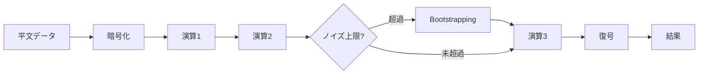
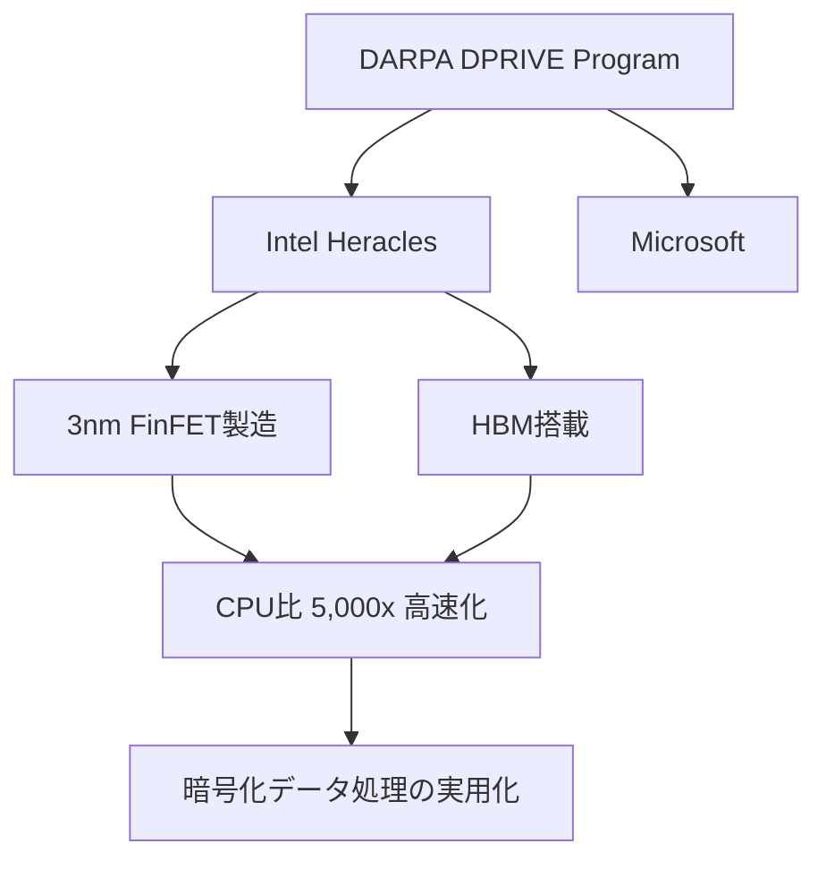
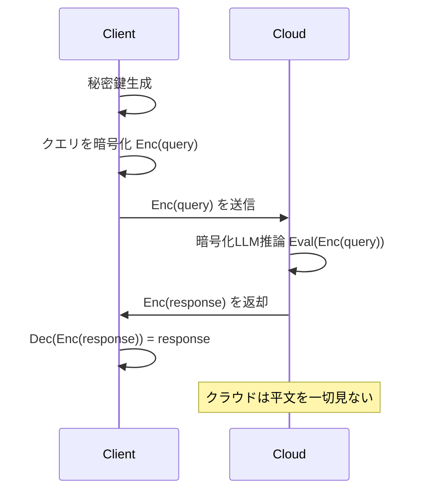

## この記事でわかること

- 準同型暗号（FHE）の4つの主要スキーム（TFHE・CKKS・BFV・BGV）の特徴と使い分け
- 2025〜2026年のFHEライブラリ（OpenFHE・SEAL・Concrete・Lattigo）のベンチマーク比較
- GPU加速・専用ASIC（Intel Heracles）によるFHE高速化の最新成果
- 暗号化LLM推論（EncryptedLLM）の仕組みとCPU比200倍の高速化手法
- FHEの現実的な制約と、実用化に向けた今後のロードマップ

## 対象読者

- **想定読者**: 中級〜上級のセキュリティ・暗号技術に関心のあるエンジニア
- **必要な前提知識**:
  - 公開鍵暗号の基本概念（RSA、楕円曲線暗号など）
  - 格子暗号（Lattice-based Cryptography）の概要レベルの理解
  - Python または C++ の基礎文法

## 結論・成果

準同型暗号（FHE）は2025〜2026年にかけて大きな転換期を迎えています。Intel の専用ASIC「Heracles」がCPU比**5,000倍**の高速化を達成し、GPU加速によるFHEライブラリの性能向上で暗号化LLM推論が**CPU比200倍**の速度で動作するようになりました。ライブラリ面ではOpenFHE 1.5.0、Zama Concrete v2.10がリリースされ、FHEプログラミングの敷居が下がっています。ただし、平文処理と比較して**1,000〜1,000,000倍**のオーバーヘッドが依然として存在し、本番環境での全面的な採用にはさらなる改善が必要です。

## FHEの基本原理と主要スキームを理解する

### 準同型暗号とは何か

準同型暗号（Fully Homomorphic Encryption, FHE）は、**暗号化されたデータに対して復号せずに演算を行える**暗号方式です。通常の暗号では、データを処理するために一度復号する必要がありますが、FHEでは暗号文のまま加算・乗算などの演算を実行できます。

この性質を数式で表すと、暗号化関数を $\text{Enc}$、復号関数を $\text{Dec}$ として以下が成立します。

$$
\text{Dec}(\text{Enc}(a) \oplus \text{Enc}(b)) = a + b
$$

$$
\text{Dec}(\text{Enc}(a) \otimes \text{Enc}(b)) = a \times b
$$

ここで $\oplus$ と $\otimes$ は暗号文上の演算を表します。加算と乗算の両方が可能であれば、理論上あらゆる計算を暗号化されたまま実行できます。

### 4世代のFHEスキーム

FHEは2009年のCraig Gentryによる理論的発明以来、4世代にわたって進化してきました。現在実用されている主要スキームを以下にまとめます。

| スキーム | 世代 | 特徴 | 主な用途 | 代表ライブラリ |
|---------|------|------|---------|--------------|
| **BGV** | 第2世代 | 整数の正確な演算 | 投票・集計 | HElib, OpenFHE |
| **BFV** | 第2世代 | BGVの改良版、パラメータ選択が容易 | 汎用整数演算 | SEAL, OpenFHE |
| **TFHE** | 第3世代 | 高速bootstrapping、ゲートレベル演算 | 論理回路・比較演算 | TFHE-rs, Concrete |
| **CKKS** | 第4世代 | 近似実数演算、ML向け | 機械学習推論 | SEAL, OpenFHE, HEaaN |

**なぜCKKSが注目されているか:**

CKKS（Cheon-Kim-Kim-Song）スキームは、実数の近似演算を効率的に行えるため、**機械学習の推論処理**と相性が良いのが特徴です。rescaling操作により多項式近似の評価を効率化でき、プライバシー保護MLの主流アプローチとなっています。

**注意点:**

> CKKSは「近似」演算であり、演算を重ねるごとに精度が低下します。金融取引の正確な金額計算など**厳密な整数演算が必要な用途ではBFV/BGVを選択**してください。

### Bootstrappingの課題

FHEの最大の技術的課題は**bootstrapping**（ノイズ除去操作）です。暗号文に対する演算を繰り返すと、内部ノイズが蓄積して正しく復号できなくなります。bootstrappingはこのノイズをリセットする処理ですが、計算コストが非常に高いという問題があります。



TFHEスキームはbootstrappingが高速（ミリ秒単位）であるのに対し、CKKS/BFVではbootstrappingに秒単位の時間がかかります。この違いが、スキーム選択において重要な判断基準となります。

## FHEライブラリの最新ベンチマークを比較する

### 主要ライブラリの概要

2026年3月時点で利用可能な主要FHEライブラリは以下の通りです。

| ライブラリ | 言語 | 対応スキーム | 最新バージョン | 特徴 |
|-----------|------|------------|--------------|------|
| **OpenFHE** | C++ | BFV, BGV, CKKS, TFHE | v1.5.0 (2026-02) | 最も包括的、研究向け |
| **SEAL** | C++ | BFV, CKKS | v4.1 | Microsoft製、.NETバインディング |
| **Concrete** | Rust/Python | TFHE | v2.10 (2025-04) | Zama製、MLコンパイラ統合 |
| **TFHE-rs** | Rust | TFHE | v1.1 | Zama製、高性能Rust実装 |
| **Lattigo** | Go | BFV, BGV, CKKS | v6.x | Go言語ネイティブ |
| **HElib** | C++ | BGV, CKKS | v2.3 | IBM製、BGV最適化 |

### ベンチマーク結果（2025年研究）

2025年に発表されたベンチマーク研究によると、ライブラリごとの性能差は顕著です。以下は加算・乗算の1操作あたりの処理時間です。

| 操作 | スキーム | SEAL | OpenFHE | HElib | Lattigo |
|------|---------|------|---------|-------|---------|
| 加算 | BFV | 0.04ms | **0.03ms** | 0.05ms | 0.06ms |
| 乗算 | BFV | 0.12ms | **0.055ms** | 0.15ms | 0.18ms |
| 加算 | CKKS | **0.031ms** | 0.045ms | 0.06ms | 0.08ms |
| 加算 | BGV | 0.03ms | 0.04ms | **0.021ms** | 0.07ms |

出典: 「Performance Analysis of Leading Homomorphic Encryption Libraries」(ACM, 2025)

**メモリ使用量**については、OpenFHEが全スキームで最も効率的で、他ライブラリと比較して最低**100MB以上**の差があると報告されています。

### 実際にOpenFHEを使ってみる

OpenFHE 1.5.0を使ったCKKSスキームでの暗号化演算の基本的な流れを見ていきましょう。

```cpp
// openfhe_ckks_example.cpp
// OpenFHE 1.5.0 で動作確認
#include "openfhe.h"
using namespace lbcrypto;

int main() {
    // 1. CKKSパラメータの設定
    CCParams<CryptoContextCKKSRNS> parameters;
    parameters.SetMultiplicativeDepth(5);  // 乗算回数の上限
    parameters.SetScalingModSize(50);      // スケーリングビット数
    parameters.SetBatchSize(8);            // バッチサイズ

    // 2. 暗号コンテキスト生成
    CryptoContext<DCRTPoly> cc = GenCryptoContext(parameters);
    cc->Enable(PKE);        // 公開鍵暗号の有効化
    cc->Enable(KEYSWITCH);  // 鍵交換の有効化
    cc->Enable(LEVELEDSHE); // レベルFHE演算の有効化

    // 3. 鍵生成
    auto keys = cc->KeyGen();
    cc->EvalMultKeyGen(keys.secretKey);  // 乗算用鍵の生成

    // 4. 平文の暗号化
    std::vector<double> vec1 = {1.0, 2.0, 3.0, 4.0};
    std::vector<double> vec2 = {5.0, 6.0, 7.0, 8.0};

    Plaintext pt1 = cc->MakeCKKSPackedPlaintext(vec1);
    Plaintext pt2 = cc->MakeCKKSPackedPlaintext(vec2);

    auto ct1 = cc->Encrypt(keys.publicKey, pt1);
    auto ct2 = cc->Encrypt(keys.publicKey, pt2);

    // 5. 暗号文上での演算（復号せずに加算・乗算）
    auto ct_add = cc->EvalAdd(ct1, ct2);   // [6, 8, 10, 12]
    auto ct_mul = cc->EvalMult(ct1, ct2);  // [5, 12, 21, 32]

    // 6. 結果の復号
    Plaintext result_add, result_mul;
    cc->Decrypt(keys.secretKey, ct_add, &result_add);
    cc->Decrypt(keys.secretKey, ct_mul, &result_mul);

    result_add->SetLength(4);
    result_mul->SetLength(4);
    std::cout << "加算結果: " << result_add << std::endl;
    std::cout << "乗算結果: " << result_mul << std::endl;

    return 0;
}
```

**なぜOpenFHEを選んだか:**
- 4つの主要スキーム（BFV, BGV, CKKS, TFHE）すべてをサポート
- メモリ効率が他ライブラリ比で最も高い
- アクティブな開発コミュニティ（2026年2月にv1.5.0リリース）

**注意点:**

> OpenFHEは研究用途に強みがありますが、Pythonバインディングの安定性は発展途上です。Pythonメインの開発者は**Zama Concrete**（Python/Rustフロントエンド）の利用を検討してください。

## ハードウェア加速でFHEの実用化を推進する

### GPU加速の最前線

FHEの計算オーバーヘッドを削減する最も現実的なアプローチが**GPU加速**です。2025〜2026年にかけて、複数の成果が報告されています。

**EncryptedLLM（ICML 2025）** は、OpenFHEライブラリにGPU加速機能を追加し、暗号化されたGPT-2モデルの推論を実現しました。主な成果は以下の通りです。

| 指標 | CPU実装 | GPU加速 | 高速化倍率 |
|------|---------|---------|-----------|
| bootstrapping | ベースライン | 200倍高速 | 200x |
| Forward pass (GPT-2) | ベースライン | 200倍高速 | 200x |
| 精度（HellaSwag） | ベースライン | 精度劣化最小 | ≈1x |

論文の著者らによると、GPU加速はFHEの多くの重要関数（NTT、bootstrapping等）で約200倍の改善を達成しています。精度面では、HellaSwag・LAMBADA・ARCベンチマークで平文GPT-2との精度劣化が最小限に抑えられていると報告されています。

**CAT フレームワーク（2026年）** は、NVIDIA RTX 4090上で特定のFHE操作において従来のGPU加速手法と比較して**最大2,173倍**の高速化を達成しています。

### Intel Heracles：FHE専用ASIC

2026年3月にIEEE Spectrumで報道されたIntelの**Heracles**チップは、DARPA DPRIVE（Data Protection in Virtual Environments）プログラムの成果です。



Heraclesの主な特徴は以下の通りです。

- **製造プロセス**: 3nm FinFET
- **メモリ**: 高帯域幅メモリ（HBM）搭載
- **性能**: 最新Intel サーバーCPU比で**5,000倍**の高速化
- **用途**: 暗号化データ上でのスケーラブルな計算処理

**ハマりポイント:**

FHE専用ASICは性能面で大きな進歩ですが、2026年3月時点では**商用利用可能な製品はまだ出荷されていません**。研究成果としての発表段階であり、量産・価格・入手性については未定です。実プロジェクトでは、まずGPU加速（CUDA対応のOpenFHE等）から始めるのが現実的です。

### Google HIERコンパイラ

Googleが開発する**HEIR（Homomorphic Encryption Intermediate Representation）** は、FHEプログラムの開発を簡素化するコンパイラツールチェーンです。

- **フロントエンド**: Python, PyTorch
- **バックエンド**: OpenFHE, Lattigo, GPU/TPU/FPGA/ASIC向けコード生成
- **特徴**: LLVM基盤、複数のFHEスキームに対応

HIERと組み合わせて利用できる**Jaxite**は、GoogleのTPU/GPU上でFHEプログラムを実行するためのフレームワークです。JAXベースのインターフェースにより、機械学習エンジニアに馴染みのあるプログラミングモデルでFHE開発が可能です。

## プライバシー保護AI・ブロックチェーンにFHEを適用する

### Zama Concrete MLによる暗号化機械学習

Zama社の**Concrete ML**は、FHE上でのMLモデルの学習・推論を実現するオープンソースフレームワークです。TFHEベースのコンパイラにより、Pythonで記述したモデルを自動的にFHE回路に変換します。

```python
# concrete_ml_example.py
# Concrete ML v1.9.0 で動作確認
from concrete.ml.sklearn import LogisticRegression
from sklearn.datasets import make_classification
from sklearn.model_selection import train_test_split

# 1. サンプルデータの生成
X, y = make_classification(
    n_samples=1000,
    n_features=10,
    n_informative=5,
    random_state=42
)
X_train, X_test, y_train, y_test = train_test_split(
    X, y, test_size=0.2, random_state=42
)

# 2. モデルの学習（平文で実行）
model = LogisticRegression(n_bits=8)  # 量子化ビット数を指定
model.fit(X_train, y_train)

# 3. FHE回路へのコンパイル
model.compile(X_train)

# 4. 暗号化推論の実行
# 暗号鍵の生成 → データの暗号化 → 暗号化推論 → 復号
y_pred_fhe = model.predict(X_test, fhe="execute")

# 5. 精度の確認
from sklearn.metrics import accuracy_score
acc_plain = accuracy_score(y_test, model.predict(X_test))
acc_fhe = accuracy_score(y_test, y_pred_fhe)

print(f"平文推論の精度: {acc_plain:.4f}")
print(f"FHE推論の精度:  {acc_fhe:.4f}")
# 出力例:
# 平文推論の精度: 0.8750
# FHE推論の精度:  0.8750  ← 精度劣化なし
```

**なぜConcrete MLを選んだか:**
- scikit-learn互換のAPIで学習曲線が低い
- TFHEベースで高速bootstrappingを活用
- Pythonフロントエンドで機械学習エンジニアに親しみやすい

**制約条件:**

> Concrete MLは現時点で深層学習モデル（大規模なニューラルネットワーク）の完全なサポートは限定的です。決定木、ロジスティック回帰、XGBoostなどの従来型MLモデルが主なサポート対象です。深層学習にFHEを適用する場合は、EncryptedLLMのようなカスタム実装が必要になります。

### 暗号化LLM推論の実現

EncryptedLLM（ICML 2025で発表）は、大規模言語モデルのプライバシー保護推論を実現する研究です。ユーザーのクエリを暗号化したままクラウド上でLLM推論を実行し、結果も暗号化されたまま返却します。



この手法では、クラウドプロバイダはユーザーのクエリも応答も平文で見ることができません。秘密鍵はクライアント側にのみ存在します。

**トレードオフ:**

暗号化LLM推論はプライバシー保護において強力ですが、現時点ではGPT-2規模（1.5億パラメータ）のモデルが対象です。GPT-4oやClaude 4.5のような大規模モデル（数千億〜数兆パラメータ）への適用は、bootstrappingコストの爆発的増加により**現実的ではありません**。2026年時点では、中規模モデルまたはシーケンス長を短縮した設定での利用が推奨されています。

### FHEのブロックチェーン応用

Zama社はFHEをブロックチェーンに適用する取り組みも進めています。2025年6月に公開テストネットを立ち上げ、Ethereum、Polygon、Arbitrumなどの**EVM互換チェーン上で機密スマートコントラクト**を実現しています。

2025年11月にはShibariumがZamaのFHEを2026年Q2にネイティブ統合することを発表し、プロトコルレベルでのプライバシー保護を実現する初のEVM互換Layer 2の一つとなる見込みです。

**よくある間違い:**

FHEをブロックチェーンに適用すれば「すべてのトランザクションが自動的にプライバシー保護される」と考えがちですが、実際にはFHE演算のオーバーヘッドにより**ガスコストが大幅に増加**します。プライバシーが必要な特定の操作（入札、投票、個人情報を含む取引）に限定して適用するのが現実的なアプローチです。

## まとめと次のステップ

### よくある問題と解決方法

| 問題 | 原因 | 解決方法 |
|------|------|----------|
| 暗号文のサイズが大きすぎる | FHEの暗号化によるciphertext膨張 | パラメータの最適化、バッチ処理の活用 |
| 演算が遅すぎる | bootstrappingのオーバーヘッド | GPU加速の導入、leveled FHE（bootstrapping不要な範囲で演算） |
| 精度が劣化する | CKKSの近似演算による誤差蓄積 | rescaling戦略の最適化、BFV/BGVへの切り替え |
| メモリ不足 | 大きな暗号文と鍵データ | OpenFHE（メモリ効率最良）の採用、パラメータ削減 |
| ライブラリ選択がわからない | 用途によって最適解が異なる | ML→CKKS(SEAL)、論理演算→TFHE(Concrete)、汎用→OpenFHE |

**まとめ:**

- FHEは第4世代CKKS スキームを中心に、**プライバシー保護AI**の基盤技術として急速に成熟しています
- ハードウェア加速（Intel Heracles 5,000倍、GPU 200倍）により、実用的な処理速度に近づきつつあります
- **OpenFHE 1.5.0**と**Zama Concrete v2.10**がFHE開発の2大選択肢として確立しています
- 暗号化LLM推論はGPT-2規模で実証済みですが、大規模モデルへの適用は今後の課題です
- 平文比1,000〜1,000,000倍のオーバーヘッドが残る最大の課題であり、ハードウェア・アルゴリズム両面からの改善が進行中です

**次にやるべきこと:**

- OpenFHEまたはConcrete MLのチュートリアルを試し、FHEの基本操作を体験する
- 自分のユースケースに合ったスキーム（CKKS vs TFHE vs BFV）を選定する
- FHE.org（https://fhe.org/）のリソースやコミュニティに参加し、最新動向をフォローする

## 参考

- [OpenFHE - Open-Source Fully Homomorphic Encryption Library (GitHub)](https://github.com/openfheorg/openfhe-development)
- [Zama Concrete ML - Privacy Preserving ML framework (GitHub)](https://github.com/zama-ai/concrete-ml)
- [Performance Analysis of Leading Homomorphic Encryption Libraries (ACM, 2025)](https://dl.acm.org/doi/10.1145/3729706.3729711)
- [EncryptedLLM: Privacy-Preserving LLM Inference via GPU-Accelerated FHE (ICML 2025)](https://proceedings.mlr.press/v267/de-castro25a.html)
- [Intel Heracles - FHE専用チップ (IEEE Spectrum, 2026)](https://spectrum.ieee.org/fhe-intel)
- [HEIR - Homomorphic Encryption Intermediate Representation](https://heir.dev/)
- [FHE.org 2026 Conference Program](https://fhe.org/conferences/conference-2026/program)
- [The Future of Fully Homomorphic Encryption (arXiv:2511.04946)](https://arxiv.org/abs/2511.04946)
- [CAT: GPU-Accelerated FHE Framework (arXiv:2503.22227)](https://arxiv.org/abs/2503.22227)

---

## 関連する深掘り記事

この記事で紹介した技術について、さらに深掘りした記事を書きました：

- [ICML 2025論文解説: EncryptedLLM — GPU加速FHEによるプライバシー保護LLM推論](https://0h-n0.github.io/posts/conf-encryptedllm-icml2025/) - Conference解説
- [論文解説: CAT — 非専門家向けGPU加速準同型暗号フレームワーク](https://0h-n0.github.io/posts/paper-2503-22227/) - arXiv解説
- [Intel Heracles: FHE専用ASICでCPU比最大5,547倍の高速化を実現](https://0h-n0.github.io/posts/techblog-intel-heracles-fhe/) - Tech Blog解説
- [論文解説: The Future of FHE — FHEの現状・課題・ロードマップ](https://0h-n0.github.io/posts/paper-2511-04946/) - arXiv解説
- [論文解説: PEGASUS — CKKSとTFHEを橋渡しするFHE非多項式関数評価](https://0h-n0.github.io/posts/paper-2401-16255/) - arXiv解説

:::message
これらの記事は修士学生レベルを想定した技術的詳細（数式・実装の深掘り）を含みます。
:::

---

:::message
この記事はAI（Claude Code）により自動生成されました。内容の正確性については複数の情報源で検証していますが、実際の利用時は公式ドキュメントもご確認ください。
:::
