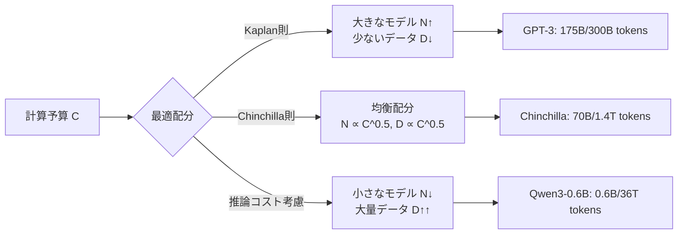
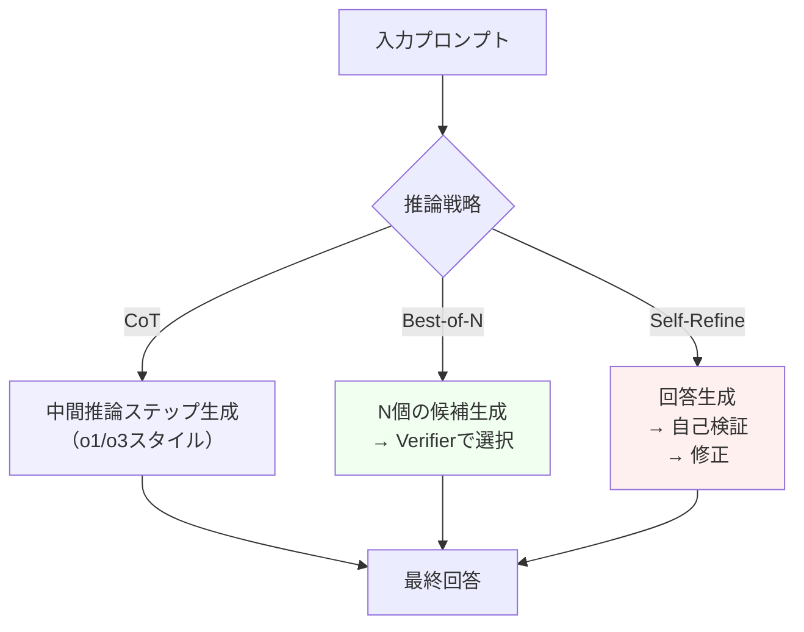
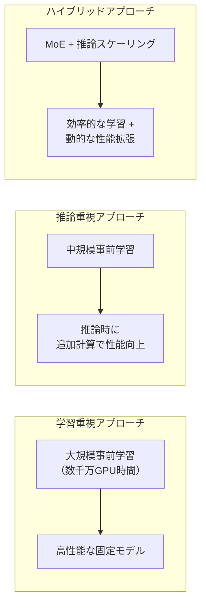

# LLM MoEアーキテクチャの発展とスケーリング戦略を体系的に理解する

## この記事でわかること

- Mixture of Experts（MoE）の基本原理と、なぜフロンティアLLMの主流アーキテクチャになったのか
- DeepSeek-V3・Llama 4・Kimi K2など最新MoEモデルの設計思想とアクティブパラメータの考え方
- Kaplan則からChinchilla則へのスケーリング則の変遷と、推論時間スケーリングという新パラダイム
- MoE学習における負荷分散・ルーティング手法の進化（Auxiliary-Loss-Free、ReLUルーティング等）
- 今後のLLM発展の方向性：推論時間計算量 vs 事前学習計算量のトレードオフ

## 対象読者

- **想定読者**: 中級〜上級のMLエンジニア・研究者
- **必要な前提知識**:
  - Transformerアーキテクチャの基本（Self-Attention、FFN層）
  - ニューラルネットワークの学習（損失関数、勾配降下法）の基礎
  - LLMの事前学習・ファインチューニングの概念理解

## 結論・成果

2025年のフロンティアLLMにおいて、MoEアーキテクチャは事実上の標準となりました。DeepSeek-V3（671Bパラメータ中37Bアクティブ）、Kimi K2（1Tパラメータ中32Bアクティブ）など、**総パラメータの3〜5%のみをアクティブにすることで、密なモデルに匹敵する性能を実現**しています。さらに、推論時間スケーリング（Test-Time Compute Scaling）の登場により、事前学習で固定された性能を推論時の計算量で動的に拡張できるようになりました。OpenAIの報告によると、推論時間を10倍に増やすことで、数学推論タスクの正答率が大幅に向上することが示されています。

この記事では、MoEの基礎から最新のスケーリング戦略まで、LLMの効率的なスケーリングを理解するための体系的なガイドを提供します。

## MoEアーキテクチャの基本原理を理解する

Mixture of Experts（MoE）は、**1つのFFN層を複数の「エキスパート」に分割し、入力トークンに応じて一部のエキスパートのみを活性化する**スパース活性化の手法です。従来の密な（Dense）モデルでは全パラメータが全トークンに対して計算されるのに対し、MoEでは各トークンが少数のエキスパートのみを使用するため、計算コストを大幅に削減できます。

### ゲーティングネットワークとルーティングの仕組み

MoEの中核となるのがゲーティングネットワーク（ルーター）です。入力トークン $x$ に対して、ルーターは各エキスパートへの割り当てスコアを計算します。

$$
G(x) = \text{TopK}(\text{Softmax}(W_g \cdot x), K)
$$

ここで $W_g$ はゲーティングの重み行列、$K$ はアクティブにするエキスパートの数です。最終的なMoE層の出力は、選択されたエキスパートの出力の重み付き和になります。

$$
y = \sum_{i \in \text{TopK}} G(x)_i \cdot E_i(x)
$$

```python
import torch
import torch.nn as nn
import torch.nn.functional as F

class MoELayer(nn.Module):
    """シンプルなMoE層の実装例"""

    def __init__(self, d_model: int, d_ff: int, num_experts: int, top_k: int = 2):
        super().__init__()
        self.num_experts = num_experts
        self.top_k = top_k

        # 各エキスパートはFFN（2層のMLP）
        self.experts = nn.ModuleList([
            nn.Sequential(
                nn.Linear(d_model, d_ff),
                nn.SiLU(),
                nn.Linear(d_ff, d_model),
            )
            for _ in range(num_experts)
        ])

        # ゲーティングネットワーク（ルーター）
        self.gate = nn.Linear(d_model, num_experts, bias=False)

    def forward(self, x: torch.Tensor) -> torch.Tensor:
        # ルーティングスコアの計算
        gate_logits = self.gate(x)  # (batch, seq, num_experts)
        gate_scores = F.softmax(gate_logits, dim=-1)

        # TopKエキスパートを選択
        top_k_scores, top_k_indices = gate_scores.topk(self.top_k, dim=-1)
        top_k_scores = top_k_scores / top_k_scores.sum(dim=-1, keepdim=True)  # 正規化

        # 選択されたエキスパートの出力を重み付き合成
        output = torch.zeros_like(x)
        for k in range(self.top_k):
            expert_idx = top_k_indices[..., k]  # (batch, seq)
            score = top_k_scores[..., k].unsqueeze(-1)  # (batch, seq, 1)
            for i in range(self.num_experts):
                mask = (expert_idx == i)
                if mask.any():
                    expert_input = x[mask]
                    expert_output = self.experts[i](expert_input)
                    output[mask] += score[mask] * expert_output

        return output
```

**なぜMoEが効率的なのか:**
- 密なモデルでは全パラメータが全トークンで計算される（FLOPs ∝ 総パラメータ数）
- MoEでは各トークンが $K$ 個のエキスパートのみ使用（FLOPs ∝ アクティブパラメータ数）
- 結果として、パラメータ数に対して計算量を大幅に削減可能

> **制約**: MoEモデルは全パラメータをメモリに保持する必要があるため、メモリ使用量は密なモデルと同等以上になります。推論時のレイテンシは改善しますが、モデルのロードやメモリフットプリントには注意が必要です。

### なぜ2025年にMoEが主流になったのか

MoE自体は1991年にJacobsらによって提案された古典的な手法ですが、2025年にフロンティアLLMの主流となった背景には以下の要因があります。

1. **学習の安定化**: 補助損失なし（Auxiliary-Loss-Free）の負荷分散手法の登場
2. **Fine-grained Expert設計**: DeepSeekMoEに代表される細粒度エキスパート分割
3. **ハードウェア対応**: Expert Parallelismの成熟とGPU間通信の最適化
4. **スケーリング限界の突破**: 密なモデルのスケーリングが計算コスト的に非現実的に

## 最新MoEモデルの設計思想を比較する

2025年に登場したフロンティアMoEモデルを比較してみましょう。各モデルがどのような設計選択を行っているかを理解することで、MoEアーキテクチャの進化の方向性が見えてきます。

| モデル | 総パラメータ | アクティブパラメータ | アクティブ比率 | エキスパート数 | アクティブ数 | 共有エキスパート |
|--------|------------|-------------------|-------------|-------------|-----------|-------------|
| DeepSeek-V3 | 671B | 37B | 5.5% | 256 | 8 | 1 |
| Llama 4 Maverick | 400B | 17B | 4.3% | 128 | 1 | 1 |
| Kimi K2 | 1,040B | 32B | 3.1% | 384 | 8 | - |
| Qwen3.5 | 397B | 非公開 | - | - | - | - |

### DeepSeek-V3：Fine-grained Expert + Auxiliary-Loss-Free

DeepSeek-V3は、MoEアーキテクチャの設計において2つの重要なイノベーションを導入しました。

**1. Fine-grained Expert Segmentation**

従来のMoEが16個程度のエキスパートを持つのに対し、DeepSeek-V3は**256個のルーテッドエキスパート**を採用しています。これはDeepSeekMoEで提案された「細粒度エキスパート分割」の発展形です。FFN層の中間隠れ次元を分割することで、各エキスパートを小さくしつつ数を増やし、より柔軟な組み合わせを可能にしています。

DeepSeekMoEの論文によると、エキスパートの粒度を細かくすることで、各エキスパートの専門化が進み、**同等の計算量でGShard比1.5倍のパラメータ効率**を達成したと報告されています。

**2. Auxiliary-Loss-Free Load Balancing**

従来のMoEでは、特定のエキスパートにトークンが集中する「ルーティング崩壊」を防ぐため、補助損失（Auxiliary Loss）を追加していました。しかし、補助損失が大きすぎるとモデル性能が低下するというジレンマがありました。

DeepSeek-V3は、**ルーティングスコアにバイアス項を追加**し、学習中にエキスパートの負荷を監視してバイアスを動的に調整する方式を採用しました。

```python
# Auxiliary-Loss-Free Load Balancingの概念的実装
class AuxLossFreeRouter(nn.Module):
    def __init__(self, d_model: int, num_experts: int, top_k: int = 8):
        super().__init__()
        self.gate = nn.Linear(d_model, num_experts, bias=False)
        # 負荷分散用のバイアス項（学習対象ではない）
        self.expert_bias = nn.Parameter(
            torch.zeros(num_experts), requires_grad=False
        )
        self.gamma = 0.001  # バイアス更新係数

    def forward(self, x: torch.Tensor) -> tuple[torch.Tensor, torch.Tensor]:
        # アフィニティスコア計算
        affinity = self.gate(x)  # (batch, seq, num_experts)

        # TopK選択時のみバイアスを加算
        biased_scores = affinity + self.expert_bias
        top_k_indices = biased_scores.topk(self.top_k, dim=-1).indices

        # ゲーティング値は元のアフィニティから計算（バイアスなし）
        gate_values = F.softmax(affinity, dim=-1)

        return top_k_indices, gate_values

    def update_bias(self, expert_load: torch.Tensor, target_load: float):
        """学習ステップごとに負荷に基づいてバイアスを更新"""
        overloaded = expert_load > target_load
        underloaded = expert_load < target_load
        self.expert_bias[overloaded] -= self.gamma
        self.expert_bias[underloaded] += self.gamma
```

重要なのは、**バイアスはエキスパート選択のみに影響し、ゲーティング値は元のアフィニティスコアから計算される**点です。これにより、エキスパートの専門性を損なうことなく負荷分散を実現しています。

### Llama 4 Maverick：Dense層とMoE層の交互配置

Llama 4 Maverickは、Metaが2025年に発表したMoEモデルです。特徴的なのは**Dense層とMoE層を交互に配置**する設計です。

- **128個のルーテッドエキスパート + 1個の共有エキスパート**
- 各トークンは共有エキスパートと**1個のルーテッドエキスパートのみ**を使用
- 結果としてアクティブパラメータは17Bに抑制

Maverickが1エキスパートのみをアクティブにする設計を採用したのは、推論効率を重視したためです。複数エキスパートのアクティブ化はall-to-all通信のオーバーヘッドを増大させますが、1エキスパートにすることでこのコストを最小化しています。

**注意点:**
> Top-1ルーティングはエキスパートの専門化を促進しますが、Top-2以上と比較してルーティング決定が不安定になりやすい傾向があります。Maverickでは共有エキスパートの存在がこの問題を緩和していると考えられます。

### Kimi K2：1兆パラメータの実現

Moonshot AIが2025年7月にリリースしたKimi K2は、**オープンウェイトで最大規模の1.04兆パラメータ**MoEモデルです。

- **384個のエキスパート、32Bアクティブパラメータ**
- Multi-head Latent Attention（MLA）を採用
- **MuonClipオプティマイザ**: MuonアルゴリズムにQK-Clip安定化機構を統合
- 15.5兆トークンで学習、**ロススパイクなし**

Kimi K2の技術報告によると、SWE-bench Verifiedで65.8%（pass@1）、MATH-500で97.4%を達成し、DeepSeek-V3やGPT-4.1を上回る性能を報告しています。

## スケーリング則の変遷を追う：Kaplan→Chinchilla→推論時間

LLMの効率的なスケーリングを理解するうえで、スケーリング則の変遷は極めて重要です。ここでは、3つの重要な転換点を見ていきます。

### Kaplan則（2020年）：パラメータ優先

OpenAIのKaplanらが2020年に発表したスケーリング則は、LLMの性能が**モデルサイズ・データ量・計算量**のべき乗則に従うことを示しました。

$$
L(N) \propto N^{-\alpha_N}, \quad L(D) \propto D^{-\alpha_D}, \quad L(C) \propto C^{-\alpha_C}
$$

ここで $L$ は損失、$N$ はパラメータ数、$D$ はデータ量、$C$ は計算量です。

Kaplan則ではパラメータ数のスケーリング指数が大きく（$\alpha_N \approx 0.73$ vs $\alpha_D \approx 0.27$）、**限られた計算予算では大きなモデルを少ないデータで学習する方が効率的**と結論づけました。この知見がGPT-3（175Bパラメータ、300Bトークン）のような大規模・少データモデルの設計を後押ししました。

### Chinchilla則（2022年）：データとパラメータの均衡

DeepMindのHoffmannらが2022年に発表した「Training Compute-Optimal Large Language Models」は、Kaplan則の結論を覆しました。

**主要な発見**: 計算量最適なモデルでは、パラメータ数とデータ量を**ほぼ等比例**でスケールすべきであり、最適なトークン/パラメータ比は約**20:1**です。

$$
N^* \propto C^{0.5}, \quad D^* \propto C^{0.5}
$$

この知見に基づき、Chinchilla（70Bパラメータ、1.4Tトークン）はGopher（280Bパラメータ）を**同一計算予算で上回る性能**を示しました。



### Over-Training：推論コストを考慮した新しい最適化

Chinchilla則は**学習コストのみ**を最小化する枠組みでした。しかし実運用では、1回の学習に対して何百万回もの推論が行われます。推論コストまで考慮すると、最適なバランスは変わります。

**推論頻度が高い場合、小さなモデルをより多くのデータで学習する方が、学習+推論の総コストが低くなる**ことが示されています。

この考え方を極端に推し進めた例がQwen3-0.6Bです。わずか6億パラメータのモデルに対して36兆トークンで学習し、**トークン/パラメータ比は60,000:1**という驚異的な値を達成しました。これは Chinchilla の約20:1を大きく超えています。

| 方針 | モデル例 | パラメータ数 | トークン数 | 比率 |
|------|--------|-----------|---------|------|
| Kaplan式 | GPT-3 | 175B | 300B | 1.7:1 |
| Chinchilla最適 | Chinchilla | 70B | 1.4T | 20:1 |
| Over-Training | Llama 3 | 8B | 15T | 1,875:1 |
| 極端なOver-Training | Qwen3-0.6B | 0.6B | 36T | 60,000:1 |

### MoEにおけるスケーリングの考え方

MoEモデルでは、スケーリング則の適用にはアクティブパラメータと総パラメータの区別が必要です。

- **計算コスト（FLOPs）**: アクティブパラメータ数に比例
- **モデルの知識容量**: 総パラメータ数に関連
- **メモリコスト**: 総パラメータ数に比例

つまり、MoEは**知識容量を増やしながら計算コストを抑える**というトレードオフを可能にします。DeepSeek-V3の671Bパラメータは、密な37Bモデルの約18倍の知識容量を持ちながら、推論コストは37Bモデルと同等です。

**よくある誤解:**
「MoEモデルの671Bは密な671Bと同等の性能」とは限りません。MoEの671Bは密なモデルの性能曲線上で37B〜70B相当の位置にあると考えるのが妥当ですが、密な37Bモデルよりは明確に優れた性能を示します。これは、未アクティブなエキスパートが持つ知識が間接的にルーティングやShared Expertを通じて寄与するためです。

## 推論時間スケーリング：学習後にも性能を伸ばす

2024年後半から2025年にかけて、LLMの性能向上における新しいパラダイムが確立されました。それが**推論時間スケーリング（Test-Time Compute Scaling）**です。

### 従来のスケーリングとの違い

従来のアプローチでは、LLMの性能向上は主に学習時の計算量（事前学習のFLOPs）に依存していました。

$$
\text{Performance} \propto f(\text{Training Compute})
$$

推論時間スケーリングは、推論時に使う計算量を増やすことで性能を向上させます。

$$
\text{Performance} \propto f(\text{Training Compute}) + g(\text{Inference Compute})
$$

OpenAIのo1/o3シリーズがこのアプローチの代表例です。

### 推論時間スケーリングの3つのカテゴリ

推論時間に計算量を割り当てる方法は、大きく3つに分類できます。

**1. Chain of Thought（CoT）による逐次推論**

モデルが最終回答を出す前に、中間的な推論ステップを生成します。OpenAI o1/o3では、強化学習によってモデルが「考えてから答える」ように学習されています。

**2. Beam SearchやBest-of-Nサンプリング**

同一の問題に対して複数の回答を生成し、最良のものを選択します。Verifierモデルが各回答の品質を評価する場合もあります。

**3. Self-Refinement（自己修正）**

モデルが自身の回答を検証・修正するプロセスを繰り返します。



### 推論時間スケーリングのスケーリング則

2024年のSnellらの研究（ICLR 2025 Oral採択）では、**推論時間の計算量スケーリングがモデルパラメータのスケーリングよりも効率的になり得る**ことが示されました。

具体的には、小さなモデル（例: 8Bパラメータ）に十分な推論時間計算量を与えると、より大きなモデル（例: 70Bパラメータ）の即答を上回るケースがあると報告されています。

ただし、30億トークン以上を用いた大規模実証研究では、**単一の推論時間スケーリング戦略が普遍的に優位ではなく、最適な戦略はタスクと計算予算に依存する**ことも明らかになっています。

**制約と注意点:**
> 推論時間スケーリングはレイテンシの増大を伴います。o3のような推論モデルでは、回答に数十秒〜数分かかることがあり、リアルタイム応答が求められるアプリケーションには不向きです。o3-miniのAdaptive Thinking（Low/Medium/High）のように、タスクの難易度に応じて推論深度を制御する仕組みが実用上は重要です。

## MoEの学習手法とルーティング技術の進化を追う

MoEの学習は、密なモデルの学習にはない固有の課題を持っています。ここでは、最新の学習手法とルーティング技術の進化を追います。

### 負荷分散の3世代

MoEにおける負荷分散手法は、大きく3つの世代に分けられます。

**第1世代：補助損失ベース（Auxiliary Loss）**

Switch Transformer（2021年）などが採用した方式で、各エキスパートへのトークン割り当てが均一になるよう補助損失を追加します。

$$
L_{\text{aux}} = N \sum_{i=1}^{N} f_i \cdot P_i
$$

ここで $f_i$ はエキスパート $i$ に割り当てられたトークンの割合、$P_i$ はルーティング確率の平均です。

**課題**: 補助損失の重みが大きすぎるとモデル性能が低下し、小さすぎると負荷分散が不十分になるというトレードオフがありました。

**第2世代：Auxiliary-Loss-Free（補助損失なし）**

DeepSeek-V3が導入した方式で、バイアス項の動的調整により補助損失なしで負荷分散を実現します（前述のコード例参照）。

**第3世代：ReLUルーティング（ReMoE）**

2025年に提案されたReMoEは、TopKルーティングをReLUゲートに置き換えるアプローチです。

$$
G(x)_i = \text{ReLU}(W_g \cdot x + b_i)
$$

TopKルーティングではK個のエキスパートが固定的に選ばれますが、ReLUルーティングでは**各エキスパートが独立に活性/非活性を判定**します。これにより、入力の複雑さに応じてアクティブなエキスパート数が動的に変化します。

| 世代 | 手法 | メリット | デメリット |
|------|------|---------|-----------|
| 第1世代 | Auxiliary Loss | 実装がシンプル | 重み調整が困難、性能低下リスク |
| 第2世代 | Loss-Free Bias | 性能低下なし | バイアス更新の安定性 |
| 第3世代 | ReLUルーティング | 動的エキスパート数 | 計算量の予測が困難 |

### Shared Expert（共有エキスパート）の役割

DeepSeekMoEで提案された共有エキスパートは、全トークンに対して常にアクティブになるエキスパートです。

**共有エキスパートの意義:**
- **共通知識のキャプチャ**: 言語の文法規則や一般常識など、どのトークンにも必要な知識を担当
- **ルーテッドエキスパートの専門化促進**: 共通知識を共有エキスパートに任せることで、ルーテッドエキスパートはより専門的な知識に集中可能
- **冗長性の削減**: 複数のルーテッドエキスパートが同じ共通知識を学習する無駄を防止

DeepSeek-V3では1個、Llama 4 Maverickでも1個の共有エキスパートが採用されています。

### 類似性保存ルーティング

2025年に提案された類似性保存ルーティング（Similarity-Preserving Routing）は、**意味的に類似したトークンが同じエキスパートにルーティングされるようにする**手法です。

従来のルーティングでは、類似した入力に対してルーティング決定が不安定になることがあり、エキスパートの専門化を阻害していました。類似性保存ルーティングは、ルーティングの一貫性を保ちながらエキスパート崩壊（全トークンが少数のエキスパートに集中する現象）を防ぐことを目指しています。

## 今後のLLM発展の方向性を展望する

ここまで見てきたMoEアーキテクチャとスケーリング戦略のトレンドから、LLMの今後の発展方向を整理します。

### 事前学習計算量 vs 推論時間計算量のトレードオフ

今後のLLM開発では、**事前学習にどれだけの計算量を投じるか**と**推論時にどれだけの計算量を使うか**のバランスが重要な設計判断になります。



**学習重視**: 大規模な事前学習で固定的に高い性能を実現（従来のアプローチ）
**推論重視**: 中規模モデルを推論時間スケーリングで強化（o1/o3アプローチ）
**ハイブリッド**: MoEによる効率的な学習 + 推論時間スケーリング（今後の主流と見込まれる方向）

### アクティブパラメータの最適解

現在のフロンティアモデルのアクティブパラメータ比率（3〜5%）がどこに収束するかは、今後の重要な研究テーマです。

- **エキスパート数の増加**: 256→384→将来的には1,000+の可能性
- **アクティブエキスパート数**: 1（Llama 4）〜8（DeepSeek-V3）の範囲で、タスクに応じた動的選択の研究が進行中
- **適応的活性化**: ReMoEのように入力に応じてアクティブパラメータ数自体を変動させるアプローチ

### MoE + 推論時間スケーリングの統合

MoEと推論時間スケーリングの組み合わせは、効率性と性能の両立を目指す有力な方向です。

- MoEで推論時の1トークンあたりの計算コストを削減
- 削減されたコストの一部を推論時間スケーリングに再配分
- 結果として、同一の総推論コストでより高い性能を実現

**ハマりやすいポイント:**
> MoEモデルに推論時間スケーリングを適用する場合、MoEのルーティング決定自体が推論ステップごとに異なる可能性があります。長いChain of Thoughtの途中でエキスパートの切り替えが頻発すると、一貫性のある推論が困難になるケースがあり、この問題への対処は今後の課題です。

## まとめと次のステップ

**まとめ:**
- MoEは総パラメータの3〜5%のみをアクティブにすることで、密なモデルに匹敵する性能を効率的に実現するアーキテクチャ
- スケーリング則はKaplan則（パラメータ重視）→ Chinchilla則（均衡配分）→ 推論コスト考慮（データ重視）と進化してきた
- 推論時間スケーリングにより、事前学習後も推論計算量の増加で性能を動的に向上可能
- MoEの学習手法は補助損失 → Loss-Free Bias → ReLUルーティングへと進化し、安定性と効率が向上
- 今後はMoEによる効率的な学習と推論時間スケーリングのハイブリッドが主流になると見込まれる

**次にやるべきこと:**
- DeepSeek-V3の技術レポート（arXiv: 2412.19437）を読み、Auxiliary-Loss-Free Balancingの詳細を理解する
- Snellらの推論時間スケーリング論文（arXiv: 2408.03314、ICLR 2025 Oral）で最適計算配分の理論を学ぶ
- vLLMやSGLangでMoEモデルの推論を実際にデプロイし、アクティブパラメータと推論速度の関係を体感する

## 参考

- [DeepSeek-V3 Technical Report](https://arxiv.org/abs/2412.19437)
- [DeepSeekMoE: Towards Ultimate Expert Specialization in Mixture-of-Experts Language Models](https://arxiv.org/abs/2401.06066)
- [Scaling LLM Test-Time Compute Optimally can be More Effective than Scaling Model Parameters](https://arxiv.org/abs/2408.03314)
- [The Art of Scaling Test-Time Compute for Large Language Models](https://arxiv.org/abs/2512.02008)
- [Training Compute-Optimal Large Language Models (Chinchilla)](https://arxiv.org/abs/2203.15556)
- [Llama 4: The beginning of a new era of natively multimodal AI innovation](https://ai.meta.com/blog/llama-4-multimodal-intelligence/)
- [Kimi K2: Open Agentic Intelligence Technical Report](https://arxiv.org/abs/2507.20534)
- [Auxiliary-Loss-Free Load Balancing Strategy for Mixture-of-Experts (ICLR 2025)](https://openreview.net/forum?id=y1iU5czYpE)
- [Applying Mixture of Experts in LLM Architectures (NVIDIA)](https://developer.nvidia.com/blog/applying-mixture-of-experts-in-llm-architectures/)
- [Categories of Inference-Time Scaling for Improved LLM Reasoning](https://magazine.sebastianraschka.com/p/categories-of-inference-time-scaling)

**関連記事:**
- [Qwen3.5徹底解説：397B MoEモデルをvLLMでデプロイする実践ガイド](https://zenn.dev/0h_n0/articles/657d35a2bbf71d)
- [2026年版 フロンティアLLM学習パイプライン完全解説](https://zenn.dev/0h_n0/articles/a8792c6407d6e3)
- [拡散言語モデル2026年動向：Mercury・LLaDA・MoE統合の実装と展望](https://zenn.dev/0h_n0/articles/82a9ebe3d96a89)

---

:::message
この記事はAI（Claude Code）により自動生成されました。内容の正確性については複数の情報源で検証していますが、実際の利用時は公式ドキュメントもご確認ください。
:::
