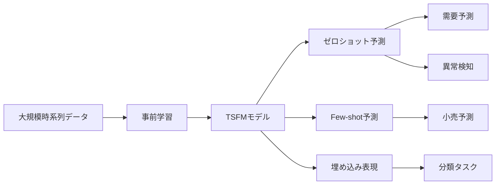
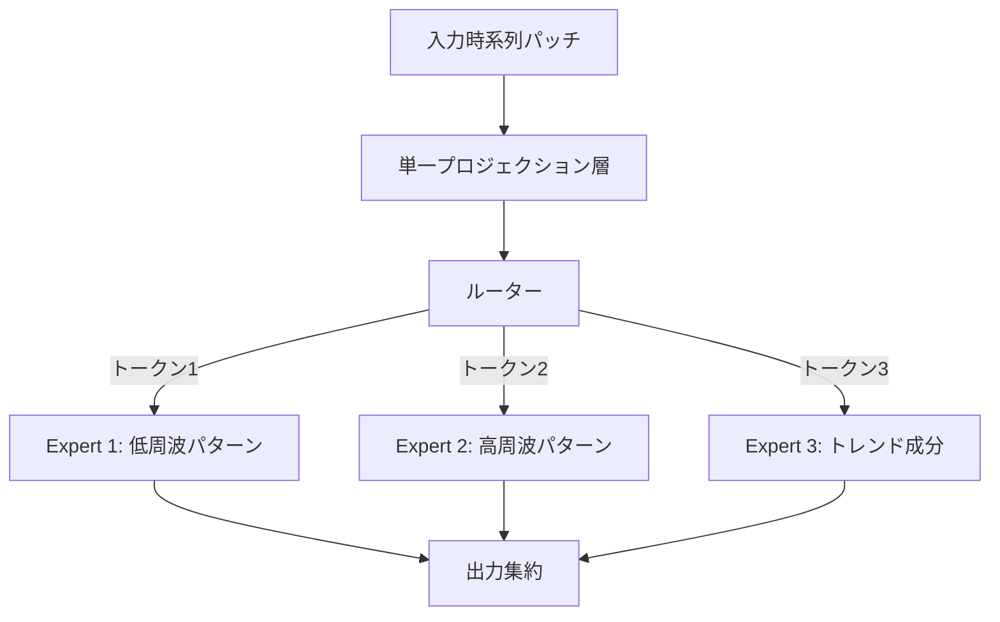
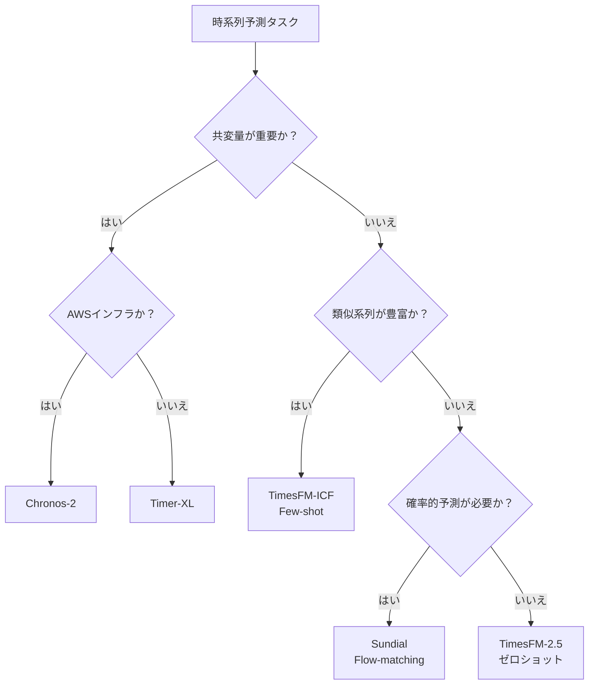

# 時系列ファウンデーションモデル2025-2026年最前線：Chronos-2・TimesFM・Sundialを徹底比較

## この記事でわかること

- 時系列ファウンデーションモデル（TSFM）の基本概念と、NLPのLLMとの類似点・相違点
- 2025-2026年にリリースされた主要5モデル（Chronos-2、TimesFM-2.5、Moirai-MoE、Sundial、Timer-XL）のアーキテクチャと特徴
- GIFT-Evalベンチマークによる各モデルの定量比較とモデル選定基準
- ゼロショット予測・Few-shot学習・共変量対応など、TSFMの実践的な活用パターン
- TSFMの現在の限界と、導入時に注意すべきポイント

## 対象読者

- **想定読者**: 中級者以上の機械学習エンジニア・データサイエンティスト
- **必要な前提知識**:
  - Transformerアーキテクチャの基本的な理解
  - 時系列予測の基礎（ARIMA、Prophet、LSTMなどの経験）
  - Python 3.10以上での機械学習ライブラリの使用経験

## 結論・成果

2025-2026年にかけて、時系列ファウンデーションモデル（TSFM）は急速に成熟しました。Google TimesFM-2.5はパラメータ数を400Mから200Mに半減しつつコンテキスト長を16Kに拡大し、GIFT-Evalベンチマークでゼロショット予測のトップに立っています。Amazon Chronos-2はgroup attentionとtime attentionの二重構造で共変量対応を実現し、fev-benchで既存モデルを大きく上回りました。一方、清華大学THUMLのSundialは1兆時点のデータでプレトレーニングを行い、ICML 2025でOral採択（Top 1%）という評価を獲得しています。

ただし、NeurIPS 2025のワークショップ論文では「慎重に設計された軽量教師ありベースラインがTSFMと同等の性能を示すケースがある」と報告されており、**TSFMは万能ではなく、適用領域の見極めが重要**です。

## 時系列ファウンデーションモデルとは何かを理解する

### NLPのLLMと時系列FMの関係

自然言語処理（NLP）分野では、GPTやBERTのような大規模言語モデル（LLM）が「大量のテキストで事前学習し、さまざまなタスクにゼロショットで対応する」というパラダイムを確立しました。時系列ファウンデーションモデル（TSFM）は、この考え方を時系列データに適用したものです。

TSFMの基本的なアイデアは、数十億〜数兆の時系列データポイントで事前学習を行い、未知の時系列に対してもゼロショットで予測できるモデルを構築することにあります。従来のARIMAやProphetでは、各時系列ごとにモデルを構築・チューニングする必要がありました。TSFMでは、事前学習済みモデルに新しい時系列を入力するだけで予測が得られます。

### TSFMが実現する3つの能力

TSFMの登場により、以下の3つが実用的になりました。

1. **ゼロショット予測**: 追加学習なしで未知の時系列を予測
2. **Few-shot学習**: 少数の類似系列をプロンプトとして与えるだけで精度向上
3. **汎用的な埋め込み表現**: 時系列データのベクトル表現を下流タスク（分類、異常検知）に活用



### NLPとの本質的な違い

ただし、NLPと時系列データには本質的な違いがあります。テキストデータは離散的なトークンで構成され、文法という共通構造があります。一方、時系列データは連続値であり、**データが生成される背景の物理法則が分野ごとに大きく異なります**。電力消費量と株価では、同じ「時系列」でもデータ生成過程がまったく別物です。

この違いが「時系列の大統一モデル」の構築を困難にしている要因であり、NLPのような「BERTモーメント」が時系列分野ではまだ到来していないと指摘する研究者もいます。

## 主要5モデルのアーキテクチャを比較する

2024年後半から2025年にかけて、主要な研究機関からTSFMが相次いでリリースされました。ここでは、特に注目すべき5つのモデルを取り上げます。

### Chronos-2（Amazon、2025年10月）

Chronos-2は、Amazonが開発した120Mパラメータのencoder-onlyモデルです。前身のChronosはT5ベースのencoder-decoderモデルでしたが、Chronos-2ではアーキテクチャを大きく刷新しました。

**アーキテクチャの特徴:**

Chronos-2の最大の革新は、**group attention**と**time attention**を交互に配置するデュアルアテンション構造です。

- **Time attention**: 単一時系列内のパッチ間で情報を集約する（時間方向の依存関係）
- **Group attention**: 同一パッチインデックスにおける全系列間で情報を集約する（系列間の依存関係）

```python
# Chronos-2の推論例（概念コード）
# pip install chronos-forecasting torch
from chronos import ChronosPipeline
import torch

# モデルのロード
pipeline = ChronosPipeline.from_pretrained(
    "amazon/chronos-2",
    device_map="auto",
    torch_dtype=torch.float32,
)

# 複数系列（multivariate）+ 共変量での予測
# target: 予測対象の時系列
# past_covariates: 過去のみ観測される共変量
# future_covariates: 未来の値がわかる共変量（祝日フラグなど）
forecast = pipeline.predict(
    context=target_series,          # shape: (batch, seq_len)
    past_covariates=past_cov,       # shape: (batch, seq_len, n_past)
    future_covariates=future_cov,   # shape: (batch, pred_len, n_future)
    prediction_length=24,
    num_samples=100,                # 確率的予測のサンプル数
)
# forecast shape: (batch, num_samples, pred_len)
```

**なぜencoder-onlyか:**

Encoder-onlyアーキテクチャを選択した理由は、共変量の扱いやすさにあります。Decoder-onlyモデルでは、未来の共変量（天気予報やプロモーション予定）を自然に入力するのが難しいのに対し、encoder-onlyモデルでは全入力を一度に処理できるため、**カレンダーイベントやプロモーション情報を「未来の既知情報」として直接組み込める**のが利点です。

**注意点:**

> Chronos-2の学習データには合成マルチバリエートデータが多く含まれています。これは高品質な多変量時系列データの不足を補うための工夫ですが、実際のドメイン固有のマルチバリエート依存関係を完全に捉えられない可能性があります。ファインチューニングなしで本番投入する場合は、自ドメインのデータで予測精度を必ず検証してください。

### TimesFM-2.5 / TimesFM-ICF（Google、2025年9月）

Google Researchが開発したTimesFMは、decoder-onlyアーキテクチャのパッチベースモデルです。バージョン2.5では、2.0から大幅な効率改善が行われました。

| 項目 | TimesFM 2.0 | TimesFM 2.5 |
|------|-------------|-------------|
| パラメータ数 | 400M | 200M |
| コンテキスト長 | 2K | 16K |
| 予測方式 | 点予測 | 確率的予測（ネイティブ） |
| GIFT-Eval順位 | - | ゼロショット1位（2025年9月時点） |

さらに、ICML 2025で発表された**TimesFM-ICF（In-Context Fine-tuning）**は、TSFMにfew-shot学習能力を付与する手法です。

**ICFの仕組み:**

TimesFM-ICFでは、予測対象の時系列に加えて、関連する複数の時系列を「コンテキスト」としてプロンプトに含めます。これは、LLMにおけるfew-shot promptingと同じ発想です。

$$
\hat{y}_{T+1:T+H} = f_\theta(y_{1:T}, \{x_1, x_2, \ldots, x_K\})
$$

ここで $y_{1:T}$ は予測対象の履歴、$\{x_1, \ldots, x_K\}$ はコンテキストとして与える関連時系列、$H$ は予測ホライズンです。

GoogleのOOD（Out-of-Distribution）ベンチマークでは、ICFにより**ベースTimesFMに対して+6.8%の精度向上**が報告されており、教師ありファインチューニングと同等の性能をデータセットごとの学習ループなしで達成しています。

```python
# TimesFM-2.5のゼロショット予測例
# pip install timesfm
import timesfm

# TimesFM-2.5モデルの初期化
tfm = timesfm.TimesFm(
    hparams=timesfm.TimesFmHparams(
        backend="gpu",
        per_core_batch_size=32,
        horizon_len=128,
        input_patch_len=32,
        output_patch_len=128,
        num_layers=20,
        model_dims=1280,
    ),
    checkpoint=timesfm.TimesFmCheckpoint(
        huggingface_repo_id="google/timesfm-2.5-200m"
    ),
)

# ゼロショット予測の実行
# frequency: 0=高頻度, 1=日次, 2=週次, 3=月次, 4=四半期, 5=年次
point_forecast, quantile_forecast = tfm.forecast(
    inputs=[historical_data],    # List[np.ndarray]
    freq=[1],                    # 日次データ
)
# point_forecast: shape (1, horizon_len)
# quantile_forecast: shape (1, horizon_len, num_quantiles)
```

### Moirai-MoE（Salesforce、2024年10月）

Salesforce AI Researchが開発したMoirai-MoEは、**初のMixture-of-Experts（MoE）構造を持つTSFM**です。

**従来のMoiraiの課題:**

初代Moiraiは、異なる周波数の時系列を扱うために、周波数ごとに異なる入出力プロジェクション層をヒューリスティックに定義していました。この設計は「どの周波数にどのプロジェクション層を割り当てるか」を人手で決める必要があり、スケーラビリティに問題がありました。

**Moirai-MoEのアプローチ:**

Moirai-MoEでは、**単一の入出力プロジェクション層**を使いつつ、多様な時系列パターンの捕捉をSparse MoE Transformerに委ねます。各トークンは、データ駆動で最適なエキスパートに自動ルーティングされます。



**性能面の成果:**

Moirai-MoE-SmallはMoirai-Smallに対して**17%の性能改善**を達成し、さらにパラメータ数が大きいMoirai-BaseやMoirai-Largeをも8%・7%上回りました。特筆すべきは、ChronosやTimesFMと比較して**活性パラメータ数が最大65分の1**でありながら、同等以上の性能を達成している点です。

**注意点:**

> Moirai-MoEの論文は2024年10月公開で、後続のChronos-2（2025年10月）やTimesFM-2.5（2025年9月）との直接比較は論文中には含まれていません。GIFT-Evalリーダーボードの最新結果で比較する必要があります。

### Sundial（THUML / 清華大学、2025年2月）

Sundialは、ICML 2025でOral採択（Top 1%）された生成型TSFMファミリーです。

**技術的な革新点:**

TSFMの多くは時系列値を離散トークンに変換して処理しますが、Sundialは**連続値のまま直接生成する**アプローチを採用しています。これを可能にしたのが、著者らが提案する**TimeFlow Loss**です。

TimeFlow Lossはflow-matchingに基づく手法で、次のパッチの確率分布を直接学習します。離散化による情報損失を回避し、任意の分布形状を表現できる柔軟性があります。

$$
\mathcal{L}_{\text{TimeFlow}} = \mathbb{E}_{t, x_0, x_1}\left[\|v_\theta(x_t, t) - (x_1 - x_0)\|^2\right]
$$

ここで $x_0$ はノイズ、$x_1$ は実際の時系列値、$v_\theta$ はフローの速度場を推定するニューラルネットワークです。

**学習データの規模:**

著者らは**TimeBench**と名付けた1兆（$10^{12}$）時点の大規模データセットをキュレーションしました。実世界データと合成データの組み合わせで、多様なドメインをカバーしています。

**推論速度:**

Sundialはゼロショット予測をミリ秒単位で完了できると報告されています。点予測と確率的予測の両方をサポートし、実用的な推論速度を実現しています。

### Timer-XL（THUML / 清華大学、ICLR 2025）

Timer-XLは、ICLR 2025で採択されたdecoder-onlyのTSFMです。

**主な特徴:**

Timer-XLは、**任意の長さ**と**任意の変数数**を持つ時系列を統一的に処理できるアーキテクチャを持ちます。大規模プレトレーニングにより、ゼロショット予測でstate-of-the-artの性能を達成しています。

| 項目 | Timer-XL |
|------|----------|
| アーキテクチャ | Decoder-only Transformer |
| 対応タスク | 単変量/多変量/共変量/ゼロショット |
| 採択会議 | ICLR 2025 |
| 公開コード | github.com/thuml/Timer-XL |

## 主要モデルをGIFT-Evalベンチマークで比較する

### GIFT-Evalの概要

**GIFT-Eval（General Time Series Forecasting Model Evaluation）**は、Salesforce AI Researchが主導するTSFM評価用のベンチマークです。

- **規模**: 23データセット、144,000以上の時系列、1.77億データポイント
- **カバー範囲**: 7ドメイン、10種類の周波数、短期〜長期予測
- **評価指標**: MASE（Mean Absolute Scaled Error）、CRPS（Continuous Ranked Probability Score）
- **リーケージ対策**: 約2300億データポイントのプレトレーニングデータセットを別途提供し、評価データとの分離を確保

### 2025-2026年時点の主要モデル比較

以下の表は、リサーチ時点（2026年3月）で公開されている情報に基づく各モデルの特徴比較です。ベンチマーク順位は継続的に更新されるため、最新の結果はGIFT-Eval公式リーダーボードを確認してください。

| モデル | 開発元 | パラメータ数 | アーキテクチャ | コンテキスト長 | 共変量対応 | 確率的予測 | 採択会議 |
|--------|--------|------------|--------------|--------------|----------|----------|---------|
| **Chronos-2** | Amazon | 120M | Encoder-only | 8,192 | あり（past/future/categorical） | 21分位点 | - |
| **TimesFM-2.5** | Google | 200M | Decoder-only | 16,384 | なし（2.5時点） | あり | ICML 2024（初版） |
| **Moirai-MoE** | Salesforce | Small相当 | Encoder-decoder + MoE | 可変 | あり（周波数自動対応） | あり | - |
| **Sundial** | THUML | 128M | Decoder-only | 可変 | なし | あり（flow-matching） | ICML 2025 Oral |
| **Timer-XL** | THUML | 84M〜 | Decoder-only | 任意長 | あり | あり | ICLR 2025 |

### ベンチマーク上の注意点

GIFT-Evalの運用にはいくつかの課題が指摘されています。

1. **データリーケージ**: ベンチマーク作成者がTimesFM、UniTS、TTMのプレトレーニングデータと重複する3つの評価データセットを意図せず含めていたことが判明しました。この問題は修正されましたが、過去のリーダーボード結果の解釈には注意が必要です。

2. **評価の多次元性**: GIFT-Evalは97タスク構成で55データセットをカバーしていますが、特定のドメイン（Web/CloudOps、Transport）ではファウンデーションモデルの性能が振るわないことも報告されています。高エントロピー・低トレンド・散発的なデータは、ゼロショットTSFMの苦手分野です。

3. **fev-benchとの併用**: Amazonが作成したfev-benchという別の評価データセットも存在し、特に共変量対応モデルの評価にはこちらが有用です。

## TSFMの実践的な活用パターンを把握する

### パターン1: ゼロショット予測（最もシンプル）

事前学習済みモデルに時系列データを入力するだけで予測を得る方法です。モデル学習のコストがゼロで、数百〜数千の時系列を一括で予測したい場合に適しています。

**適用例**: 小売店舗の需要予測、IoTセンサーの異常検知スクリーニング

**期待される精度**: GIFT-Evalのベンチマーク結果によると、多くのドメインで統計モデル（ETS、ARIMA）や従来の深層学習モデル（N-BEATS、PatchTST）を上回る性能が報告されています。

**よくある間違い:**

最初は「ゼロショットなので全ケースで使える」と考えがちですが、実際にはドメインによって大きく性能が変わります。特に、高エントロピーなWebトラフィックデータや散発的な需要データでは、ドメイン特化のモデルが有利です。

### パターン2: Few-shot予測（TimesFM-ICF）

関連する時系列をプロンプトとして追加し、精度を向上させる方法です。

```python
# TimesFM-ICFのfew-shot予測（概念コード）
# 予測対象の時系列に加え、関連する系列をコンテキストとして提供
context_series = [
    similar_store_sales_1,  # 類似店舗の売上
    similar_store_sales_2,  # 別の類似店舗
    regional_average,       # 地域平均
]

# ICFモデルは、コンテキスト系列のパターンを参考に予測を調整
forecast = timesfm_icf.predict(
    target=target_store_sales,
    context=context_series,
    prediction_length=30,
)
```

**制約条件**: ICFは現時点ではTimesFMベースのみで利用可能です。また、コンテキストに含める系列の選択が予測精度に大きく影響するため、類似度の高い系列を適切に選定する仕組みが必要です。

### パターン3: 共変量付き予測（Chronos-2）

外部情報（天気予報、祝日、プロモーション）を組み込んだ予測を行う方法です。

小売需要予測では、セール期間やイベント情報を「既知の未来共変量」として入力することで、ゼロショットでも実用的な精度を得られます。Chronos-2はこのユースケースに特化しており、fev-benchの共変量タスクで既存モデルを大きく上回りました。

### パターン4: ファインチューニング

特定のドメインでゼロショット性能が不十分な場合、少量のドメインデータでファインチューニングを行います。Timer-XLのOpenLTMフレームワークや、Moiraiのuni2tsリポジトリでは、ファインチューニング用のパイプラインが整備されています。

**トレードオフ**: ファインチューニングにより精度は向上しますが、TSFMの最大の利点である「学習不要」が失われます。ファインチューニングのコストと精度向上のバランスを慎重に判断する必要があります。

## TSFMの限界と導入時の注意点を把握する

### 軽量ベースラインとの比較問題

2025年のNeurIPS時系列ワークショップで採択された論文「A More Realistic Evaluation of Cross-Frequency Transfer Learning and Foundation Forecasting Models」では、以下の点が指摘されています。

- 慎重にチューニングされた統計モデルや軽量な教師ありモデルが、TSFMと同等以上の性能を示すケースがある
- 特に、データ量が十分にある単一ドメインのタスクでは、ドメイン特化モデルの優位性が高い
- TSFMの真価は、**多数のドメインにまたがる時系列を統一的に処理する**場面で発揮される

### 計算コストとインフラ要件

| モデル | 推論デバイス | スループット目安 |
|--------|------------|----------------|
| Chronos-2 (120M) | GPU推奨 | 300+予測/秒（単一GPU） |
| TimesFM-2.5 (200M) | GPU推奨 | - |
| Sundial (128M) | GPU推奨 | ミリ秒単位 |
| 統計モデル（ETS等） | CPU十分 | 数千予測/秒 |

TSFMはGPUが推奨されますが、Chronos-2はAmazon SageMakerやAutoGluonとの統合が進んでおり、AWSインフラを活用する場合はスムーズに導入できます。一方、オンプレミス環境やCPUのみの環境では、統計モデルの方がコストパフォーマンスに優れるケースがあります。

### データリーケージへの警戒

GIFT-Evalで判明したデータリーケージの問題は、TSFMのベンチマーク結果を解釈する上で重要な教訓です。自社データでの評価を行う際も、学習データと評価データの分離を厳密に管理する必要があります。

### モデル選定フローチャート

実際にTSFMの導入を検討する際は、以下のフローチャートを参考にしてください。



**ハマりポイント**: モデル選定時に「最新モデル=最高性能」と考えるのは危険です。自ドメインのデータ特性（周波数、トレンド/季節性の有無、系列間相関）に応じて最適なモデルは異なります。必ず自データでの比較評価を行ってください。

## 今後の研究動向を展望する

### マルチモーダル化

2025年のサーベイ論文（arXiv:2504.04011）では、TSFMの分類軸として「プレトレーニングのモダリティ」が提案されています。時系列データだけでなく、テキスト（ニュース）や画像（衛星画像）と組み合わせたマルチモーダルTSFMの研究が進んでいます。

### スケーリング則の解明

NLPでは「モデルサイズとデータ量を増やせば性能が向上する」というスケーリング則が広く知られていますが、時系列分野でのスケーリング則はまだ確立されていません。Sundialの1兆時点データでのプレトレーニングは、この方向の重要な一歩です。

### Few-shot / In-Context Learningの進化

TimesFM-ICFの成功は、TSFMにおけるIn-Context Learningの可能性を示しました。今後、他のモデルにもICL能力が組み込まれていく可能性があります。NLPのLLMが辿った道筋を時系列分野でも再現できるかが、注目ポイントです。

## まとめと次のステップ

**まとめ:**

- 2025-2026年にかけて、Chronos-2・TimesFM-2.5・Moirai-MoE・Sundial・Timer-XLの5大TSFMがリリースされ、ゼロショット時系列予測の実用性が大幅に向上した
- 共変量対応（Chronos-2）、Few-shot学習（TimesFM-ICF）、Sparse MoE（Moirai-MoE）、生成型アプローチ（Sundial）など、モデルごとに異なる強みがある
- GIFT-Evalベンチマークが標準的な評価基準として定着したが、データリーケージやドメイン依存性など課題も残る
- TSFMは万能ではなく、軽量ベースラインが同等性能を示すケースもある。適用領域の見極めが重要
- 導入時は必ず自ドメインのデータで比較評価を行い、コストと精度のバランスを判断する

**次にやるべきこと:**

- [GIFT-Eval公式リーダーボード](https://github.com/SalesforceAIResearch/gift-eval)で最新のモデル比較結果を確認する
- 自社の時系列データで2-3モデルのゼロショット性能を比較検証する
- 共変量が重要なタスクではChronos-2、汎用的なゼロショットにはTimesFM-2.5から試す

## 参考

- [Foundation Models for Time Series: A Survey (arXiv:2504.04011)](https://arxiv.org/abs/2504.04011)
- [Introducing Chronos-2: From Univariate to Universal Forecasting - Amazon Science](https://www.amazon.science/blog/introducing-chronos-2-from-univariate-to-universal-forecasting)
- [Google AI Ships TimesFM-2.5 - MarkTechPost](https://www.marktechpost.com/2025/09/16/google-ai-ships-timesfm-2-5-smaller-longer-context-foundation-model-that-now-leads-gift-eval-zero-shot-forecasting/)
- [Time Series Foundation Models Can Be Few-Shot Learners - Google Research](https://research.google/blog/time-series-foundation-models-can-be-few-shot-learners/)
- [Moirai-MoE: Empowering Time Series Foundation Models with Sparse Mixture of Experts - Salesforce](https://www.salesforce.com/blog/time-series-morai-moe/)
- [Sundial: A Family of Highly Capable Time Series Foundation Models (arXiv:2502.00816)](https://arxiv.org/abs/2502.00816)
- [Timer-XL: Long-Context Transformers for Unified Time Series Forecasting (ICLR 2025)](https://github.com/thuml/Timer-XL)
- [GIFT-Eval: A Benchmark for General Time Series Forecasting Model Evaluation (arXiv:2410.10393)](https://arxiv.org/abs/2410.10393)
- [時系列基盤モデルの現在(2025/12) - Qiita](https://qiita.com/pigooosuke/items/1ee44c088e3db6c3c801)

---

:::message
この記事はAI（Claude Code）により自動生成されました。内容の正確性については複数の情報源で検証していますが、実際の利用時は公式ドキュメントもご確認ください。
:::

## 関連する深掘り記事

この記事で紹介した技術について、さらに深掘りした記事を書きました：

- [Chronos-2解説: 単変量から汎用予測へ — Amazonの時系列ファウンデーションモデル](https://0h-n0.github.io/posts/techblog-chronos-2-universal-forecasting/) - tech_blog解説
- [論文解説: Sundial — Flow-Matchingによる連続値時系列ファウンデーションモデル](https://0h-n0.github.io/posts/paper-2502-00816/) - arxiv解説
- [TimesFM-ICF解説: 時系列ファウンデーションモデルをFew-Shot学習器に変える](https://0h-n0.github.io/posts/techblog-timesfm-icf-few-shot/) - tech_blog解説
- [論文解説: GIFT-Eval — 時系列ファウンデーションモデルの包括的ベンチマーク](https://0h-n0.github.io/posts/paper-2410-10393/) - arxiv解説
- [論文解説: Moirai 2.0 — Decoder-Onlyアーキテクチャへの転換で実現した軽量・高速時系列FM](https://0h-n0.github.io/posts/paper-2511-11698/) - arxiv解説

:::message
これらの記事は修士学生レベルを想定した技術的詳細（数式・実装の深掘り）を含みます。
:::
