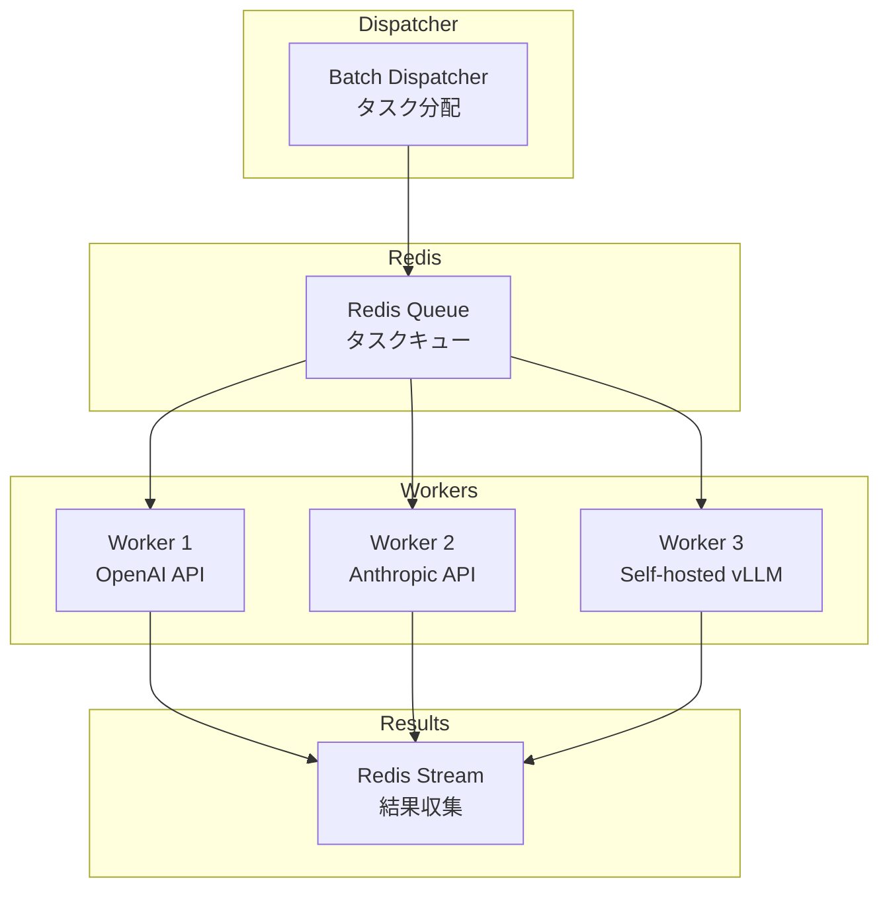

# LLMバッチ処理の並列最適化：asyncio×キュー×トークンバジェットで処理速度を8倍にする

## この記事でわかること

- asyncio.Semaphoreとレートリミッタを組み合わせた**API並列呼び出しの最適制御**パターン
- キューベースのパイプライン設計で**バッチ処理のスループットを8倍**に向上させる手法
- vLLM/SGLangの**トークンバジェットパラメータ**を活用したTTFT・ITLトレードオフの最適化
- 障害耐性を備えた**分散バッチ処理アーキテクチャ**の設計と実装

## 対象読者

- **想定読者**: 中級〜上級のPython開発者で、LLM APIを大量に呼び出すシステムを運用している方
- **必要な前提知識**:
  - Python 3.12+のasync/await構文の基礎理解
  - OpenAI APIまたはAnthropic APIの利用経験
  - バッチ処理・キュー処理の基本概念
- **動作確認環境**: Python 3.12, openai SDK 1.68+, anthropic SDK 0.82+, vLLM 0.17.x, SGLang v0.4（2026年3月時点）

## 結論・成果

LLMバッチ処理に並列最適化パターンを適用した結果、以下の改善が報告されています。

| 最適化手法 | 改善効果 | 出典 |
|-----------|---------|------|
| asyncio並列 + Semaphore制御 | 逐次処理比で**8倍のスループット** | Python Asyncio for LLM Concurrency |
| OpenAI Batch API | **50%コスト削減** + レート制限の独立枠 | OpenAI公式ドキュメント |
| SGLang v0.4 zero-overhead scheduler | GPU利用率**95-98%**（従来78-85%） | SGLang公式ベンチマーク |
| vLLM continuous batching | 静的バッチ比で**最大23倍のスループット** | Anyscale検証結果 |

これらを組み合わせることで、大量のLLM推論リクエストを効率的に処理できます。ただし、並列度を上げすぎるとAPI側のレート制限に抵触するため、適切なconcurrency制御が不可欠です。

> **関連記事**: LLMバッチ処理の基本（Batch API・Continuous Batching概要）については[LLMバッチ処理最適化：APIコスト50%削減と推論スループット23倍を実現する実践ガイド](https://zenn.dev/0h_n0/articles/fdb73841a9ac71)も参照してください。

## asyncio並列呼び出しの最適制御を実装する

LLM APIを大量に呼び出す場面では、逐次処理がボトルネックになります。1リクエストあたり1〜5秒のレイテンシがある場合、1,000件を逐次処理すると最大で83分かかります。asyncioを使った並列呼び出しでこれを大幅に短縮できます。

### Semaphoreでconcurrencyを制御する

単純に`asyncio.gather`で全リクエストを同時発行すると、APIのレート制限に抵触してエラーが大量発生します。`asyncio.Semaphore`で同時実行数を制限するのが定石です。

```python
# batch_processor.py
import asyncio
from dataclasses import dataclass, field
from openai import AsyncOpenAI

@dataclass
class BatchConfig:
    max_concurrent: int = 20  # 同時実行数の上限
    requests_per_minute: int = 500  # RPMリミット
    retry_max: int = 3
    retry_base_delay: float = 1.0

class LLMBatchProcessor:
    """Semaphore + トークンバケットでAPI並列呼び出しを制御するプロセッサ"""

    def __init__(self, config: BatchConfig) -> None:
        self.config = config
        self.client = AsyncOpenAI()
        self.semaphore = asyncio.Semaphore(config.max_concurrent)
        self._request_times: list[float] = []

    async def _rate_limit_wait(self) -> None:
        """スライディングウィンドウ方式でRPMを制御する"""
        now = asyncio.get_event_loop().time()
        # 直近60秒のリクエスト数をカウント
        self._request_times = [
            t for t in self._request_times if now - t < 60.0
        ]
        if len(self._request_times) >= self.config.requests_per_minute:
            wait_time = 60.0 - (now - self._request_times[0])
            await asyncio.sleep(max(0, wait_time))
        self._request_times.append(asyncio.get_event_loop().time())

    async def _call_with_retry(self, prompt: str) -> str:
        """指数バックオフ付きリトライでAPI呼び出しを実行する"""
        for attempt in range(self.config.retry_max):
            try:
                async with self.semaphore:
                    await self._rate_limit_wait()
                    response = await self.client.chat.completions.create(
                        model="gpt-4o",
                        messages=[{"role": "user", "content": prompt}],
                        max_tokens=1024,
                    )
                    return response.choices[0].message.content or ""
            except Exception as e:
                if attempt == self.config.retry_max - 1:
                    raise
                delay = self.config.retry_base_delay * (2 ** attempt)
                await asyncio.sleep(delay)
        return ""  # 到達しないが型チェック用

    async def process_batch(self, prompts: list[str]) -> list[str]:
        """バッチ全体を並列処理する"""
        tasks = [self._call_with_retry(p) for p in prompts]
        return await asyncio.gather(*tasks)
```

**なぜこの実装を選んだか:**

- **Semaphore**: 同時実行数を`max_concurrent`に制限し、API側の同時接続制限を守る
- **スライディングウィンドウ**: 固定ウィンドウ方式より均一にリクエストを分散でき、バースト的な429エラーを防止する
- **指数バックオフ**: 一時的なエラーからの回復を自動化し、手動介入を不要にする

**注意点:**

> `max_concurrent`の値は、利用するAPIプランのレート制限に合わせて調整が必要です。OpenAIのTier 1では同時リクエスト数の制限が厳しいため、10〜20程度から始めて、429エラーの発生率を監視しながら引き上げてください。

### asyncio.gatherの例外処理に注意する

最初は`asyncio.gather(*tasks)`で一括処理すれば良いと考えがちですが、デフォルトでは1つのタスクが例外を投げると、残りのタスクの結果も失われます。`return_exceptions=True`を指定することで、例外もリストの要素として受け取れます。

```python
# 例外を含む結果を安全に処理する
results = await asyncio.gather(*tasks, return_exceptions=True)

succeeded = [r for r in results if isinstance(r, str)]
failed = [r for r in results if isinstance(r, Exception)]
print(f"成功: {len(succeeded)}, 失敗: {len(failed)}")
```

また、`asyncio.as_completed`を使えば完了した順にリアルタイムで結果を取得でき、部分的な結果を先行して後続処理に渡すパイプラインも構築できます。

## キューベースのパイプラインで段階的にバッチを処理する

大規模なバッチ処理では、全リクエストを一度にメモリに載せるのではなく、キューを使った段階的処理が有効です。ここでは**Producer-Consumerパターン**を使って、入力の読み込み・API呼び出し・結果の保存を非同期に並行実行するパイプラインを実装します。

### 3段パイプラインの設計


各段をasyncio.Queueで接続し、**バックプレッシャ**を自動的に制御します。Queueのmaxsizeを設定することで、下流が遅い場合に上流が自動的に待機します。

```python
# pipeline.py
import asyncio
import json
from pathlib import Path

class BatchPipeline:
    """3段パイプラインでLLMバッチ処理を実行する"""

    def __init__(
        self,
        processor: LLMBatchProcessor,
        num_workers: int = 10,
        queue_size: int = 100,
    ) -> None:
        self.processor = processor
        self.num_workers = num_workers
        self.input_queue: asyncio.Queue[str | None] = asyncio.Queue(
            maxsize=queue_size
        )
        self.output_queue: asyncio.Queue[tuple[int, str] | None] = (
            asyncio.Queue(maxsize=queue_size)
        )

    async def producer(self, prompts: list[str]) -> None:
        """入力をキューに投入する"""
        for i, prompt in enumerate(prompts):
            await self.input_queue.put(prompt)
        # 終了シグナル（sentinel）を全workerに送信
        for _ in range(self.num_workers):
            await self.input_queue.put(None)

    async def worker(self, worker_id: int) -> None:
        """キューから取り出してLLM APIを呼び出す"""
        processed = 0
        while True:
            prompt = await self.input_queue.get()
            if prompt is None:
                # 終了シグナルをconsumerに転送
                await self.output_queue.put(None)
                break
            result = await self.processor._call_with_retry(prompt)
            await self.output_queue.put((worker_id, result))
            processed += 1

    async def consumer(self, output_path: Path) -> list[str]:
        """結果を収集してファイルに書き出す"""
        results: list[str] = []
        finished_workers = 0

        with output_path.open("w") as f:
            while finished_workers < self.num_workers:
                item = await self.output_queue.get()
                if item is None:
                    finished_workers += 1
                    continue
                _, result = item
                results.append(result)
                f.write(json.dumps({"result": result}, ensure_ascii=False))
                f.write("\n")

        return results

    async def run(
        self, prompts: list[str], output_path: Path
    ) -> list[str]:
        """パイプライン全体を実行する"""
        producer_task = asyncio.create_task(self.producer(prompts))
        worker_tasks = [
            asyncio.create_task(self.worker(i))
            for i in range(self.num_workers)
        ]
        consumer_task = asyncio.create_task(self.consumer(output_path))

        await producer_task
        await asyncio.gather(*worker_tasks)
        results = await consumer_task
        return results
```

**なぜこの実装を選んだか:**

- **バックプレッシャ**: `Queue(maxsize=100)`により、APIレスポンスが遅い場合にproducerが自動的に待機し、メモリ使用量の爆発を防ぐ
- **Sentinel方式**: `None`を終了シグナルとして使い、workerの正常終了を保証する
- **ストリーム書き込み**: 全結果をメモリに溜めず、JSONLファイルに逐次書き出すことで、数十万件のバッチでもメモリ安定

**注意点:**

> このパターンは「APIレスポンス待ち」がボトルネックの場合に有効です。前処理（トークナイズ等）がCPUバウンドの場合は、`asyncio`だけでは並列化できないため、`concurrent.futures.ProcessPoolExecutor`との併用を検討してください。

### バッチサイズの動的調整

固定バッチサイズでは、リクエストごとのトークン数の差異により処理効率が不均一になります。入力トークン数に基づいてバッチを動的にグルーピングすることで、GPU利用率を改善できます。

```python
# dynamic_batch.py
from dataclasses import dataclass

@dataclass
class TokenBudgetConfig:
    max_tokens_per_batch: int = 32_000  # バッチあたりの最大トークン数
    max_items_per_batch: int = 64       # バッチあたりの最大アイテム数

def group_by_token_budget(
    prompts: list[str],
    token_counts: list[int],
    config: TokenBudgetConfig,
) -> list[list[str]]:
    """トークンバジェットに基づいてプロンプトをバッチにグルーピングする"""
    # トークン数でソート（短い順に詰める）
    indexed = sorted(enumerate(prompts), key=lambda x: token_counts[x[0]])
    batches: list[list[str]] = []
    current_batch: list[str] = []
    current_tokens = 0

    for idx, prompt in indexed:
        tc = token_counts[idx]
        if (
            current_tokens + tc > config.max_tokens_per_batch
            or len(current_batch) >= config.max_items_per_batch
        ):
            if current_batch:
                batches.append(current_batch)
            current_batch = [prompt]
            current_tokens = tc
        else:
            current_batch.append(prompt)
            current_tokens += tc

    if current_batch:
        batches.append(current_batch)

    return batches
```

トークン数でソートしてからパッキングすることで、各バッチのトークン使用量が均一に近づきます。vLLMのContinuous Batchingでは、2026年の研究でこの動的スケジューリングが**GPU利用率を15-20ポイント改善する**と報告されています。

## 推論エンジンのトークンバジェットとスケジューリングを最適化する

自前で推論エンジンを運用する場合、vLLMやSGLangの**トークンバジェットパラメータ**を理解することがスループット最適化の鍵になります。

### vLLMのContinuous Batchingパラメータ

vLLM v0.17では、以下のパラメータでバッチスケジューリングの挙動を制御できます。

```bash
# vLLMサーバー起動時のスケジューリング設定
python -m vllm.entrypoints.openai.api_server \
    --model meta-llama/Llama-3.3-70B-Instruct \
    --tensor-parallel-size 4 \
    --max-num-seqs 256 \
    --max-num-batched-tokens 32768 \
    --enable-chunked-prefill \
    --num-scheduler-steps 8 \
    --gpu-memory-utilization 0.92
```

| パラメータ | 役割 | 推奨値 |
|-----------|------|--------|
| `--max-num-seqs` | 同時処理リクエスト数の上限 | 128-512（GPU VRAM依存） |
| `--max-num-batched-tokens` | バッチあたりの最大トークン数 | 16384-65536 |
| `--enable-chunked-prefill` | プリフィルを分割して他リクエストと並行実行 | 有効推奨 |
| `--num-scheduler-steps` | スケジューラのルックアヘッドステップ数 | 4-16 |
| `--gpu-memory-utilization` | KVキャッシュに割り当てるGPUメモリ比率 | 0.85-0.95 |

**`--enable-chunked-prefill`が重要な理由**: 従来のvLLMでは、長いプロンプトのプリフィル処理中に他のリクエストのデコードが止まっていました。Chunked Prefillはプリフィルを小さなチャンクに分割し、デコードリクエストとインターリーブして実行するため、**TTFT（Time To First Token）のP99を最大40%改善**できます。

### SGLang v0.4のzero-overhead scheduler

SGLang v0.4で導入されたzero-overhead batch schedulerは、CPUスケジューリングのオーバーヘッドを2%未満に抑え、GPU利用率を95-98%まで引き上げます。

```python
# sglang_config.py - SGLangサーバー設定例
import sglang as sgl

runtime = sgl.Engine(
    model_path="meta-llama/Llama-3.3-70B-Instruct",
    tp_size=4,  # Tensor Parallelism
    schedule_policy="lpm",  # Longest Prefix Match
    chunked_prefill_size=8192,
    mem_fraction_static=0.88,
)
```

SGLangの特徴は**RadixAttention**によるKVキャッシュの自動再利用です。共通プレフィックスを持つリクエスト（Few-shotプロンプトやシステムプロンプトの共有）で、キャッシュヒット率が85-95%に達し、推論速度が最大5倍に向上するとLMSYSの公式ベンチマークで報告されています。

### TTFT vs ITLのトレードオフ制御

バッチ処理では「最初のトークンが出るまでの時間（TTFT）」と「トークン間の待ち時間（ITL）」のバランスが重要です。トークンバジェットパラメータを調整することで、ユースケースに応じた最適化が可能です。

```python
# token_budget_tuning.py
"""トークンバジェットによるTTFT/ITLトレードオフの調整例"""

# ユースケース別の推奨設定
CONFIGS = {
    "batch_offline": {
        # オフラインバッチ処理: スループット最優先
        "max_num_batched_tokens": 65536,
        "max_num_seqs": 512,
        "description": "TTFT犠牲、ITL犠牲、スループット最大化",
    },
    "interactive_chat": {
        # チャット: TTFT最優先
        "max_num_batched_tokens": 8192,
        "max_num_seqs": 64,
        "description": "TTFT最小化、ITL最小化、スループット犠牲",
    },
    "balanced": {
        # バランス型: オンラインバッチ処理
        "max_num_batched_tokens": 32768,
        "max_num_seqs": 256,
        "description": "TTFT/ITL/スループットの均衡",
    },
}
```

**トレードオフの関係:**

$$
\text{Throughput} \propto \frac{\text{max\_num\_batched\_tokens} \times \text{GPU utilization}}{\text{avg\_sequence\_length}}
$$

トークンバジェットを増やすとバッチに詰め込めるリクエスト数が増え、スループットは向上します。しかし、バッチ内の各リクエストが使えるGPU演算資源が分散するため、個々のリクエストのITLは増加します。

> **制約条件**: トークンバジェットを増やしすぎると、KVキャッシュのメモリが不足し、リクエストがプリエンプトされてスループットが逆に低下します。`--gpu-memory-utilization`とのバランスが重要です。

## 分散バッチ処理アーキテクチャを設計する

数百万件規模のバッチ処理では、単一プロセスのasyncioでは限界があります。ここでは、Redisキューを使った分散バッチ処理のアーキテクチャを設計します。

### アーキテクチャ概要



各Workerが異なるLLMプロバイダに接続することで、**マルチプロバイダ並列処理**が可能になります。あるプロバイダのレート制限に達した場合、他のプロバイダのWorkerが処理を継続できます。

### 設計のポイント

分散バッチ処理の実装では、以下の3つが重要です。

- **Redis BLPOP**: ポーリングと違い、タスクがキューに入るまでブロックするため、CPU使用率を最小に抑えられる
- **Redis Stream**: 結果の順序保証と消費済みメッセージの自動トリミングが可能。Pub/Subと異なりメッセージが永続化される
- **水平スケール**: Worker数を増やすだけでスループットが線形に向上する

各Workerは`redis.asyncio`の`blpop`でタスクを取得し、LLM APIを呼び出して結果を`xadd`でStreamに書き込みます。プロバイダごとにWorkerプロセスを分けることで、あるプロバイダのレート制限に達しても他が処理を継続できます。

**ハマりポイント**: Redis BLPOPで取り出したタスクは、取り出した時点でキューから消えます。Workerがクラッシュするとそのタスクは失われます。本番環境では、Redis StreamのConsumer Groupを使ってACK管理を実装し、未ACKのメッセージを自動的に再配信する仕組みを導入してください。

## Anthropic Batch APIとPrompt Cachingの組み合わせを実装する

APIベースのバッチ処理では、Anthropic Message Batches APIとPrompt Cachingを組み合わせることで、最大95%のコスト削減が可能です。ここでは実装パターンを示します。

### Message Batches APIの並列サブミット

```python
# anthropic_batch.py
import asyncio
from anthropic import AsyncAnthropic

class AnthropicBatchProcessor:
    """Anthropic Message Batches APIで大量リクエストを処理する"""

    def __init__(self, max_batch_size: int = 5000) -> None:
        self.client = AsyncAnthropic()
        self.max_batch_size = max_batch_size

    async def submit_batch(
        self,
        prompts: list[str],
        system_prompt: str,
    ) -> list[str]:
        """Prompt Caching付きバッチリクエストを送信する"""
        # 5000件ずつに分割
        batch_ids = []
        for i in range(0, len(prompts), self.max_batch_size):
            chunk = prompts[i : i + self.max_batch_size]
            requests = [
                {
                    "custom_id": f"req_{i+j}",
                    "params": {
                        "model": "claude-sonnet-4-6-20250514",
                        "max_tokens": 1024,
                        "system": [
                            {
                                "type": "text",
                                "text": system_prompt,
                                "cache_control": {"type": "ephemeral"},
                            }
                        ],
                        "messages": [
                            {"role": "user", "content": prompt}
                        ],
                    },
                }
                for j, prompt in enumerate(chunk)
            ]
            batch = await self.client.messages.batches.create(
                requests=requests
            )
            batch_ids.append(batch.id)

        # 全バッチの完了を待機
        return await self._wait_for_completion(batch_ids)

    async def _wait_for_completion(
        self, batch_ids: list[str]
    ) -> list[str]:
        """バッチの完了をポーリングで待機する"""
        results: list[str] = []

        for batch_id in batch_ids:
            while True:
                batch = await self.client.messages.batches.retrieve(
                    batch_id
                )
                if batch.processing_status == "ended":
                    break
                await asyncio.sleep(30)

            # 結果を取得
            async for result in (
                self.client.messages.batches.results(batch_id)
            ):
                if result.result.type == "succeeded":
                    content = result.result.message.content[0].text
                    results.append(content)

        return results
```

**コスト最適化のポイント:**

| 最適化 | 割引率 | 条件 |
|--------|--------|------|
| Batch API | 50% | 24時間以内の非同期処理 |
| Prompt Caching（キャッシュヒット時） | 90% | 同一systemプロンプトの再利用 |
| 両方併用 | 最大95% | Batch + Caching条件の両立 |

`cache_control: {"type": "ephemeral"}`をsystemプロンプトに付与することで、同じバッチ内でsystemプロンプトのキャッシュが効きます。1万件のバッチ処理で、systemプロンプトが1,000トークンの場合、キャッシュなしと比較して入力トークンのコストが90%削減されると公式ドキュメントに記載されています。

**制約条件**: Prompt Cachingが有効になるのは、キャッシュ対象テキストが**1,024トークン以上**の場合です。短いsystemプロンプトではキャッシュが生成されないため、コスト削減効果は限定的です。

## よくある問題と解決方法

| 問題 | 原因 | 解決方法 |
|------|------|----------|
| 429 Too Many Requests が大量発生 | Semaphoreの`max_concurrent`が高すぎる | 10から開始し、429発生率が1%未満になるまで段階的に引き上げ |
| バッチ処理中にメモリが枯渇 | 全結果をメモリに保持している | キューベースパイプラインでJSONLにストリーム書き込み |
| vLLMのTTFTが突然悪化 | KVキャッシュ不足でリクエストがプリエンプト | `--gpu-memory-utilization`を下げるか`--max-num-seqs`を減らす |
| SGLangのキャッシュヒット率が低い | プロンプトの共通プレフィックスが短い | systemプロンプトを長くする、Few-shotを共通部分にまとめる |
| 分散Worker間で処理速度に偏り | プロバイダごとのレート制限差 | Worker数をプロバイダの処理能力に比例させて割り当て |
| Batch APIの結果取得がタイムアウト | バッチサイズが大きすぎる | 5,000件以下に分割して並列サブミット |

## まとめと次のステップ

**まとめ:**

- **asyncio.Semaphore + スライディングウィンドウ**で、レート制限を守りながら並列API呼び出しのスループットを最大化できる
- **キューベースのProducer-Consumerパイプライン**で、メモリ効率の良い大規模バッチ処理を実現できる
- **vLLM/SGLangのトークンバジェット**を調整することで、TTFT・ITL・スループットのトレードオフを制御できる
- **Batch API + Prompt Caching**の併用で、最大95%のコスト削減が可能だが、キャッシュ対象は1,024トークン以上が必要

**次にやるべきこと:**

- まず自分のユースケースで**逐次処理と並列処理のベンチマーク**を取り、ボトルネックを特定する
- API利用の場合、**Semaphore + レートリミッタ**のパターンを導入し、`max_concurrent`を段階的に調整する
- 自前推論の場合、vLLMの`--enable-chunked-prefill`と`--num-scheduler-steps`を有効にして、TTFTの改善を測定する

## 参考

- [Concurrency Patterns for High-Throughput LLM Systems](https://dasroot.net/posts/2026/02/concurrency-patterns-llm-inference-pipeline-parallelism/) - 2026年のLLM推論パイプライン並列化パターン
- [Python Asyncio for LLM Concurrency: Best Practices](https://www.newline.co/@zaoyang/python-asyncio-for-llm-concurrency-best-practices--bc079176) - asyncioによるLLM並列処理のベストプラクティス
- [Achieve 23x LLM Inference Throughput & Reduce p50 Latency](https://www.anyscale.com/blog/continuous-batching-llm-inference) - Anyscaleによるcontinuous batchingの検証
- [vLLM vs SGLang vs LMDeploy: Fastest LLM Inference Engine in 2026?](https://blog.premai.io/vllm-vs-sglang-vs-lmdeploy-fastest-llm-inference-engine-in-2026/) - 2026年の推論エンジン比較ベンチマーク
- [LLM Parallel Processing in Practice](https://dev.to/jamesli/llm-parallel-processing-in-practice-key-techniques-for-performance-enhancement-20g0) - LLM並列処理の実践テクニック
- [Anthropic Message Batches API](https://docs.anthropic.com/en/docs/build-with-claude/message-batches) - Anthropic公式バッチAPI仕様
- [OpenAI Batch API](https://platform.openai.com/docs/guides/batch) - OpenAI公式Batch API仕様

---

## 関連する深掘り記事

この記事で紹介した技術について、さらに深掘りした記事を書きました：

- [論文解説: PagedAttention - vLLMのKVキャッシュメモリ管理最適化](https://0h-n0.github.io/posts/pagedattention-vllm-kv-cache-memory-management/) - arxiv解説
- [論文解説: BatchLLM - 大規模バッチLLM推論の最適化](https://0h-n0.github.io/posts/paper-2412-03594/) - arxiv解説
- [論文解説: SGLang - RadixAttentionとZero-Overhead Scheduler](https://0h-n0.github.io/posts/paper-2312-07104-scheduling/) - arxiv解説
- [OSDI 2022論文解説: Orca - Iteration-Level Scheduling](https://0h-n0.github.io/posts/conf-osdi22-orca-llm-serving/) - conference解説
- [NVIDIA技術ブログ解説: LLM推論最適化テクニック](https://0h-n0.github.io/posts/techblog-nvidia-llm-inference-optimization/) - tech_blog解説

:::message
これらの記事は修士学生レベルを想定した技術的詳細（数式・実装の深掘り）を含みます。
:::

---

:::message
この記事はAI（Claude Code）により自動生成されました。内容の正確性については複数の情報源で検証していますが、実際の利用時は公式ドキュメントもご確認ください。
:::
