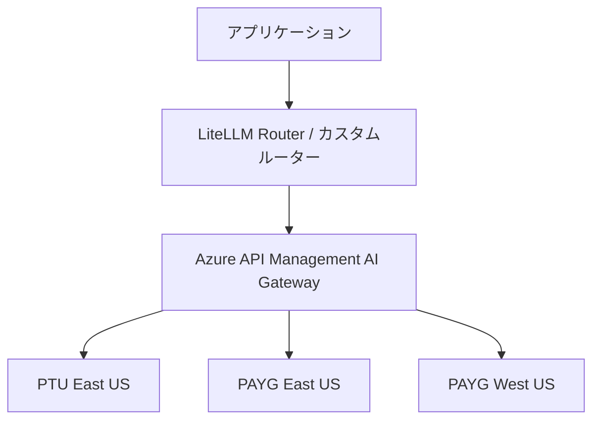

# Azure OpenAI負荷分散のアプリケーション実装：Python SDK×LiteLLM×OpenTelemetryで429エラーを体系的に制御する

## この記事でわかること

- openai Python SDKの**リトライ機構のデフォルト動作と最適なカスタマイズ方法**
- LiteLLM Routerを使った**複数Azure OpenAIデプロイメントの負荷分散とフォールバック実装**
- OpenTelemetryによる**トークン使用量・429エラー率・レイテンシの可観測性**の構築
- カスタムルーターをPythonで自作し、**Retry-Afterヘッダーを活用した適応的ルーティング**を実装する方法
- インフラ層（API Management）とアプリケーション層を**組み合わせた多層防御**の設計指針

## 対象読者

- **想定読者**: 中級〜上級のPythonバックエンドエンジニア
- **必要な前提知識**:
  - Azure OpenAI ServiceのAPIキー取得とデプロイメント作成の経験
  - openai Python SDK（`openai >= 1.0`）の基本的な使い方
  - Python asyncioの基礎
  - Docker / docker-compose の基本操作（LiteLLM Proxy利用時）

## 結論・成果

Azure OpenAIの429エラー対策は、**インフラ層だけでなくアプリケーション層でも実装する多層防御**が有効です。openai Python SDKのリトライ設定の最適化、LiteLLM Routerによる複数デプロイメント間の自動ルーティング、OpenTelemetryによるトークン使用量の可視化を組み合わせることで、Microsoftの公式ベストプラクティスで報告されている**429エラー発生率の大幅な削減**が期待できます。特にLiteLLM Routerの導入により、コードの変更を最小限に抑えながら、複数エンドポイントへの自動フェイルオーバーを実現できます。

関連記事: [Azure OpenAI負荷分散設計：API ManagementとPTUスピルオーバーで可用性99.9%を実現する](https://zenn.dev/0h_n0/articles/838465e8c756eb)（インフラ層の設計はこちらを参照）

## openai Python SDKのリトライ戦略を最適化する

Azure OpenAIの429エラー対策を考える際、最初に理解すべきは**SDK自体のリトライ機構**です。多くの開発者がデフォルト設定のまま使っていますが、本番環境ではチューニングが必要になるケースが多くあります。

### デフォルトのリトライ動作

openai Python SDK（v1.x系）は、以下のエラーに対して**自動的にリトライ**を行います。

| エラー種別 | HTTPステータス | デフォルトリトライ回数 | バックオフ |
|------------|---------------|----------------------|-----------|
| Rate Limit | 429 | 2回 | 指数バックオフ |
| Server Error | 500, 502, 503 | 2回 | 指数バックオフ |
| Timeout | - | 2回 | 指数バックオフ |
| Request Timeout | 408 | 2回 | 指数バックオフ |
| Conflict | 409 | 2回 | 指数バックオフ |

デフォルトのタイムアウトは**10分**、リトライ回数は**2回**です。この設定は開発環境では十分ですが、本番環境では以下の問題が発生します。

**よくある間違い:** デフォルトの10分タイムアウトを変更せずに運用し、ユーザーが長時間待たされるケースが頻発します。特にストリーミング応答を使っていない場合、GPT-4oの長文生成で応答に30秒以上かかることがあり、リトライが重なるとエンドユーザーの体感レイテンシが1分を超えることがあります。

### 本番環境向けのクライアント設定

以下は、本番環境で推奨されるAzureOpenAIクライアントの設定例です。

```python
# azure_client.py
import httpx
from openai import AzureOpenAI

# 本番環境向けのAzureOpenAIクライアント設定
client = AzureOpenAI(
    azure_endpoint="https://my-aoai-eastus.openai.azure.com",
    api_key="your-api-key",
    api_version="2024-12-01-preview",
    max_retries=3,  # デフォルト2→3に増加
    timeout=httpx.Timeout(
        connect=5.0,    # 接続確立: 5秒
        read=30.0,      # 応答読み取り: 30秒
        write=10.0,     # リクエスト送信: 10秒
        pool=10.0,      # コネクションプール待機: 10秒
    ),
)
```

**なぜこの設定にしたか:**
- `max_retries=3`: 429エラーは一時的なものが多く、3回目で成功する確率が高い。ただし、これ以上増やすとバックオフ時間が累積しレイテンシが悪化する
- `read=30.0`: GPT-4oの一般的な応答時間（5-20秒）をカバーしつつ、異常な遅延を検知する
- `connect=5.0`: Azureの同一リージョンなら1秒以内に接続できるため、5秒で十分

### リクエスト単位でのリトライ制御

特定のリクエストだけリトライ設定を変更したい場合は、`with_options`を使います。

```python
# バッチ処理用: リトライを増やし、タイムアウトを長めに設定
batch_client = client.with_options(
    max_retries=5,
    timeout=httpx.Timeout(read=120.0, connect=5.0, write=10.0, pool=10.0),
)

# リアルタイム応答用: リトライを減らし、速やかにフォールバック
realtime_client = client.with_options(
    max_retries=0,  # リトライしない（上位のルーターに任せる）
    timeout=httpx.Timeout(read=10.0, connect=3.0, write=5.0, pool=5.0),
)
```

**注意点:**
> `max_retries=0`に設定すると、429エラー時にSDKは即座に`RateLimitError`を送出します。この設定は、LiteLLM RouterやAPI Managementなどの**上位のルーティング層がリトライを担当する**構成で使用してください。SDKとルーターの両方でリトライすると、リトライ回数が掛け算になり、バックエンドへの不要な負荷が増加します。

## LiteLLM Routerで複数デプロイメントの負荷分散を実装する

単一エンドポイントのリトライだけでは、そのエンドポイント自体のクォータが枯渇した場合に対応できません。**複数のAzure OpenAIデプロイメントに自動的にルーティングする**のがLiteLLM Routerです。

LiteLLMはPythonのLLMゲートウェイライブラリで、100以上のLLMプロバイダーを統一的なOpenAI互換インターフェースで扱えます。ここではAzure OpenAIの負荷分散に焦点を当てて解説します。

### 基本的なRouter設定

```python
# litellm_router_setup.py
import os
from litellm import Router

# 複数のAzure OpenAIデプロイメントを定義
model_list = [
    {
        "model_name": "gpt-4o",  # アプリケーションから呼ぶモデル名
        "litellm_params": {
            "model": "azure/gpt-4o-eastus",  # Azure上のデプロイメント名
            "api_key": os.getenv("AZURE_EASTUS_API_KEY"),
            "api_base": "https://aoai-eastus.openai.azure.com",
            "api_version": "2024-12-01-preview",
            "rpm": 60,   # このデプロイメントのRPM上限
            "tpm": 80000, # このデプロイメントのTPM上限
        },
    },
    {
        "model_name": "gpt-4o",
        "litellm_params": {
            "model": "azure/gpt-4o-westus",
            "api_key": os.getenv("AZURE_WESTUS_API_KEY"),
            "api_base": "https://aoai-westus.openai.azure.com",
            "api_version": "2024-12-01-preview",
            "rpm": 60,
            "tpm": 80000,
        },
    },
    {
        "model_name": "gpt-4o",
        "litellm_params": {
            "model": "azure/gpt-4o-japaneast",
            "api_key": os.getenv("AZURE_JAPANEAST_API_KEY"),
            "api_base": "https://aoai-japaneast.openai.azure.com",
            "api_version": "2024-12-01-preview",
            "rpm": 30,
            "tpm": 40000,
        },
    },
]

router = Router(
    model_list=model_list,
    routing_strategy="simple-shuffle",  # RPM/TPMベースの重み付きランダム
    num_retries=3,
    allowed_fails=3,      # 1分間に許容する失敗回数
    cooldown_time=30,     # クールダウン秒数
    retry_after=5,        # リトライ最小待機秒数
    enable_pre_call_checks=True,  # RPM/TPMの事前チェックを有効化
)
```

### ルーティング戦略の使い分け

LiteLLM Routerは複数のルーティング戦略をサポートしています。用途に応じて使い分けましょう。

| 戦略 | 説明 | 適用場面 | Redis必要 |
|------|------|----------|-----------|
| **simple-shuffle** | RPM/TPMの重みに基づくランダム選択 | 一般的なWeb API | 不要 |
| **latency-based-routing** | 過去のレイテンシが低いデプロイメントを優先 | レイテンシ重視のリアルタイム処理 | 必要 |
| **usage-based-routing** | TPM使用量が少ないデプロイメントを優先 | コスト最適化、均等配分 | 必要 |
| **least-busy** | 同時処理中のリクエストが少ないデプロイメントを優先 | 高スループット処理 | 必要 |
| **cost-based-routing** | コストが低いデプロイメントを優先 | マルチプロバイダー構成 | 不要 |

**トレードオフ:** `latency-based-routing`と`usage-based-routing`はRedisが必要です。分散環境では複数のプロキシインスタンス間でルーティング状態を共有するためにRedisが不可欠ですが、単一インスタンス構成ではインメモリで動作する`simple-shuffle`で十分なケースが多いです。

### Priority-basedフォールバック（PTU→PAYG構成）

PTUデプロイメントを優先し、クォータ超過時にPAYGへフォールバックする構成は、`order`パラメータで実現できます。

```python
# litellm_priority_config.py
import os
from litellm import Router

model_list = [
    {
        "model_name": "gpt-4o",
        "litellm_params": {
            "model": "azure/gpt-4o-ptu",
            "api_key": os.getenv("AZURE_PTU_API_KEY"),
            "api_base": "https://aoai-eastus-ptu.openai.azure.com",
            "api_version": "2024-12-01-preview",
            "order": 1,  # 最優先（数値が小さいほど高優先）
        },
    },
    {
        "model_name": "gpt-4o",
        "litellm_params": {
            "model": "azure/gpt-4o-payg-eastus",
            "api_key": os.getenv("AZURE_PAYG_EASTUS_API_KEY"),
            "api_base": "https://aoai-eastus-payg.openai.azure.com",
            "api_version": "2024-12-01-preview",
            "order": 2,  # PTUがダウンした場合のフォールバック
        },
    },
    {
        "model_name": "gpt-4o",
        "litellm_params": {
            "model": "azure/gpt-4o-payg-westus",
            "api_key": os.getenv("AZURE_PAYG_WESTUS_API_KEY"),
            "api_base": "https://aoai-westus-payg.openai.azure.com",
            "api_version": "2024-12-01-preview",
            "order": 3,  # 最後のフォールバック先
        },
    },
]

router = Router(
    model_list=model_list,
    enable_pre_call_checks=True,  # orderパラメータの使用に必須
    num_retries=2,
    allowed_fails=3,
    cooldown_time=30,
)
```

**なぜPriority-basedを選んだか:**
- PTUは月額固定課金のため、使い切らないとコストが無駄になる
- `order`パラメータにより、PTUが健全な間はPAYGへリクエストが流れない
- PTUが429を返した場合、LiteLLMが自動的にPAYGへフォールバックする

### LiteLLM Proxyとしてデプロイする

アプリケーションコードにLiteLLMを直接組み込む方法のほかに、**独立したプロキシサーバー**としてデプロイすることもできます。YAML設定ファイルで管理でき、OpenAI互換のAPIエンドポイントを提供します。

```yaml
# litellm_config.yaml
model_list:
  - model_name: gpt-4o
    litellm_params:
      model: azure/gpt-4o-ptu
      api_base: https://aoai-eastus-ptu.openai.azure.com
      api_key: os.environ/AZURE_PTU_API_KEY
      api_version: "2024-12-01-preview"
      order: 1
  - model_name: gpt-4o
    litellm_params:
      model: azure/gpt-4o-payg
      api_base: https://aoai-eastus-payg.openai.azure.com
      api_key: os.environ/AZURE_PAYG_API_KEY
      api_version: "2024-12-01-preview"
      order: 2

router_settings:
  routing_strategy: simple-shuffle
  num_retries: 3
  allowed_fails: 3
  cooldown_time: 30
  enable_pre_call_checks: true

general_settings:
  master_key: os.environ/LITELLM_MASTER_KEY
```

```bash
# LiteLLM Proxyを起動
litellm --config litellm_config.yaml --port 4000
```

アプリケーション側は、通常のOpenAIクライアントで接続するだけです。

```python
# app.py
from openai import AzureOpenAI

# LiteLLM Proxyに接続（OpenAI互換エンドポイント）
client = AzureOpenAI(
    azure_endpoint="http://localhost:4000",  # LiteLLM Proxy
    api_key="your-litellm-master-key",
    api_version="2024-12-01-preview",
    max_retries=0,  # リトライはLiteLLMに任せる
)

response = client.chat.completions.create(
    model="gpt-4o",
    messages=[{"role": "user", "content": "こんにちは"}],
)
```

**ハマりポイント:** LiteLLM Proxyを使う場合、アプリケーション側の`max_retries`は`0`に設定してください。LiteLLM Router側のリトライとSDK側のリトライが二重に発動すると、実際のリトライ回数が`SDK_retries × Router_retries`になり、バックエンドへの不要な負荷が増加します。

## OpenTelemetryでトークン使用量と429エラーを可視化する

負荷分散の効果を定量的に把握するには、**可観測性（Observability）**の仕組みが不可欠です。OpenTelemetryのGenAI向けセマンティック規約に準拠した計装ライブラリを使うと、トークン使用量・レイテンシ・エラー率を自動収集できます。

### opentelemetry-instrumentation-openai-v2のセットアップ

```bash
pip install opentelemetry-sdk \
    opentelemetry-exporter-otlp-proto-http \
    opentelemetry-instrumentation-openai-v2
```

```python
# otel_setup.py
from opentelemetry import trace
from opentelemetry.sdk.trace import TracerProvider
from opentelemetry.sdk.trace.export import BatchSpanProcessor
from opentelemetry.exporter.otlp.proto.http.trace_exporter import OTLPSpanExporter
from opentelemetry.instrumentation.openai_v2 import OpenAIInstrumentor

# TracerProviderの設定
provider = TracerProvider()
processor = BatchSpanProcessor(
    OTLPSpanExporter(endpoint="http://localhost:4318/v1/traces")
)
provider.add_span_processor(processor)
trace.set_tracer_provider(provider)

# OpenAI SDK呼び出しを自動計装
OpenAIInstrumentor().instrument()
```

この設定だけで、OpenAI SDK経由の全リクエストに対して以下のテレメトリが自動収集されます。

| 属性 | 説明 | 例 |
|------|------|-----|
| `gen_ai.system` | プロバイダー識別子 | `az.ai.openai` |
| `gen_ai.request.model` | リクエストしたモデル | `gpt-4o` |
| `gen_ai.response.model` | 実際に応答したモデル | `gpt-4o-2024-11-20` |
| `gen_ai.usage.input_tokens` | 入力トークン数 | `150` |
| `gen_ai.usage.output_tokens` | 出力トークン数 | `320` |
| `gen_ai.operation.name` | 操作種別 | `chat` |

### Azure Application Insightsとの統合

Azure環境では、Application Insightsに直接送信する構成が便利です。

```python
# azure_otel_setup.py
from azure.monitor.opentelemetry import configure_azure_monitor
from opentelemetry.instrumentation.openai_v2 import OpenAIInstrumentor

# Azure Application Insightsに接続
configure_azure_monitor(
    connection_string="InstrumentationKey=xxx;IngestionEndpoint=https://japaneast-1.in.applicationinsights.azure.com/"
)

# OpenAI SDKを自動計装
OpenAIInstrumentor().instrument()
```

**制約条件:** `opentelemetry-instrumentation-openai-v2`はv2.3b0（2025年12月時点）でベータ版です。プロダクション利用は可能ですが、セマンティック規約の変更に伴いAPIが変わる可能性があります。ピン留めされたバージョンでの運用を推奨します。

### LiteLLMのコールバックと組み合わせる

LiteLLM Router経由の呼び出しでは、LiteLLM自体のコールバック機能でもメトリクスを収集できます。OpenTelemetryと組み合わせることで、**SDK層とルーター層の両方**でテレメトリを取得し、ルーティング判断の根拠を追跡できます。

```python
# litellm_with_otel.py
import litellm

# LiteLLMのOpenTelemetryコールバックを有効化
litellm.success_callback = ["otel"]
litellm.failure_callback = ["otel"]

# 環境変数で送信先を指定
# OTEL_EXPORTER_OTLP_ENDPOINT=http://localhost:4318
# OTEL_EXPORTER_OTLP_HEADERS=x-api-key=your-key
```

これにより、LiteLLMがどのデプロイメントにルーティングしたか、フォールバックが発生したか、各デプロイメントのレイテンシなどがトレースに記録されます。

## カスタムルーターをPythonで実装する

LiteLLMは高機能ですが、依存ライブラリが多く、シンプルな構成では**オーバースペック**になることもあります。ここでは、Retry-Afterヘッダーを活用した軽量なカスタムルーターの実装例を紹介します。

### 最小限のAdaptive Router

```python
# adaptive_router.py
import asyncio
import time
from dataclasses import dataclass, field
from openai import AsyncAzureOpenAI, RateLimitError, APITimeoutError

@dataclass
class Endpoint:
    """Azure OpenAIエンドポイントの状態管理"""
    name: str
    client: AsyncAzureOpenAI
    priority: int
    available_after: float = 0.0  # エポック秒: この時刻以降にリクエスト可能

    @property
    def is_available(self) -> bool:
        return time.monotonic() >= self.available_after

    def mark_rate_limited(self, retry_after: float) -> None:
        """429応答のRetry-Afterに基づいてクールダウン設定"""
        self.available_after = time.monotonic() + retry_after


@dataclass
class AdaptiveRouter:
    """Retry-Afterヘッダーを活用した適応的ルーター"""
    endpoints: list[Endpoint] = field(default_factory=list)

    async def completion(self, **kwargs) -> object:
        # Priority順にソートし、利用可能なエンドポイントを選択
        sorted_eps = sorted(self.endpoints, key=lambda e: e.priority)
        last_error = None

        for ep in sorted_eps:
            if not ep.is_available:
                continue
            try:
                response = await ep.client.chat.completions.create(**kwargs)
                return response
            except RateLimitError as e:
                # Retry-Afterヘッダーからクールダウン時間を取得
                retry_after = float(
                    e.response.headers.get("retry-after", "10")
                )
                ep.mark_rate_limited(retry_after)
                last_error = e
                continue
            except APITimeoutError as e:
                ep.mark_rate_limited(30.0)  # タイムアウト時は30秒クールダウン
                last_error = e
                continue

        # 全エンドポイントが利用不可の場合
        if last_error:
            raise last_error
        raise RuntimeError("No available endpoints")


# 使用例
async def main():
    router = AdaptiveRouter(
        endpoints=[
            Endpoint(
                name="PTU-EastUS",
                client=AsyncAzureOpenAI(
                    azure_endpoint="https://aoai-eastus-ptu.openai.azure.com",
                    api_key="key-1",
                    api_version="2024-12-01-preview",
                    max_retries=0,  # ルーターがリトライを管理
                ),
                priority=1,  # 最優先
            ),
            Endpoint(
                name="PAYG-EastUS",
                client=AsyncAzureOpenAI(
                    azure_endpoint="https://aoai-eastus-payg.openai.azure.com",
                    api_key="key-2",
                    api_version="2024-12-01-preview",
                    max_retries=0,
                ),
                priority=2,
            ),
            Endpoint(
                name="PAYG-WestUS",
                client=AsyncAzureOpenAI(
                    azure_endpoint="https://aoai-westus-payg.openai.azure.com",
                    api_key="key-3",
                    api_version="2024-12-01-preview",
                    max_retries=0,
                ),
                priority=3,
            ),
        ]
    )

    response = await router.completion(
        model="gpt-4o",
        messages=[{"role": "user", "content": "Azure OpenAIの負荷分散について教えてください"}],
    )
    print(response.choices[0].message.content)
```

**なぜカスタムルーターを検討するか:**
- LiteLLMの依存関係が大きく、Lambda等の軽量環境では導入が難しい場合がある
- 社内のルーティングポリシー（特定時間帯はPTUのみ使用、等）を柔軟に実装したい
- Retry-Afterヘッダーの値をそのまま活用し、Azure OpenAIの回復タイミングに正確に合わせたい

**制約条件:**
> このカスタムルーターは単一プロセス内でのみ状態を共有します。複数のワーカープロセスやコンテナで運用する場合は、Redisなどの外部ストアでクールダウン状態を共有するか、LiteLLM Routerの利用を検討してください。

## インフラ層とアプリ層の多層防御を設計する

ここまでアプリケーション層の実装を見てきましたが、実際の本番環境では**インフラ層（API Management）とアプリ層の組み合わせ**が推奨されます。各層の役割を明確にすることで、責務の重複を避けつつ防御力を高められます。

### 各層の責務分担



| 層 | 担当コンポーネント | 主な責務 |
|----|------------------|---------|
| **アプリケーション層** | openai SDK | タイムアウト制御、リクエスト単位のリトライ設定 |
| **ルーティング層** | LiteLLM Router | 複数デプロイメントの選択、フォールバック、RPM/TPM制限 |
| **ゲートウェイ層** | API Management | Circuit Breaker、トークンレート制限、認証、メトリクス収集 |
| **可観測性層** | OpenTelemetry | トレース、メトリクス、ログの統合収集 |

**設計原則:** 各層は独立して動作し、1つの層が障害を起こしても他の層でカバーできるようにします。

- **SDK層のリトライは最小限に**: `max_retries=0`または`1`にし、上位のルーターに判断を委ねる
- **ルーティング層でエンドポイント選択**: 429応答時に別のデプロイメントへ自動フォールバック
- **ゲートウェイ層でアクセス制御**: 消費者ごとのトークンレート制限、認証・認可、監査ログ

### アンチパターン: リトライの多重化

以下の構成は避けてください。

```
❌ SDK(max_retries=3) → LiteLLM(num_retries=3) → APIM(retry=3)
   → 最悪ケースで 3 × 3 × 3 = 27回のリクエストがバックエンドに到達
```

各層でリトライ回数を足し算になるよう設計します。

```
✅ SDK(max_retries=0) → LiteLLM(num_retries=2) → APIM(retry=1)
   → 最悪ケースで 1 × 3 × 2 = 6回
```

## よくある問題と解決方法

| 問題 | 原因 | 解決方法 |
|------|------|----------|
| SDK層で429が頻発するがリトライで回復しない | 単一エンドポイントのクォータ上限に到達 | LiteLLM Router等で複数エンドポイントに分散 |
| LiteLLM Routerの全デプロイメントがcooldown中 | 全エンドポイントが同時にレート制限 | `cooldown_time`を短縮、デプロイメント数を増加 |
| OpenTelemetryでトークン数が0になる | ストリーミングレスポンスではSDKがトークン数を返さない | `stream_options={"include_usage": True}`を設定 |
| LiteLLMとSDKのリトライが二重に動作 | 両方でリトライが有効 | SDK側を`max_retries=0`に設定 |
| Proxy起動後にモデルが見つからないエラー | `model_name`とリクエスト時の`model`パラメータが不一致 | YAML設定の`model_name`と`model`パラメータを統一 |
| レイテンシが突然増加 | クロスリージョンフォールバックが発生 | OpenTelemetryのトレースで`gen_ai.system`属性を確認し、どのエンドポイントに到達したか特定 |

## まとめと次のステップ

**まとめ:**
- openai Python SDKのデフォルトリトライ設定（2回、10分タイムアウト）は本番環境には不十分で、**`max_retries`、`timeout`の明示的な設定**が必要
- LiteLLM Routerは**YAML設定のみ**で複数Azure OpenAIデプロイメントの負荷分散とフォールバックを実現でき、Priority-based構成でPTU→PAYGのスピルオーバーも可能
- OpenTelemetry + `opentelemetry-instrumentation-openai-v2`で、トークン使用量・レイテンシ・エラー率を**コード3行で自動収集**できる
- インフラ層（API Management）とアプリ層（LiteLLM/カスタムルーター）の**多層防御**が本番運用の定石であり、リトライの多重化には注意が必要

**次にやるべきこと:**
- 現在のSDKクライアント設定を確認し、`max_retries`と`timeout`を本番向けに調整する
- LiteLLM Routerを開発環境で試し、既存エンドポイントの負荷分散構成を検証する
- OpenTelemetryの計装を導入し、現在の429エラー率とトークン使用量のベースラインを計測する

## 参考

- [openai-python GitHub リポジトリ: リトライとタイムアウトの設定](https://github.com/openai/openai-python)
- [LiteLLM Router - Load Balancing](https://docs.litellm.ai/docs/routing)
- [LiteLLM Proxy - Load Balancing](https://docs.litellm.ai/docs/proxy/load_balancing)
- [opentelemetry-instrumentation-openai-v2（PyPI）](https://pypi.org/project/opentelemetry-instrumentation-openai-v2/)
- [Azure AI Foundry: Advancing OpenTelemetry and delivering unified multi-agent observability](https://techcommunity.microsoft.com/blog/azure-ai-foundry-blog/azure-ai-foundry-advancing-opentelemetry-and-delivering-unified-multi-agent-obse/4456039)
- [Smart load balancing for OpenAI endpoints and Azure API Management（Microsoft Community Hub）](https://techcommunity.microsoft.com/blog/fasttrackforazureblog/smart-load-balancing-for-openai-endpoints-and-azure-api-management/3991616)
- [Azure OpenAI priority-based load balancer with Azure Container Apps（Microsoft Learn）](https://learn.microsoft.com/en-us/samples/azure-samples/openai-aca-lb/openai-aca-lb/)
- [Optimizing Azure OpenAI: A Guide to Limits, Quotas, and Best Practices（Microsoft Community Hub）](https://techcommunity.microsoft.com/blog/fasttrackforazureblog/optimizing-azure-openai-a-guide-to-limits-quotas-and-best-practices/4076268)

---

:::message
この記事はAI（Claude Code）により自動生成されました。内容の正確性については複数の情報源で検証していますが、実際の利用時は公式ドキュメントもご確認ください。
:::
