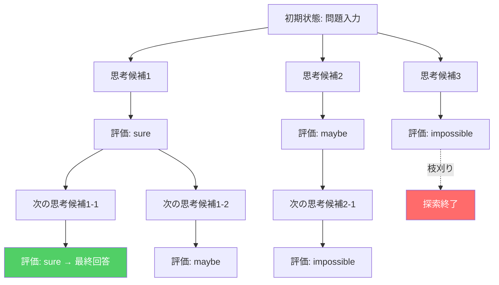
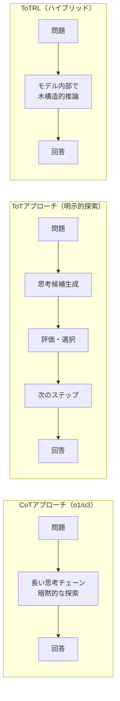

# Tree of Thoughtsを実装する：LLM推論を木探索で強化するPython実践ガイド

## この記事でわかること

- Tree of Thoughts（ToT）の仕組みと、Chain of Thought（CoT）との構造的な違い
- BFS（幅優先探索）とDFS（深さ優先探索）を使った思考木の探索アルゴリズムの実装方法
- 思考生成（Sample/Propose）と評価（Vote/Value）の4つの戦略の使い分け
- Game of 24タスクでの実装を通じた、ToTの具体的な動作原理の理解
- 2025年のToTRL（強化学習統合）など、ToTの発展的アプローチの概要

## 対象読者

- **想定読者**: 中級者のLLMアプリケーション開発者
- **必要な前提知識**:
  - Python 3.11以上の基礎文法
  - OpenAI API（またはAnthropic API）の基本的な呼び出し経験
  - Chain of Thought（CoT）プロンプティングの基本概念

## 結論・成果

Yaoらの論文（NeurIPS 2023）によると、GPT-4にToTを適用した実験ではGame of 24タスクの成功率が**CoTの4%からToTの74%に向上**しています。本記事では、この木探索ベースの推論フレームワークをPythonでゼロから実装し、思考生成・評価・探索の各コンポーネントの動作を理解します。実装コードは約200行で、OpenAI APIがあれば手元で動作確認が可能です。

## ToTの基本構造を理解する

Tree of Thoughts（ToT）は、LLMの推論プロセスを**木構造**でモデル化するフレームワークです。従来のCoTが1本の思考チェーンを直線的に生成するのに対し、ToTは複数の思考分岐を並行して探索し、有望な経路を選択的に深掘りします。

### CoTとToTの構造的な違い

まず、両者の違いを整理してみましょう。

| 特性 | Chain of Thought (CoT) | Tree of Thoughts (ToT) |
|------|----------------------|----------------------|
| 思考の構造 | 線形（1本のチェーン） | 木構造（複数の分岐） |
| 探索戦略 | なし（逐次生成） | BFS / DFS / Beam Search |
| バックトラック | 不可 | 可能（不要な枝を刈り込み） |
| 自己評価 | なし | 各ステップで評価・選択 |
| API呼び出し回数 | 1回 | 複数回（探索の深さ×幅） |
| 適するタスク | 論理的推論全般 | 探索的問題、制約充足問題 |

ToTの処理フローを図で示すと、以下のようになります。



### ToTの4つの設計要素

ToTフレームワークは以下の4つの設計要素で構成されます。

1. **思考の分解（Thought Decomposition）**: 問題を中間ステップに分割する方法
2. **思考の生成（Thought Generation）**: 各ステップで候補を生成する戦略
3. **状態の評価（State Evaluation）**: 各候補の有望さを評価する方法
4. **探索アルゴリズム（Search Algorithm）**: 木を探索する戦略（BFS/DFS）

**なぜこの4要素に分解するのか:**

- タスクごとに最適な戦略の組み合わせが異なるため、各要素を独立に設計できる柔軟性が必要です
- 例えばGame of 24では「Propose + Value + BFS」、Creative Writingでは「Sample + Vote + BFS」が適しています

> **注意点**: ToTはAPI呼び出し回数が多くなるため、コスト面でCoTの5〜20倍程度になるケースがあります。Yaoらの論文ではGame of 24タスクでGPT-4を約100回呼び出しています。単純な推論タスクにはCoTで十分であり、ToTは**正解が1つに定まらない探索的タスク**に限定して使用するのが実務的です。

## 思考生成と評価の戦略を実装する

ここからは、ToTの各コンポーネントをPythonで実装していきます。まずはデータ構造と、LLMとの通信を担うヘルパーから構築しましょう。

### 木ノードとLLMクライアントの定義

```python
# tot_framework.py
from __future__ import annotations

import os
import re
from collections import deque
from dataclasses import dataclass, field

from openai import OpenAI


@dataclass
class ThoughtNode:
    """思考木の1ノードを表すデータクラス。"""

    state: str  # 累積した思考テキスト
    thought: str  # このノードで生成された思考
    value: float = 0.0  # 評価スコア
    children: list[ThoughtNode] = field(default_factory=list)


class LLMClient:
    """OpenAI APIのラッパー。temperatureとmax_tokensを統一管理する。"""

    def __init__(
        self,
        model: str = "gpt-4o",
        temperature: float = 0.7,
        max_tokens: int = 1024,
    ) -> None:
        self.client = OpenAI()  # OPENAI_API_KEY 環境変数を使用
        self.model = model
        self.temperature = temperature
        self.max_tokens = max_tokens

    def generate(
        self,
        prompt: str,
        *,
        n: int = 1,
        stop: list[str] | None = None,
    ) -> list[str]:
        """LLMに問い合わせ、n個の応答を返す。"""
        response = self.client.chat.completions.create(
            model=self.model,
            messages=[{"role": "user", "content": prompt}],
            temperature=self.temperature,
            max_tokens=self.max_tokens,
            n=n,
            stop=stop,
        )
        return [choice.message.content for choice in response.choices]
```

`ThoughtNode`は木の各ノードを表し、`state`に累積テキスト、`value`に評価スコアを保持します。`LLMClient`はOpenAI APIの呼び出しを簡潔にするラッパーです。

**なぜOpenAI APIのnパラメータを使うのか:**

- `n=5`で1回のAPI呼び出しから5つの候補を取得でき、APIコールの回数を節約できます
- ただし、Anthropic APIでは`n`パラメータがサポートされていないため、ループで複数回呼び出す必要があります

### 思考生成: SampleとProposeの2戦略

思考生成には**Sample**と**Propose**の2つの戦略があります。

```python
class ThoughtGenerator:
    """思考候補を生成するクラス。Sample/Proposeの2戦略をサポート。"""

    def __init__(self, llm: LLMClient) -> None:
        self.llm = llm

    def sample(
        self,
        prompt: str,
        n_candidates: int = 5,
        stop: list[str] | None = None,
    ) -> list[str]:
        """Sample戦略: i.i.d.でn個の思考を独立生成する。

        用途: Creative Writingなど多様な出力が求められるタスク。
        """
        return self.llm.generate(prompt, n=n_candidates, stop=stop)

    def propose(self, prompt: str) -> list[str]:
        """Propose戦略: 1回のLLM呼び出しで複数の候補を列挙させる。

        用途: Game of 24など制約のある候補列挙タスク。
        """
        responses = self.llm.generate(prompt, n=1)
        # 改行区切りで複数候補を分割
        thoughts = [
            line.strip()
            for line in responses[0].split("\n")
            if line.strip()
        ]
        return thoughts
```

| 戦略 | 特徴 | API呼び出し | 適するタスク |
|------|------|------------|------------|
| **Sample** | 独立に複数生成、多様性が高い | 1回（nパラメータ活用） | 文章生成、企画立案 |
| **Propose** | 1回で複数列挙、重複を回避 | 1回 | 数式、制約充足問題 |

**よくある間違い**: Sample戦略でtemperatureを低く設定しすぎると、ほぼ同一の候補しか生成されません。多様な候補を得るには`temperature=0.7`以上を推奨します。一方、Propose戦略ではLLMが自ら列挙するため、temperature設定の影響は相対的に小さくなります。

### 状態評価: VoteとValueの2戦略

各思考候補を評価する方法にも、**Vote**（投票）と**Value**（スコアリング）の2戦略があります。

```python
class StateEvaluator:
    """思考状態を評価するクラス。Vote/Valueの2戦略をサポート。"""

    def __init__(self, llm: LLMClient) -> None:
        self.llm = llm

    def vote(
        self,
        states: list[str],
        task_description: str,
        n_votes: int = 5,
    ) -> list[int]:
        """Vote戦略: 複数候補を比較し、最良の候補に投票する。

        用途: Creative Writingなど相対評価が適するタスク。
        """
        prompt = self._build_vote_prompt(states, task_description)
        responses = self.llm.generate(prompt, n=n_votes)

        vote_counts = [0] * len(states)
        for response in responses:
            match = re.search(r"best choice is\s*.*?(\d+)", response, re.DOTALL)
            if match:
                idx = int(match.group(1)) - 1  # 1-indexed → 0-indexed
                if 0 <= idx < len(states):
                    vote_counts[idx] += 1
        return vote_counts

    def value(
        self,
        state: str,
        eval_prompt: str,
        n_evals: int = 3,
    ) -> float:
        """Value戦略: 個別の状態を絶対評価する。

        用途: Game of 24など明確な判定基準があるタスク。
        """
        responses = self.llm.generate(eval_prompt, n=n_evals)
        scores = [self._parse_value(r) for r in responses]
        return sum(scores) / len(scores) if scores else 0.0

    @staticmethod
    def _parse_value(response: str) -> float:
        """LLMの応答からsure/maybe/impossibleを数値に変換する。"""
        text = response.lower()
        if "sure" in text:
            return 1.0
        if "maybe" in text or "likely" in text:
            return 0.5
        if "impossible" in text:
            return 0.0
        return 0.5  # 判定不能時のフォールバック

    @staticmethod
    def _build_vote_prompt(states: list[str], task_description: str) -> str:
        """投票用プロンプトを構築する。"""
        prompt = (
            "Given an instruction and several choices, decide which choice "
            "is most promising. Analyze each choice in detail, then conclude "
            'in the last line "The best choice is {s}", where s is the '
            "integer id of the choice.\n\n"
            f"Instruction:\n{task_description}\n\n"
        )
        for i, state in enumerate(states, start=1):
            prompt += f"Choice {i}:\n{state}\n\n"
        return prompt
```

| 戦略 | 評価方法 | 出力 | 適するタスク |
|------|---------|------|------------|
| **Vote** | 複数候補を相対比較 | 各候補の得票数 | 正解が主観的なタスク |
| **Value** | 各候補を独立にスコアリング | sure/maybe/impossible | 正解が客観的なタスク |

## BFS探索アルゴリズムを実装する

4つのコンポーネントが揃ったところで、メインの探索アルゴリズムを実装しましょう。ここではBFS（幅優先探索）を取り上げます。BFSは各ステップで上位`b`個の候補を保持し、幅を制限しながら木を展開する手法です。

### BFS実装の全体像

```python
class TreeOfThoughts:
    """Tree of Thoughtsフレームワークのメインクラス。"""

    def __init__(
        self,
        llm: LLMClient,
        generator: ThoughtGenerator,
        evaluator: StateEvaluator,
    ) -> None:
        self.llm = llm
        self.generator = generator
        self.evaluator = evaluator

    def solve_bfs(
        self,
        problem: str,
        *,
        n_steps: int = 3,
        n_candidates: int = 5,
        breadth_limit: int = 5,
        build_gen_prompt: callable,
        build_eval_prompt: callable,
        generation_strategy: str = "propose",
        evaluation_strategy: str = "value",
        verbose: bool = False,
    ) -> str:
        """BFSでTree of Thoughtsを探索する。各ステップで上位b個を保持。"""
        # ルートノードの作成
        root = ThoughtNode(state="", thought="")
        current_nodes: deque[ThoughtNode] = deque([root])

        for step in range(1, n_steps + 1):
            if verbose:
                print(f"\n--- Step {step}/{n_steps} ---")

            next_candidates: list[ThoughtNode] = []

            # 1. 各ノードから思考候補を生成
            for node in current_nodes:
                gen_prompt = build_gen_prompt(problem, node.state)

                if generation_strategy == "sample":
                    thoughts = self.generator.sample(
                        gen_prompt, n_candidates=n_candidates,
                    )
                else:
                    thoughts = self.generator.propose(gen_prompt)

                for thought in thoughts:
                    new_state = (
                        f"{node.state}\n{thought}".strip()
                        if node.state
                        else thought
                    )
                    child = ThoughtNode(state=new_state, thought=thought)
                    node.children.append(child)
                    next_candidates.append(child)

            if verbose:
                print(f"  生成された候補数: {len(next_candidates)}")

            # 2. 各候補を評価
            if evaluation_strategy == "value":
                for candidate in next_candidates:
                    eval_prompt = build_eval_prompt(problem, candidate.state)
                    candidate.value = self.evaluator.value(
                        candidate.state, eval_prompt,
                    )
            else:  # vote
                states = [c.state for c in next_candidates]
                votes = self.evaluator.vote(states, problem)
                for candidate, vote_count in zip(
                    next_candidates, votes, strict=False,
                ):
                    candidate.value = float(vote_count)

            # 3. 上位b個を選択（プルーニング）
            next_candidates.sort(key=lambda n: n.value, reverse=True)
            limit = 1 if step == n_steps else breadth_limit
            selected = next_candidates[:limit]

            if verbose:
                for i, c in enumerate(selected):
                    print(f"  Top-{i + 1}: value={c.value:.2f}")

            current_nodes = deque(selected)

        # 最終的に最高評価のノードを返す
        best = current_nodes[0]
        return best.state
```

### アルゴリズムの計算量

BFS探索の計算量を整理します。

- **LLM呼び出し回数（生成）**: $n_{\text{steps}} \times b$（各ステップで$b$個のノードから生成）
- **LLM呼び出し回数（評価）**: $n_{\text{steps}} \times b \times k$（$b$個の候補をそれぞれ$k$回評価）
- **合計**: $O(n_{\text{steps}} \times b \times (1 + k))$

Game of 24の設定（$n_{\text{steps}}=3$, $b=5$, $k=3$）では、1問あたり約**60〜100回**のAPI呼び出しが発生します。

> **トレードオフ**: BFSは各ステップで幅広く候補を保持するため、**最適解を見つけやすい**反面、API呼び出し回数が多くコストが増加します。DFSは深さ優先で1つの経路を追求し、行き詰まったらバックトラックするため、**コストを抑えられる**反面、局所最適に陥る可能性があります。

## Game of 24でToTを動かす

理論とコードが揃ったので、具体的なタスクでToTを動かしてみましょう。**Game of 24**は4つの数字と四則演算を組み合わせて24を作るパズルです。

### タスク固有のプロンプトを定義する

```python
def build_game24_gen_prompt(problem: str, state: str) -> str:
    """Game of 24の思考生成プロンプトを構築する。"""
    # 現在の残り数字を抽出
    if state:
        last_line = state.strip().split("\n")[-1]
        if "left:" in last_line:
            remaining = last_line.split("left:")[-1].strip().rstrip(")")
        else:
            remaining = problem
    else:
        remaining = problem

    return f"""Input: 2 8 8 14
Possible next steps:
2 + 8 = 10 (left: 8 10 14)
8 / 2 = 4 (left: 4 8 14)
14 + 2 = 16 (left: 8 8 16)
14 - 8 = 6 (left: 2 6 8)
14 / 2 = 7 (left: 7 8 8)
Input: {remaining}
Possible next steps:
"""


def build_game24_eval_prompt(problem: str, state: str) -> str:
    """Game of 24の状態評価プロンプトを構築する。"""
    last_line = state.strip().split("\n")[-1]

    if "left:" in last_line:
        remaining = last_line.split("left:")[-1].strip().rstrip(")")
        return f"""Evaluate if given numbers can reach 24 (sure/maybe/impossible).

10 14
10 + 14 = 24
sure

11 12
11 + 12 = 23
12 - 11 = 1
11 * 12 = 132
impossible

4 4 10
4 + 4 + 10 = 18
(10 - 4) * 4 = 24
sure

{remaining}
"""
    else:
        return f"""Use numbers and basic arithmetic operations (+ - * /) to obtain 24.
Given an input and an answer, judge if the answer is correct (sure/impossible).

Input: 4 4 6 8
Answer: (4 + 8) * (6 - 4) = 24
Judge: sure

Input: {problem}
Answer: {state}
Judge:"""
```

### 実行してみる

```python
def main() -> None:
    """Game of 24をToT + BFSで解くエントリーポイント。"""
    # 環境変数 OPENAI_API_KEY が設定されていることを確認
    assert os.environ.get("OPENAI_API_KEY"), "OPENAI_API_KEYを設定してください"

    llm = LLMClient(model="gpt-4o", temperature=0.7, max_tokens=512)
    generator = ThoughtGenerator(llm)
    evaluator = StateEvaluator(llm)
    tot = TreeOfThoughts(llm, generator, evaluator)

    # 問題: 4つの数字で24を作る
    problem = "4 5 6 10"

    result = tot.solve_bfs(
        problem,
        n_steps=3,
        n_candidates=5,
        breadth_limit=5,
        build_gen_prompt=build_game24_gen_prompt,
        build_eval_prompt=build_game24_eval_prompt,
        generation_strategy="propose",
        evaluation_strategy="value",
        verbose=True,
    )

    print(f"\n=== 最終結果 ===\n{result}")


if __name__ == "__main__":
    main()
```

`verbose=True`で各ステップの候補数とスコアが確認でき、探索過程の透明性を確保できます。

> **ハマりポイント**: LLMが生成する数式が正しい形式（`a op b = c (left: ...)`）になるとは限りません。本番実装では正規表現による形式検証と、不正な出力を除外するフィルタリングを追加してください。

## DFS探索と実務での使い分けを理解する

BFSに加えて、DFS（深さ優先探索）も重要な選択肢です。実際にDFSの実装と、タスクに応じた使い分けの基準を見ていきましょう。

### DFS実装

```python
def solve_dfs(
    self,
    problem: str,
    *,
    max_depth: int = 3,
    n_candidates: int = 5,
    value_threshold: float = 0.5,
    build_gen_prompt: callable,
    build_eval_prompt: callable,
    verbose: bool = False,
) -> str | None:
    """DFSでTree of Thoughtsを探索する。行き詰まったらバックトラック。"""
    root = ThoughtNode(state="", thought="")

    def _dfs(node: ThoughtNode, depth: int) -> str | None:
        if depth >= max_depth:
            # 最終評価
            eval_prompt = build_eval_prompt(problem, node.state)
            score = self.evaluator.value(node.state, eval_prompt)
            if score >= 0.9:  # "sure" 判定
                return node.state
            return None

        gen_prompt = build_gen_prompt(problem, node.state)
        thoughts = self.generator.propose(gen_prompt)

        # 各候補を評価してスコア順にソート
        scored: list[tuple[float, str]] = []
        for thought in thoughts:
            new_state = (
                f"{node.state}\n{thought}".strip()
                if node.state
                else thought
            )
            eval_prompt = build_eval_prompt(problem, new_state)
            score = self.evaluator.value(new_state, eval_prompt)
            if score >= value_threshold:
                scored.append((score, new_state, thought))

        # スコアの高い順に探索
        scored.sort(key=lambda x: x[0], reverse=True)

        for score, new_state, thought in scored:
            if verbose:
                print(f"  {'  ' * depth}depth={depth}, score={score:.2f}")
            child = ThoughtNode(state=new_state, thought=thought, value=score)
            node.children.append(child)

            result = _dfs(child, depth + 1)
            if result is not None:
                return result  # 解が見つかった

        return None  # バックトラック

    return _dfs(root, 0)
```

### BFS vs DFSの使い分け

| 基準 | BFS推奨 | DFS推奨 |
|------|--------|--------|
| 解の存在 | 複数の良い解がある | 解が1つでよい |
| 探索空間 | 浅くて広い | 深くて狭い |
| コスト許容度 | 高い（API呼び出し多め） | 低い（早期終了可能） |
| タスク例 | Creative Writing、企画立案 | Game of 24、パズル |
| メモリ使用量 | $O(b^d)$（幅^深さ） | $O(d)$（深さ分のみ） |

**制約条件**: DFSは`value_threshold`の設定が重要です。閾値が高すぎると有望な経路まで刈り込んでしまい、低すぎると不要な探索が増加します。Yaoらの論文ではGame of 24で**0.5以上（maybe以上）**をDFSの閾値として使用しています。

## 2025年以降のToTの発展を把握する

ToTの基本実装を理解したところで、2025年以降の発展動向も確認しておきましょう。

### ToTRL: 強化学習でToT能力を内在化する

2025年5月にWuらが発表した**ToTRL（Tree-of-Thoughts Reinforcement Learning）**は、ToTの「外部探索アルゴリズム」を**モデル内部の推論能力**として学習させるフレームワークです。

ToTRLの特徴は以下の通りです。

- **パズルゲームで訓練**: 選択肢の探索と制約管理が本質的に求められるパズルを訓練環境に使用
- **ルールベース報酬**: 正解判定に基づくルールベースの報酬関数を使用（学習された報酬モデルに依存しない）
- **結果**: ToTQwen3-8B（8Bパラメータ）がAIME 2025でスコア0.633、AMC 2023で0.950を達成。同サイズのCoTベースモデルと比較して性能向上と推論トークン削減を両立

### 推論時間スケーリングとToTの関係

OpenAIのo1/o3シリーズやDeepSeek-R1などの**推論モデル**は、内部的にCoTを拡張した推論プロセスを使用しています。これらのモデルは明示的なTree Searchではなく、**暗黙的な探索**を長いCoTの中で行っている点がToTとの構造的な違いです。

2025年3月にはMaらによる「Wider or Deeper? Scaling LLM Inference-Time Compute with Adaptive Branching Tree Search」（arxiv:2503.04412）が発表され、推論時間の計算資源配分において**木探索とCoTの使い分け**が研究されています。



| アプローチ | API呼び出し | 制御性 | コスト | 代表例 |
|-----------|------------|--------|--------|--------|
| CoTプロンプティング | 1回 | 低い | 低い | GPT-4o + CoT |
| ToT（明示的探索） | 数十〜百回 | 高い | 高い | 本記事の実装 |
| 推論モデル（暗黙的探索） | 1回 | 中程度 | 中程度 | o3, DeepSeek-R1 |
| ToTRL（学習済み） | 1回 | 低い | 低い | ToTQwen3-8B |

> **制約条件**: 2026年2月現在、推論モデル（o3やDeepSeek-R1）が多くのタスクで高い性能を発揮するため、ToTの明示的実装が必要なケースは限定的です。ToTが特に有効なのは、**探索過程の透明性が必要な場合**（各分岐の評価理由を記録したい研究用途）や、**推論モデルが利用できない環境**（オープンソースモデルでの推論強化）です。

## よくある問題と解決方法

ToTを実装・運用する際によく遭遇する問題を整理します。

| 問題 | 原因 | 解決方法 |
|------|------|----------|
| LLMの出力形式が不安定 | few-shot例が不十分 | プロンプトにパース可能な形式の例を3つ以上追加 |
| 探索が深くなりすぎる | DFSの終了条件が甘い | `max_depth`を明示的に制限し、`value_threshold`を適切に設定 |
| APIコストが想定以上 | 候補数×評価回数の増加 | `breadth_limit`を3に減らす、または`n_evals`を1に削減 |
| 同じ候補ばかり生成される | temperatureが低い | 生成時の`temperature`を0.7〜1.0に引き上げ |
| 評価スコアがすべて0.5 | 評価プロンプトが曖昧 | 評価基準を具体的に記述（「sure: 残りの数字で24が作れる確信がある」） |
| Game of 24で解けない問題がある | 一部の入力は解なし | 最大リトライ回数を設定し、解なしの場合はフォールバック処理 |

## まとめと次のステップ

**まとめ:**

- ToTはCoTを木構造に一般化し、**複数の推論経路を並行探索**するフレームワークである
- 設計要素は**思考生成**（Sample/Propose）×**評価**（Vote/Value）×**探索**（BFS/DFS）の組み合わせで構成される
- Yaoらの論文ではGame of 24で**CoTの4% → ToTの74%**に成功率が向上（GPT-4使用時）
- API呼び出し回数が多いため、コストと性能のトレードオフを考慮した使い分けが必要
- 2025年のToTRLにより、ToT能力をモデル内部に学習させるアプローチも登場している

**次にやるべきこと:**

- [公式実装](https://github.com/princeton-nlp/tree-of-thought-llm)のGame of 24タスクを`pip install tree-of-thoughts-llm`で実際に動かしてみる
- 自分のタスクに合わせた`build_gen_prompt`/`build_eval_prompt`関数を設計する
- コスト削減のため、まずDFSで試行し、精度が不十分な場合にBFSへ切り替える段階的アプローチを検討する

関連記事: [2026年版プロンプトテクニック大全：10手法の使い分けとコンテキスト設計](https://zenn.dev/0h_n0/articles/8d05ea9be7e0f3)

## 参考

- [Tree of Thoughts: Deliberate Problem Solving with Large Language Models (Yao et al., NeurIPS 2023)](https://arxiv.org/abs/2305.10601)
- [princeton-nlp/tree-of-thought-llm - GitHub](https://github.com/princeton-nlp/tree-of-thought-llm)
- [Tree of Thoughts (ToT) - Prompt Engineering Guide](https://www.promptingguide.ai/techniques/tot)
- [Understanding and Implementing the Tree of Thoughts Paradigm - Hugging Face Blog](https://huggingface.co/blog/sadhaklal/tree-of-thoughts)
- [ToTRL: Unlock LLM Tree-of-Thoughts Reasoning Potential through Puzzles Solving (Wu et al., 2025)](https://arxiv.org/abs/2505.12717)
- [Wider or Deeper? Scaling LLM Inference-Time Compute with Adaptive Branching Tree Search (Ma et al., 2025)](https://arxiv.org/html/2503.04412v1)

---

:::message
この記事はAI（Claude Code）により自動生成されました。内容の正確性については複数の情報源で検証していますが、実際の利用時は公式ドキュメントもご確認ください。
:::
