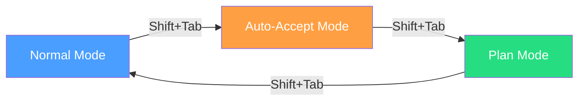
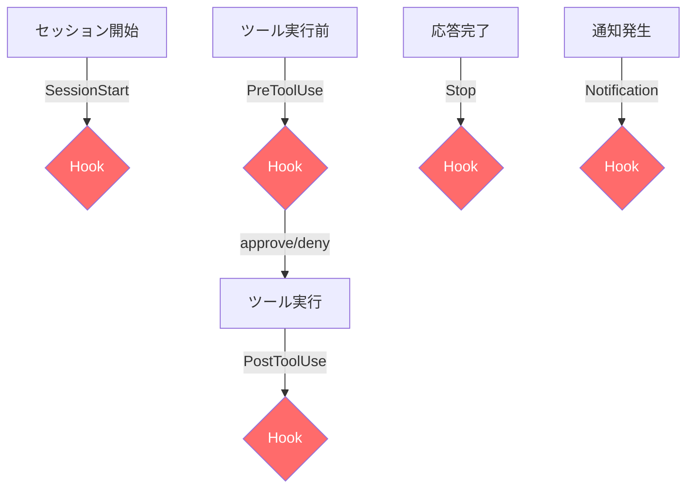

# Claude Codeコマンド完全ガイド：3モード×30+コマンドで開発効率を最大化する

## この記事でわかること

- Claude Codeの**3つの権限モード**（Normal / Auto-Accept / Plan）の使い分けと切り替え方法
- **30以上のビルトインコマンド**（/compact, /plan, /memory, /rewind等）の全体像と実践的な使い方
- **CLIフラグ**（--permission-mode, --agents, --worktree等）を活用した自動化パイプライン
- **Skills・Hooks・Subagents**による拡張体系と、プロジェクトに合わせたカスタマイズ手法
- 2026年最新機能：Agent Teams、--teleport、--from-pr、Fast Modeの活用法

## 対象読者

- **想定読者**: Claude Codeを日常的に使用している中級〜上級エンジニア
- **必要な前提知識**:
  - Claude Code CLIの基本操作（セッションの開始・終了）
  - ターミナル操作の基本（bash/zsh）
  - Git の基本的な操作

## 結論・成果

Claude Codeの公式ドキュメントによると、**Plan Modeの活用でコード変更の手戻りを削減**でき、**Shift+Tabによる3モード切替**でファイル探索から実装まで1つのセッション内で完結できます。さらに、`--worktree`フラグによる**並列セッション**と`--agents`による**カスタムサブエージェント**を組み合わせることで、複数タスクの同時進行が可能になります。Arizeの調査では、CLAUDE.mdの最適化だけで**SWE Bench Liteベンチマークのスコアが5〜10%向上**したと[報告](https://arize.com/blog/claude-md-best-practices-learned-from-optimizing-claude-code-with-prompt-learning/)されています。

## 3つの権限モードを使いこなす

Claude Codeには、操作の安全性レベルが異なる**3つの権限モード**があります。**Shift+Tab**を押すたびにモードが切り替わり、状況に応じた最適な操作が可能になります。

### 権限モードの全体像

| モード | 表示 | ファイル読み取り | ファイル編集 | Bash実行 | 用途 |
|--------|------|:---:|:---:|:---:|------|
| **Normal** | （デフォルト） | ✅ | 要承認 | 要承認 | 通常の開発作業 |
| **Auto-Accept** | `⏵⏵ accept edits on` | ✅ | ✅自動 | 要承認 | 連続的なコード修正 |
| **Plan** | `⏸ plan mode on` | ✅ | ❌ | ❌ | 安全な探索・計画立案 |



**注意点:**
> Windows環境では`Shift+Tab`がNormalとAuto-Acceptの2つしか切り替わらない場合があります。その場合は`Alt+M`を使用してください。macOSのターミナルでは、Option/Altキーを「Meta」として設定する必要がある場合があります（iTerm2: Profiles → Keys → "Esc+"に設定）。

### Plan Modeの実践的な使い方

Plan Modeは**Explore → Plan → Code**ワークフローの核となるモードです。公式ドキュメントでは、「不確実な場合、複数ファイルを変更する場合、コードに不慣れな場合」にPlan Modeの使用が推奨されています。

```bash
# セッション開始時からPlan Modeで起動
claude --permission-mode plan

# headlessモード（スクリプト向け）でPlan Mode実行
claude --permission-mode plan -p "認証システムのアーキテクチャを分析して改善案を出して"
```

Plan Modeでは、Claudeは`AskUserQuestion`ツールを使って要件を明確化し、実装計画を提示します。計画内容は**Ctrl+G**でデフォルトのテキストエディタで編集できます。

**Plan Modeが有効な場面:**

1. **大規模リファクタリング** — 変更対象のファイルを事前に把握
2. **新規プロジェクトの探索** — コードベースの構造を安全に読み取り
3. **コードレビュー** — 変更を加えずに問題点を指摘

**Plan Modeをスキップすべき場面:**

差分を一文で説明できるような小さな変更（typo修正、1行の追加等）では、Plan Modeのオーバーヘッドが不要です。

### Auto-Accept Modeの活用

Auto-Accept Modeはファイル編集の承認をスキップするため、**連続的なコード修正**に向いています。ただし、Bash実行は引き続き承認が必要です。

```json
// .claude/settings.json でデフォルトモードを設定
{
  "permissions": {
    "defaultMode": "acceptEdits"
  }
}
```

**トレードオフ**: 編集速度は向上しますが、意図しないファイル変更のリスクが高まります。信頼できるプロジェクト・ブランチでの使用を推奨します。

## ビルトインコマンドを使い倒す

Claude Codeには**30以上のビルトインコマンド**が用意されています。セッション中に`/`を入力すると一覧が表示され、続けて文字を入力するとフィルタリングできます。

### セッション管理系コマンド

| コマンド | 説明 | 使用例 |
|----------|------|--------|
| `/compact [指示]` | コンテキストを圧縮して要約 | `/compact 認証関連だけ残して` |
| `/clear` | 会話履歴をクリア | セッションリセット時 |
| `/resume [session]` | 過去のセッションを再開 | `/resume auth-refactor` |
| `/rename [name]` | セッションに名前を付与 | `/rename payment-fix` |
| `/rewind` | 会話・コードを巻き戻し | `Esc+Esc`でも可 |
| `/export [file]` | 会話をファイルまたはクリップボードにエクスポート | ログ保存時 |

`/compact`はClaude Codeのコンテキストウィンドウを効率的に管理するうえで重要です。長いセッションでコンテキストが圧迫される前に、不要な情報を圧縮できます。

```bash
# フォーカスを指定してcompact
/compact テスト関連のやりとりだけ残して
```

### モデル・設定系コマンド

| コマンド | 説明 | 使用例 |
|----------|------|--------|
| `/model` | モデルを切り替え（左右矢印でeffort調整） | Opus 4.6 ↔ Sonnet 4.6 |
| `/config` | 設定画面を開く | テーマ、vim mode等 |
| `/permissions` | 権限ルールの表示・変更 | allow/deny管理 |
| `/plan` | Plan Modeに直接切り替え | プロンプト入力中に使用可 |
| `/context` | 現在のコンテキスト使用量を可視化 | カラーグリッド表示 |
| `/cost` | トークン使用統計を表示 | 費用監視 |

`/model`コマンドでは、**Opus 4.6のeffort level**（low/medium/high）を左右矢印キーで調整できます。これにより、思考の深さと応答速度のトレードオフを制御できます。

### デバッグ・診断系コマンド

| コマンド | 説明 |
|----------|------|
| `/doctor` | Claude Codeのインストール状態をヘルスチェック |
| `/debug [description]` | セッションのデバッグログを読み取って問題を診断 |
| `/status` | バージョン、モデル、アカウント、接続状態を表示 |
| `/stats` | 日次利用状況、セッション履歴、ストリーク、モデル使用傾向を可視化 |

**ハマりポイント**: `/doctor`はClaude Codeの動作に問題がある場合の最初の切り分けツールとして有効です。MCP接続の失敗やバージョン不整合がある場合、ここで検出されます。

### その他の便利コマンド

| コマンド | 説明 |
|----------|------|
| `/memory` | CLAUDE.mdメモリファイルを編集 |
| `/init` | プロジェクト用CLAUDE.mdを初期化 |
| `/copy` | 直前の応答をクリップボードにコピー（コードブロック選択可） |
| `/todos` | 現在のTODOリストを表示 |
| `/tasks` | バックグラウンドタスクの一覧管理 |
| `/teleport` | claude.aiのリモートセッションをローカルで再開 |
| `/desktop` | CLIセッションをDesktopアプリに移行（macOS/Windows） |
| `/theme` | カラーテーマを変更 |

## CLIフラグで自動化パイプラインを構築する

Claude Codeはインタラクティブモードだけでなく、`-p`（print）モードでのCI/CDパイプライン統合や、豊富なCLIフラグによるカスタマイズが可能です。

### セッション管理フラグ

```bash
# 直前のセッションを続行
claude -c

# 名前付きセッションを再開
claude -r "auth-refactor" "型エラーを修正して"

# PRに紐づくセッションを再開
claude --from-pr 123

# リモートセッション（claude.aiのWebセッション）
claude --remote "ログインバグを修正して"

# Webセッションをローカルに引き継ぎ
claude --teleport
```

**`--from-pr`** は`gh pr create`で作成したPRに自動リンクされたセッションを再開する機能です。PRレビュー中の修正作業で、以前の会話コンテキストを活用できます。

### 権限・セキュリティフラグ

```bash
# Plan Modeで起動
claude --permission-mode plan

# 特定ツールのみ許可
claude --allowedTools "Bash(git log *)" "Bash(git diff *)" "Read"

# 使用可能なツールを制限
claude --tools "Bash,Edit,Read"

# 特定ツールを無効化
claude --disallowedTools "Bash(rm *)" "Edit"
```

### 出力・自動化フラグ

```bash
# headlessモード（パイプライン向け）
claude -p "このコードのバグを説明して" --output-format json

# ストリーミングJSON出力
cat error.log | claude -p "エラーの原因を分析" --output-format stream-json

# 最大ターン数を制限
claude -p --max-turns 5 "テストを実行して失敗を修正"

# 費用上限の設定
claude -p --max-budget-usd 3.00 "コードレビューして"
```

**実用例: package.jsonへの組み込み**

```json
{
  "scripts": {
    "lint:ai": "claude -p 'mainブランチとの差分を確認して、typoやバグがあれば報告して。ファイル名と行番号を含めること。'",
    "review": "claude -p --output-format json 'このPRの変更をレビューして' > review.json"
  }
}
```

**制約条件**: `-p`モードでは`--system-prompt-file`や`--append-system-prompt-file`が使えますが、`--system-prompt`は全デフォルトプロンプトを**上書き**する点に注意してください。ほとんどのケースでは、デフォルト動作を維持する`--append-system-prompt`が推奨されます。

### カスタムサブエージェント定義

`--agents`フラグでセッション固有のサブエージェントを定義できます。

```bash
claude --agents '{
  "code-reviewer": {
    "description": "コード変更後にプロアクティブにレビュー",
    "prompt": "セキュリティ、品質、ベストプラクティスの観点でレビュー",
    "tools": ["Read", "Grep", "Glob", "Bash"],
    "model": "sonnet"
  },
  "test-runner": {
    "description": "テスト実行と失敗の修正",
    "prompt": "テストを実行し、失敗原因を分析して修正案を提示",
    "model": "haiku"
  }
}'
```

サブエージェントは`.claude/agents/`ディレクトリにファイルとして配置することもできます。`claude agents`コマンドで利用可能なサブエージェント一覧を確認できます。

### Git Worktreeで並列セッションを実行する

```bash
# worktreeを自動作成してClaude起動
claude --worktree feature-auth

# 別のworktreeで並列に作業
claude --worktree bugfix-456

# 名前を省略するとランダム生成
claude --worktree
```

`--worktree`は`<repo>/.claude/worktrees/<name>`にworktreeを作成し、リモートのデフォルトブランチから分岐します。セッション終了時、変更がなければ自動クリーンアップされます。

## Skills・Hooks・Memoryで拡張する

Claude Codeのコマンド体系は、**Skills（スキル）**、**Hooks（フック）**、**Memory（メモリ）** の3つの拡張機構によってプロジェクト固有にカスタマイズできます。

### Skillsでカスタムコマンドを作成する

Skillsは`.claude/skills/<skill-name>/SKILL.md`に配置するMarkdownファイルです。従来の`.claude/commands/`と統合され、同じ`/skill-name`で呼び出せます。

```yaml
# .claude/skills/deploy/SKILL.md
---
name: deploy
description: アプリケーションを本番環境にデプロイ
disable-model-invocation: true
allowed-tools: Bash(npm *), Bash(git *)
---

$ARGUMENTS をデプロイ:

1. テストスイートを実行
2. アプリケーションをビルド
3. デプロイターゲットにプッシュ
4. デプロイ成功を確認
```

**Skillのfrontmatterオプション:**

| フィールド | 説明 |
|-----------|------|
| `name` | スキル名（`/name`で呼び出し） |
| `description` | 自動呼び出しのトリガー条件 |
| `disable-model-invocation` | `true`で手動呼び出し専用に |
| `user-invocable` | `false`でClaudeのみ使用（メニュー非表示） |
| `allowed-tools` | アクティブ時に許可するツール |
| `context` | `fork`でサブエージェントとして実行 |
| `agent` | `context: fork`時のサブエージェントタイプ（`Explore`等） |
| `model` | 使用するモデル |

**動的コンテキスト注入**（`!`command``構文）を使うと、Skill実行前にシェルコマンドの出力を差し込めます。

```yaml
---
name: pr-summary
description: PRの変更をサマリー
context: fork
agent: Explore
---

## PRコンテキスト
- PR差分: !`gh pr diff`
- 変更ファイル: !`gh pr diff --name-only`

上記のPRを要約してください。
```

### Hooksで自動化ワークフローを構築する

Hooksは特定のイベント発生時に自動実行されるシェルコマンドまたはLLMプロンプトです。Skillsが確率的（Claudeが判断して実行）であるのに対し、Hooksは**決定的（100%実行保証）** です。



**主要なHookイベント:**

| イベント | タイミング | 典型的な用途 |
|----------|-----------|-------------|
| `PreToolUse` | ツール実行前 | カスタム権限チェック、バリデーション |
| `PostToolUse` | ツール実行後 | ログ記録、後処理 |
| `Notification` | 通知発生時 | デスクトップ通知 |
| `SessionStart` | セッション開始時 | 環境チェック、初期化 |
| `Stop` | Claudeの応答完了時 | 後処理、通知 |
| `SessionEnd` | セッション終了時 | クリーンアップ |

**設定例（.claude/settings.json）:**

```json
{
  "hooks": {
    "Notification": [
      {
        "matcher": "",
        "hooks": [
          {
            "type": "command",
            "command": "notify-send 'Claude Code' 'Claude Codeが入力を待っています'"
          }
        ]
      }
    ]
  }
}
```

**注意点**: Hooksの設定はJSON形式で`.claude/settings.json`に記述します。`/hooks`コマンドでGUIから設定することも可能です。

### Memoryでプロジェクト知識を永続化する

Claude Codeのメモリは**6つの階層**で管理されます。

| 層 | パス | スコープ |
|----|------|---------|
| **Managed** | `/etc/claude-code/CLAUDE.md`（Linux） | 組織全体 |
| **Project** | `./CLAUDE.md` または `./.claude/CLAUDE.md` | チーム共有 |
| **Project rules** | `./.claude/rules/*.md` | チーム共有（トピック別） |
| **User** | `~/.claude/CLAUDE.md` | 個人（全プロジェクト） |
| **Project local** | `./CLAUDE.local.md` | 個人（現プロジェクト） |
| **Auto-memory** | `~/.claude/projects/<project>/memory/` | 個人（プロジェクト別） |

より具体的な階層の設定が優先されます。`CLAUDE.local.md`は自動で`.gitignore`に追加されるため、個人的な設定に最適です。

```bash
# CLAUDE.mdの初期化
/init

# メモリファイルの編集
/memory

# Auto-memoryへの明示的な保存
# 会話中に「pnpmを使うことを覚えておいて」と指示するだけ
```

**`.claude/rules/`によるモジュラールール:**

```
.claude/rules/
├── code-style.md     # コーディング規約
├── testing.md        # テスト方針
├── security.md       # セキュリティ要件
└── frontend/
    ├── react.md      # React固有のルール
    └── styles.md     # スタイリング方針
```

各ルールファイルにはYAML frontmatterの`paths`フィールドでスコープを限定できます。

```yaml
# .claude/rules/frontend/react.md
---
paths:
  - "src/components/**/*.tsx"
  - "src/pages/**/*.tsx"
---

Reactコンポーネントの規約:
- 関数コンポーネントのみ使用
- Props型はインターフェースで定義
```

## キーボードショートカットを活用する

ターミナルでの操作効率を高める主要なキーボードショートカットを整理します。

### 必須ショートカット

| ショートカット | 説明 |
|---------------|------|
| **Shift+Tab** | 権限モード切り替え（Normal → Auto-Accept → Plan） |
| **Ctrl+C** | 現在の入力・生成をキャンセル |
| **Ctrl+G** | デフォルトエディタで編集 |
| **Ctrl+O** | 詳細出力（verbose）の切り替え |
| **Ctrl+B** | 実行中のタスクをバックグラウンドに |
| **Ctrl+T** | タスクリストの表示切り替え |
| **Esc+Esc** | 巻き戻し（Rewind） |
| **Alt+P** | モデル切り替え |
| **Alt+T** | Extended Thinking切り替え |

### クイック入力

| 接頭辞 | 説明 | 例 |
|--------|------|-----|
| `/` | コマンド・スキル呼び出し | `/compact` |
| `!` | Bashモード（直接コマンド実行） | `! npm test` |
| `@` | ファイルパス参照 | `@src/auth.ts` |

`!`プレフィックスを使ったBashモードは、Claudeの介在なしにシェルコマンドを直接実行しつつ、コマンドと出力を会話コンテキストに追加します。Tab補完で過去の`!`コマンド履歴も参照できます。

## 2026年最新機能を活用する

2026年2月時点でリリースされている注目の新機能を紹介します。

### Fast Mode

Opus 4.6の出力を最大2.5倍高速化するモードです。`/fast`コマンドで切り替えでき、同じOpus 4.6モデルを使用しながら応答速度が向上します。なお、Opus 4.6は1Mトークンのコンテキストウィンドウにも対応していますが、こちらはベータ機能であり、APIヘッダーの設定が必要です（デフォルトは200Kトークン）。

### Agent Teams（--teammate-mode）

複数のClaudeインスタンスを協調させて並列タスクを実行する機能です。`--teammate-mode`フラグで`auto`（デフォルト）、`in-process`、`tmux`の3つの表示モードを選択できます。利用には環境変数`CLAUDE_CODE_EXPERIMENTAL_AGENT_TEAMS=1`の設定が必要です（2026年2月時点）。

```bash
# Agent Teamsモード
claude --teammate-mode tmux
```

### Remote Sessions

`--remote`フラグでclaude.aiにWebセッションを作成し、`--teleport`でローカルに引き継ぐワークフローです。モバイルで作業を開始し、デスクトップで継続するといった使い方が可能です。

```bash
# Webセッション作成
claude --remote "パフォーマンスボトルネックを調査"

# ローカルで引き継ぎ
claude --teleport
```

### Chrome Integration

`--chrome`フラグでChrome連携を有効化し、WebアプリケーションのE2Eテストやデバッグを直接Claude Code内で実行できます。

```bash
claude --chrome
```

### 認証コマンド

```bash
claude auth login         # ログイン
claude auth login --sso   # SSO認証
claude auth status        # 認証状態の確認（JSON）
claude auth status --text # 人間可読な形式
claude auth logout        # ログアウト
```

## よくある問題と解決方法

| 問題 | 原因 | 解決方法 |
|------|------|----------|
| Shift+TabでPlan Modeに入れない | Windows環境の互換性 | `Alt+M`を使用する |
| `/compact`後にコンテキストが失われる | 圧縮が過度 | フォーカス指示を明示する（例: `認証関連だけ残して`） |
| Skillが自動トリガーされない | descriptionとの一致不足 | `/skill-name`で手動呼び出し、またはdescriptionを修正 |
| Hookが実行されない | settings.jsonの構文エラー | `/hooks`コマンドでGUI設定を確認 |
| `--from-pr`で見つからない | `gh pr create`以外で作成したPR | セッションは`gh pr create`時に自動リンクされる |
| コンテキストウィンドウ不足 | スキルが多すぎる | `/context`で確認、不要スキルに`disable-model-invocation: true`を設定 |
| MCP接続エラー | サーバー設定の不備 | `/doctor`でヘルスチェック、`/mcp`で接続管理 |

## まとめと次のステップ

**まとめ:**

- Claude Codeの**3モード**（Normal / Auto-Accept / Plan）を`Shift+Tab`で切り替え、安全性と生産性のバランスを制御する
- **30+のビルトインコマンド**の中でも、`/compact`（コンテキスト管理）、`/plan`（安全な探索）、`/resume`（セッション再開）が特に実用的
- **CLIフラグ**（`-p`, `--agents`, `--worktree`, `--from-pr`）でCI/CDパイプラインや並列作業に統合
- **Skills + Hooks + Memory**の3層拡張で、プロジェクト固有のワークフローを自動化
- 2026年の新機能（Fast Mode, Agent Teams, Remote Sessions）で利用体験が大幅に向上

**次にやるべきこと:**

- `/init`でプロジェクトのCLAUDE.mdを作成し、ビルドコマンドやコーディング規約を記載する
- `.claude/skills/`に1つスキルを作成して`/skill-name`で呼び出してみる
- `--worktree`フラグで並列セッションを試し、複数ブランチでの同時作業を体験する

関連記事: [Claude Codeプロンプト管理術：コーディング精度を10%向上させる実践ガイド](https://zenn.dev/0h_n0/articles/21f1740dc0ddd9)

## 参考

- [Claude Code公式ドキュメント: CLI Reference](https://code.claude.com/docs/en/cli-reference)
- [Claude Code公式ドキュメント: Interactive Mode](https://code.claude.com/docs/en/interactive-mode)
- [Claude Code公式ドキュメント: Skills](https://code.claude.com/docs/en/slash-commands)
- [Claude Code公式ドキュメント: Hooks Reference](https://code.claude.com/docs/en/hooks)
- [Claude Code公式ドキュメント: Common Workflows](https://code.claude.com/docs/en/common-workflows)
- [Claude Code公式ドキュメント: Permissions](https://code.claude.com/docs/en/permissions)
- [Claude Code公式ドキュメント: Memory](https://code.claude.com/docs/en/memory)
- [Arize: CLAUDE.md Best Practices Learned from Optimizing Claude Code with Prompt Learning](https://arize.com/blog/claude-md-best-practices-learned-from-optimizing-claude-code-with-prompt-learning/)

---

:::message
この記事はAI（Claude Code）により自動生成されました。内容の正確性については複数の情報源で検証していますが、実際の利用時は公式ドキュメントもご確認ください。
:::

## 関連する深掘り記事

この記事で紹介した技術について、さらに深掘りした記事を書きました：

- [SWE-agent: Agent-Computer Interface設計がLLMエージェントのSE性能を決める](https://0h-n0.github.io/posts/paper-2406-14898/) - arxiv解説
- [Anthropic Research: AIコーディング支援がスキル形成に与える影響](https://0h-n0.github.io/posts/techblog-anthropic-ai-coding-skills/) - tech_blog解説
- [Google Research: AIによるソフトウェアエンジニアリングの変革](https://0h-n0.github.io/posts/techblog-google-ai-software-engineering/) - tech_blog解説
- [Agentless: エージェント不要のシンプルパイプラインでSWE-benchを解く](https://0h-n0.github.io/posts/paper-2406-12843/) - arxiv解説
- [SWE-RL: 強化学習によるLLMのSE推論能力強化](https://0h-n0.github.io/posts/paper-2502-00975/) - arxiv解説

:::message
これらの記事は修士学生レベルを想定した技術的詳細（数式・実装の深掘り）を含みます。
:::
