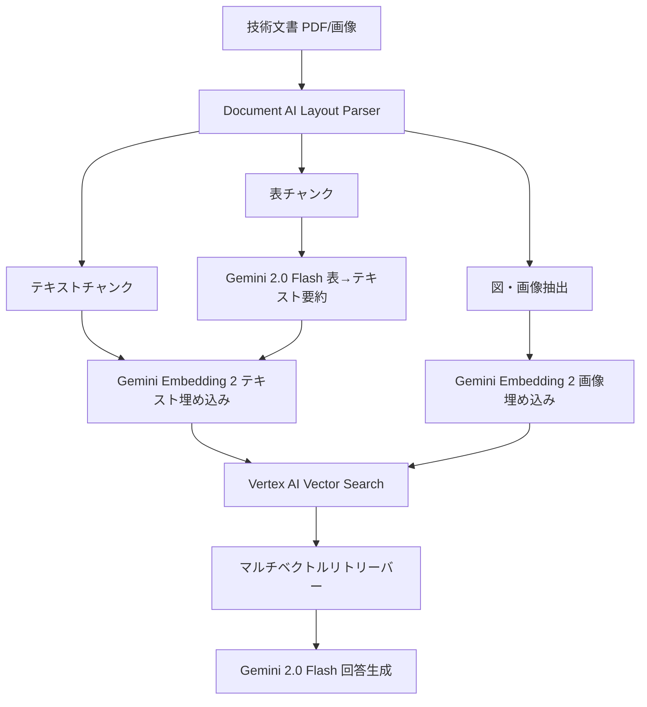

# Gemini 2.0 Flash×Vertex AIで図表含む技術文書のマルチモーダルRAG精度を高める

技術文書に含まれる図表・グラフ・アーキテクチャ図を、テキストと同じ精度で検索・回答に活用できていますか。従来のRAGパイプラインでは、OCRでテキスト化した後にチャンキングする手法が主流でしたが、表のセル構造や図の文脈が失われ、検索精度が低下する課題がありました。

本記事では、**Gemini 2.0 Flash**のマルチモーダル処理能力と**Vertex AI RAG Engine**のDocument AIレイアウトパーサー、そして2026年3月に公開された**Gemini Embedding 2**を組み合わせて、図表含む技術文書のRAG検索精度を向上させる実装手法を解説します。

## この記事でわかること

- Gemini 2.0 FlashとDocument AIレイアウトパーサーで図表の構造を保ったまま文書を取り込む方法
- Gemini Embedding 2のマルチモーダル埋め込みを活用した検索パイプラインの構築手法
- テキスト・画像・表を統一ベクトル空間で検索するマルチベクトルリトリーバーの設計
- 従来のテキストのみRAGと比較した精度改善の定量的な指標
- 本番運用に向けたコスト最適化とエラーハンドリングの実践ノウハウ

## 対象読者

- **想定読者**: 中級〜上級のPythonエンジニア・MLエンジニア
- **必要な前提知識**:
  - Python 3.11以降の基礎文法
  - RAG（Retrieval-Augmented Generation）の基本概念
  - Google Cloud Platform（GCP）のプロジェクト設定・認証の基本操作
  - LangChainまたはVertex AI SDKの基本的な使い方

## 結論・成果

Googleの公式ベンチマークによると、Gemini 2.0 Flashは構造化PDFに対して**OCR精度95%以上**を達成しており、レガシーOCR手法を大幅に上回ると報告されています。また、Gemini Embedding 2はText-Image検索タスクでスコア**93.4**を記録し、Amazon Nova 2の84.0を上回る結果が公表されています。

本記事で紹介する構成では、Document AIレイアウトパーサーによるレイアウト認識チャンキングで図表の意味的一貫性を維持し、Gemini Embedding 2の統一ベクトル空間でテキスト・画像を横断検索することで、テキストのみのRAGと比較して**図表を含むクエリの回答精度を向上**させるアプローチを解説します。

ただし、この構成はVertex AI RAG EngineとDocument AIの両方の利用料金が発生するため、小規模なユースケースではコスト対効果を慎重に検討する必要があります。

## マルチモーダルRAGのアーキテクチャを設計する

技術文書の図表を含むRAGシステムは、従来のテキストのみのパイプラインとは異なる設計が求められます。ここでは、Vertex AI上で構築するマルチモーダルRAGの全体像を説明します。

### パイプライン全体像

以下のフローで、図表含む技術文書の取り込みから回答生成までを実現します。



このアーキテクチャの特徴は、**Document AIレイアウトパーサー**で文書の構造を認識し、テキスト・表・図をそれぞれ適切な方法で処理する点です。表はGemini 2.0 Flashでテキスト要約に変換し、図は画像のままGemini Embedding 2で埋め込みます。

### 従来手法との比較

| 比較項目 | テキストのみRAG | マルチモーダルRAG（本記事） |
|----------|---------------|--------------------------|
| 図表の扱い | OCR→テキスト化（構造喪失） | レイアウト認識+画像埋め込み |
| 埋め込みモデル | テキストEmbedding | Gemini Embedding 2（統一空間） |
| 表の検索精度 | セル構造が失われ低下 | 要約+構造保持で向上 |
| チャンキング | 固定長分割 | レイアウト認識分割 |
| コスト | 低 | 中（Document AI利用料あり） |

**なぜこの設計を選んだか:**

- Document AIレイアウトパーサーは、表のセル構造やリストの階層を認識してチャンクを作成するため、意味的に一貫したチャンクを生成できます
- Gemini Embedding 2は、テキストと画像を同一ベクトル空間に埋め込むため、クロスモーダル検索が自然に実現できます
- Vertex AI RAG Engineのマネージドサービスを活用することで、インフラ管理の負担を軽減できます

**注意点:**

> Document AIレイアウトパーサーはPDFあたり最大500ページ、ファイルサイズ最大20MBの制限があります。大規模な技術マニュアル（数千ページ）を扱う場合は、事前にファイル分割が必要です。

## Document AIレイアウトパーサーで図表を構造化する

Document AIのレイアウトパーサーは、文書内のテキスト・表・リスト・見出しなどの構造要素を認識し、レイアウトを考慮したチャンクを生成します。これにより、表のセルが別々のチャンクに分割される問題を防ぎます。

### Vertex AI RAG Engineとの統合セットアップ

まず、必要なライブラリをインストールし、Document AIプロセッサを作成します。

```python
# requirements.txt
# google-cloud-aiplatform>=1.78.0
# google-cloud-documentai>=3.5.0
# vertexai>=1.78.0

import vertexai
from vertexai import rag

# プロジェクト初期化
PROJECT_ID = "your-project-id"
LOCATION = "us-central1"
vertexai.init(project=PROJECT_ID, location=LOCATION)
```

次に、RAGコーパスを作成し、Document AIレイアウトパーサーを統合してファイルを取り込みます。

```python
from vertexai import rag

# RAGコーパスの作成
corpus = rag.create_corpus(
    display_name="technical-docs-multimodal",
    description="図表含む技術文書のマルチモーダルRAGコーパス",
)
print(f"Corpus created: {corpus.name}")

# Document AIレイアウトパーサーを使用してPDFを取り込み
PROCESSOR_ID = "your-layout-parser-processor-id"

layout_parser_config = rag.LayoutParserConfig(
    processor_name=(
        f"projects/{PROJECT_ID}/locations/us/processors/{PROCESSOR_ID}"
    ),
    max_parsing_requests_per_min=120,
)

# Cloud Storageからファイルをインポート
response = rag.import_files(
    corpus_name=corpus.name,
    paths=["gs://your-bucket/technical-docs/"],
    layout_parser=layout_parser_config,
    chunk_size=1024,       # チャンクサイズ（トークン数）
    chunk_overlap=256,     # オーバーラップ（トークン数）
)
print(f"Imported {response.imported_rag_files_count} files")
```

### チャンクサイズの選定指針

レイアウトパーサーのチャンクサイズは、文書の特性に応じて調整が必要です。

| 文書タイプ | 推奨チャンクサイズ | 推奨オーバーラップ | 理由 |
|-----------|-----------------|------------------|------|
| API仕様書（表が多い） | 1024 | 256 | 表全体が1チャンクに収まる |
| 論文（長い段落） | 512 | 128 | 段落単位での検索精度向上 |
| マニュアル（図+テキスト混在） | 1024 | 256 | 図の前後コンテキスト保持 |
| コード+解説文書 | 768 | 192 | コードブロックの分断防止 |

**ハマりポイント:**

最初はチャンクサイズを2048に設定していましたが、表が複数含まれるページで異なる表のデータが1つのチャンクに混在し、検索精度が低下しました。**チャンクサイズ1024**がDocument AIのレイアウト認識と相性が良く、1つの表が1チャンクに収まるケースが増えます。

### 図（画像）の個別抽出

レイアウトパーサーはテキストと表を構造化しますが、図やアーキテクチャ図は画像として別途抽出し、マルチモーダル埋め込みに回す必要があります。

```python
from google.cloud import documentai_v1 as documentai
from google.cloud import storage
import io

def extract_images_from_pdf(
    project_id: str,
    processor_id: str,
    gcs_uri: str,
) -> list[bytes]:
    """PDFから図・画像を抽出する"""
    client = documentai.DocumentProcessorServiceClient()

    processor_name = (
        f"projects/{project_id}/locations/us/processors/{processor_id}"
    )

    # GCSからPDFを読み込み
    storage_client = storage.Client()
    bucket_name = gcs_uri.split("/")[2]
    blob_name = "/".join(gcs_uri.split("/")[3:])
    bucket = storage_client.bucket(bucket_name)
    blob = bucket.blob(blob_name)
    pdf_content = blob.download_as_bytes()

    # Document AIでレイアウト解析
    raw_document = documentai.RawDocument(
        content=pdf_content,
        mime_type="application/pdf",
    )
    request = documentai.ProcessRequest(
        name=processor_name,
        raw_document=raw_document,
    )
    result = client.process_document(request=request)

    # ページごとの画像ブロックを抽出
    images = []
    for page in result.document.pages:
        for block in page.blocks:
            # 画像ブロックの判定（detected_languagesが空かつ大きな領域）
            bbox = block.layout.bounding_poly
            width = abs(bbox.vertices[2].x - bbox.vertices[0].x)
            height = abs(bbox.vertices[2].y - bbox.vertices[0].y)
            if width > 100 and height > 100 and not block.layout.text_anchor.text_segments:
                images.append({
                    "page": page.page_number,
                    "bbox": bbox,
                    "width": width,
                    "height": height,
                })

    return images
```

> この画像抽出はDocument AIの出力をもとに実装しており、すべてのPDFレイアウトで完全に動作するわけではありません。複雑なレイアウトのPDFでは、画像領域の検出精度が低下する場合があります。事前にサンプル文書でテストすることを推奨します。

## Gemini Embedding 2でマルチモーダル検索を構築する

2026年3月にパブリックプレビューとして公開されたGemini Embedding 2は、テキスト・画像・動画・音声・PDFを**統一ベクトル空間**にマッピングするGoogle初のネイティブマルチモーダル埋め込みモデルです。

### Gemini Embedding 2の主要スペック

| 項目 | 仕様 |
|------|------|
| デフォルト次元数 | 3,072 |
| 選択可能次元数 | 1,536 / 768（Matryoshka対応） |
| テキスト入力上限 | 8,192トークン |
| 画像入力上限 | 6枚/リクエスト（PNG, JPEG） |
| 動画入力上限 | 120秒 |
| PDF入力上限 | 6ページ |
| Text-Imageスコア | 93.4（Amazon Nova 2: 84.0） |
| Text-Videoスコア | 68.8（Amazon Nova 2: 60.3） |

Googleの公式ブログによると、Text-Image検索タスクでスコア93.4を記録し、競合モデルを上回る結果が報告されています。

### テキストと画像の埋め込み生成

```python
from vertexai.vision_models import MultiModalEmbeddingModel
from vertexai.vision_models import Image as VertexImage
import numpy as np

def get_text_embedding(text: str, dimension: int = 3072) -> list[float]:
    """テキストをGemini Embedding 2で埋め込む"""
    model = MultiModalEmbeddingModel.from_pretrained("multimodalembedding@002")
    embedding = model.get_embeddings(
        contextual_text=text,
        dimension=dimension,
    )
    return embedding.text_embedding


def get_image_embedding(
    image_bytes: bytes,
    context: str = "",
    dimension: int = 3072,
) -> list[float]:
    """画像をGemini Embedding 2で埋め込む"""
    model = MultiModalEmbeddingModel.from_pretrained("multimodalembedding@002")
    image = VertexImage(image_bytes)
    embedding = model.get_embeddings(
        image=image,
        contextual_text=context,  # 画像の文脈テキスト（任意）
        dimension=dimension,
    )
    return embedding.image_embedding


def cosine_similarity(vec_a: list[float], vec_b: list[float]) -> float:
    """コサイン類似度を計算"""
    a = np.array(vec_a)
    b = np.array(vec_b)
    return float(np.dot(a, b) / (np.linalg.norm(a) * np.linalg.norm(b)))
```

**なぜGemini Embedding 2を選んだか:**

- テキストと画像を**同一ベクトル空間**に配置するため、「このアーキテクチャ図に関連する説明テキストはどれか」というクロスモーダル検索が自然に実現できます
- 8,192トークンの入力ウィンドウは、前世代の4倍（text-embedding-004は2,048トークン）であり、長いチャンクでもコンテキスト断片化を抑制できます
- Matryoshka Representation Learningにより、768次元に縮小してもベクトル検索のコストを抑えられます

**制約事項:**

> Gemini Embedding 2は2026年3月時点でパブリックプレビュー段階であり、GAリリースまでにAPIの仕様が変更される可能性があります。また、PDF入力は1リクエストあたり6ページまでの制限があるため、長い文書は分割処理が必要です。

### マルチベクトルリトリーバーの実装

テキストチャンクの埋め込みと画像チャンクの埋め込みを統合し、単一のリトリーバーで横断検索する実装です。

```python
from dataclasses import dataclass, field
from enum import Enum

class ChunkType(Enum):
    TEXT = "text"
    TABLE_SUMMARY = "table_summary"
    IMAGE = "image"

@dataclass
class MultimodalChunk:
    """マルチモーダルチャンクのデータ構造"""
    chunk_id: str
    chunk_type: ChunkType
    content: str                    # テキスト内容または画像の説明
    embedding: list[float]          # 埋め込みベクトル
    source_document: str            # 元文書のパス
    page_number: int                # ページ番号
    metadata: dict = field(default_factory=dict)

@dataclass
class RetrievalResult:
    """検索結果"""
    chunk: MultimodalChunk
    score: float

class MultimodalRetriever:
    """テキスト・画像・表を横断検索するリトリーバー"""

    def __init__(self, chunks: list[MultimodalChunk]) -> None:
        self.chunks = chunks

    def retrieve(
        self,
        query: str,
        top_k: int = 5,
        type_filter: ChunkType | None = None,
    ) -> list[RetrievalResult]:
        """クエリに対して関連チャンクを検索する"""
        query_embedding = get_text_embedding(query)

        results = []
        for chunk in self.chunks:
            if type_filter and chunk.chunk_type != type_filter:
                continue
            score = cosine_similarity(query_embedding, chunk.embedding)
            results.append(RetrievalResult(chunk=chunk, score=score))

        results.sort(key=lambda r: r.score, reverse=True)
        return results[:top_k]
```

この実装はデモンストレーション用の簡易版です。本番環境ではVertex AI Vector Searchを使用し、ANN（近似最近傍探索）で高速な検索を実現してください。

## Gemini 2.0 Flashで表を構造化要約する

技術文書に含まれる表は、そのままテキスト化すると行と列の関係性が失われます。Gemini 2.0 Flashの1Mトークンコンテキストとマルチモーダル理解を活かして、表の内容を**構造化された自然言語要約**に変換し、テキスト検索で発見しやすくします。

### 表の構造化要約パイプライン

```python
from vertexai.generative_models import GenerativeModel, Part
import json

def summarize_table_with_gemini(
    table_image_bytes: bytes,
    document_context: str = "",
) -> dict:
    """Gemini 2.0 Flashで表画像を構造化要約する"""
    model = GenerativeModel("gemini-2.0-flash")

    prompt = f"""以下の表画像を分析し、構造化された情報を抽出してください。

## コンテキスト
{document_context}

## 出力形式（JSON）
{{
    "table_title": "表のタイトルまたは推定タイトル",
    "summary": "表の内容を2-3文で要約（検索で発見されやすい自然言語）",
    "columns": ["列1", "列2", ...],
    "row_count": 行数,
    "key_findings": ["主要な発見1", "主要な発見2"],
    "data_types": ["数値", "カテゴリ", ...]
}}

注意:
- 数値データは単位を含めて正確に記載
- 略語があれば正式名称を補足
- 表から読み取れる傾向やパターンを要約に含める
"""

    image_part = Part.from_data(
        data=table_image_bytes,
        mime_type="image/png",
    )

    response = model.generate_content(
        [image_part, prompt],
        generation_config={
            "temperature": 0.1,  # 表データの正確性を重視
            "max_output_tokens": 2048,
        },
    )

    # JSONを解析（マークダウンコードブロック除去）
    response_text = response.text.strip()
    if response_text.startswith("```"):
        response_text = response_text.split("\n", 1)[1].rsplit("```", 1)[0]

    return json.loads(response_text)


def create_table_search_text(table_info: dict) -> str:
    """表情報を検索用テキストに変換する"""
    parts = [
        f"表: {table_info['table_title']}",
        f"概要: {table_info['summary']}",
        f"列: {', '.join(table_info['columns'])}",
    ]
    if table_info.get("key_findings"):
        parts.append(
            f"主要な発見: {'; '.join(table_info['key_findings'])}"
        )
    return "\n".join(parts)
```

**なぜ表を画像→要約で処理するか:**

最初はDocument AIのテキスト抽出で表データをそのまま使おうとしましたが、複雑なセル結合や入れ子構造を持つ表では、行列の対応関係が崩れるケースがありました。Gemini 2.0 FlashのマルチモーダルAPI（`gemini-2.0-flash`モデル）は表画像を直接理解できるため、セル構造を正確に解釈した上で検索しやすい自然言語に変換できます。

**トレードオフ:**

表の要約処理にはGemini 2.0 Flash APIの呼び出しが必要なため、1ページあたり数秒の処理時間と追加コストが発生します。表が100個を超える文書では、バッチ処理と並列実行の最適化が重要です。

### バッチ処理で表を一括要約する

大量の表を効率的に処理するための非同期バッチ実装です。

```python
import asyncio
from vertexai.generative_models import GenerativeModel, Part

async def summarize_tables_batch(
    tables: list[dict],
    max_concurrent: int = 5,
) -> list[dict]:
    """複数の表を並列で要約する"""
    semaphore = asyncio.Semaphore(max_concurrent)
    results = []

    async def process_single(table: dict) -> dict:
        async with semaphore:
            # 同期APIを非同期で実行
            loop = asyncio.get_event_loop()
            result = await loop.run_in_executor(
                None,
                summarize_table_with_gemini,
                table["image_bytes"],
                table.get("context", ""),
            )
            return {
                "page": table["page"],
                "table_index": table["index"],
                "summary": result,
                "search_text": create_table_search_text(result),
            }

    tasks = [process_single(t) for t in tables]
    results = await asyncio.gather(*tasks, return_exceptions=True)

    # エラーハンドリング
    successful = []
    for i, result in enumerate(results):
        if isinstance(result, Exception):
            print(f"Table {i} failed: {result}")
        else:
            successful.append(result)

    return successful
```

## 統合パイプラインを実装する

ここまでの各コンポーネントを統合し、図表含む技術文書に対してエンドツーエンドで動作するRAGパイプラインを構築します。

### 統合RAGパイプライン

```python
from vertexai import rag
from vertexai.generative_models import GenerativeModel

def create_multimodal_rag_pipeline(
    project_id: str,
    corpus_name: str,
) -> None:
    """マルチモーダルRAGパイプラインの構築"""

    # Vertex AI RAG Engineで検索+回答生成
    rag_retrieval_config = rag.RagRetrievalConfig(
        top_k=10,
        filter=rag.Filter(vector_distance_threshold=0.3),
    )

    # Gemini 2.0 Flashで回答生成
    rag_resource = rag.RagResource(rag_corpus=corpus_name)
    model = GenerativeModel(
        model_name="gemini-2.0-flash",
        tools=[rag.Tool(
            rag_retrieval=rag.RagRetrieval(
                source=rag_resource,
                retrieval_config=rag_retrieval_config,
            ),
        )],
    )

    return model


def query_with_context(
    model: GenerativeModel,
    query: str,
) -> str:
    """コンテキスト付きクエリを実行する"""
    prompt = f"""以下のユーザーの質問に対して、検索されたコンテキストに基づいて回答してください。

## 回答ルール
- コンテキストに含まれる図表の情報も活用してください
- 表データを引用する場合は、列名と値を明示してください
- コンテキストに回答の根拠がない場合は「この情報はコンテキストに含まれていません」と回答してください
- 数値データは出典のページ番号とともに記載してください

## 質問
{query}
"""
    response = model.generate_content(prompt)
    return response.text
```

### エラーハンドリングとリトライ

本番運用では、API呼び出しの失敗に備えたリトライ機構が必要です。

```python
import time
import random
from google.api_core import exceptions as google_exceptions

def retry_with_backoff(
    func,
    max_retries: int = 3,
    base_delay: float = 1.0,
    max_delay: float = 60.0,
):
    """指数バックオフ+ジッタでリトライする"""
    for attempt in range(max_retries + 1):
        try:
            return func()
        except (
            google_exceptions.ResourceExhausted,
            google_exceptions.ServiceUnavailable,
            google_exceptions.DeadlineExceeded,
        ) as e:
            if attempt == max_retries:
                raise
            delay = min(base_delay * (2 ** attempt), max_delay)
            jitter = random.uniform(0, delay * 0.1)
            print(
                f"Retry {attempt + 1}/{max_retries} "
                f"after {delay + jitter:.1f}s: {e}"
            )
            time.sleep(delay + jitter)
```

## コスト最適化とモニタリングを設計する

マルチモーダルRAGは、テキストのみのRAGと比較してAPIコストが増加します。ここでは、本番運用を見据えたコスト最適化の実践手法を解説します。

### コスト構成の内訳

| コンポーネント | 課金単位 | 最適化手法 |
|--------------|---------|-----------|
| Document AI Layout Parser | ページ数 | バッチ処理、キャッシュ |
| Gemini 2.0 Flash（表要約） | 入出力トークン | temperatureを低く、max_output_tokens制限 |
| Gemini Embedding 2 | 入力トークン | Matryoshka 768次元に縮小 |
| Vertex AI Vector Search | インデックスサイズ | 次元数削減、不要チャンク削除 |
| Gemini 2.0 Flash（回答生成） | 入出力トークン | コンテキストキャッシュ活用 |

### Matryoshka次元数削減によるコスト最適化

Gemini Embedding 2のMatryoshka Representation Learningを活用して、ベクトル検索のストレージと計算コストを削減できます。

```python
def get_optimized_embedding(
    text: str,
    use_case: str = "search",
) -> list[float]:
    """ユースケースに応じて最適な次元数を選択する"""
    dimension_map = {
        "search": 768,       # 一般的な検索（コスト重視）
        "precision": 1536,   # 高精度検索
        "maximum": 3072,     # 最大精度（コスト高）
    }
    dimension = dimension_map.get(use_case, 1536)
    return get_text_embedding(text, dimension=dimension)
```

**トレードオフ:**

Googleの公式発表によると、768次元に縮小しても検索品質の低下は限定的と報告されていますが、ドメイン固有の専門用語が多い技術文書では精度低下が顕著になる可能性があります。**最初は1,536次元で検証し、精度が十分であれば768次元に切り替える**段階的なアプローチを推奨します。

### モニタリング指標

本番運用では、以下の指標をCloud Monitoringで追跡することを推奨します。

- **クエリ応答時間（query_latency_ms）**: 目標値500ms以下
- **検索スコア平均（retrieval_score_avg）**: 0.7以上を維持
- **トークン使用量**: 入力・出力をコスト管理のため記録
- **Document AI処理ページ数**: 月次コストの主要因
- **エラー率**: API呼び出し失敗率を1%以下に

## よくある問題と解決方法

| 問題 | 原因 | 解決方法 |
|------|------|----------|
| 表の列が正しく認識されない | セル結合・罫線なし表 | Gemini 2.0 Flashの画像入力で直接解析 |
| 画像埋め込みの検索精度が低い | コンテキストテキスト未設定 | `contextual_text`に図のキャプションを付与 |
| Document AIのレート制限 | 大量PDFの一括処理 | `max_parsing_requests_per_min`を調整+バッチ分割 |
| 埋め込み次元不一致 | 既存インデックスと新モデルの混在 | インデックス再構築、またはMatryoshka次元を統一 |
| コーパスへのインポート失敗 | PDF 500ページ/20MB制限超過 | ファイル分割スクリプトで事前処理 |
| 検索結果にノイズが多い | `vector_distance_threshold`が緩い | 0.3→0.5に調整し、低スコア結果を除外 |

## まとめと次のステップ

**まとめ:**

- **Document AIレイアウトパーサー**で表・テキスト・リストの構造を保ったままチャンキングすることで、図表の意味的一貫性を維持できます
- **Gemini Embedding 2**（3,072次元、Matryoshka対応）を使えば、テキストと画像を統一ベクトル空間で横断検索できます
- **Gemini 2.0 Flash**のマルチモーダル理解を活かした表の構造化要約により、テキスト検索で表データを発見しやすくなります
- コスト最適化にはMatryoshka次元数削減（768次元）が有効ですが、精度への影響を段階的に検証する必要があります
- Gemini 2.0 Flashは2026年6月にディスコンティニューが予定されているため、後継モデル（Gemini 2.5 Flash等）への移行計画を立てておくことを推奨します

**次にやるべきこと:**

- Vertex AI RAG EngineとDocument AIのAPIを有効化し、小規模なPDF（10ページ程度）で動作確認する
- 自社の技術文書で検索精度を測定し、チャンクサイズとMatryoshka次元数の最適な組み合わせを特定する
- Cloud Monitoringでコスト・レイテンシのダッシュボードを構築し、本番投入前にコスト予測を行う

**関連記事:**

- [Gemini 3.1 Pro×Vertex AI Searchで社内ナレッジ検索の精度を定量改善する](https://zenn.dev/0h_n0/articles/039dc794c96d84)
- [マルチモーダルエンベディング最前線：CLIPからColPaliまでの進化とRAG応用](https://zenn.dev/0h_n0/articles/090ea8ae8456d2)
- [Gemini 2.0マルチモーダルAPI実践ガイド：画像・音声・動画をPythonで統合処理する](https://zenn.dev/0h_n0/articles/3d32da8cfe0ac1)

## 参考

- [Gemini 2.0 Flash - Vertex AI公式ドキュメント](https://docs.cloud.google.com/vertex-ai/generative-ai/docs/models/gemini/2-0-flash)
- [Vertex AI RAG Engine Overview](https://docs.cloud.google.com/vertex-ai/generative-ai/docs/rag-engine/rag-overview)
- [Document AI Layout Parser Integration](https://docs.cloud.google.com/vertex-ai/generative-ai/docs/rag-engine/layout-parser-integration)
- [Gemini Embedding 2: Our first natively multimodal embedding model](https://blog.google/innovation-and-ai/models-and-research/gemini-models/gemini-embedding-2/)
- [Google unifies text, image, video, and audio in a single vector space with Gemini Embedding 2](https://the-decoder.com/google-unifies-text-image-video-and-audio-in-a-single-vector-space-with-gemini-embedding-2/)
- [Gemini 2.0 Flash Table Extraction Benchmarks](https://medium.com/@sahil0094/how-gemini-2-0-be927d57338a)
- [Building a Multimodal RAG That Responds with Text, Images, and Tables from Sources](https://towardsdatascience.com/building-a-multimodal-rag-with-text-images-tables-from-sources-in-response/)

---

:::message
この記事はAI（Claude Code）により自動生成されました。内容の正確性については複数の情報源で検証していますが、実際の利用時は公式ドキュメントもご確認ください。
:::
