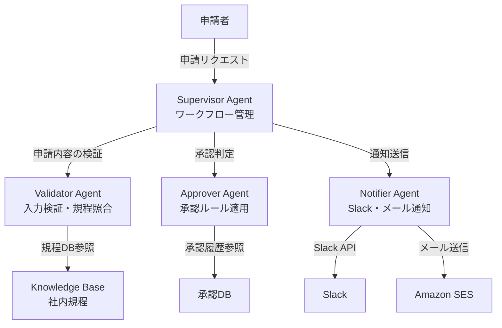
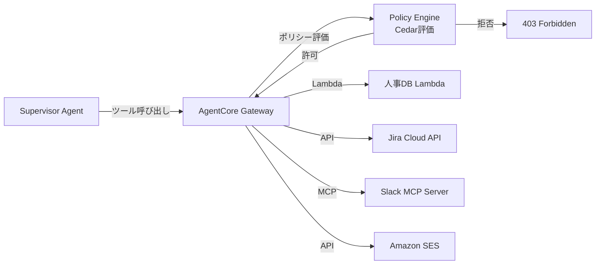
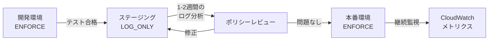

# Bedrock AgentCore Policyで社内申請ワークフローを自動化するマルチエージェント設計

## この記事でわかること

- Amazon Bedrock AgentCoreのSupervisor/Collaboratorパターンで**社内申請ワークフロー**を設計する方法
- AgentCore Policyの**Cedar言語**による宣言的アクセス制御でエージェントのツール呼び出しを制限する仕組み
- Strands Agents SDKの「Agent as Tool」パターンで**申請受付・承認判定・通知**の3エージェントを協調させる実装例
- Gateway経由のMCPサーバー統合で**社内システム（Slack・Jira・人事DB）と安全に連携**する構成
- `LOG_ONLY` → `ENFORCE`の**段階的ポリシー導入**で本番環境の安全性を担保する運用戦略

## 対象読者

- **想定読者**: 中級〜上級のAWSユーザーで、AIエージェントを業務自動化に活用したいエンジニア・アーキテクト
- **必要な前提知識**:
  - AWS Bedrockの基本操作（マネジメントコンソールまたはCLI）
  - Python 3.12以上の基礎文法
  - IAMロール・ポリシーの基本概念
  - エージェントAIの基本的な仕組み（LLM + ツール呼び出し）

## 結論・成果

AgentCore Policyとマルチエージェント協調を組み合わせることで、社内申請ワークフローの自動化が実現できます。Cedarポリシーによるインフラ層での制御により、エージェントのツール呼び出しを**デフォルト拒否・forbid優先**の原則で統制し、セキュリティ監査に対応できる水準のアクセス制御を構築できます。AWS公式ブログでは、AgentCore Policyを用いたエージェント制御の具体的なパターンが紹介されています。

ただし、すべての申請が自動化対象になるわけではありません。例外的な判断が必要なケースや、金額が一定額を超える場合には**人間の承認を必須とするエスカレーション**が求められます。本記事では、そうした制約も含めた設計を解説します。

## マルチエージェント協調のアーキテクチャを設計する

社内申請ワークフローは「受付 → 検証 → 承認判定 → 通知」の段階を踏みます。これを単一エージェントで処理すると、プロンプトが肥大化し、ツール権限の分離が困難になります。マルチエージェント構成にすることで、**責務の分離**と**最小権限の原則**を同時に実現できます。

### Supervisor/Collaboratorパターンの全体像

Amazon Bedrock AgentCoreでは、**Supervisorエージェント**が中央のオーケストレーターとして機能し、複数の**Collaboratorエージェント**にタスクを委譲します。公式ドキュメントによると、Supervisor modeとSupervisor with routing modeの2つが提供されています。



各エージェントの役割を次の表に整理します。

| エージェント | 役割 | アクセスするツール | 必要な権限 |
|---|---|---|---|
| **Supervisor** | リクエストの分類と全体制御 | なし（サブエージェントへの委譲のみ） | 最小限 |
| **Validator** | 申請内容の形式検証・社内規程との照合 | Knowledge Base（社内規程）、人事DB参照 | 読み取りのみ |
| **Approver** | 承認ルールの適用・金額チェック・上長エスカレーション | 承認DB（読み書き）、Jira API | 読み書き |
| **Notifier** | 承認結果のSlack通知・メール送信 | Slack API、Amazon SES | 書き込みのみ |

**なぜこの分離を選んだか:**
- 各エージェントのツール権限を最小化できるため、Policyによる制御がシンプルになる
- Validatorがデータ書き込みをしない設計にすることで、検証フェーズでの意図しないデータ変更を防止できる
- 通知エージェントを分離することで、承認ロジックと通知ロジックの変更が独立する

**注意点:**
> Supervisor with routing modeは単純なリクエスト（例: ステータス確認）をサブエージェントに直接転送するため高速ですが、**複数エージェントを連鎖的に呼び出す必要があるワークフローにはSupervisor modeが適しています**。申請処理のように「検証 → 承認 → 通知」の順序が重要な場合は、Supervisor modeを使いましょう。

### Strands Agents SDKでAgent as Toolパターンを実装する

Strands Agents SDKでは、各Collaboratorエージェントを `@tool` デコレーターでラップし、Supervisorエージェントのツールとして登録します。これにより、Supervisorは自然言語の推論でどのエージェントを呼び出すか判断できます。

```python
# workflow_agents.py
from strands import Agent, tool
from strands.models.bedrock import BedrockModel


# --- Collaborator 1: 申請内容の検証 ---
validator_agent = Agent(
    model=BedrockModel(model_id="anthropic.claude-sonnet-4-20250514"),
    system_prompt="""あなたは社内申請の検証担当です。
    申請内容の形式チェックと社内規程との照合を行います。
    - 必須項目（申請者名、部署、金額、理由）の欠落チェック
    - 金額の妥当性チェック（部署別の上限確認）
    - 社内規程との整合性確認
    結果を JSON 形式で返してください。""",
    tools=["knowledge_base_lookup", "hr_db_read"],
)


@tool
def validate_application(
    applicant: str,
    department: str,
    amount: int,
    reason: str,
    category: str,
) -> str:
    """社内申請の内容を検証し、規程との整合性を確認します。

    Args:
        applicant: 申請者名
        department: 所属部署
        amount: 申請金額（円）
        reason: 申請理由
        category: 申請カテゴリ（travel/equipment/training）
    """
    prompt = (
        f"以下の申請を検証してください:\n"
        f"申請者: {applicant}, 部署: {department}\n"
        f"金額: {amount}円, カテゴリ: {category}\n"
        f"理由: {reason}"
    )
    result = validator_agent(prompt)
    return result.message


# --- Collaborator 2: 承認判定 ---
approver_agent = Agent(
    model=BedrockModel(model_id="anthropic.claude-sonnet-4-20250514"),
    system_prompt="""あなたは承認判定の担当です。
    検証済みの申請に対して承認ルールを適用します。
    - 50万円未満: 自動承認
    - 50万円以上200万円未満: 部長承認が必要（エスカレーション）
    - 200万円以上: 役員承認が必要（エスカレーション）
    自動承認の場合は承認DBに記録し、エスカレーションの場合はJiraチケットを作成します。""",
    tools=["approval_db_write", "jira_create_ticket"],
)


@tool
def judge_approval(
    validation_result: str,
    amount: int,
    department: str,
) -> str:
    """検証済み申請に承認ルールを適用し、承認または上長エスカレーションを判定します。

    Args:
        validation_result: Validator Agentの検証結果JSON
        amount: 申請金額（円）
        department: 所属部署
    """
    prompt = (
        f"以下の検証結果に基づき承認判定してください:\n"
        f"検証結果: {validation_result}\n"
        f"金額: {amount}円, 部署: {department}"
    )
    result = approver_agent(prompt)
    return result.message


# --- Collaborator 3: 通知 ---
notifier_agent = Agent(
    model=BedrockModel(model_id="anthropic.claude-sonnet-4-20250514"),
    system_prompt="""あなたは通知担当です。
    承認結果を申請者と関係者に通知します。
    - 自動承認: Slackで申請者に結果通知
    - エスカレーション: Slackで承認者に依頼通知、申請者にステータス通知
    - 却下: メールで申請者に理由付き通知""",
    tools=["slack_post_message", "ses_send_email"],
)


@tool
def send_notification(
    approval_result: str,
    applicant: str,
    approver_email: str,
) -> str:
    """承認結果を関係者に通知します。

    Args:
        approval_result: Approver Agentの承認判定結果
        applicant: 申請者名
        approver_email: 承認者のメールアドレス
    """
    prompt = (
        f"以下の承認結果を通知してください:\n"
        f"結果: {approval_result}\n"
        f"申請者: {applicant}, 承認者: {approver_email}"
    )
    result = notifier_agent(prompt)
    return result.message


# --- Supervisor Agent ---
supervisor = Agent(
    model=BedrockModel(model_id="anthropic.claude-sonnet-4-20250514"),
    system_prompt="""あなたは社内申請ワークフローの管理者です。
    申請リクエストを受け取り、以下の手順で処理します:
    1. validate_application で申請内容を検証
    2. 検証OKなら judge_approval で承認判定
    3. 承認判定の結果を send_notification で関係者に通知
    各ステップの結果を確認し、エラーがあれば適切に処理してください。""",
    tools=[validate_application, judge_approval, send_notification],
)
```

このコードの重要なポイントは、**Supervisorエージェント自身はツールに直接アクセスせず、Collaboratorエージェントをツールとして呼び出す**点です。この構造により、後述するAgentCore Policyで各エージェントの権限を個別に制御できます。

## AgentCore PolicyでCedarポリシーを設計する

AgentCore Policyは、エージェントのツール呼び出しを**インフラ層で制御**する仕組みです。2026年3月にGA（一般提供）となり、13のAWSリージョンで利用可能です。ポリシーはCedar言語で記述し、AgentCore Gatewayがすべてのツール呼び出しをインターセプトして評価します。

### Cedarの3原則を理解する

Cedarは以下の3つの原則で動作します。

| 原則 | 説明 | 実務上の意味 |
|---|---|---|
| **デフォルト拒否** | 明示的に許可されていないアクションはすべてブロック | ポリシーを書かなければ何もできない |
| **forbidが常に優先** | forbidとpermitが競合する場合、forbidが勝つ | 安全側に倒れる設計 |
| **最低1つのpermitが必要** | アクションを実行するには、少なくとも1つのpermitポリシーが必要 | 過剰許可を防ぐ |

この「デフォルト拒否 + forbid優先」の原則は、IAMポリシーの設計思想と共通しています。IAMに慣れているAWSユーザーにとっては、直感的に理解できるでしょう。

### 申請ワークフロー向けCedarポリシーの実装

以下に、社内申請ワークフローで使用するCedarポリシーの例を示します。AWSの公式ドキュメントのパターンを参考に、ワークフロー向けにカスタマイズしています。AgentCore PolicyのCedarスキーマでは、プリンシパル（認証主体）として`AgentCore::OAuthUser`を使用し、OAuthトークンに含まれるタグ（カスタムクレーム）でエージェントの役割を識別します。

**Validatorエージェントのポリシー（読み取りのみ許可）:**

```cedar
// Validator Agent: Knowledge Baseと人事DBの読み取りのみ許可
permit(
    principal is AgentCore::OAuthUser,
    action in [
        AgentCore::Action::"WorkflowGateway__knowledge_base_lookup",
        AgentCore::Action::"WorkflowGateway__hr_db_read"
    ],
    resource == AgentCore::Gateway::"arn:aws:bedrock-agentcore:ap-northeast-1:123456789012:gateway/workflow"
) when {
    principal.hasTag("role") &&
    principal.getTag("role") == "validator"
};

// Validator Agent: 書き込み系ツールを明示的に禁止
forbid(
    principal is AgentCore::OAuthUser,
    action in [
        AgentCore::Action::"WorkflowGateway__approval_db_write",
        AgentCore::Action::"WorkflowGateway__jira_create_ticket",
        AgentCore::Action::"WorkflowGateway__slack_post_message",
        AgentCore::Action::"WorkflowGateway__ses_send_email"
    ],
    resource == AgentCore::Gateway::"arn:aws:bedrock-agentcore:ap-northeast-1:123456789012:gateway/workflow"
) when {
    principal.hasTag("role") &&
    principal.getTag("role") == "validator"
};
```

**Approverエージェントのポリシー（金額条件付き承認）:**

```cedar
// Approver Agent: 50万円未満の申請は自動承認を許可
permit(
    principal is AgentCore::OAuthUser,
    action == AgentCore::Action::"WorkflowGateway__approval_db_write",
    resource == AgentCore::Gateway::"arn:aws:bedrock-agentcore:ap-northeast-1:123456789012:gateway/workflow"
) when {
    principal.hasTag("role") &&
    principal.getTag("role") == "approver" &&
    context.input has amount &&
    context.input.amount < 500000
};

// Approver Agent: 50万円以上はJiraチケット作成（エスカレーション）のみ許可
permit(
    principal is AgentCore::OAuthUser,
    action == AgentCore::Action::"WorkflowGateway__jira_create_ticket",
    resource == AgentCore::Gateway::"arn:aws:bedrock-agentcore:ap-northeast-1:123456789012:gateway/workflow"
) when {
    principal.hasTag("role") &&
    principal.getTag("role") == "approver" &&
    context.input has amount &&
    context.input.amount >= 500000
};
```

**Notifierエージェントのポリシー（通知のみ許可）:**

```cedar
// Notifier Agent: Slack通知とメール送信のみ許可
permit(
    principal is AgentCore::OAuthUser,
    action in [
        AgentCore::Action::"WorkflowGateway__slack_post_message",
        AgentCore::Action::"WorkflowGateway__ses_send_email"
    ],
    resource == AgentCore::Gateway::"arn:aws:bedrock-agentcore:ap-northeast-1:123456789012:gateway/workflow"
) when {
    principal.hasTag("role") &&
    principal.getTag("role") == "notifier"
};

// Notifier Agent: DB操作を明示的に禁止
forbid(
    principal is AgentCore::OAuthUser,
    action in [
        AgentCore::Action::"WorkflowGateway__approval_db_write",
        AgentCore::Action::"WorkflowGateway__hr_db_read",
        AgentCore::Action::"WorkflowGateway__knowledge_base_lookup"
    ],
    resource == AgentCore::Gateway::"arn:aws:bedrock-agentcore:ap-northeast-1:123456789012:gateway/workflow"
) when {
    principal.hasTag("role") &&
    principal.getTag("role") == "notifier"
};
```

**よくある間違い:** 最初はpermitポリシーのみで十分だと考えがちですが、LLMが予期しないツール呼び出しをする可能性があるため、**forbidポリシーで明示的にブロックする多層防御**が重要です。デフォルト拒否があるのになぜforbidが必要かというと、将来的にpermitポリシーが追加された際に意図しない権限拡大を防ぐためです。

### 自然言語によるポリシー記述

Cedarの構文に不慣れなセキュリティチーム向けに、AgentCore Policyは**自然言語からCedarへの自動変換**をサポートしています。

```text
入力例:
「検証エージェントは社内規程データベースの読み取りのみ許可する。
 書き込み系のツール（承認DB、Jira、Slack、メール）へのアクセスは禁止する。」
```

自然言語で記述したポリシーは、サービス側でCedar構文に変換され、スキーマに対するバリデーションと自動推論（過剰許可・過剰制限の検出）が実行されます。AWS公式ドキュメントによると、生成されたCedarポリシーはレビュー用に表示されるため、**変換結果を確認してからデプロイ**できます。

## AgentCore Gatewayで社内システムと安全に連携する

AgentCore Gatewayは、エージェントと外部ツールの間に位置するプロキシ層です。Lambda関数やAPIエンドポイント、MCPサーバーを**エージェント互換のツール**として統合し、ポリシーエンジンでアクセス制御を適用します。

### Gatewayの構成と接続先



Gatewayの設定はAWS CLIまたはSDKで行います。以下は、Gateway作成の基本的な例です。`bedrock-agentcore-control`クライアントを使用し、`roleArn`（サービスロール）と`authorizerType`（認証方式）の指定が必須です。

```python
# gateway_setup.py
import boto3

client = boto3.client("bedrock-agentcore-control", region_name="ap-northeast-1")

# Gateway作成
gateway = client.create_gateway(
    name="workflow-gateway",
    roleArn="arn:aws:iam::123456789012:role/AgentCoreGatewayRole",
    protocolType="MCP",
    authorizerType="CUSTOM_JWT",
    authorizerConfiguration={
        "customJWTAuthorizer": {
            "discoveryUrl": "https://cognito-idp.ap-northeast-1.amazonaws.com/<user-pool-id>/.well-known/openid-configuration",
            "allowedClients": ["workflow-agent-client"],
        }
    },
)

gateway_id = gateway["gatewayId"]
print(f"Gateway作成完了: {gateway_id}")
print(f"Gateway URL: {gateway['gatewayUrl']}")
```

**注意点:**
> Gateway作成後、MCPサーバーをターゲットとして追加する際は`CreateGatewayTarget` APIを使用します。MCPサーバー側でツールが追加・変更された場合は、`SynchronizeGatewayTargets` APIを明示的に呼び出して再同期する必要があります。MCPプロトコルバージョンは`2025-06-18`または`2025-03-26`がサポートされています。

### ポリシーをGatewayに適用する

作成したCedarポリシーをGatewayに紐づけることで、すべてのツール呼び出しがポリシーエンジンで評価されるようになります。

```python
# policy_setup.py
import boto3

client = boto3.client("bedrock-agentcore-control", region_name="ap-northeast-1")

# ポリシーエンジンの作成
engine = client.create_policy_engine(
    name="workflow-policy-engine",
    description="申請ワークフロー用ポリシーエンジン",
)

engine_id = engine["policyEngineId"]

# Cedarポリシーの追加（Validatorエージェント用）
cedar_statement = (
    'permit('
    '    principal is AgentCore::OAuthUser,'
    '    action in ['
    '        AgentCore::Action::"WorkflowGateway__knowledge_base_lookup",'
    '        AgentCore::Action::"WorkflowGateway__hr_db_read"'
    '    ],'
    '    resource == AgentCore::Gateway::"arn:aws:bedrock-agentcore:ap-northeast-1:123456789012:gateway/workflow"'
    ') when {'
    '    principal.hasTag("role") &&'
    '    principal.getTag("role") == "validator"'
    '};'
)

client.create_policy(
    policyEngineId=engine_id,
    name="validator-read-only",
    validationMode="FAIL_ON_ANY_FINDINGS",
    description="Validator: 読み取り専用アクセス",
    definition={
        "cedar": {
            "statement": cedar_statement,
        }
    },
)

print(f"ポリシーエンジン作成完了: {engine_id}")
```

## 段階的にポリシーを本番導入する

AgentCore Policyの強力な機能の一つが、**`LOG_ONLY`モード**と**`ENFORCE`モード**の切り替えです。本番環境に一気に`ENFORCE`モードで適用すると、正当なリクエストまでブロックしてしまうリスクがあります。

### 段階的導入のフロー



| フェーズ | モード | 目的 | 期間目安 |
|---|---|---|---|
| 開発・テスト | `ENFORCE` | ポリシーの動作確認 | 1-2週間 |
| ステージング | `LOG_ONLY` | 実トラフィックでの影響分析 | 1-2週間 |
| 本番初期 | `ENFORCE`（段階的） | クリティカルなポリシーから順次適用 | 1-2週間 |
| 本番安定期 | `ENFORCE` | 全ポリシー適用・継続監視 | 継続 |

**ハマりポイント:** `LOG_ONLY`モードではポリシー違反をブロックせずCloudWatchに記録するだけなので、**ログを確認せずに`ENFORCE`モードに切り替えると、意図しないブロックが発生**します。`LOG_ONLY`モードで十分なログ分析を行ってから`ENFORCE`に移行することが推奨されています。

### CloudWatchによるポリシー評価の監視

AgentCore PolicyはCloudWatchと統合されており、以下のメトリクスを監視できます。

```python
# monitoring.py
import boto3

cloudwatch = boto3.client("cloudwatch", region_name="ap-northeast-1")

# ポリシー拒否数のアラーム設定
cloudwatch.put_metric_alarm(
    AlarmName="AgentCore-PolicyDenied-High",
    Namespace="Bedrock-Agentcore",
    MetricName="DenyDecisions",
    Dimensions=[
        {"Name": "GatewayId", "Value": "workflow-gateway-id"},
    ],
    Statistic="Sum",
    Period=300,
    EvaluationPeriods=1,
    Threshold=10,
    ComparisonOperator="GreaterThanThreshold",
    AlarmActions=["arn:aws:sns:ap-northeast-1:123456789012:ops-alerts"],
    AlarmDescription="5分間でポリシー拒否が10件を超えた場合にアラート",
)
```

AgentCoreの組み込み評価器（Evaluations）は13種類あり、ツール選択精度（tool selection accuracy）やヘルプフルネス（helpfulness）などをリアルタイムで計測できます。カスタム評価器を追加することで、**承認判定の正確性**や**通知内容の適切性**といった業務固有のメトリクスも計測可能です。

## よくある問題と解決方法

| 問題 | 原因 | 解決方法 |
|---|---|---|
| Supervisorがサブエージェントを呼び出さない | system_promptでの役割記述が曖昧 | 各Collaboratorの呼び出し条件を明示的に記述する |
| Policyで正当なリクエストがブロックされる | Cedar条件が厳しすぎる、またはタグ設定の不備 | `LOG_ONLY`モードでログを分析し、条件を調整する |
| Gateway経由のMCPサーバー接続タイムアウト | MCPサーバーのレスポンスが遅い | Gatewayのタイムアウト設定を延長、MCP側の性能改善 |
| 承認金額の判定が正しくない | LLMが金額をテキストとして処理し数値比較が不正確 | Cedarポリシーで金額閾値を制御し、LLMの判定に依存しない |
| エスカレーションのJiraチケットが重複作成される | リトライ時に冪等性が担保されていない | Jira APIの `idempotencyKey` パラメータを活用する |

**制約条件:** 本記事の構成は申請カテゴリが限定的（travel/equipment/training）な場合に有効です。申請カテゴリが数十種類に及ぶ大規模組織では、Cedarポリシーの管理が複雑になるため、**ポリシーテンプレートの自動生成**や**ポリシーの階層化**を検討する必要があります。

## まとめと次のステップ

**まとめ:**
- Bedrock AgentCoreの**Supervisor/Collaboratorパターン**で社内申請ワークフローを「受付・検証・承認・通知」の4エージェントに分離し、責務と権限を明確化できる
- AgentCore Policyの**Cedarポリシー**により、各エージェントのツールアクセスをインフラ層で制御し、デフォルト拒否・forbid優先の原則で安全性を担保できる
- **`LOG_ONLY` → `ENFORCE`**の段階的導入で、本番環境での予期しないブロックを防止しつつ、ポリシーの最適化を進められる
- Strands Agents SDKの**Agent as Toolパターン**で、エージェント間の協調をPythonコードで宣言的に記述できる
- AgentCore Gatewayの**MCPサーバー統合**で、Slack・Jira等の社内ツールと安全に連携できる

**次にやるべきこと:**
- [AgentCore公式ドキュメント](https://docs.aws.amazon.com/bedrock-agentcore/latest/devguide/policy.html)でCedarポリシーの全構文を確認する
- [Strands Agents SDKのサンプルリポジトリ](https://github.com/strands-agents/samples)でマルチエージェント実装のパターンを試す
- 自社の申請ワークフローを棚卸しし、自動化可能な申請カテゴリを特定する

## 参考

- [Amazon Bedrock AgentCore 公式ドキュメント - Policy](https://docs.aws.amazon.com/bedrock-agentcore/latest/devguide/policy.html)
- [AgentCore Policy GA発表（2026年3月）](https://aws.amazon.com/about-aws/whats-new/2026/03/policy-amazon-bedrock-agentcore-generally-available/)
- [Cedar ポリシー例 - Amazon Bedrock AgentCore](https://docs.aws.amazon.com/bedrock-agentcore/latest/devguide/example-policies.html)
- [Multi-agent collaboration - Amazon Bedrock](https://docs.aws.amazon.com/bedrock/latest/userguide/agents-multi-agent-collaboration.html)
- [Strands Agents SDK - GitHub](https://github.com/strands-agents/sdk-python)
- [Strands マルチエージェント例](https://strandsagents.com/latest/documentation/docs/examples/python/multi_agent_example/multi_agent_example/)
- [ポリシー適用モード（LOG_ONLY / ENFORCE）](https://docs.aws.amazon.com/bedrock-agentcore/latest/devguide/policy-enforcement-modes.html)
- [AgentCore Gateway - MCP Server統合](https://docs.aws.amazon.com/bedrock-agentcore/latest/devguide/gateway-target-MCPservers.html)
- [Secure AI agents with Policy in Amazon Bedrock AgentCore](https://aws.amazon.com/blogs/machine-learning/secure-ai-agents-with-policy-in-amazon-bedrock-agentcore/)
- [AWS Bedrock AgentCore Policy and Evaluations: Governing AI Agents at Scale](https://sjramblings.io/bedrock-agentcore-policy-evaluations/)

---

:::message
この記事はAI（Claude Code）により自動生成されました。内容の正確性については複数の情報源で検証していますが、実際の利用時は公式ドキュメントもご確認ください。
:::
