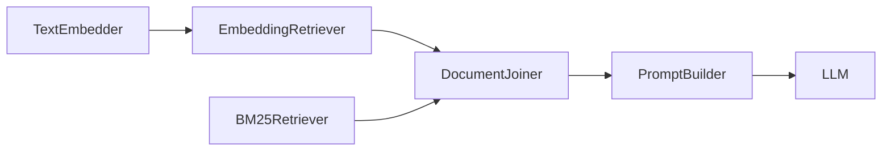

# Haystack 2.xのQAパイプラインを本番運用する：カスタムComponent・非同期実行・監視まで

## この記事でわかること

- Haystack 2.xのカスタムComponentを作成し、独自のビジネスロジックをパイプラインに組み込む方法
- AsyncPipelineによる並列実行でQAパイプラインのレスポンスタイムを短縮する手法
- OpenTelemetryを使ったパイプラインの分散トレーシングとボトルネック特定
- Hayhooksを使ったREST API化と本番デプロイのアーキテクチャ
- SuperComponentによるパイプラインのモジュール化と再利用パターン

## 対象読者

- **想定読者**: 中級〜上級のPythonエンジニアで、Haystack 2.xの基本的なパイプライン構築経験がある方
- **必要な前提知識**:
  - Python 3.10以降の非同期処理（async/await）の基本
  - Haystack 2.xのPipeline・Componentの基本概念（`add_component`、`connect`、`run`）
  - REST APIの基本（FastAPI経験があると理解しやすい）
  - Docker / Kubernetesの基礎知識（デプロイセクション）

:::message
この記事はHaystack 2.xのQAパイプラインを「本番で使える状態」にすることに焦点を当てています。基本的なQAパイプラインの構築方法については、関連記事「[Haystack 2.xで構築するQAパイプライン：抽出型・生成型・評価まで実装する](https://zenn.dev/0h_n0/articles/0431347d523ad6)」を参照してください。
:::

## 結論・成果

Haystack 2.xのパイプラインを本番運用するには、**カスタムComponentによるビジネスロジックの組み込み**、**AsyncPipelineによる並列実行**、**OpenTelemetryによる可観測性の確保**、**Hayhooksによるデプロイ**の4つの要素が必要です。

deepset社のベンチマーク記事によると、パラメータチューニング（Embeddingモデル選択・top_k・chunk_size）を適切に行うことで**Semantic Answer Similarity（SAS）スコア0.686、Context Relevance 0.945、Faithfulness 0.937**を達成した構成が報告されています。AsyncPipelineを使えば、ハイブリッド検索パイプラインで複数Retrieverを並列実行できるため、逐次実行と比較してI/O待ちの削減が期待できます。

ただし、AsyncPipelineのOpenTelemetryコンテキスト伝搬には既知の課題（GitHub Issue #8864）があり、トレーシング導入時には注意が必要です。

## カスタムComponentを作成してビジネスロジックを組み込む

Haystack 2.xでは`@component`デコレータを使って、任意のPythonクラスをパイプラインのComponentとして利用できます。本番QAシステムでは、回答のフィルタリング・ログ記録・後処理など、ビジネス固有の処理が必要になる場面が多くあります。ここでは、実際の運用で役立つカスタムComponentの実装パターンを見ていきます。

### カスタムComponentの基本構造を理解する

カスタムComponentに必要な要素は3つです。`@component`デコレータ、`run()`メソッド、そして`@component.output_types`による出力型の宣言です。

```python
# components/answer_filter.py
from haystack import component, Document
from typing import List, Optional


@component
class AnswerConfidenceFilter:
    """信頼度スコアに基づいて回答をフィルタリングするComponent"""

    def __init__(self, min_confidence: float = 0.5, max_results: int = 3):
        self.min_confidence = min_confidence
        self.max_results = max_results

    @component.output_types(
        filtered_documents=List[Document],
        dropped_count=int
    )
    def run(
        self,
        documents: List[Document],
        query: Optional[str] = None
    ) -> dict:
        original_count = len(documents)

        # スコアでフィルタリング
        filtered = [
            doc for doc in documents
            if doc.score is not None and doc.score >= self.min_confidence
        ]

        # スコア降順でソートし、上位N件を返す
        filtered.sort(key=lambda d: d.score or 0.0, reverse=True)
        filtered = filtered[: self.max_results]

        return {
            "filtered_documents": filtered,
            "dropped_count": original_count - len(filtered),
        }
```

**なぜこの実装か:**
- `@component.output_types`で出力型を明示することで、パイプライン接続時に型チェックが効く
- `Optional`パラメータを使うことで、同じComponentを異なるパイプライン構成で再利用できる
- フィルタリングした件数（`dropped_count`）を出力に含めることで、後段のログ記録Componentで活用できる

**注意点:**
> 公式ドキュメントによると、`run()`メソッド内で入力引数を直接変更してはいけません。`dataclasses.replace()`やリストのコピーを使って、副作用を防ぐ必要があります。これはパイプラインが同じオブジェクトを複数のComponentに渡す場合があるためです。

### warm_up()で重い初期化を分離する

モデルのロードやデータベース接続など、時間のかかる初期化処理は`warm_up()`メソッドに分離します。`warm_up()`はパイプラインの初回実行前に1回だけ呼ばれるため、リクエストごとの遅延を防げます。

```python
# components/semantic_reranker.py
from haystack import component, Document
from typing import List
import logging

logger = logging.getLogger(__name__)


@component
class LocalSemanticReranker:
    """ローカルモデルでリランキングを行うComponent"""

    def __init__(self, model_name: str = "cross-encoder/ms-marco-MiniLM-L-6-v2"):
        self.model_name = model_name
        self._model = None  # warm_up()で初期化

    def warm_up(self) -> None:
        """パイプライン初回実行前にモデルをロードする"""
        if self._model is None:
            from sentence_transformers import CrossEncoder
            logger.info("Loading reranker model: %s", self.model_name)
            self._model = CrossEncoder(self.model_name)
            logger.info("Reranker model loaded successfully")

    @component.output_types(documents=List[Document])
    def run(self, documents: List[Document], query: str) -> dict:
        if self._model is None:
            raise RuntimeError(
                "Model not loaded. Call warm_up() or run the component "
                "within a Pipeline."
            )

        # query と各ドキュメントのペアでスコアを計算
        pairs = [(query, doc.content or "") for doc in documents]
        scores = self._model.predict(pairs)

        # スコアを付与して降順ソート
        for doc, score in zip(documents, scores):
            doc.score = float(score)

        reranked = sorted(documents, key=lambda d: d.score or 0.0, reverse=True)
        return {"documents": reranked}
```

`warm_up()`を使うことで、パイプライン起動時にモデルロード（数秒〜数十秒）が完了し、各リクエストでは推論処理のみが実行されます。最初に`warm_up()`を忘れてデプロイしたところ、初回リクエストでタイムアウトが発生したという経験から、必ずパイプラインの`warm_up()`を呼ぶようにしています。

### カスタムComponentをパイプラインに組み込む

作成したComponentを既存のQAパイプラインに統合してみましょう。

```python
# pipeline_with_custom.py
from haystack import Pipeline
from haystack.components.embedders import SentenceTransformersTextEmbedder
from haystack.components.retrievers.in_memory import InMemoryEmbeddingRetriever
from haystack.document_stores.in_memory import InMemoryDocumentStore
from haystack.components.builders import ChatPromptBuilder
from haystack.components.generators.chat import OpenAIChatGenerator
from haystack.dataclasses import ChatMessage

# カスタムComponentをインポート
from components.answer_filter import AnswerConfidenceFilter
from components.semantic_reranker import LocalSemanticReranker

document_store = InMemoryDocumentStore()

pipeline = Pipeline()

# 標準Component
pipeline.add_component(
    "embedder",
    SentenceTransformersTextEmbedder(
        model="sentence-transformers/all-MiniLM-L6-v2"
    ),
)
pipeline.add_component(
    "retriever",
    InMemoryEmbeddingRetriever(document_store=document_store, top_k=10),
)

# カスタムComponent
pipeline.add_component(
    "reranker",
    LocalSemanticReranker(model_name="cross-encoder/ms-marco-MiniLM-L-6-v2"),
)
pipeline.add_component(
    "filter",
    AnswerConfidenceFilter(min_confidence=0.3, max_results=5),
)

# 回答生成
template = [
    ChatMessage.from_system("あなたは質問に答えるアシスタントです。"),
    ChatMessage.from_user(
        "以下のコンテキストに基づいて質問に答えてください。\n"
        "コンテキスト:\n"
        "{{ doc.content }}\n\n"
        "質問: {{ query }}"
    ),
]
pipeline.add_component("prompt", ChatPromptBuilder(template=template))
pipeline.add_component("llm", OpenAIChatGenerator(model="gpt-4o"))

# 接続
pipeline.connect("embedder.embedding", "retriever.query_embedding")
pipeline.connect("retriever.documents", "reranker.documents")
pipeline.connect("reranker.documents", "filter.documents")
pipeline.connect("filter.filtered_documents", "prompt.documents")
pipeline.connect("prompt.prompt", "llm.messages")
```

パイプライン全体の処理フローを図にすると、以下のようになります。


## AsyncPipelineで並列実行してレスポンスタイムを短縮する

本番環境では、複数のRetrieverを同時に実行するハイブリッド検索が一般的です。Haystack 2.xの`AsyncPipeline`を使うと、依存関係のないComponent同士を自動的に並列実行できます。

### ハイブリッド検索パイプラインを非同期化する

```python
# async_hybrid_pipeline.py
from haystack import AsyncPipeline, Document
from haystack.components.embedders import SentenceTransformersTextEmbedder
from haystack.components.retrievers.in_memory import (
    InMemoryEmbeddingRetriever,
    InMemoryBM25Retriever,
)
from haystack.components.joiners import DocumentJoiner
from haystack.components.builders import ChatPromptBuilder
from haystack.components.generators.chat import OpenAIChatGenerator
from haystack.document_stores.in_memory import InMemoryDocumentStore
from haystack.dataclasses import ChatMessage

document_store = InMemoryDocumentStore()

# AsyncPipelineを使用（Pipelineの代わり）
pipeline = AsyncPipeline()

# Embedding検索ブランチ
pipeline.add_component(
    "text_embedder",
    SentenceTransformersTextEmbedder(
        model="sentence-transformers/all-MiniLM-L6-v2"
    ),
)
pipeline.add_component(
    "embedding_retriever",
    InMemoryEmbeddingRetriever(document_store=document_store, top_k=5),
)

# BM25検索ブランチ（Embeddingと並列実行される）
pipeline.add_component(
    "bm25_retriever",
    InMemoryBM25Retriever(document_store=document_store, top_k=5),
)

# 結果統合
pipeline.add_component(
    "joiner",
    DocumentJoiner(join_mode="reciprocal_rank_fusion"),
)

template = [
    ChatMessage.from_user(
        "コンテキスト:\n"
        "{{ doc.content }}\n\n"
        "質問: {{ query }}"
    ),
]
pipeline.add_component("prompt", ChatPromptBuilder(template=template))
pipeline.add_component("llm", OpenAIChatGenerator(model="gpt-4o"))

# 接続：embedding_retrieverとbm25_retrieverは並列実行される
pipeline.connect("text_embedder.embedding", "embedding_retriever.query_embedding")
pipeline.connect("embedding_retriever.documents", "joiner.documents")
pipeline.connect("bm25_retriever.documents", "joiner.documents")
pipeline.connect("joiner.documents", "prompt.documents")
pipeline.connect("prompt.prompt", "llm.messages")
```



この構成では、`embedding_retriever`と`bm25_retriever`が**自動的に並列実行**されます。AsyncPipelineは各Componentの入力依存関係を解析し、独立したComponentを同時に起動します。

### 非同期実行の3つのモード

AsyncPipelineには3つの実行方法があり、用途に応じて使い分けます。

| 実行メソッド | 特徴 | ユースケース |
|-------------|------|------------|
| `run()` | 同期的にブロック（内部は並列） | バッチ処理、スクリプト実行 |
| `run_async()` | 非同期で完了を待つ | FastAPI等のasyncハンドラ内 |
| `run_async_generator()` | 部分結果を逐次yield | ストリーミングUI、進捗表示 |

```python
# FastAPIハンドラでの使用例
import asyncio
from fastapi import FastAPI

app = FastAPI()


@app.post("/ask")
async def ask_question(query: str):
    # run_async()でイベントループをブロックしない
    result = await pipeline.run_async(
        {
            "text_embedder": {"text": query},
            "bm25_retriever": {"query": query},
            "prompt": {"query": query},
        }
    )
    return {"answer": result["llm"]["replies"][0].text}


@app.post("/ask/stream")
async def ask_question_stream(query: str):
    # run_async_generator()で部分結果を逐次取得
    async for partial_result in pipeline.run_async_generator(
        {
            "text_embedder": {"text": query},
            "bm25_retriever": {"query": query},
            "prompt": {"query": query},
        },
        include_outputs_from={"llm"},
    ):
        # 各Componentの完了時に中間結果が得られる
        if "llm" in partial_result:
            yield partial_result["llm"]
```

**注意点:**
> `concurrency_limit`パラメータで同時実行Component数を制限できます。GPUメモリやAPI Rate Limitの制約がある場合は、`AsyncPipeline(concurrency_limit=4)`のように上限を設定してください。制限なしで大量のAPI呼び出しComponentを並列実行すると、429エラーの原因になります。

## OpenTelemetryでパイプラインを監視する

本番環境では、パイプラインの各Componentの実行時間・エラー率・トークン使用量を可視化することが不可欠です。Haystack 2.xはOpenTelemetryとDatadogをネイティブサポートしており、最小限の設定で分散トレーシングを導入できます。

### OpenTelemetryの設定方法

Haystack 2.xは、OpenTelemetryのSDKがインストールされていると自動検出してトレースを送信します。手動設定も可能です。

```python
# tracing_setup.py
from opentelemetry import trace
from opentelemetry.sdk.trace import TracerProvider
from opentelemetry.sdk.trace.export import BatchSpanProcessor
from opentelemetry.exporter.otlp.proto.grpc.trace_exporter import (
    OTLPSpanExporter,
)

import haystack.tracing

# TracerProviderの設定
provider = TracerProvider()
processor = BatchSpanProcessor(
    OTLPSpanExporter(endpoint="http://localhost:4317")
)
provider.add_span_processor(processor)
trace.set_tracer_provider(provider)

# Haystackのトレーシングを有効化
haystack.tracing.auto_enable_tracing()
```

もう1つの方法として、`opentelemetry-instrument`コマンドを使った自動計装があります。この方法ではコードの変更が不要です。

```bash
# 必要なパッケージのインストール
pip install opentelemetry-sdk opentelemetry-exporter-otlp

# 自動計装で実行（コード変更不要）
opentelemetry-instrument \
  --traces_exporter otlp \
  --metrics_exporter none \
  --service_name haystack-qa-service \
  python your_pipeline.py
```

### コンテンツトレーシングの有効化

デフォルトでは、Haystackはプライバシー保護のためにプロンプトや回答の内容をトレースに含めません。デバッグ時に内容を確認したい場合は、明示的に有効化します。

```python
# 環境変数で有効化
import os
os.environ["HAYSTACK_CONTENT_TRACING_ENABLED"] = "true"

# または実行時に設定
import haystack.tracing
haystack.tracing.tracer.is_content_tracing_enabled = True
```

**注意点:**
> コンテンツトレーシングを本番環境で有効にすると、ユーザーの質問内容やLLMの回答がトレーシングバックエンドに送信されます。**個人情報保護の観点から、本番環境では無効のまま運用**し、ステージング環境でのみ有効化することを推奨します。

### ローカル開発向けのJaeger設定

開発・検証段階では、Jaegerを使ってトレースをローカルで可視化できます。

```bash
# Jaegerをdocker composeで起動
docker run -d --name jaeger \
  -p 16686:16686 \
  -p 4317:4317 \
  jaegertracing/jaeger:2.4 \
  --set receivers.otlp.protocols.grpc.endpoint=0.0.0.0:4317

# ブラウザで http://localhost:16686 にアクセスしてトレースを確認
```

トレースを確認すると、各Componentの実行時間が表示されます。一般的なQAパイプラインでは、**LLM呼び出し**が全体の50-80%を占めるため、LLMのレスポンスタイムがボトルネックになりやすいことがわかります。Retrieverが遅い場合は、ドキュメントストアのインデックス設定やEmbeddingモデルの軽量化を検討する必要があります。

### 監視ツールの比較

Haystack 2.xが対応している主要な監視ツールを整理します。

| ツール | 導入方法 | 特徴 | 適したケース |
|--------|---------|------|-------------|
| OpenTelemetry + Jaeger | SDK設定 or 自動計装 | OSS、標準準拠、柔軟 | 自社インフラ運用 |
| Datadog | `ddtrace`パッケージ | マネージド、APM統合 | 既にDatadog導入済みの組織 |
| Langfuse | `langfuse-haystack` | LLM特化、プロンプト管理 | LLMの入出力を詳細に分析 |
| Arize Phoenix | `arize-phoenix` | LLM評価・デバッグ | 回答品質のモニタリング |

## Hayhooksでパイプラインを本番デプロイする

Hayhooksは、Haystack公式のデプロイメントツールです。FastAPIをベースにしており、パイプラインをREST APIとして公開できます。Swagger UIの自動生成やMCPサーバー機能も備えています。

### PipelineWrapperでAPIを定義する

Hayhooksの中心概念は`PipelineWrapper`です。パイプラインの初期化・前処理・後処理をひとつのクラスにまとめます。

```python
# pipelines/qa_wrapper.py
from pathlib import Path
from typing import Optional
from pydantic import BaseModel

from haystack import Pipeline
from hayhooks import BasePipelineWrapper


class QuestionRequest(BaseModel):
    """APIリクエストの型定義"""
    query: str
    top_k: int = 5
    min_confidence: float = 0.3


class AnswerResponse(BaseModel):
    """APIレスポンスの型定義"""
    answer: str
    source_count: int
    confidence: Optional[float] = None


class PipelineWrapper(BasePipelineWrapper):
    """QAパイプラインのAPIラッパー"""

    def setup(self) -> None:
        """パイプラインの初期化"""
        pipeline_yaml = (
            Path(__file__).parent / "qa_pipeline.yml"
        ).read_text()
        self.pipeline = Pipeline.loads(pipeline_yaml)

    def run_api(
        self, query: str, top_k: int = 5, min_confidence: float = 0.3
    ) -> AnswerResponse:
        """APIエンドポイントのロジック"""
        result = self.pipeline.run(
            {
                "text_embedder": {"text": query},
                "retriever": {"top_k": top_k},
                "filter": {"min_confidence": min_confidence},
                "prompt": {"query": query},
            }
        )

        reply = result["llm"]["replies"][0]
        sources = result.get("filter", {}).get("filtered_documents", [])

        return AnswerResponse(
            answer=reply.text,
            source_count=len(sources),
            confidence=sources[0].score if sources else None,
        )
```

### Hayhooksサーバーの起動

```bash
# Hayhooksのインストール
pip install hayhooks

# パイプラインディレクトリを指定して起動
hayhooks run --pipelines-dir ./pipelines

# 開発時はoverwriteフラグでホットリロード
hayhooks run --pipelines-dir ./pipelines --overwrite

# デバッグ用にトレースバックを表示
HAYHOOKS_SHOW_TRACEBACKS=true hayhooks run --pipelines-dir ./pipelines
```

起動すると、`http://localhost:1416/docs`でSwagger UIが自動生成され、APIの動作確認ができます。

### Dockerでコンテナ化する

本番デプロイでは、Dockerイメージとしてパッケージ化します。

```dockerfile
# Dockerfile
FROM python:3.12-slim

WORKDIR /app

# 依存パッケージのインストール
COPY requirements.txt .
RUN pip install --no-cache-dir -r requirements.txt

# パイプライン定義とカスタムComponentをコピー
COPY pipelines/ ./pipelines/
COPY components/ ./components/

# Hayhooksサーバーを起動
EXPOSE 1416
CMD ["hayhooks", "run", "--pipelines-dir", "./pipelines", "--host", "0.0.0.0"]
```

```yaml
# docker-compose.yml
services:
  haystack-qa:
    build: .
    ports:
      - "1416:1416"
    environment:
      - OPENAI_API_KEY=${OPENAI_API_KEY}
      - HAYSTACK_CONTENT_TRACING_ENABLED=false
    deploy:
      resources:
        limits:
          memory: 4G

  jaeger:
    image: jaegertracing/jaeger:2.4
    ports:
      - "16686:16686"
      - "4317:4317"
    command:
      - "--set"
      - "receivers.otlp.protocols.grpc.endpoint=0.0.0.0:4317"
```

**なぜHayhooksを選ぶか:**
- FastAPI手動実装と比較して、パイプラインのシリアライズ・デシリアライズ、Swagger生成、MCP対応などのボイラープレートが不要
- `PipelineWrapper`でカスタムロジックを差し込めるため、柔軟性を維持しつつ定型処理を省ける

**トレードオフ:**
- Hayhooksは1プロセス内で複数パイプラインを管理するため、パイプラインごとのスケーリングが必要な場合はKubernetes上で個別のPodとして分離する設計が必要になります
- カスタムミドルウェア（認証・レートリミット等）を追加する場合は、Hayhooksの`app`オブジェクトにFastAPIミドルウェアを直接追加するか、リバースプロキシ（nginx、Envoy等）を前段に配置します

## SuperComponentでパイプラインをモジュール化する

大規模なシステムでは、QAパイプライン全体を1つのComponentとして他のパイプラインに組み込みたいケースがあります。Haystack 2.xの`SuperComponent`を使うと、パイプライン全体をカプセル化して再利用可能なComponentにできます。

### SuperComponentとPipelineToolの使い分け

`SuperComponent`はパイプラインを1つのComponentとしてラップし、別のパイプラインに組み込む場合に使います。一方、Haystack 2.18で導入された`PipelineTool`は、パイプライン全体をLLMが呼び出せるツールとして公開します。

```python
# agent_with_qa.py
from haystack import Pipeline, SuperComponent
from haystack.components.tools import PipelineTool
from haystack.components.agents import Agent
from haystack.components.generators.chat import OpenAIChatGenerator

# 構築済みのQAパイプラインをSuperComponentとしてラップ
qa_component = SuperComponent(pipeline=qa_pipeline)

# PipelineToolでAgentから呼び出し可能にする
qa_tool = PipelineTool(
    pipeline=qa_pipeline,
    name="qa_search",
    description="社内ドキュメントから質問に回答する。技術的な質問に使用。",
    input_mapping={
        "query": {
            "embedder": "text",
            "prompt": "query",
        }
    },
    output_mapping={
        "llm.replies": "answers",
    },
)

# Agentに組み込む
agent = Agent(
    chat_generator=OpenAIChatGenerator(model="gpt-4o"),
    tools=[qa_tool],
    system_prompt="あなたは社内技術サポートアシスタントです。",
)
```

| 方式 | ユースケース | 特徴 |
|------|------------|------|
| SuperComponent | パイプラインを別パイプラインの1 Componentとして使う | 静的な構成、型安全な接続 |
| PipelineTool | LLM Agentからパイプラインをツールとして呼ぶ | 動的な呼び出し、input/output_mapping |

## よくある問題と解決方法

本番運用で遭遇しやすい問題をまとめました。

| 問題 | 原因 | 解決方法 |
|------|------|----------|
| 初回リクエストが遅い | `warm_up()`未呼び出し | パイプライン起動時に明示的に`pipeline.warm_up()`を呼ぶ |
| AsyncPipelineでトレースが分断 | OpenTelemetryコンテキスト未伝搬（Issue #8864） | 同期Pipelineでトレーシングを検証するか、手動でspanを接続 |
| 429 Too Many Requests | 並列API呼び出しの過多 | `AsyncPipeline(concurrency_limit=N)`で制限 |
| メモリ不足 | Embeddingモデルの同時ロード | `warm_up()`で1回だけロードし、インスタンスを再利用 |
| YAML読み込みエラー | カスタムComponentの未登録 | `Pipeline.loads()`前にカスタムComponentのモジュールをインポート |

**よくある間違い:**

最初は各リクエストごとに新しい`Pipeline`インスタンスを作成していましたが、これはComponentの再初期化やモデルの再ロードが毎回発生するため、レスポンスタイムが大幅に悪化します。パイプラインは**アプリケーション起動時に1回だけ初期化**し、リクエストごとに`run()`を呼び出す設計にしてください。

## まとめと次のステップ

**まとめ:**
- **カスタムComponent**: `@component`デコレータと`warm_up()`で、ビジネスロジックの組み込みと重い初期化の分離が可能
- **AsyncPipeline**: 依存関係のないComponent同士を自動並列実行し、ハイブリッド検索などのI/O待ちを削減
- **OpenTelemetry連携**: 自動計装またはSDK設定で、各Componentの実行時間・エラーを可視化
- **Hayhooks**: `PipelineWrapper`でREST API化し、Docker / Kubernetesでデプロイ
- **SuperComponent / PipelineTool**: パイプラインをモジュール化してAgent連携

**次にやるべきこと:**
- Haystack 2.25.2（2026年3月リリース）の[リリースノート](https://haystack.deepset.ai/release-notes)を確認し、新機能を把握する
- 自社データでベンチマークを実施し、Embeddingモデル・top_k・chunk_sizeの最適値を特定する（deepset社のベンチマーク記事を参考に）
- ステージング環境でOpenTelemetry + Jaegerを設定し、ボトルネックの特定と改善サイクルを回す

## 参考

- [Haystack公式ドキュメント: Custom Components](https://docs.haystack.deepset.ai/docs/custom-components)
- [Haystack公式ドキュメント: AsyncPipeline](https://docs.haystack.deepset.ai/docs/asyncpipeline)
- [Haystack公式ドキュメント: Tracing](https://docs.haystack.deepset.ai/docs/tracing)
- [Hayhooksデプロイメントガイド](https://haystack.deepset.ai/blog/deploy-ai-pipelines-faster-with-hayhooks)
- [Haystack公式: パイプラインベンチマーク](https://haystack.deepset.ai/blog/benchmarking-haystack-pipelines)
- [Haystack PipelineTool ドキュメント](https://docs.haystack.deepset.ai/docs/pipelinetool)
- [Haystack GitHub リポジトリ](https://github.com/deepset-ai/haystack)
- [関連記事: Haystack 2.xで構築するQAパイプライン](https://zenn.dev/0h_n0/articles/0431347d523ad6)

---

:::message
この記事はAI（Claude Code）により自動生成されました。内容の正確性については複数の情報源で検証していますが、実際の利用時は公式ドキュメントもご確認ください。
:::
