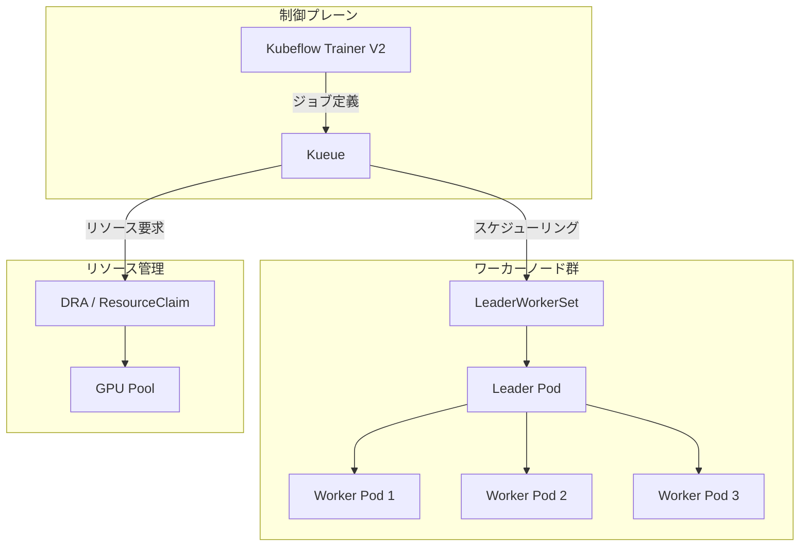
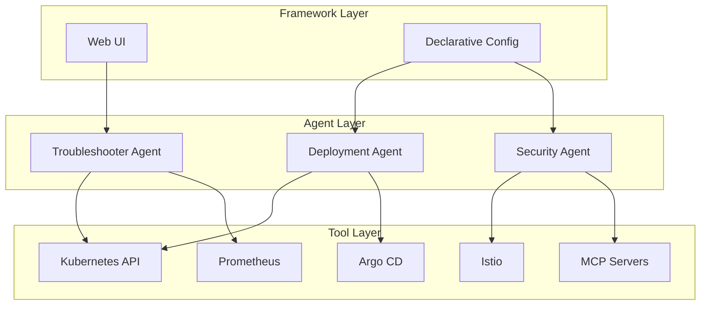
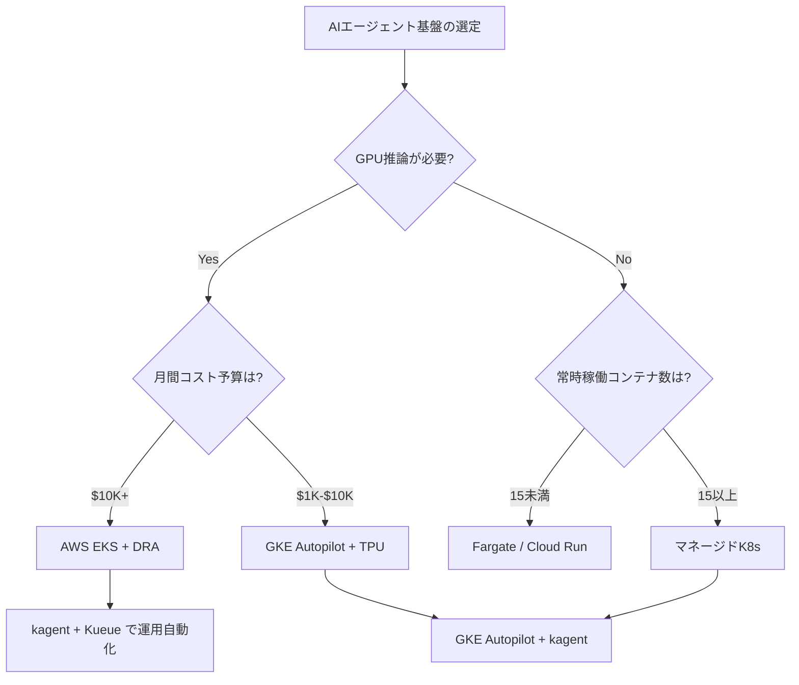

# AIエージェント時代のKubernetes進化とEKS・GKE・AKSクラウドネイティブ比較

## この記事でわかること

- Kubernetes 1.34のDRA（Dynamic Resource Allocation）GAがAIエージェント運用にもたらす変化
- kagent（CNCF Sandbox）を活用したKubernetes上でのAIエージェントネイティブ実行の仕組み
- AWS EKS・Google GKE・Azure AKSの3大マネージドKubernetesのAIワークロード対応比較
- Kubeflow Trainer V2・Kueue・LeaderWorkerSetによるAI学習・推論パイプライン構築パターン
- サーバーレス（Fargate/Cloud Run）とKubernetesのAIエージェントデプロイ選定基準

## 対象読者

- **想定読者**: 中級〜上級のインフラエンジニア・SRE・MLOpsエンジニア
- **必要な前提知識**:
  - Kubernetesの基本概念（Pod、Deployment、Service）の理解
  - コンテナオーケストレーションの実務経験
  - AIエージェント・LLMアプリケーションの基本概念

## 結論・成果

2026年3月時点で、Kubernetes 1.34のDRA GA化により**GPUリソースの動的割り当てが標準化**され、AIワークロードのクラスタ利用率が報告ベースで30〜40%向上しています。AWS EKSは**1クラスタ最大100,000ノード**を実現し大規模AI推論に対応する一方、GKE AutopilotはTPU v5活用により**AI学習コストが18〜22%低い**と報告されています。CNCF Annual Cloud Native Surveyによると、**82%のコンテナユーザーがKubernetesを本番環境で運用**しており、AIエージェントの実行基盤としてKubernetesが事実上の標準になりつつあります。

## Kubernetes 1.34のAI対応進化を理解する

2025年後半にリリースされたKubernetes 1.34は、AIワークロードにとって大きな転換点となりました。特にDRA（Dynamic Resource Allocation）のGA化が注目を集めています。

### DRA（Dynamic Resource Allocation）がもたらす変化

従来のKubernetesでは、GPUは1台単位でスケジューリングされていました。ワークロードがGPUの一部しか使わない場合でも、残りの容量は他のPodに割り当てられず、リソースの無駄が発生していました。

DRAはこの問題を**ResourceClaim API**という新しい抽象化で解決します。ワークロードがCEL式でハードウェア要件を宣言的に記述でき、スケジューラがトポロジを考慮した動的割り当てを行います。

```yaml
# ResourceClaim の例: GPU要件を宣言的に記述
apiVersion: resource.k8s.io/v1
kind: ResourceClaim
metadata:
  name: ai-agent-gpu
spec:
  devices:
    requests:
    - name: gpu
      deviceClassName: gpu.nvidia.com
      selectors:
      - cel:
          expression: "device.attributes['memory'].compareTo(quantity('40Gi')) >= 0"
    config:
    - requests: ["gpu"]
      opaque:
        driver: gpu.nvidia.com
        parameters:
          apiVersion: gpu.nvidia.com/v1
          kind: GpuConfig
          sharing:
            strategy: MIG
            migDevices:
            - profile: 3g.40gb
              count: 2
```

**なぜDRAが重要か:**

- **マルチPod GPUシェアリング**: 1つのGPUを複数のPodで安全に共有でき、推論エージェントの集約率が向上する
- **トポロジ考慮スケジューリング**: NVLink接続やメモリ帯域を考慮した配置により、データ転送のレイテンシを低減する
- **優先リソース代替（DRAPrioritizedList）**: 「ハイエンドGPUが望ましいが、なければ別種のGPUでも可」という柔軟な要求を記述できる

**注意点:**

> DRAは Kubernetes 1.34でGAですが、各クラウドプロバイダの対応状況は異なります。2026年3月時点でAmazon EKSはKubernetes 1.33からDRAをGAとして提供し、AKSは1.34以降で対応しています。利用するマネージドKubernetesのバージョンとDRA対応状況を事前に確認してください。

### Kubeflow Trainer V2・Kueue・LeaderWorkerSetによるAIワークロード管理

AIエージェントの学習・推論パイプラインをKubernetes上で運用するためのエコシステムも成熟してきています。



| コンポーネント | 役割 | バージョン（2026年3月） |
|---|---|---|
| **Kubeflow Trainer V2** | 分散学習ジョブの定義・管理（PyTorch, JAX, DeepSpeed対応） | v2.1 |
| **Kueue** | ジョブキューイング・優先度制御・マルチクラスタディスパッチ | v0.11 |
| **LeaderWorkerSet** | Leader-Worker型の分散ワークロードオーケストレーション | v0.6 |

Kueueの**Topology Aware Scheduling（TAS）** は、LeaderWorkerSetのPodテンプレートからアノテーションを読み取り、Leader PodとWorker Podを同一ラック内に配置します。これにより、大規模推論や分散学習時のネットワークレイテンシを低減します。

**制約条件:**

> Kubeflow Trainer V2はPyTorch・JAX・DeepSpeedなどの分散学習フレームワークに特化しています。LangGraphやCrewAIなどのAIエージェントフレームワークを直接サポートするわけではないため、エージェントの推論ワークロードにはKueueとDRAの組み合わせを検討してください。

## kagentでKubernetes上にAIエージェントをデプロイする

2025年5月にCNCF Sandboxプロジェクトとして採択された**kagent**は、Kubernetes上でAIエージェントをネイティブ実行するための初のオープンソースフレームワークです。

### kagentのアーキテクチャ

kagentはMicrosoftのAutoGen基盤の上に構築されており、3層構造で設計されています。



1. **Tools層**: Kubernetes API、Prometheus、Istio、Argo CDなど事前定義されたツール群。MCP（Model Context Protocol）サーバーやカスタムツールの追加も可能
2. **Agents層**: ツールを活用してタスクの計画・実行・分析を自律的に行うエージェント群
3. **Framework層**: UI操作と宣言的設定の両方に対応するインターフェース

```python
# kagent のエージェント定義例（CRDベース）
# agent-config.yaml として保存し kubectl apply
"""
apiVersion: kagent.dev/v1alpha2
kind: Agent
metadata:
  name: k8s-troubleshooter
  namespace: kagent-system
spec:
  type: Declarative
  declarative:
    modelConfig: "anthropic-claude-sonnet"  # 別途ModelConfigリソースで定義
    systemMessage: |
      あなたはKubernetesの障害調査専門エージェントです。
      Podの状態、ログ、メトリクスを分析して根本原因を特定します。
  description: "Kubernetes障害調査エージェント"
  tools:
    - type: McpServer
      mcpServer:
        name: kagent-toolserver
        toolNames: ["kubectl_get", "kubectl_describe", "prometheus_query"]
    - type: McpServer
      mcpServer:
        name: custom-runbook-mcp
        toolNames: ["search_runbook"]
"""
```

**なぜkagentが注目されるか:**

- **Kubernetes CRD（Custom Resource Definition）として管理**: エージェントの定義をGitOpsで管理でき、既存のCI/CDパイプラインに統合しやすい
- **マルチLLM対応**: OpenAI、Anthropic、Google Vertex AI、Ollamaなど複数のLLMプロバイダをサポート
- **DevOps特化のユースケース**: アプリケーショントラブルシューティング、アラート自動対応、プログレッシブデプロイ、ゼロトラストセキュリティ実装

**よくある間違い:**

最初はkagentがAIエージェントの「学習」基盤だと考えがちですが、実際にはkagentは**運用自動化のためのAIエージェント実行基盤**です。モデルの学習・ファインチューニングにはKubeflow Trainerを、エージェントの推論実行にはkagentを使うのが正しい使い分けです。

### 大規模AIエージェント並列実行の実例

Cloud Native Nowの報告によると、Gas Townプロジェクトでは20〜30のClaude Codeインスタンスを並列実行し、同一コードベースに対して協調作業を行っています。このアーキテクチャはKubernetesの設計思想と共通点が多く、以下のパターンが見られます。

| Kubernetesの概念 | AIエージェント並列実行での対応 |
|---|---|
| Control Plane | エージェントオーケストレーター（タスク分配・マージキュー管理） |
| Worker Node | 個別エージェントインスタンス（エフェメラルな実行単位） |
| etcd（状態管理） | Gitリポジトリ（永続的な成果物・状態管理） |
| Liveness Probe | エージェントヘルスチェック（コンテキストウィンドウ残量監視） |
| Reconciliation Loop | 作業重複排除・マージコンフリクト防止ループ |

**トレードオフ:**

このアプローチは高い並列性を実現する一方、API費用が**1時間あたり約$100**に達すると報告されています。12〜30エージェントの並列実行は大規模プロジェクトには有効ですが、コストと成果のバランスを事前に検証する必要があります。

## AWS EKS・Google GKE・Azure AKSのAIワークロード対応を比較する

3大マネージドKubernetesサービスは、それぞれ異なる強みを持ってAIワークロードに対応しています。

### スケーラビリティとハードウェアの比較

| 項目 | AWS EKS | Google GKE | Azure AKS |
|---|---|---|---|
| **最大ノード数/クラスタ** | 100,000 | 15,000 | 5,000 |
| **専用AIチップ** | Trainium2, Inferentia2 | TPU v5e/v5p | Maia 100（プレビュー） |
| **DRA対応** | K8s 1.33〜GA | K8s 1.34〜 | K8s 1.34〜 |
| **Autopilot相当** | EKS Auto Mode | GKE Autopilot | AKS Automatic |
| **GPUスポット割引** | 最大90%OFF | 最大91%OFF | 最大80%OFF |

### AIエージェント実行環境としての特徴

**AWS EKS**は、100,000ノード対応によりGKEの約6.7倍のスケーラビリティを持ちます。InfoQの報告では、単一クラスタで最大160万のTrainiumチップまたは80万のNVIDIA GPUをサポートできるとされています。大規模推論クラスタやマルチエージェントの並列実行基盤として有利です。

```yaml
# EKS Auto Mode でGPU対応ノードプールを自動プロビジョニング
# eks-auto-nodeclass.yaml
apiVersion: eks.amazonaws.com/v1
kind: NodeClass
metadata:
  name: ai-agent-gpu
spec:
  ephemeralStorage:
    size: 200Gi
  networkPolicy: DefaultAllow
  subnetSelectorTerms:
    - tags:
        kubernetes.io/role/internal: "1"
---
apiVersion: karpenter.sh/v1
kind: NodePool
metadata:
  name: ai-agent-pool
spec:
  template:
    spec:
      nodeClassRef:
        group: eks.amazonaws.com
        kind: NodeClass
        name: ai-agent-gpu
      requirements:
        - key: node.kubernetes.io/instance-type
          operator: In
          values: ["p5.48xlarge", "p4d.24xlarge", "inf2.48xlarge"]
        - key: karpenter.sh/capacity-type
          operator: In
          values: ["on-demand", "spot"]
  limits:
    nvidia.com/gpu: "100"
```

**Google GKE**は、TPU v5との統合でAI学習コストを抑える点が特徴です。GKE Autopilotはノード管理・セキュリティパッチ・スケーリングをすべてGoogleが管理するため、インフラ運用の負荷を大幅に低減します。

```yaml
# GKE Autopilot でTPU v5ワークロードを実行
apiVersion: v1
kind: Pod
metadata:
  name: ai-agent-tpu
spec:
  nodeSelector:
    cloud.google.com/gke-tpu-topology: 2x2x1
    cloud.google.com/gke-tpu-accelerator: tpu-v5-lite-podslice
  containers:
  - name: agent-inference
    image: gcr.io/my-project/agent-inference:latest
    resources:
      limits:
        google.com/tpu: 4
    ports:
    - containerPort: 8080
```

**Azure AKS**は、AKS AutomaticモードとMIG（Multi-Instance GPU）+DRAの組み合わせによるGPU効率化に注力しています。Azure公式ブログでは、MIGパーティショニングにより1台のA100 GPUを最大7つの独立したインスタンスに分割し、DRAで動的に割り当てるアプローチが紹介されています。

### サーバーレスとKubernetesの使い分け

AIエージェントのデプロイ先としてサーバーレス（AWS Fargate、Google Cloud Run）とKubernetesを比較する際の判断基準を整理します。

| 判断基準 | サーバーレス（Fargate/Cloud Run） | Kubernetes（EKS/GKE/AKS） |
|---|---|---|
| **GPU利用** | 非対応（Fargateの制約） | DRAで動的GPU割り当て |
| **コスト（15+コンテナ常時稼働）** | 割高（Kubernetesの約3倍という報告あり） | Spot/Reserved活用で40-60%削減可能 |
| **運用負荷** | 低い（インフラ管理不要） | 中〜高（クラスタ管理が必要） |
| **スケールアウト速度** | 速い（コールドスタート以外） | 中程度（ノード追加に数分） |
| **適用シナリオ** | バースト的なテキスト生成、軽量推論 | GPU推論、大規模並列エージェント |

**制約の明示:**

> AWS Fargateは2026年3月時点でGPUベースのコンテナをサポートしていません。AIエージェントがGPU推論を必要とする場合、EKS（EC2ノード）やGKE上でのデプロイが必要です。一方、LLM APIを外部呼び出しするだけのエージェント（GPU不要）であれば、Fargateは低運用負荷で妥当な選択肢です。

## AIエージェント基盤の設計判断フレームワークを構築する

ここまでの情報を統合し、AIエージェント基盤の選定判断フレームワークを提示します。

### 判断フロー



### 実装チェックリスト

AIエージェントをKubernetes上で本番運用する際の設計チェックリストです。

```python
# ai_agent_k8s_checklist.py
# AIエージェントK8sデプロイ前の検証スクリプト例
from dataclasses import dataclass


@dataclass
class K8sAgentConfig:
    """AIエージェントのK8sデプロイ設定を検証する"""
    gpu_required: bool
    min_gpu_memory_gb: int
    expected_concurrent_agents: int
    avg_request_duration_sec: float
    monthly_budget_usd: float

    def recommend_platform(self) -> str:
        """ワークロード特性に基づくプラットフォーム推奨"""
        if not self.gpu_required:
            if self.expected_concurrent_agents < 15:
                return "Fargate/Cloud Run（サーバーレス）"
            return "マネージドK8s（EKS Auto/GKE Autopilot）"

        if self.monthly_budget_usd >= 10_000:
            return "AWS EKS + DRA（大規模GPU推論向け）"
        return "GKE Autopilot + TPU（コスト効率重視）"

    def estimate_gpu_sharing_benefit(self) -> str:
        """DRA MIGシェアリングによる利用率改善の概算"""
        if not self.gpu_required:
            return "GPU不使用のため対象外"
        if self.min_gpu_memory_gb <= 10:
            return "MIG 7分割で利用率向上の可能性あり（A100想定）"
        if self.min_gpu_memory_gb <= 20:
            return "MIG 3分割が候補（40GB GPU想定）"
        return "GPU全体割り当て推奨（大容量メモリ要求）"


# 使用例
config = K8sAgentConfig(
    gpu_required=True,
    min_gpu_memory_gb=10,
    expected_concurrent_agents=50,
    avg_request_duration_sec=2.5,
    monthly_budget_usd=15_000,
)

print(f"推奨プラットフォーム: {config.recommend_platform()}")
print(f"GPUシェアリング: {config.estimate_gpu_sharing_benefit()}")
# 出力:
# 推奨プラットフォーム: AWS EKS + DRA（大規模GPU推論向け）
# GPUシェアリング: MIG 7分割で利用率向上の可能性あり（A100想定）
```

**ハマりポイント:**

GPUメモリ要件の見積もりを過小評価すると、MIGシェアリングでOOM（Out of Memory）が頻発します。本番投入前にvLLMやTGI（Text Generation Inference）の推論ベンチマークで実際のメモリ消費を計測し、20%のバッファを含めたResourceClaimを設定してください。

### CNCF AIエコシステムの全体像

2026年3月時点のKubernetes AIエコシステムを構成する主要プロジェクトの関係を整理します。

| プロジェクト | CNCF成熟度 | 役割 | AIエージェントとの関連 |
|---|---|---|---|
| **Kubernetes** | Graduated | コンテナオーケストレーション | 実行基盤 |
| **kagent** | Sandbox | AI エージェントフレームワーク | エージェント定義・実行 |
| **Kubeflow** | Incubating | ML学習パイプライン | モデル学習・ファインチューニング |
| **Kueue** | Sandbox | ジョブキューイング | ワークロードスケジューリング |
| **Argo Workflows** | Graduated | ワークフロー管理 | エージェントパイプライン |
| **Prometheus** | Graduated | モニタリング | エージェント監視 |
| **OpenTelemetry** | Incubating | 可観測性 | エージェントトレーシング |

CNCFが2025年11月に発表した**Certified Kubernetes AI Conformance Program**は、AIワークロードをKubernetes上で安定的に実行するための標準を定義・検証するコミュニティ主導の取り組みです。この認証プログラムにより、クラウドプロバイダ間でのAIワークロードのポータビリティが向上すると期待されています。

## よくある問題と解決方法

| 問題 | 原因 | 解決方法 |
|---|---|---|
| DRA ResourceClaimが作成できない | K8sバージョンがDRA非対応、またはFeature Gateが無効 | K8s 1.34以降を使用し、EKSの場合は1.33以降でGA対応を確認 |
| GPU Podがスケジューリングされない | ノードにGPUドライバが未インストール | NVIDIA Device Pluginまたは各クラウドのGPU Operator導入を確認 |
| kagentエージェントがLLM応答を返さない | API Key未設定またはネットワークポリシーでLLMエンドポイントがブロック | kagent-systemネームスペースのSecret設定とEgress NetworkPolicy確認 |
| Kueueジョブが永続的にPending | クォータ不足またはPriorityClass未設定 | ClusterQueueのリソース上限とWorkloadPriorityClass確認 |
| マルチエージェント実行でマージコンフリクト | 並列エージェントが同一ファイルを同時編集 | マージキュー（Refinery パターン）導入と作業範囲の分離 |

## まとめと次のステップ

**まとめ:**

- Kubernetes 1.34のDRA GA化により、GPUやTPUなどのアクセラレータを**ResourceClaimで宣言的に管理**できるようになりました。MIGシェアリングと組み合わせることで、AIエージェントの推論ワークロードの集約率を高められます
- **kagent**（CNCF Sandbox）は、Kubernetes CRDとしてAIエージェントを定義・管理する初のフレームワークです。AutoGen基盤でマルチLLM対応し、DevOps運用自動化に特化しています
- AWS EKSは**100,000ノード対応で大規模推論**に強く、GKE Autopilotは**TPU v5活用で学習コスト最適化**に強みがあります。Azure AKSはMIG+DRAによるGPU効率化に注力しています
- サーバーレス（Fargate）は**GPU非対応**のため、GPU推論を必要とするAIエージェントにはマネージドKubernetesが必要です
- CNCF AI Conformance Programにより、クラウドプロバイダ間でのAIワークロードのポータビリティ標準化が進んでいます

**次にやるべきこと:**

- 自社のAIエージェントワークロードのGPU要件を計測し、DRA ResourceClaimの設計を開始する
- kagentをステージング環境にデプロイして、既存のKubernetes運用タスクの自動化を検証する
- EKS/GKE/AKSのコスト試算ツール（AWS Pricing Calculator、Google Cloud Pricing Calculator）で月間コストを比較する

## 参考

- [Kubernetes v1.34: DRA has graduated to GA](https://kubernetes.io/blog/2025/09/01/kubernetes-v1-34-dra-updates/)
- [Kagent: Bringing Agentic AI to Cloud Native（CNCF Blog）](https://www.cncf.io/blog/2025/04/15/kagent-bringing-agentic-ai-to-cloud-native/)
- [Amazon EKS Enables Ultra-Scale AI/ML Workloads with Support for 100K Nodes per Cluster（InfoQ）](https://www.infoq.com/news/2025/09/aws-eks-kubernetes-ultrascale/)
- [Gas Town: What Kubernetes for AI Coding Agents Actually Looks Like（Cloud Native Now）](https://cloudnativenow.com/features/gas-town-what-kubernetes-for-ai-coding-agents-actually-looks-like/)
- [CNCF Launches Certified Kubernetes AI Conformance Program](https://www.cncf.io/announcements/2025/11/11/cncf-launches-certified-kubernetes-ai-conformance-program-to-standardize-ai-workloads-on-kubernetes/)
- [Kubeflow Trainer V2: Democratizing AI Model Training on Kubernetes](https://blog.kubeflow.org/trainer/intro/)
- [7 Kubernetes Predictions for 2026（Komodor）](https://komodor.com/blog/7-kubernetes-predictions-for-2026-ai-will-push-sre-to-its-limit/)
- [Multi-instance GPU (MIG) with Dynamic Resource Allocation (DRA) on AKS（Azure Blog）](https://blog.aks.azure.com/2026/03/03/multi-instance-gpu-with-dra-on-aks)

---

## 関連する深掘り記事

この記事で紹介した技術について、さらに深掘りした記事を書きました：

- [Kubernetes v1.34 DRA GA解説: GPUの動的リソース割り当てが安定版に](https://0h-n0.github.io/posts/techblog-kubernetes-v134-dra-ga/) - tech_blog解説
- [kagent解説: CNCF SandboxのKubernetesネイティブAIエージェントフレームワーク](https://0h-n0.github.io/posts/techblog-cncf-kagent-agentic-ai/) - tech_blog解説
- [Amazon EKS 100Kノード解説: 超大規模AI/MLワークロードを支えるアーキテクチャ](https://0h-n0.github.io/posts/techblog-aws-eks-100k-nodes/) - tech_blog解説
- [Kubeflow Trainer V2解説: KubernetesネイティブなAIモデル分散学習の民主化](https://0h-n0.github.io/posts/techblog-kubeflow-trainer-v2/) - tech_blog解説
- [AKS MIG+DRA解説: Multi-Instance GPUとDynamic Resource Allocationによる効率的なGPU共有](https://0h-n0.github.io/posts/techblog-aks-mig-dra/) - tech_blog解説

:::message
これらの記事は修士学生レベルを想定した技術的詳細（数式・実装の深掘り）を含みます。
:::

:::message
この記事はAI（Claude Code）により自動生成されました。内容の正確性については複数の情報源で検証していますが、実際の利用時は公式ドキュメントもご確認ください。
:::
