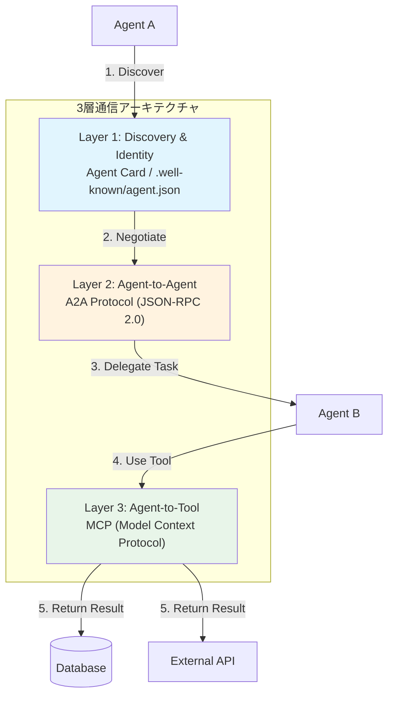
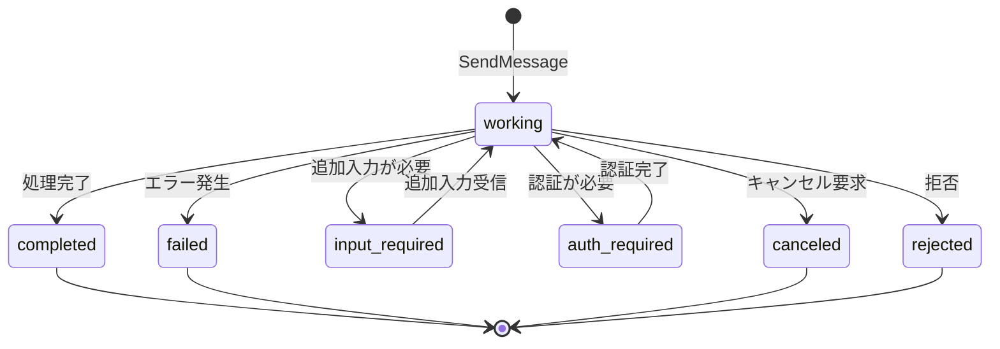
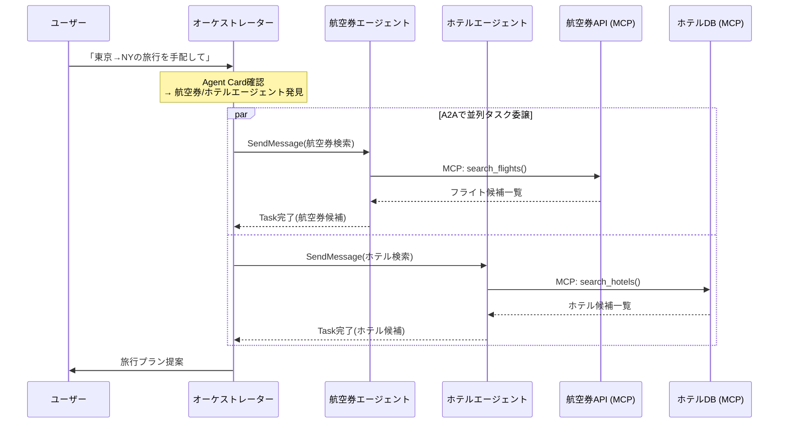

# A2A・MCP・ACPで設計するマルチエージェント通信：3層プロトコル実装ガイド

## この記事でわかること

- A2A（Agent-to-Agent）・MCP（Model Context Protocol）・ACPの役割の違いと使い分け
- Agent Cardによるエージェント能力宣言とDiscoveryの実装方法
- JSON-RPC 2.0ベースのA2Aタスクライフサイクル管理の設計パターン
- MCP（垂直統合）とA2A（水平統合）を組み合わせた3層通信アーキテクチャの構築
- LangGraph + A2A Python SDKでマルチエージェントシステムを接続する実装例

## 対象読者

- **想定読者**: 中級〜上級のPythonエンジニアで、マルチエージェントシステムの設計に携わる方
- **必要な前提知識**:
  - Python 3.11+ の非同期処理（`asyncio`）の基本
  - LLMエージェントの基本概念（ツール呼び出し、プロンプト設計）
  - REST API・JSON-RPCの基本理解

## 結論・成果

2026年のマルチエージェント通信は、**MCP（エージェント↔ツール）とA2A（エージェント↔エージェント）の2層構造**が業界標準として確立されつつあります。Google主導で50社以上が参画するA2Aは、Linux Foundationに移管されv1.0仕様が公開されました。IBM発のACPもA2Aに統合され、プロトコル標準化が加速しています。

Gartnerの予測によると、2027年までに業務アプリケーションの40%がタスク特化エージェントを統合するとされ（2025年時点では5%未満）、エージェント間通信の設計スキルは今後の必須技術となります。本記事では、この3層プロトコルの設計思想から実装まで、実践的に解説します。

## マルチエージェント通信の3層アーキテクチャを理解する

マルチエージェントシステムの通信は、単一のプロトコルでは解決できません。**ツール連携**と**エージェント間協調**は根本的に異なる問題であり、それぞれ専用のプロトコルが必要です。2026年時点で確立されつつある3層アーキテクチャを見ていきましょう。

### 3つのプロトコルの位置づけ

各プロトコルは異なる通信層を担当します。以下の表で、それぞれの責務と技術的特徴を比較します。

| 比較項目 | MCP | A2A | ACP（A2Aに統合） |
|----------|-----|-----|-------------------|
| **提唱者** | Anthropic | Google → Linux Foundation | IBM → Linux Foundation |
| **通信の方向** | 垂直（エージェント↔ツール/データ） | 水平（エージェント↔エージェント） | 水平（エージェント↔エージェント） |
| **アーキテクチャ** | Client-Server | Peer-to-Peer | Client-Server（REST） |
| **メッセージ形式** | JSON-RPC 2.0 | JSON-RPC 2.0 | REST API |
| **Discovery** | 静的（サーバー定義） | Agent Card（`.well-known/agent.json`） | YAML metadata（REST endpoint） |
| **ストリーミング** | あり | SSE（Server-Sent Events） | あり |
| **認証** | 開発中 | OAuth2, mTLS, API Key | セッション管理 |
| **状態管理** | サーバー内のみ | Taskオブジェクト | セッション＋メモリ |
| **2026年ステータス** | 数千のサーバーが稼働 | v1.0仕様公開 | A2Aに統合完了 |

**重要なのは、これらが競合関係ではなく補完関係にあるという点です。** MCPはエージェントが外部のデータベースやAPIにアクセスするための「手」を提供し、A2Aはエージェント同士が協調作業するための「言葉」を提供します。



### なぜ単一プロトコルでは不十分か

MCPだけでマルチエージェントを構築しようとすると、以下の問題に直面します。

- **能力宣言の欠如**: MCPサーバーは「ツールの一覧」を返しますが、「エージェントとして何ができるか」は表現できません
- **タスク管理の不在**: MCPは同期的なツール呼び出しに最適化されており、長時間実行タスクの状態追跡ができません
- **認証の未成熟**: MCPの認証機構は開発中であり、エージェント間のセキュアな通信には不向きです

> A2Aの公式ドキュメントでは「MCPがエージェントの"手"なら、A2Aはエージェントの"声"」と表現しており、この比喩が両者の関係を端的に表しています。

**注意点:**
> プロトコルの標準化は2026年時点で進行中です。ACPはA2Aに統合されましたが、今後もプロトコルの統廃合が起こる可能性があります。本番環境への導入時は、抽象化レイヤーを設けてプロトコル変更に対応できる設計を推奨します。

## A2Aプロトコルの通信設計を実装する

A2Aプロトコルの中核は**Agent Card**によるDiscoveryと**Task**によるライフサイクル管理です。ここでは、A2A Python SDKを使って実際の通信フローを実装していきます。

### Agent Cardでエージェントの能力を宣言する

Agent Cardは、エージェントの「デジタル名刺」です。HTTPSの`.well-known/agent.json`エンドポイントで公開され、クライアントがエージェントの能力を事前に把握するための標準的な仕組みを提供します。

```python
# agent_card.py - Agent Cardの定義例
from a2a.types import AgentCard, AgentSkill, SecurityScheme

def create_research_agent_card() -> AgentCard:
    """リサーチエージェントのAgent Cardを定義する"""
    return AgentCard(
        name="research-agent",
        description="技術トピックのリサーチと要約を行うエージェント",
        url="https://agents.example.com/research",
        version="1.0.0",
        skills=[
            AgentSkill(
                id="web-research",
                name="Webリサーチ",
                description="指定トピックについてWeb検索し要約を返す",
                tags=["research", "summarization"],
                examples=[
                    "A2Aプロトコルの最新動向を調べてください",
                    "LangGraphの性能ベンチマークを収集してください",
                ],
            ),
            AgentSkill(
                id="paper-analysis",
                name="論文分析",
                description="arXiv論文を読み解き技術的要点を抽出する",
                tags=["arxiv", "analysis"],
            ),
        ],
        capabilities={
            "streaming": True,    # SSEストリーミング対応
            "pushNotifications": True,  # Webhook通知対応
        },
        security_schemes={
            "bearer": SecurityScheme(
                type="http",
                scheme="bearer",
                description="Bearer token認証",
            ),
        },
        default_input_modes=["text"],
        default_output_modes=["text"],
    )
```

**なぜAgent Cardが重要か:**
- エージェントの能力を**機械可読な形式**で公開できるため、クライアントが動的に適切なエージェントを選択できます
- `skills`フィールドの`examples`により、LLMベースのクライアントが自然言語でエージェントの使い方を理解できます
- `security_schemes`で認証要件が明示されるため、接続前に認証方法を確認できます

### Taskライフサイクルで非同期処理を管理する

A2Aの通信はすべて**Task**を中心に回ります。Taskは作成されてから完了（または失敗）するまで、明確な状態遷移を持ちます。



以下は、A2A Python SDKを使ったAgentExecutorの実装例です。

```python
# executor.py - AgentExecutorの実装
import asyncio
from a2a.server.agent_execution import AgentExecutor
from a2a.server.events import EventQueue
from a2a.server.request_context import RequestContext
from a2a.types import (
    TaskStatus,
    TaskState,
    TaskStatusUpdateEvent,
    TaskArtifactUpdateEvent,
    Part,
    TextPart,
    Message,
)


class ResearchAgentExecutor(AgentExecutor):
    """リサーチエージェントの実行ロジック"""

    async def execute(
        self,
        context: RequestContext,
        event_queue: EventQueue,
    ) -> None:
        # 1. ユーザー入力を取得
        user_message = context.get_user_message()
        query = user_message.parts[0].text  # type: ignore

        # 2. 処理開始を通知（working状態）
        await event_queue.enqueue(
            TaskStatusUpdateEvent(
                status=TaskStatus(
                    state=TaskState.WORKING,
                    message=Message(
                        role="agent",
                        parts=[TextPart(text=f"「{query}」をリサーチ中...")],
                    ),
                ),
            )
        )

        # 3. 実際のリサーチ処理（ここにLLM呼び出しやWeb検索を実装）
        result = await self._do_research(query)

        # 4. 成果物（Artifact）を返す
        await event_queue.enqueue(
            TaskArtifactUpdateEvent(
                artifact={
                    "parts": [TextPart(text=result)],
                    "name": "research-result",
                    "description": f"「{query}」のリサーチ結果",
                },
            )
        )

        # 5. 完了を通知
        await event_queue.enqueue(
            TaskStatusUpdateEvent(
                status=TaskStatus(state=TaskState.COMPLETED),
            )
        )

    async def cancel(
        self,
        context: RequestContext,
        event_queue: EventQueue,
    ) -> None:
        await event_queue.enqueue(
            TaskStatusUpdateEvent(
                status=TaskStatus(state=TaskState.CANCELED),
            )
        )

    async def _do_research(self, query: str) -> str:
        """リサーチロジック（実際にはLLM + Web検索を組み合わせる）"""
        # 実装例: LangChainやLangGraphのエージェントを呼び出す
        await asyncio.sleep(1)  # 模擬的な処理時間
        return f"リサーチ結果: {query}に関する最新情報をまとめました。"
```

### A2Aサーバーを起動する

Agent CardとAgentExecutorを組み合わせて、A2Aサーバーを構成します。

```python
# server.py - A2Aサーバーの起動
from a2a.server.apps.starlette import A2AStarletteApplication
from a2a.server.request_handlers import DefaultRequestHandler
from a2a.server.tasks import InMemoryTaskStore

from agent_card import create_research_agent_card
from executor import ResearchAgentExecutor


def create_app() -> A2AStarletteApplication:
    """A2Aサーバーアプリケーションを構成する"""
    agent_card = create_research_agent_card()
    executor = ResearchAgentExecutor()
    task_store = InMemoryTaskStore()

    # RequestHandlerがA2Aプロトコルの処理を担当
    request_handler = DefaultRequestHandler(
        agent_card=agent_card,
        agent_executor=executor,
        task_store=task_store,
    )

    return A2AStarletteApplication(
        agent_card=agent_card,
        http_handler=request_handler,
    )


if __name__ == "__main__":
    import uvicorn

    app = create_app()
    uvicorn.run(app.build(), host="0.0.0.0", port=8001)
```

**動作確認環境**: Python 3.12, `a2a-sdk[http-server]` v0.3.x, `uvicorn` 0.34+

起動後、以下のエンドポイントが利用可能になります。

| エンドポイント | メソッド | 説明 |
|----------------|----------|------|
| `/.well-known/agent.json` | GET | Agent Cardの取得 |
| `/` | POST | JSON-RPCリクエスト（SendMessage等） |

**ハマりポイント:**
> `InMemoryTaskStore`は開発・テスト用です。本番環境ではRedisやPostgreSQLベースのTaskStoreを実装し、サーバー再起動時にタスク状態が失われないようにする必要があります。A2A Python SDKにはデフォルトの永続化実装が含まれていないため、自前で`TaskStore`インターフェースを実装してください。

## クライアントからA2Aエージェントにタスクを委譲する

サーバー側の実装ができたら、次はクライアント側です。A2Aクライアントは、Agent Cardを読み取り、適切なエージェントにタスクを委譲します。

### 基本的なクライアント実装

```python
# client.py - A2Aクライアントの実装
import asyncio
import httpx
from a2a.client import A2AClient
from a2a.types import (
    MessageSendParams,
    SendMessageRequest,
    Part,
    TextPart,
    Message,
)


async def discover_and_delegate():
    """エージェントを発見してタスクを委譲する"""

    # 1. Agent Cardを取得してエージェントの能力を確認
    async with httpx.AsyncClient() as http_client:
        client = await A2AClient.get_client_from_agent_card_url(
            http_client=http_client,
            base_url="http://localhost:8001",
        )

        # Agent Cardからスキル一覧を確認
        agent_card = client.agent_card
        print(f"エージェント: {agent_card.name}")
        for skill in agent_card.skills:
            print(f"  - {skill.name}: {skill.description}")

        # 2. タスクを送信（blocking=Trueで完了まで待機）
        response = await client.send_message(
            request=SendMessageRequest(
                params=MessageSendParams(
                    message=Message(
                        role="user",
                        parts=[
                            TextPart(
                                text="A2Aプロトコルの最新動向を調査してください"
                            ),
                        ],
                    ),
                ),
            ),
        )

        # 3. レスポンスの処理
        if hasattr(response, "result"):
            task = response.result
            print(f"タスクID: {task.id}")
            print(f"状態: {task.status.state}")
            if task.artifacts:
                for artifact in task.artifacts:
                    for part in artifact.parts:
                        if hasattr(part, "text"):
                            print(f"結果: {part.text}")


if __name__ == "__main__":
    asyncio.run(discover_and_delegate())
```

### SSEストリーミングで進捗をリアルタイム受信する

長時間実行タスクでは、ストリーミングを使って処理の進捗をリアルタイムに受け取ります。

```python
# streaming_client.py - SSEストリーミングクライアント
import asyncio
import httpx
from a2a.client import A2AClient
from a2a.types import (
    MessageSendParams,
    SendStreamingMessageRequest,
    Message,
    TextPart,
    TaskState,
)


async def stream_task():
    """SSEストリーミングでタスクの進捗を受信する"""
    async with httpx.AsyncClient() as http_client:
        client = await A2AClient.get_client_from_agent_card_url(
            http_client=http_client,
            base_url="http://localhost:8001",
        )

        # ストリーミングリクエスト送信
        stream = client.send_streaming_message(
            request=SendStreamingMessageRequest(
                params=MessageSendParams(
                    message=Message(
                        role="user",
                        parts=[
                            TextPart(text="最新のLLM論文を5本調査してください")
                        ],
                    ),
                ),
            ),
        )

        # イベントを逐次処理
        async for event in stream:
            if hasattr(event, "status"):
                state = event.status.state
                print(f"[状態更新] {state}")
                if event.status.message:
                    for part in event.status.message.parts:
                        if hasattr(part, "text"):
                            print(f"  → {part.text}")
                if state in (
                    TaskState.COMPLETED,
                    TaskState.FAILED,
                    TaskState.CANCELED,
                ):
                    break
            elif hasattr(event, "artifact"):
                print(f"[成果物] {event.artifact.get('name', 'unnamed')}")


if __name__ == "__main__":
    asyncio.run(stream_task())
```

**なぜSSEを選んだか:**
- WebSocketと比較して**HTTPインフラとの互換性が高く**、プロキシやCDN経由でも動作します
- A2Aプロトコル仕様でSSEが標準として定義されており、SDKが標準サポートしています
- 一方向（サーバー→クライアント）の通知に特化しているため、通信モデルが単純です

**制約条件:**
> SSEは一方向通信のため、クライアントからの追加入力（`input-required`状態への応答）には別途`SendMessage`を送る必要があります。双方向のリアルタイム通信が必要な場合は、gRPCバインディング（A2A v1.0で追加）の利用を検討してください。

## MCP + A2Aの2層構成でシステムを設計する

ここまでA2A単体の実装を見てきました。実際のマルチエージェントシステムでは、A2Aによるエージェント間通信と、MCPによるツールアクセスを組み合わせます。

### 2層構成の設計パターン

以下は、旅行予約システムを例にした2層構成の設計です。



### LangGraphエージェントをA2Aで公開する

既存のLangGraphエージェントをA2A互換にする方法を示します。LangGraphのグラフ実行とA2AのAgentExecutorを橋渡しするアダプターを実装します。

```python
# langgraph_a2a_adapter.py
import asyncio
from typing import Any

from a2a.server.agent_execution import AgentExecutor
from a2a.server.events import EventQueue
from a2a.server.request_context import RequestContext
from a2a.types import (
    TaskStatus,
    TaskState,
    TaskStatusUpdateEvent,
    TaskArtifactUpdateEvent,
    TextPart,
    Message,
)
from langgraph.graph import StateGraph, START, END
from langchain_core.messages import HumanMessage, AIMessage


# LangGraphのステート定義
class AgentState:
    messages: list
    research_result: str


def create_research_graph() -> StateGraph:
    """リサーチ用のLangGraphグラフを構築する"""

    async def research_node(state: dict[str, Any]) -> dict[str, Any]:
        """リサーチノード（実際にはLLM呼び出し）"""
        query = state["messages"][-1].content
        # ここでLLMやWeb検索ツールを呼び出す
        result = f"調査結果: {query}に関する情報を収集しました"
        return {
            "messages": state["messages"] + [AIMessage(content=result)],
            "research_result": result,
        }

    async def summarize_node(state: dict[str, Any]) -> dict[str, Any]:
        """要約ノード"""
        research = state.get("research_result", "")
        summary = f"要約: {research[:100]}..."
        return {
            "messages": state["messages"] + [AIMessage(content=summary)],
        }

    # グラフ構築
    graph = StateGraph(dict)
    graph.add_node("research", research_node)
    graph.add_node("summarize", summarize_node)
    graph.add_edge(START, "research")
    graph.add_edge("research", "summarize")
    graph.add_edge("summarize", END)

    return graph.compile()


class LangGraphA2AExecutor(AgentExecutor):
    """LangGraphグラフをA2A AgentExecutorとしてラップする"""

    def __init__(self):
        self.graph = create_research_graph()

    async def execute(
        self,
        context: RequestContext,
        event_queue: EventQueue,
    ) -> None:
        user_message = context.get_user_message()
        query = user_message.parts[0].text  # type: ignore

        # 処理開始通知
        await event_queue.enqueue(
            TaskStatusUpdateEvent(
                status=TaskStatus(
                    state=TaskState.WORKING,
                    message=Message(
                        role="agent",
                        parts=[TextPart(text="LangGraphで処理中...")],
                    ),
                ),
            )
        )

        # LangGraphグラフを実行
        result = await self.graph.ainvoke(
            {"messages": [HumanMessage(content=query)]}
        )

        # 最終メッセージを成果物として返す
        final_message = result["messages"][-1].content
        await event_queue.enqueue(
            TaskArtifactUpdateEvent(
                artifact={
                    "parts": [TextPart(text=final_message)],
                    "name": "langgraph-result",
                },
            )
        )

        await event_queue.enqueue(
            TaskStatusUpdateEvent(
                status=TaskStatus(state=TaskState.COMPLETED),
            )
        )

    async def cancel(
        self,
        context: RequestContext,
        event_queue: EventQueue,
    ) -> None:
        await event_queue.enqueue(
            TaskStatusUpdateEvent(
                status=TaskStatus(state=TaskState.CANCELED),
            )
        )
```

**なぜLangGraphとA2Aを組み合わせるか:**
- LangGraphは**エージェント内部のワークフロー管理**に特化しており、複数ノードの遷移制御やチェックポイントが得意です
- A2Aは**エージェント間の通信標準**であり、異なるフレームワークで構築されたエージェント同士を接続できます
- この組み合わせにより、内部はLangGraphで柔軟に設計しつつ、外部にはA2A標準インターフェースを公開できます

**トレードオフ:**
> LangGraphのネイティブな`langgraph-supervisor`パッケージを使う方法もありますが、同一プロセス内での実行に限定されます。A2Aを介することで、エージェントを独立したマイクロサービスとしてデプロイでき、スケーリングや障害分離が容易になります。一方、ネットワーク通信のオーバーヘッド（A2Aの場合、1リクエストあたり数十ms〜数百msの追加レイテンシ）が発生するため、低レイテンシ要件がある場合は同一プロセス内実行を検討してください。

## 通信パターンの選定と実装上の注意点

マルチエージェントシステムの通信パターンは、システム要件に応じて選択する必要があります。ここでは主要な4パターンの特徴と選定基準を整理します。

### 4つの通信パターン比較

| パターン | A2Aでの実現方法 | 適用シーン | レイテンシ |
|----------|-----------------|------------|------------|
| **Request-Reply** | `SendMessage`（blocking=true） | 単発のタスク委譲 | 低〜中 |
| **Streaming** | `SendStreamingMessage` + SSE | 長時間実行タスク | 低（初回応答） |
| **Pub/Sub** | Push Notification（Webhook） | イベント駆動の通知 | 中 |
| **Fan-out/Fan-in** | 複数の`SendMessage`を並列実行 | 並列リサーチ・投票 | 高（最遅に依存） |

### Fan-out/Fan-inパターンの実装例

複数のエージェントに並列でタスクを委譲し、結果を集約する**Fan-out/Fan-in**パターンは、リサーチやコンセンサス形成に有効です。

```python
# fanout_client.py - 複数エージェントへの並列タスク委譲
import asyncio
import httpx
from a2a.client import A2AClient
from a2a.types import (
    MessageSendParams,
    SendMessageRequest,
    Message,
    TextPart,
)


async def fanout_research(query: str, agent_urls: list[str]) -> list[dict]:
    """複数のリサーチエージェントに並列でタスクを委譲する"""
    results = []

    async with httpx.AsyncClient(timeout=60.0) as http_client:
        # 各エージェントのクライアントを取得
        clients = []
        for url in agent_urls:
            client = await A2AClient.get_client_from_agent_card_url(
                http_client=http_client,
                base_url=url,
            )
            clients.append((url, client))

        # Fan-out: 並列でタスクを送信
        tasks = []
        for url, client in clients:
            task = asyncio.create_task(
                _send_and_collect(client, query, url)
            )
            tasks.append(task)

        # Fan-in: 全結果を収集（タイムアウト付き）
        done, pending = await asyncio.wait(
            tasks, timeout=30.0, return_when=asyncio.ALL_COMPLETED
        )

        for completed in done:
            try:
                result = completed.result()
                results.append(result)
            except Exception as e:
                results.append({"error": str(e), "source": "unknown"})

        # タイムアウトしたタスクをキャンセル
        for p in pending:
            p.cancel()
            results.append({"error": "timeout", "source": "unknown"})

    return results


async def _send_and_collect(
    client: A2AClient, query: str, source_url: str
) -> dict:
    """単一エージェントへのリクエストと結果収集"""
    response = await client.send_message(
        request=SendMessageRequest(
            params=MessageSendParams(
                message=Message(
                    role="user",
                    parts=[TextPart(text=query)],
                ),
            ),
        ),
    )
    task = response.result
    text = ""
    if task.artifacts:
        for artifact in task.artifacts:
            for part in artifact.parts:
                if hasattr(part, "text"):
                    text += part.text
    return {"source": source_url, "result": text, "task_id": task.id}


# 使用例
async def main():
    agent_urls = [
        "http://localhost:8001",  # リサーチエージェント1
        "http://localhost:8002",  # リサーチエージェント2
        "http://localhost:8003",  # リサーチエージェント3
    ]
    results = await fanout_research(
        "2026年のLLMエージェント動向", agent_urls
    )
    for r in results:
        print(f"[{r['source']}] {r.get('result', r.get('error', ''))[:100]}")


if __name__ == "__main__":
    asyncio.run(main())
```

### よくある問題と解決方法

| 問題 | 原因 | 解決方法 |
|------|------|----------|
| Agent Cardが取得できない | `.well-known/agent.json`のパスが異なる | `base_url`にA2Aサーバーのルートを指定。CORSヘッダーの設定を確認 |
| SSEストリームが途切れる | ロードバランサーのタイムアウト | ALB/NGINXの`proxy_read_timeout`を延長（推奨: 300s以上） |
| タスクが`working`のまま停止 | エージェントのクラッシュや無限ループ | クライアント側で`asyncio.wait`にtimeoutを設定し、`CancelTask`を送信 |
| 認証エラー（401） | セキュリティスキーム不一致 | Agent Cardの`security_schemes`を確認し、対応する認証ヘッダーを送信 |
| gRPC接続が確立できない | A2Aサーバーがgenprocバインディング未対応 | JSON-RPC/HTTP + SSEにフォールバック。Agent Cardの`interfaces`を確認 |

## まとめと次のステップ

**まとめ:**

- マルチエージェント通信は**MCP（垂直: ツール連携）+ A2A（水平: エージェント間）の2層構造**で設計するのが2026年の標準アプローチです
- A2Aの中核は**Agent Card**（能力宣言）と**Task**（ライフサイクル管理）の2つであり、JSON-RPC 2.0とSSEによる標準的なWeb技術の上に構築されています
- 通信パターンはRequest-Reply、Streaming、Pub/Sub（Webhook）、Fan-out/Fan-inの4つから要件に応じて選択します
- LangGraphなど既存フレームワークのエージェントは、`AgentExecutor`アダプターを実装することでA2A互換にできます
- ACPはA2Aに統合され、Linux Foundation管理下でプロトコルの統一が進んでいます

**次にやるべきこと:**

- [A2A Python SDK](https://github.com/a2aproject/a2a-python)のサンプルを動かし、Agent CardとTaskの挙動を確認する
- 既存のLangGraphエージェントに`AgentExecutor`ラッパーを追加してA2A対応する
- 本番環境向けに`TaskStore`の永続化実装（Redis/PostgreSQL）を検討する

## 参考

- [A2A Protocol仕様書（v1.0）](https://a2a-protocol.org/latest/specification/)
- [A2A Python SDK - GitHub](https://github.com/a2aproject/a2a-python)
- [Google Developers Blog - Announcing the Agent2Agent Protocol](https://developers.googleblog.com/en/a2a-a-new-era-of-agent-interoperability/)
- [Linux Foundation - A2A Protocol Project発表](https://www.linuxfoundation.org/press/linux-foundation-launches-the-agent2agent-protocol-project-to-enable-secure-intelligent-communication-between-ai-agents)
- [Top AI Agent Protocols in 2026 - GetStream](https://getstream.io/blog/ai-agent-protocols/)
- [Comparison of Agent Protocols MCP, ACP and A2A - Niklas Heidloff](https://heidloff.net/article/mcp-acp-a2a-agent-protocols/)
- [A2A Protocol Explained - Hugging Face Blog](https://huggingface.co/blog/1bo/a2a-protocol-explained)

**関連記事:** [LangGraphで作るマルチエージェント：30分で構築する実践ガイド](https://zenn.dev/0h_n0/articles/8487a08b378cf1)、[2026年版：マルチエージェント研究の最新トレンドと3大技術潮流](https://zenn.dev/0h_n0/articles/e20f1d350a46d5)

---

:::message
この記事はAI（Claude Code）により自動生成されました。内容の正確性については複数の情報源で検証していますが、実際の利用時は公式ドキュメントもご確認ください。
:::
