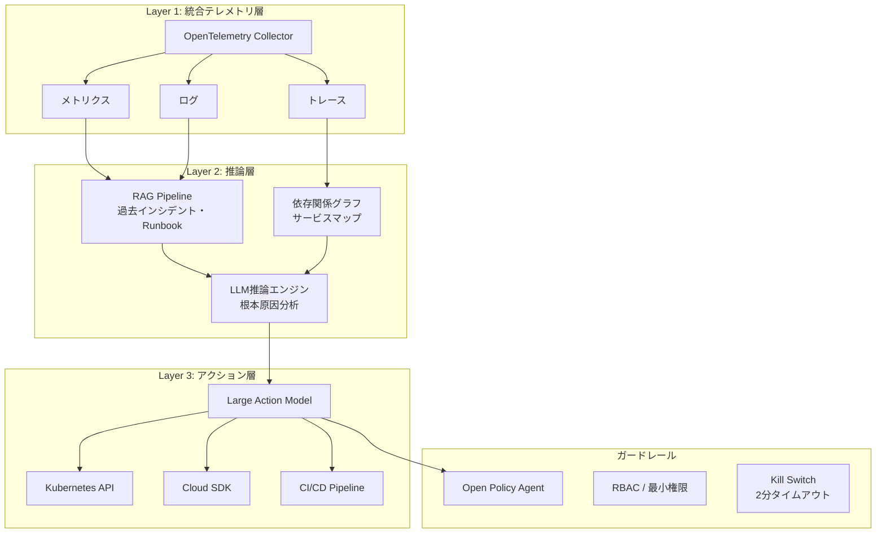
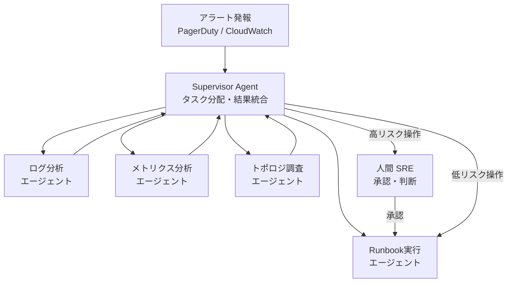
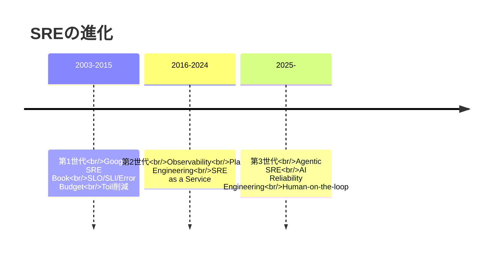
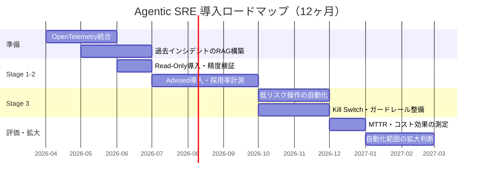

# AIエージェントで運用保守を変革する：Agentic SREの実装と4段階導入戦略

## この記事でわかること

- **Agentic SREとは何か**：従来のSREとの違い、3層アーキテクチャの全体像
- **主要ツールの比較**：Azure SRE Agent・AWS DevOps Agent・PagerDuty AI Suiteの機能と使い分け
- **4段階の導入戦略**：Read-Only→Advised→Semi-Autonomous→Autonomousの段階的移行パターン
- **マルチエージェント構成の設計方法**：Supervisor＋専門エージェントの実装アーキテクチャ
- **SRE人材の役割変化**：「運用実行者」から「信頼性アーキテクト」への移行ロードマップ

## 対象読者

- **想定読者**: 中級〜上級のSRE・DevOpsエンジニア
- **必要な前提知識**:
  - Kubernetes・クラウドインフラの基本運用経験
  - オブザーバビリティ（Prometheus、Grafana、Datadog等）の基礎理解
  - インシデント対応フローの実務経験

## 結論・成果

2026年現在、Agentic SREの導入により以下の成果が報告されています。

- **MTTR（平均復旧時間）**: 従来比で3倍高速化（Gartner調査によるAIOps導入企業の平均値）
- **SRE運用コスト**: 30%削減（ルーチンタスクの70-80%をAIエージェントが処理）
- **導入率**: 大企業の60%以上がself-healing infrastructureを採用（Gartner 2026年調査）

ただし、これは「SREが不要になる」という意味ではありません。人間の役割が「障害対応の実行者」から「ポリシー設計・ガードレール定義を行う信頼性アーキテクト」に移行しつつあるのが現状です。本記事では、この変革をどう段階的に実現するかを具体的な実装パターンとともに解説します。

## Agentic SREの全体像を理解する

### 従来のSREとAgentic SREの違い

従来のSREは、**Human-in-the-loop**（人間が判断・実行の中心にいる）モデルでした。アラートが発報され、人間がダッシュボードを確認し、ログを調査し、Runbookに従って対応するという流れです。

Agentic SREでは、**Human-on-the-loop**（人間が監督者として関与する）モデルに移行します。AIエージェントがテレメトリデータを分析し、根本原因を推論し、修復アクションを実行します。人間はポリシーを定義し、高リスク操作の承認を行い、事後レビューで改善サイクルを回します。

| 比較項目 | 従来のSRE | Agentic SRE |
|----------|-----------|-------------|
| アラート対応 | 人間がトリアージ・調査 | AIが自動分類・優先度付け |
| 根本原因分析 | ログ・メトリクスの手動調査 | テレメトリの自動相関分析 |
| 修復アクション | Runbookに従い手動実行 | ガードレール内で自動実行 |
| 人間の役割 | 実行者（operator） | 監督者（governor） |
| スケーラビリティ | オンコール人数に依存 | エージェント数で水平スケール |
| 知識の蓄積 | ポストモーテム文書化 | RAGで自動学習・再利用 |

**注意点:**
> Agentic SREは「人間不要」を意味しません。InfoQの2026年1月の報告によると、自律的な分析だけでは人間がガイドする調査に精度が及ばない「productionization gap」が存在します。AIは定型作業を高速化する一方、未知の障害パターンへの対応は依然として人間の判断が不可欠です。

### 3層テクニカルアーキテクチャ

Agentic SREの技術スタックは、以下の3層で構成されます。



**Layer 1（統合テレメトリ層）** では、OpenTelemetryがメトリクス・ログ・トレースを統一フォーマットで収集します。分散システムの各コンポーネントからのシグナルを一元化することで、AIエージェントがシステム全体の状態を把握できるようになります。

**Layer 2（推論層）** では、RAGパイプラインが過去のインシデント履歴・Runbook・ポストモーテムを検索し、LLMが根本原因を推論します。依存関係グラフ（サービスマップ）と組み合わせることで、障害の伝播パスを特定します。

**Layer 3（アクション層）** では、Large Action Model（ツール呼び出し可能なLLMエージェント）がKubernetes API・クラウドSDK・CI/CDパイプラインを操作して修復アクションを実行します。

**なぜこのアーキテクチャを選ぶか:**
- OpenTelemetryを選択する理由は、ベンダーロックインを避けつつ、テレメトリの標準化を実現するためです。各ツール（Datadog、Grafana、New Relic等）が独自フォーマットでデータを保持していると、AIエージェントがシステム全体を横断的に分析できません
- RAGを推論層に組み込む理由は、LLMの汎用知識だけでは自社固有のインフラ構成や過去のインシデントパターンに対応できないためです

## 主要AI SREツールを比較する

2025年後半から2026年にかけて、クラウドベンダー・SaaS各社がAI SREエージェントを相次いで発表しました。主要3サービスの特徴を比較します。

### Azure SRE Agent（Microsoft）

Azure SRE Agentは、2025年末にパブリックプレビューとして提供開始されたMicrosoftの公式AI SREサービスです。Azureリソース全般（Compute、Storage、Networking、Database、Monitor）をAzure CLI・REST API経由で管理できます。

```python
# Azure SRE Agent のSubAgentを構成するイメージ（概念的な擬似コード）
# 実際にはAzureポータルのノーコードビルダーで構成

from dataclasses import dataclass

@dataclass
class SRESubAgent:
    """Azure SRE AgentのSubAgent定義"""
    name: str
    description: str
    capabilities: list[str]
    tools: list[str]  # 利用可能なツール
    rbac_role: str     # 最小権限ロール

# VM専門のSubAgent例
vm_agent = SRESubAgent(
    name="vm-health-monitor",
    description="VM の正常性監視と基本的な修復を担当",
    capabilities=[
        "CPU/メモリ使用率の異常検知",
        "ディスク空き容量のアラート",
        "応答なしVMの自動再起動",
    ],
    tools=["az vm restart", "az monitor metrics list"],
    rbac_role="Virtual Machine Contributor",  # 必要最小限の権限
)

# Kubernetes専門のSubAgent例
k8s_agent = SRESubAgent(
    name="aks-incident-responder",
    description="AKS クラスターのインシデント調査と修復",
    capabilities=[
        "Pod CrashLoopBackOff の原因調査",
        "ノードのリソース枯渇検知",
        "Deployment のロールバック",
    ],
    tools=["kubectl get", "kubectl describe", "kubectl rollout undo"],
    rbac_role="Azure Kubernetes Service Cluster User Role",
)
```

**Azure SRE Agentの特徴:**
- **ノーコードSubAgent Builder**: VisualなUIで専門エージェントを構築可能
- **統合インシデント管理**: PagerDuty・ServiceNow・Azure Monitorと直接連携
- **コード対応RCA**: GitHub/Azure DevOpsのソースコードとリンクした根本原因分析
- **最小権限設計**: RBAC連動。書き込み操作は人間承認が必須

### AWS DevOps Agent

AWS re:Invent 2025で発表されたAWS DevOps Agentは、トポロジマップとテレメトリの相関分析に強みを持ちます。

AWS DevOps Agentのインシデント調査は以下の5ステップで構成されます。

1. **トポロジマップ構築**: アプリケーションのリソース間依存関係を自動マッピング
2. **テレメトリ相関分析**: ログ・メトリクス・トレースを時系列で相関
3. **コード変更分析**: 直近のデプロイ（GitHub Actions/GitLab CI/CD）との関連を調査
4. **根本原因ランキング**: 確率付きで候補を生成
5. **修復提案**: 人間が承認して実行

**AWS DevOps Agentの特徴:**
- **トポロジ自動構築**: アプリケーションのリソース間の依存関係を自動マッピング
- **マルチAPM対応**: CloudWatch、Datadog、Dynatrace、New Relic、Splunkと連携
- **デプロイ影響分析**: GitHub Actions/GitLab CI/CDのデプロイ履歴とインシデントの相関を自動分析
- **プレビュー無料**: 月間のエージェントタスク時間に制限があるものの、追加費用なしで利用可能（2026年3月時点）

### PagerDuty AI Agent Suite

PagerDutyは2025年10月に業界初のエンドツーエンドAIエージェントスイートを発表し、インシデント対応速度を50%改善したと報告しています。

| エージェント名 | 役割 | 主要機能 |
|--------------|------|----------|
| **SRE Agent** | インシデント調査・修復 | Grafana/Datadog/CloudWatchからログ取得、Runbook自動実行、Confluence/GitHubからドキュメント参照 |
| **Scribe Agent** | コミュニケーション自動化 | Zoom通話の自動文字起こし、Slack/Teamsへの構造化サマリー投稿 |
| **Shift Agent** | オンコール管理 | スケジュール衝突の自動検知・解決、公平なシフト配分 |
| **Insights Agent** | 予防分析 | トレンド分析・予兆検知、プロアクティブな改善提案 |

**なぜPagerDutyが強力か:**
- MCP（Model Context Protocol）サーバーのリモート提供を開始しており、サードパーティのAIエージェントとの双方向連携が可能
- 既存のオンコールワークフローとの統合が最も成熟している

### 3サービスの使い分け

| 選定基準 | Azure SRE Agent | AWS DevOps Agent | PagerDuty AI Suite |
|----------|----------------|------------------|-------------------|
| **主なターゲット** | Azure中心の環境 | AWS中心の環境 | マルチクラウド |
| **導入難度** | 低（ノーコード） | 中（プレビュー段階） | 低（既存PagerDuty拡張） |
| **RCA精度** | コード連携が強力 | トポロジ分析が強力 | 履歴学習が強力 |
| **拡張性** | SubAgent Builder | 限定的（プレビュー） | MCP連携で高い |
| **コスト** | プレビュー中 | プレビュー無料 | 既存契約に追加 |
| **制約** | Azure限定 | AWS限定 | 修復実行は外部連携必要 |

**よくある間違い:** 「全てを1つのツールで統合すべき」と考えがちですが、実際にはインシデント管理（PagerDuty）＋クラウド固有の修復（Azure/AWS Agent）を組み合わせるハイブリッド構成の方が、各ツールの強みを活かせます。

## マルチエージェント構成を設計する

### Supervisor＋専門エージェントパターン

InfoQの報告によると、インシデント対応におけるマルチエージェント構成では、「ハイブリッド構造（Supervisorが専門エージェントを統括）」が最も高い成功率を示しています。



```python
# マルチエージェントSREの設計パターン（LangGraph風の擬似コード）
from dataclasses import dataclass, field
from enum import Enum
from typing import Protocol


class RiskLevel(Enum):
    LOW = "low"        # Pod再起動、キャッシュクリア
    MEDIUM = "medium"  # スケールアウト、Feature Flag切替
    HIGH = "high"      # DNS変更、DB failover
    CRITICAL = "critical"  # 本番データ操作


class SREAgent(Protocol):
    """SREエージェントの共通インターフェース"""
    def investigate(self, context: dict) -> dict:
        """調査を実行し結果を返す"""
        ...

    def get_risk_level(self, action: str) -> RiskLevel:
        """アクションのリスクレベルを判定"""
        ...


@dataclass
class SupervisorAgent:
    """
    Supervisorエージェント: 専門エージェントの統括
    - タスクの分配と結果の統合
    - リスクレベルに応じた承認フロー制御
    """
    specialists: dict[str, SREAgent] = field(default_factory=dict)
    max_auto_remediation_time_sec: int = 120  # Kill Switch: 2分

    def handle_incident(self, alert: dict) -> dict:
        """インシデント対応のメインフロー"""
        # 1. 全専門エージェントに並行で調査を依頼
        findings = {}
        for name, agent in self.specialists.items():
            findings[name] = agent.investigate(alert)

        # 2. 調査結果を統合して根本原因を推定
        root_cause = self._correlate_findings(findings)

        # 3. 修復アクションのリスクレベルを判定
        remediation = self._plan_remediation(root_cause)
        risk = self._assess_risk(remediation)

        # 4. リスクレベルに応じた実行制御
        if risk in (RiskLevel.LOW, RiskLevel.MEDIUM):
            # 低〜中リスク: 自動実行（Kill Switch付き）
            return self._auto_remediate(remediation)
        else:
            # 高〜クリティカル: 人間承認を要求
            return self._request_human_approval(remediation, root_cause)

    def _correlate_findings(self, findings: dict) -> dict:
        """各エージェントの調査結果を相関分析"""
        return {"correlated": True, "findings": findings}

    def _plan_remediation(self, root_cause: dict) -> dict:
        """根本原因から修復計画を生成"""
        return {"action": "scale_out", "target": "api-service"}

    def _assess_risk(self, remediation: dict) -> RiskLevel:
        """修復アクションのリスクレベルを評価"""
        # 実際にはアクション種別・影響範囲・時間帯等で判定
        return RiskLevel.LOW

    def _auto_remediate(self, remediation: dict) -> dict:
        """自動修復の実行（タイムアウト付き）"""
        return {
            "status": "auto_remediated",
            "timeout_sec": self.max_auto_remediation_time_sec,
            "rollback_on_failure": True,
        }

    def _request_human_approval(
        self, remediation: dict, root_cause: dict
    ) -> dict:
        """人間への承認依頼"""
        return {
            "status": "awaiting_human_approval",
            "proposed_action": remediation,
            "evidence": root_cause,
        }
```

**このパターンを選ぶ理由:**
- **専門化による精度向上**: ログ分析とメトリクス分析では求められるスキルが異なります。専門エージェントに分割することで、各領域の分析精度が向上します
- **並行処理によるMTTR短縮**: 複数の調査を同時に実行できるため、順次実行に比べて調査時間を短縮できます
- **段階的なリスク管理**: Supervisorがリスクレベルを一元管理することで、低リスク操作の自動化と高リスク操作の人間承認を明確に分離できます

### Kill Switchの実装

自動修復で最も重要な安全機構が**Kill Switch**です。修復アクション実行後、一定時間内にシステム状態が改善しない場合、自動でロールバックします。

```python
import asyncio
from dataclasses import dataclass


@dataclass
class KillSwitch:
    """
    修復アクションのKill Switch実装
    - 実行後、指定時間内にSLOが改善しなければ自動ロールバック
    """
    timeout_sec: int = 120  # 2分（業界推奨値）
    slo_check_interval_sec: int = 15

    async def execute_with_rollback(
        self,
        remediation_fn,
        rollback_fn,
        slo_check_fn,
    ) -> dict:
        """
        修復を実行し、SLO改善を監視。
        タイムアウト超過で自動ロールバック。

        Args:
            remediation_fn: 修復アクション（async callable）
            rollback_fn: ロールバックアクション（async callable）
            slo_check_fn: SLO確認（async callable → bool）
        """
        # 修復アクション実行
        await remediation_fn()

        # SLO改善を監視
        elapsed = 0
        while elapsed < self.timeout_sec:
            await asyncio.sleep(self.slo_check_interval_sec)
            elapsed += self.slo_check_interval_sec

            if await slo_check_fn():
                return {
                    "status": "success",
                    "elapsed_sec": elapsed,
                }

        # タイムアウト: 自動ロールバック
        await rollback_fn()
        return {
            "status": "rolled_back",
            "reason": f"SLO not improved within {self.timeout_sec}s",
        }
```

**ハマりポイント:** Kill Switchのタイムアウト値は環境によって調整が必要です。2分は業界推奨のデフォルト値ですが、データベースのフェイルオーバーなど完了まで時間がかかる操作では短すぎる場合があります。逆に、Pod再起動のような軽量な操作には長すぎます。操作の種類ごとにタイムアウト値をカスタマイズしましょう。

## 4段階の導入戦略を実行する

AI SREの導入は一気に進めるのではなく、段階的にAIの自律度を上げていくアプローチが推奨されています。Rootlyが提唱する4段階成熟度モデルを具体的な実装例とともに解説します。

### Stage 1: Read-Only（観察のみ）

最初の段階では、AIエージェントはシステムを観察するだけで、一切のアクションを実行しません。

```yaml
# OPA (Open Policy Agent) ポリシー例: Stage 1
# すべてのWrite操作を拒否
package sre_agent.stage1

default allow_read = true
default allow_write = false

# メトリクスの読み取りは許可
allow_read {
    input.action == "metrics.query"
}

# ログの読み取りは許可
allow_read {
    input.action == "logs.query"
}

# Write操作は全て拒否（例外なし）
allow_write = false
```

**この段階で実現すること:**
- アラートの自動分類と優先度付け
- 過去の類似インシデントの自動検索
- 調査レポートの自動生成（人間が確認して実行）

**期間の目安:** 2-4週間。AIの分析精度を検証し、誤検知率を測定します。

### Stage 2: Advised（提案型）

AIがアクションを提案し、信頼度スコアを付けて人間に推薦します。

```python
@dataclass
class AdvisedAction:
    """Stage 2: AIが提案する修復アクション"""
    action: str
    confidence: float  # 0.0 - 1.0
    evidence: list[str]
    risk_level: RiskLevel
    estimated_impact: str

    def format_for_slack(self) -> str:
        """Slackへの通知フォーマット"""
        risk_emoji = {
            RiskLevel.LOW: "🟢",
            RiskLevel.MEDIUM: "🟡",
            RiskLevel.HIGH: "🔴",
            RiskLevel.CRITICAL: "⛔",
        }
        return (
            f"{risk_emoji[self.risk_level]} *修復提案* "
            f"(信頼度: {self.confidence:.0%})\n"
            f"*アクション:* {self.action}\n"
            f"*リスク:* {self.risk_level.value}\n"
            f"*影響:* {self.estimated_impact}\n"
            f"*根拠:*\n"
            + "\n".join(f"  • {e}" for e in self.evidence)
        )


# 使用例
proposal = AdvisedAction(
    action="kubectl rollout undo deployment/api-server -n production",
    confidence=0.87,
    evidence=[
        "直近デプロイ(15分前)後にエラー率が0.1%→5.2%に急増",
        "変更されたファイル: api/handlers/payment.go",
        "過去の類似インシデント(INC-2847)でロールバックにより解決",
    ],
    risk_level=RiskLevel.MEDIUM,
    estimated_impact="api-server が前バージョンに戻る（約30秒のダウンタイム）",
)
```

**この段階で実現すること:**
- 根本原因の候補を信頼度スコア付きで提示
- 修復手順の提案（人間がワンクリックで承認・実行）
- 対応後の自動ポストモーテム生成

**期間の目安:** 1-3ヶ月。提案の採用率を計測し、80%以上になったら次の段階へ進みます。

### Stage 3: Semi-Autonomous（半自律）

低リスク操作は自動実行し、高リスク操作のみ人間が承認します。

```python
@dataclass
class AutomationPolicy:
    """
    Stage 3: リスクレベルに応じた自動化ポリシー

    低リスク操作はKill Switch付きで自動実行。
    高リスク操作は人間の承認を要求。
    """
    auto_approve_risk_levels: set[RiskLevel] = field(
        default_factory=lambda: {RiskLevel.LOW}
    )

    # 自動実行を許可する操作のホワイトリスト
    auto_approve_actions: set[str] = field(
        default_factory=lambda: {
            "pod_restart",          # Pod再起動
            "hpa_scale_out",        # 水平スケールアウト
            "cache_flush",          # キャッシュクリア
            "feature_flag_disable", # Feature Flag無効化
        }
    )

    # 人間承認が必須の操作
    require_human_approval: set[str] = field(
        default_factory=lambda: {
            "dns_change",           # DNS変更
            "db_failover",          # DBフェイルオーバー
            "rollback_deployment",  # デプロイロールバック
            "security_rule_change", # セキュリティルール変更
        }
    )

    def should_auto_execute(
        self, action: str, risk: RiskLevel
    ) -> bool:
        """自動実行すべきか判定"""
        if risk not in self.auto_approve_risk_levels:
            return False
        if action in self.require_human_approval:
            return False
        return action in self.auto_approve_actions
```

**トレードオフ:** 自動化の範囲を広げるほどMTTRは短縮されますが、誤った修復によるインシデントの拡大リスクも高まります。最初は低リスク操作のホワイトリストを小さく保ち、実績を積みながら段階的に拡大するのが安全です。

### Stage 4: Autonomous（完全自律）

現時点で完全自律に到達している組織はほとんどありません。Unite.AIの報告では、高リスク操作（DNS変更等）への人間承認は当面必要とされています。

**2026年時点での現実的な到達点:**
- 低〜中リスク操作の80%を自動化
- 高リスク操作は人間承認付きで半自動化
- 完全自律はPod再起動・スケーリング等の「十分に理解された障害モード」に限定

## SRE人材の役割変化を見据える

### 「第3世代SRE」: AI Reliability Engineering（AIRe）

SREの歴史は3世代に分けられます。



第3世代では、2つの新しい役割が生まれています。

**1. AI Reliability Engineer（AIRe）**
AI/MLシステム自体の信頼性を担保する専門家です。LLMの推論品質、AIエージェントのガードレール設計、モデルのドリフト検知などを担当します。

**2. Reliability Architect**
従来の「オンコールで障害対応する」SREから、「信頼性の設計・ポリシー策定を行う」アーキテクトへの転換です。

| 従来のSREスキル | 新しく求められるスキル |
|---------------|---------------------|
| シェルスクリプト・自動化 | AIエージェントのプロンプト設計・ガードレール定義 |
| Kubernetes運用 | Policy-as-Code（OPA・Cedar等） |
| ダッシュボード構築 | AIの出力品質評価・フィードバックループ設計 |
| Runbook作成 | RAGパイプライン構築・ナレッジベース管理 |
| インシデント対応 | インシデント対応ポリシーの設計・AIエージェントの教育 |

**制約条件:** この転換は段階的に進みます。Gartnerは2026年時点でAIエージェントが処理できるのはルーチンタスクの70-80%と報告しており、残りの20-30%（未知の障害パターン、ビジネス判断を伴う意思決定、規制対応等）は当面人間が担当し続ける必要があります。

### 導入ロードマップ例



## よくある問題と解決方法

| 問題 | 原因 | 解決方法 |
|------|------|----------|
| AIの誤検知アラートが多い | テレメトリデータの品質不足 | OpenTelemetryの計装カバレッジを拡大し、メトリクスの粒度を細かくする |
| 修復アクションが期待通りに動かない | ガードレールの設定不足 | OPAポリシーでホワイトリスト方式に変更。許可する操作を明示的に列挙 |
| チームがAI提案を信用しない | 信頼度スコアの根拠が不透明 | 提案の根拠（過去のインシデント、ログの該当箇所）を構造化して明示 |
| RAGの検索精度が低い | ポストモーテムの品質がばらばら | ポストモーテムのテンプレートを標準化し、構造化メタデータを付与 |
| コスト増（LLM API利用料） | 全アラートをLLMに送信している | アラートの事前フィルタリングとバッチ処理でAPI呼び出し回数を削減 |

## まとめと次のステップ

**まとめ:**
- Agentic SREは「SRE不要」ではなく「SREの役割変革」。人間の役割は実行者から監督者・設計者へ移行する
- 3層アーキテクチャ（統合テレメトリ→RAG推論→アクション層）がAgentic SREの技術基盤
- 4段階成熟度モデル（Read-Only→Advised→Semi-Autonomous→Autonomous）で段階的に自律度を引き上げる
- Azure SRE Agent・AWS DevOps Agent・PagerDuty AI Suiteの3大サービスが2025-2026年に出揃った
- AI Reliability Engineering（AIRe）という新領域が登場し、SRE人材のスキルセット転換が始まっている

**次にやるべきこと:**
1. 自チームのOpenTelemetry計装カバレッジを確認し、テレメトリデータの品質を評価する
2. Azure SRE AgentまたはAWS DevOps Agentのプレビューに参加し、Stage 1（Read-Only）から小規模に検証を開始する
3. 過去のポストモーテムを構造化し、RAGパイプラインの基盤となるナレッジベースを整備する

## 参考

- [Agentic SRE: How Self-Healing Infrastructure Is Redefining Enterprise AIOps in 2026 - Unite.AI](https://www.unite.ai/agentic-sre-how-self-healing-infrastructure-is-redefining-enterprise-aiops-in-2026/)
- [Overview of Azure SRE Agent Preview - Microsoft Learn](https://learn.microsoft.com/en-us/azure/sre-agent/overview)
- [The Complete Guide to AI SRE: Transforming Site Reliability Engineering - Rootly](https://rootly.com/blog/the-complete-guide-to-ai-sre-transforming-site-reliability-engineering)
- [PagerDuty Launches Industry's First End-to-End AI Agent Suite](https://www.pagerduty.com/blog/product/product-launch-2025-h2/)
- [AWS Debuts "DevOps Agent" to Automate Incident Response - InfoQ](https://www.infoq.com/news/2025/12/aws-devops-agents/)
- [Human-Centred AI for SRE: Multi-Agent Incident Response without Losing Control - InfoQ](https://www.infoq.com/news/2026/01/opsworker-ai-sre/)
- [AIOps Self-Healing: 60% Enterprises Adopt in 2026 - byteiota](https://byteiota.com/aiops-self-healing-60-enterprises-adopt-in-2026/)
- [Reimagining AI Ops with Azure SRE Agent - Microsoft Tech Community](https://techcommunity.microsoft.com/blog/AppsonAzureBlog/reimagining-ai-ops-with-azure-sre-agent-new-automation-integration-and-extensibi/4462613)

---

:::message
この記事はAI（Claude Code）により自動生成されました。内容の正確性については複数の情報源で検証していますが、実際の利用時は公式ドキュメントもご確認ください。
:::
