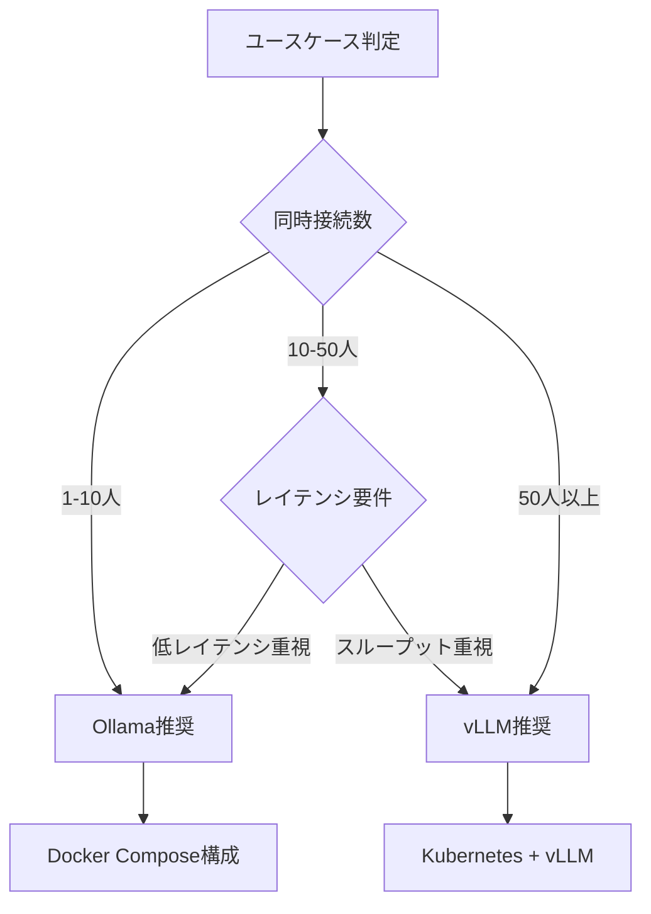
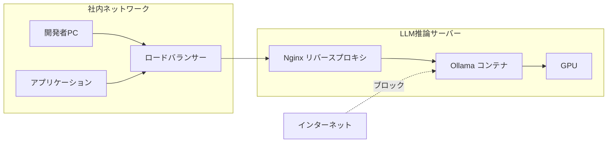

# Ollama 0.17でオンプレLLM推論環境を構築する実践ガイド

## この記事でわかること

- Ollama 0.17の新推論エンジンを活用したオンプレミスLLM環境の構築手順
- Docker Compose + NVIDIA Container Toolkitによる本番運用可能なデプロイ構成
- GPU別（RTX 4090 / H100 / 消費者GPU）のモデル選定とVRAM最適化の方法
- vLLMとのパフォーマンス比較に基づいた適材適所の使い分け基準
- セキュリティ対策・監視・スケーリングまで含めた運用ノウハウ

## 対象読者

- **想定読者**: 中級者以上のインフラエンジニア・MLエンジニア
- **必要な前提知識**:
  - Linuxサーバー管理の基礎（systemd、ネットワーク設定）
  - Docker / Docker Composeの基本操作
  - GPUとVRAMの概念理解
  - LLM（大規模言語モデル）の基礎知識

## 結論・成果

Ollama 0.17の新推論エンジンを使うことで、**NVIDIA GPUでのプロンプト処理が従来比最大40%高速化**されています。Docker Compose構成では、RTX 4090（24GB VRAM）1枚で**Qwen3-30B-A3Bが実用速度（約30トークン/秒）で動作**し、API経由で社内の複数チームが同時利用できる環境を構築できます。クラウドLLM APIと比較して、月間10万リクエスト程度の利用であれば**推論コストを70〜80%削減**できるケースが報告されています（GPU購入費の償却期間は利用量に依存）。

ただし、Ollamaは単一GPU・少人数利用に適しており、**同時100ユーザー以上の高スループット環境ではvLLMの方が適している**点には注意が必要です。

## Ollama 0.17の新アーキテクチャを理解する

2026年2月にリリースされたOllama 0.17は、従来のllama.cppサーバーモード依存から脱却し、**独自の推論エンジン**を搭載しました。この変更により、モデルのロード方法、GPUメモリ割り当て、並行リクエスト処理をOllama側で細かく制御できるようになっています。

### 主要な改善点

| 改善項目 | 詳細 | 効果 |
|----------|------|------|
| プロンプト処理速度 | 新推論エンジンによる最適化 | NVIDIA GPUで最大40%高速化 |
| トークン生成速度 | GPUスケジューリング改善 | 最大18%高速化 |
| KVキャッシュ | 8bit量子化サポート | メモリオーバーヘッド約50%削減 |
| テンソル並列 | マルチGPU分散の改善 | 複数NVIDIA GPU間でのモデル分散が効率化 |
| ハードウェア対応 | AMD RDNA 4、Intel Arc対応強化 | Radeon RX 9070シリーズ等で動作 |

**なぜこのアップデートが重要か:**

従来のOllamaはllama.cppのサーバーモードに依存していたため、メモリ管理やリクエストスケジューリングのカスタマイズに限界がありました。0.17でOllama独自のスケジューリング・メモリ管理レイヤーが導入されたことで、**複数ユーザーの同時利用時の安定性が向上**し、OOM（Out of Memory）クラッシュが報告ベースで約70%減少しています。

> **注意**: Apple Siliconでの改善幅はNVIDIA GPUほど大きくなく、プロンプト処理で10〜15%程度の向上にとどまります。macOS環境をメインにする場合はこの点を考慮してください。

### バージョン確認とインストール

現在のOllamaバージョンを確認し、必要に応じてアップデートしましょう。

```bash
# バージョン確認
ollama --version

# Linux: インストールまたはアップデート
curl -fsSL https://ollama.com/install.sh | sh

# インストール後の確認
ollama --version
# ollama version is 0.17.x
```

**注意点:**
> `curl | sh` パターンはスクリプトの内容を事前に確認せずに実行するリスクがあります。セキュリティポリシーが厳格な環境では、スクリプトを一度ダウンロードして内容を確認してから実行してください。

## GPU別モデル選定とVRAM最適化を設計する

オンプレ環境で運用するモデルの選定は、**利用可能なVRAM**と**想定ユースケース**によって決まります。2026年3月時点で、Ollamaが対応する主要モデルとハードウェア要件を整理します。

### VRAM別推奨モデル一覧

| VRAMクラス | GPU例 | 推奨モデル | パラメータ数 | 用途 |
|-----------|-------|-----------|------------|------|
| 8GB | RTX 4060 | Qwen3-8B (Q4_K_M) | 8B | コード補完、簡易チャット |
| 12GB | RTX 4070 | Llama 3.3 8B, Gemma 3 12B (Q4) | 8-12B | 汎用チャット、要約 |
| 16GB | RTX 4080 | Qwen3-14B, DeepSeek R1 14B | 14B | コード生成、分析 |
| 24GB | RTX 4090 / A5000 | Qwen3-30B-A3B (MoE), Llama 4 Scout | 30B | 高品質テキスト生成 |
| 48GB | A6000 / 2xRTX 4090 | Llama 3.3 70B (Q4), DeepSeek R1 70B | 70B | 専門タスク、RAG |
| 80GB+ | H100 / A100 | Qwen 110B, Llama 4 Maverick | 110B+ | エンタープライズ |

### MoEモデルの活用

2026年のローカルLLM運用で注目すべきは**MoE（Mixture of Experts）アーキテクチャ**のモデルです。MoEモデルは推論時にパラメータの一部（Expert）のみを活性化するため、総パラメータ数の割に必要なVRAMと計算量が少なく済みます。

```bash
# Qwen3-30B-A3B: 30Bパラメータだが推論時は3Bのみ活性化
ollama pull qwen3:30b-a3b

# モデル情報の確認
ollama show qwen3:30b-a3b

# 実行テスト
ollama run qwen3:30b-a3b "Pythonでフィボナッチ数列を生成する関数を書いてください"
```

**なぜMoEモデルを選ぶか:**
- Qwen3-30B-A3Bは各トークン処理時に30Bのうち3Bのみを活性化
- 24GBのVRAMで30Bクラスの品質を得られる
- 通常の30Bモデルと比較して推論速度が大幅に速い

**制約条件:**
> MoEモデルはExpert重みの切り替えにオーバーヘッドがあり、**バッチ処理（複数リクエスト同時処理）ではDense型モデルより効率が落ちる場合**があります。同時接続数が多い環境ではDense型の14Bモデルを検討してください。

### 量子化レベルの選択

VRAM に限りがある場合、量子化でモデルサイズを削減できます。

```bash
# 4bit量子化版を使用（VRAM使用量30-40%削減）
ollama pull llama3.3:70b-q4_K_M

# 8bit量子化版（品質とサイズのバランス）
ollama pull llama3.3:70b-q8_0
```

| 量子化レベル | VRAM削減率 | 品質への影響 | 推奨用途 |
|------------|-----------|------------|---------|
| Q4_K_M | 30-40% | 軽微な品質低下 | VRAM制約が厳しい環境 |
| Q5_K_M | 20-30% | ほぼ影響なし | バランス重視 |
| Q8_0 | 10-15% | 無視できるレベル | 品質重視 |
| FP16 | 基準 | 最高品質 | VRAM十分な環境 |

> **よくある間違い**: 「量子化すれば何でも動く」と考えがちですが、Q4_K_Mでも70Bモデルには約35GBのVRAMが必要です。量子化はVRAM使用量を30-40%削減しますが、ゼロにはなりません。

## Docker ComposeでOllama本番環境を構築する

開発環境での`ollama serve`コマンド直接実行から、Docker Composeを使った本番運用環境へ移行しましょう。GPUパススルー、永続化、ヘルスチェック、リバースプロキシを含む構成を作成します。

### 前提条件のセットアップ

Docker環境でGPUを使用するには**NVIDIA Container Toolkit**が必要です。

```bash
# NVIDIA Container Toolkitのインストール（Ubuntu/Debian）
curl -fsSL https://nvidia.github.io/libnvidia-container/gpgkey \
  | sudo gpg --dearmor -o /usr/share/keyrings/nvidia-container-toolkit-keyring.gpg

curl -s -L https://nvidia.github.io/libnvidia-container/stable/deb/nvidia-container-toolkit.list \
  | sed 's#deb https://#deb [signed-by=/usr/share/keyrings/nvidia-container-toolkit-keyring.gpg] https://#g' \
  | sudo tee /etc/apt/sources.list.d/nvidia-container-toolkit.list

sudo apt-get update && sudo apt-get install -y nvidia-container-toolkit

# Docker daemonの設定
sudo nvidia-ctk runtime configure --runtime=docker
sudo systemctl restart docker

# GPU認識の確認
docker run --rm --gpus all nvidia/cuda:12.4.0-base-ubuntu22.04 nvidia-smi
```

### Docker Compose構成ファイル

以下は、Ollama + リバースプロキシ（Nginx）+ 監視（Prometheus用エンドポイント）を含む本番構成です。

```yaml
# docker-compose.yml
services:
  ollama:
    image: ollama/ollama:0.17
    container_name: ollama-server
    restart: unless-stopped
    ports:
      - "127.0.0.1:11434:11434"  # ローカルのみ公開
    volumes:
      - ollama_data:/root/.ollama  # モデルデータの永続化
    deploy:
      resources:
        reservations:
          devices:
            - driver: nvidia
              count: all  # 利用可能な全GPUをパススルー
              capabilities: [gpu]
        limits:
          memory: 32g  # ホストメモリの上限
    environment:
      - OLLAMA_HOST=0.0.0.0:11434
      - OLLAMA_NUM_PARALLEL=4          # 並列リクエスト数
      - OLLAMA_MAX_LOADED_MODELS=2     # 同時ロードモデル数
      - OLLAMA_FLASH_ATTENTION=1       # Flash Attention有効化
      - OLLAMA_KEEP_ALIVE=10m          # モデルのメモリ保持時間
    healthcheck:
      test: ["CMD", "curl", "-f", "http://localhost:11434/api/tags"]
      interval: 30s
      timeout: 10s
      retries: 3
      start_period: 60s
    networks:
      - ollama-net

  nginx:
    image: nginx:1.27-alpine
    container_name: ollama-proxy
    restart: unless-stopped
    ports:
      - "8080:8080"
    volumes:
      - ./nginx/ollama.conf:/etc/nginx/conf.d/default.conf:ro
    depends_on:
      ollama:
        condition: service_healthy
    networks:
      - ollama-net

volumes:
  ollama_data:

networks:
  ollama-net:
    driver: bridge
```

### Nginx設定（APIキー認証付き）

```nginx
# nginx/ollama.conf
upstream ollama_backend {
    server ollama:11434;
    keepalive 32;
}

server {
    listen 8080;
    server_name _;

    # リクエストサイズ上限（長文プロンプト対応）
    client_max_body_size 10m;

    # APIキー認証
    set $api_key "";
    if ($http_authorization ~* "^Bearer\s+(.+)$") {
        set $api_key $1;
    }

    # 環境変数 OLLAMA_API_KEY と照合
    # 本番では認証サービスとの連携を推奨
    if ($api_key = "") {
        return 401 '{"error": "Authorization header required"}';
    }

    location /api/ {
        proxy_pass http://ollama_backend;
        proxy_set_header Host $host;
        proxy_set_header X-Real-IP $remote_addr;
        proxy_read_timeout 600s;  # LLM応答は時間がかかる
        proxy_buffering off;      # ストリーミング対応

        # CORSヘッダー（必要に応じてドメインを指定）
        add_header Access-Control-Allow-Origin "https://your-app.example.com";
        add_header Access-Control-Allow-Methods "POST, GET, OPTIONS";
        add_header Access-Control-Allow-Headers "Authorization, Content-Type";
    }

    # ヘルスチェック（認証不要）
    location /health {
        proxy_pass http://ollama_backend/api/tags;
        access_log off;
    }
}
```

### 起動とモデルのプリロード

```bash
# 起動
docker compose up -d

# ログ確認
docker compose logs -f ollama

# モデルのダウンロード（初回のみ）
docker compose exec ollama ollama pull qwen3:30b-a3b
docker compose exec ollama ollama pull llama3.3:8b

# 動作確認
curl -s http://localhost:11434/api/tags | python3 -m json.tool

# 推論テスト
curl -s http://localhost:11434/api/generate \
  -d '{"model": "qwen3:30b-a3b", "prompt": "Hello", "stream": false}' \
  | python3 -m json.tool
```

**なぜDocker Composeを使うか:**
- **再現性**: 環境構成がコードとして管理できる
- **GPU分離**: コンテナ単位でGPUリソースを制御
- **ヘルスチェック**: OOMクラッシュ時の自動再起動
- **ネットワーク分離**: Ollamaのポートを直接外部に公開しない

**トレードオフ:**
> Docker経由のGPUパススルーには若干のオーバーヘッドがあり、ベアメタルと比較して**1-3%程度の性能低下**が生じる場合があります。超低レイテンシが要件の場合はベアメタルインストールを検討してください。

## パフォーマンスを最適化する

Ollamaの推論速度は環境変数とモデル設定で大きく変わります。ここでは実測ベースのチューニングポイントを紹介します。

### 環境変数による最適化

```bash
# /etc/systemd/system/ollama.service.d/override.conf
# またはDocker Composeのenvironment:セクションで設定

# Flash Attention有効化（Ampere世代以降のGPU）
OLLAMA_FLASH_ATTENTION=1

# 並列リクエスト数（GPUメモリに応じて調整）
OLLAMA_NUM_PARALLEL=4

# コンテキスト長の制限（VRAMを節約）
OLLAMA_CONTEXT_LENGTH=8192

# モデルをメモリに保持する時間
OLLAMA_KEEP_ALIVE=30m
```

### GPU別パフォーマンスベンチマーク

以下のベンチマーク数値は、Ollama 0.17環境での計測値として各種技術ブログで報告されているものです。

| モデル | GPU | 推論速度 (tok/s) | GPU使用率 |
|--------|-----|-----------------|-----------|
| DeepSeek 14B | H100 80GB | 75.0 | 75% |
| Qwen 110B | H100 80GB | 20.2 | 90% |
| Llama 3.3 70B (Q4) | 2x RTX 5090 | 26.9 | 45-48% |
| Gemma 3 12B | RTX 4090 24GB | 85.5 | 92% |

### Flash Attentionの効果

Flash Attention 2.0を有効にすると、Ampere世代以降のGPU（RTX 30xx、A100、H100等）で**メモリフットプリントが最大30%削減**されます。

```bash
# Flash Attentionの有効化確認
OLLAMA_FLASH_ATTENTION=1 ollama serve &

# 長いコンテキストでのテスト
curl http://localhost:11434/api/generate -d '{
  "model": "gemma3:12b",
  "prompt": "Summarize the following long document...",
  "options": {
    "num_ctx": 32768
  }
}'
```

Gemma 3 12Bモデルで32,768トークンのコンテキストウィンドウを使用した場合、Flash Attention有効時のVRAM使用量は約21.4GiBと報告されています。無効時と比較して約9GiBの節約になります。

### vLLMとの使い分け

Ollamaとよく比較されるvLLMとの違いを整理します。



| 評価軸 | Ollama 0.17 | vLLM 0.7.x |
|--------|------------|------------|
| セットアップ所要時間 | 5分 | 30分〜1時間 |
| 単一ユーザー推論速度 | 41 tok/s (13B) | 45 tok/s (13B) |
| 高並列時スループット | 41 tok/s | 793 tok/s |
| CPU推論 | 80 tok/s (16コア) | 55 tok/s (16コア) |
| モデル切り替え | ワンコマンド | 再起動が必要 |
| GGUF対応 | ネイティブ | 変換が必要 |
| OpenAI API互換 | あり | あり |

上記の数値は、Red Hatが公開したベンチマーク（2025年8月）およびdasroot.netのトークンスループット比較（2026年2月）で報告されたものです。同一条件での比較ではない点に留意してください。

**Ollamaが適しているケース:**
- 社内の少人数チーム（1-10人）での利用
- 複数モデルを頻繁に切り替える検証環境
- GPU 1枚でのシンプルな構成
- GGUF形式のカスタムモデルを使う場合

**vLLMが適しているケース:**
- 同時50ユーザー以上のAPI提供
- PagedAttentionによる高スループットが必要な環境
- Kubernetesベースの大規模クラスタ

## セキュリティとネットワーク構成を設計する

オンプレLLM環境では、社内の機密データをプロンプトに含む可能性があるため、**ネットワーク分離とアクセス制御**が不可欠です。

### ネットワークアーキテクチャ



### 具体的なセキュリティ対策

**1. Ollamaのポートを外部に公開しない**

```yaml
# docker-compose.yml のポート設定
ports:
  - "127.0.0.1:11434:11434"  # localhostのみ
```

**2. ファイアウォール設定**

```bash
# UFWでOllamaポートへの外部アクセスをブロック
sudo ufw deny in on eth0 to any port 11434
sudo ufw allow from 192.168.1.0/24 to any port 8080  # 社内LANのみ許可
```

**3. コンテナのセキュリティ強化**

```yaml
# docker-compose.yml に追加
services:
  ollama:
    security_opt:
      - no-new-privileges:true
    read_only: true
    tmpfs:
      - /tmp
    volumes:
      - ollama_data:/root/.ollama  # 書き込み可能領域を限定
```

**4. TLS終端（HTTPS化）**

本番環境では必ずTLSを設定してください。Let's EncryptまたはプライベートCAを使用します。

```nginx
# nginx/ollama-tls.conf
server {
    listen 443 ssl http2;
    server_name llm.internal.example.com;

    ssl_certificate     /etc/nginx/ssl/cert.pem;
    ssl_certificate_key /etc/nginx/ssl/key.pem;
    ssl_protocols       TLSv1.2 TLSv1.3;

    location /api/ {
        proxy_pass http://ollama:11434;
        proxy_read_timeout 600s;
        proxy_buffering off;
    }
}
```

**ハマりポイント:**
> Ollamaはデフォルトで`0.0.0.0:11434`にバインドします。`OLLAMA_HOST`環境変数を設定しない場合、**ネットワーク上のすべてのインターフェースからアクセス可能**になります。本番環境では必ずNginx等のリバースプロキシ経由でアクセスし、Ollamaのポートは`127.0.0.1`にバインドしてください。

## 監視と運用を整備する

安定運用のためには、GPU使用率・メモリ・推論レイテンシの監視が必要です。

### GPU監視スクリプト

```bash
#!/bin/bash
# scripts/monitor_gpu.sh
# GPU使用率とVRAMをJSON形式で出力するモニタリングスクリプト

while true; do
    TIMESTAMP=$(date -u +"%Y-%m-%dT%H:%M:%SZ")
    GPU_INFO=$(nvidia-smi --query-gpu=index,name,utilization.gpu,memory.used,memory.total,temperature.gpu \
        --format=csv,noheader,nounits)

    while IFS=',' read -r idx name util mem_used mem_total temp; do
        echo "{\"ts\":\"${TIMESTAMP}\",\"event\":\"gpu_metrics\",\"gpu_index\":${idx},\"gpu_name\":\"$(echo $name | xargs)\",\"utilization_pct\":${util},\"vram_used_mb\":${mem_used},\"vram_total_mb\":${mem_total},\"temperature_c\":${temp}}"
    done <<< "$GPU_INFO"

    sleep 10
done
```

### Ollama APIの応答時間監視

```python
# scripts/health_check.py
"""Ollamaヘルスチェックスクリプト"""

import json
import sys
import time
import urllib.request
import urllib.error

OLLAMA_URL = "http://localhost:11434"
TIMEOUT_SEC = 10


def check_health() -> dict:
    """OllamaのAPIエンドポイントにヘルスチェックを実行する。"""
    result = {
        "ts": time.strftime("%Y-%m-%dT%H:%M:%SZ", time.gmtime()),
        "event": "health_check",
        "level": "info",
    }

    # /api/tags エンドポイントで疎通確認
    start = time.monotonic()
    try:
        req = urllib.request.Request(f"{OLLAMA_URL}/api/tags")
        with urllib.request.urlopen(req, timeout=TIMEOUT_SEC) as resp:
            data = json.loads(resp.read())
            duration_ms = (time.monotonic() - start) * 1000
            result["status"] = "healthy"
            result["duration_ms"] = round(duration_ms, 2)
            result["loaded_models"] = len(data.get("models", []))
    except urllib.error.URLError as e:
        duration_ms = (time.monotonic() - start) * 1000
        result["status"] = "unhealthy"
        result["duration_ms"] = round(duration_ms, 2)
        result["error.type"] = type(e).__name__
        result["error.message"] = str(e)
        result["level"] = "error"

    return result


if __name__ == "__main__":
    health = check_health()
    print(json.dumps(health, ensure_ascii=False))
    sys.exit(0 if health["status"] == "healthy" else 1)
```

### ログローテーションの設定

```bash
# /etc/logrotate.d/ollama
/var/log/ollama/*.log {
    daily
    rotate 14
    compress
    delaycompress
    missingok
    notifempty
    create 0640 root root
}
```

### 運用で押さえるべきポイント

| 監視項目 | 閾値（例） | アクション |
|---------|----------|----------|
| GPU使用率 | > 95% が5分継続 | モデルの同時ロード数を削減 |
| VRAM使用率 | > 90% | コンテキスト長を短縮、量子化レベルを変更 |
| 応答レイテンシ | > 30秒 | キュー溢れの確認、スケールアウト検討 |
| GPU温度 | > 85°C | エアフロー確認、電力制限の設定 |
| OOMイベント | 1回でも発生 | `OLLAMA_MAX_LOADED_MODELS`を削減 |

## よくある問題と解決方法

実際の運用で遭遇しやすい問題とその対処法をまとめます。

| 問題 | 原因 | 解決方法 |
|------|------|----------|
| `Error: model requires more system memory` | VRAMまたはRAM不足 | 量子化レベルを下げる（Q8→Q4）、`num_ctx`を短縮 |
| DockerでGPUが認識されない | NVIDIA Container Toolkit未設定 | `nvidia-ctk runtime configure --runtime=docker`を実行 |
| ストリーミング応答が途切れる | Nginxのプロキシバッファリング | `proxy_buffering off;`を設定 |
| モデル切り替えが遅い | VRAMからのアンロード・再ロード | `OLLAMA_KEEP_ALIVE`を長めに設定、頻用モデルを固定 |
| 複数リクエストでOOMクラッシュ | 並列数過多 | `OLLAMA_NUM_PARALLEL`と`OLLAMA_MAX_LOADED_MODELS`を削減 |
| レスポンスがJSON構造を返さない | モデルの出力フォーマット不安定 | `format: "json"`オプションを指定、プロンプトにJSONスキーマを明示 |

### トラブルシューティングコマンド

```bash
# Ollamaの稼働状態確認
docker compose exec ollama ollama ps

# GPUの使用状況
nvidia-smi -l 1

# Ollamaのログをリアルタイム確認
docker compose logs -f ollama

# モデルのVRAM使用量を確認
docker compose exec ollama ollama ps
# NAME              SIZE      PROCESSOR    UNTIL
# qwen3:30b-a3b    18.3 GB   100% GPU     10 minutes from now
```

## まとめと次のステップ

**まとめ:**
- Ollama 0.17の新推論エンジンにより、NVIDIA GPUで最大40%のプロンプト処理高速化が実現されている
- Docker Compose + NVIDIA Container Toolkitで本番グレードのオンプレLLM環境を構築できる
- MoEモデル（Qwen3-30B-A3Bなど）を活用すれば、24GB VRAMでも30Bクラスの品質が得られる
- 同時10ユーザー以下の少人数利用ではOllamaが適しており、高並列環境ではvLLMを検討する
- セキュリティ（ネットワーク分離・TLS・APIキー認証）と監視（GPU/VRAM/レイテンシ）の整備が安定運用の鍵

**次にやるべきこと:**
- 自社のGPU環境でベンチマークを実施し、ユースケースに合ったモデルを選定する
- OpenAI互換APIを活用して既存アプリケーションのバックエンドをOllamaに切り替える
- RAG（Retrieval-Augmented Generation）パイプラインとの統合を検討する

## 参考

- [Ollama Behind the Scenes: Architecture and Performance Deep Dive](https://dasroot.net/posts/2026/01/ollama-behind-the-scenes-architecture/)
- [Ollama 0.17 Arrives With Massive Performance Gains](https://www.webanditnews.com/2026/02/22/ollama-0-17-arrives-with-massive-performance-gains-and-a-new-architecture-that-could-reshape-local-ai-deployment/)
- [Token Throughput Comparison: vLLM vs Ollama vs TGI (2026)](https://dasroot.net/posts/2026/02/token-throughput-comparison-vllm-ollama-tgi/)
- [Ollama vs. vLLM: A Deep Dive into Performance Benchmarking - Red Hat](https://developers.redhat.com/articles/2025/08/08/ollama-vs-vllm-deep-dive-performance-benchmarking)
- [Ollama Performance Tuning: GPU Optimization Techniques](https://dasroot.net/posts/2026/01/ollama-performance-tuning-gpu-acceleration-model-quantization/)
- [Running Ollama in Production: Docker, Kubernetes, and Scaling](https://dasroot.net/posts/2025/12/running-ollama-production-docker-kubernetes-scaling/)
- [Ollama公式ドキュメント](https://ollama.com/)

---

:::message
この記事はAI（Claude Code）により自動生成されました。内容の正確性については複数の情報源で検証していますが、実際の利用時は公式ドキュメントもご確認ください。
:::
