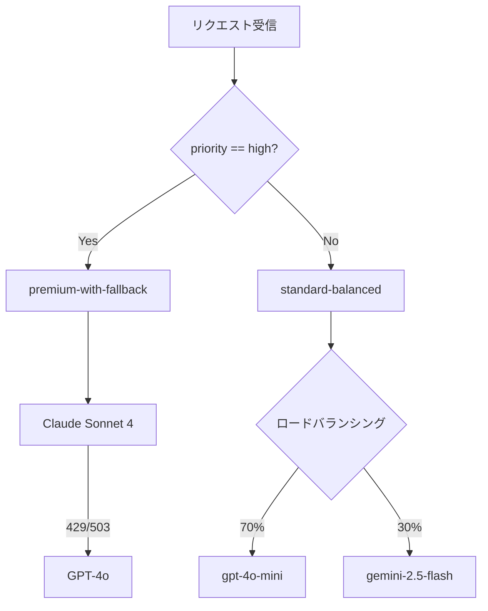
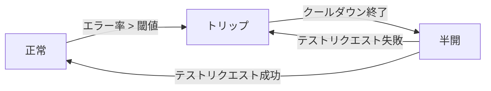

# Portkey AIゲートウェイ実装Deep Dive：条件付きルーティングとコスト最適化戦略

## この記事でわかること

- Portkey AIゲートウェイの条件付きルーティングを使い、ユーザー属性やタスク種別でLLMプロバイダーを動的に振り分ける実装方法
- 重み付きロードバランシングとフォールバックチェーンを組み合わせた高可用性アーキテクチャの構築手順
- サーキットブレーカーとカナリアテストを活用した本番環境での段階的モデル切り替え
- コスト最適化の4パターン（タスクベースルーティング・キャッシュ・重み調整・予算制限）の具体的な設定例
- 条件付きルーティング×ロードバランシング×フォールバックをネストした複合ルーティング戦略の設計

## 対象読者

- **想定読者**: 中級〜上級のPythonバックエンド開発者で、複数のLLMプロバイダーを本番運用しているチーム
- **必要な前提知識**:
  - Python 3.10以降の非同期プログラミング（async/await）
  - OpenAI SDK（`openai` パッケージ）の基本的なChat Completions API利用経験
  - LLMプロバイダー（OpenAI、Anthropic、Google等）のAPIキー管理の基礎
  - JSON/YAMLによる設定ファイル管理

## 結論・成果

Portkey AIゲートウェイの条件付きルーティングを導入すると、**単一のAPIエンドポイントから1,600以上のモデルを動的に切り替え**られます。Portkeyの公式発表によると、24,000以上の組織で利用され、1日あたり500億以上のLLMトークンを処理しています。本記事で実装する「タスクベース条件付きルーティング×重み付きロードバランシング×フォールバックチェーン」の複合戦略により、**API障害時の自動復旧**と**タスク特性に応じたモデル選択**を1つのゲートウェイ設定で実現できます。料金面ではDev（無料）プランで月10,000ログまで利用でき、Proプランでは追加100,000ログあたり$9の従量課金です。

:::message
関連記事: Portkeyの全体像（フォールバック・キャッシュ・ガードレール）については「[Portkey AIゲートウェイで本番LLMアプリの信頼性とコストを最適化する](https://zenn.dev/0h_n0/articles/52a2ca72092ee5)」をご覧ください。本記事ではルーティング戦略の実装詳細とコスト最適化に焦点を当てます。
:::

## 条件付きルーティングを実装する

Portkey AIゲートウェイの条件付きルーティングは、リクエストのメタデータやパラメータに基づいてLLMプロバイダーを動的に振り分ける機能です。MongoDB風のクエリ演算子（`$eq`、`$gt`、`$in`など）でルーティング条件を記述でき、すべての判定はゲートウェイのエッジで処理されるためレイテンシへの影響を抑えられます。

### ユーザー属性ベースのルーティングを設定する

有料ユーザーには高精度モデル、無料ユーザーにはコスト効率の高いモデルを割り当てるパターンを見ていきましょう。Portkey Python SDK v2.2.0（`pip install portkey-ai`）を使用します。

```python
# portkey_tier_routing.py
from portkey_ai import Portkey

# 条件付きルーティングの設定
tier_routing_config = {
    "strategy": {
        "mode": "conditional",
        "conditions": [
            {
                "query": {"metadata.user_plan": {"$eq": "enterprise"}},
                "then": "high-accuracy"
            },
            {
                "query": {"metadata.user_plan": {"$eq": "pro"}},
                "then": "balanced"
            }
        ],
        "default": "cost-efficient"
    },
    "targets": [
        {
            "name": "high-accuracy",
            "virtual_key": "anthropic-prod-key",
            "override_params": {"model": "claude-sonnet-4-20250514"}
        },
        {
            "name": "balanced",
            "virtual_key": "openai-prod-key",
            "override_params": {"model": "gpt-4o"}
        },
        {
            "name": "cost-efficient",
            "virtual_key": "openai-prod-key",
            "override_params": {"model": "gpt-4o-mini"}
        }
    ]
}

# Portkeyクライアントの初期化
client = Portkey(
    api_key="your_portkey_api_key",
    config=tier_routing_config
)

# リクエスト時にメタデータでユーザー属性を指定
response = client.with_options(
    metadata={"user_plan": "enterprise", "user_id": "user-12345"}
).chat.completions.create(
    messages=[{"role": "user", "content": "四半期レポートを要約してください"}]
)

print(response.choices[0].message.content)
```

**なぜこの実装を選んだか:**

- アプリケーションコードの変更なしにルーティングロジックを更新できる（設定のみの変更）
- `metadata`はリクエストごとに動的に設定できるため、認証ミドルウェアから取得したユーザー属性をそのまま渡せる
- 条件は上から順に評価され、最初に一致した条件のターゲットが使用される

**注意点:**

> 条件付きルーティングのクエリパスは2セグメントまでに制限されています（例: `metadata.user_plan`は有効ですが、`metadata.user.plan.tier`のようなネストしたパスは使用できません）。複雑な属性はフラットなキーに変換してからメタデータに設定してください。

### タスク種別でモデルを最適化する

同じアプリケーション内でもタスクの特性によって適切なモデルは異なります。コーディング支援にはコード特化モデル、要約タスクには高速・低コストモデルを割り当てるパターンを実装してみましょう。

```python
# portkey_task_routing.py
from portkey_ai import Portkey

task_routing_config = {
    "strategy": {
        "mode": "conditional",
        "conditions": [
            {
                "query": {"metadata.task_type": {"$eq": "coding"}},
                "then": "code-specialist"
            },
            {
                "query": {"metadata.task_type": {"$eq": "creative_writing"}},
                "then": "creative-model"
            },
            {
                "query": {
                    "$and": [
                        {"metadata.task_type": {"$eq": "summarization"}},
                        {"params.temperature": {"$lte": 0.3}}
                    ]
                },
                "then": "fast-factual"
            }
        ],
        "default": "general-purpose"
    },
    "targets": [
        {
            "name": "code-specialist",
            "virtual_key": "anthropic-key",
            "override_params": {"model": "claude-sonnet-4-20250514"}
        },
        {
            "name": "creative-model",
            "virtual_key": "anthropic-key",
            "override_params": {"model": "claude-sonnet-4-20250514", "temperature": 0.9}
        },
        {
            "name": "fast-factual",
            "virtual_key": "openai-key",
            "override_params": {"model": "gpt-4o-mini", "temperature": 0.1}
        },
        {
            "name": "general-purpose",
            "virtual_key": "openai-key",
            "override_params": {"model": "gpt-4o"}
        }
    ]
}

client = Portkey(api_key="your_portkey_api_key", config=task_routing_config)

# コーディングタスク → claude-sonnet-4に自動ルーティング
code_response = client.with_options(
    metadata={"task_type": "coding"}
).chat.completions.create(
    messages=[{"role": "user", "content": "Pythonでバイナリサーチを実装してください"}]
)

# 要約タスク（低temperature） → gpt-4o-miniに自動ルーティング
summary_response = client.with_options(
    metadata={"task_type": "summarization"}
).chat.completions.create(
    messages=[{"role": "user", "content": "この文書を3行で要約してください"}],
    temperature=0.2
)
```

`$and`演算子を使うと、メタデータとリクエストパラメータの両方を条件に組み合わせられます。上記の例では、タスクが「要約」かつtemperatureが0.3以下の場合にのみ高速・低コストモデルにルーティングされます。

## 重み付きロードバランシングとフォールバックを組み合わせる

条件付きルーティングで「どのモデル群を使うか」を決めた後、各ターゲット内でロードバランシングとフォールバックを組み合わせると、高可用性と負荷分散を同時に実現できます。Portkeyの設定はネスト（入れ子）構造に対応しており、各ターゲット自体が別の戦略を持てます。

### 重み付きロードバランシングを設定する

複数のプロバイダーやAPIキーにリクエストを分散させることで、レートリミットの回避と障害影響の局所化を実現します。

```python
# portkey_loadbalance.py
from portkey_ai import Portkey

loadbalance_config = {
    "strategy": {
        "mode": "loadbalance"
    },
    "targets": [
        {
            "virtual_key": "openai-key-1",
            "override_params": {"model": "gpt-4o"},
            "weight": 0.6
        },
        {
            "virtual_key": "openai-key-2",
            "override_params": {"model": "gpt-4o"},
            "weight": 0.25
        },
        {
            "virtual_key": "azure-openai-key",
            "override_params": {"model": "gpt-4o"},
            "weight": 0.15
        }
    ]
}

client = Portkey(api_key="your_portkey_api_key", config=loadbalance_config)

# リクエストは重みに応じて自動分散される
response = client.chat.completions.create(
    messages=[{"role": "user", "content": "売上データを分析してください"}],
    model="gpt-4o"
)
```

**なぜ重み付き分散が必要か:**

- 単一APIキーのレートリミット（OpenAIはTier 1で毎分500リクエスト）を回避できる
- 主系60%・副系25%・Azure系15%のように、信頼性の高いキーに多くのトラフィックを割り当てつつ冗長性を確保できる
- 重みの合計が1.0である必要はなく、比率として扱われる

### フォールバックチェーンを構築する

プロバイダー障害に備えて、プライマリ → セカンダリ → ターシャリの順に自動切り替えを行うフォールバックチェーンを構築します。

```python
# portkey_fallback.py
from portkey_ai import Portkey

fallback_config = {
    "strategy": {
        "mode": "fallback",
        "on_status_codes": [429, 500, 503]
    },
    "targets": [
        {
            "virtual_key": "openai-key",
            "override_params": {"model": "gpt-4o"}
        },
        {
            "virtual_key": "anthropic-key",
            "override_params": {"model": "claude-sonnet-4-20250514"}
        },
        {
            "virtual_key": "google-key",
            "override_params": {"model": "gemini-2.5-pro"}
        }
    ]
}

client = Portkey(api_key="your_portkey_api_key", config=fallback_config)

# OpenAIが429/500/503を返したらAnthropicに自動切り替え
# Anthropicも失敗したらGoogleに切り替え
response = client.chat.completions.create(
    messages=[{"role": "user", "content": "市場分析レポートを作成してください"}],
    model="gpt-4o"
)
```

デフォルトではすべての非2xxレスポンスでフォールバックが発動しますが、`on_status_codes`で特定のHTTPステータスコード（429: レートリミット、503: サービス利用不可など）に限定することで、意図しないフォールバックを防げます。

**注意点:**

> フォールバックチェーンを使う場合、各ターゲットのモデルがアプリケーションの要件を満たしていることを事前に検証してください。たとえば、GPT-4oからgpt-4o-miniへのフォールバックでは、出力品質が大きく異なる可能性があります。プロバイダー間（OpenAI → Anthropic）のフォールバックでは、レスポンスフォーマットの微妙な差異にも注意が必要です。

### 複合戦略：条件付きルーティング × ロードバランシング × フォールバック

Portkeyの設定はネスト可能なため、条件付きルーティングの各ターゲットにロードバランシングやフォールバックを組み込めます。実際の本番環境では以下のような複合構成がよく使われます。

```python
# portkey_composite_strategy.py
from portkey_ai import Portkey

composite_config = {
    "strategy": {
        "mode": "conditional",
        "conditions": [
            {
                "query": {"metadata.priority": {"$eq": "high"}},
                "then": "premium-with-fallback"
            }
        ],
        "default": "standard-balanced"
    },
    "targets": [
        {
            "name": "premium-with-fallback",
            "strategy": {"mode": "fallback", "on_status_codes": [429, 503]},
            "targets": [
                {
                    "virtual_key": "anthropic-key",
                    "override_params": {"model": "claude-sonnet-4-20250514"}
                },
                {
                    "virtual_key": "openai-key",
                    "override_params": {"model": "gpt-4o"}
                }
            ]
        },
        {
            "name": "standard-balanced",
            "strategy": {"mode": "loadbalance"},
            "targets": [
                {
                    "virtual_key": "openai-key",
                    "override_params": {"model": "gpt-4o-mini"},
                    "weight": 0.7
                },
                {
                    "virtual_key": "google-key",
                    "override_params": {"model": "gemini-2.5-flash"},
                    "weight": 0.3
                }
            ]
        }
    ]
}

client = Portkey(api_key="your_portkey_api_key", config=composite_config)

# 高優先度リクエスト → Claude Sonnet 4（障害時はGPT-4oにフォールバック）
high_priority = client.with_options(
    metadata={"priority": "high"}
).chat.completions.create(
    messages=[{"role": "user", "content": "重要な契約書をレビューしてください"}]
)

# 通常リクエスト → gpt-4o-mini(70%) / gemini-2.5-flash(30%) でロードバランシング
standard = client.with_options(
    metadata={"priority": "standard"}
).chat.completions.create(
    messages=[{"role": "user", "content": "FAQの回答を生成してください"}]
)
```

この複合構成の処理フローを以下に示します。



## サーキットブレーカーとカナリアテストで安全にモデルを切り替える

本番環境で新しいモデルに切り替える際、全トラフィックを一度に移行するのはリスクが高い作業です。Portkeyはサーキットブレーカーとカナリアテストの仕組みで、段階的かつ安全なモデル移行を支援します。

### サーキットブレーカーの動作を理解する

サーキットブレーカーは、特定のターゲットのエラー率や応答時間が閾値を超えた場合に、そのルートを一時的に無効化（トリップ）します。トリップ中のトラフィックはフォールバック先に自動的に迂回されます。クールダウン期間終了後、ルートは自動的に再有効化されます。



この仕組みにより、障害が発生したプロバイダーへのリクエスト送信を防ぎ、全体の可用性を維持できます。Portkeyの公式ブログによると、99.99%のアップタイムでも年間52分のダウンタイムが発生し得るため、サーキットブレーカーによる自動保護は大規模システムでは必須の対策です。

**注意点:**

> サーキットブレーカーはプロバイダー単位で発動するため、同一プロバイダーの異なるモデルが同時に影響を受ける場合があります。プロバイダー全体の障害（例: OpenAIの大規模障害）では、そのプロバイダーのすべてのターゲットがトリップされます。このため、フォールバックチェーンには異なるプロバイダーのモデルを含めることを推奨します。

### カナリアテストでモデルを段階的に導入する

新しいモデル（例: GPT-5.1のリリース時）を本番に導入する場合、まず全トラフィックの1〜5%だけを新モデルに流し、品質とレイテンシを検証するカナリアテストが有効です。Portkeyではロードバランシングの重み設定でこれを実現できます。

```python
# portkey_canary.py
from portkey_ai import Portkey

# フェーズ1: 5%のトラフィックを新モデルに流す
canary_phase1_config = {
    "strategy": {"mode": "loadbalance"},
    "targets": [
        {
            "virtual_key": "openai-key",
            "override_params": {"model": "gpt-4o"},
            "weight": 0.95
        },
        {
            "virtual_key": "openai-key",
            "override_params": {"model": "gpt-4.1"},
            "weight": 0.05
        }
    ]
}

# フェーズ2: 問題なければ25%に引き上げ
canary_phase2_config = {
    "strategy": {"mode": "loadbalance"},
    "targets": [
        {
            "virtual_key": "openai-key",
            "override_params": {"model": "gpt-4o"},
            "weight": 0.75
        },
        {
            "virtual_key": "openai-key",
            "override_params": {"model": "gpt-4.1"},
            "weight": 0.25
        }
    ]
}

# フェーズ3: 完全移行
full_migration_config = {
    "strategy": {"mode": "loadbalance"},
    "targets": [
        {
            "virtual_key": "openai-key",
            "override_params": {"model": "gpt-4.1"},
            "weight": 1.0
        }
    ]
}

# Portkey UIまたはAPIで設定を更新するだけで
# アプリケーションコードの変更なしにトラフィック比率を変更可能
client = Portkey(api_key="your_portkey_api_key", config=canary_phase1_config)

response = client.chat.completions.create(
    messages=[{"role": "user", "content": "テストリクエスト"}],
    model="gpt-4o"
)
```

カナリアテストの各フェーズで、Portkeyのオブザーバビリティダッシュボードを使ってレイテンシ（p50/p95）、エラー率、トークン使用量を比較します。新モデルの品質に問題がなければ段階的に重みを引き上げ、最終的に完全移行します。

**よくある間違い:**

最初は「新モデルのリリース直後に全トラフィックを切り替えれば手間がかからない」と考えがちですが、実際にはモデルごとにレスポンスフォーマットの微妙な差異やエッジケースでの挙動の違いがあります。段階的なカナリアテストにより、本番データでの検証を経てから全面移行する方が安全です。

## コスト最適化の4パターンを実装する

LLMの本番運用では、APIコストが予想以上に膨らむことがよくあります。Portkeyの機能を活用した4つのコスト最適化パターンを紹介します。

### パターン1: タスクベースルーティングで適材適所を実現する

すべてのリクエストに高性能モデルを使う必要はありません。タスクの複雑さに応じてモデルを振り分けることで、品質を維持しながらコストを抑えられます。

| タスク種別 | 推奨モデル | 入力トークン単価（参考） | ユースケース |
|------------|-----------|------------------------|-------------|
| 複雑な推論 | Claude Sonnet 4 / GPT-4o | $3.00/1M tokens | 契約書レビュー、複雑なコード生成 |
| 一般的なQ&A | GPT-4o-mini | $0.15/1M tokens | FAQ応答、簡単な要約 |
| 大量バッチ処理 | Gemini 2.5 Flash | $0.15/1M tokens | データ分類、テンプレート生成 |

上記の単価はOpenAI・Anthropic・Google公式サイトに掲載されている2026年3月時点の公開価格です。タスクの振り分けには前述の条件付きルーティングを使用します。

### パターン2: キャッシュで重複リクエストのコストを削減する

Portkeyはシンプルキャッシュ（完全一致）とセマンティックキャッシュ（意味的に類似したリクエストのキャッシュヒット）の2種類を提供しています。FAQ対応やテンプレート生成など、類似リクエストが多いユースケースではキャッシュが有効です。

```python
# portkey_cache.py
from portkey_ai import Portkey

# シンプルキャッシュ: 完全一致のリクエストをキャッシュ
client = Portkey(
    api_key="your_portkey_api_key",
    virtual_key="openai-key",
    cache_namespace="faq-responses"
)

# 同じメッセージの2回目以降はキャッシュからレスポンス（API呼び出しなし）
response = client.chat.completions.create(
    messages=[{"role": "user", "content": "返品ポリシーを教えてください"}],
    model="gpt-4o-mini"
)
```

**制約条件:**

> セマンティックキャッシュは類似度の閾値設定が重要です。閾値が低すぎると異なる意図のリクエストに同じレスポンスを返すリスクがあり、高すぎるとキャッシュヒット率が下がります。また、キャッシュはPortkeyのクラウド上に保存されるため、機密性の高いデータを扱う場合はセキュリティ要件を確認してください。

### パターン3: 重みの動的調整でコスト効率を最大化する

月初はコスト効率重視で低コストモデルの比率を高くし、月末の予算消化フェーズでは品質重視に切り替えるといった動的な重み調整が可能です。

```python
# portkey_dynamic_weights.py
import datetime
from portkey_ai import Portkey

def get_cost_optimized_config() -> dict:
    """月の進行度に応じてモデル比率を動的に調整する"""
    today = datetime.date.today()
    day_of_month = today.day
    days_in_month = 30  # 簡略化

    # 月の前半: コスト効率重視（低コストモデル80%）
    # 月の後半: 品質重視（高性能モデル50%）
    if day_of_month <= 15:
        high_perf_weight = 0.2
        low_cost_weight = 0.8
    else:
        high_perf_weight = 0.5
        low_cost_weight = 0.5

    return {
        "strategy": {"mode": "loadbalance"},
        "targets": [
            {
                "virtual_key": "openai-key",
                "override_params": {"model": "gpt-4o"},
                "weight": high_perf_weight
            },
            {
                "virtual_key": "openai-key",
                "override_params": {"model": "gpt-4o-mini"},
                "weight": low_cost_weight
            }
        ]
    }

config = get_cost_optimized_config()
client = Portkey(api_key="your_portkey_api_key", config=config)

response = client.chat.completions.create(
    messages=[{"role": "user", "content": "レポートを作成してください"}],
    model="gpt-4o"
)
```

### パターン4: 予算制限とレートリミットで上限を設定する

Portkeyは時間ベースの予算制限（1時間あたり、1日あたり、1分あたり）とレートリミットを設定できます。予期しないトラフィック急増時のコスト暴走を防ぐセーフティネットとして機能します。

| 制限種別 | 設定例 | ユースケース |
|----------|--------|-------------|
| 1時間あたりリクエスト数 | 1,000 req/hour | 開発環境の暴走防止 |
| 1日あたりトークン数 | 1M tokens/day | 本番環境のコスト上限 |
| 1分あたりリクエスト数 | 100 req/min | バースト制御 |

予算制限はPortkeyのダッシュボード上で設定し、超過時にはリクエストが拒否されるか、事前に設定したフォールバック先に転送されます。

## 非同期クライアントとオブザーバビリティを活用する

本番環境では非同期処理とリクエストの可視化が不可欠です。PortkeyはAsyncPortkeyクライアントとトレーシング機能を提供しています。

### 非同期クライアントで並行リクエストを処理する

```python
# portkey_async.py
import asyncio
from portkey_ai import AsyncPortkey

async def process_requests():
    """複数のLLMリクエストを並行処理する"""
    client = AsyncPortkey(
        api_key="your_portkey_api_key",
        virtual_key="openai-key"
    )

    tasks = [
        client.chat.completions.create(
            messages=[{"role": "user", "content": f"質問{i}: データ分析について"}],
            model="gpt-4o-mini"
        )
        for i in range(5)
    ]

    # 5つのリクエストを並行実行
    responses = await asyncio.gather(*tasks)

    for i, resp in enumerate(responses):
        print(f"回答{i}: {resp.choices[0].message.content[:50]}...")

asyncio.run(process_requests())
```

### トレースIDでリクエストを追跡する

Portkeyは`with_options`メソッドでトレースIDを付与でき、フォールバックやリトライが発生した場合でも一連のリクエストを追跡できます。

```python
# portkey_tracing.py
import uuid
from portkey_ai import Portkey

client = Portkey(
    api_key="your_portkey_api_key",
    config="your-fallback-config-id"
)

trace_id = str(uuid.uuid4())

response = client.with_options(
    trace_id=trace_id,
    metadata={
        "user_id": "user-12345",
        "session_id": "session-abc",
        "environment": "production"
    }
).chat.completions.create(
    messages=[{"role": "user", "content": "分析レポートを生成してください"}],
    model="gpt-4o"
)

# Portkeyダッシュボードでtrace_idを検索すると
# フォールバック経路、レイテンシ、コストを確認できる
print(f"Trace ID: {trace_id}")
print(f"Response: {response.choices[0].message.content[:100]}...")
```

Portkeyのオブザーバビリティダッシュボードでは、Config IDまたはTrace IDでフィルタリングすることで、各リクエストのルーティング経路、フォールバック発生回数、レイテンシ、トークン使用量、コストを確認できます。

## よくある問題と解決方法

| 問題 | 原因 | 解決方法 |
|------|------|----------|
| 条件付きルーティングが期待通りに動作しない | メタデータキーのtypo、またはネストしたパスの使用 | クエリパスは2セグメントまで（`metadata.key`形式）。大文字小文字も区別される |
| フォールバックが発動しない | `on_status_codes`で指定していないステータスコード | デフォルトは全非2xx。特定コードのみ指定する場合は`on_status_codes`に追加 |
| ロードバランシングの比率が偏る | リクエスト数が少なすぎる | 重み付きは確率的分散のため、数百リクエスト以上で期待比率に収束する |
| キャッシュヒット率が低い | メッセージの微妙な差異 | シンプルキャッシュは完全一致のみ。変動するパラメータを除外するか、セマンティックキャッシュを検討 |
| API応答が遅くなった | フォールバックチェーンを順に試行中 | `requestTimeout`を設定し、タイムアウト後に次のターゲットに遷移 |
| Proプランのログ上限超過 | 想定以上のリクエスト量 | ログ上限超過後もルーティングは継続するが、オブザーバビリティが失われる。上限引き上げを検討 |

## まとめと次のステップ

**まとめ:**

- **条件付きルーティング**: メタデータやリクエストパラメータに基づいて、ユーザー属性やタスク種別ごとに適切なモデルを動的に選択できる
- **複合戦略**: 条件付きルーティング → ロードバランシング → フォールバックをネストすることで、高可用性とコスト効率を両立する構成が実現できる
- **カナリアテスト**: 重み付きロードバランシングを活用し、新モデルの導入リスクを段階的に検証できる
- **コスト最適化**: タスクベースルーティング、キャッシュ、動的重み調整、予算制限の4パターンを組み合わせることでAPIコストを管理できる
- **制約**: Portkeyのログベース課金（Proプラン: 追加100Kログあたり$9）、条件パスの2セグメント制限、セマンティックキャッシュの閾値調整が運用上の考慮点となる

**次にやるべきこと:**

- [Portkey公式ドキュメント](https://portkey.ai/docs/product/ai-gateway)でDevプラン（無料）のアカウントを作成し、条件付きルーティングの設定を試す
- 現在のLLMリクエストのタスク種別を分類し、タスクベースルーティングの設計を行う
- Portkeyのオブザーバビリティダッシュボードでコスト分析を行い、最もコスト削減効果の高いパターンを特定する

## 参考

- [Portkey AI Gateway公式ドキュメント](https://portkey.ai/docs/product/ai-gateway)
- [Portkey条件付きルーティングドキュメント](https://portkey.ai/docs/product/ai-gateway/conditional-routing)
- [Portkey Python SDK（GitHub）](https://github.com/Portkey-AI/portkey-python-sdk)
- [Portkey フォールバック戦略ブログ](https://portkey.ai/blog/failover-routing-strategies-for-llms-in-production/)
- [Portkey LLMルーティングテクニック](https://portkey.ai/blog/llm-routing-techniques-for-high-volume-applications/)
- [Portkey料金ガイド2026](https://www.truefoundry.com/blog/portkey-pricing-guide)

---

:::message
この記事はAI（Claude Code）により自動生成されました。内容の正確性については複数の情報源で検証していますが、実際の利用時は公式ドキュメントもご確認ください。
:::
