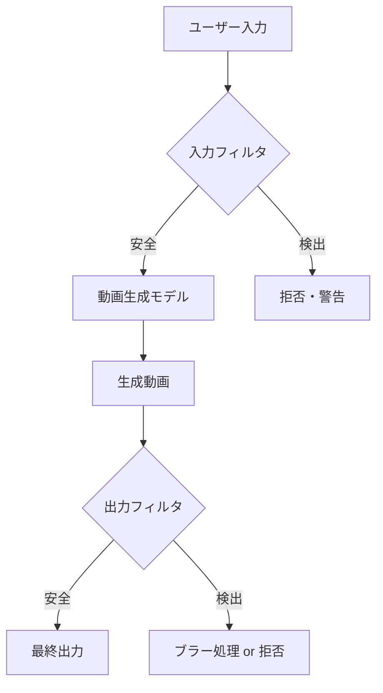

# ローカル動画生成AI 2026年版GPU別完全ガイド─Wan2.2からLTX-2まで

## この記事でわかること

- 2026年時点で主要なオープンソース動画生成AIモデル7種の特徴と使い分け
- RTX 3090 / 4090 / 2×3090 NVLink / 5090の各GPU環境でどのモデルがどの解像度・秒数で動くか
- 実写向け・アニメ向け・音声同期対応など用途別のモデル選定方法
- 動画破綻（顔崩れ・手の変形・フリッカー）を抑えるモデルとその仕組み
- コンテンツフィルタ・NSFW制限の実態と各モデルの対応状況

## 対象読者

- **想定読者**: 中級〜上級のAI・機械学習エンジニア、映像クリエイター
- **必要な前提知識**:
  - NVIDIA GPU（CUDA）の基本的な理解
  - Python環境構築の経験
  - Stable Diffusionなど画像生成AIの基礎知識
  - ComfyUIの基本操作（推奨）

## 結論・成果

2026年3月時点で、ローカル動画生成AIは**8GB VRAMのGPUでも480p・5秒程度の動画生成が可能**な段階に到達しています。RTX 5090（32GB）では**NVFP4量子化により4K・10秒の動画を約3分**で生成でき、2025年初頭と比較して生成速度は約3倍に向上しています。以下の表が各GPU環境での推奨モデルです。

| GPU | VRAM | 推奨モデル | 最大解像度 | 最大秒数 |
|-----|------|-----------|-----------|---------|
| RTX 3090 | 24GB | Wan2.2 14B（GGUF Q5） | 480p | 5秒 |
| RTX 4090 | 24GB | Wan2.2 14B / HunyuanVideo 1.5 | 480p〜720p | 5〜12秒 |
| 2×3090 NVLink | 48GB | HunyuanVideo 13B（フル精度） | 720p | 15秒 |
| RTX 5090 | 32GB | LTX-2 19B（NVFP4） | 4K | 10〜20秒 |

## 主要モデル7種を比較する

2026年3月時点でローカル実行可能な主要モデルを整理します。各モデルはアーキテクチャや得意分野が異なるため、用途に応じた選択が重要です。

### モデル一覧と基本スペック

| モデル | 開発元 | パラメータ数 | 最小VRAM | 最大解像度 | 最大秒数 | 音声同期 | ライセンス |
|--------|--------|-------------|---------|-----------|---------|---------|-----------|
| **Wan 2.2** | Alibaba | 14B / 1.3B | 8GB（1.3B） | 720p | 12秒 | V2A対応 | Apache 2.0 |
| **HunyuanVideo 1.5** | Tencent | 8.3B | 14GB | 720p | 15秒 | なし | Tencent License |
| **LTX-2** | Lightricks | 19B | 12GB | 4K | 20秒 | あり（統合） | Apache 2.0 |
| **FramePack** | Stanford/lllyasviel | HunyuanVideoベース | 6GB | 1080p | 60〜120秒 | なし | MIT |
| **CogVideoX-5B** | Zhipu AI | 5B | 12GB | 720×480 | 6秒 | なし | Apache 2.0 |
| **SkyReels V2** | Skywork AI | 非公開 | 14GB | 960×544 | 12秒 | なし | 非商用 |
| **Mochi 1** | Genmo | 10B | 40GB+ | 640×480 | 5.4秒 | なし | Apache 2.0 |

### 各モデルの特徴

**Wan 2.2**は、Alibaba（Wan-Video）が開発したMoE（Mixture-of-Experts）アーキテクチャのモデルです。15億本の動画と100億枚の画像で訓練され、VBenchスコア84.7%以上を記録したと報告されています。1.3B版と14B版が提供されており、1.3B版は8GB程度のVRAMで動作するため、エントリーレベルのGPUでも試せます。

**HunyuanVideo 1.5**は、Tencentが開発した大規模動画生成モデルです。バージョン1.5でパラメータ数が13Bから8.3Bに削減され、オフロード機能を使えば14GB VRAMで動作可能になりました。公式ベンチマークでは、複数人物のシーンで顔の表情や手の細部が保持される点で高い評価を得ています。

**LTX-2**は、Lightricksが2026年1月にオープンソースとして公開した、音声と動画を同時生成する初のDiTベースモデルです。非対称デュアルストリームDiffusion Transformerにより、音声ストリームと動画ストリームが双方向クロスアテンションで結合されています。4K・50FPS・最大20秒の動画をネイティブで生成できます。

**FramePack**は、lllyasviel氏（ControlNetの開発者）が提案した、定長コンテキスト圧縮技術です。HunyuanVideoをベースに、6GB VRAMで60秒以上の動画を生成できるのが特徴です。ただし、公式の注意事項として、FramePack-F1版では8〜10秒を超える動画で品質劣化（フリッカー、色変化）が報告されています。

## GPU環境別の実行ガイドを確認する

各GPU環境でどのモデルがどの程度の品質で動作するかを整理します。実行方法はComfyUI経由を前提とします。

### RTX 3090（24GB VRAM）での運用

RTX 3090は24GB VRAMを搭載していますが、2024年のアーキテクチャ（Ampere世代）のためFP8/FP4量子化の恩恵を受けられません。そのため、GGUF量子化モデルの使用が現実的です。

```bash
# ComfyUIでWan2.2 14BをGGUF量子化で実行する例
# 前提: ComfyUI + ComfyUI-GGUF拡張がインストール済み

# GGUF量子化モデルのダウンロード（Q5_K_M推奨、約10GB）
# Wan2.2 14B Q5_K_Mをダウンロードし、models/diffusion_models/に配置

# ComfyUIのワークフロー設定
# - DualCLIPLoader: t5xxl_fp8_e4m3fn.safetensors + open-clip ViT-H
# - UNETLoader(GGUF): wan2.2_t2v_14B_Q5_K_M.gguf
# - EmptyHunyuanLatentVideo: width=832, height=480, length=81, batch_size=1
# - KSampler: steps=20, cfg=5.0, sampler=euler, scheduler=normal
```

**RTX 3090での実測目安**（コミュニティ報告ベース）:

| モデル | 解像度 | 秒数 | 生成時間 |
|--------|--------|------|---------|
| Wan2.2 14B（Q5_K_M） | 832×480 | 5秒 | 約8〜12分 |
| Wan2.2 1.3B（FP16） | 832×480 | 5秒 | 約2〜3分 |
| FramePack | 640×480 | 30秒 | 約15〜25分 |

**注意点:**
> RTX 3090ではWan2.2 14Bのフル精度（BF16）実行は困難です。GGUF Q5_K_MまたはQ4_Kへの量子化が必須であり、量子化による品質低下（テクスチャの平滑化、微細ディテールの消失）は避けられません。720p生成はVRAM不足でOOMエラーが発生する可能性が高いため、480p以下に抑えることを推奨します。

### RTX 4090（24GB VRAM）での運用

RTX 4090はAda Lovelace世代のアーキテクチャにより、FP8量子化（NVFP8）に対応しています。GGUF量子化よりも品質劣化が少ない状態で高速に動作します。

```python
# Wan2GPを使った高速動画生成の設定例
# Wan2GP: https://github.com/deepbeepmeep/Wan2GP

# config.py の主要設定
config = {
    "model": "wan2.2_t2v_14B",
    "quantization": "fp8",       # RTX 4090ではFP8が最適
    "resolution": (832, 480),     # 480p推奨（720pはVRAM限界）
    "num_frames": 81,             # 約5秒（16fps）
    "num_inference_steps": 20,
    "guidance_scale": 5.0,
    "enable_vae_tiling": True,    # VRAM節約
    "enable_model_cpu_offload": False,  # 24GBなら不要
}

# 720p生成を試みる場合はVAE tilingとmodel offloadが必須
config_720p = {
    "resolution": (1280, 720),
    "enable_model_cpu_offload": True,  # VRAMをCPUに逃がす
    "enable_sequential_cpu_offload": True,
}
```

**RTX 4090での実測目安**:

| モデル | 解像度 | 秒数 | 生成時間 |
|--------|--------|------|---------|
| Wan2.2 14B（FP8） | 832×480 | 5秒 | 約4分 |
| HunyuanVideo 1.5（FP8） | 854×480 | 5秒 | 約5分 |
| LTX-2（NVFP8） | 768×512 | 4秒 | 約2分 |

### 2×RTX 3090 NVLink（48GB VRAM）での運用

2枚のRTX 3090をNVLinkブリッジで接続すると、PyTorchからは48GBの統合VRAMとして認識されます。これにより、量子化なしのフル精度モデルが実行可能です。

```bash
# NVLink接続の確認
nvidia-smi topo -m
# 出力例:
#         GPU0    GPU1
# GPU0     X      NV12
# GPU1    NV12     X
# NV12 = NVLink接続あり

# PyTorchからのVRAM確認
python -c "
import torch
for i in range(torch.cuda.device_count()):
    print(f'GPU {i}: {torch.cuda.get_device_name(i)}')
    print(f'  VRAM: {torch.cuda.get_device_properties(i).total_mem / 1e9:.1f} GB')
"
```

**2×3090 NVLinkの利点**:
- HunyuanVideo 13Bのフル精度（BF16）実行が可能
- 量子化不要のためテクスチャの品質劣化がない
- 720p・15秒の動画をOOMなしで生成可能

**なぜこの構成を選ぶか:**
- RTX 3090は中古市場で8〜10万円程度で入手可能（2026年3月時点の市場報告ベース）
- NVLinkブリッジは数千円で入手可能
- 合計20万円以下で48GB VRAM環境が構築できる
- ただし消費電力が2枚合計700W前後になる点は考慮が必要

**注意点:**
> NVLink対応はRTX 3090が最後の世代です。RTX 4090以降はNVLinkが廃止されているため、マルチGPU構成を組む場合はRTX 3090を選択する必要があります。また、NVLinkで48GBに統合されても、すべてのモデル・フレームワークがマルチGPUに対応しているわけではありません。ComfyUIやWan2GPなど、対応状況を事前に確認してください。

### RTX 5090（32GB VRAM）での運用

RTX 5090はBlackwellアーキテクチャにより、NVFP4量子化に対応しています。公式ベンチマークでは、NVFP4使用時にFP16比で**3倍の高速化**と**60%のVRAM削減**が報告されています。

```bash
# RTX 5090でLTX-2をNVFP4で実行（ComfyUI）
# 前提: CUDA 12.7+, PyTorch 2.10+

# NVFP4量子化モデルのダウンロード
# ltx-2-19b-nvfp4.safetensorsをmodels/diffusion_models/に配置

# ComfyUIワークフロー設定
# - LTX2ModelLoader: model=ltx-2-19b-nvfp4, precision=nvfp4
# - LTX2AudioVideoSampler:
#     width=3840, height=2160,  # 4K
#     num_frames=250,           # 10秒（25fps）
#     steps=30,
#     audio_enabled=True        # 音声同期ON
```

**RTX 5090での実測目安**（NVIDIAベンチマーク報告ベース）:

| モデル | 解像度 | 秒数 | 生成時間 |
|--------|--------|------|---------|
| LTX-2 19B（NVFP4） | 4K | 10秒 | 約3分 |
| LTX-2 19B（NVFP8） | 4K | 10秒 | 約5分 |
| Wan2.2 14B（FP8） | 720p | 10秒 | 約2分 |

**NVFP4 vs NVFP8の使い分け:**

| 項目 | NVFP4 | NVFP8 |
|------|-------|-------|
| 速度 | 15〜30%高速 | 基準 |
| VRAM | 25〜40%削減 | 基準 |
| 品質 | やや平滑化あり | 微細テクスチャ保持 |
| 推奨用途 | プロトタイピング・バッチ処理 | 最終出力・ポートフォリオ |

WaveSpeedAIのテストによると、NVFP8は「髪の毛やサインボード、マイクロテクスチャのエッジを保持し、動きのシマーを低減」する一方、NVFP4は「わずかなソフト化と時間的不安定性」が発生すると報告されています。

## 用途別のモデル選定を行う

動画生成AIは用途によって最適なモデルが異なります。ここでは実写・アニメ・音声の3つの観点で整理します。

### 実写（フォトリアリスティック）向けモデル

実写動画の品質は、**顔の表情保持**、**手指の破綻回避**、**物理的整合性**の3点で評価されます。

| モデル | 顔の安定性 | 手の破綻 | 物理整合性 | 総合評価 |
|--------|-----------|---------|-----------|---------|
| Wan 2.2 14B | 高い | やや発生 | 高い | 実写全般に推奨 |
| HunyuanVideo 1.5 | 非常に高い | 少ない | 高い | 複数人物シーンに推奨 |
| SkyReels V2 | 高い | やや発生 | 中程度 | 人物中心のシーン向け |
| LTX-2 | 中〜高 | やや発生 | 中〜高 | 音声付き動画に推奨 |

MimicPCの比較レポートでは、Wan 2.2が「滑らかなモーションと詳細なテクスチャ」で実写品質をリードし、HunyuanVideoは「複数キャラクターの表情と手の細部保持」で優位と報告されています。

**よくある間違い**: 「パラメータ数が大きいほど高品質」と考えがちですが、実際にはアーキテクチャとトレーニングデータの質が支配的です。Wan 2.2（14B）はMoEアーキテクチャにより、推論時には全パラメータの一部のみがアクティブになるため、実効的な計算量はパラメータ数ほど大きくありません。

### アニメ・イラスト向けモデル

アニメスタイルの動画生成には、以下のアプローチがあります。

**1. AnimateDiff + Stable Diffusion（SD1.5 / SDXL）**

AnimateDiffは既存のStable Diffusionモデルにモーションモジュールを追加するプラグイン方式です。アニメ系のSD checkpointやLoRAがそのまま利用できるため、スタイルの自由度が高いのが特徴です。ICLR 2024 Spotlight論文として採択されています。

```python
# AnimateDiff + SD1.5アニメモデルの設定例（ComfyUI）
# 推奨チェックポイント: Anything V5, CounterfeitV3, etc.

# ComfyUIノード構成:
# 1. CheckpointLoader: anime_checkpoint.safetensors
# 2. AnimateDiffLoader: mm_sd15_v3.ckpt（モーションモジュール）
# 3. LoRALoader: anime_style_lora.safetensors（任意）
# 4. KSampler: steps=25, cfg=7.5
# 5. AnimateDiffCombine: frame_rate=8, format=video/h264

# VRAM使用量: SD1.5ベースで約6-8GB
# 生成時間: RTX 3090で16フレーム（2秒）約30秒
```

**2. Wan 2.2 + アニメLoRA**

Wan 2.2はファインチューニングやLoRAによるスタイル適応が可能です。AMD ROCmブログでは、単一GPUでのファインチューニング手法が公開されています。

**3. FramePack（長尺アニメ向き）**

FramePackはHunyuanVideoベースのため、アニメ専用ではありませんが、I2V（Image-to-Video）機能を使えばアニメ画像を入力として動画化できます。6GB VRAMで60秒以上の長尺動画を生成できる点はアニメ用途でも有用です。

**制約条件**: AnimateDiffはSD1.5 / SDXLベースのため、生成解像度が512×512〜1024×1024に制限されます。高解像度が必要な場合はWan 2.2やHunyuanVideoをアニメLoRAで使う方が適切です。

### 音声同期対応モデル

2026年3月時点で、動画と音声を**単一モデルで同時生成**できるオープンソースモデルはLTX-2のみです。


LTX-2の音声アーキテクチャは、非対称デュアルストリームDiffusion Transformerを採用しています。大きな動画ストリームと小さな音声ストリームが双方向クロスアテンションで結合され、台詞・リップシンク・環境音が**単一パスで同時生成**されます。

他モデルで音声を付加する場合は、Wan 2.2のV2A（Video-to-Audio）パイプラインや、MMAudioなどの外部モデルとの組み合わせが必要です。

**トレードオフ**: LTX-2は音声統合の分、動画のみの品質ではWan 2.2やHunyuanVideoに劣る場面があります。音声不要の場合は動画特化モデルを選択する方が品質面で有利です。

## 動画破綻を抑えるテクニックを理解する

動画生成AIで頻出する問題は、**顔の崩れ**、**手指の変形**、**フリッカー（ちらつき）**、**物理法則の無視**です。各モデルの対策と、ユーザー側で取れる手法を整理します。

### モデル側の破綻対策

| 破綻タイプ | Wan 2.2 | HunyuanVideo 1.5 | FramePack |
|-----------|---------|-------------------|-----------|
| 顔崩れ | MoEで専門エキスパートが処理 | 人体変形低減の設計あり | HunyuanVideoベースで継承 |
| 手指変形 | やや発生 | 手の細部保持に優位 | 入力画像の品質に依存 |
| フリッカー | 短尺では少ない | 安定 | F1版は8〜10秒超で増加 |
| 長尺劣化 | 12秒以内で安定 | 15秒以内で安定 | 反ドリフトサンプリングで対策 |

### ユーザー側で取れる対策

```python
# ComfyUIでのフリッカー低減設定例
sampler_config = {
    "steps": 30,          # ステップ数を増やす（品質向上、速度低下）
    "cfg_scale": 5.0,     # CFGスケールを下げる（破綻低減）
    "denoise_strength": 0.7,  # I2Vの場合、低めに設定
}

# 解像度を下げて安定性を確保する例
# 720pで破綻する場合 → 480pに下げてアップスケール
upscale_workflow = {
    "generation_resolution": (832, 480),   # 低解像度で生成
    "upscale_model": "RealESRGAN_x4plus",  # 4倍アップスケール
    "final_resolution": (3328, 1920),       # 擬似的な高解像度
}
```

**ハマりポイント**: CFGスケール（Classifier-Free Guidance）を高く設定しすぎると、プロンプトへの忠実度は上がりますが画面全体が不自然に飽和し、フリッカーが増加します。Wan 2.2では5.0前後、HunyuanVideoでは6.0前後が推奨値です。

## コンテンツフィルタとNSFW制限の実態を把握する

ローカル動画生成AIのコンテンツ制限は、クラウドサービスとは根本的に異なります。

### ローカル vs クラウドの制限比較

| 項目 | クラウドサービス（Runway, Sora等） | ローカル実行 |
|------|-----------------------------------|-------------|
| プロンプトフィルタ | あり（厳格） | モデル依存（多くはなし） |
| 出力フィルタ | あり（NSFW検出） | なし or 無効化可能 |
| 利用規約 | あり（違反で停止） | ライセンスのみ |
| ログ収集 | あり | なし（完全ローカル） |

### 各モデルのNSFW制限

**Wan 2.2**: 基本的なNSFW分類器が含まれていますが、ローカル実行時には無効化が容易と報告されています。PixelDojoなどの第三者プラットフォームではNSFW制限なしの環境を提供しています。

**HunyuanVideo**: Tencent独自のライセンスで、利用規約上はNSFWコンテンツの生成を禁止しています。ただしモデル自体にハードコードされたフィルタはなく、ローカル実行時の技術的制約はありません。

**LTX-2**: Apache 2.0ライセンスのため、ライセンス上の制限は最小限です。モデル側に組み込みフィルタはありません。

**ComfyUI**: ComfyUI自体はフィルタを一切持たないノードベースのワークフローツールです。どのモデル・拡張を組み合わせるかはユーザーの判断に委ねられています。

**Open-Sora 1.1**: オープンソースのテキストから動画生成モデルで、組み込みの安全フィルタを持ちません。研究者がCLIPベースの入力フィルタとNSFW検出モデルによる出力フィルタを手動で統合した事例が報告されています。

:::message alert
ローカル実行のモデルは技術的にはフィルタなしで動作しますが、生成コンテンツの法的責任はユーザーにあります。児童搾取コンテンツや特定個人のディープフェイクなど、違法コンテンツの生成は各国の法律で禁止されています。日本では不正競争防止法や著作権法、肖像権の侵害に該当する可能性があります。技術的に可能であることと法的に許容されることは別です。
:::

### フィルタの仕組み

多くのモデルが採用するNSFWフィルタは以下の2段階構成です。



**入力フィルタ**: CLIPテキストエンコーダでプロンプトの安全性を判定。禁止ワードリストやセマンティック分類器を使用。

**出力フィルタ**: 生成された動画フレームに対してNSFW検出モデル（例: NudeNet、Safety Checker）を適用。検出時にブラー処理または生成拒否を行う。

ローカル実行環境では、これらのフィルタは設定ファイルやコード上で無効化できる構造になっている場合が多いです。

## よくある問題と解決方法

| 問題 | 原因 | 解決方法 |
|------|------|----------|
| CUDA Out of Memory | VRAM不足 | 解像度を下げる、GGUF量子化を使う、`--enable-model-cpu-offload`を追加 |
| 生成動画が真っ黒 | VAEの不一致 | モデルに対応するVAEを確認、`enable_vae_tiling`を有効化 |
| 手指が6本になる | トレーニングデータの限界 | HunyuanVideoに切り替える、ネガティブプロンプトに`deformed hands`を追加 |
| フリッカーが激しい | CFGスケールが高すぎる | CFGを5.0以下に下げる、ステップ数を30に増やす |
| 動画が途中で破綻 | 長尺生成の限界 | FramePackを使う、5秒以内に収める、解像度を下げる |
| RTX 5090でTritonエラー | PyTorchバージョン不適合 | PyTorch 2.10以上にアップグレード |
| NVLinkが認識されない | ドライバ・接続の問題 | `nvidia-smi topo -m`で確認、ドライバを最新版に更新 |

## まとめと次のステップ

**まとめ:**

- **8GB VRAM**（RTX 3060等）: Wan 2.2 1.3BまたはGGUF量子化で480p・5秒の動画生成が可能。FramePackなら6GBから60秒の長尺も生成可能だが品質に制約あり
- **24GB VRAM**（RTX 3090 / 4090）: Wan 2.2 14BやHunyuanVideo 1.5を480p〜720pで実行可能。RTX 4090はFP8対応で3090より高速
- **48GB VRAM**（2×3090 NVLink）: フル精度モデルを量子化なしで実行でき、品質面で優位。コストパフォーマンスに優れるが消費電力に注意
- **32GB VRAM**（RTX 5090）: NVFP4量子化により4K・20秒の動画を高速生成。2026年時点でローカル動画生成の最適解
- **実写**: Wan 2.2（総合力）またはHunyuanVideo 1.5（人物シーン特化）
- **アニメ**: AnimateDiff + SD checkpoint（スタイル自由度）またはWan 2.2 + LoRA
- **音声同期**: LTX-2が唯一の統合モデル
- **NSFW制限**: ローカルモデルは技術的にフィルタなしで動作するが、法的責任はユーザーにある

**次にやるべきこと:**

1. 自分のGPU環境に合ったモデルを上記の表から選択し、ComfyUIで試す
2. Wan2GPやFramePackなど、VRAM最適化ツールを導入して低VRAM環境でも品質を追求する
3. 用途に応じたLoRA・チェックポイントを探して、自分のスタイルに合わせたファインチューニングを検討する

## 参考

- [Wan2GP - A fast AI Video Generator for the GPU Poor (GitHub)](https://github.com/deepbeepmeep/Wan2GP)
- [FramePack - Lets make video diffusion practical! (GitHub)](https://github.com/lllyasviel/FramePack)
- [LTX-2 Official Repository (GitHub)](https://github.com/Lightricks/LTX-2)
- [NVIDIA RTX Accelerates 4K AI Video Generation (NVIDIA Blog)](https://blogs.nvidia.com/blog/rtx-ai-garage-ces-2026-open-models-video-generation/)
- [Best Open Source Video Generation Models in 2026 (Pixazo)](https://www.pixazo.ai/blog/best-open-source-ai-video-generation-models)
- [7 Best Open Source Video Generation Models in 2026 (Hyperstack)](https://www.hyperstack.cloud/blog/case-study/best-open-source-video-generation-models)
- [Wan 2.2 VRAM: Best GPU Setup (Novita)](https://blogs.novita.ai/wan-2-2-vram-find-the-best-gpu-setup-for-deployment/)
- [NVFP4 vs NVFP8 for LTX-2: Speed, Quality & VRAM Comparison (WaveSpeedAI)](https://wavespeed.ai/blog/posts/blog-ltx-2-nvfp4-vs-nvfp8/)
- [HunyuanVideo 1.5 (GitHub)](https://github.com/Tencent-Hunyuan/HunyuanVideo-1.5)
- [Wan2.1 vs Hunyuan vs LTXV Comparison (MimicPC)](https://www.mimicpc.com/learn/wan-vs-hunyuan-vs-ltxv-which-best-image-to-video-ai-tool)

---

:::message
この記事はAI（Claude Code）により自動生成されました。内容の正確性については複数の情報源で検証していますが、実際の利用時は公式ドキュメントもご確認ください。
:::
