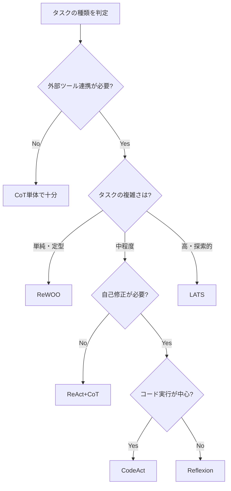
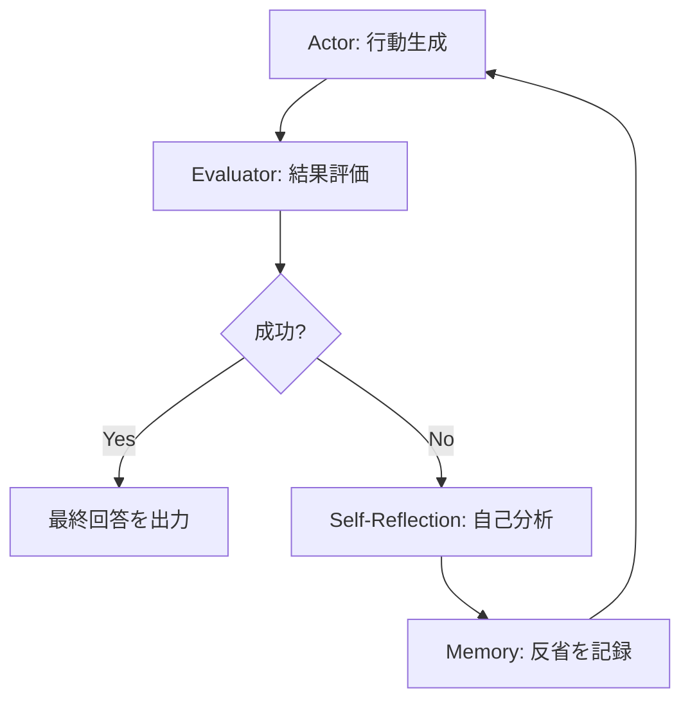
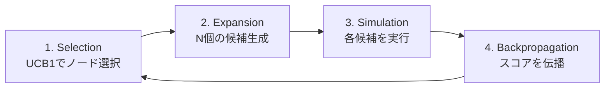
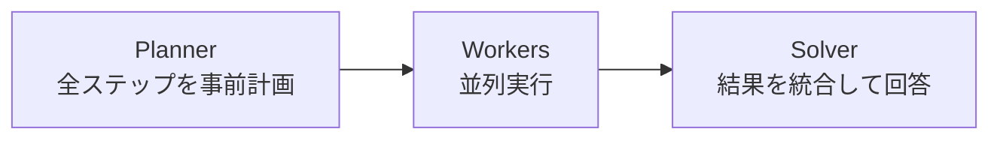
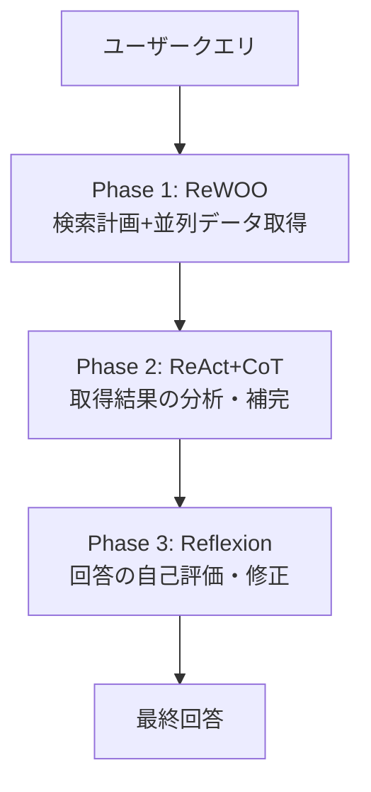

## この記事でわかること

- ReActとCoTを組み合わせた5つの推論パターンの仕組みと使い分け
- LangGraphを使ったReflexion（自己修正）・LATS（木探索）の実装方法
- ReWOO（計画先行型）とCodeAct（コード生成型）の設計思想
- 本番運用でのパターン選択基準と、コスト・精度のトレードオフ

## 対象読者

- **想定読者**: LLMエージェント開発の中級〜上級者
- **必要な前提知識**:
  - Python 3.11以上の基礎文法
  - LangGraph 0.3.x 以上の基本的なグラフ構築経験
  - ReActパターン（Thought → Action → Observation）の基本理解

:::message
ReActパターンの基礎については、関連記事「[ReActパターン完全ガイド：LangGraphで実装する思考と行動の融合](https://zenn.dev/0h_n0/articles/467d219545ec5e)」を参照してください。
:::

## 結論・成果

5つの推論パターンをタスク特性に応じて使い分けることで、エージェントの性能を大きく変えられます。Yao et al.（2022）の原論文では、ReAct+CoTの組み合わせがCoT単体と比較してHotpotQAのタスク成功率を向上させたと報告されています。Shinn et al.（NeurIPS 2023）のReflexionではHumanEvalのpass@1精度91%、Zhou et al.（ICML 2024）のLATSでは92.7%が報告されています。ただし高度なパターンほどトークン消費量が増加するため、**タスクの複雑さとコストのバランス**を見極めることが不可欠です。

## 5大推論パターンの全体像を把握する

2026年現在、ReActとCoTを組み合わせたエージェント推論パターンは大きく5つに整理できます。

| パターン | 推論方式 | 自己修正 | コスト | 適するタスク |
|----------|----------|----------|--------|-------------|
| **ReAct+CoT** | 逐次推論+ツール | なし | 中 | 一般的なエージェントタスク |
| **Reflexion** | 逐次推論+自己批評 | あり | 高 | コード生成、QA |
| **LATS** | 木探索+MCTS | あり | 高 | 探索的問題解決 |
| **ReWOO** | 計画先行+並列実行 | なし | 低 | バッチ処理、定型業務 |
| **CodeAct** | コード生成+実行 | デバッグ | 変動 | データ分析、計算タスク |

### パターン選択のフローチャート

実務で「どのパターンを使うべきか」と迷ったときは、以下の判断基準が有効です。



> **注意**: コスト重視の場合はReWOOが有力です。Capabl社の分析によると、ReWOOはReActと比較して5〜10倍のトークン削減が期待できると報告されています。ただし実行途中での方針転換ができない制約があり、タスクの予測可能性が高い場合に限定して使用することを推奨します。

## パターン1: ReAct+CoT — エージェント推論の基本形を実装する

ReAct+CoTは、CoTの段階的推論をReActループの中に組み込む基本パターンです。2026年現在、「CoTはエンジン（モデルの内部推論）、ReActはステアリング（外部世界とのインタラクション）」と表現されるように、両者は補完的な関係にあります。

### LangGraphによる実装

ポイントは**推論トレースを明示的に状態に保持する**ことです。

```python
# react_cot_agent.py — Python 3.11, langgraph 0.3.x
from typing import Annotated, TypedDict
from langchain_anthropic import ChatAnthropic
from langchain_core.messages import AIMessage, HumanMessage, SystemMessage
from langchain_core.tools import tool
from langgraph.graph import StateGraph, END
from langgraph.graph.message import add_messages
from langgraph.prebuilt import ToolNode

class AgentState(TypedDict):
    messages: Annotated[list, add_messages]
    reasoning_trace: list[str]  # CoT推論トレースを保持

@tool
def search_web(query: str) -> str:
    """Web検索を実行して最新情報を取得する"""
    return f"検索結果: '{query}'に関する情報..."

tools = [search_web]

def agent_node(state: AgentState) -> AgentState:
    llm = ChatAnthropic(
        model="claude-sonnet-4-20250514", max_tokens=4096
    ).bind_tools(tools)
    system = SystemMessage(content=(
        "段階的に推論するエージェントです。"
        "Thought（推論）→ Action（行動）の順で処理してください。"
    ))
    response = llm.invoke([system] + state["messages"])
    trace = state.get("reasoning_trace", [])
    if isinstance(response, AIMessage) and response.content:
        trace.append(f"Step {len(trace)+1}: {response.content[:200]}")
    return {"messages": [response], "reasoning_trace": trace}

def should_continue(state: AgentState) -> str:
    last = state["messages"][-1]
    if hasattr(last, "tool_calls") and last.tool_calls:
        return "tools"
    return END

def build_react_cot_agent():
    g = StateGraph(AgentState)
    g.add_node("agent", agent_node)
    g.add_node("tools", ToolNode(tools))
    g.set_entry_point("agent")
    g.add_conditional_edges("agent", should_continue, {"tools": "tools", END: END})
    g.add_edge("tools", "agent")
    return g.compile()
```

**なぜこの実装を選んだか:**
- `reasoning_trace`を状態として保持し、デバッグ時に推論過程を追跡可能にしている
- `bind_tools`によるネイティブツールコールで、テキストパース不要の構造化呼び出しを実現

> このパターンは自己修正機能を持たないため、ツール結果が不十分でも次のステップに進んでしまいます。自動リトライが必要な場合はReflexionを検討してください。

## パターン2: Reflexion — 自己批評と修正で精度を高める

Reflexion（Shinn et al., NeurIPS 2023）は、ReActエージェントに**自己批評と記憶**を追加したパターンです。出力を評価し、改善点を「Verbal Reinforcement（言語的フィードバック）」として蓄積することで、試行ごとに性能が向上します。

### Reflexionのアーキテクチャ



1. **Actor**: ReAct+CoTでタスクを実行
2. **Evaluator**: 実行結果を評価（成功/失敗の判定）
3. **Self-Reflection**: 失敗原因を分析し、改善方針を言語化して記憶に保存

### LangGraphによるReflexion実装

```python
# reflexion_agent.py — Python 3.11, langgraph 0.3.x
from typing import Annotated, TypedDict
from langchain_anthropic import ChatAnthropic
from langchain_core.messages import AIMessage, HumanMessage
from langgraph.graph import StateGraph, END
from langgraph.graph.message import add_messages

class ReflexionState(TypedDict):
    messages: Annotated[list, add_messages]
    task: str
    current_answer: str
    reflections: list[str]  # 過去の反省を蓄積
    trial_count: int
    max_trials: int
    is_satisfactory: bool

def generate_answer(state: ReflexionState) -> ReflexionState:
    """Actor: 過去の反省を踏まえて回答を生成"""
    llm = ChatAnthropic(model="claude-sonnet-4-20250514", max_tokens=4096)
    # 直近3件の反省をコンテキストに含める（メモリ制限）
    ref_ctx = ""
    for i, r in enumerate(state["reflections"][-3:], 1):
        ref_ctx += f"\n### 試行{i}の反省\n{r}\n"
    prompt = f"タスク: {state['task']}\n{ref_ctx}\n高品質な回答を生成してください。"
    resp = llm.invoke([HumanMessage(content=prompt)])
    return {"current_answer": resp.content, "trial_count": state["trial_count"] + 1}

def evaluate_answer(state: ReflexionState) -> ReflexionState:
    """Evaluator: 回答品質を判定"""
    llm = ChatAnthropic(model="claude-sonnet-4-20250514", max_tokens=1024)
    prompt = (
        f"タスク: {state['task']}\n回答: {state['current_answer']}\n"
        "SATISFACTORYまたはNEEDS_IMPROVEMENTで判定してください。"
    )
    resp = llm.invoke([HumanMessage(content=prompt)])
    return {"is_satisfactory": "SATISFACTORY" in resp.content.upper()}

def self_reflect(state: ReflexionState) -> ReflexionState:
    """Self-Reflection: 失敗原因を分析し記憶に保存"""
    llm = ChatAnthropic(model="claude-sonnet-4-20250514", max_tokens=1024)
    prompt = (
        f"タスク: {state['task']}\n前回の回答: {state['current_answer']}\n"
        "不足点・誤り・改善方針を分析してください。"
    )
    resp = llm.invoke([HumanMessage(content=prompt)])
    refs = state.get("reflections", [])
    refs.append(resp.content)
    return {"reflections": refs}

def should_retry(state: ReflexionState) -> str:
    if state["is_satisfactory"] or state["trial_count"] >= state["max_trials"]:
        return "output"
    return "reflect"

def output_result(state: ReflexionState) -> ReflexionState:
    return {"messages": [AIMessage(content=state["current_answer"])]}

def build_reflexion_agent():
    g = StateGraph(ReflexionState)
    g.add_node("generate", generate_answer)
    g.add_node("evaluate", evaluate_answer)
    g.add_node("reflect", self_reflect)
    g.add_node("output", output_result)
    g.set_entry_point("generate")
    g.add_edge("generate", "evaluate")
    g.add_conditional_edges("evaluate", should_retry, {"reflect": "reflect", "output": "output"})
    g.add_edge("reflect", "generate")
    g.add_edge("output", END)
    return g.compile()
```

**なぜReflexionを選ぶのか:**
- Shinn et al.の論文では、HumanEvalで**pass@1精度91%**を達成したと報告されている
- 「Verbal Reinforcement」により、重みの更新なしで試行ごとに性能が改善する

**ハマりポイント:**
> 反省記憶は際限なく増加するとコンテキストウィンドウを圧迫します。原論文では直近3件に制限する設計が採用されています。また、Evaluatorの判定精度がボトルネックになるため、評価基準は明確に定義してください。

## パターン3: LATS — 木探索で最適な推論経路を発見する

LATS（Language Agent Tree Search, Zhou et al., ICML 2024）は、ReActにモンテカルロ木探索（MCTS）を組み合わせたパターンです。複数の行動候補を並列に探索し、最も有望な経路を選択します。

### LATSのアルゴリズム



### UCB1による探索戦略

LATSの核心は、**探索と活用のバランス**を数学的に制御する点です。

$$UCB1(s) = \bar{V}(s) + c \sqrt{\frac{\ln N(parent)}{N(s)}}$$

$\bar{V}(s)$ はノード $s$ の平均報酬、$N(s)$ は訪問回数、$c$ は探索係数（通常 $\sqrt{2}$）です。第1項が活用（高報酬優先）、第2項が探索（未訪問優先）を表します。

### LangGraphによるLATS実装（簡易版）

```python
# lats_agent.py — Python 3.11, langgraph 0.3.x
import math
from dataclasses import dataclass, field
from typing import TypedDict
from langchain_anthropic import ChatAnthropic
from langchain_core.messages import HumanMessage
from langgraph.graph import StateGraph, END

@dataclass
class TreeNode:
    state: str
    action: str = ""
    reward: float = 0.0
    visits: int = 0
    children: list["TreeNode"] = field(default_factory=list)
    parent: "TreeNode | None" = None

    def ucb1(self, c: float = 1.41) -> float:
        if self.visits == 0:
            return float("inf")
        return (self.reward / self.visits) + c * math.sqrt(
            math.log(self.parent.visits) / self.visits
        )

class LATSState(TypedDict):
    task: str
    root: TreeNode
    best_answer: str
    best_score: float
    iterations: int
    max_iterations: int

def select_node(node: TreeNode) -> TreeNode:
    current = node
    while current.children:
        current = max(current.children, key=lambda c: c.ucb1())
    return current

def expand_and_evaluate(state: LATSState) -> LATSState:
    llm = ChatAnthropic(model="claude-sonnet-4-20250514", max_tokens=2048)
    root = state["root"]
    selected = select_node(root)

    # Expansion: 3候補を生成・評価
    prompt = f"タスク: {state['task']}\n状態: {selected.state}\n3つの異なるアプローチを提案。"
    resp = llm.invoke([HumanMessage(content=prompt)])
    options = [l.split(": ",1)[1] for l in resp.content.split("\n") if l.startswith("OPTION_")]

    for opt in options[:3]:
        eval_resp = llm.invoke([HumanMessage(
            content=f"タスク: {state['task']}\nアクション: {opt}\nSCORE: 0.0〜1.0で評価"
        )])
        try:
            score = float([l for l in eval_resp.content.split("\n") if "SCORE:" in l][0].split("SCORE:")[1].strip())
        except (IndexError, ValueError):
            score = 0.5
        child = TreeNode(state=f"{selected.state} -> {opt}", action=opt,
                         reward=score, visits=1, parent=selected)
        selected.children.append(child)
        if score > state["best_score"]:
            state["best_score"] = score
            state["best_answer"] = opt

    # Backpropagation
    node = selected
    while node:
        node.visits += 1
        if node.children:
            node.reward = sum(c.reward for c in node.children) / len(node.children)
        node = node.parent

    return {"root": root, "best_answer": state["best_answer"],
            "best_score": state["best_score"], "iterations": state["iterations"] + 1}

def should_continue_lats(state: LATSState) -> str:
    if state["iterations"] >= state["max_iterations"] or state["best_score"] >= 0.95:
        return END
    return "expand"

def build_lats_agent():
    g = StateGraph(LATSState)
    g.add_node("expand", expand_and_evaluate)
    g.set_entry_point("expand")
    g.add_conditional_edges("expand", should_continue_lats, {"expand": "expand", END: END})
    return g.compile()
```

**なぜLATSを選ぶのか:**
- Zhou et al.のベンチマークでは、HumanEvalで**pass@1精度92.7%**を達成したと報告されている
- MCTSの理論的保証により、探索と活用のバランスが数学的に制御される

**トレードオフ:**
> LATSは各反復でN個の候補を評価するため、API呼び出し回数がReActの数倍になります。コスト制約が厳しい場合は、候補数を3、深さを3〜5に制限してください。

## パターン4: ReWOO — 計画先行でコストを削減する

ReWOO（Reasoning Without Observation）は、**計画を先に立てて並列実行する**アプローチです。推論コストを大幅に削減できますが、途中での方針転換ができません。

### ReWOOのアーキテクチャ



1. **Planner**: タスクを分析し、全ステップとツール呼び出しを事前に計画
2. **Workers**: 計画に基づいてツールを並列実行（ステップ間でLLM推論が不要）
3. **Solver**: 全結果を統合して最終回答を生成

```python
# rewoo_agent.py — 概念的な構成
from typing import TypedDict
from langchain_anthropic import ChatAnthropic
from langchain_core.messages import HumanMessage
from langgraph.graph import StateGraph, END

class ReWOOState(TypedDict):
    task: str
    plan: list[dict]         # [{step, action, dependency}]
    results: dict[str, str]
    final_answer: str

def planner(state: ReWOOState) -> ReWOOState:
    """全ステップを事前計画"""
    llm = ChatAnthropic(model="claude-sonnet-4-20250514", max_tokens=2048)
    prompt = f"タスク: {state['task']}\nステップに分解して実行計画を生成してください。"
    resp = llm.invoke([HumanMessage(content=prompt)])
    plan = []  # レスポンスをパースして計画を構造化
    for line in resp.content.split("\n"):
        if line.strip().startswith("step_"):
            parts = line.strip().split(": ", 1)
            plan.append({"step": parts[0], "action": parts[1] if len(parts) > 1 else ""})
    return {"plan": plan}

def workers(state: ReWOOState) -> ReWOOState:
    """計画に基づいて並列実行（依存関係を考慮）"""
    results = {}
    for step in state["plan"]:
        results[step["step"]] = f"実行結果: {step['action']}"  # 実際はツール実行
    return {"results": results}

def solver(state: ReWOOState) -> ReWOOState:
    """全結果を統合して回答"""
    llm = ChatAnthropic(model="claude-sonnet-4-20250514", max_tokens=2048)
    results_text = "\n".join(f"- {k}: {v}" for k, v in state["results"].items())
    resp = llm.invoke([HumanMessage(content=f"タスク: {state['task']}\n結果:\n{results_text}")])
    return {"final_answer": resp.content}

def build_rewoo_agent():
    g = StateGraph(ReWOOState)
    g.add_node("planner", planner)
    g.add_node("workers", workers)
    g.add_node("solver", solver)
    g.set_entry_point("planner")
    g.add_edge("planner", "workers")
    g.add_edge("workers", "solver")
    g.add_edge("solver", END)
    return g.compile()
```

**なぜReWOOを選ぶのか:**
- LLMへの呼び出し回数が大幅に削減される（Planner 1回 + Solver 1回のみ）
- 並列実行によりレイテンシも改善できる

> **制約条件**: ReWOOは計画に従って一直線に実行するため、**ツール実行の失敗や想定外の結果に対応できません**。定型業務（レポート生成、データ集計）に適しており、対話的な問題解決には不向きです。

## パターン5: CodeAct — コード生成と実行で問題を解決する

CodeAct（Wang et al., 2024）は、LLMが**Pythonコードを生成・実行する行動**をReActループの中核に据えたパターンです。テキストベースのツール呼び出しと異なり、任意の計算をコード上で実行できます。

処理フローは「Reason → Code生成 → サンドボックス実行 → 成功判定 → (失敗時)デバッグ → 再生成」のループです。Reflexionと似ていますが、エラーメッセージという**客観的なフィードバック**に基づいて修正する点が異なります。

```python
# codeact_agent.py — 核心部分のみ抜粋
import subprocess, tempfile
from langgraph.graph import StateGraph, END

def reason_and_generate(state):
    """LLMがタスクを分析しPythonコードを生成"""
    # エラー履歴をコンテキストに含め、同じミスの繰り返しを防止
    # 生成されたコードブロックを抽出して返す
    ...

def execute_code(state):
    """サンドボックスでコードを実行（30秒タイムアウト）"""
    with tempfile.NamedTemporaryFile(mode="w", suffix=".py", delete=False) as f:
        f.write(state["generated_code"])
        f.flush()
        result = subprocess.run(
            ["python", f.name], capture_output=True, text=True, timeout=30
        )
        return {"is_success": result.returncode == 0, "output": result.stdout or result.stderr}

def build_codeact_agent():
    g = StateGraph(CodeActState)
    g.add_node("generate", reason_and_generate)
    g.add_node("execute", execute_code)
    g.set_entry_point("generate")
    g.add_edge("generate", "execute")
    g.add_conditional_edges("execute", should_retry, {"generate": "generate", END: END})
    return g.compile()
```

> **注意**: CodeActで生成されたコードをサンドボックスなしで実行することは**セキュリティリスク**が大きいです。本番環境ではDockerコンテナやgVisorなどの隔離された実行環境を必ず使用してください。

## ハイブリッド設計で本番運用を実現する

実務では単一パターンではなく、**複数パターンの段階的組み合わせ**が有効です。以下は社内ナレッジ検索エージェントの構成例です。



Phase 1（ReWOO）で定型的なデータ取得を低コストで処理し、Phase 2（ReAct+CoT）で柔軟な分析を行い、Phase 3（Reflexion）で品質を担保します。各フェーズを独立して最適化・差し替えが可能です。

### パターン別コスト・精度の比較

具体的な数値はタスクやモデルにより大きく変動するため、**自身のユースケースでのベンチマークが不可欠**です。

| パターン | API呼出（相対値） | トークン消費（相対値） | 精度特性 | 適用シナリオ |
|----------|-------------------|---------------------|----------|-------------|
| ReAct+CoT | 1x | 1x | ベースライン | 一般タスク |
| Reflexion | 2〜3x | 2〜3x | 自己修正で向上 | コード生成、QA |
| LATS | 3〜5x | 3〜5x | 探索的タスクで高精度 | 制約充足、最適化 |
| ReWOO | 0.3〜0.5x | 0.2〜0.5x | 定型タスクでReAct同等 | バッチ処理、レポート |
| CodeAct | 1〜3x | 1〜2x | 計算タスクで高精度 | データ分析、数値処理 |

> **よくある間違い**: 「最も高度なパターン（LATS）を使えば常に性能が上がる」と考えがちですが、単純なタスクにLATSを適用するとコストが数倍になるだけで精度向上が見られない場合があります。

## 2026年の動向: Reasoning Modelとの統合を理解する

OpenAI o3やDeepSeek R1に代表される**Reasoning Model**が普及し、CoTはプロンプトテクニックからモデルアーキテクチャへと移行しました。これらのモデルは推論時に自動的に数千トークンの内部推論を生成し、test-time computeを増やすことで精度を向上させます。

| モデル | 推論方式 | 特徴 |
|--------|----------|------|
| OpenAI o3/o4-mini | Extended Thinking | 内部推論トークン自動生成 |
| DeepSeek R1 | Multi-step Deliberation | SFT+RLで推論最適化 |
| Claude (Extended Thinking) | Adaptive Thinking | 推論深度を動的調整 |

エージェント実装への影響は以下の通りです。

1. **CoTの明示的プロンプトが不要に**: Reasoning Modelでは `"Let's think step by step"` が逆効果になることがあると報告されている
2. **ReActループとの統合**: 内部推論 + 外部ツール使用の組み合わせで、手動CoTプロンプトなしで高精度な推論が実現できる
3. **Process Reward Model**: 推論の各ステップを評価するPRMの研究が進んでおり、Reflexionの自動化に寄与する可能性がある

> Reasoning Modelは推論時のトークン消費量が従来モデルの数倍になるため、すべてのタスクに使うのではなく、複雑な推論が必要なタスクにのみ使う**ルーティング戦略**が推奨されています。

## よくある問題と解決方法

| 問題 | 原因 | 解決方法 |
|------|------|----------|
| ReActの無限ループ | 終了条件が不明確 | `max_iterations`を設定（推奨: 5〜10回） |
| Reflexionの品質が向上しない | Evaluatorの判定基準が曖昧 | 具体的なルーブリックを定義 |
| LATSのコスト爆発 | 探索幅が大きすぎる | 候補数を3、深さを3〜5に制限 |
| ReWOOの計画が不適切 | タスクの分解が粗い | Few-shot例をPlannerに提供 |
| CodeActのセキュリティリスク | サンドボックスなしで実行 | Docker/gVisorで隔離実行 |

## まとめと次のステップ

**まとめ:**
- ReAct+CoTはエージェント推論の基本形で、ツール連携と段階的推論を組み合わせる
- Reflexionは自己批評と記憶により試行ごとに精度が向上する（HumanEval pass@1: 91%）
- LATSはMCTSベースの木探索で複数経路を探索する（HumanEval pass@1: 92.7%）
- ReWOOは計画先行+並列実行でトークン消費を大幅に削減する
- 本番環境ではハイブリッド設計（複数パターンの段階的組み合わせ）が有効

**次にやるべきこと:**
- パターン選択フローチャートで自身のタスクに最適なパターンを特定する
- LangGraphで単一パターンのプロトタイプを構築し、精度とコストをベンチマークする
- 本番適用に向けてハイブリッド設計でフェーズごとにパターンを組み合わせる

## 関連する深掘り記事

本記事で取り上げた各フレームワークについて、1次情報（原論文・公式ブログ）を詳細に解説した記事を公開しています。

- [論文解説: Reflexion — 言語エージェントにおける自己反省型強化学習フレームワーク](https://0h-n0.github.io/posts/paper-2303-11366/)（arXiv: 2303.11366, NeurIPS 2023）
- [論文解説: LATS — モンテカルロ木探索による言語エージェントの統合的推論・行動・計画フレームワーク](https://0h-n0.github.io/posts/paper-2310-04406/)（arXiv: 2310.04406, ICML 2024）
- [論文解説: ReWOO — 観測なし推論による効率的なツール利用エージェントフレームワーク](https://0h-n0.github.io/posts/paper-2305-18323/)（arXiv: 2305.18323）
- [論文解説: CodeAct — 実行可能Pythonコードによるエージェント行動の統一フレームワーク](https://0h-n0.github.io/posts/paper-2402-01817/)（arXiv: 2402.01817）
- [Google Research解説: ReAct — 推論と行動のシナジーによるLLMエージェントの基盤パラダイム](https://0h-n0.github.io/posts/techblog-google-react-reasoning-acting/)

## 参考

- [ReAct: Synergizing Reasoning and Acting in Language Models（Yao et al., 2022）](https://arxiv.org/abs/2210.03629)
- [Reflexion: Language Agents with Verbal Reinforcement Learning（Shinn et al., NeurIPS 2023）](https://arxiv.org/abs/2303.11366)
- [Language Agent Tree Search Unifies Reasoning Acting and Planning（Zhou et al., ICML 2024）](https://arxiv.org/abs/2310.04406)
- [Prompt Engineering Guide - ReAct](https://www.promptingguide.ai/techniques/react)
- [LangChain Reflection Agents](https://blog.langchain.com/reflection-agents/)
- [Agentic AI Design Patterns: ReAct, ReWOO, CodeAct, and Beyond（Capabl Blog）](https://capabl.in/blog/agentic-ai-design-patterns-react-rewoo-codeact-and-beyond)
- [AI Trends 2026: Test-Time Reasoning and Reflective Agents（Hugging Face Blog）](https://huggingface.co/blog/aufklarer/ai-trends-2026-test-time-reasoning-reflective-agen)
- [ReACT vs CoT in 2026（DraganSr Blog）](https://blog.dragansr.com/2026/02/ai-prompting-react-vs-cot-in-2026.html)
- [Google Research - ReAct](https://research.google/blog/react-synergizing-reasoning-and-acting-in-language-models/)

---

:::message
この記事はAI（Claude Code）により自動生成されました。内容の正確性については複数の情報源で検証していますが、実際の利用時は公式ドキュメントもご確認ください。
:::
