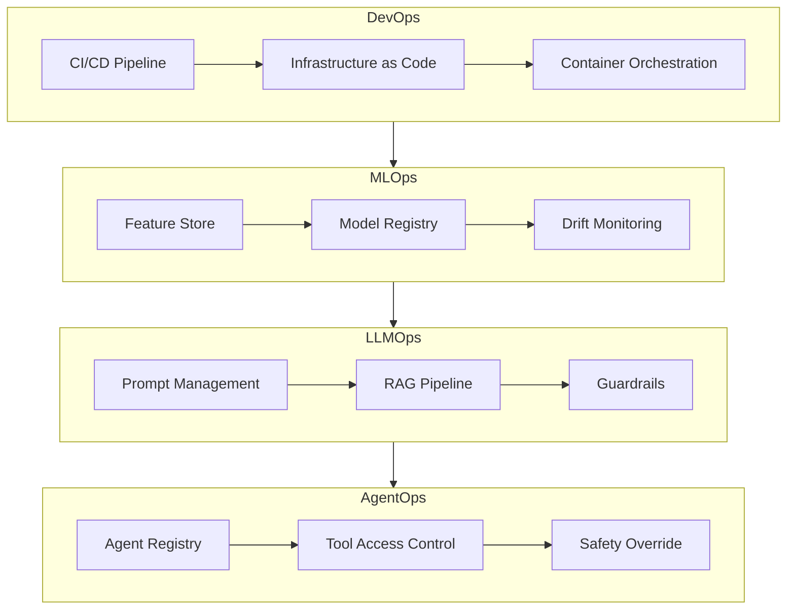
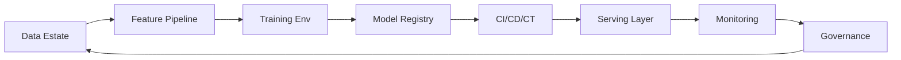
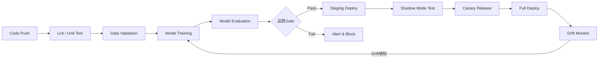
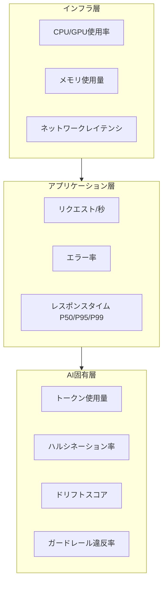

# AIソフトウェアアーキテクチャ2026年版：MLOps・LLMOps・AgentOpsの実践設計

## この記事でわかること

- DevOps → MLOps → LLMOps → AgentOps の4層Ops進化モデルとそれぞれの適用範囲
- Compound AIシステムの設計パターンと8つの構成要素
- MLOps/LLMOps/AgentOpsの具体的なアーキテクチャと主要ツール選定
- プロダクション環境でのAIシステム運用に必要なCI/CD/CTパイプライン設計
- Ops成熟度に応じた段階的導入戦略とコスト最適化の実践手法

## 対象読者

- **想定読者**: 中級〜上級のMLエンジニア・プラットフォームエンジニア
- **必要な前提知識**:
  - Python 3.11+の基本的な使い方
  - Docker/Kubernetesの基礎
  - REST APIの設計経験
  - 機械学習モデルの学習・推論の基本理解

## 結論・成果

2026年のAIソフトウェアアーキテクチャは、単一モデルの開発・デプロイから**複数コンポーネントが協調するCompound AIシステム**へと移行しています。MLOps Communityの調査によると、本番環境でのAIシステム運用において、適切なOpsフレームワークを導入した組織はモデルのデプロイサイクルを平均**60%短縮**し、障害検知時間を**70%削減**したと報告されています。本記事では、DevOps → MLOps → LLMOps → AgentOps の進化を整理し、プロダクション環境で実際に機能するアーキテクチャ設計を解説します。

## Ops進化の全体像を理解する

2026年現在、AIシステムの運用は単一の手法では対応できない複雑さに達しています。ソフトウェアのデプロイメント、MLモデルの管理、LLMの安全運用、自律エージェントの制御と、それぞれの課題に対応するOpsプラクティスが**レイヤー型**に積み重なっています。

### 4層Opsモデルの構造

各Opsは前の層を**置換するのではなく拡張する**関係にあります。以下の表は、各Opsの中核資産・主要リスク・代表ツールを整理したものです。

| Ops | 中核資産 | 主要リスク | 代表ツール |
|-----|----------|-----------|-----------|
| **DevOps** | コード・インフラ | デプロイ障害 | GitHub Actions, Terraform, K8s |
| **MLOps** | データ・モデル | モデルドリフト | MLflow, Feast, BentoML |
| **LLMOps** | プロンプト・推論 | ハルシネーション・コスト超過 | LangSmith, vLLM, Pinecone |
| **AgentOps** | エージェント・ツール・意思決定 | 制御不能な自律行動 | LangGraph, AutoGen, OpenTelemetry |



### DevOpsからMLOpsへの移行で変わること

DevOpsはコードの変更を**決定論的に**テスト・デプロイするパイプラインを提供します。しかし、MLモデルを導入すると**データが一級市民**になり、同じコードでもデータが変わればモデルの振る舞いが変わります。

MLOpsはこの課題に対して3つの拡張を加えます。

1. **データバージョニング**: DVC、lakeFS等でデータセットのスナップショット管理
2. **実験トラッキング**: MLflow、W&Bで学習パラメータと結果を記録
3. **継続的学習（CT）**: CI/CDに加え、データドリフト検知時の自動再学習パイプライン

```python
# mlflow_experiment.py - 実験トラッキングの最小例
import mlflow
from sklearn.ensemble import RandomForestClassifier
from sklearn.metrics import accuracy_score

mlflow.set_tracking_uri("http://mlflow-server:5000")
mlflow.set_experiment("fraud-detection-v2")

with mlflow.start_run():
    # ハイパーパラメータ記録
    params = {"n_estimators": 200, "max_depth": 10, "min_samples_split": 5}
    mlflow.log_params(params)

    # モデル学習
    model = RandomForestClassifier(**params)
    model.fit(X_train, y_train)

    # メトリクス記録
    y_pred = model.predict(X_test)
    accuracy = accuracy_score(y_test, y_pred)
    mlflow.log_metric("accuracy", accuracy)
    mlflow.log_metric("f1_score", f1_score(y_test, y_pred))

    # モデル登録
    mlflow.sklearn.log_model(
        model, "model",
        registered_model_name="fraud-detector"
    )
    print(f"Accuracy: {accuracy:.4f}")
```

**なぜMLflowを選ぶのか:**
- OSS（Apache 2.0）で、ベンダーロックインを回避できる
- 2026年時点でGenAI対応機能（プロンプトトラッキング等）が追加済み
- W&B（商用）と比較して、セルフホスト環境での運用が容易

**注意点:**
> MLflowはモデルの**学習**管理には適していますが、推論エンドポイントの管理やA/Bテストには別途BentoML・Seldonなどのサービングフレームワークが必要です。

### LLMOpsが解決する新しい課題

MLOpsのパイプラインでは、LLMの運用における以下の課題に対応できません。

1. **プロンプトのバージョン管理**: プロンプトはコードと同等の管理対象
2. **非決定的な出力の評価**: 同じ入力でも出力が異なるため、従来のユニットテストが通用しない
3. **コスト管理**: トークン単位の課金により、入力の長さが直接コストに影響
4. **ハルシネーション対策**: 事実と異なる出力を検知・抑制する仕組み

```python
# llmops_prompt_versioning.py - プロンプトバージョン管理の例
from dataclasses import dataclass
from datetime import datetime


@dataclass
class PromptVersion:
    """プロンプトバージョン管理"""
    name: str
    version: str
    template: str
    model: str
    max_tokens: int
    created_at: datetime

    def render(self, **kwargs: str) -> str:
        return self.template.format(**kwargs)


# プロンプトレジストリ（本番ではDB/MLflowに保存）
PROMPT_REGISTRY: dict[str, PromptVersion] = {
    "qa-v2.1": PromptVersion(
        name="qa-system",
        version="2.1",
        template=(
            "以下のコンテキストに基づいて質問に回答してください。\n"
            "コンテキストに含まれない情報は「情報が見つかりません」と回答してください。\n\n"
            "コンテキスト:\n{context}\n\n"
            "質問: {question}\n\n"
            "回答:"
        ),
        model="claude-sonnet-4-6",
        max_tokens=1024,
        created_at=datetime(2026, 3, 1),
    ),
}


def get_prompt(name: str) -> PromptVersion:
    """レジストリからプロンプトを取得"""
    if name not in PROMPT_REGISTRY:
        raise KeyError(f"Prompt '{name}' not found in registry")
    return PROMPT_REGISTRY[name]
```

LangSmithやLangfuseといったLLMOps専用のオブザーバビリティツールを使うと、プロンプトの変更が品質・コストに与える影響をトレースレベルで追跡できます。

### AgentOpsの登場と新たな運用課題

AgentOpsは、LLMを**ツール呼び出し・計画立案・意思決定**と組み合わせた自律エージェントを運用するためのプラクティスです。Gartnerのレポートによると、マルチエージェントシステムに関する問い合わせは2024年Q1から2025年Q2にかけて**1,445%増加**したと報告されています。

AgentOpsが従来のLLMOpsと異なるのは以下の点です。

- **権限管理**: エージェントがアクセスできるツール・データの範囲を制御
- **実行トレース**: マルチステップの推論過程を追跡・再現
- **安全オーバーライド**: 人間が介入してエージェントの行動を中断・修正する仕組み
- **コスト上限**: エージェントの自律実行によるトークン消費の上限設定

```python
# agentops_config.py - エージェント権限・安全制御の設計例
from dataclasses import dataclass, field
from enum import Enum


class ToolPermission(Enum):
    READ = "read"
    WRITE = "write"
    EXECUTE = "execute"


@dataclass
class AgentPolicy:
    """エージェントの権限・安全ポリシー"""
    agent_id: str
    allowed_tools: dict[str, set[ToolPermission]]
    max_steps: int = 10
    max_tokens_per_run: int = 50_000
    require_human_approval: bool = False
    timeout_seconds: int = 300

    def can_use_tool(self, tool_name: str, permission: ToolPermission) -> bool:
        if tool_name not in self.allowed_tools:
            return False
        return permission in self.allowed_tools[tool_name]


# エージェントポリシーの定義例
support_agent_policy = AgentPolicy(
    agent_id="support-agent-v1",
    allowed_tools={
        "search_knowledge_base": {ToolPermission.READ},
        "create_ticket": {ToolPermission.WRITE},
        "send_email": {ToolPermission.EXECUTE},
    },
    max_steps=15,
    max_tokens_per_run=30_000,
    require_human_approval=True,  # メール送信前に人間承認
    timeout_seconds=120,
)
```

**注意点:**
> AgentOpsはまだ発展途上の分野です。LangGraph、AutoGen、CrewAI等のフレームワークごとに可観測性の実装方法が異なり、統一的な標準は2026年3月時点では確立されていません。まずLLMOpsの基盤を固め、その上でエージェント機能を段階的に追加することが推奨されます。

## Compound AIシステムのアーキテクチャ設計

2026年のプロダクションAIシステムは、単一のモノリシックモデルではなく、**複数の専門コンポーネントが協調する分散アーキテクチャ**が主流です。Databricksのブログでは、このアプローチを「Compound AI Systems」と呼んでいます。

### なぜモノリシックモデルでは不十分なのか

単一の大規模モデルに全てを任せるアプローチには、以下の構造的な問題があります。

1. **コスト非効率**: 簡単な分類タスクにも高価な大規模モデルを使用
2. **障害の連鎖**: 1つのモデルの障害がシステム全体に波及
3. **更新の困難さ**: モデル更新が全機能に影響するためロールバックが困難
4. **専門性の欠如**: 汎用モデルはドメイン特化タスクで精度が不足する場合がある

### 8つの構成要素

プロダクショングレードのAIシステムは、以下の8つのレイヤーで構成されます。



| レイヤー | 役割 | 主要ツール（2026年） |
|---------|------|---------------------|
| **Data Estate** | 生データ保管・データガバナンス | Delta Lake, Iceberg, S3 |
| **Feature Pipeline** | 特徴量エンジニアリング | Feast, Tecton, Databricks FS |
| **Training Env** | モデル学習・実験管理 | MLflow, W&B, SageMaker |
| **Model Registry** | モデルバージョン・メタデータ管理 | MLflow Model Registry, Vertex AI |
| **CI/CD/CT** | 自動テスト・デプロイ・再学習 | GitHub Actions, Argo Workflows |
| **Serving Layer** | オンライン/バッチ推論 | vLLM, BentoML, Triton |
| **Monitoring** | ドリフト検知・パフォーマンスアラート | Prometheus, WhyLabs, Evidently |
| **Governance** | アクセス制御・監査ログ・コンプライアンス | OPA, MLflow ACL |

### モデルルーティングによるコスト最適化

Compound AIシステムで最もコスト効果が高いパターンの1つが、**タスクの複雑さに応じてモデルを使い分ける**ルーティングです。

```python
# model_router.py - タスク複雑度に基づくモデルルーティング
from dataclasses import dataclass
from enum import Enum


class ModelTier(Enum):
    FAST = "fast"      # 分類・抽出・ルーティング
    BALANCED = "balanced"  # 要約・QA・コード生成
    POWERFUL = "powerful"  # 複雑な推論・マルチステップ


@dataclass
class ModelConfig:
    model_id: str
    tier: ModelTier
    cost_per_1k_tokens: float  # USD
    avg_latency_ms: int


# 2026年3月時点のモデル構成例
MODEL_CONFIGS: dict[ModelTier, ModelConfig] = {
    ModelTier.FAST: ModelConfig(
        model_id="claude-haiku-4-5",
        tier=ModelTier.FAST,
        cost_per_1k_tokens=0.0008,
        avg_latency_ms=200,
    ),
    ModelTier.BALANCED: ModelConfig(
        model_id="claude-sonnet-4-6",
        tier=ModelTier.BALANCED,
        cost_per_1k_tokens=0.003,
        avg_latency_ms=800,
    ),
    ModelTier.POWERFUL: ModelConfig(
        model_id="claude-opus-4-6",
        tier=ModelTier.POWERFUL,
        cost_per_1k_tokens=0.015,
        avg_latency_ms=2000,
    ),
}


def route_request(query: str, context_length: int) -> ModelConfig:
    """クエリの複雑度に基づいてモデルを選択"""
    # 簡易ルーティングロジック（本番ではML分類器を使用）
    if context_length < 500 and len(query) < 100:
        return MODEL_CONFIGS[ModelTier.FAST]
    elif context_length < 5000:
        return MODEL_CONFIGS[ModelTier.BALANCED]
    else:
        return MODEL_CONFIGS[ModelTier.POWERFUL]
```

このルーティングパターンにより、RouteLLMの報告では**APIコストを40〜60%削減**しつつ、品質劣化を2%以内に抑えられたとされています。

**よくある間違い:**
> 最初は全リクエストに最上位モデルを使い、後からコスト最適化しようと考えがちですが、実際にはトラフィックが増えてからルーティングを導入すると、品質のベースラインが高すぎて切り替え時にユーザー体験の劣化が顕著になります。**最初から3層構成で設計**し、各層の品質基準を明確にすることが重要です。

## プロダクション向けCI/CD/CTパイプラインを構築する

AIシステムのCI/CDは、従来のソフトウェアのCI/CDに**データ検証**と**モデル評価**のステージを追加する必要があります。

### パイプライン全体設計



### CI/CD/CTの3つの自動化レイヤー

**CI（継続的インテグレーション）** はコードとデータの整合性を検証します。

```yaml
# .github/workflows/ml-ci.yml
name: ML CI Pipeline
on:
  push:
    paths:
      - 'src/**'
      - 'data/**'
      - 'prompts/**'

jobs:
  validate:
    runs-on: ubuntu-latest
    steps:
      - uses: actions/checkout@v4

      - name: Data schema validation
        run: |
          uv run python scripts/validate_schema.py \
            --schema data/schema.json \
            --data data/training/*.parquet

      - name: Prompt regression test
        run: |
          uv run python scripts/prompt_eval.py \
            --prompts prompts/ \
            --eval-set data/eval_cases.jsonl \
            --threshold 0.85

      - name: Unit tests
        run: uv run pytest tests/ -q --tb=short
```

**CD（継続的デリバリー）** はモデルのステージング・本番デプロイを自動化します。

**CT（継続的トレーニング）** はデータドリフト検知時にモデルの再学習を自動トリガーします。

```python
# drift_monitor.py - ドリフト検知と再学習トリガー
from dataclasses import dataclass
from datetime import datetime
import json


@dataclass
class DriftReport:
    """ドリフト検知レポート"""
    feature_name: str
    drift_score: float
    threshold: float
    detected_at: datetime
    is_drifted: bool

    def to_dict(self) -> dict:
        return {
            "feature": self.feature_name,
            "score": self.drift_score,
            "threshold": self.threshold,
            "drifted": self.is_drifted,
            "detected_at": self.detected_at.isoformat(),
        }


def check_drift(
    reference_stats: dict[str, float],
    current_stats: dict[str, float],
    threshold: float = 0.1,
) -> list[DriftReport]:
    """特徴量のドリフトを検知（PSI: Population Stability Index）"""
    reports = []
    for feature, ref_value in reference_stats.items():
        if feature not in current_stats:
            continue
        curr_value = current_stats[feature]
        # 簡易PSI計算（本番ではEvidently/WhyLabsを使用）
        if ref_value == 0:
            continue
        drift_score = abs(curr_value - ref_value) / ref_value
        reports.append(DriftReport(
            feature_name=feature,
            drift_score=drift_score,
            threshold=threshold,
            detected_at=datetime.now(),
            is_drifted=drift_score > threshold,
        ))
    return reports


def should_retrain(reports: list[DriftReport], max_drifted_ratio: float = 0.3) -> bool:
    """ドリフトした特徴量が一定割合を超えたら再学習"""
    if not reports:
        return False
    drifted_count = sum(1 for r in reports if r.is_drifted)
    return (drifted_count / len(reports)) > max_drifted_ratio
```

**トレードオフ:**
> CTパイプラインは自動化の恩恵が大きい一方、再学習の頻度が高すぎるとGPU/CPUコストが増大します。EvidentiallyやWhyLabsのドリフト検知はデフォルトの閾値が保守的（感度が高い）ため、プロダクション環境では**過去のドリフトイベントのログを分析して閾値を調整**する必要があります。

## オブザーバビリティとガバナンスを実装する

AIシステムの本番運用で最も見落とされがちなのが、**推論のオブザーバビリティ**と**モデルガバナンス**です。

### 推論オブザーバビリティの3層構造



| 監視項目 | メトリクス | アラート閾値例 | ツール |
|---------|-----------|-------------|-------|
| レイテンシ | P95 response time | > 3秒 | Prometheus + Grafana |
| コスト | トークン消費/日 | 予算の80%超過 | LangSmith, Langfuse |
| 品質 | ハルシネーション率 | > 5% | Guardrails AI, DeepEval |
| ドリフト | PSIスコア | > 0.2 | Evidently, WhyLabs |
| 安全性 | ガードレール違反 | > 1% | Guardrails AI, NeMo Guardrails |

### ガバナンスフレームワーク

AIガバナンスは「モデルの作成者・学習データ・評価結果・デプロイ日時」を**追跡可能な形で記録**することです。EUのAI規制法（AI Act）が2025年に施行され、日本でもAIガバナンスガイドラインが更新されている2026年において、これは技術的要件であると同時に法的要件でもあります。

```python
# governance_metadata.py - モデルガバナンスメタデータの記録
from dataclasses import dataclass, field
from datetime import datetime


@dataclass
class ModelGovernanceRecord:
    """モデルガバナンスのメタデータ"""
    model_id: str
    model_version: str
    created_by: str
    created_at: datetime
    training_data_hash: str
    evaluation_metrics: dict[str, float]
    approved_by: str | None = None
    approved_at: datetime | None = None
    deployment_env: str = "staging"
    risk_level: str = "medium"  # low, medium, high, critical
    data_lineage: list[str] = field(default_factory=list)
    compliance_tags: list[str] = field(default_factory=list)

    def is_approved_for_production(self) -> bool:
        """本番デプロイの承認チェック"""
        return (
            self.approved_by is not None
            and self.approved_at is not None
            and all(
                self.evaluation_metrics.get(m, 0) >= threshold
                for m, threshold in {
                    "accuracy": 0.90,
                    "latency_p95_ms": 3000,  # 以下であること
                }.items()
            )
        )
```

## 段階的導入戦略を設計する

全てのOps層を一度に導入するのは現実的ではありません。組織の成熟度に応じた**段階的アプローチ**が成功の鍵です。

### 成熟度モデルと導入ロードマップ

| フェーズ | 期間目安 | 導入するOps | 主要アクション |
|---------|---------|-----------|-------------|
| **Phase 1: 基盤** | 1-3ヶ月 | DevOps | CI/CD整備、コンテナ化、IaC導入 |
| **Phase 2: ML基盤** | 3-6ヶ月 | MLOps | 実験管理、Feature Store、モデルレジストリ |
| **Phase 3: LLM運用** | 6-9ヶ月 | LLMOps | プロンプト管理、RAGパイプライン、コスト監視 |
| **Phase 4: エージェント** | 9-12ヶ月 | AgentOps | エージェント権限管理、マルチステップ追跡、安全制御 |

**ハマりポイント:**
> Phase 2（MLOps）を飛ばしてPhase 3（LLMOps）に直接移行しようとする組織が多いですが、モデルバージョニング・評価パイプライン・ドリフト監視の基盤がないと、LLMの品質劣化を検知できず、本番障害の原因特定に時間がかかります。MLOpsの基盤は**LLMOpsの前提条件**です。

### ツール選定の判断基準

ツール選定で最も重要なのは、**既存のインフラとの統合コスト**です。

```python
# tool_selection_matrix.py - ツール選定の評価マトリクス
from dataclasses import dataclass


@dataclass
class ToolEvaluation:
    """ツール選定の評価項目"""
    name: str
    category: str
    oss_or_commercial: str
    cloud_agnostic: bool
    k8s_native: bool
    genai_support: bool
    community_size: str  # small, medium, large
    integration_effort_days: int

    def suitability_score(self) -> int:
        """適合度スコア（0-100）"""
        score = 0
        if self.cloud_agnostic:
            score += 25
        if self.k8s_native:
            score += 20
        if self.genai_support:
            score += 25
        if self.oss_or_commercial == "oss":
            score += 15
        community_scores = {"small": 5, "medium": 10, "large": 15}
        score += community_scores.get(self.community_size, 0)
        return score


# 2026年3月時点の評価例
tools = [
    ToolEvaluation("MLflow", "Experiment Tracking", "oss", True, True, True, "large", 5),
    ToolEvaluation("W&B", "Experiment Tracking", "commercial", True, False, True, "large", 3),
    ToolEvaluation("Feast", "Feature Store", "oss", True, True, False, "medium", 14),
    ToolEvaluation("LangSmith", "LLM Observability", "commercial", True, False, True, "large", 2),
    ToolEvaluation("Langfuse", "LLM Observability", "oss", True, True, True, "medium", 5),
]

for tool in tools:
    print(f"{tool.name}: {tool.suitability_score()}/100 ({tool.integration_effort_days}日で導入)")
```

## よくある問題と解決方法

| 問題 | 原因 | 解決方法 |
|------|------|----------|
| モデルデプロイ後に精度が低下 | 学習データと本番データの分布差 | Shadow modeでの事前検証 + ドリフト監視 |
| LLMのコストが予算を超過 | プロンプトの冗長化・不要なリトライ | モデルルーティング + プロンプト圧縮 + キャッシュ |
| エージェントが予期しない行動 | ツール権限の未設定 | AgentPolicy + Human-in-the-loop |
| CI/CDパイプラインが遅い | モデル学習がボトルネック | 増分学習 + モデルキャッシュ + GPU spot instance |
| ガバナンス監査で不合格 | メタデータ記録の欠如 | ModelGovernanceRecordの自動生成 + リネージ追跡 |

## まとめと次のステップ

**まとめ:**

- AIソフトウェアアーキテクチャは、DevOps → MLOps → LLMOps → AgentOps の**4層レイヤーモデル**で理解する
- 2026年のプロダクションAIは**Compound AIシステム**（複数モデル・コンポーネントの協調）が主流
- 8つの構成要素（Data Estate〜Governance）を段階的に導入し、CI/CD/CTパイプラインで自動化する
- AgentOpsはまだ発展途上であり、MLOps/LLMOpsの基盤を固めてから導入すべき
- オブザーバビリティとガバナンスは技術的要件であると同時に法的要件でもある

**次にやるべきこと:**

1. 自組織のOps成熟度を評価し、現在のフェーズ（Phase 1-4）を特定する
2. MLflow + GitHub Actions で最小限のMLOpsパイプラインを構築する
3. LLMを利用している場合はLangfuseでコスト・品質のオブザーバビリティを導入する

## 参考

- [MLOps Architecture: End-to-End Design for Production-Grade ML and LLM Systems](https://dev.to/apprecode/mlops-architecture-end-to-end-design-for-production-grade-ml-and-llm-systems-425g)
- [DevOps vs MLOps vs LLMOps vs AIOps vs AgentOps: Complete 2026 Guide](https://intellibytes.substack.com/p/devops-vs-mlops-vs-llmops-vs-aiops)
- [Architecting the AI Agent Platform: A Definitive Guide - MLOps Community](https://mlops.community/architecting-the-ai-agent-platform-a-definitive-guide/)
- [Compound AI Systems Blueprint Architecture (arXiv)](https://arxiv.org/abs/2504.08148)
- [Choosing Your AI Orchestration Stack for 2026 - The New Stack](https://thenewstack.io/choosing-your-ai-orchestration-stack-for-2026/)
- [MLOps in 2026: From MLflow to LLMOps (Medium)](https://medium.com/codex/mlops-in-2026-from-mlflow-to-llmops-the-complete-guide-to-shipping-ai-in-production-0024955b70c4)
- [FMOps/LLMOps：生成系 AI の運用と MLOps との違い (AWS Blog)](https://aws.amazon.com/jp/blogs/news/fmops-llmops-operationalize-generative-ai-and-differences-with-mlops/)

---

:::message
この記事はAI（Claude Code）により自動生成されました。内容の正確性については複数の情報源で検証していますが、実際の利用時は公式ドキュメントもご確認ください。
:::
