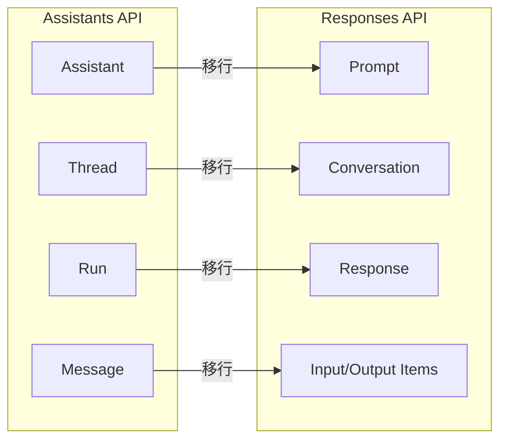
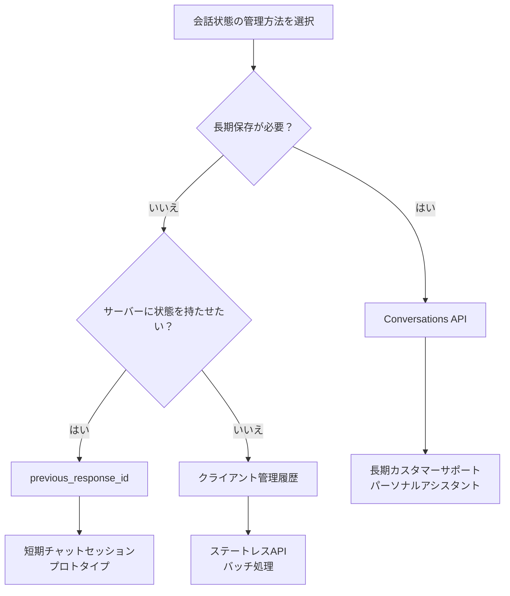

## この記事でわかること

- Assistants APIのThread管理の仕組みと5つの制約
- Responses APIにおける3つの状態管理パターンの使い分け
- Thread → Conversationへの移行コードと90日間のプレイブック
- キャッシュ利用率40-80%向上などResponses APIの定量的メリット

## 対象読者

- **想定読者**: OpenAI Assistants APIを本番利用している中級以上の開発者
- **必要な前提知識**:
  - Python 3.10+の基本文法
  - OpenAI API（Chat Completions）の基本的な使い方
  - REST APIの基礎知識

## 結論・成果

OpenAIは2026年8月26日にAssistants APIを完全廃止します。後継のResponses API + Conversations APIへ移行すると、ポーリング不要のシンプルなコード、キャッシュ利用率40-80%の向上、deep research・MCP・computer useなどの新機能へのアクセスが得られます。本記事では3つの状態管理パターンと90日間の段階的移行プレイブックを解説します。

## Assistants APIのThread管理：仕組みと制約

### Threadの基本概念

Assistants APIにおけるThreadは、AssistantとUserの間の会話セッションを表すオブジェクトです。1つのThreadに最大100,000件のメッセージを保持でき、モデルのコンテキストウィンドウを超えた場合は自動的にトランケーションが行われます。

```python
from openai import OpenAI

client = OpenAI()

# Threadの作成
thread = client.beta.threads.create()
print(f"Thread ID: {thread.id}")  # thread_abc123...

# メッセージの追加
message = client.beta.threads.messages.create(
    thread_id=thread.id,
    role="user",
    content="RAGパイプラインの設計パターンを教えてください"
)

# Runの作成と実行
run = client.beta.threads.runs.create(
    thread_id=thread.id,
    assistant_id="asst_abc123"
)
```

### トランケーション戦略

Threadが長くなった場合、`truncation_strategy`パラメータで制御できます。

```python
run = client.beta.threads.runs.create(
    thread_id=thread.id,
    assistant_id="asst_abc123",
    truncation_strategy={
        "type": "last_messages",
        "last_messages": 10  # 直近10メッセージのみコンテキストに含める
    }
)
```

| 戦略 | 挙動 | ユースケース |
|------|------|-------------|
| `auto` | モデルのコンテキスト長に応じて自動調整 | 一般的な会話 |
| `last_messages` | 指定した直近N件のみ使用 | 長期会話でコスト抑制 |

### Thread管理の5つの制約

Assistants APIのThread管理には、運用上の制約がいくつか存在します。

**1. Thread一覧APIの不在**

Thread一覧を取得するAPIが存在しません。`thread_id`は作成時に返却されるだけで、後から検索する手段がないため、自前のデータベースでユーザーIDとthread_idのマッピングを管理する必要があります。

**2. Run中のThreadロック**

Runの実行中はThreadがロックされ、他のRunやメッセージの追加ができません。並行リクエストが発生するアプリケーションではキューイングの実装が必要になります。

**3. デバッグ用ダッシュボードの不在**

Thread内のメッセージをGUIで確認できるダッシュボードが提供されていません。デバッグ時はAPIを直接叩いてメッセージを取得するか、Playground経由で確認する必要があります。

**4. ポーリングベースの実行**

Runのステータス確認にはポーリングが必要で、レイテンシの増加やAPIコールの無駄が発生します。

```python
import time

run = client.beta.threads.runs.create(
    thread_id=thread.id,
    assistant_id="asst_abc123"
)

# ポーリングでRunの完了を待つ
while run.status in ["queued", "in_progress"]:
    time.sleep(1)
    run = client.beta.threads.runs.retrieve(
        thread_id=thread.id,
        run_id=run.id
    )

if run.status == "completed":
    messages = client.beta.threads.messages.list(thread_id=thread.id)
```

**5. 新機能の非対応**

deep research、MCP（Model Context Protocol）、computer useといった新機能はResponses APIでのみ利用可能であり、Assistants APIでは使えません。

## 廃止スケジュールと概念マッピング

### タイムライン

| 日付 | イベント |
|------|---------|
| 2026年初頭 | Responses API・Conversations API一般提供開始 |
| 2026年8月26日 | Assistants API完全廃止 |

OpenAIは自動移行ツールを提供しない方針のため、開発者が自らコードを書き換える必要があります。

### 概念マッピング

Assistants APIの各概念は、Responses APIでは以下のように対応します。



| Assistants API | Responses API | 備考 |
|---------------|---------------|------|
| Assistant | Prompt | ダッシュボードで作成・バージョン管理可能 |
| Thread | Conversation | サーバーサイドの永続状態管理 |
| Run | Response | ポーリング不要、同期/ストリーミング対応 |
| Message | Input/Output Items | ロール付きのテキスト・画像・ツール結果 |

**Promptsの特徴**: Assistants APIのAssistantはAPIで作成していましたが、Responses APIのPromptはOpenAIダッシュボードで作成・管理します。バージョン管理機能があり、A/Bテストやロールバックが容易になっています。

## Responses APIの3つの状態管理パターン

Responses APIでは、会話状態の管理方法を3つのパターンから選択できます。アプリケーションの要件に応じて使い分けることが重要です。

### パターン1: Conversations API（サーバーサイド永続管理）

Conversations APIは、OpenAIのサーバー側で会話状態を永続的に管理するパターンです。Assistants APIのThread管理に最も近い概念であり、長期間にわたる会話に適しています。

```python
from openai import OpenAI

client = OpenAI()

# Conversationの作成
conversation = client.conversations.create()
print(f"Conversation ID: {conversation.id}")

# 最初のメッセージ送信
response = client.responses.create(
    model="gpt-4o-mini",
    input=[{"role": "user", "content": "Pythonでのasync/awaitについて教えてください"}],
    conversation={"id": conversation.id}
)
print(response.output_text)

# 会話の継続（同じconversation IDを使用）
follow_up = client.responses.create(
    model="gpt-4o-mini",
    input=[{"role": "user", "content": "具体的なコード例を見せてください"}],
    conversation={"id": conversation.id}
)
print(follow_up.output_text)
```

**Conversations APIの特徴**:

- 30日TTLなし（indefinite保持）。Threadの場合は明示的な削除が必要だったが、Conversationsは期限切れを心配する必要がない
- Thread一覧APIと異なり、Conversationの管理APIが提供される
- `conversation`パラメータと`previous_response_id`は同時に使用不可

#### 会話の取得と管理

```python
# Conversationの取得
conversation = client.conversations.retrieve(conversation.id)

# Conversation内のResponseを一覧取得
responses = client.conversations.list_responses(conversation.id)
for resp in responses:
    print(f"Response ID: {resp.id}, Created: {resp.created_at}")
```

### パターン2: previous_response_idチェーン（簡易的な会話継続）

`previous_response_id`を使って、Responseを数珠つなぎにするパターンです。サーバーサイドに暗黙的な会話チェーンが構築されます。

```python
from openai import OpenAI

client = OpenAI()

# 最初のResponse
first = client.responses.create(
    model="gpt-4o-mini",
    input="Dockerコンテナの基本について教えてください",
)
print(f"First Response ID: {first.id}")
print(first.output_text)

# 2番目のResponse（前のResponseにチェーン）
second = client.responses.create(
    model="gpt-4o-mini",
    previous_response_id=first.id,
    input=[{"role": "user", "content": "docker-composeとの違いは？"}],
)
print(second.output_text)

# 3番目のResponse（チェーンを継続）
third = client.responses.create(
    model="gpt-4o-mini",
    previous_response_id=second.id,
    input=[{"role": "user", "content": "本番環境でのベストプラクティスを教えてください"}],
)
print(third.output_text)
```

**特徴**:

- Conversation IDの事前作成が不要で手軽
- Responseはデフォルト30日間保持される（`store: false`で無効化可能）
- WebSocketでの低レイテンシ通信にも対応
- 短いセッションやプロトタイピングに最適

**注意**: `previous_response_id`と`conversation`パラメータは排他的です。両方を同時に指定するとエラーになります。

### パターン3: クライアント管理履歴（完全ステートレス）

アプリケーション側で会話履歴を管理し、毎回全履歴を`input`に含めるパターンです。OpenAIサーバーには状態を一切持たせません。

```python
from openai import OpenAI

client = OpenAI()


class ConversationManager:
    """クライアント側で会話履歴を管理するクラス"""

    def __init__(self, model: str = "gpt-4o-mini"):
        self.model = model
        self.history: list[dict[str, str]] = []
        self.system_prompt = "あなたは技術的な質問に丁寧に回答するアシスタントです。"

    def send(self, user_message: str) -> str:
        """メッセージを送信し、履歴を更新する"""
        self.history.append({"role": "user", "content": user_message})

        input_messages = [
            {"role": "developer", "content": self.system_prompt},
            *self.history
        ]

        response = client.responses.create(
            model=self.model,
            input=input_messages,
            store=False,  # サーバーに状態を保存しない
        )

        assistant_message = response.output_text
        self.history.append({"role": "assistant", "content": assistant_message})

        return assistant_message

    def clear(self) -> None:
        """会話履歴をクリアする"""
        self.history.clear()

    def get_token_estimate(self) -> int:
        """おおよそのトークン数を見積もる（1文字≒0.5トークンの簡易計算）"""
        total_chars = sum(len(m["content"]) for m in self.history)
        return int(total_chars * 0.5)


# 使用例
conv = ConversationManager()
print(conv.send("FastAPIでCRUDアプリを作る手順を教えてください"))
print(conv.send("バリデーションはどう実装しますか？"))
print(f"推定トークン数: {conv.get_token_estimate()}")
```

**特徴**:

- サーバーへの依存がなく、完全にステートレス
- 水平スケーリングが容易（セッションアフィニティ不要）
- トークンコストが毎回全履歴分かかる
- 履歴が長くなるとコンテキストウィンドウを圧迫

### パターン比較



| 観点 | Conversations API | previous_response_id | クライアント管理 |
|------|------------------|---------------------|----------------|
| 状態の保存先 | OpenAIサーバー | OpenAIサーバー（暗黙的） | アプリ側 |
| 保持期間 | 無期限 | 30日（デフォルト） | アプリ依存 |
| セットアップ | Conversation作成が必要 | 不要 | 不要 |
| トークンコスト | 差分のみ送信 | 差分のみ送信 | 毎回全履歴送信 |
| スケーラビリティ | 中 | 中 | 高 |
| 新機能対応 | 対応 | 対応 | 対応 |
| ZDR対応 | encrypted reasoning items | encrypted reasoning items | store: false |

## Responses APIへの移行メリット

### パフォーマンス向上

Responses APIは、Assistants APIに対していくつかの定量的な改善が報告されています。

- **キャッシュ利用率40-80%向上**: `previous_response_id`を使った会話チェーンでは、前回のレスポンスがキャッシュとして活用されるため、共通プレフィックスのキャッシュヒット率が向上します
- **SWE-benchで3%の性能向上**: コーディングタスクのベンチマークでの改善が報告されています
- **ポーリング不要**: Assistants APIではRun完了をポーリングで確認する必要がありましたが、Responses APIは同期レスポンスまたはストリーミングで結果が返ります

### コード簡素化

Assistants APIでの典型的な処理フローとResponses APIの比較です。

```python
# === Assistants API: 複雑なフロー ===
# 1. Assistantの作成/取得
# 2. Threadの作成
# 3. Messageの追加
# 4. Runの作成
# 5. Runの完了をポーリング
# 6. Messageの取得

assistant = client.beta.assistants.create(
    name="Tech Advisor",
    instructions="技術的な質問に回答してください",
    model="gpt-4o-mini"
)
thread = client.beta.threads.create()
client.beta.threads.messages.create(
    thread_id=thread.id,
    role="user",
    content="Pythonの型ヒントについて教えてください"
)
run = client.beta.threads.runs.create(
    thread_id=thread.id,
    assistant_id=assistant.id
)
# ポーリング
import time
while run.status in ["queued", "in_progress"]:
    time.sleep(1)
    run = client.beta.threads.runs.retrieve(
        thread_id=thread.id, run_id=run.id
    )
messages = client.beta.threads.messages.list(thread_id=thread.id)
answer = messages.data[0].content[0].text.value
```

```python
# === Responses API: シンプルなフロー ===
# 1. Responseの作成（同期で完了）

response = client.responses.create(
    model="gpt-4o-mini",
    instructions="技術的な質問に回答してください",
    input=[{"role": "user", "content": "Pythonの型ヒントについて教えてください"}],
)
answer = response.output_text
```

行数が大幅に削減されるだけでなく、ポーリングロジックやエラーハンドリングも簡素化されます。

### 新機能へのアクセス

Responses APIでのみ利用可能な機能が増えています。

| 機能 | 概要 |
|------|------|
| Deep Research | 複数ソースの自動調査・統合 |
| MCP (Model Context Protocol) | 外部ツール・データソース統合の標準規格 |
| Computer Use | ブラウザ・デスクトップの自動操作 |
| Web Search | 組み込みのWeb検索ツール |
| File Search (改良版) | ベクトルストア検索の改良 |

## 移行の実装手順

### ステップ1: 依存関係の整理

まず、コードベース内で`client.beta.threads`や`client.beta.assistants`を検索し、Assistants API呼び出し箇所を洗い出します。`grep -r "beta.threads\|beta.assistants" --include="*.py" .`のようなコマンドで一覧化できます。

### ステップ2: Assistantの移行

Assistantの`instructions`と`tools`をResponses APIの形式に変換します。

```python
"""Assistantの設定をResponses API形式に変換する"""
from openai import OpenAI

client = OpenAI()


def migrate_assistant_config(assistant_id: str) -> dict:
    """Assistantの設定をResponses API互換の辞書に変換する"""
    assistant = client.beta.assistants.retrieve(assistant_id)

    config = {
        "model": assistant.model,
        "instructions": assistant.instructions or "",
        "tools": [],
    }

    for tool in assistant.tools:
        if tool.type == "code_interpreter":
            config["tools"].append({"type": "code_interpreter"})
        elif tool.type == "file_search":
            config["tools"].append({
                "type": "file_search",
                "vector_store_ids": (
                    assistant.tool_resources.file_search.vector_store_ids
                    if assistant.tool_resources
                    and assistant.tool_resources.file_search
                    else []
                ),
            })
        elif tool.type == "function":
            config["tools"].append({
                "type": "function",
                "name": tool.function.name,
                "description": tool.function.description,
                "parameters": tool.function.parameters,
            })

    return config


# 変換例
config = migrate_assistant_config("asst_abc123")
print(f"Model: {config['model']}")
print(f"Tools: {len(config['tools'])} 個")
```

### ステップ3: Thread履歴の移行

既存ThreadのメッセージをConversation形式に変換して移行します。OpenAIは自動移行ツールを提供しない方針のため、`client.beta.threads.messages.list()`で既存メッセージを取得し、Conversationを作成して`client.responses.create()`に全メッセージを渡す処理を自前で実装する必要があります。

> **注意**: 全ユーザーのThreadを一括移行するのではなく、新規ユーザーから順にConversationsに移行し、既存ユーザーは必要に応じてバックフィルする方法をOpenAIは推奨しています。

### ステップ4: Function Callingの移行

Assistants APIのFunction CallingをResponses APIに書き換えます。

```python
"""Function Callingの移行例"""
import json
from openai import OpenAI

client = OpenAI()

# ツール定義（Assistants APIとResponses APIで共通）
tools = [
    {
        "type": "function",
        "function": {
            "name": "get_weather",
            "description": "指定された都市の現在の天気を取得する",
            "parameters": {
                "type": "object",
                "properties": {
                    "city": {
                        "type": "string",
                        "description": "都市名（例: 東京）"
                    }
                },
                "required": ["city"],
                },
        },
    }
]


def get_weather(city: str) -> dict:
    """天気情報を返す（モック）"""
    return {"city": city, "temperature": 22, "condition": "晴れ"}


# === Responses APIでのFunction Calling ===
response = client.responses.create(
    model="gpt-4o-mini",
    input=[{"role": "user", "content": "東京の天気を教えてください"}],
    tools=tools,
)

# ツール呼び出しの処理
tool_outputs = []
for item in response.output:
    if item.type == "function_call":
        args = json.loads(item.arguments)
        result = get_weather(**args)
        tool_outputs.append({
            "type": "function_call_output",
            "call_id": item.call_id,
            "output": json.dumps(result, ensure_ascii=False),
        })

# ツール結果を含めて再度リクエスト
if tool_outputs:
    final_response = client.responses.create(
        model="gpt-4o-mini",
        previous_response_id=response.id,
        input=tool_outputs,
    )
    print(final_response.output_text)
```

## ストリーミングの移行

Assistants APIのストリーミングは`AssistantEventHandler`をオーバーライドする複雑な実装が必要でしたが、Responses APIではシンプルになります。

```python
"""ストリーミングの移行例"""
from openai import OpenAI

client = OpenAI()

# === Responses APIのストリーミング ===
stream = client.responses.create(
    model="gpt-4o-mini",
    input=[{"role": "user", "content": "Pythonのデコレータを解説してください"}],
    stream=True,
)

for event in stream:
    if event.type == "response.output_text.delta":
        print(event.delta, end="", flush=True)
    elif event.type == "response.completed":
        print("\n[完了]")
```

会話状態を維持しながらストリーミングする場合：

```python
# Conversations API + ストリーミング
conversation = client.conversations.create()

stream = client.responses.create(
    model="gpt-4o-mini",
    input=[{"role": "user", "content": "非同期処理とは何ですか？"}],
    conversation={"id": conversation.id},
    stream=True,
)

response_id = None
for event in stream:
    if event.type == "response.output_text.delta":
        print(event.delta, end="", flush=True)
    elif event.type == "response.completed":
        response_id = event.response.id
        print()

# 会話の継続
follow_up_stream = client.responses.create(
    model="gpt-4o-mini",
    input=[{"role": "user", "content": "Pythonでの具体例を見せてください"}],
    conversation={"id": conversation.id},
    stream=True,
)

for event in follow_up_stream:
    if event.type == "response.output_text.delta":
        print(event.delta, end="", flush=True)
```

## 90日間移行プレイブック

移行を安全に進めるための推奨タイムラインを示します。

```mermaid
gantt
    title 90日間移行タイムライン
    dateFormat  X
    axisFormat %s日目

    section フェーズ1: 準備
    アーキテクチャ設計          :a1, 0, 15
    状態管理パターン決定        :a2, 5, 15
    テスト環境構築              :a3, 10, 20

    section フェーズ2: 実装
    コード変換                  :b1, 15, 40
    Shadow traffic テスト       :b2, 30, 50
    単体・結合テスト            :b3, 35, 55

    section フェーズ3: ロールアウト
    カナリア 5%                 :c1, 55, 65
    カナリア 25%                :c2, 65, 72
    カナリア 50%                :c3, 72, 80
    全トラフィック移行          :c4, 80, 85
    レガシー撤去                :c5, 85, 90
```



### T-90 ~ T-75: アーキテクチャ確定（フェーズ1前半）

1. **現状分析**: Assistants API呼び出し箇所の洗い出し
2. **パターン選定**: 3つの状態管理パターンから最適なものを選択
3. **影響範囲の特定**: Thread ID管理DB、ポーリングロジック、エラーハンドリング

移行チェックリスト:
- [ ] Assistants API呼び出し箇所を全て特定したか
- [ ] Thread IDの保存先（DB/キャッシュ）を把握したか
- [ ] ポーリングロジックの箇所を特定したか
- [ ] Function Callingのツール定義を一覧化したか
- [ ] ストリーミング実装の有無を確認したか
- [ ] テスト環境でResponses APIの動作確認をしたか

### T-75 ~ T-60: テスト環境構築（フェーズ1後半）

4. **テスト環境でのResponses API動作確認**
5. **既存テストのResponses API版を作成**
6. **パフォーマンスベンチマークの準備**

### T-60 ~ T-40: コード変換（フェーズ2前半）

7. **Assistant設定の移行**: `instructions`、`tools`をResponses API形式に変換
8. **Thread管理の移行**: 選択したパターンに応じたコード変換
9. **Function Callingの移行**: ツール定義とハンドリングの書き換え

### T-40 ~ T-30: Shadow Trafficテスト（フェーズ2後半）

10. **Shadow traffic**: 本番リクエストのコピーをResponses APIにも送信し、結果を比較。`asyncio.gather`で両APIに並列リクエストを送り、成功率・レイテンシ・出力の類似度を記録します。

### T-30 ~ T-5: カナリアロールアウト（フェーズ3）

11. **5%カナリア**: 少量のトラフィックをResponses APIに流す
12. **25%カナリア**: 問題なければ段階的に拡大
13. **50%カナリア**: メトリクスを監視しながら拡大

```python
"""カナリアルーティングの実装例"""
import hashlib


def should_use_responses_api(user_id: str, canary_percent: int) -> bool:
    """ユーザーIDに基づいてカナリア判定を行う

    Args:
        user_id: ユーザーの一意識別子
        canary_percent: Responses APIに流す割合（0-100）

    Returns:
        True: Responses APIを使用, False: Assistants APIを使用
    """
    hash_value = int(hashlib.sha256(user_id.encode()).hexdigest(), 16)
    return (hash_value % 100) < canary_percent


# 使用例
user_id = "user_12345"
if should_use_responses_api(user_id, canary_percent=25):
    # Responses APIで処理
    response = client.responses.create(
        model="gpt-4o-mini",
        input=[{"role": "user", "content": "質問内容"}],
    )
else:
    # Assistants APIで処理（レガシー）
    pass  # 既存のコード
```

### T-5 ~ T-0: レガシー撤去（フェーズ3後半）

14. **全トラフィック移行**: 100%をResponses APIに切り替え
15. **レガシーコード削除**: Assistants API関連のコードを撤去
16. **Thread管理DBのクリーンアップ**: 不要になったthread_idマッピングの削除

## 移行時の注意点

### よくある落とし穴

**1. conversationとprevious_response_idの同時使用**

```python
# これはエラーになる
response = client.responses.create(
    model="gpt-4o-mini",
    input=[{"role": "user", "content": "質問"}],
    conversation={"id": "conv_abc123"},
    previous_response_id="resp_xyz789",  # 同時指定不可
)
```

**2. store: falseの副作用**

`store: false`を設定すると、`previous_response_id`でチェーンすることができなくなります。ZDR要件がある場合はクライアント管理パターンを選択するか、encrypted reasoning itemsを使用してください。

**3. Responseの30日デフォルト保持**

`previous_response_id`で参照するResponseは、デフォルトで30日間保持されます。30日を超えた場合、チェーンが切れるため注意が必要です。Conversations APIを使用すれば、この制限はありません。

### 互換性テストのポイント

移行前後の出力を比較する際は、以下の観点でテストを実施します。

| テスト項目 | 検証内容 |
|-----------|---------|
| 単一ターン応答 | 同じ入力に対する応答品質の一致 |
| マルチターン文脈保持 | 会話の流れが維持されるか |
| Function Calling | ツール呼び出しのスキーマ互換性 |
| ストリーミング | SSEイベントの完全性 |
| レイテンシ | ポーリング廃止による改善を計測 |

## まとめ

Assistants APIからResponses APIへの移行は、2026年8月26日の廃止期限に向けて全ての利用者が取り組む必要がある課題です。本記事で解説した内容を整理すると以下のようになります。

**Assistants APIの制約**:
- Thread一覧APIの不在、Run中のロック、ポーリング必須、デバッグ困難
- 新機能（deep research、MCP、computer use）が利用不可

**Responses APIの3つの状態管理パターン**:
1. **Conversations API**: 長期会話向け。30日TTLなし
2. **previous_response_idチェーン**: 短期セッション向け。30日保持
3. **クライアント管理履歴**: ステートレスサーバー向け。完全な制御

**移行のポイント**:
- 90日間のタイムラインでフェーズ分けして段階的に進める
- Shadow trafficで本番リクエストの互換性を検証
- カナリアロールアウト（5% → 25% → 50% → 100%）で安全に切り替え
- `conversation`と`previous_response_id`の排他性に注意

Responses APIへの移行は、コードの簡素化やキャッシュ利用率の向上といった実利的なメリットがあります。廃止期限を待つことなく、テスト環境での検証から始めることをおすすめします。

## 参考

- [OpenAI Assistants API Deep Dive](https://developers.openai.com/api/docs/assistants/deep-dive/)
- [OpenAI Assistants API Migration Guide](https://developers.openai.com/api/docs/assistants/migration/)
- [OpenAI Conversation State Management](https://developers.openai.com/api/docs/guides/conversation-state/)
- [Migrate to the Responses API](https://developers.openai.com/api/docs/guides/migrate-to-responses/)
- [Assistants API to Responses API Migration Playbook 2026](https://igor-ya.com/posts/assistants-api-to-responses-api-migration-playbook-2026/)

---

## 関連する深掘り記事

この記事で紹介した技術について、さらに深掘りした記事を書きました：

- [OpenAI Responses API設計思想の解説](https://0h-n0.github.io/posts/techblog-openai-responses-api-design/) - tech_blog解説
- [論文解説: Stateful LLM Serving with Pensieve](https://0h-n0.github.io/posts/paper-pensieve-2312-05516/) - arxiv解説
- [論文解説: ToolSandbox - LLMツール利用ベンチマーク](https://0h-n0.github.io/posts/paper-toolsandbox-2408-04682/) - arxiv解説
- [Anthropic Model Context Protocol (MCP)解説](https://0h-n0.github.io/posts/techblog-anthropic-mcp/) - tech_blog解説
- [論文解説: CacheBlend - RAG向けKVキャッシュ融合](https://0h-n0.github.io/posts/paper-cacheblend-2405-16444/) - arxiv解説

:::message
これらの記事は修士学生レベルを想定した技術的詳細（数式・実装の深掘り）を含みます。
:::

---

:::message
この記事はAI（Claude Code）により自動生成されました。内容の正確性については複数の情報源で検証していますが、実際の利用時は公式ドキュメントもご確認ください。
:::
