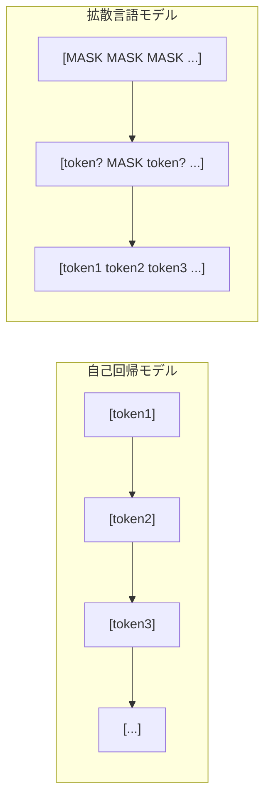
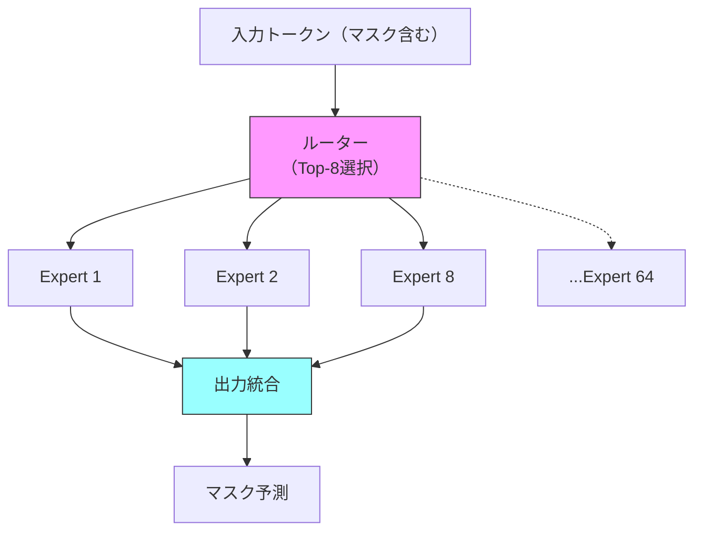

# 拡散言語モデル2026年動向：Mercury・LLaDA・MoE統合の実装と展望

## この記事でわかること

- 拡散言語モデル（Diffusion Language Model, DLM）の基本原理と自己回帰モデルとの構造的差異
- Mercury 2・LLaDA 2.0・LLaDA-MoEなど2025〜2026年の主要モデルの性能比較
- MoE（Mixture of Experts）アーキテクチャと拡散モデルの統合がもたらす計算効率化
- 2026年のGPU供給動向（H200・Blackwell）と拡散モデル推論への影響
- コード生成・タンパク質設計など実応用分野での採用状況と今後の研究方向

## 対象読者

- **想定読者**: 中級〜上級のML/LLMエンジニア
- **必要な前提知識**:
  - Transformerアーキテクチャの基本理解
  - 拡散モデル（画像生成分野）の概念
  - Python・PyTorchの基礎

## 結論・成果

2026年3月時点で、拡散言語モデルは自己回帰（AR）モデルの独占状態に対する有力な代替パラダイムとして急速に台頭しています。Inception Labsの**Mercury 2**は約1,000 tokens/secの出力スループットを達成し、GPT-5 Miniの約14倍、Claude 4.5 Haiku Reasoningの約11倍の速度を報告しています（[BusinessWire, 2026年2月](https://www.businesswire.com/news/home/20260224034496/en/)）。一方、**LLaDA 2.0**は拡散言語モデルを100Bパラメータにスケーリングし、コーディングベンチマークではAR同等以上のスコアを記録しています（[arXiv:2512.15745](https://arxiv.org/abs/2512.15745)）。さらに**LLaDA-MoE**がMoEと拡散モデルの初統合に成功し、7Bパラメータ中わずか1.4Bの活性化で高い性能を達成しています。

ただし、拡散言語モデルのエコシステムはまだ成熟途上であり、ARモデル向けに最適化されたKVキャッシュなどの推論インフラが直接適用できないという制約があります。

## 拡散言語モデルの基本原理を理解する

拡散言語モデルは、画像生成で成功した拡散プロセスをテキスト生成に応用したアプローチです。ARモデルがトークンを左から右へ逐次生成するのに対し、拡散言語モデルは**全トークンを同時に生成し、反復的にノイズを除去**していきます。

### ARモデルとの構造的差異



ARモデルでは、各トークンの生成に前のトークンの生成完了を待つ必要があるため、**生成速度がシーケンス長に対して線形にスケール**します。一方、拡散言語モデルでは複数トークンを並列に予測できるため、理論上は大幅な高速化が可能です。

### マスク拡散の数学的定式化

離散拡散言語モデルの代表的な手法であるマスク拡散（Masked Diffusion）では、以下のプロセスで学習と生成を行います。

**前方過程（Forward Process）**: 入力テキスト $x_0 = (x_0^1, x_0^2, \ldots, x_0^L)$ の各トークンを独立にマスクトークン $[M]$ に置換します。時刻 $t$ におけるマスク確率は以下で定義されます。

$$q(x_t^i = [M] \mid x_0^i) = t, \quad q(x_t^i = x_0^i \mid x_0^i) = 1 - t$$

**逆過程（Reverse Process）**: マスクされたトークンをTransformerで予測し、段階的にアンマスクします。モデルは $p_\theta(x_0^i \mid x_t)$ を学習し、各ステップでマスクトークンの一部を復元します。

**学習目標**: 以下の変分下界（ELBO）を最大化します。

$$\mathcal{L} = \mathbb{E}_{t, x_0, x_t} \left[ \sum_{i: x_t^i = [M]} \log p_\theta(x_0^i \mid x_t) \right]$$

この定式化のポイントは、**因果マスク（causal mask）を使わない双方向Transformer**で予測を行う点です。つまり、各トークンの予測時にシーケンス全体のコンテキストを利用できます。

### 拡散言語モデルのメリットと制約

| 特性 | 自己回帰モデル | 拡散言語モデル |
|------|---------------|---------------|
| 生成方向 | 左→右（一方向） | 全方向（双方向） |
| 並列生成 | 不可 | 可能 |
| KVキャッシュ | 利用可能 | 直接適用不可 |
| 推論ステップ数 | シーケンス長に比例 | 固定ステップ数（調整可能） |
| 生成品質の制御 | 限定的 | 反復的改善が可能 |
| エコシステム成熟度 | 高い | 発展途上 |

**注意点:**
> 現在のML推論インフラ（vLLM、TGI等）はARモデル向けに最適化されています。拡散言語モデルを本番環境で利用する場合、専用の推論エンジンが必要になることが多く、2026年3月時点ではMercuryのAPIやdLLMフレームワークなど選択肢は限られています。

## 2025〜2026年の主要モデルを比較する

### LLaDA：拡散言語モデルのスケーリング実証

**LLaDA（Large Language Diffusion with mAsking）** は、2025年2月にarXivで公開された拡散言語モデルです（[arXiv:2502.09992](https://arxiv.org/abs/2502.09992)）。NeurIPS 2025でOral採択されており、拡散言語モデルの研究加速に大きく貢献しました。

**主な特徴:**

- LLaMA3と同様のTransformerアーキテクチャを使用し、**因果マスクを双方向マスクに置換**
- 8Bパラメータモデルを2.3兆トークンでスクラッチ学習（H800 GPU 13万時間）
- In-context learningでLLaMA3 8Bと同等の性能
- **反転の呪い（Reversal Curse）でGPT-4oを上回る性能**を報告

```python
# LLaDA推論の概念的な実装例
import torch

class MaskedDiffusionInference:
    """マスク拡散による推論の簡略実装"""

    def __init__(self, model, vocab_size: int, num_steps: int = 64):
        self.model = model
        self.vocab_size = vocab_size
        self.num_steps = num_steps
        self.mask_token_id = vocab_size  # マスクトークンID

    def generate(self, prompt_ids: torch.Tensor, gen_length: int) -> torch.Tensor:
        """マスク拡散ベースの生成"""
        device = prompt_ids.device

        # 生成部分を全マスクで初期化
        masked = torch.full(
            (1, gen_length), self.mask_token_id, device=device
        )
        x_t = torch.cat([prompt_ids, masked], dim=1)

        for step in range(self.num_steps, 0, -1):
            t = step / self.num_steps

            # 全マスク位置の予測確率を取得（双方向コンテキスト）
            logits = self.model(x_t, t=t)  # (1, seq_len, vocab_size)

            # マスクされた位置のみ処理
            mask_positions = (x_t == self.mask_token_id)

            # アンマスクするトークン数を計算
            num_to_unmask = max(
                1,
                int(mask_positions.sum() / step)
            )

            # 信頼度の高い位置からアンマスク
            probs = torch.softmax(logits, dim=-1)
            confidence = probs.max(dim=-1).values
            confidence[~mask_positions] = -float("inf")

            _, top_indices = confidence.topk(num_to_unmask, dim=1)
            predicted = probs.argmax(dim=-1)

            for idx in top_indices[0]:
                x_t[0, idx] = predicted[0, idx]

        return x_t

# 使用例（概念的）
# inference = MaskedDiffusionInference(model, vocab_size=32000)
# output = inference.generate(prompt_ids, gen_length=256)
```

**なぜLLaDAが重要か:**
- スクラッチ学習で8Bまでスケールした初の拡散言語モデル
- ARモデルと同等のin-context learning能力を実証
- 双方向コンテキストにより、ARモデルが苦手とする逆方向推論で優位性を示した

### LLaDA 2.0：100Bスケールへの到達

2025年11月、Ant GroupのInclusionAIチームが**LLaDA 2.0**を公開し、拡散言語モデルを100Bパラメータまでスケーリングすることに成功しました（[arXiv:2512.15745](https://arxiv.org/abs/2512.15745)）。

**技術的なアプローチ:**

LLaDA 2.0は、**事前学習済みARモデルを拡散モデルに変換する**手法を採用しています。3フェーズのブロックレベルWSD（Warm-up, Stable, Decay）学習スキームにより、効率的な変換を実現しました。

1. **Warm-up**: ブロックサイズを段階的に拡大するブロック拡散
2. **Stable**: フルシーケンスの拡散学習
3. **Decay**: コンパクトなブロック拡散に回帰

**モデルバリアント:**

| モデル | 総パラメータ | 活性化パラメータ | 推論速度 |
|--------|------------|----------------|---------|
| LLaDA 2.0-mini | 16B | - | - |
| LLaDA 2.0-flash | 100B (MoE) | - | 535 tokens/sec |
| LLaDA 2.0-flash-CAP | 100B (MoE) | - | 535 tokens/sec |

**ベンチマーク結果（LLaDA 2.0-flash）:**

LLaDA 2.0-flashの平均スコアは73.18で、Qwen3-30B-A3B-Instruct（73.60）とほぼ同等です。特にコーディングベンチマークでは、HumanEval 94.51（vs AR 93.29）、MBPP 88.29（vs AR 86.65）と、ARモデルを上回るスコアを報告しています（[arXiv:2512.15745](https://arxiv.org/abs/2512.15745)）。

**注意点:**
> LLaDA 2.0は事前学習済みARモデルからの変換手法であるため、スクラッチ学習と比較して初期のARモデルの品質に依存します。また、100Bモデルの学習には大量のGPUリソースが必要であり、個人や小規模チームでの再現は現実的ではありません。

### Mercury 2：商用拡散言語モデルの到達点

**Mercury 2**は、Inception Labsが2026年2月にリリースした商用拡散言語モデルです。推論（Reasoning）機能を備えた初の拡散言語モデルであり、以下のベンチマーク結果を報告しています。

| ベンチマーク | Mercury 2 | Claude 4.5 Haiku | GPT-5 Mini |
|-------------|-----------|-----------------|------------|
| AIME 2025 | 91.1 | - | - |
| GPQA | 73.6 | - | - |
| IFBench | 71.3 | - | - |
| LiveCodeBench | 67.3 | - | - |
| SciCode | 38.4 | - | - |
| Tau2 | 52.9 | - | - |
| **出力速度** | **~1,000 tok/s** | **~89 tok/s** | **~71 tok/s** |

出典: [Inception Labs プレスリリース, 2026年2月](https://www.businesswire.com/news/home/20260224034496/en/)

Mercury 2の出力速度は約1,000 tokens/secで、速度最適化されたARモデルと比較して約5〜14倍高速であると報告されています。この速度は**NVIDIA H100 GPU上で測定**されたものです。

初代Mercuryはコード生成に特化しており、Mercury Coder Miniで1,109 tokens/sec、Mercury Coder Smallで737 tokens/secを達成していました（[arXiv:2506.17298](https://arxiv.org/abs/2506.17298)）。

**なぜMercuryが速いか:**

拡散モデルは**各ステップで複数トークンを並列に予測**します。ARモデルでは100トークンの生成に100回の前方パスが必要ですが、拡散モデルでは例えば10ステップの反復で100トークンを生成できます。この並列性がGPU計算の効率的な活用につながっています。

**ハマりポイント:**
> Mercury 2の性能数値はInception Labs自身の報告に基づいており、独立した第三者による完全な再現検証は限定的です。Copilot Arenaでの評価で品質面2位にランクされているものの、特定のタスクカテゴリでの性能差は公開情報からは判断が難しい状況です。

## MoEアーキテクチャと拡散モデルを統合する

### LLaDA-MoE：初のMoE拡散言語モデル

2025年9月、**LLaDA-MoE**が公開され、MoEと拡散言語モデルの初の統合が実現しました（[arXiv:2509.24389](https://arxiv.org/abs/2509.24389)）。

**アーキテクチャ:**



- **総パラメータ**: 7B
- **活性化パラメータ**: 1.4B（推論時）
- **Expert数**: 64
- **Top-k**: 8（各トークンで8つのExpertを選択）
- **学習データ**: 約20兆トークン

**性能比較:**

LLaDA-MoE-7B-A1B-Instructは、Qwen2.5-3B-Instructと同等の性能を示しています。活性化パラメータがQwen2.5-3Bより少ないにもかかわらず、知識理解・コード生成・数学的推論・エージェントタスクで同等の結果を達成しました。

**MoE統合が拡散モデルにもたらす利点:**

1. **計算効率**: 7Bの全パラメータのうち1.4Bのみ活性化されるため、推論時のFLOPsが大幅に削減される
2. **専門化**: 各Expertが異なる知識ドメインに特化し、マスク予測の精度が向上
3. **スケーラビリティ**: パラメータ数を増やしても活性化パラメータは一定に保てるため、モデルの大規模化が容易

### MoE統合の技術的課題

拡散モデルとMoEの統合には、ARモデルでのMoE統合とは異なる固有の課題があります。

```python
# MoE + 拡散モデルのルーティング概念図
from dataclasses import dataclass

@dataclass
class MoEDiffusionConfig:
    """MoE拡散モデルの設定"""
    num_experts: int = 64
    top_k: int = 8
    total_params: str = "7B"
    active_params: str = "1.4B"  # top_k/num_experts * total_params ≈ 1.4B

    # 拡散モデル固有の設定
    num_diffusion_steps: int = 64
    mask_schedule: str = "cosine"  # マスクスケジュール

# ルーティングの課題
# 1. マスクトークンのルーティング:
#    ARモデルでは各トークンが確定した入力だが、
#    拡散モデルでは[MASK]トークンが入力に含まれる。
#    → Expertの選択がマスク比率に依存する可能性がある
#
# 2. ロードバランシング:
#    拡散ステップの初期（マスク多数）と後期（マスク少数）で
#    Expertの負荷分散が変動する
#
# 3. 学習の安定性:
#    マスク比率の変動 + Expert選択の離散性が
#    学習の不安定化を引き起こしうる
```

**最初はMoEのルーティングが拡散ステップごとに大きく変動すると予想されていましたが、LLaDA-MoEの著者らの実験では、適切なロードバランシング損失を導入することで安定した学習が可能であることが示されています。**

### MoSE：可変幅Expertの導入

2026年2月には**MoSE（Mixture of Slimmable Experts）** という新たなMoEアーキテクチャも提案されています（[arXiv:2602.06154](https://arxiv.org/html/2602.06154v1)）。各Expertが**可変幅で実行できるネストされた構造**を持ち、推論時のリソース制約に応じてExpertの計算量を動的に調整できます。

この手法は拡散言語モデルとの直接的な統合はまだ報告されていませんが、拡散ステップごとに必要な計算精度が異なる拡散モデルとの親和性が高いと考えられます（初期ステップは粗い予測、後期ステップは精密な予測）。

## ハードウェア供給動向と拡散モデル推論への影響を分析する

### 2026年のGPU市場動向

2026年のAI推論インフラは、NVIDIAの3世代のGPUが併存する状況にあります。

| GPU | メモリ | TDP | 主な用途 | 2026年の供給状況 |
|-----|--------|-----|---------|----------------|
| H100 | 80GB HBM3 | 700W | 推論・学習 | 供給安定 |
| H200 | 141GB HBM3e | 700W | メモリバウンド推論 | Q2 2026増産予定 |
| B200/B300 | 192GB HBM3e | 1,000W+ | 大規模学習・推論 | バックログ大 |

出典: [Exxact Blog](https://www.exxactcorp.com/blog/hpc/comparing-nvidia-tensor-core-gpus), [Financial Content](https://markets.financialcontent.com/wral/article/marketminute-2025-12-31-nvidias-second-wind-h200-supply-surge-and-blackwell-backlog-fuel-2026-momentum)

### 拡散モデルとハードウェアの親和性

拡散言語モデルは、ARモデルとは異なるハードウェア特性を必要とします。

**拡散モデルがGPUを効率的に活用できる理由:**

1. **バッチ並列性**: 各拡散ステップで全トークンを同時に処理するため、GPUの演算ユニットを高い利用率で稼働できる
2. **メモリ帯域幅の活用**: H200のHBM3e（141GB、4.8TB/s帯域）は、大量のトークンを同時に処理する拡散モデルに適している
3. **KVキャッシュ不要**: ARモデルで推論時に大量のGPUメモリを消費するKVキャッシュが不要

**制約:**

- 拡散モデルは**複数の前方パスを反復的に実行**するため、1トークンあたりの計算量は増加する
- 既存の推論最適化（FlashAttention、PagedAttentionなど）の一部はARモデル前提で設計されており、拡散モデルには最適化の余地がある
- 消費電力はARモデルと同等かやや増加する傾向にある

**トレードオフ:**
> Mercury 2が報告する40%のFLOPs削減（初代Mercury論文）は並列生成による効果ですが、複数ステップの反復実行が必要なため、バッチサイズ1でのレイテンシは必ずしもARモデルより低いとは限りません。スループット（単位時間あたりの総トークン生成数）で優位性を発揮しやすい構造です。

### データセンター設計への影響

H200の消費電力（700W）はBlackwell世代（1,000W+）より低く、既存のデータセンター電力設備との互換性が高いという利点があります。拡散モデルの並列推論はH200のメモリ帯域幅を効率的に活用できるため、**H200が推論の主力、Blackwellが大規模学習の主力**という棲み分けが2026年の主流シナリオとされています。

## 実応用分野での採用状況を確認する

### コード生成

拡散言語モデルのコード生成での採用は、2025〜2026年で急速に進展しています。

**Mercury Coderの実績:**
- HumanEval: 88.0%の精度（Mercury Coder初代）
- Copilot Arenaで品質2位にランク
- JetBrainsがブログで「2026年の開発ワークフローを変える可能性」と言及（[JetBrains AI Blog](https://blog.jetbrains.com/ai/2025/11/why-diffusion-models-could-change-developer-workflows-in-2026/)）

**LLaDA 2.0のコード生成:**
- HumanEval: 94.51%（ARベースのQwen3-30B-A3Bの93.29%を上回る）
- MBPP: 88.29%
- MultiPL-E: 74.87%

コード生成で拡散モデルが有利な理由は、**コードの構造的依存関係が必ずしも左から右への順序ではない**ことです。関数のシグネチャと本体、インポート文と使用箇所など、双方向の依存関係を拡散モデルは自然にモデル化できます。

### タンパク質設計

拡散言語モデルはタンパク質配列生成でも成果を上げています。

- **DiMA**: タンパク質言語モデルESM-2の表現上で潜在拡散を行い、アミノ酸配列を生成（ICML 2025）
- **RFdiffusion3**: 原子レベルの拡散で触媒タンパク質の設計を実現（2025年12月）
- **CFP-GEN**: 機能・配列・構造の制約を統合したde novoタンパク質設計（ICML 2025）

### 制御可能なテキスト生成

拡散モデルの反復的改善プロセスは、**生成途中での制約適用**に適しています。ARモデルでは一度生成したトークンの修正が困難ですが、拡散モデルでは各ステップで生成結果をガイダンスに基づいて調整できます。

| 応用分野 | 拡散モデルの利点 | 制約・課題 |
|---------|----------------|-----------|
| コード生成 | 双方向依存関係のモデル化 | エコシステムの未成熟 |
| タンパク質設計 | 構造制約の反映 | 計算コストが高い |
| 制御テキスト生成 | 中間ステップでの制約適用 | 品質制御の複雑性 |
| 機械翻訳 | 非単調な対応関係 | 学習データ量の要求 |

## 今後の研究方向と課題を整理する

### 研究ロードマップ

2025年のVILA Labによるサーベイ論文（[arXiv:2508.10875](https://arxiv.org/abs/2508.10875)）は、拡散言語モデルの今後の研究方向として以下を挙げています。

1. **効率的な推論**: 適応的並列デコーディング（マスクトークンの依存関係を分析し、独立なトークンのみ並列生成）
2. **長文生成**: 現在のDLMは短〜中程度のテキストが得意だが、長文生成では品質低下が課題
3. **マルチモーダル統合**: LLaDA-Vのようなビジョン+拡散言語モデルの発展
4. **推論インフラの整備**: 拡散モデル専用のキャッシュ機構や最適化ライブラリの開発

### 2026年後半〜2027年への展望

**短期（2026年後半）:**
- Mercury 2のAPI提供拡大と第三者評価の蓄積
- LLaDA 2.1のToken Editing技術の普及
- dLLMフレームワークのエコシステム成熟

**中期（2027年）:**
- MoE+拡散モデルの大規模版（100B+活性化パラメータ）の登場可能性
- ARモデルからの変換パイプラインの標準化
- Blackwell世代GPUでの拡散モデル専用最適化

### 未解決の課題

1. **品質と速度のトレードオフ**: 拡散ステップ数を減らすと速度は上がるが品質が低下する。この最適バランスはタスク依存であり、汎用的な解決策はまだない
2. **ARモデルとのハイブリッド**: HART（Hybrid Autoregressive Transformer）のように、ARと拡散を組み合わせるアプローチが有望だが、アーキテクチャの複雑化とのトレードオフがある
3. **評価方法**: 拡散モデル固有の品質評価指標（反復改善の効果測定など）がまだ確立されていない

## まとめと次のステップ

**まとめ:**
- 拡散言語モデルは2025〜2026年で研究段階から商用化段階へ移行しつつあり、Mercury 2が約1,000 tokens/secの出力速度を報告している
- LLaDA 2.0が100Bパラメータへのスケーリングに成功し、コーディングタスクではARモデルと同等以上の性能を示している
- LLaDA-MoEがMoEと拡散モデルの統合に成功し、パラメータ効率の高い推論が可能になった
- 2026年のGPU供給では、H200がメモリバウンドな拡散モデル推論に適しており、推論インフラの主力として期待されている
- ただし、エコシステムの成熟度やARモデル向け推論最適化の転用困難さなど、実運用には課題が残る

**次にやるべきこと:**
- [dLLMフレームワーク](https://github.com/ZHZisZZ/dllm)でLLaDAやMDLMの推論を試し、ARモデルとの品質差を体感する
- Mercury 2のAPIが利用可能であれば、コード生成タスクでの速度・品質を自社ユースケースで評価する
- MoE+拡散モデルの動向をウォッチし、自社の推論コスト削減への適用可能性を検討する

## 参考

- [Large Language Diffusion Models (LLaDA) - arXiv:2502.09992](https://arxiv.org/abs/2502.09992)
- [Mercury: Ultra-Fast Language Models Based on Diffusion - arXiv:2506.17298](https://arxiv.org/abs/2506.17298)
- [LLaDA-MoE: A Sparse MoE Diffusion Language Model - arXiv:2509.24389](https://arxiv.org/abs/2509.24389)
- [LLaDA2.0: Scaling Up Diffusion Language Models to 100B - arXiv:2512.15745](https://arxiv.org/abs/2512.15745)
- [A Survey on Diffusion Language Models - arXiv:2508.10875](https://arxiv.org/abs/2508.10875)
- [Mercury 2 プレスリリース - BusinessWire, 2026年2月](https://www.businesswire.com/news/home/20260224034496/en/)
- [Why Diffusion Models Could Change Developer Workflows in 2026 - JetBrains AI Blog](https://blog.jetbrains.com/ai/2025/11/why-diffusion-models-could-change-developer-workflows-in-2026/)
- [dLLM: Simple Diffusion Language Modeling - arXiv:2602.22661](https://arxiv.org/html/2602.22661)
- [NVIDIA Blackwell MLPerf Inference - NVIDIA Technical Blog](https://developer.nvidia.com/blog/nvidia-blackwell-delivers-massive-performance-leaps-in-mlperf-inference-v5-0/)
- [Adaptive Parallel Decoding for Diffusion LLMs - NeurIPS 2025](https://starai.cs.ucla.edu/papers/IsraelNeurIPS25.pdf)

---

## 関連する深掘り記事

この記事で紹介した技術について、さらに深掘りした記事を書きました：

- [論文解説: LLaDA — マスク拡散で実現する大規模言語モデルの新パラダイム](https://0h-n0.github.io/posts/paper-2502-09992/) - arXiv解説
- [論文解説: LLaDA 2.0 — 拡散言語モデルを100Bパラメータにスケーリングする技術](https://0h-n0.github.io/posts/paper-2512-15745/) - arXiv解説
- [論文解説: Mercury — 拡散ベースの超高速言語モデルの推論技術](https://0h-n0.github.io/posts/paper-2506-17298/) - arXiv解説
- [論文解説: LLaDA-MoE — Sparse MoEと拡散言語モデルの初統合](https://0h-n0.github.io/posts/paper-2509-24389/) - arXiv解説
- [論文解説: 拡散言語モデルのサーベイ — 手法分類・課題・今後の研究方向](https://0h-n0.github.io/posts/paper-2508-10875/) - arXiv解説

:::message
これらの記事は修士学生レベルを想定した技術的詳細（数式・実装の深掘り）を含みます。
:::

---

:::message
この記事はAI（Claude Code）により自動生成されました。内容の正確性については複数の情報源で検証していますが、実際の利用時は公式ドキュメントもご確認ください。
:::
