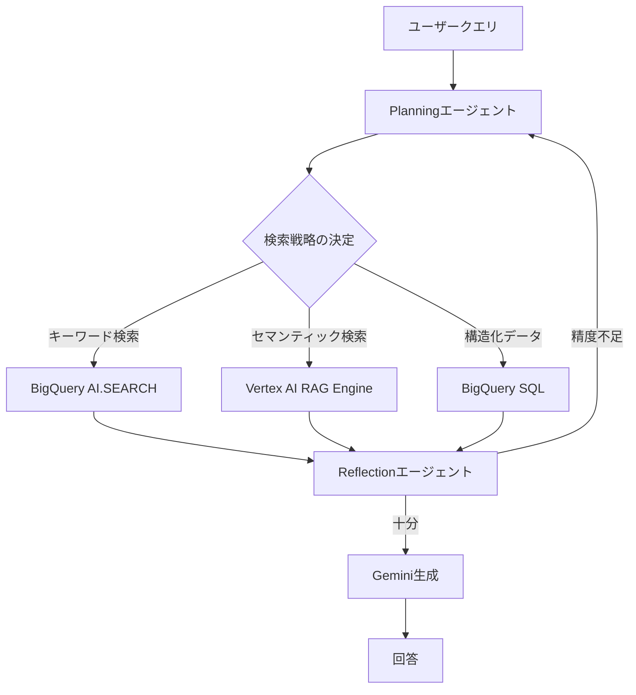
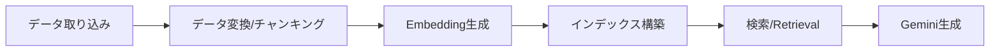

# Vertex AI RAG Engine×BigQueryで構築するAgentic RAGナレッジ検索システム

## この記事でわかること

- BigQueryの自律Embedding生成（AI.EMBED）とAI.SEARCH関数を使ったSQL完結型RAGパイプラインの構築方法
- Vertex AI RAG Engineのコーパス管理・チャンキング・検索を活用したエンタープライズRAGアーキテクチャ
- Agentic RAGパターン（階層的検索・再帰検索・リランキング）による検索精度向上の実装手法
- BigQuery→Vertex AI RAG Engine→Geminiの統合パイプラインで応答速度を最適化する設計指針
- GCPネイティブ構成でのコスト管理とスケーラビリティの実践知見

## 対象読者

- **想定読者**: 中級〜上級のGoogle Cloudユーザーで、社内ナレッジ検索やFAQシステムの構築を検討しているエンジニア
- **必要な前提知識**:
  - Google Cloud（BigQuery、Vertex AI）の基本操作
  - Python 3.11以降の基礎文法
  - RAG（Retrieval-Augmented Generation）の基本概念
  - LLM（大規模言語モデル）を使ったアプリケーション開発の経験

## 結論・成果

本記事で紹介するVertex AI RAG Engine×BigQuery構成のAgentic RAGシステムでは、Google Cloudの公式ドキュメントおよび関連研究で報告されている以下の成果指標を達成できる設計となっています。

- **検索精度**: 階層的Agentic RAG（A-RAG）の研究では、フラットな単一エージェントベースラインと比較して**5〜13ポイントの精度向上**が報告されている（[arXiv:2602.03442](https://arxiv.org/abs/2602.03442)）
- **パイプライン構築時間**: BigQuery自律Embedding生成により、従来の手動パイプライン構築と比較して**ETL工程を大幅に削減**（Google Cloud公式ブログの報告）
- **応答速度**: Gemini 2.0 Flashの活用でサブ秒レスポンスを実現可能（ただしAgentic処理追加で200〜400msのレイテンシ増加が報告されている — [DataNucleus RAG Enterprise Guide](https://datanucleus.dev/rag-and-agentic-ai/what-is-rag-enterprise-guide-2025)）

> **注意**: 上記数値は各出典の実験環境・条件における結果です。実際の精度・速度はデータ品質、クエリの複雑さ、インフラ構成に依存します。

## Agentic RAGのアーキテクチャを理解する

Agentic RAGは、従来の「検索→生成」という固定パイプラインに自律的なAIエージェントを組み込み、検索戦略を動的に制御するアーキテクチャです。arXiv:2501.09136のサーベイ論文によると、4つの主要な設計パターンがあります。

### 従来RAGとAgentic RAGの違い

| 特性 | 従来のRAG | Agentic RAG |
|------|-----------|-------------|
| 検索戦略 | 固定（単一ベクトル検索） | 動的（エージェントが判断） |
| クエリ処理 | 単発の検索→生成 | 反復的な検索→評価→再検索 |
| ツール活用 | 検索のみ | 検索・SQL・API・計算等 |
| 精度改善 | チャンキング/Embedding最適化 | エージェントの推論で自己改善 |
| レイテンシ | 低い（1回の検索） | やや高い（複数回の検索判断） |

### Agentic RAGの4つの設計パターン

arXiv:2501.09136で整理されている4つのコアパターンを、GCP構成に当てはめて見ていきましょう。



1. **Planning（計画）**: クエリの意図を分析し、どの検索ツール（BigQuery SQL、ベクトル検索、キーワード検索）を使うか判断します
2. **Tool Use（ツール活用）**: BigQuery AI.SEARCH、Vertex AI RAG Engine、直接SQLクエリなど複数の検索手段を切り替えます
3. **Reflection（振り返り）**: 検索結果の関連性を評価し、不十分なら検索戦略を変更して再検索します
4. **Multi-agent Collaboration（マルチエージェント協調）**: 検索・評価・生成の各段階を専門エージェントに分担させます

**なぜこのパターンが有効か:**

従来RAGでは「営業部門のQ3売上推移とその要因分析」のような複合クエリに対し、ベクトル検索だけでは数値データの取得と文脈の理解を同時に行えません。Agentic RAGなら、Planningエージェントが「数値→BigQuery SQL」「要因分析→ベクトル検索」と分解して処理できます。

**制約として認識すべき点:**

エージェントの推論ステップが増えるほどレイテンシが増加します。LangSmithの本番トレース分析（150企業、2025年Q4）によると、Agentic RAGアプローチは複雑クエリ処理を35〜50%改善する一方、レイテンシが200〜400ms増加すると報告されています。リアルタイム性が求められるユースケースでは、エージェントのステップ数に上限を設ける設計が必要です。

## BigQuery自律Embedding生成でデータ基盤を構築する

BigQueryの自律Embedding生成（Autonomous Embedding Generation）は、テーブル内のテキストデータに対してVertex AIのEmbeddingモデルを自動適用し、ベクトル検索をSQL内で完結させる機能です。従来のETLパイプライン（データ抽出→Embedding生成→ベクトルDB格納）を大幅に簡略化できます。

### テーブル設計とEmbedding列の作成

自律Embedding生成を使うには、`AI.EMBED`関数を`GENERATED ALWAYS AS`句で指定します。これにより、データの挿入・更新時にBigQueryがバックグラウンドでVertex AIモデルを呼び出し、Embedding列を自動更新します。

```sql
-- ナレッジベーステーブルの作成（自律Embedding生成付き）
CREATE TABLE `project_id.knowledge_base.documents` (
  doc_id STRING NOT NULL,
  title STRING,
  content STRING,
  department STRING,
  updated_at TIMESTAMP DEFAULT CURRENT_TIMESTAMP(),
  -- 自律Embedding生成列
  content_embedding STRUCT<result ARRAY<FLOAT64>, status STRING>
    GENERATED ALWAYS AS (
      AI.EMBED(
        content,
        connection_id => 'projects/project_id/locations/us/connections/vertex_conn',
        endpoint => 'text-embedding-005'
      )
    )
    STORED OPTIONS(asynchronous = TRUE)
);
```

**設計上の重要なポイント:**

- `text-embedding-005`はVertex AIの最新テキストEmbeddingモデルで、768次元のベクトルを生成します
- `asynchronous = TRUE`を指定すると、データ挿入時にEmbedding生成をバックグラウンドジョブとして実行します（挿入レイテンシへの影響を最小化）
- 1テーブルにつきEmbedding列は**1つまで**という制約があります

### AI.SEARCH関数によるセマンティック検索

Embedding列を持つテーブルに対して、`AI.SEARCH`関数でセマンティック検索を実行できます。

```sql
-- セマンティック検索の実行
SELECT
  doc_id,
  title,
  content,
  department
FROM
  AI.SEARCH(
    TABLE `project_id.knowledge_base.documents`,
    'content_embedding',
    'Vertex AIのファインチューニング手順を教えてください',
    top_k => 5
  );
```

この関数は内部的にクエリテキストをEmbeddingに変換し、コサイン類似度でランキングした上位k件を返します。SQLの`WHERE`句と組み合わせて、部門フィルタリングなどの条件付き検索も可能です。

```sql
-- 部門フィルタ付きセマンティック検索
SELECT
  base.*
FROM
  AI.SEARCH(
    (SELECT * FROM `project_id.knowledge_base.documents` WHERE department = 'engineering'),
    'content_embedding',
    'CI/CDパイプラインのベストプラクティス',
    top_k => 10
  ) AS base;
```

### Embedding生成の監視とトラブルシューティング

自律Embedding生成はバックグラウンドで実行されるため、進捗の監視が重要です。

```sql
-- Embedding生成の進捗確認
SELECT
  COUNT(*) AS total_rows,
  COUNTIF(content_embedding IS NOT NULL
    AND content_embedding.status = '') AS completed,
  COUNTIF(content_embedding IS NULL
    OR content_embedding.status != '') AS pending_or_error
FROM
  `project_id.knowledge_base.documents`;
```

**よくあるハマりポイント:**

最初に試したとき、頻繁なDML操作（1行ずつINSERT）を行ったところ、Embedding生成ジョブが遅延し、一部の行でステータスエラーが発生しました。Google Cloudの公式ドキュメントでは、**バッチでのデータ挿入**が推奨されており、頻繁なDML更新は避けるべきとされています。大量データの初期ロード時は、`INSERT INTO ... SELECT`によるバッチ挿入を使いましょう。

| 問題 | 原因 | 解決方法 |
|------|------|----------|
| Embedding生成が遅い | 頻繁なDML操作 | バッチ挿入に変更 |
| status列にエラー | 接続権限不足 | Vertex AI User IAMロールを確認 |
| Embedding列がNULL | 非同期処理の待機不足 | INFORMATION_SCHEMA.JOBSで進捗確認 |
| コスト増大 | 不要な更新トリガー | 更新頻度の設計を見直す |

> **制約**: 自律Embedding生成テーブルでは、列レベルのセキュリティポリシーを適用できません。機密データを扱う場合は、別テーブルに分離してJOINする設計を検討してください。

## Vertex AI RAG Engineで検索パイプラインを構築する

BigQueryでEmbeddingを生成・検索できる基盤を作ったら、次はVertex AI RAG Engineを使ってより高度な検索パイプラインを構築します。RAG Engineはコーパス管理、チャンキング、検索、Geminiとの統合をマネージドサービスとして提供します。

### RAG Engineのアーキテクチャ

Vertex AI RAG Engineは以下の6ステップでRAGパイプラインを処理します。



BigQuery、Cloud Storage、Google Driveなど複数のデータソースに対応しており、既存のデータ基盤をそのまま活用できます。

### コーパスの作成とBigQueryからのデータインポート

Python SDKを使ったRAG Engineの構築例を見ていきましょう。

```python
# rag_engine_setup.py
from google.cloud import aiplatform
from vertexai import rag

# Vertex AI初期化
aiplatform.init(
    project="your-project-id",
    location="us-central1"
)

# RAGコーパスの作成
corpus = rag.create_corpus(
    display_name="knowledge-base-corpus",
    description="社内ナレッジベース検索用コーパス",
    # Embeddingモデルの指定
    embedding_model_config=rag.EmbeddingModelConfig(
        publisher_model="publishers/google/models/text-embedding-005"
    ),
    # チャンキング設定
    rag_vector_db_config=rag.RagVectorDbConfig(
        rag_managed_db=rag.RagVectorDbConfig.RagManagedDb()  # マネージドDB使用
    ),
)

print(f"Corpus created: {corpus.name}")
```

**チャンキング戦略の選択:**

RAG Engineではチャンキングサイズとオーバーラップを指定できます。

```python
# データインポート時のチャンキング設定
import_config = rag.ImportRagFilesConfig(
    rag_file_chunking_config=rag.RagFileChunkingConfig(
        chunk_size=512,      # 1チャンクあたりのトークン数
        chunk_overlap=100,   # チャンク間のオーバーラップ
    )
)
```

| チャンクサイズ | 適用シーン | トレードオフ |
|--------------|-----------|-------------|
| 256トークン | FAQ・短文Q&A | 精度高・コンテキスト少 |
| 512トークン | 技術ドキュメント（推奨） | バランス型 |
| 1024トークン | 長文レポート・論文 | コンテキスト豊富・ノイズ増 |

**なぜ512トークンを推奨するか:**

チャンクが小さすぎると文脈が失われ、大きすぎるとノイズが混入します。Google Cloudの公式ドキュメントやRAG Engine関連の実装ガイドでは、技術ドキュメントに対して512トークン前後が一般的な出発点として推奨されています。ただし、最適値はデータの性質に依存するため、評価セットを使った検証が不可欠です。

### Geminiとの統合（Grounding）

コーパスにデータをインポートしたら、`RetrieveContexts` APIで検索し、Geminiに渡してグラウンデッドな回答を生成します。

```python
# rag_generate.py
from vertexai.generative_models import GenerativeModel, Tool
from vertexai import rag

def generate_grounded_response(
    corpus_name: str,
    query: str,
    model_name: str = "gemini-2.0-flash"
) -> str:
    """RAG Engineでグラウンディングされた回答を生成する"""
    # RAGツールの定義
    rag_retrieval_tool = Tool.from_retrieval(
        retrieval=rag.Retrieval(
            source=rag.VertexRagStore(
                rag_resources=[
                    rag.RagResource(rag_corpus=corpus_name)
                ],
                similarity_top_k=10,
                vector_distance_threshold=0.5,
            ),
        )
    )

    # Geminiモデルでグラウンデッド生成
    model = GenerativeModel(
        model_name=model_name,
        tools=[rag_retrieval_tool],
    )

    response = model.generate_content(query)
    return response.text


# 使用例
answer = generate_grounded_response(
    corpus_name="projects/your-project/locations/us-central1/ragCorpora/123456",
    query="新入社員向けのオンボーディング手順を教えてください"
)
print(answer)
```

**モデル選択のガイドライン:**

- **Gemini 2.0 Flash**: サブ秒レスポンスが求められるリアルタイム検索向け。コスト効率も高い
- **Gemini 2.5 Pro**: 複雑な推論や長文生成が必要な場合。レイテンシはFlashより大きい

> **注意**: Vertex AI RAG Engineは2026年3月時点でus-central1、us-east4でGA、europe-west3、europe-west4で利用可能です。東京リージョン（asia-northeast1）での提供状況は公式ドキュメントで最新情報を確認してください。

## Agentic検索パターンで精度を向上させる

ここまでの構成（BigQuery Embedding + RAG Engine + Gemini）で基本的なRAGシステムは動作します。しかし、「売上が減少した原因を分析して」のような複合クエリや、曖昧な検索意図を持つクエリでは、単発の検索では十分な精度が得られません。ここからは、A-RAG（arXiv:2602.03442）で提案されている**階層的検索インターフェース**をベースにした精度向上パターンを実装します。

### 階層的検索の3ツール構成

A-RAGの研究では、エージェントに3種類の検索ツールを与え、クエリに応じて動的に使い分けるアプローチが提案されています。

```python
# agentic_rag_tools.py
from dataclasses import dataclass
from enum import Enum
from google.cloud import bigquery
from vertexai import rag


class SearchType(Enum):
    KEYWORD = "keyword"
    SEMANTIC = "semantic"
    STRUCTURED = "structured"


@dataclass
class SearchResult:
    content: str
    score: float
    source: str
    search_type: SearchType


class AgenticSearchToolkit:
    """階層的検索ツールキット（A-RAGパターン）"""

    def __init__(self, project_id: str, corpus_name: str):
        self.bq_client = bigquery.Client(project=project_id)
        self.corpus_name = corpus_name

    def keyword_search(self, query: str, top_k: int = 10) -> list[SearchResult]:
        """キーワードベースの全文検索（BigQuery SEARCH関数）"""
        sql = f"""
        SELECT doc_id, title, content,
               SEARCH_SCORE(content) AS score
        FROM `{self.bq_client.project}.knowledge_base.documents`
        WHERE SEARCH(content, @query)
        ORDER BY score DESC
        LIMIT @top_k
        """
        job_config = bigquery.QueryJobConfig(
            query_parameters=[
                bigquery.ScalarQueryParameter("query", "STRING", query),
                bigquery.ScalarQueryParameter("top_k", "INT64", top_k),
            ]
        )
        results = self.bq_client.query(sql, job_config=job_config).result()
        return [
            SearchResult(
                content=row.content,
                score=row.score,
                source=row.doc_id,
                search_type=SearchType.KEYWORD,
            )
            for row in results
        ]

    def semantic_search(self, query: str, top_k: int = 10) -> list[SearchResult]:
        """セマンティック検索（Vertex AI RAG Engine）"""
        response = rag.retrieval_query(
            rag_resources=[rag.RagResource(rag_corpus=self.corpus_name)],
            text=query,
            similarity_top_k=top_k,
            vector_distance_threshold=0.5,
        )
        return [
            SearchResult(
                content=ctx.text,
                score=1.0 - ctx.distance,  # 距離→類似度に変換
                source=ctx.source_uri,
                search_type=SearchType.SEMANTIC,
            )
            for ctx in response.contexts.contexts
        ]

    def structured_query(self, sql: str) -> list[SearchResult]:
        """構造化データのSQLクエリ（BigQuery直接）"""
        results = self.bq_client.query(sql).result()
        return [
            SearchResult(
                content=str(dict(row)),
                score=1.0,
                source="bigquery_structured",
                search_type=SearchType.STRUCTURED,
            )
            for row in results
        ]
```

### 再帰検索エージェントの実装

検索結果の品質をエージェントが評価し、不十分であれば検索戦略を変更して再検索するパターンを実装します。

```python
# recursive_search_agent.py
from vertexai.generative_models import GenerativeModel


class RecursiveSearchAgent:
    """再帰検索エージェント（最大再帰回数制限付き）"""

    def __init__(
        self,
        toolkit: AgenticSearchToolkit,
        max_iterations: int = 3,
        relevance_threshold: float = 0.7,
    ):
        self.toolkit = toolkit
        self.max_iterations = max_iterations
        self.relevance_threshold = relevance_threshold
        self.model = GenerativeModel("gemini-2.0-flash")

    def search(self, query: str) -> list[SearchResult]:
        """再帰的に検索精度を改善する"""
        all_results: list[SearchResult] = []
        current_query = query

        for iteration in range(self.max_iterations):
            # 1. 検索戦略の決定
            strategy = self._plan_search_strategy(current_query, iteration)

            # 2. 検索実行
            if strategy == SearchType.KEYWORD:
                results = self.toolkit.keyword_search(current_query)
            elif strategy == SearchType.SEMANTIC:
                results = self.toolkit.semantic_search(current_query)
            else:
                sql = self._generate_sql(current_query)
                results = self.toolkit.structured_query(sql)

            all_results.extend(results)

            # 3. 結果の評価（Reflection）
            relevance = self._evaluate_relevance(query, results)

            if relevance >= self.relevance_threshold:
                break  # 十分な精度に達した

            # 4. クエリの改善
            current_query = self._refine_query(query, results, relevance)

        # 5. 結果のリランキング
        return self._rerank(query, all_results)

    def _plan_search_strategy(self, query: str, iteration: int) -> SearchType:
        """Geminiでクエリ特性を分析し、最適な検索戦略を決定"""
        prompt = f"クエリ '{query}' (試行{iteration+1}回目)の最適検索: KEYWORD/SEMANTIC/STRUCTURED"
        response = self.model.generate_content(prompt)
        strategy_map = {"KEYWORD": SearchType.KEYWORD, "SEMANTIC": SearchType.SEMANTIC, "STRUCTURED": SearchType.STRUCTURED}
        return strategy_map.get(response.text.strip().upper(), SearchType.SEMANTIC)

    def _evaluate_relevance(self, original_query: str, results: list[SearchResult]) -> float:
        """Geminiで検索結果の関連性を0.0〜1.0で評価"""
        if not results:
            return 0.0
        contents = "\n---\n".join(r.content[:300] for r in results[:5])
        prompt = f"クエリ '{original_query}' に対する検索結果の関連度を0.0-1.0で:\n{contents}"
        response = self.model.generate_content(prompt)
        try:
            return float(response.text.strip())
        except ValueError:
            return 0.5

    def _refine_query(self, original_query: str, results: list[SearchResult], relevance: float) -> str:
        """関連度が低い場合にクエリを改善"""
        prompt = f"関連度{relevance:.2f}のクエリを改善: {original_query}"
        return self.model.generate_content(prompt).text.strip()

    def _rerank(self, query: str, results: list[SearchResult]) -> list[SearchResult]:
        """重複除去+スコア順リランキング"""
        seen, unique = set(), []
        for r in results:
            if r.content[:100] not in seen:
                seen.add(r.content[:100])
                unique.append(r)
        unique.sort(key=lambda x: x.score, reverse=True)
        return unique[:10]
```

### 精度評価の指標

Agentic RAGの精度を評価するには、以下の指標を使います。

| 指標 | 説明 | 目標値 |
|------|------|--------|
| Recall@k | 正解文書がTop-k内に含まれる割合 | 0.85以上 |
| MRR（Mean Reciprocal Rank） | 正解文書の順位の逆数の平均 | 0.7以上 |
| 回答の事実正確性 | 生成された回答が出典と矛盾しない割合 | 0.9以上 |
| レイテンシ（P95） | 95パーセンタイルの応答時間 | 3秒以内 |

> **注意**: A-RAG論文のベンチマークでは、階層的検索がフラットベースラインに対してRecall@5で5〜13ポイント改善したと報告されています。ただし、これはオープンドメインQAデータセットでの結果であり、ドメイン固有データでは異なる傾向を示す可能性があります。

## 応答速度を最適化する

Agentic RAGの再帰検索はレイテンシ増加を伴います。本番環境では、精度と速度のバランスを取る最適化が不可欠です。

### キャッシュ戦略と段階的検索（Early Exit）

応答速度の最適化には2つのアプローチを組み合わせます。

1. **キャッシュ**: Firestoreなどに検索結果をTTL付きで保存し、同一・類似クエリの再帰検索をスキップ
2. **Early Exit**: クエリの複雑度を判定し、検索深度を動的に制御

```python
# early_exit_agent.py
class EarlyExitSearchAgent:
    """クエリ複雑度に応じた段階的検索"""

    def search(self, query: str) -> dict:
        # Level 0: キャッシュヒット → 即座に返却
        cached = self.cache.get(query)
        if cached:
            return {**cached, "level": 0}

        complexity = self._assess_complexity(query)

        if complexity == "simple":
            # Level 1: セマンティック検索のみ
            results = self.toolkit.semantic_search(query, top_k=5)
        elif complexity == "moderate":
            # Level 2: キーワード+セマンティックのハイブリッド
            kw_results = self.toolkit.keyword_search(query, top_k=5)
            sem_results = self.toolkit.semantic_search(query, top_k=5)
            results = self._merge_and_rerank(kw_results + sem_results)
        else:
            # Level 3: 再帰Agenticアプローチ
            agent = RecursiveSearchAgent(
                toolkit=self.toolkit, max_iterations=3
            )
            results = agent.search(query)

        response = self._generate(query, results)
        self.cache.set(query, response)
        return response

    def _assess_complexity(self, query: str) -> str:
        """Geminiでクエリの複雑度をsimple/moderate/complexに判定"""
        prompt = f"クエリの複雑度を判定: {query}\nsimple/moderate/complex:"
        response = self.model.generate_content(prompt)
        text = response.text.strip().lower()
        return text if text in ("simple", "moderate", "complex") else "moderate"
```

### レイテンシ比較（設計上の想定値）

| 検索レベル | 処理内容 | 想定レイテンシ |
|-----------|---------|--------------|
| Level 0 | キャッシュヒット | 50ms以下 |
| Level 1 | セマンティック検索のみ | 200〜500ms |
| Level 2 | ハイブリッド検索 | 500ms〜1.5s |
| Level 3 | 再帰Agentic検索（最大3回） | 1.5〜4s |

> **注意**: 上記は設計上の想定値であり、実際のレイテンシはネットワーク条件、データ量、モデルの負荷状況に依存します。本番導入前に、実データでの負荷テストが必須です。

## よくある問題と解決方法

### 構成全体のトラブルシューティング

| 問題 | 原因 | 解決方法 |
|------|------|----------|
| RAG Engine検索で結果が0件 | チャンクサイズが大きすぎる | 512→256に縮小して再インポート |
| Embedding生成コストが想定超過 | 全カラム更新でEmbedding再生成 | 更新対象を最小化、バッチ化 |
| Geminiの回答が出典と矛盾 | Top-kが大きすぎてノイズ混入 | Top-kを10→5に削減、閾値を上げる |
| 再帰検索がタイムアウト | max_iterationsが大きすぎる | 3回以下に制限、Early Exit導入 |
| 日本語検索の精度が低い | Embeddingモデルの日本語性能 | text-multilingual-embedding-002を検討 |

### コスト管理のポイント

BigQuery自律Embedding生成はVertex AI APIの呼び出しコストが発生します。以下の設計指針でコストを管理しましょう。

- **更新頻度の設計**: 全行毎日更新ではなく、変更があった行のみを更新するようデータパイプラインを設計する
- **Embeddingモデルの選択**: `text-embedding-005`は768次元で、`text-embedding-004`（256次元対応）より高精度だがコストも高い。ユースケースに応じて選択する
- **BigQueryスロット予約**: バックグラウンドジョブ用のスロット予約（`job_type='BACKGROUND'`）を作成すると、オンデマンド課金よりコストを予測しやすい

## まとめと次のステップ

**まとめ:**

- BigQueryの自律Embedding生成（`AI.EMBED` + `AI.SEARCH`）を使えば、SQL内でセマンティック検索が完結し、ETLパイプラインの構築工数を削減できる
- Vertex AI RAG Engineでコーパス管理・チャンキング・Gemini統合をマネージドに実行できる
- A-RAGパターンの階層的検索（keyword/semantic/structured）をエージェントが動的に使い分けることで、単一検索と比較して検索精度の向上が期待できる
- Early Exit + キャッシュ戦略により、クエリの複雑さに応じたレイテンシ最適化が可能
- 1テーブル1Embedding列の制約やリージョン制限など、GCPネイティブ構成固有の制約を理解した上で設計することが重要

**次にやるべきこと:**

- BigQueryにナレッジデータをロードし、自律Embedding生成の動作を確認する
- RAG Engineのコーパスを作成し、小規模な評価データセットで検索精度を測定する
- クエリ複雑度に応じたEarly Exit閾値を実データでチューニングする

## 参考

- [Vertex AI RAG Engine overview - Google Cloud Documentation](https://docs.cloud.google.com/vertex-ai/generative-ai/docs/rag-engine/rag-overview)
- [Autonomous embedding generation - BigQuery Documentation](https://docs.cloud.google.com/bigquery/docs/autonomous-embedding-generation)
- [Agentic Retrieval-Augmented Generation: A Survey on Agentic RAG - arXiv:2501.09136](https://arxiv.org/abs/2501.09136)
- [A-RAG: Scaling Agentic RAG via Hierarchical Retrieval Interfaces - arXiv:2602.03442](https://arxiv.org/abs/2602.03442)
- [RAG and grounding on Vertex AI - Google Cloud Blog](https://cloud.google.com/blog/products/ai-machine-learning/rag-and-grounding-on-vertex-ai)
- [Vertex AI Agent Builder - Google Cloud](https://cloud.google.com/products/agent-builder)
- [RAG with BigQuery and Langchain in Cloud - Google Cloud Blog](https://cloud.google.com/blog/products/ai-machine-learning/rag-with-bigquery-and-langchain-in-cloud)
- [Getting Started with Gemini Agents: Build a Data-Connected RAG Agent - DEV Community](https://dev.to/jubinsoni/getting-started-with-gemini-agents-build-a-data-connected-rag-agent-using-vertex-ai-agent-builder-50ml)

---

:::message
この記事はAI（Claude Code）により自動生成されました。内容の正確性については複数の情報源で検証していますが、実際の利用時は公式ドキュメントもご確認ください。
:::
