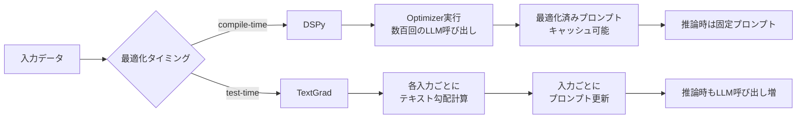

# DSPy×TextGrad比較で学ぶプロンプト自動最適化パイプラインの実践構築

## この記事でわかること

- DSPyとTextGradの設計思想の違いと、タスク特性に応じた使い分け方法
- DSPy v3.1系の主要Optimizer（MIPROv2・SIMBA・GEPA）を使ったプロンプト最適化パイプラインの構築手順
- 本番運用を見据えたFastAPI + MLflowデプロイメントとキャッシュ・バージョニング設計
- 最適化が期待どおりに動かない時のデバッグ手法（inspect_history、MLflowトレーシング、BaseCallback）
- NTTドコモの検証事例に基づくDSPy vs TextGradの精度・安定性の実測値

## 対象読者

- **想定読者**: LLMアプリケーション開発の中級〜上級者で、手動プロンプト調整に限界を感じている方
- **必要な前提知識**:
  - Python 3.10+のプログラミング経験
  - OpenAI APIまたはAnthropic APIの使用経験
  - プロンプトエンジニアリングの基礎（few-shot、Chain of Thought等）
  - LLMパイプラインの基本概念（RAG、分類、要約等のタスク経験）

:::message
本記事は既存記事「[DSPy活用パターン完全ガイド](https://zenn.dev/0h_n0/articles/5f15ad64bd3f6f)」の発展版です。DSPyの基本概念をご存じの方向けに、TextGradとの比較・本番運用・デバッグに焦点を当てています。
:::

## 結論・成果

NTTドコモの検証ではカスタマーサポート分類タスクにおいて、DSPy（MIPROv2）は**ベースライン78.3%→85.0%（+6.7ポイント）**の安定した改善を達成しました。一方TextGradは最高**93.33%（+15ポイント）**に到達したものの、過学習により最終ステップで**68.33%に低下**する不安定さが報告されています。

本記事で紹介するパイプライン構成を適用することで、以下の効果が期待できます。

- **最適化の安定性**: DSPyのcompile-time最適化で再現性のある改善
- **デプロイ時間**: FastAPI + `dspy.asyncify()`で非同期APIを**30分以内**に構築
- **運用コスト**: MLflowバージョニングでOptimizer結果をキャッシュし、LLM呼び出し回数を削減

## DSPyとTextGradの設計思想を比較する

### 根本的なアプローチの違い

DSPyとTextGradは、いずれも「プロンプトの手動調整を自動化する」という目的を共有していますが、最適化のタイミングと粒度が根本的に異なります。



**DSPy**は「パイプラインのコンパイラ」として動作します。訓練データとメトリクスを与えると、Optimizerが事前に最適なプロンプト（命令文 + few-shot例）を探索し、結果を固定します。推論時にはその固定プロンプトを使うため、**追加のLLM呼び出しコストが発生しません**。

**TextGrad**は「テキストの自動微分」として動作します。個々の入力に対してLLMからのフィードバック（テキスト勾配）を生成し、プロンプトや中間出力を反復的に改善します。単一の難しい問題を深掘りするのに向いていますが、**推論時もLLMによるフィードバックループが走る**ため、レイテンシとコストが増加します。

### NTTドコモの検証結果から見る実力差

NTTドコモ開発者ブログでは、カスタマーサポートの問い合わせ分類タスク（4カテゴリ分類）で両フレームワークを比較検証しています。

| 指標 | ベースライン | DSPy (MIPROv2) | TextGrad (最高) | TextGrad (最終) |
|------|-------------|---------------|----------------|----------------|
| 正解率 | 78.3% | 85.0% | 93.33% | 68.33% |
| 改善幅 | — | +6.7pt | +15.0pt | -10.0pt |
| 安定性 | — | 高（単調改善） | 低（過学習あり） | — |

DSPy（MIPROv2）は、責任感を喚起するペルソナ指示（「大手カスタマーサポートセンターのAIオペレーターとして...分類ミスは信頼失墜につながる」）と、文脈判断が必要なfew-shot事例を**自動生成**しました。

TextGradは「主旨抽出手順」という判断フローや除外条件の明文化など、より精緻なプロンプトを**段階的に書き換え**ました。しかし、Step 8で93.33%を記録した後、過剰なルール追加によりStep 12で68.33%まで低下しています。

**使い分けの指針:**

| 特性 | DSPy | TextGrad |
|------|------|----------|
| **適したユースケース** | 本番システムの安定的最適化 | プロトタイプや要件定義のプロンプト探索 |
| **最適化タイミング** | compile-time（事前） | test-time（推論時） |
| **安定性** | 高い（Bayesian Opt + few-shot） | 低い（過学習リスクあり） |
| **推論コスト** | 固定（最適化後は追加コストなし） | 増加（各入力でフィードバック生成） |
| **成果物の再利用** | 最適化済みプロンプトをキャッシュ・共有可能 | 入力依存のため再利用困難 |

> **注意**: TextGradの過学習は「早期停止（Early Stopping）」で緩和可能です。NTTドコモの検証でも、Step 8時点で停止すれば93.33%の精度を維持できた可能性があります。ただし、最適な停止タイミングの判断にはバリデーションセットが必要です。

## プロンプト最適化パイプラインをステップバイステップで構築する

### Step 1: DSPyのセットアップとSignature定義

まずDSPy v3.1系をインストールし、基本的なSignatureを定義します。

```bash
# DSPy v3.1.3のインストール（2025年2月時点の最新安定版）
pip install -U dspy
```

```python
# pipeline.py
import dspy

# LMの設定（OpenAI、Anthropic、Ollama等から選択）
lm = dspy.LM("openai/gpt-4o-mini", api_key="your-api-key")
dspy.configure(lm=lm)

# タスクのSignature定義（カスタマーサポート分類の例）
class SupportClassifier(dspy.Signature):
    """顧客からの問い合わせを適切なカテゴリに分類する"""
    inquiry = dspy.InputField(desc="顧客の問い合わせ内容")
    category = dspy.OutputField(
        desc="分類カテゴリ: billing/technical/general/complaint"
    )

# Chain of Thoughtで推論過程も出力
classifier = dspy.ChainOfThought(SupportClassifier)
```

**なぜChainOfThoughtを使うのか:**

- `dspy.Predict`はシンプルだが、分類の判断根拠が不透明
- `ChainOfThought`は推論過程（`reasoning`フィールド）を自動生成し、**分類ミスの原因分析**が容易になる
- Optimizerが推論過程を含めて最適化するため、より精緻なプロンプトが生成される

### Step 2: 評価メトリクスとデータセットの準備

Optimizerの性能は**評価関数の品質**に強く依存します。単純な一致判定ではなく、部分一致やカテゴリの階層構造を考慮した評価関数を設計しましょう。

```python
# metrics.py
import dspy

def classify_metric(example, pred, trace=None):
    """分類精度の評価関数

    Args:
        example: 正解ラベルを持つデータ
        pred: モデルの予測結果
        trace: 最適化時のトレース情報（デバッグ用）
    """
    # 完全一致
    if example.category.strip().lower() == pred.category.strip().lower():
        return 1.0

    # 部分一致（例: "billing_refund" と "billing" の前方一致）
    if pred.category.strip().lower().startswith(
        example.category.strip().lower().split("_")[0]
    ):
        return 0.5

    return 0.0

# データセットの準備（dspy.Example形式）
trainset = [
    dspy.Example(
        inquiry="先月の請求額が通常より高いのですが、明細を確認できますか？",
        category="billing"
    ).with_inputs("inquiry"),
    dspy.Example(
        inquiry="アプリが起動時にクラッシュします。OS更新後から発生しています。",
        category="technical"
    ).with_inputs("inquiry"),
    dspy.Example(
        inquiry="返金手続きの完了予定日を教えてください。",
        category="billing"
    ).with_inputs("inquiry"),
    dspy.Example(
        inquiry="対応が遅く、3回も同じ説明をさせられた。責任者に繋いでほしい。",
        category="complaint"
    ).with_inputs("inquiry"),
    # ... 50-100例を推奨
]

# 検証セット（Optimizerの過学習防止）
valset = trainset[40:]  # 実際には独立したデータセットを用意
trainset = trainset[:40]
```

**ハマりポイント: `.with_inputs()`の指定漏れ**

`dspy.Example`を作成する際に`.with_inputs("inquiry")`を呼ばないと、Optimizerがどのフィールドが入力でどれが正解ラベルかを判別できません。このエラーは実行時にわかりにくいメッセージで表示されるため、最初のつまずきポイントになりがちです。

### Step 3: Optimizerの選択と実行

タスク特性に応じて適切なOptimizerを選択します。ここでは3つのOptimizerを段階的に試す方法を示します。

#### 3-1. BootstrapFewShot（まず試すべき軽量Optimizer）

```python
# optimize_bootstrap.py
from dspy.teleprompt import BootstrapFewShot

optimizer = BootstrapFewShot(
    metric=classify_metric,
    max_bootstrapped_demos=4,
    max_labeled_demos=4,
)

# compile: trainsetから最適なfew-shot例を自動選択
compiled_classifier = optimizer.compile(
    classifier,
    trainset=trainset,
)

# 最適化結果の確認
print(compiled_classifier("返品したいのですが手順を教えてください").category)
```

**計算コスト**: trainsetサイズ × 数回のLLM呼び出し（数分で完了）

#### 3-2. MIPROv2（命令文 + few-shotの同時最適化）

BootstrapFewShotで改善が頭打ちになった場合、MIPROv2に切り替えます。

```python
# optimize_mipro.py
from dspy.teleprompt import MIPROv2

optimizer = MIPROv2(
    metric=classify_metric,
    num_candidates=7,
    init_temperature=0.7,
    num_threads=4,
)

compiled_classifier = optimizer.compile(
    classifier,
    trainset=trainset,
    num_trials=30,
    max_bootstrapped_demos=3,
    max_labeled_demos=3,
    requires_permission_to_run=False,
)
```

**計算コスト**: `num_trials × num_candidates`回のLLM呼び出し（上記設定で約210回、10-30分）

**注意点:**
> MIPROv2のBayesian Optimizationは`num_trials`に比例してコストが増加します。まずは`num_trials=15`程度で傾向を確認し、改善が見られたら`30-100`に増やす段階的アプローチを推奨します。

#### 3-3. GEPA（反省的プロンプト進化）

GEPAはLLMにプログラムの実行トレースを分析させ、「何がうまくいき、何が失敗したか」を反省させることでプロンプトを改善します。DSPy v3.1系で追加された比較的新しいOptimizerです。

```python
# optimize_gepa.py
from dspy.teleprompt import GEPA

optimizer = GEPA(
    metric=classify_metric,
    auto="light",  # light/medium/heavy
    num_threads=4,
    track_stats=True,
)

compiled_classifier = optimizer.compile(
    classifier,
    trainset=trainset,
    valset=valset,
)
```

公式チュートリアルでは、AIME 2025の数学問題でGPT-4.1 Miniが**46.6%→56.6%（+10ポイント）**の改善を達成しています。

**GEPAの特徴的な点:**

- `auto`パラメータで最適化強度を制御（`"light"`で高速、`"heavy"`で高精度）
- テキストフィードバックを入力として受け取れるため、ドメイン知識を注入可能
- 失敗分析が人間にも理解可能な自然言語で出力される

**制約条件**: GEPAの反省機能は最適化用LMの能力に依存します。GPT-4o以上のモデルを`reflection_lm`に指定することが推奨されています。小型モデルでは反省の質が低下し、改善幅が限定的になることがあります。

### Step 4: 最適化結果の保存と読み込み

最適化は計算コストが高いため、結果を永続化して再利用します。

```python
# save_and_load.py
import dspy

# 最適化結果の保存
compiled_classifier.save("optimized_classifier.json")

# 別セッションでの読み込み
loaded_classifier = dspy.ChainOfThought(SupportClassifier)
loaded_classifier.load("optimized_classifier.json")

# 読み込んだモデルで推論
result = loaded_classifier(inquiry="パスワードのリセット方法を教えてください")
print(f"カテゴリ: {result.category}")
print(f"推論過程: {result.reasoning}")
```

## 本番環境向けの運用設計を実装する

### FastAPI + asyncifyによる非同期APIサーバー

DSPyプログラムをREST APIとして公開する際は、`dspy.asyncify()`で非同期化することでスループットを向上させます。

```python
# api_server.py
from fastapi import FastAPI
from pydantic import BaseModel
import dspy
import uvicorn

app = FastAPI(title="Prompt Optimizer API")

# 最適化済みモデルの読み込み
lm = dspy.LM("openai/gpt-4o-mini", api_key="your-api-key")
dspy.configure(lm=lm)

classifier = dspy.ChainOfThought(SupportClassifier)
classifier.load("optimized_classifier.json")

# 非同期化（スレッドプールで並列処理）
async_classifier = dspy.asyncify(classifier)

class InquiryRequest(BaseModel):
    inquiry: str

class ClassifyResponse(BaseModel):
    category: str
    reasoning: str

@app.post("/classify", response_model=ClassifyResponse)
async def classify(req: InquiryRequest):
    result = await async_classifier(inquiry=req.inquiry)
    return ClassifyResponse(
        category=result.category,
        reasoning=result.reasoning,
    )

if __name__ == "__main__":
    uvicorn.run(app, host="0.0.0.0", port=8000)
```

```bash
# サーバー起動
python api_server.py

# テストリクエスト
curl -X POST http://localhost:8000/classify \
  -H "Content-Type: application/json" \
  -d '{"inquiry": "先月の請求が二重になっています"}'
```

**`dspy.asyncify()`の仕組み:**

内部的にスレッドプールで同期関数を非同期化しています。デフォルトのワーカー数は8で、`async_max_workers`パラメータで調整可能です。ただし、**LLM API自体のレートリミットがボトルネック**になるため、ワーカー数を増やしすぎても効果は限定的です。

### MLflowによるバージョニングとトレーシング

最適化結果のバージョン管理と推論のトレーシングには、MLflowとの統合が有効です。

```python
# mlflow_deploy.py
import mlflow
import dspy

# MLflowトラッキングサーバーに接続
mlflow.set_tracking_uri("http://127.0.0.1:5000")
mlflow.set_experiment("support-classifier")

# 最適化済みモデルをMLflowに登録
class ClassifierModule(dspy.Module):
    """MLflow互換のラッパー（forward()メソッドが必要）"""
    def __init__(self):
        super().__init__()
        self.classifier = dspy.ChainOfThought(SupportClassifier)
        self.classifier.load("optimized_classifier.json")

    def forward(self, inquiry: str) -> str:
        result = self.classifier(inquiry=inquiry)
        return result.category

with mlflow.start_run(run_name="mipro_v2_optimized"):
    module = ClassifierModule()
    mlflow.dspy.log_model(
        module,
        "classifier",
        task="llm/v1/chat",
        input_example={"inquiry": "請求に関する質問です"},
    )
    mlflow.log_param("optimizer", "MIPROv2")
    mlflow.log_param("num_trials", 30)
    mlflow.log_metric("val_accuracy", 0.85)
```

**なぜMLflowを使うのか:**

- **バージョン管理**: Optimizerの設定・結果・メトリクスを一元管理
- **自動トレーシング**: `mlflow.set_tracking_uri()`を設定するだけで全LLM呼び出しが自動記録される
- **A/Bテスト**: 異なるOptimizer結果をモデルバージョンとして管理し、トラフィック分割が可能
- **Docker化**: `mlflow models build-docker`で即座にコンテナ化

### キャッシュ戦略

DSPyはデフォルトでLLM呼び出しをキャッシュしますが、本番環境では明示的な管理が必要です。

```python
# cache_config.py
import os
import dspy

# キャッシュディレクトリの指定
os.environ["DSPY_CACHEDIR"] = "/app/cache/dspy"

# 本番環境でのキャッシュ設定
lm = dspy.LM(
    "openai/gpt-4o-mini",
    cache=True,            # キャッシュ有効（デフォルト）
    temperature=0.0,       # 決定的な出力でキャッシュヒット率を最大化
)
dspy.configure(lm=lm)
```

**制約条件**: AWS Lambda等のサーバーレス環境では、エフェメラルなファイルシステムのためキャッシュが永続化されません。この場合は外部キャッシュ（Redis等）を検討するか、キャッシュを無効化する必要があります。

```python
# Lambda環境ではキャッシュを無効化
os.environ["DSP_CACHEBOOL"] = "false"
os.environ["DSPY_CACHEBOOL"] = "false"
```

## 最適化がうまくいかない時のデバッグ手法を実践する

最適化後に精度が改善しない、または低下するケースは珍しくありません。ここでは3つのデバッグ手法を紹介します。

### 手法1: inspect_history()でLLM呼び出しを可視化する

最もシンプルなデバッグ手法です。直近のLLM呼び出し内容を確認できます。

```python
# debug_history.py
import dspy

# 推論実行
result = compiled_classifier(inquiry="返金はいつ反映されますか？")

# 直近のLLM呼び出しを表示（n=最新何件か）
dspy.inspect_history(n=3)
```

出力例:
```
[2026-03-11T08:00:00] LM Call #1
System: You are a customer support classifier...
User: Given the inquiry: "返金はいつ反映されますか？"
Classify into: billing/technical/general/complaint
...
Response: billing
```

**限界**: `inspect_history()`はLLM呼び出ししか記録しません。Retriever（RAG）やTool呼び出しのデバッグには不十分です。

### 手法2: MLflowトレーシングで全ステップを可視化する

MLflowトレーシングは、LLM呼び出しだけでなくモジュール全体の実行フローを記録します。

```python
# debug_mlflow.py
import mlflow
import dspy

mlflow.set_tracking_uri("http://127.0.0.1:5000")
mlflow.set_experiment("debug-classifier")

# トレーシングは自動で有効化される
result = compiled_classifier(inquiry="アプリが動きません")

# MLflow UI (http://localhost:5000) でトレースを確認:
# - 各モジュールの入出力
# - LLM呼び出しのプロンプト/レスポンス全文
# - レイテンシ（各ステップの処理時間）
```

**MLflow UIで確認できる情報:**

- 各Moduleの入力・出力パラメータ
- Optimizerが生成したfew-shot例とInstruction全文
- 各ステップのレイテンシ（ボトルネック特定に有効）

### 手法3: BaseCallbackでカスタムログを実装する

特定のイベントだけを選択的にログ取得したい場合、DSPyの`BaseCallback`を拡張します。

```python
# debug_callback.py
import json
import logging
from dspy import BaseCallback

logger = logging.getLogger("dspy_debug")
logger.setLevel(logging.DEBUG)

class DebugCallback(BaseCallback):
    """最適化デバッグ用カスタムコールバック"""

    def on_module_end(self, call_id, outputs, exception):
        """モジュール実行完了時のログ"""
        if exception:
            logger.error(
                json.dumps({
                    "event": "module_error",
                    "call_id": call_id,
                    "error": str(exception),
                })
            )
        else:
            logger.info(
                json.dumps({
                    "event": "module_complete",
                    "call_id": call_id,
                    "output_keys": list(outputs.keys()) if outputs else [],
                })
            )

    def on_lm_end(self, call_id, outputs, exception):
        """LLM呼び出し完了時のログ"""
        if outputs:
            # トークン使用量の記録
            logger.info(
                json.dumps({
                    "event": "lm_complete",
                    "call_id": call_id,
                    "response_length": len(str(outputs)),
                })
            )

# コールバックの登録
import dspy
dspy.configure(
    lm=lm,
    callbacks=[DebugCallback()],
)
```

**注意点:**
> `BaseCallback`内で`outputs`を**直接変更（mutate）しない**でください。DSPyの内部状態が破壊され、予期しない動作を引き起こす可能性があります。ログ出力やメトリクス収集のみに使用することを推奨します。

### デバッグチェックリスト

最適化が期待どおりに動かない場合、以下の順番で確認します。

| 確認項目 | チェック方法 | よくある原因 |
|---------|------------|------------|
| 評価関数は正しいか | 手動で数例をmetric関数に通す | 正解と予測の前処理不一致（大文字小文字、空白） |
| trainsetの品質は十分か | ラベルの分布を確認 | 特定カテゴリに偏っている（不均衡データ） |
| trainsetのサイズは十分か | 50例以上あるか確認 | 10例以下では最適化の効果が限定的 |
| LMの能力は十分か | ベースラインの精度を確認 | タスクがLMの能力を超えている |
| 最適化の試行回数は十分か | `num_trials`を増やして再実行 | 探索空間が広すぎて収束していない |
| 過学習していないか | valsetでの精度を確認 | trainset精度は高いがvalset精度が低い |

## よくある問題と解決方法

| 問題 | 原因 | 解決方法 |
|------|------|----------|
| `AttributeError: 'Example' object has no attribute`... | `.with_inputs()`の呼び忘れ | `dspy.Example(...).with_inputs("field_name")`を確認 |
| Optimizer実行時にAPIレートリミット | 並列スレッド数が多すぎる | `num_threads`を2-4に下げる、`time.sleep()`を挟む |
| 最適化後に精度が下がった | 評価関数の設計ミス、trainsetの品質問題 | 評価関数のデバッグ、trainsetのラベル確認 |
| MLflow登録時に`TypeError` | `dspy.Module`を継承していない | カスタムModuleクラスで`forward()`を実装 |
| キャッシュが効かない | `temperature>0`の設定 | 推論時は`temperature=0.0`に固定 |

## まとめと次のステップ

**まとめ:**

- **DSPyとTextGradは補完関係**: DSPyは本番運用の安定的最適化、TextGradはプロトタイプの高速探索に適している
- **Optimizer選択は段階的に**: BootstrapFewShot → MIPROv2 → GEPA の順で試し、計算コストと精度のバランスを取る
- **本番運用にはMLflow統合が有効**: バージョニング、トレーシング、A/Bテストを一元管理できる
- **デバッグは評価関数から**: 最適化がうまくいかない場合、まず評価関数とtrainsetの品質を疑う
- **キャッシュ戦略は環境依存**: サーバーレスではキャッシュ無効化、永続サーバーでは`temperature=0.0`でヒット率を最大化

**次にやるべきこと:**

1. 自分のタスクで50例以上のtrainsetを準備し、BootstrapFewShotから最適化を開始する
2. [DSPy公式チュートリアル](https://dspy.ai/tutorials/)のRAG例を動かし、パイプライン構築に慣れる
3. MLflowを導入して最適化結果のバージョン管理を始める

## 参考

- [DSPy公式サイト](https://dspy.ai/)
- [DSPy GitHub (stanfordnlp/dspy)](https://github.com/stanfordnlp/dspy) — v3.1.3 (2025-02-05時点の最新安定版)
- [Optimizers - DSPy](https://dspy.ai/learn/optimization/optimizers/)
- [プロンプトエンジニアリングはどう変わる？ DSPy / TextGrad による自動最適化の実力検証 - NTTドコモ開発者ブログ](https://nttdocomo-developers.jp/entry/2025/12/22/090000_8)
- [DSPy 3.0登場：プロンプトエンジニアリングを「職人技」から「ソフトウェア工学」へ - APC 技術ブログ](https://techblog.ap-com.co.jp/entry/2025/06/25/134402)
- [DSPy Deployment Guide](https://dspy.ai/tutorials/deployment/)
- [DSPy Debugging & Observability](https://dspy.ai/tutorials/observability/)
- [TextGrad GitHub (zou-group/textgrad)](https://github.com/zou-group/textgrad)

---

:::message
この記事はAI（Claude Code）により自動生成されました。内容の正確性については複数の情報源で検証していますが、実際の利用時は公式ドキュメントもご確認ください。
:::
