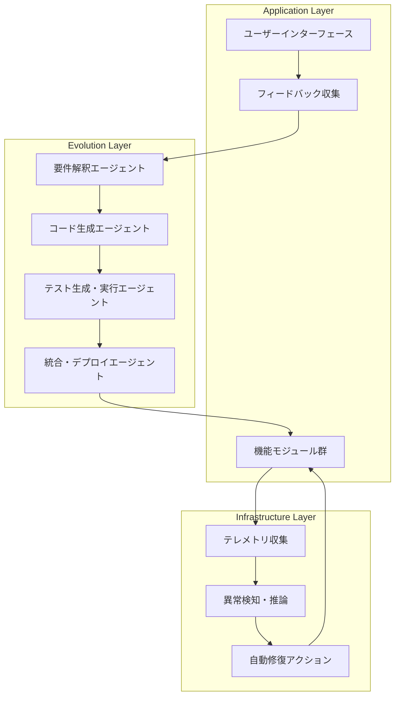
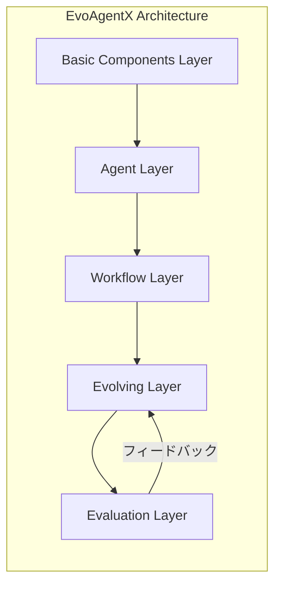
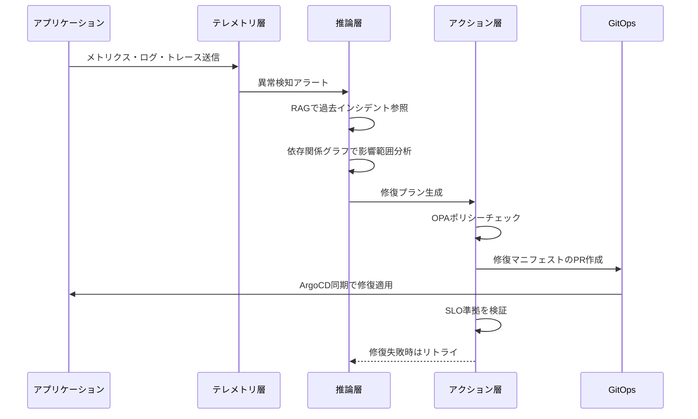
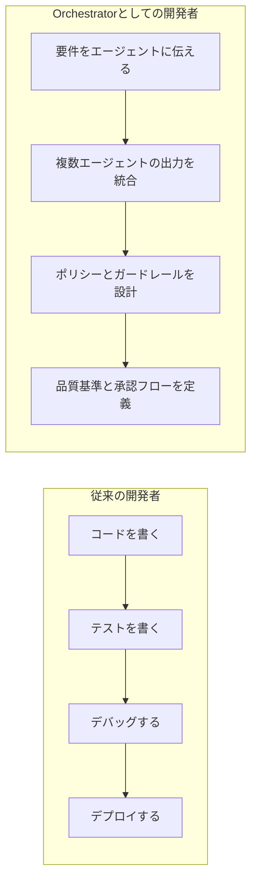

# Self-Evolving Applicationの設計パターンと自己修復インフラの実装戦略

## この記事でわかること

- Self-Evolving Application（自己進化アプリケーション）の定義と3層アーキテクチャ
- ユーザーフィードバックを起点にAIエージェントが自律的に機能追加するシステム設計
- Self-Healing Infrastructure（自己修復インフラ）のテレメトリ→推論→アクションパイプライン
- GitOps + LLMによるKubernetes自動修復オペレーターの実装パターン
- No-Developer世界観の現状と「Orchestrator」への役割変化

## 対象読者

- **想定読者**: 中級〜上級のソフトウェアエンジニア・SRE
- **必要な前提知識**:
  - Kubernetesの基本操作（Pod、Deployment、Operator）
  - LLM API（OpenAI / Claude）の利用経験
  - CI/CDパイプラインの構築経験
  - GitOpsの基本概念（ArgoCD / Flux）

## 結論・成果

Self-Evolving Applicationの研究と実装は2025〜2026年にかけて急速に進展しています。arXiv論文（2510.00591）ではマルチエージェントアーキテクチャによるプロトタイプが実証され、EvoAgentX（EMNLP'25発表）ではHotPotQA F1スコアが7.44%、MBPP pass@1が10.00%向上したと報告されています。インフラ層ではAI駆動の自動修復により、ネットワーク異常の91.2%をプロアクティブに対処し、運用コストを52.3%削減したという報告もあります。ただし、完全なNo-Developer（人間不要の開発）は現時点では実現しておらず、Human-in-the-Loopによるガバナンスが不可欠です。

## Self-Evolving Applicationとは何かを理解する

### 従来のソフトウェアとの違い

従来のソフトウェア開発では、ユーザーからのフィードバックを人間の開発者が解釈し、要件定義→設計→実装→テスト→デプロイのサイクルを回します。このサイクルは通常、数日から数週間を要します。

**Self-Evolving Application**は、このサイクルをAIエージェントが自律的に実行するソフトウェアです。arXiv論文「AI-Driven Self-Evolving Software」（Cai et al., 2025）では、以下のように定義されています。

> ユーザーとの直接的なインタラクションを通じて継続的に進化する新しいソフトウェアパラダイム

従来型とSelf-Evolving型の違いを整理します。

| 項目 | 従来型 | Self-Evolving型 |
|------|--------|-----------------|
| フィードバック解釈 | 人間（PM/開発者） | AIエージェント |
| 実装サイクル | 数日〜数週間 | 数分〜数時間 |
| テスト | 人間が設計・実行 | 自動生成・自動実行 |
| デプロイ判断 | 人間が承認 | Policy-as-Codeで自動判定 |
| 進化の方向性 | ロードマップ駆動 | ユーザーFB + メトリクス駆動 |

**注意点:**
> 「Self-Evolving」は「AIが何でも自由に変更できる」という意味ではありません。実際には、変更可能な範囲はポリシーで厳密に制御され、人間のレビューが必要な変更と自動適用可能な変更が明確に分離されています。

### 3層アーキテクチャの全体像

Self-Evolving Applicationを構成する3つの層を見ていきます。



**Application Layer**は、ユーザーとの接点です。フィードバック（自然言語、行動ログ、エラーレポート）を収集し、Evolution Layerに渡します。

**Evolution Layer**は、フィードバックから新機能やバグ修正を自律的に生成・検証・統合する層です。マルチエージェントアーキテクチャで構成されます。

**Infrastructure Layer**は、システムの健全性を監視し、異常を検知した際に自動修復を実行する層です。

## Evolution Layerのマルチエージェント設計を実装する

### フィードバック→コード生成のパイプライン

arXiv論文（2510.00591）のアーキテクチャを参考に、Evolution Layerの実装パターンを設計してみましょう。以下は、ユーザーフィードバックから機能を自動生成するパイプラインの概念実装です。

```python
# evolution_pipeline.py
from dataclasses import dataclass
from enum import Enum


class ChangeRisk(Enum):
    LOW = "low"        # 自動適用可能
    MEDIUM = "medium"  # 自動テスト後に適用
    HIGH = "high"      # 人間レビュー必須


@dataclass
class EvolutionRequest:
    """ユーザーフィードバックから生成された進化リクエスト"""
    feedback_text: str
    feature_description: str
    risk_level: ChangeRisk
    affected_modules: list[str]


@dataclass
class EvolutionResult:
    """進化パイプラインの実行結果"""
    generated_code: str
    test_code: str
    test_passed: bool
    risk_level: ChangeRisk
    requires_human_review: bool


class EvolutionPipeline:
    """Self-Evolving Applicationの進化パイプライン"""

    def __init__(
        self,
        requirement_agent: "RequirementAgent",
        code_gen_agent: "CodeGenAgent",
        test_agent: "TestAgent",
        policy_checker: "PolicyChecker",
    ):
        self.requirement_agent = requirement_agent
        self.code_gen_agent = code_gen_agent
        self.test_agent = test_agent
        self.policy_checker = policy_checker

    async def evolve(self, feedback: str) -> EvolutionResult:
        # 1. フィードバックを構造化された要件に変換
        request = await self.requirement_agent.interpret(feedback)

        # 2. ポリシーチェック: 変更が許可範囲内か確認
        if not self.policy_checker.is_allowed(request):
            raise PolicyViolationError(
                f"変更が許可範囲外: {request.affected_modules}"
            )

        # 3. コード生成
        generated_code = await self.code_gen_agent.generate(request)

        # 4. テスト自動生成・実行
        test_code = await self.test_agent.generate_tests(
            request, generated_code
        )
        test_passed = await self.test_agent.run_tests(test_code)

        # 5. リスクレベルに応じた判定
        requires_review = request.risk_level == ChangeRisk.HIGH

        return EvolutionResult(
            generated_code=generated_code,
            test_code=test_code,
            test_passed=test_passed,
            risk_level=request.risk_level,
            requires_human_review=requires_review,
        )
```

**なぜマルチエージェント構成にするのか:**
- 各エージェントが単一責任を持つことで、個別に改善・置換できる
- 要件解釈の精度向上がコード生成品質に直接影響するため、段階的な改善が可能
- エージェント間のインターフェースが明確になり、テスト容易性が向上する

### EvoAgentXに学ぶ自己最適化メカニズム

EvoAgentX（EMNLP'25）は、エージェントのプロンプト・ツール構成・ワークフロー構造を自動的に最適化するフレームワークです。5層のモジュラーアーキテクチャで構成されています。



Evolving Layerでは、3つの最適化アルゴリズムが統合されています。

| アルゴリズム | 最適化対象 | 手法 |
|-------------|-----------|------|
| TextGrad | プロンプト | テキスト空間での勾配降下（自然言語フィードバックによる反復改善） |
| AFlow | ワークフロー構造 | モンテカルロ木探索によるワークフロートポロジー探索 |
| MIPRO | プロンプト + デモ | ベイズ最適化による命令とデモの同時最適化 |

著者らの評価では、これらの最適化によりHotPotQA F1スコアが7.44%、MBPP pass@1が10.00%、MATH解答精度が10.00%向上し、GAIAでは最大20.00%の精度改善が報告されています。

**制約条件:**
> EvoAgentXの最適化は計算コストが高く、1回の最適化サイクルに数十分〜数時間を要します。リアルタイムの自己進化には向いておらず、バッチ処理での定期的な最適化に適しています。プロダクション環境では最適化済みのパラメータをデプロイし、最適化自体はオフラインで実行するのが現実的です。

## Self-Healing Infrastructureを構築する

### テレメトリ→推論→アクションの3層パイプライン

Self-Healing Infrastructure（自己修復インフラ）は、システム障害を自動検知し、人間の介入なしに修復する仕組みです。2026年時点では、「テレメトリ」「推論」「アクション」の3層パイプラインが標準的なアーキテクチャとして確立されつつあります。



各層の役割を見ていきましょう。

**テレメトリ層**は、OpenTelemetryを使ってログ・メトリクス・トレース・イベントを統一収集します。Kubernetes、クラウドプラットフォーム、マイクロサービス全体からデータを集約します。

**推論層**は、RAG（Retrieval-Augmented Generation）パイプラインで過去のインシデント・ランブック・ポストモーテムを参照し、根本原因を分析します。サービスマップと依存関係グラフを使って影響範囲（ブラストラディウス）を評価し、修復プランを生成します。

**アクション層**は、LLMが生成した修復プランをKubernetes API・クラウドSDK・CI/CDシステムに対して実行します。Open Policy Agent（OPA）によるガードレールの下で動作し、すべての変更が監査可能・追跡可能であることを保証します。

### GitOps + LLMによるKubernetes自動修復オペレーター

GitOpsとLLMを組み合わせた自動修復パターンは、2026年にKubernetes運用の新しいスタンダードとして注目されています。以下はその概念を実装したPythonコードです。

```python
# self_healing_operator.py
import json
from dataclasses import dataclass
from enum import Enum


class RemediationAction(Enum):
    SCALE_UP = "scale_up"
    INCREASE_MEMORY = "increase_memory"
    INCREASE_CPU = "increase_cpu"
    RESTART_POD = "restart_pod"
    ROLLBACK = "rollback"


@dataclass
class Incident:
    """検知されたインシデント"""
    pod_name: str
    namespace: str
    error_type: str  # OOMKilled, CrashLoopBackOff, etc.
    logs: str
    metrics: dict


@dataclass
class RemediationPlan:
    """LLMが生成した修復プラン"""
    action: RemediationAction
    manifest_patch: dict
    confidence: float
    reasoning: str


class SelfHealingOperator:
    """GitOps連携の自己修復オペレーター"""

    def __init__(
        self,
        llm_client,
        policy_engine: "OPAPolicyEngine",
        git_client: "GitHubClient",
        k8s_client: "KubernetesClient",
    ):
        self.llm = llm_client
        self.policy = policy_engine
        self.git = git_client
        self.k8s = k8s_client

    async def handle_incident(self, incident: Incident) -> bool:
        # 1. LLMで根本原因分析と修復プラン生成
        plan = await self._analyze_and_plan(incident)

        # 2. OPAポリシーチェック
        policy_result = self.policy.evaluate(plan)
        if not policy_result.allowed:
            await self._notify_human(incident, plan, policy_result)
            return False

        # 3. GitOps: 修復マニフェストのPR作成
        pr_url = await self._create_remediation_pr(incident, plan)

        # 4. 信頼度が高い場合は自動マージ
        if plan.confidence >= 0.85 and policy_result.auto_merge_allowed:
            await self.git.merge_pr(pr_url)
            return True

        # 5. 信頼度が低い場合は人間レビュー待ち
        await self._request_human_review(pr_url, plan)
        return False

    async def _analyze_and_plan(
        self, incident: Incident
    ) -> RemediationPlan:
        prompt = f"""
        Kubernetes Pod障害の根本原因を分析し、修復プランを生成してください。

        Pod: {incident.pod_name}
        Namespace: {incident.namespace}
        Error: {incident.error_type}
        Logs (last 50 lines): {incident.logs[-2000:]}
        Metrics: {json.dumps(incident.metrics)}

        修復プランをJSON形式で返してください:
        - action: 修復アクション
        - manifest_patch: Kubernetesマニフェストの変更差分
        - confidence: 信頼度 (0.0-1.0)
        - reasoning: 判断理由
        """
        response = await self.llm.generate(prompt)
        return RemediationPlan(**json.loads(response))

    async def _create_remediation_pr(
        self, incident: Incident, plan: RemediationPlan
    ) -> str:
        branch = f"auto-fix/{incident.pod_name}-{incident.error_type}"
        title = (
            f"[Auto-Remediation] {incident.pod_name}: "
            f"{plan.action.value}"
        )
        body = (
            f"## 自動修復PR\n\n"
            f"**インシデント**: {incident.error_type}\n"
            f"**修復アクション**: {plan.action.value}\n"
            f"**信頼度**: {plan.confidence:.0%}\n"
            f"**判断理由**: {plan.reasoning}\n"
        )
        return await self.git.create_pr(
            branch=branch,
            title=title,
            body=body,
            manifest_patch=plan.manifest_patch,
        )
```

**このパターンのポイント:**
- 修復アクションはGitリポジトリへのPRとして記録されるため、すべての変更が監査可能
- OPAポリシーで「DNSの変更は人間承認必須」「メモリ増加は自動適用可」などの制御が可能
- 信頼度スコアにより、自動適用と人間レビューを動的に切り替える

**よくある間違い:**
> 自動修復の初期導入で「すべてを自動化しよう」とすると失敗します。まずは**読み取り専用モード**（分析と推奨のみ）で始め、推奨の精度を検証してから段階的に自動修復の範囲を広げるアプローチが報告されています。

### 実際のツールスタック

2026年時点で利用可能な主要ツールを整理します。

| カテゴリ | ツール | 役割 |
|---------|--------|------|
| テレメトリ | OpenTelemetry | ログ・メトリクス・トレースの統一収集 |
| 異常検知 | k8sgpt + k8sgpt-operator | LLMベースのKubernetes診断 |
| ポリシー制御 | OPA / Kyverno | Policy-as-Codeによるガードレール |
| GitOps | ArgoCD / Flux | 宣言的デプロイと自動同期 |
| ノード修復 | Kured / Self-Node-Remediation | ノードレベルの自動修復 |
| プログレッシブデリバリー | Argo Rollouts | カナリア/Blue-Greenデプロイと自動ロールバック |

```python
# k8sgptを使った異常診断の例
# k8sgpt-operator をKubernetesクラスタにデプロイ後

# k8sgpt_config.yaml の概念的な構成
k8sgpt_config = {
    "apiVersion": "core.k8sgpt.ai/v1alpha1",
    "kind": "K8sGPT",
    "metadata": {"name": "k8sgpt", "namespace": "k8sgpt-system"},
    "spec": {
        "ai": {
            "backend": "anthropic",
            "model": "claude-sonnet-4-6",
            "secret": {"name": "k8sgpt-secret", "key": "api-key"},
        },
        "filters": ["Pod", "Service", "Ingress", "Node"],
        "noCache": False,
        "repository": "ghcr.io/k8sgpt-ai/k8sgpt",
        "version": "v0.4.x",
    },
}
```

## No-Developer世界観の現在地を把握する

### Gartnerの予測とCoder→Orchestratorの変化

Gartnerは2025年8月のレポートで、「2026年までにエンタープライズアプリケーションの40%にタスク固有のAIエージェントが組み込まれる」と予測しています（2025年時点では5%未満）。さらに、AIエージェントが職場アプリケーションの80%に組み込まれ、業務判断の15%を自律的に実行するようになるとしています。

この変化は「開発者が不要になる」のではなく、**役割が変化する**ことを意味しています。



実際に、2025年末からは「複数のAIエージェントを並行して指揮し、出力を統合する」ワークフローが広がっています。1つのセッションで1つのタスクを進めるのではなく、複数のバックグラウンドエージェントに作業を分散させ、人間はオーケストレーションに集中するスタイルです。

### No-Developerは実現するのか

現時点でのNo-Developer（完全に開発者不要な開発）の到達度を、ソフトウェア開発のフェーズごとに評価してみましょう。

| フェーズ | 自動化レベル（2026年） | 人間の関与 |
|---------|----------------------|-----------|
| 要件定義 | 部分的（NL→仕様変換） | 要件の妥当性確認が必要 |
| 設計 | 低い（提案レベル） | アーキテクチャ判断は人間 |
| 実装 | 高い（単純タスク95%承認率） | 複雑なビジネスロジックは要レビュー |
| テスト | 高い（自動生成・実行） | テスト戦略の設計は人間 |
| デプロイ | 高い（GitOps + Policy） | ポリシー設計は人間 |
| 運用監視 | 高い（91.2%の異常自動対処） | 未知の障害パターンは人間 |
| 障害対応 | 中程度（PR駆動の自動修復） | 重大インシデントは人間判断 |

**トレードオフ:**
> AIコーディングエージェントの採用率は15.85〜22.60%（大規模GitHub調査、2025年）と報告されています。これは急速に拡大していますが、完全自動化にはまだ距離があります。特に、ドメイン固有のビジネスロジック、セキュリティ要件、法規制対応など、コンテキスト依存の判断が必要な領域では人間の関与が不可欠です。

### 実践的なHuman-in-the-Loop設計

No-Developerを目指すのではなく、「**人間が最も価値を発揮できるポイントに集中する**」設計パターンを見ていきましょう。

```python
# human_in_the_loop.py
from dataclasses import dataclass
from enum import Enum


class ApprovalLevel(Enum):
    AUTO = "auto"                  # 自動適用（ポリシー準拠 + 低リスク）
    AUTO_WITH_NOTIFY = "notify"    # 自動適用 + 事後通知
    HUMAN_REVIEW = "review"        # 人間レビュー必須
    HUMAN_APPROVAL = "approval"    # 人間承認必須（複数人）


@dataclass
class ChangeClassification:
    """変更のリスク分類"""
    category: str
    approval_level: ApprovalLevel
    reason: str


class ChangeClassifier:
    """変更のリスクレベルを分類するポリシーエンジン"""

    CLASSIFICATION_RULES: list[dict] = [
        {
            "pattern": "memory_limit|cpu_limit|replica_count",
            "level": ApprovalLevel.AUTO,
            "reason": "リソース調整は自動適用可能",
        },
        {
            "pattern": "environment_variable|config_map",
            "level": ApprovalLevel.AUTO_WITH_NOTIFY,
            "reason": "設定変更は自動適用 + 事後通知",
        },
        {
            "pattern": "api_endpoint|route|schema",
            "level": ApprovalLevel.HUMAN_REVIEW,
            "reason": "API変更は人間レビュー必須",
        },
        {
            "pattern": "auth|permission|secret|dns|database",
            "level": ApprovalLevel.HUMAN_APPROVAL,
            "reason": "セキュリティ関連は複数人承認必須",
        },
    ]

    def classify(self, change_description: str) -> ChangeClassification:
        """変更内容からリスクレベルを判定"""
        import re

        for rule in self.CLASSIFICATION_RULES:
            if re.search(rule["pattern"], change_description, re.IGNORECASE):
                return ChangeClassification(
                    category=rule["pattern"],
                    approval_level=rule["level"],
                    reason=rule["reason"],
                )
        # デフォルト: 人間レビュー
        return ChangeClassification(
            category="unknown",
            approval_level=ApprovalLevel.HUMAN_REVIEW,
            reason="未分類の変更は人間レビューがデフォルト",
        )
```

**なぜこの設計を選んだか:**
- 「すべて自動」でも「すべて手動」でもなく、**リスクレベルに応じた段階的制御**が実運用で有効とされている
- セキュリティ関連の変更は自動化の対象外とすることで、コンプライアンス要件を満たせる
- 分類ルールはPolicy-as-Codeとして管理し、チーム全体で合意形成できる

## よくある問題と解決方法

Self-Evolving ApplicationやSelf-Healing Infrastructureの導入時に直面しやすい問題を整理します。

| 問題 | 原因 | 解決方法 |
|------|------|----------|
| LLMの修復提案が的外れ | コンテキスト不足 | RAGで過去インシデント・ランブックを参照させる |
| 自動修復の無限ループ | 根本原因未解決のまま表面的修復を繰り返す | 同一インシデントのリトライ上限（3回）を設定 |
| ポリシー違反の検出漏れ | OPAルールの網羅性不足 | Conftest等でポリシーのユニットテストを実装 |
| フィードバック→機能生成の品質低下 | 曖昧なユーザーフィードバック | フィードバックの構造化テンプレートを提供 |
| 自動生成コードのセキュリティ脆弱性 | LLMがセキュアでないコードを生成 | SAST/DASTツール（Semgrep等）をパイプラインに組込み |
| 運用コストの増大 | LLM API呼び出しの過多 | キャッシュ層の追加 + 閾値ベースのフィルタリング |

## まとめと次のステップ

**まとめ:**
- Self-Evolving Applicationは「ユーザーFBからAIが自律的に機能追加するソフトウェア」であり、Application Layer・Evolution Layer・Infrastructure Layerの3層で構成される
- Evolution LayerではEvoAgentX等のフレームワークにより、エージェントのプロンプト・ワークフローを自動最適化する手法が学会発表レベルで実証されている
- Self-Healing Infrastructureは「テレメトリ→RAG推論→Policy-as-Code制御アクション」の3層パイプラインが2026年の標準アーキテクチャとなりつつある
- GitOps + LLMの組み合わせにより、Kubernetes上の障害をPR駆動で自動修復するパターンが実用化されている
- No-Developer（完全無人開発）は現時点では実現しておらず、「Coder→Orchestrator」への役割変化が現実的な方向性

**次にやるべきこと:**
- k8sgpt-operatorを開発・ステージング環境に導入し、読み取り専用モードで修復提案の精度を検証する
- EvoAgentXのチュートリアルを実行し、自己最適化メカニズムの動作を理解する
- OPA / Kyvernoでガードレールポリシーを設計し、自動適用可能な変更範囲を定義する

## 参考

- [AI-Driven Self-Evolving Software: A Promising Path Toward Software Automation (arXiv:2510.00591)](https://arxiv.org/abs/2510.00591)
- [A Comprehensive Survey of Self-Evolving AI Agents (arXiv:2508.07407)](https://arxiv.org/abs/2508.07407)
- [EvoAgentX: An Automated Framework for Evolving Agentic Workflows (EMNLP'25)](https://arxiv.org/abs/2507.03616)
- [Agentic SRE: How Self-Healing Infrastructure Is Redefining Enterprise AIOps in 2026](https://www.unite.ai/agentic-sre-how-self-healing-infrastructure-is-redefining-enterprise-aiops-in-2026/)
- [AI-Driven Self-Evolving Software: The Rise of Autonomous Codebases by 2026](https://cogentinfo.com/resources/ai-driven-self-evolving-software-the-rise-of-autonomous-codebases-by-2026)
- [Gartner Predicts 40% of Enterprise Apps Will Feature AI Agents by 2026](https://www.gartner.com/en/newsroom/press-releases/2025-08-26-gartner-predicts-40-percent-of-enterprise-apps-will-feature-task-specific-ai-agents-by-2026-up-from-less-than-5-percent-in-2025)
- [k8sgpt-operator: Automatic SRE Superpowers within Kubernetes](https://github.com/k8sgpt-ai/k8sgpt-operator)
- [2026 Kubernetes Playbook: AI at Scale, Self-Healing Clusters](https://www.fairwinds.com/blog/2026-kubernetes-playbook-ai-self-healing-clusters-growth)

---

:::message
この記事はAI（Claude Code）により自動生成されました。内容の正確性については複数の情報源で検証していますが、実際の利用時は公式ドキュメントもご確認ください。
:::
